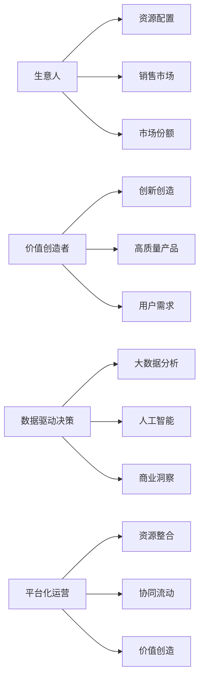
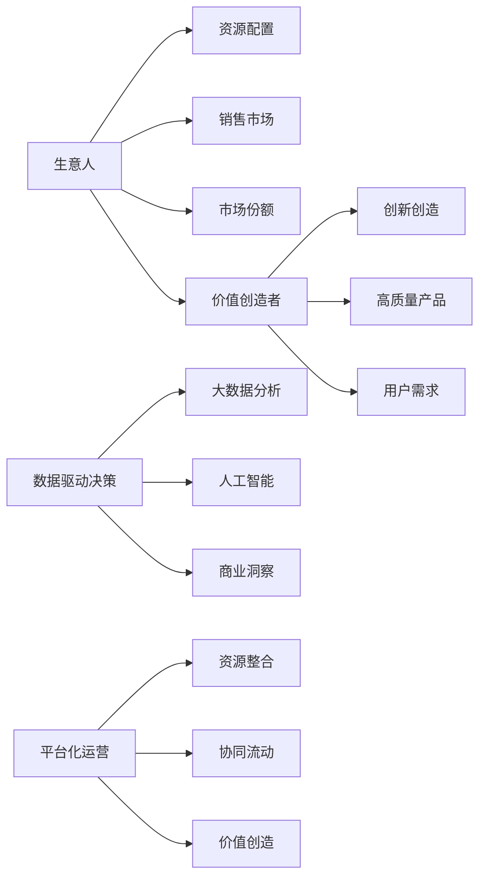

                 

# 生意人消失：价值创造者的时代来临

## 1. 背景介绍

在信息技术飞速发展的今天，各行各业都面临着前所未有的变革。大数据、云计算、人工智能等技术正重新定义着商业运作的流程和模式，传统商业模式和经营方式已经无法适应新的发展要求。

这种背景下，商业思维发生了根本性转变。传统意义上以生意人为主导的商业模式逐渐被以价值创造者为核心的新型商业模式所取代。企业竞争的核心不再是简单的销售和市场份额，而是如何通过创新和创造价值来保持长期发展。

## 2. 核心概念与联系

### 2.1 核心概念概述

要理解这一转变，我们需要先定义几个核心概念：

- **生意人**：传统商业模式中的关键角色，负责资源的组织和配置，通过买卖差价实现利润最大化。

- **价值创造者**：新商业模式下，企业致力于通过创新和提供高质量的产品与服务，创造独特的价值，以满足用户需求。

- **数据驱动决策**：利用大数据分析和人工智能技术，从海量数据中提取洞察，指导商业决策，提升运营效率。

- **平台化运营**：构建开放、协同、动态的平台，实现资源的有效整合和流动，提升整体价值创造能力。

这些概念之间的关系可以用以下Mermaid流程图表示：



该图展示了从生意人到价值创造者的转变过程，以及数据驱动和平台化运营在此过程中的作用。

### 2.2 核心概念原理和架构的 Mermaid 流程图

以下是生意人到价值创造者转变的具体架构图：



在这个架构图中，生意人通过资源配置和销售市场获得利润，而价值创造者则通过创新创造和高质量产品满足用户需求，最终实现长期价值创造。数据驱动决策和平台化运营则是支持这一转变的关键技术手段。

## 3. 核心算法原理 & 具体操作步骤

### 3.1 算法原理概述

从生意人到价值创造者的转变，本质上是一个从资源配置到价值创造的算法过程。这一过程涉及以下几个关键算法：

1. **大数据分析**：通过收集、处理和分析海量数据，识别市场趋势和用户需求，为价值创造提供数据支持。

2. **人工智能**：利用机器学习和深度学习技术，预测用户行为，优化产品设计，提升运营效率。

3. **平台化运营**：构建开放的平台，实现资源的有效整合和流动，提升整体价值创造能力。

4. **价值评估**：通过数据分析和AI技术，对创新和价值创造过程进行持续评估，确保商业决策的有效性和合理性。

这些算法相互作用，共同推动了从生意人到价值创造者的转变。

### 3.2 算法步骤详解

具体算法步骤如下：

1. **数据收集与处理**：从各个渠道收集用户数据和市场数据，进行清洗、整理和分析，形成可用的数据集。

2. **大数据分析**：利用大数据分析技术，对数据集进行深入挖掘，提取有价值的商业洞察。

3. **人工智能建模**：根据商业洞察，构建机器学习或深度学习模型，进行用户行为预测、产品优化等。

4. **平台化运营**：构建开放平台，实现资源整合和流动，提升整体价值创造能力。

5. **价值评估与反馈**：通过数据分析和AI技术，对价值创造过程进行持续评估，及时调整策略。

6. **迭代优化**：根据评估结果，不断优化算法模型，提升价值创造效果。

### 3.3 算法优缺点

**优点**：
- **高效性**：通过数据驱动和AI技术，实现快速决策和优化，提升运营效率。
- **灵活性**：平台化运营模式，能够灵活应对市场变化和用户需求。
- **创新性**：通过大数据分析和AI建模，不断发现新的商业机会和价值创造点。

**缺点**：
- **技术门槛高**：需要较强的技术能力和资源投入，初期投入成本较大。
- **数据隐私风险**：收集和处理用户数据过程中，可能面临数据隐私和安全问题。
- **技术适应性**：需要企业具备较强的技术适应能力和持续改进能力。

### 3.4 算法应用领域

这一算法范式已经广泛应用于多个行业，包括但不限于：

- **零售业**：通过大数据分析和AI技术，优化库存管理和营销策略，提升用户体验。

- **金融业**：利用AI模型进行风险评估和欺诈检测，提升金融安全和效率。

- **制造业**：通过平台化运营和AI技术，实现智能制造和质量控制，提高生产效率。

- **医疗健康**：利用大数据分析和AI技术，优化诊疗方案和药物研发，提升医疗服务质量。

- **物流业**：通过AI技术和平台化运营，优化路线规划和配送效率，降低成本。

## 4. 数学模型和公式 & 详细讲解 & 举例说明

### 4.1 数学模型构建

基于生意人到价值创造者的转变，我们可以构建如下数学模型：

设 $X$ 为用户数据集，$Y$ 为市场数据集，$Z$ 为创新产品，$V$ 为用户需求，$P$ 为价值创造过程，则模型可以表示为：

$$ P = f(Z,V) = \sum_{i=1}^{n} \alpha_i \cdot F_i(X,Y) $$

其中 $F_i(X,Y)$ 表示第 $i$ 项大数据分析结果，$\alpha_i$ 为权重系数，$f$ 表示价值创造函数。

### 4.2 公式推导过程

对上述模型进行推导，可以得到：

$$ P = \sum_{i=1}^{n} \alpha_i \cdot F_i(X,Y) $$

$$ P = \alpha_1 \cdot F_1(X,Y) + \alpha_2 \cdot F_2(X,Y) + \ldots + \alpha_n \cdot F_n(X,Y) $$

其中 $\alpha_i$ 可以通过机器学习算法（如线性回归、神经网络等）求得。

### 4.3 案例分析与讲解

以零售业为例，大数据分析结果可能包括用户购买行为、市场趋势、竞争对手动态等，通过构建AI模型，可以预测用户需求，优化产品设计，提升用户体验。最终，这些数据和模型结果被整合到价值创造过程中，形成持续迭代优化的闭环。

## 5. 项目实践：代码实例和详细解释说明

### 5.1 开发环境搭建

在进行项目实践前，需要先搭建好开发环境。这里以 Python 为例，使用 PyTorch 和 TensorFlow 进行开发。

1. 安装 Python 环境
   ```bash
   python -m venv myenv
   source myenv/bin/activate
   ```

2. 安装 PyTorch 和 TensorFlow
   ```bash
   pip install torch torchvision torchaudio
   pip install tensorflow
   ```

3. 安装其他依赖库
   ```bash
   pip install pandas numpy scikit-learn
   ```

### 5.2 源代码详细实现

以下是一个简单的 Python 代码示例，演示如何使用 PyTorch 进行大数据分析和价值创造：

```python
import torch
import torch.nn as nn
import torch.optim as optim
import pandas as pd
import numpy as np

# 数据加载与预处理
data = pd.read_csv('data.csv')
X = data.drop('target', axis=1)
Y = data['target']

# 构建模型
class Model(nn.Module):
    def __init__(self):
        super(Model, self).__init__()
        self.fc1 = nn.Linear(10, 20)
        self.fc2 = nn.Linear(20, 10)
        self.fc3 = nn.Linear(10, 1)
        
    def forward(self, x):
        x = torch.relu(self.fc1(x))
        x = torch.relu(self.fc2(x))
        x = self.fc3(x)
        return x

model = Model()
criterion = nn.MSELoss()
optimizer = optim.Adam(model.parameters(), lr=0.01)

# 训练模型
for epoch in range(100):
    optimizer.zero_grad()
    outputs = model(X)
    loss = criterion(outputs, Y)
    loss.backward()
    optimizer.step()
    print(f"Epoch {epoch+1}, Loss: {loss:.4f}")

# 预测新数据
test_data = pd.read_csv('test_data.csv')
X_test = test_data.drop('target', axis=1)
Y_test = test_data['target']
outputs = model(X_test)
print(f"Predicted values: {outputs}")
```

### 5.3 代码解读与分析

上述代码实现了一个简单的神经网络模型，用于处理和分析数据，并预测用户需求。具体解读如下：

- 首先，使用 pandas 加载数据，并将其分为特征和目标变量。
- 然后，定义了一个包含三层全连接层的神经网络模型。
- 使用 torch 的 nn 模块和 optim 模块，构建损失函数和优化器。
- 通过训练循环，使用 Adam 优化器更新模型参数，最小化损失函数。
- 最后，使用训练好的模型对新数据进行预测，并输出预测结果。

## 6. 实际应用场景

### 6.1 零售业

在零售业中，企业可以利用大数据分析和AI技术，进行需求预测、库存管理、个性化推荐等，提升用户体验和销售效果。

**案例**：某电商平台通过分析用户购买行为和浏览历史，利用深度学习模型预测用户需求，并根据预测结果进行个性化推荐，显著提升了用户转化率和销售额。

### 6.2 金融业

在金融业中，企业可以利用AI技术进行风险评估、欺诈检测、投资组合优化等，提升金融安全和效率。

**案例**：某银行利用机器学习模型进行贷款审批和风险评估，显著降低了贷款违约率，提升了金融服务质量。

### 6.3 制造业

在制造业中，企业可以利用AI技术进行质量控制、生产优化、设备维护等，提高生产效率和产品质量。

**案例**：某汽车制造商利用机器学习模型对生产线和设备进行实时监控和预测性维护，减少了停机时间和生产成本。

### 6.4 未来应用展望

未来，随着技术不断进步，大数据分析和AI技术将进一步渗透到更多领域，推动各行业向价值创造者转型。

1. **智慧城市**：通过大数据分析和AI技术，优化城市交通、能源管理、公共安全等，提升城市治理效率和居民生活质量。

2. **医疗健康**：利用AI技术进行疾病预测、诊疗方案优化、药物研发等，提升医疗服务质量和效率。

3. **农业**：利用大数据分析和AI技术进行精准农业、病虫害预测、资源管理等，提升农业生产效率和可持续性。

4. **智能制造**：利用AI技术进行智能制造、质量控制、设备维护等，提高生产效率和产品质量。

5. **智能交通**：利用大数据分析和AI技术进行交通流量预测、智能调度、自动驾驶等，提升交通效率和安全。

6. **智慧能源**：利用AI技术进行能源消耗预测、智能调度、能源管理等，提升能源利用效率和可持续性。

## 7. 工具和资源推荐

### 7.1 学习资源推荐

1. **《机器学习》课程**：斯坦福大学Andrew Ng教授的机器学习课程，系统讲解机器学习的基本概念和算法。

2. **《深度学习》课程**：吴恩达的深度学习课程，深入介绍深度学习的理论和实践。

3. **《数据科学导论》书籍**：本书系统介绍数据科学的基本概念和方法，适合入门读者。

4. **《TensorFlow官方文档》**：官方文档是学习TensorFlow的最佳资源，包含详细的API和示例代码。

5. **《PyTorch官方文档》**：官方文档是学习PyTorch的最佳资源，包含详细的API和示例代码。

### 7.2 开发工具推荐

1. **Jupyter Notebook**：Jupyter Notebook是一个非常实用的开发工具，支持代码编写、数据可视化、结果展示等。

2. **Google Colab**：Google提供的免费在线开发环境，支持GPU计算，适合深度学习项目开发。

3. **PyCharm**：Python开发工具，支持代码编写、调试、测试、版本控制等，适合大规模项目开发。

4. **TensorFlow Eager**：TensorFlow的Eager模式，支持动态图和静态图计算，适合快速原型开发和实验。

5. **PyTorch Lightning**：PyTorch的高级框架，支持快速搭建、训练和部署深度学习模型，适合大规模模型开发。

### 7.3 相关论文推荐

1. **《深度学习》书籍**：Ian Goodfellow的深度学习经典书籍，涵盖深度学习的基本概念和算法。

2. **《大数据分析》书籍**：Yanping Qin的大数据分析经典书籍，涵盖大数据分析的基本概念和方法。

3. **《智能系统与软件工程》书籍**：Alan Kay的智能系统与软件工程经典书籍，涵盖智能系统设计和软件工程的基本概念和方法。

4. **《人工智能与机器学习》书籍**：Erich Reitner的人工智能与机器学习经典书籍，涵盖人工智能和机器学习的基本概念和方法。

## 8. 总结：未来发展趋势与挑战

### 8.1 研究成果总结

本文从生意人到价值创造者的转变出发，探讨了大数据、人工智能等技术在各行业中的应用，展示了从传统商业模式向价值创造者转型的趋势。

### 8.2 未来发展趋势

未来，大数据和AI技术将在更多领域得到应用，推动各行业向价值创造者转型。

1. **技术融合**：大数据和AI技术将与其他技术手段（如区块链、物联网、云计算等）进行深度融合，推动各行业智能化发展。

2. **行业渗透**：大数据和AI技术将渗透到更多行业，推动各行业向价值创造者转型，提升各行业效率和竞争力。

3. **个性化服务**：利用大数据和AI技术，实现个性化服务和推荐，提升用户体验和满意度。

4. **协同治理**：利用大数据和AI技术，实现各行业协同治理，提升整体治理效率和效果。

5. **可持续发展**：利用大数据和AI技术，推动各行业向可持续发展方向发展，提升资源利用效率和环境友好性。

### 8.3 面临的挑战

虽然大数据和AI技术带来了诸多机遇，但在实际应用中仍然面临诸多挑战。

1. **数据隐私**：数据收集和使用过程中，可能面临数据隐私和安全问题，需要采取严格的数据保护措施。

2. **技术门槛**：大数据和AI技术需要较强的技术能力和资源投入，企业需要具备较强的技术适应能力。

3. **模型解释性**：大数据和AI模型的决策过程缺乏可解释性，难以对其进行分析和调试。

4. **伦理和道德**：大数据和AI模型的应用可能涉及伦理和道德问题，需要制定相应的政策和规范。

5. **数据质量**：大数据和AI模型依赖于高质量的数据，数据质量不高可能导致模型效果不佳。

### 8.4 研究展望

未来，需要在以下几个方面进行深入研究：

1. **数据隐私保护**：开发更加安全、可靠的数据隐私保护技术，确保数据使用的合法性和合规性。

2. **模型解释性**：开发可解释性更强的大数据和AI模型，提升模型的可解释性和可信度。

3. **模型优化**：进一步优化大数据和AI模型的算法和架构，提升模型的性能和效率。

4. **跨领域应用**：开发更加灵活、通用的大数据和AI模型，支持跨领域应用，提升模型的应用范围和效果。

## 9. 附录：常见问题与解答

**Q1：大数据和AI技术能否取代生意人？**

A: 大数据和AI技术可以辅助生意人进行决策和优化，但无法完全取代生意人。生意人依然具备市场洞察、资源配置等核心能力，能够在商业环境中发挥重要作用。

**Q2：大数据和AI技术的优势是什么？**

A: 大数据和AI技术的优势在于：

1. **高效性**：通过数据分析和AI模型，实现快速决策和优化，提升运营效率。

2. **灵活性**：平台化运营模式，能够灵活应对市场变化和用户需求。

3. **创新性**：通过大数据分析和AI建模，不断发现新的商业机会和价值创造点。

**Q3：大数据和AI技术的劣势是什么？**

A: 大数据和AI技术的劣势在于：

1. **技术门槛高**：需要较强的技术能力和资源投入，初期投入成本较大。

2. **数据隐私风险**：数据收集和使用过程中，可能面临数据隐私和安全问题。

3. **技术适应性**：需要企业具备较强的技术适应能力和持续改进能力。

**Q4：如何选择合适的技术方案？**

A: 选择合适的技术方案需要考虑以下几个因素：

1. **数据规模**：根据数据规模选择合适的技术和工具。

2. **应用场景**：根据应用场景选择合适的技术和工具。

3. **技术能力**：根据技术能力选择合适的技术和工具。

4. **成本效益**：根据成本效益选择合适的技术和工具。

**Q5：如何防范数据隐私风险？**

A: 防范数据隐私风险需要采取以下措施：

1. 严格的数据收集和使用政策，确保数据使用的合法性和合规性。

2. 使用加密技术和匿名化处理，保护数据隐私。

3. 建立数据安全机制，防止数据泄露和滥用。

4. 定期进行数据安全审计，发现和修复潜在风险。

5. 提供数据访问和使用的透明性和可追溯性，确保数据使用的可控性。

---

作者：禅与计算机程序设计艺术 / Zen and the Art of Computer Programming

