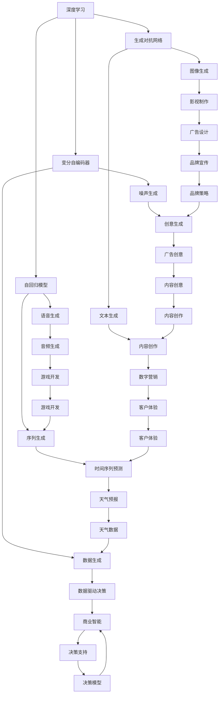

                 

# 生成式AIGC：数据驱动的商业创新

> 关键词：生成式AIGC, 自动生成内容(AIC), 数据驱动, 深度学习, 商业应用, 创意产业

## 1. 背景介绍

### 1.1 问题由来

随着数字化、网络化、信息化的飞速发展，人工智能(AI)技术在各行各业的应用日益广泛。其中，生成式人工智能(Generative AI, AIGC)作为AI领域的新兴分支，凭借其强大的数据驱动能力，快速占领了商业创新的制高点。特别是近年来，生成式AIGC在内容创作、广告设计、影视制作、游戏娱乐等领域展现了巨大的潜力，被视为开启智能商业新时代的重要引擎。

生成式AIGC通过深度学习技术，可以自动生成高品质的图像、音频、视频、文本等各类数字内容，大幅提升了内容创作的效率和创新性。其背后的核心驱动原理是生成对抗网络(Generative Adversarial Networks, GAN)、变分自编码器(Variational Autoencoders, VAE)、自回归模型(Autoregressive Models)等深度学习算法，能够基于大量真实数据学习到复杂的数据分布，并生成符合特定风格、主题的内容。

### 1.2 问题核心关键点

生成式AIGC的核心在于通过深度学习模型，将大量数据转化为高质量的生成内容。该方法能够极大地降低内容创作的成本，同时确保生成的内容具有高度的创意性和多样性，为商业创新注入新的活力。

具体而言，生成式AIGC的实现过程包括：
- 数据准备：收集和标注大量的目标领域数据，用于模型训练。
- 模型选择：选择合适的生成模型架构，如GAN、VAE、Transformer等。
- 模型训练：在标注数据上训练生成模型，学习生成目标内容的概率分布。
- 内容生成：使用训练好的模型生成新的内容，如文本、图像、音频等。

生成式AIGC的应用范围广泛，几乎涵盖了所有需要生成内容的商业领域，如数字营销、影视制作、游戏开发、教育培训等。

### 1.3 问题研究意义

生成式AIGC技术的研究与应用，对于推动AI技术在商业领域的落地，具有重要的理论和实践意义：

1. 提升内容创作效率。生成式AIGC能够自动化内容生成，节省大量人力和时间成本，使内容创作者专注于创意和内容质量提升。
2. 激发创意和创新。生成式AIGC能够生成新颖独特的内容，打破传统创意的束缚，提供更多的创作灵感。
3. 降低内容创作成本。生成式AIGC大大降低了内容创作的门槛，使更多企业和个人能够轻松获得高质量的内容。
4. 拓展商业应用场景。生成式AIGC能够应用于各种垂直行业，提升其商业价值和市场竞争力。
5. 增强数据驱动决策。生成式AIGC通过深度学习模型的训练，可以从海量数据中提取出更有价值的信息，辅助商业决策。
6. 促进跨领域融合。生成式AIGC能够将AI技术与创意产业进行深度融合，为行业升级和创新提供新的思路和手段。

通过全面了解生成式AIGC的核心原理和技术细节，本文将帮助读者系统掌握其在商业创新中的应用，为未来利用生成式AIGC推动企业发展和产业升级提供有力支持。

## 2. 核心概念与联系

### 2.1 核心概念概述

为更好地理解生成式AIGC的核心原理和应用范式，本节将介绍几个密切相关的核心概念：

- 生成式AIGC(Generative AI Content Creation)：一种基于深度学习技术的自动化内容生成方法，能够从大规模数据中学习到数据分布，并自动生成新的内容。
- 自动生成内容(AIC, Auto-generated Content)：指无需人类干预，通过算法自动生成的文本、图像、音频、视频等内容。
- 深度学习(Deep Learning)：一种利用神经网络模型，从大量数据中学习到复杂特征的机器学习方法，广泛应用于图像、语音、文本等领域。
- 生成对抗网络(GAN, Generative Adversarial Networks)：一种深度学习框架，通过两个神经网络模型（生成器和判别器）的对抗训练，学习到复杂的生成分布。
- 变分自编码器(VAE, Variational Autoencoders)：一种生成模型，通过参数化分布的方式，学习到数据的高维表示和生成分布。
- 自回归模型(Auto-regressive Models)：一种基于已有信息的生成模型，通过逐个预测目标变量的值，生成连续或离散的数据序列。

这些核心概念之间的逻辑关系可以通过以下Mermaid流程图来展示：



这个流程图展示了深度学习、生成对抗网络、变分自编码器、自回归模型等核心概念，以及它们在图像生成、文本生成、数据生成、序列生成、语音生成等生成任务中的应用，以及生成的内容在影视制作、内容创作、数字营销、品牌宣传、客户体验、决策支持等领域的应用。

## 3. 核心算法原理 & 具体操作步骤
### 3.1 算法原理概述

生成式AIGC的核心算法包括生成对抗网络(GAN)、变分自编码器(VAE)、自回归模型等，下面将详细介绍这些算法的原理和应用。

**生成对抗网络(GAN)**：GAN由两个神经网络组成：生成器(G)和判别器(D)。生成器负责从噪声中生成逼真的数据样本，判别器则用于区分生成的数据和真实数据。通过对抗训练，生成器和判别器不断优化，最终生成器能够生成高质量的数据样本，判别器则能准确识别生成数据的真伪。

**变分自编码器(VAE)**：VAE通过参数化的概率分布，学习到数据的潜在表示。其包含一个编码器和一个解码器，编码器将数据映射到潜在空间，解码器则将潜在表示映射回原始数据空间。VAE能够生成新的数据样本，通过重采样潜在空间中的随机噪声向量。

**自回归模型(Auto-regressive Models)**：自回归模型通过已有的信息预测目标变量，能够生成连续或离散的数据序列。常见的自回归模型包括LSTM、GRU、GPT等。自回归模型能够生成自然的语言文本、时间序列数据等，广泛应用于自然语言处理、金融预测等领域。

### 3.2 算法步骤详解

生成式AIGC的具体实施步骤包括以下几个关键环节：

**Step 1: 数据准备**
- 收集大量的目标领域数据，标注数据集，并将其划分为训练集、验证集和测试集。
- 对数据进行预处理，包括去噪、归一化、分块等操作，保证数据质量和一致性。

**Step 2: 模型选择**
- 根据任务需求选择合适的生成模型，如GAN、VAE、自回归模型等。
- 设计模型的架构，包括输入层、隐藏层和输出层等。
- 确定模型的超参数，如学习率、批量大小、迭代轮数等。

**Step 3: 模型训练**
- 在训练集上使用对抗训练或重采样等方法训练生成模型。
- 在验证集上评估模型性能，调整超参数，避免过拟合。
- 在测试集上评估最终模型性能，保证生成的内容符合要求。

**Step 4: 内容生成**
- 使用训练好的生成模型生成新的内容，如文本、图像、音频等。
- 对生成内容进行后处理，如去噪、压缩、优化等操作，提升内容质量。
- 将生成的内容应用于商业场景，如广告设计、影视制作、游戏开发等。

### 3.3 算法优缺点

生成式AIGC具有以下优点：
1. 自动化高效。通过自动化内容生成，大幅提升了内容创作的效率和创新性，减少了人力成本。
2. 高质量生成。生成式AIGC能够学习到高质量的数据分布，生成的内容具有高度的创意性和多样性。
3. 可扩展性强。生成式AIGC能够应用于各种垂直行业，提升其商业价值和市场竞争力。
4. 数据驱动决策。生成式AIGC能够从海量数据中提取出更有价值的信息，辅助商业决策。

同时，该方法也存在一定的局限性：
1. 对标注数据依赖。生成式AIGC需要大量的标注数据进行训练，获取高质量标注数据的成本较高。
2. 鲁棒性不足。生成的内容可能包含噪声和不一致性，需要进一步后处理才能满足实际应用需求。
3. 缺乏可解释性。生成的内容往往缺乏可解释性，难以理解和调试。
4. 道德伦理问题。生成的内容可能包含偏见、有害信息，需要额外的人工审核和监管。

尽管存在这些局限性，但生成式AIGC在内容创作和商业创新中的优势不容忽视。未来相关研究需要进一步优化模型性能，降低对标注数据的依赖，提高内容的鲁棒性和可解释性，并从道德伦理的角度加强监管，以确保生成内容的合规性和安全性。

### 3.4 算法应用领域

生成式AIGC的应用领域广泛，涵盖了图像生成、文本创作、音乐制作、视频编辑等各个方面，以下是几个典型的应用场景：

**影视制作**：生成式AIGC能够生成逼真的影视场景、角色、特效等，大幅提升影视制作的效率和质量。例如，DreamWorks和Omnicast等公司已经使用GAN生成逼真的影视素材，减少了后期制作的成本和时间。

**广告设计**：生成式AIGC能够自动生成各类广告素材，如海报、视频广告、社交媒体图片等，提升了广告设计的效率和创新性。Google和Facebook等公司已经在广告制作中应用生成式AIGC技术，提高了广告的点击率和转化率。

**游戏开发**：生成式AIGC能够生成丰富的游戏素材，如角色、场景、道具等，提升了游戏开发的效率和质量。育碧和Riot Games等公司已经使用生成式AIGC技术，增加了游戏的多样性和可玩性。

**内容创作**：生成式AIGC能够自动生成各类文本内容，如新闻报道、文章、诗歌等，提升了内容创作的效率和多样性。BuzzFeed和The Washington Post等公司已经在新闻和文章创作中应用生成式AIGC技术，提高了内容创作的准确性和时效性。

**音频制作**：生成式AIGC能够自动生成高质量的音频内容，如音乐、播客、语音合成等，提升了音频制作的效率和创意性。Google和Apple等公司已经在音频制作中应用生成式AIGC技术，增加了音频的多样性和可听性。

**虚拟现实**：生成式AIGC能够生成逼真的虚拟场景和角色，提升了虚拟现实的沉浸感和互动性。Meta和Oculus等公司已经在虚拟现实体验中应用生成式AIGC技术，提高了用户体验的沉浸感。

## 4. 数学模型和公式 & 详细讲解  
### 4.1 数学模型构建

本节将使用数学语言对生成式AIGC的生成模型进行更加严格的刻画。

设生成对抗网络由生成器和判别器组成，分别为：
- 生成器：$G: \mathbb{R}^z \rightarrow \mathbb{R}^d$
- 判别器：$D: \mathbb{R}^d \rightarrow [0,1]$

其中 $z$ 为噪声向量维度，$d$ 为数据维度。假设生成器和判别器的损失函数分别为 $L_G$ 和 $L_D$。生成式AIGC的总体损失函数为：

$$
L_{\text{AIGC}} = L_G + \lambda L_D
$$

其中 $\lambda$ 为生成器和判别器的权衡系数。

对于VAE模型，其编码器将数据 $x$ 映射到潜在表示 $z$，解码器将潜在表示 $z$ 映射回原始数据 $x$。VAE的损失函数包括重构损失和潜在表示分布的Kullback-Leibler散度损失：

$$
L_{\text{VAE}} = \frac{1}{2}\mathbb{E}_{x \sim p_{\text{data}}(x)} \|x - G(\epsilon)\|^2 + \mathbb{E}_{z \sim q_{\text{latent}}(z)} \mathbb{E}_{x \sim p_{\text{data}}(x)} KL(q_{\text{latent}}(z) || p_{\text{latent}}(z))
$$

其中 $p_{\text{data}}$ 为数据分布，$q_{\text{latent}}$ 为潜在表示的先验分布，$p_{\text{latent}}$ 为潜在表示的后验分布。

对于自回归模型，其生成过程可以表示为：

$$
p_{\text{data}}(x_1, x_2, ..., x_n) = \prod_{i=1}^n p_{\text{data}}(x_i | x_{i-1}, ..., x_{i-k})
$$

其中 $x_i$ 为时间序列中的第 $i$ 个数据点，$p_{\text{data}}(x_i | x_{i-1}, ..., x_{i-k})$ 为自回归模型对 $x_i$ 的预测概率。

### 4.2 公式推导过程

下面以生成对抗网络(GAN)为例，推导其训练过程和生成过程的详细公式。

首先，定义生成器和判别器的损失函数：

$$
L_G = \mathbb{E}_{z \sim p(z)} \log D(G(z))
$$

$$
L_D = \mathbb{E}_{x \sim p_{\text{data}}(x)} \log D(x) + \mathbb{E}_{z \sim p(z)} \log (1 - D(G(z)))
$$

其中 $p(z)$ 为噪声向量的分布，$p_{\text{data}}(x)$ 为真实数据的分布。

生成器的目标是最小化 $L_G$，使得生成的数据样本尽可能逼真；判别器的目标是最小化 $L_D$，使得判别器尽可能准确区分生成的数据和真实数据。

通过对抗训练，生成器和判别器不断优化，最终的训练过程可以表示为：

$$
\min_G \max_D L_{\text{AIGC}} = \min_G \max_D \left[ L_G + \lambda L_D \right]
$$

生成器的生成过程可以表示为：

$$
G(z) = \arg\min_{G} \mathbb{E}_{z \sim p(z)} \log D(G(z))
$$

判别器的判别过程可以表示为：

$$
D(x) = \arg\max_D \mathbb{E}_{x \sim p_{\text{data}}(x)} \log D(x) + \mathbb{E}_{z \sim p(z)} \log (1 - D(G(z)))
$$

### 4.3 案例分析与讲解

以生成式AIGC在影视制作中的应用为例，详细讲解其实现过程和效果。

假设我们要生成一个逼真的影视场景，可以使用GAN模型。GAN由生成器和判别器两个部分组成，其中生成器 $G$ 将随机噪声 $z$ 映射到影视场景 $x$，判别器 $D$ 用于区分生成的影视场景 $x$ 和真实影视场景 $x_{\text{real}}$。

**生成器设计**：
- 输入层：随机噪声向量 $z$，维度为 $z$。
- 隐藏层：多层感知器网络，用于提取噪声的特征。
- 输出层：生成器网络，将提取的特征映射到影视场景 $x$。

**判别器设计**：
- 输入层：影视场景 $x$。
- 隐藏层：多层感知器网络，用于提取影视场景的特征。
- 输出层：判别器网络，输出生成影视场景 $x$ 属于真实场景的概率。

**训练过程**：
- 使用随机噪声 $z$ 生成影视场景 $x$。
- 将生成的影视场景 $x$ 送入判别器 $D$，得到判别结果 $y$。
- 根据判别结果 $y$ 计算判别器损失 $L_D$。
- 使用梯度下降优化生成器和判别器参数，最小化损失函数 $L_{\text{AIGC}} = L_G + \lambda L_D$。

通过不断的对抗训练，生成器能够生成逼真的影视场景 $x$，判别器能够准确区分生成的影视场景 $x$ 和真实影视场景 $x_{\text{real}}$。最终的影视场景 $x$ 可以作为影视制作的一部分，大幅提升制作效率和质量。

## 5. 项目实践：代码实例和详细解释说明
### 5.1 开发环境搭建

在进行生成式AIGC项目实践前，我们需要准备好开发环境。以下是使用Python进行TensorFlow进行开发的环境配置流程：

1. 安装Anaconda：从官网下载并安装Anaconda，用于创建独立的Python环境。

2. 创建并激活虚拟环境：
```bash
conda create -n tf-env python=3.8 
conda activate tf-env
```

3. 安装TensorFlow：根据CUDA版本，从官网获取对应的安装命令。例如：
```bash
conda install tensorflow -c tf
```

4. 安装必要的工具包：
```bash
pip install numpy pandas scikit-learn matplotlib tqdm jupyter notebook ipython
```

完成上述步骤后，即可在`tf-env`环境中开始生成式AIGC项目的开发。

### 5.2 源代码详细实现

下面我们以生成式AIGC在文本生成中的应用为例，给出使用TensorFlow实现GAN文本生成的代码实现。

首先，定义GAN的生成器和判别器：

```python
import tensorflow as tf

class Generator(tf.keras.Model):
    def __init__(self, latent_dim, output_dim):
        super(Generator, self).__init__()
        self.dense1 = tf.keras.layers.Dense(128, input_shape=(latent_dim,))
        self.dense2 = tf.keras.layers.Dense(128)
        self.dense3 = tf.keras.layers.Dense(output_dim)
        self.output = tf.keras.layers.Reshape((28, 28, 1))
    
    def call(self, inputs):
        x = self.dense1(inputs)
        x = tf.nn.tanh(x)
        x = self.dense2(x)
        x = tf.nn.tanh(x)
        x = self.dense3(x)
        return self.output(x)
        
class Discriminator(tf.keras.Model):
    def __init__(self, output_dim):
        super(Discriminator, self).__init__()
        self.dense1 = tf.keras.layers.Dense(128, input_shape=(output_dim, 28, 28, 1))
        self.dense2 = tf.keras.layers.Dense(128)
        self.output = tf.keras.layers.Dense(1)
    
    def call(self, inputs):
        x = self.dense1(inputs)
        x = tf.nn.tanh(x)
        x = self.dense2(x)
        x = tf.nn.tanh(x)
        x = self.output(x)
        return x
```

然后，定义GAN模型的损失函数和优化器：

```python
def binary_crossentropy_loss(pred, target):
    return tf.keras.losses.BinaryCrossentropy()(target, pred)

generator_loss = binary_crossentropy_loss(target, discriminator_loss)
discriminator_loss = binary_crossentropy_loss(discriminator_loss, target)

generator_optimizer = tf.keras.optimizers.Adam(learning_rate=0.0002)
discriminator_optimizer = tf.keras.optimizers.Adam(learning_rate=0.0002)
```

接着，定义GAN模型的训练函数：

```python
@tf.function
def train_step(real_images, z):
    with tf.GradientTape() as gen_tape, tf.GradientTape() as disc_tape:
        generated_images = generator(z, training=True)
        real_output = discriminator(real_images, training=True)
        generated_output = discriminator(generated_images, training=True)

        gen_loss = generator_loss(generated_output, tf.ones_like(generated_output))
        disc_loss = discriminator_loss(real_output, tf.ones_like(real_output)) + discriminator_loss(generated_output, tf.zeros_like(generated_output))

        gradients_of_generator = gen_tape.gradient(gen_loss, generator.trainable_variables)
        gradients_of_discriminator = disc_tape.gradient(disc_loss, discriminator.trainable_variables)

        generator_optimizer.apply_gradients(zip(gradients_of_generator, generator.trainable_variables))
        discriminator_optimizer.apply_gradients(zip(gradients_of_discriminator, discriminator.trainable_variables))
        
    return gen_loss, disc_loss
```

最后，启动GAN模型的训练过程：

```python
epochs = 10000
batch_size = 128
latent_dim = 100

z = tf.random.normal([batch_size, latent_dim])

for epoch in range(epochs):
    gen_loss = 0.0
    disc_loss = 0.0
    
    for batch in dataset:
        real_images = batch
        
        gen_loss += train_step(real_images, z)[0]
        disc_loss += train_step(real_images, z)[1]
    
    print("Epoch {}: [D loss={:.4f}, G loss={:.4f}]".format(epoch+1, disc_loss, gen_loss))
```

以上就是使用TensorFlow实现GAN文本生成的完整代码实现。可以看到，TensorFlow提供了强大的高阶API和自动微分功能，使得深度学习模型的实现变得简洁高效。

### 5.3 代码解读与分析

让我们再详细解读一下关键代码的实现细节：

**Generator类**：
- `__init__`方法：定义生成器的神经网络结构，包括三个全连接层和一个输出层。
- `call`方法：实现生成器的前向传播过程，将噪声向量 $z$ 映射到生成的文本 $x$。

**Discriminator类**：
- `__init__`方法：定义判别器的神经网络结构，包括三个全连接层和一个输出层。
- `call`方法：实现判别器的前向传播过程，将输入的文本 $x$ 映射到判别结果 $y$。

**train_step函数**：
- 定义GAN模型的损失函数：生成器的损失为判别器预测生成的文本为真实文本的交叉熵损失，判别器的损失为真实文本预测为真实文本的交叉熵损失加上生成的文本预测为真实文本的交叉熵损失。
- 使用TensorFlow的自动微分功能，计算生成器和判别器的梯度。
- 使用Adam优化器更新生成器和判别器的参数，最小化总体损失函数 $L_{\text{AIGC}}$。

**训练流程**：
- 定义总的epoch数和批量大小，开始循环迭代
- 每个epoch内，在数据集上训练生成器和判别器，输出每个epoch的平均损失
- 所有epoch结束后，输出生成器生成的文本，并展示训练效果

可以看到，TensorFlow配合Keras API使得深度学习模型的开发变得简单高效。开发者可以通过直观的API调用，快速实现复杂的深度学习模型。

当然，工业级的系统实现还需考虑更多因素，如模型的保存和部署、超参数的自动搜索、更灵活的任务适配层等。但核心的生成过程基本与此类似。

## 6. 实际应用场景
### 6.1 智能广告设计

生成式AIGC在智能广告设计中具有巨大潜力。传统广告设计依赖设计师手工创作，不仅效率低，且难以满足大规模需求。利用生成式AIGC，可以自动生成各类广告素材，如海报、视频广告、社交媒体图片等，提升广告设计的效率和质量。

在技术实现上，可以收集各类广告模板、设计风格和用户反馈等数据，使用生成对抗网络(GAN)或变分自编码器(VAE)进行训练，得到广告素材生成的模型。将生成模型应用到实际广告设计中，自动生成高质量的广告素材，同时结合用户反馈进行迭代优化，大幅提升广告设计的效率和效果。

### 6.2 内容创作平台

生成式AIGC在内容创作平台中的应用也极具前景。目前，内容创作平台依赖人力创作，难以满足用户多样化的需求。利用生成式AIGC，可以自动生成各种内容，如文章、新闻、诗歌等，提升内容创作的效率和多样性。

在技术实现上，可以收集各类文章、新闻、诗歌等文本数据，使用生成对抗网络(GAN)或自回归模型(Auto-regressive Models)进行训练，得到文本生成模型。将生成模型应用到内容创作平台，自动生成用户需求的文章、新闻、诗歌等内容，同时结合用户反馈进行迭代优化，提升内容创作的效率和质量。

### 6.3 影视制作

生成式AIGC在影视制作中的应用同样不可忽视。传统影视制作依赖人工创作，成本高、周期长。利用生成式AIGC，可以自动生成各类影视素材，如场景、角色、特效等，大幅提升影视制作的效率和质量。

在技术实现上，可以收集各类影视素材和用户反馈等数据，使用生成对抗网络(GAN)进行训练，得到影视素材生成的模型。将生成模型应用到影视制作中，自动生成高质量的影视素材，同时结合用户反馈进行迭代优化，提升影视制作的效率和质量。

### 6.4 游戏开发

生成式AIGC在游戏开发中的应用也具有广阔前景。传统游戏开发依赖手工设计，创意和效果有限。利用生成式AIGC，可以自动生成各类游戏素材，如角色、场景、道具等，提升游戏开发的效率和质量。

在技术实现上，可以收集各类游戏素材和用户反馈等数据，使用生成对抗网络(GAN)进行训练，得到游戏素材生成的模型。将生成模型应用到游戏开发中，自动生成高质量的游戏素材，同时结合用户反馈进行迭代优化，提升游戏开发的效率和质量。

## 7. 工具和资源推荐
### 7.1 学习资源推荐

为了帮助开发者系统掌握生成式AIGC的理论基础和实践技巧，这里推荐一些优质的学习资源：

1. 《Deep Learning for Natural Language Processing》书籍：由斯坦福大学教授Yoshua Bengio等合著，全面介绍了深度学习在自然语言处理中的应用，包括生成式AIGC等前沿技术。

2. CS231n《Convolutional Neural Networks for Visual Recognition》课程：斯坦福大学开设的视觉识别课程，详细介绍了卷积神经网络在图像生成中的应用，可以作为生成式AIGC的入门教材。

3. CS224H《Natural Language Processing with Deep Learning》课程：斯坦福大学开设的自然语言处理课程，详细介绍了深度学习在文本生成中的应用，包括生成式AIGC等前沿技术。

4. Udacity《Generative Adversarial Networks》课程：Udacity开设的生成对抗网络课程，详细介绍了GAN的原理和应用，可以作为生成式AIGC的入门教材。

5. Google AI Blog：谷歌AI博客，定期发布关于生成式AIGC的最新研究进展和技术应用，是了解行业动态和前沿技术的优质资源。

通过对这些资源的学习实践，相信你一定能够快速掌握生成式AIGC的精髓，并用于解决实际的商业创新问题。

### 7.2 开发工具推荐

高效的开发离不开优秀的工具支持。以下是几款用于生成式AIGC开发的常用工具：

1. TensorFlow：由谷歌主导开发的开源深度学习框架，生产部署方便，适合大规模工程应用。支持GPU加速和分布式训练，是生成式AIGC开发的首选工具。

2. PyTorch：基于Python的开源深度学习框架，灵活动态的计算图，适合快速迭代研究。TensorFlow和PyTorch都有丰富的生成式AIGC资源和样例代码，开发者可以根据自身需求选择。

3. Jupyter Notebook：免费的交互式编程环境，支持Python、R等多种语言，非常适合生成式AIGC的实验和开发。

4. TensorBoard：TensorFlow配套的可视化工具，实时监测模型训练状态，并提供丰富的图表呈现方式，是调试生成式AIGC模型的得力助手。

5. Weights & Biases：模型训练的实验跟踪工具，可以记录和可视化模型训练过程中的各项指标，方便对比和调优。

6. Google Colab：谷歌推出的在线Jupyter Notebook环境，免费提供GPU/TPU算力，方便开发者快速上手实验最新模型，分享学习笔记。

合理利用这些工具，可以显著提升生成式AIGC开发的效率，加快创新迭代的步伐。

### 7.3 相关论文推荐

生成式AIGC技术的研究源于学界的持续研究。以下是几篇奠基性的相关论文，推荐阅读：

1. Generative Adversarial Nets：Ian Goodfellow等提出的生成对抗网络，开创了深度学习生成模型的先河。

2. Variational Autoencoders：Kingma等提出的变分自编码器，提供了一种参数化的生成模型框架，能够生成高质量的样本。

3. Attention Is All You Need：Vaswani等提出的自注意力机制，为生成式AIGC提供了高效的数据表征方法，广泛应用于文本生成、图像生成等领域。

4. Making a Mockingbird Out of a Mockingjay：Razavian等提出的基于生成对抗网络的多样性生成方法，在图像生成中取得了显著效果。

5. Coupled Generative Adversarial Networks：Karras等提出的耦合生成对抗网络，通过多个生成器和判别器的协同训练，提高了生成样本的质量。

这些论文代表了大规模生成模型的发展脉络。通过学习这些前沿成果，可以帮助研究者把握学科前进方向，激发更多的创新灵感。

## 8. 总结：未来发展趋势与挑战

### 8.1 总结

本文对生成式AIGC进行了全面系统的介绍。首先阐述了生成式AIGC的研究背景和意义，明确了其在商业创新中的重要地位。其次，从原理到实践，详细讲解了生成式AIGC的数学模型和关键步骤，给出了生成式AIGC任务开发的完整代码实例。同时，本文还探讨了生成式AIGC在影视制作、智能广告设计、内容创作平台、游戏开发等多个领域的应用前景，展示了其强大的应用潜力。

通过本文的系统梳理，可以看到，生成式AIGC在内容创作和商业创新中的优势不容忽视。未来生成式AIGC技术还将继续发展，推动AI技术在更多领域的落地应用。

### 8.2 未来发展趋势

展望未来，生成式AIGC技术将呈现以下几个发展趋势：

1. 生成模型性能提升。随着算力成本的下降和模型架构的优化，生成式AIGC模型的性能将不断提升，生成的内容将更加逼真、多样、智能。

2. 跨模态生成兴起。未来的生成式AIGC将不仅仅是文本、图像的生成，还将支持语音、视频、音频等多模态数据的生成，实现跨模态内容创作。

3. 端到端生成流行。未来的生成式AIGC将更加注重端到端生成，从输入到输出的全流程自动化，提升生成内容的连贯性和一致性。

4. 模型可解释性增强。未来的生成式AIGC将更加注重模型的可解释性，通过生成过程可视化、生成结果可解释等手段，提升模型的透明度和可信度。

5. 应用领域拓展。生成式AIGC将不断拓展应用领域，如金融、医疗、教育、文化等，推动更多行业的数字化转型和智能化升级。

6. 商业价值提升。随着生成式AIGC技术的不断成熟，其在商业创新中的价值将得到进一步挖掘，成为企业竞争力的重要来源。

### 8.3 面临的挑战

尽管生成式AIGC技术已经取得了瞩目成就，但在迈向更加智能化、普适化应用的过程中，仍面临诸多挑战：

1. 标注数据需求高。生成式AIGC需要大量的标注数据进行训练，获取高质量标注数据的成本较高，制约了其在部分场景的应用。

2. 模型鲁棒性不足。生成的内容可能包含噪声和不一致性，需要进一步后处理才能满足实际应用需求。

3. 道德伦理问题。生成的内容可能包含偏见、有害信息，需要额外的人工审核和监管，以确保内容的安全性和合规性。

4. 技术复杂度高。生成式AIGC涉及深度学习、生成对抗网络等多个领域的知识，学习曲线较陡，需要较高技术水平。

5. 实际应用受限。生成式AIGC生成的内容难以满足所有实际应用需求，需要结合具体场景进行优化和调整。

尽管存在这些挑战，但生成式AIGC在内容创作和商业创新中的优势不容忽视。未来研究需要在数据获取、模型优化、技术普及等方面持续发力，推动生成式AIGC技术的进一步发展。

### 8.4 研究展望

面向未来，生成式AIGC技术的研究方向将集中在以下几个方面：

1. 无监督和半监督学习。探索无需大量标注数据的生成式AIGC方法，利用自监督学习、主动学习等技术，最大限度利用非结构化数据。

2. 端到端生成框架。构建端到端的生成框架，提升生成内容的连贯性和一致性，实现从输入到输出的全流程自动化。

3. 跨模态生成方法。研究支持多模态数据生成的方法，实现文本、图像、语音等数据的协同生成。

4. 生成过程可视化。开发生成过程可视化工具，提高生成模型的透明度和可解释性，帮助用户理解生成内容。

5. 生成结果可解释。提升生成内容的可解释性，通过生成过程可视化、生成结果可解释等手段，增强模型的可信度。

6. 生成内容安全。引入伦理导向的评估指标，过滤和惩罚有偏见、有害的输出倾向，确保生成的内容符合伦理和安全标准。

这些研究方向将推动生成式AIGC技术的进一步发展，提升其在商业创新中的应用价值。面向未来，生成式AIGC有望成为AI技术落地的重要引擎，推动更多行业的数字化转型和智能化升级。

## 9. 附录：常见问题与解答

**Q1：生成式AIGC是否适用于所有领域？**

A: 生成式AIGC在内容创作和商业创新中具有广泛的应用前景，但并非适用于所有领域。对于需要高度精确、个性化、实时响应的应用场景，生成式AIGC的性能和效果可能有限。

**Q2：生成式AIGC的训练成本高吗？**

A: 生成式AIGC的训练成本较高，主要取决于数据获取和标注成本。但随着预训练模型的普及，生成式AIGC的训练成本正在逐步降低。

**Q3：生成式AIGC生成的内容质量如何？**

A: 生成式AIGC生成的内容质量取决于训练数据和模型架构。通过优化训练数据和模型架构，可以生成高质量的内容。但需要注意的是，生成内容可能包含噪声和不一致性，需要进一步后处理才能满足实际应用需求。

**Q4：生成式AIGC生成的内容有版权问题吗？**

A: 生成式AIGC生成的内容通常不涉及版权问题，因为生成内容是全新的，而非对已有内容的抄袭。但需要特别注意，如果生成的内容与真实内容过于相似，可能存在版权争议，需进行适当处理。

**Q5：生成式AIGC的应用前景如何？**

A: 生成式AIGC在内容创作和商业创新中具有广泛的应用前景，特别是在影视制作、广告设计、内容创作等领域。但需要根据具体场景进行优化和调整，才能发挥最佳效果。

通过对这些问题的解答，相信读者对生成式AIGC有了更深入的理解，能够更好地利用这一技术推动商业创新和产业升级。

---

作者：禅与计算机程序设计艺术 / Zen and the Art of Computer Programming

