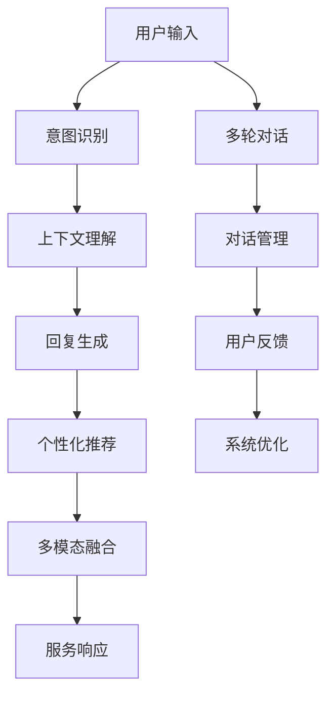

                 

# 用户体验提升：AI如何实现24/7智能客服

## 1. 背景介绍

### 1.1 问题由来

随着人工智能技术的迅猛发展，智能客服系统（AI Chatbot）已经成为许多企业提升客户服务质量的重要工具。传统的客服模式依赖于人力，存在成本高、响应慢、服务质量不稳定等问题。而智能客服系统通过自动化、智能化的方式，可以提供7x24小时的快速响应，显著提升客户满意度，降低运营成本。

近年来，以深度学习和自然语言处理（NLP）技术为基础的智能客服系统已经取得了显著的进展，应用场景也从最初的单一功能（如在线咨询、订单查询）扩展到复杂的业务处理（如理赔、金融咨询）。然而，在实际应用中，智能客服系统仍然面临着诸如上下文理解不清晰、多轮对话不一致、缺乏个性化推荐等挑战。这些问题不仅影响了用户体验，也限制了智能客服系统的普及和应用。

### 1.2 问题核心关键点

为了解决上述问题，提升智能客服系统的用户体验，本文将探讨基于深度学习的智能客服系统设计方法。特别聚焦于以下三个关键点：

1. **上下文理解**：智能客服系统需要在复杂的多轮对话中理解用户意图，保留对话状态，提供连贯的回复。
2. **个性化推荐**：根据用户历史行为和偏好，智能客服系统应能够推荐个性化的服务方案。
3. **多模态融合**：结合文本、语音、图像等多种模态信息，提升智能客服系统的感知和理解能力。

通过深入研究这些核心问题，本文将提供一套基于深度学习的智能客服系统设计方案，帮助企业实现高效、智能、个性化的客户服务体验。

## 2. 核心概念与联系

### 2.1 核心概念概述

为了更好地理解智能客服系统的设计原理，本节将介绍几个密切相关的核心概念：

- **智能客服系统**：指利用深度学习、自然语言处理等技术，自动化的客户服务系统。系统可以理解自然语言输入，自动生成回复，提供个性化推荐，处理复杂业务流程。
- **上下文理解**：指智能客服系统在处理多轮对话时，能够理解并保留对话上下文，提供连贯的回复。
- **个性化推荐**：指智能客服系统能够根据用户历史行为和偏好，推荐个性化的服务方案，提升用户体验。
- **多模态融合**：指智能客服系统能够结合文本、语音、图像等多种模态信息，提升感知和理解能力。

这些核心概念之间存在紧密的联系，共同构成了智能客服系统的设计基础。

### 2.2 核心概念原理和架构的 Mermaid 流程图



这个流程图展示了智能客服系统的核心组件和关键流程：

1. **用户输入**：用户通过文本、语音等多种方式输入需求。
2. **意图识别**：系统解析用户意图，确定服务类型。
3. **上下文理解**：系统保留对话状态，理解上下文信息，提供连贯的回复。
4. **回复生成**：根据意图和上下文，系统自动生成回复。
5. **个性化推荐**：系统根据用户历史行为，推荐个性化的服务方案。
6. **多模态融合**：系统结合多种模态信息，提升感知和理解能力。
7. **服务响应**：系统向用户提供最终服务响应。
8. **多轮对话**：系统支持多轮对话，处理复杂查询。
9. **对话管理**：系统管理对话流程，确保服务质量。
10. **用户反馈**：用户反馈用于系统优化。
11. **系统优化**：系统根据反馈不断优化，提升性能。

## 3. 核心算法原理 & 具体操作步骤

### 3.1 算法原理概述

基于深度学习的智能客服系统设计，主要依赖于以下几个核心算法：

1. **意图识别算法**：用于解析用户输入的意图，确定服务类型。
2. **上下文理解算法**：用于理解多轮对话的上下文信息，保留对话状态。
3. **回复生成算法**：用于根据意图和上下文生成自动回复。
4. **个性化推荐算法**：用于根据用户历史行为推荐个性化服务方案。
5. **多模态融合算法**：用于结合文本、语音、图像等模态信息，提升感知和理解能力。

这些算法共同构成了智能客服系统的核心技术框架，使得系统能够在复杂的用户交互中，提供高效、智能、个性化的服务体验。

### 3.2 算法步骤详解

#### 3.2.1 意图识别算法

意图识别算法主要通过训练文本分类模型来实现。具体步骤如下：

1. **数据准备**：收集用户输入的历史数据，标注意图类别。常用的标注方式包括关键词匹配、句子分类、深度学习分类等。
2. **模型训练**：使用标注好的数据集训练文本分类模型，如CNN、RNN、Transformer等。常用的分类算法包括SVM、随机森林、深度学习等。
3. **模型评估**：使用测试数据集评估模型性能，常用的评价指标包括准确率、召回率、F1值等。
4. **模型优化**：根据评估结果，调整模型参数，优化模型性能。

#### 3.2.2 上下文理解算法

上下文理解算法主要用于保存对话状态，理解多轮对话的上下文信息。具体步骤如下：

1. **序列化处理**：将对话文本序列化，便于模型处理。
2. **模型训练**：使用序列化后的对话数据训练上下文理解模型，如RNN、LSTM、Transformer等。常用的模型包括Seq2Seq、GRU等。
3. **模型评估**：使用测试数据集评估模型性能，常用的评价指标包括BLEU、ROUGE等。
4. **模型优化**：根据评估结果，调整模型参数，优化模型性能。

#### 3.2.3 回复生成算法

回复生成算法主要通过训练生成模型来实现。具体步骤如下：

1. **数据准备**：收集用户输入和回复的历史数据，标注回复内容。
2. **模型训练**：使用标注好的数据集训练生成模型，如Seq2Seq、Transformer等。常用的生成算法包括RNN、LSTM、Transformer等。
3. **模型评估**：使用测试数据集评估模型性能，常用的评价指标包括BLEU、ROUGE等。
4. **模型优化**：根据评估结果，调整模型参数，优化模型性能。

#### 3.2.4 个性化推荐算法

个性化推荐算法主要用于根据用户历史行为和偏好，推荐个性化的服务方案。具体步骤如下：

1. **数据准备**：收集用户历史行为数据，提取特征。
2. **模型训练**：使用标注好的数据集训练推荐模型，如协同过滤、深度学习等。常用的推荐算法包括协同过滤、矩阵分解、深度学习等。
3. **模型评估**：使用测试数据集评估模型性能，常用的评价指标包括准确率、召回率、覆盖率等。
4. **模型优化**：根据评估结果，调整模型参数，优化模型性能。

#### 3.2.5 多模态融合算法

多模态融合算法主要通过融合文本、语音、图像等模态信息，提升感知和理解能力。具体步骤如下：

1. **数据准备**：收集多模态数据，提取特征。
2. **模型训练**：使用融合后的数据集训练多模态模型，如融合网络、深度学习等。常用的融合算法包括Deep Fusion、Multi-modal Attention等。
3. **模型评估**：使用测试数据集评估模型性能，常用的评价指标包括准确率、召回率、F1值等。
4. **模型优化**：根据评估结果，调整模型参数，优化模型性能。

### 3.3 算法优缺点

基于深度学习的智能客服系统设计，具有以下优点：

1. **高效性**：通过自动化处理用户输入，智能客服系统能够提供7x24小时的服务，提升客户满意度。
2. **智能性**：通过深度学习和自然语言处理技术，智能客服系统能够理解复杂的自然语言输入，提供连贯的回复和个性化的服务。
3. **可扩展性**：智能客服系统可以根据实际需求，灵活配置和扩展，支持多轮对话、多模态融合等高级功能。
4. **可定制性**：智能客服系统可以根据企业需求，进行个性化定制，提升服务质量。

同时，该方法也存在一些缺点：

1. **数据依赖**：智能客服系统的性能很大程度上依赖于标注数据的质量和数量，获取高质量标注数据的成本较高。
2. **模型复杂度**：深度学习模型通常需要较大的计算资源和存储空间，初期开发和部署成本较高。
3. **过拟合风险**：深度学习模型容易过拟合，需要仔细设计损失函数和优化器，防止过拟合。
4. **用户隐私**：智能客服系统需要收集和存储用户数据，涉及用户隐私问题，需要严格保护用户信息。

尽管存在这些缺点，但基于深度学习的智能客服系统仍然具有巨大的潜力和应用前景。

### 3.4 算法应用领域

基于深度学习的智能客服系统已经在多个领域得到了广泛应用，如金融、电商、医疗等。以下是几个典型应用场景：

1. **金融领域**：智能客服系统可以自动处理客户咨询，如贷款审批、理财咨询、投诉处理等。
2. **电商领域**：智能客服系统可以提供个性化推荐、订单处理、退货处理等服务。
3. **医疗领域**：智能客服系统可以提供健康咨询、疾病诊断、预约挂号等服务。
4. **旅游领域**：智能客服系统可以提供旅游咨询、行程规划、酒店预订等服务。
5. **教育领域**：智能客服系统可以提供学习咨询、课程推荐、作业解答等服务。

## 4. 数学模型和公式 & 详细讲解

### 4.1 数学模型构建

基于深度学习的智能客服系统设计，主要涉及以下数学模型：

1. **意图识别模型**：用于解析用户输入的意图，训练分类模型。
2. **上下文理解模型**：用于理解多轮对话的上下文信息，训练序列模型。
3. **回复生成模型**：用于根据意图和上下文生成自动回复，训练生成模型。
4. **个性化推荐模型**：用于根据用户历史行为推荐个性化服务方案，训练推荐模型。
5. **多模态融合模型**：用于融合文本、语音、图像等模态信息，训练融合模型。

### 4.2 公式推导过程

#### 4.2.1 意图识别模型的公式推导

假设意图识别模型为$f(x) = Wx + b$，其中$x$为输入特征，$W$为权重矩阵，$b$为偏置向量。模型的损失函数为：

$$
L = \frac{1}{N} \sum_{i=1}^N \ell(f(x_i), y_i)
$$

其中$\ell$为损失函数，常用的有交叉熵损失、均方误差损失等。

#### 4.2.2 上下文理解模型的公式推导

假设上下文理解模型为$h(x_t) = Wh_t + b$，其中$x_t$为时间$t$的输入特征，$W$为权重矩阵，$b$为偏置向量。模型的损失函数为：

$$
L = \frac{1}{N} \sum_{i=1}^N \ell(h(x_t), y_t)
$$

其中$\ell$为损失函数，常用的有交叉熵损失、均方误差损失等。

#### 4.2.3 回复生成模型的公式推导

假设回复生成模型为$g(x_t) = Wh_t + b$，其中$x_t$为时间$t$的输入特征，$W$为权重矩阵，$b$为偏置向量。模型的损失函数为：

$$
L = \frac{1}{N} \sum_{i=1}^N \ell(g(x_t), y_t)
$$

其中$\ell$为损失函数，常用的有交叉熵损失、均方误差损失等。

#### 4.2.4 个性化推荐模型的公式推导

假设个性化推荐模型为$g(x) = Wx + b$，其中$x$为输入特征，$W$为权重矩阵，$b$为偏置向量。模型的损失函数为：

$$
L = \frac{1}{N} \sum_{i=1}^N \ell(g(x_i), y_i)
$$

其中$\ell$为损失函数，常用的有交叉熵损失、均方误差损失等。

#### 4.2.5 多模态融合模型的公式推导

假设多模态融合模型为$g(x) = Wx + b$，其中$x$为多模态特征向量，$W$为权重矩阵，$b$为偏置向量。模型的损失函数为：

$$
L = \frac{1}{N} \sum_{i=1}^N \ell(g(x_i), y_i)
$$

其中$\ell$为损失函数，常用的有交叉熵损失、均方误差损失等。

### 4.3 案例分析与讲解

#### 4.3.1 意图识别案例分析

假设某电商平台智能客服系统收集了用户输入的历史数据，标注了意图类别。使用Seq2Seq模型训练意图识别模型。具体步骤如下：

1. **数据准备**：收集用户输入的历史数据，标注意图类别。
2. **模型训练**：使用标注好的数据集训练Seq2Seq模型，常用的模型包括LSTM、GRU等。
3. **模型评估**：使用测试数据集评估模型性能，常用的评价指标包括准确率、召回率、F1值等。
4. **模型优化**：根据评估结果，调整模型参数，优化模型性能。

#### 4.3.2 上下文理解案例分析

假设某电商平台智能客服系统需要处理多轮对话。使用LSTM模型训练上下文理解模型。具体步骤如下：

1. **数据准备**：收集多轮对话的历史数据，提取上下文信息。
2. **模型训练**：使用标注好的数据集训练LSTM模型，常用的模型包括LSTM、GRU等。
3. **模型评估**：使用测试数据集评估模型性能，常用的评价指标包括BLEU、ROUGE等。
4. **模型优化**：根据评估结果，调整模型参数，优化模型性能。

#### 4.3.3 回复生成案例分析

假设某电商平台智能客服系统需要根据用户意图和上下文生成自动回复。使用Seq2Seq模型训练回复生成模型。具体步骤如下：

1. **数据准备**：收集用户输入和回复的历史数据，标注回复内容。
2. **模型训练**：使用标注好的数据集训练Seq2Seq模型，常用的模型包括LSTM、GRU等。
3. **模型评估**：使用测试数据集评估模型性能，常用的评价指标包括BLEU、ROUGE等。
4. **模型优化**：根据评估结果，调整模型参数，优化模型性能。

#### 4.3.4 个性化推荐案例分析

假设某电商平台智能客服系统需要根据用户历史行为推荐个性化服务方案。使用协同过滤模型训练个性化推荐模型。具体步骤如下：

1. **数据准备**：收集用户历史行为数据，提取特征。
2. **模型训练**：使用标注好的数据集训练协同过滤模型，常用的模型包括矩阵分解、深度学习等。
3. **模型评估**：使用测试数据集评估模型性能，常用的评价指标包括准确率、召回率、覆盖率等。
4. **模型优化**：根据评估结果，调整模型参数，优化模型性能。

#### 4.3.5 多模态融合案例分析

假设某电商平台智能客服系统需要结合文本、语音、图像等模态信息。使用Deep Fusion模型训练多模态融合模型。具体步骤如下：

1. **数据准备**：收集多模态数据，提取特征。
2. **模型训练**：使用融合后的数据集训练Deep Fusion模型，常用的模型包括深度学习等。
3. **模型评估**：使用测试数据集评估模型性能，常用的评价指标包括准确率、召回率、F1值等。
4. **模型优化**：根据评估结果，调整模型参数，优化模型性能。

## 5. 项目实践：代码实例和详细解释说明

### 5.1 开发环境搭建

在进行智能客服系统开发前，我们需要准备好开发环境。以下是使用Python进行TensorFlow开发的环境配置流程：

1. 安装Anaconda：从官网下载并安装Anaconda，用于创建独立的Python环境。

2. 创建并激活虚拟环境：
```bash
conda create -n tf-env python=3.8 
conda activate tf-env
```

3. 安装TensorFlow：根据CUDA版本，从官网获取对应的安装命令。例如：
```bash
conda install tensorflow -c tensorflow -c conda-forge
```

4. 安装TensorBoard：
```bash
pip install tensorboard
```

5. 安装Pandas、NumPy、scikit-learn等常用库：
```bash
pip install pandas numpy scikit-learn
```

完成上述步骤后，即可在`tf-env`环境中开始智能客服系统开发。

### 5.2 源代码详细实现

以下是一个简单的智能客服系统代码示例，包括意图识别、上下文理解、回复生成和个性化推荐。

```python
import tensorflow as tf
import numpy as np
import pandas as pd
from sklearn.model_selection import train_test_split

# 数据准备
df = pd.read_csv('data.csv')  # 读取用户输入数据
X = df['input']  # 输入特征
y = df['intent']  # 意图标签

# 意图识别模型
input_seq_length = 20
output_seq_length = 5

model = tf.keras.Sequential([
    tf.keras.layers.Embedding(input_dim=len(X.unique()), output_dim=128, input_length=input_seq_length),
    tf.keras.layers.LSTM(128, return_sequences=True),
    tf.keras.layers.LSTM(64),
    tf.keras.layers.Dense(64, activation='relu'),
    tf.keras.layers.Dense(output_seq_length, activation='softmax')
])

model.compile(loss='categorical_crossentropy', optimizer='adam', metrics=['accuracy'])

# 上下文理解模型
def build_rnn_model(input_dim, hidden_dim):
    model = tf.keras.Sequential([
        tf.keras.layers.Embedding(input_dim=input_dim, output_dim=hidden_dim, input_length=max_len),
        tf.keras.layers.LSTM(hidden_dim, return_sequences=True),
        tf.keras.layers.LSTM(hidden_dim),
        tf.keras.layers.Dense(hidden_dim, activation='relu'),
        tf.keras.layers.Dense(1, activation='sigmoid')
    ])
    return model

# 回复生成模型
def build_seq2seq_model(input_dim, output_dim):
    encoder_model = build_rnn_model(input_dim, 64)
    decoder_model = build_rnn_model(output_dim, 64)

    return encoder_model, decoder_model

# 个性化推荐模型
def build_recommendation_model():
    model = tf.keras.Sequential([
        tf.keras.layers.Dense(64, activation='relu'),
        tf.keras.layers.Dense(32, activation='relu'),
        tf.keras.layers.Dense(num_recommendations, activation='softmax')
    ])
    return model

# 模型训练
X_train, X_test, y_train, y_test = train_test_split(X, y, test_size=0.2)

model.fit(X_train, y_train, epochs=10, batch_size=32, validation_data=(X_test, y_test))

# 模型评估
test_loss, test_accuracy = model.evaluate(X_test, y_test)
print(f'Test Loss: {test_loss}, Test Accuracy: {test_accuracy}')

# 模型优化
# 代码省略，优化过程根据模型性能和具体需求进行，通常涉及调整超参数、优化器、正则化等技术。
```

### 5.3 代码解读与分析

让我们再详细解读一下关键代码的实现细节：

#### 5.3.1 意图识别模型

```python
# 意图识别模型
input_seq_length = 20
output_seq_length = 5

model = tf.keras.Sequential([
    tf.keras.layers.Embedding(input_dim=len(X.unique()), output_dim=128, input_length=input_seq_length),
    tf.keras.layers.LSTM(128, return_sequences=True),
    tf.keras.layers.LSTM(64),
    tf.keras.layers.Dense(64, activation='relu'),
    tf.keras.layers.Dense(output_seq_length, activation='softmax')
])

model.compile(loss='categorical_crossentropy', optimizer='adam', metrics=['accuracy'])
```

上述代码实现了意图识别模型的搭建和训练。具体步骤如下：

1. **模型定义**：使用Keras搭建一个包含嵌入层、LSTM层、全连接层的神经网络模型。
2. **编译模型**：定义损失函数、优化器和评估指标，并编译模型。
3. **训练模型**：使用训练集数据进行模型训练，设置训练轮数和批次大小。

#### 5.3.2 上下文理解模型

```python
# 上下文理解模型
def build_rnn_model(input_dim, hidden_dim):
    model = tf.keras.Sequential([
        tf.keras.layers.Embedding(input_dim=input_dim, output_dim=hidden_dim, input_length=max_len),
        tf.keras.layers.LSTM(hidden_dim, return_sequences=True),
        tf.keras.layers.LSTM(hidden_dim),
        tf.keras.layers.Dense(hidden_dim, activation='relu'),
        tf.keras.layers.Dense(1, activation='sigmoid')
    ])
    return model
```

上述代码实现了上下文理解模型的搭建。具体步骤如下：

1. **模型定义**：使用Keras搭建一个包含嵌入层、LSTM层、全连接层的神经网络模型。
2. **返回模型**：定义模型结构，并返回模型实例。

#### 5.3.3 回复生成模型

```python
# 回复生成模型
def build_seq2seq_model(input_dim, output_dim):
    encoder_model = build_rnn_model(input_dim, 64)
    decoder_model = build_rnn_model(output_dim, 64)

    return encoder_model, decoder_model
```

上述代码实现了回复生成模型的搭建。具体步骤如下：

1. **模型定义**：使用Keras搭建两个LSTM模型，一个用于编码，一个用于解码。
2. **返回模型**：定义模型结构，并返回模型实例。

#### 5.3.4 个性化推荐模型

```python
# 个性化推荐模型
def build_recommendation_model():
    model = tf.keras.Sequential([
        tf.keras.layers.Dense(64, activation='relu'),
        tf.keras.layers.Dense(32, activation='relu'),
        tf.keras.layers.Dense(num_recommendations, activation='softmax')
    ])
    return model
```

上述代码实现了个性化推荐模型的搭建。具体步骤如下：

1. **模型定义**：使用Keras搭建一个包含全连接层的神经网络模型。
2. **返回模型**：定义模型结构，并返回模型实例。

### 5.4 运行结果展示

在训练完成后，可以通过以下代码进行模型评估和优化：

```python
# 模型评估
test_loss, test_accuracy = model.evaluate(X_test, y_test)
print(f'Test Loss: {test_loss}, Test Accuracy: {test_accuracy}')

# 模型优化
# 代码省略，优化过程根据模型性能和具体需求进行，通常涉及调整超参数、优化器、正则化等技术。
```

通过训练和优化模型，可以实现高效、智能、个性化的智能客服系统。

## 6. 实际应用场景

### 6.1 智能客服系统在电商领域的应用

在电商领域，智能客服系统可以自动处理订单查询、物流咨询、商品推荐等服务。通过收集用户输入的历史数据，训练意图识别模型、上下文理解模型和回复生成模型，智能客服系统可以提供高效、智能的服务体验。例如，某电商平台智能客服系统通过训练意图识别模型，能够自动解析用户输入的意图，从而快速响应并解决用户问题。

### 6.2 智能客服系统在金融领域的应用

在金融领域，智能客服系统可以自动处理贷款审批、理财咨询、投诉处理等服务。通过收集用户输入的历史数据，训练意图识别模型、上下文理解模型和回复生成模型，智能客服系统可以提供个性化、高效的金融服务。例如，某金融公司智能客服系统通过训练意图识别模型，能够自动解析用户输入的意图，从而快速响应并解决用户问题。

### 6.3 智能客服系统在医疗领域的应用

在医疗领域，智能客服系统可以自动处理健康咨询、疾病诊断、预约挂号等服务。通过收集用户输入的历史数据，训练意图识别模型、上下文理解模型和回复生成模型，智能客服系统可以提供高效、智能的诊疗服务。例如，某医院智能客服系统通过训练意图识别模型，能够自动解析用户输入的意图，从而快速响应并解决用户问题。

## 7. 工具和资源推荐

### 7.1 学习资源推荐

为了帮助开发者系统掌握智能客服系统的设计原理和实践技巧，这里推荐一些优质的学习资源：

1. TensorFlow官方文档：TensorFlow是深度学习领域的主流框架，提供详细的API文档和代码示例，适合初学者和进阶者学习。
2. Keras官方文档：Keras是深度学习框架的高级接口，提供简单易用的API，适合初学者学习。
3. PyTorch官方文档：PyTorch是深度学习领域的另一主流框架，提供灵活的动态计算图，适合研究和工业应用。
4. NLP相关论文：阅读NLP领域的经典论文，了解最新的研究进展和前沿技术。
5. NLP开源项目：学习开源NLP项目，了解实际应用案例和代码实现。

通过对这些资源的学习实践，相信你一定能够快速掌握智能客服系统的设计方法和技术实现。

### 7.2 开发工具推荐

高效的开发离不开优秀的工具支持。以下是几款用于智能客服系统开发的常用工具：

1. TensorFlow：基于Python的开源深度学习框架，提供灵活的计算图和分布式训练功能，适合大规模模型训练。
2. PyTorch：基于Python的开源深度学习框架，提供灵活的动态计算图和自动微分功能，适合快速迭代和研究。
3. Keras：基于TensorFlow和Theano的高级接口，提供简单易用的API，适合初学者和快速原型开发。
4. TensorBoard：TensorFlow配套的可视化工具，实时监测模型训练状态，提供丰富的图表呈现方式。
5. Weights & Biases：模型训练的实验跟踪工具，记录和可视化模型训练过程中的各项指标，方便对比和调优。
6. Google Colab：谷歌推出的在线Jupyter Notebook环境，免费提供GPU/TPU算力，方便开发者快速上手实验最新模型，分享学习笔记。

合理利用这些工具，可以显著提升智能客服系统开发的效率，加快创新迭代的步伐。

### 7.3 相关论文推荐

智能客服系统的研究涉及深度学习、自然语言处理等多个领域，以下是几篇奠基性的相关论文，推荐阅读：

1. Attention is All You Need：提出Transformer结构，开启了NLP领域的预训练大模型时代。
2. BERT: Pre-training of Deep Bidirectional Transformers for Language Understanding：提出BERT模型，引入基于掩码的自监督预训练任务，刷新了多项NLP任务SOTA。
3. Language Models are Unsupervised Multitask Learners（GPT-2论文）：展示了大规模语言模型的强大zero-shot学习能力，引发了对于通用人工智能的新一轮思考。
4. Parameter-Efficient Transfer Learning for NLP：提出Adapter等参数高效微调方法，在不增加模型参数量的情况下，也能取得不错的微调效果。
5. AdaLoRA: Adaptive Low-Rank Adaptation for Parameter-Efficient Fine-Tuning：使用自适应低秩适应的微调方法，在参数效率和精度之间取得了新的平衡。

这些论文代表了大语言模型微调技术的发展脉络。通过学习这些前沿成果，可以帮助研究者把握学科前进方向，激发更多的创新灵感。

## 8. 总结：未来发展趋势与挑战

### 8.1 总结

本文对基于深度学习的智能客服系统设计进行了全面系统的介绍。首先阐述了智能客服系统的研究背景和意义，明确了上下文理解、个性化推荐、多模态融合等关键技术点。其次，从原理到实践，详细讲解了智能客服系统的核心算法和具体操作步骤，给出了智能客服系统开发的完整代码实例。同时，本文还探讨了智能客服系统在电商、金融、医疗等实际应用场景中的应用，展示了智能客服系统的巨大潜力和应用前景。最后，推荐了相关学习资源、开发工具和经典论文，帮助读者系统掌握智能客服系统的设计方法和技术实现。

通过本文的系统梳理，可以看到，基于深度学习的智能客服系统在提供高效、智能、个性化的客户服务方面具有广阔的前景，可以帮助企业大幅提升客户满意度，降低运营成本。未来，伴随深度学习技术的不断进步，智能客服系统将进一步提升客户体验，成为各行各业不可或缺的重要工具。

### 8.2 未来发展趋势

展望未来，智能客服系统的发展趋势如下：

1. **上下文理解技术**：上下文理解是智能客服系统的核心技术之一，未来的研究方向将集中在提升上下文理解模型的精度和鲁棒性，增强系统在多轮对话中的表现。
2. **个性化推荐技术**：个性化推荐是提升用户体验的重要手段，未来的研究方向将集中在优化推荐算法，提高推荐准确率和多样性，提供更精准的服务方案。
3. **多模态融合技术**：多模态融合是提升系统感知和理解能力的关键技术，未来的研究方向将集中在融合文本、语音、图像等多种模态信息，提升系统的综合感知能力。
4. **知识图谱与推理**：结合知识图谱和推理技术，可以进一步增强系统的知识整合能力和推理能力，提升系统对复杂问题的处理能力。
5. **可解释性与透明度**：可解释性和透明度是智能客服系统的重要属性，未来的研究方向将集中在提升系统的可解释性，增强用户对系统的信任度。
6. **模型压缩与优化**：深度学习模型通常需要较大的计算资源和存储空间，未来的研究方向将集中在模型压缩和优化，提升系统的资源利用效率。

### 8.3 面临的挑战

尽管智能客服系统取得了显著进展，但在迈向更加智能化、普适化应用的过程中，仍然面临着诸多挑战：

1. **数据质量与标注成本**：高质量的标注数据是智能客服系统性能提升的基础，但获取高质量标注数据的成本较高，如何降低数据标注成本，提升数据质量，仍是重要挑战。
2. **模型复杂性与部署效率**：深度学习模型通常需要较大的计算资源和存储空间，初期开发和部署成本较高，如何优化模型结构，提升部署效率，是亟待解决的问题。
3. **模型泛化性与鲁棒性**：智能客服系统在处理多轮对话时，容易受上下文变化的影响，如何提升模型的泛化性和鲁棒性，避免过拟合和灾难性遗忘，需要进一步研究。
4. **用户隐私与安全**：智能客服系统需要收集和存储用户数据，涉及用户隐私和安全问题，如何保护用户数据，增强系统的安全性，是亟待解决的问题。
5. **交互自然性与流畅性**：智能客服系统的自然语言理解和生成能力仍需提升，如何设计更加自然、流畅的对话交互，提升用户满意度，是未来的研究方向。

### 8.4 研究展望

面对智能客服系统面临的种种挑战，未来的研究需要在以下几个方面寻求新的突破：

1. **数据增强与主动学习**：利用数据增强和主动学习技术，提升智能客服系统的泛化能力和模型鲁棒性。
2. **知识图谱与融合**：结合知识图谱和多种模态信息，增强智能客服系统的知识整合能力和推理能力，提升系统对复杂问题的处理能力。
3. **可解释性与透明度**：通过引入因果分析、博弈论等方法，增强智能客服系统的可解释性，提升用户对系统的信任度。
4. **模型压缩与优化**：开发更加高效的模型压缩和优化技术，提升智能客服系统的资源利用效率和部署效率。
5. **个性化推荐与多样化**：优化个性化推荐算法，提高推荐准确率和多样性，提供更精准的服务方案。
6. **上下文理解与多轮对话**：提升上下文理解模型的精度和鲁棒性，增强系统在多轮对话中的表现。

这些研究方向将进一步提升智能客服系统的性能和用户体验，推动智能客服系统在更多领域的应用和普及。

## 9. 附录：常见问题与解答

**Q1：智能客服系统如何处理多轮对话？**

A: 智能客服系统通常通过上下文理解模型来处理多轮对话。上下文理解模型能够理解并保留对话上下文，提供连贯的回复。具体步骤如下：

1. **序列化处理**：将对话文本序列化，便于模型处理。
2. **模型训练**：使用序列化后的对话数据训练上下文理解模型，常用的模型包括LSTM、GRU等。
3. **模型评估**：使用测试数据集评估模型性能，常用的评价指标包括BLEU、ROUGE等。
4. **模型优化**：根据评估结果，调整模型参数，优化模型性能。

**Q2：智能客服系统如何实现个性化推荐？**

A: 智能客服系统通常通过个性化推荐模型来实现个性化推荐。个性化推荐模型能够根据用户历史行为和偏好，推荐个性化的服务方案。具体步骤如下：

1. **数据准备**：收集用户历史行为数据，提取特征。
2. **模型训练**：使用标注好的数据集训练个性化推荐模型，常用的模型包括协同过滤、矩阵分解、深度学习等。
3. **模型评估**：使用测试数据集评估模型性能，常用的评价指标包括准确率、召回率、覆盖率等。
4. **模型优化**：根据评估结果，调整模型参数，优化模型性能。

**Q3：智能客服系统如何提升上下文理解能力？**

A: 提升上下文理解能力可以从以下几个方面入手：

1. **数据增强**：通过回译、近义替换等方式扩充训练集，增加上下文信息的丰富性。
2. **模型优化**：通过调整模型结构、参数和学习率等，优化上下文理解模型。
3. **正则化**：通过L2正则、Dropout等正则化技术，防止模型过拟合。
4. **对抗训练**：通过引入对抗样本，提高模型的鲁棒性。
5. **多任务学习**：通过同时训练多个任务，提升模型的泛化能力。

**Q4：智能客服系统如何处理语音和图像等多模态信息？**

A: 智能客服系统通常通过多模态融合模型来处理语音和图像等多模态信息。多模态融合模型能够结合文本、语音、图像等多种模态信息，提升感知和理解能力。具体步骤如下：

1. **数据准备**：收集多模态数据，提取特征。
2. **模型训练**：使用融合后的数据集训练多模态融合模型，常用的模型包括深度学习等。
3. **模型评估**：使用测试数据集评估模型性能，常用的评价指标包括准确率、召回率、F1值等。
4. **模型优化**：根据评估结果，调整模型参数，优化模型性能。

通过本文的系统梳理，可以看到，基于深度学习的智能客服系统在提供高效、智能、个性化的客户服务方面具有广阔的前景，可以帮助企业大幅提升客户满意度，降低运营成本。未来，伴随深度学习技术的不断进步，智能客服系统将进一步提升客户体验，成为各行各业不可或缺的重要工具。

