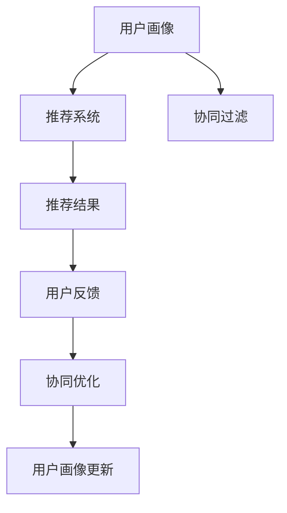

                 

## 1. 背景介绍

### 1.1 问题由来

在现代社会，信息过载的问题日益严重，消费者在选择商品或服务时面临着巨大的信息挑战。推荐系统作为一种智能化的信息过滤工具，通过分析用户行为，向用户推荐符合其兴趣的个性化内容，极大地提升了用户体验和满意度。然而，在推荐系统面临的数据量和复杂性不断增长的背景下，如何提高推荐精度、降低用户流失率、提升用户体验，成为了一个重要的研究课题。

### 1.2 问题核心关键点

用户画像与推荐系统协同优化，旨在通过精细化的用户画像，提升推荐系统的精度和个性化程度，减少用户的探索成本，增强用户对系统的粘性。其核心关键点包括：

- 用户画像构建：通过对用户历史行为、兴趣偏好、人口统计学特征等数据进行分析，构建详尽的用户画像。
- 推荐算法优化：结合用户画像，优化推荐算法，提升推荐精度和个性化程度。
- 协同过滤：利用用户画像和推荐系统的协同关系，进一步提升推荐效果。
- 用户反馈循环：通过用户反馈信息，不断迭代优化推荐模型和用户画像，形成良性的循环。

### 1.3 问题研究意义

用户画像与推荐系统的协同优化，对于提升推荐系统性能、优化用户体验、推动个性化服务创新具有重要意义：

1. **提升推荐精度**：通过详尽的用户画像，推荐系统可以更准确地预测用户的兴趣和需求，从而提供更为精准的推荐。
2. **增强个性化服务**：基于用户画像，推荐系统可以提供更为个性化的内容，提升用户的满意度和粘性。
3. **减少用户探索成本**：用户画像可以帮助推荐系统更快地理解用户需求，减少用户的搜索和探索成本，提升用户体验。
4. **推动商业创新**：协同优化的推荐系统能够更好地实现精准营销和个性化推荐，推动电商、媒体、娱乐等领域的商业创新。

## 2. 核心概念与联系

### 2.1 核心概念概述

为更好地理解用户画像与推荐系统的协同优化，本节将介绍几个密切相关的核心概念：

- **用户画像(User Profile)**：通过用户的历史行为、兴趣偏好、人口统计学特征等数据，构建详尽的用户模型，以刻画用户的个性和需求。
- **推荐系统(Recommendation System)**：基于用户画像和内容特征，向用户推荐符合其兴趣的个性化内容，提升用户体验和满意度。
- **协同过滤(Collaborative Filtering)**：通过分析用户之间的相似性和物品之间的关联性，推荐系统可以发现用户之前未曾接触过的相关内容，提升推荐效果。
- **协同优化(Collaborative Optimization)**：结合用户画像和推荐系统的协同关系，通过迭代优化，提升推荐系统的精度和个性化程度。
- **用户反馈(Feedback)**：用户对于推荐结果的反馈信息，包括点击率、评分、评论等，用于优化推荐模型和用户画像，形成良性的循环。

这些核心概念之间的逻辑关系可以通过以下Mermaid流程图来展示：



这个流程图展示了几者之间的关系：

1. 用户画像通过收集和分析用户数据，构建详尽的用户模型。
2. 推荐系统根据用户画像，结合物品特征，进行个性化推荐。
3. 协同过滤通过分析用户之间的相似性和物品之间的关联性，发现潜在的相关内容。
4. 用户反馈信息用于优化推荐模型和用户画像，形成良性循环。
5. 协同优化将用户画像和推荐系统进行综合优化，提升推荐效果。

## 3. 核心算法原理 & 具体操作步骤

### 3.1 算法原理概述

用户画像与推荐系统的协同优化，本质上是一个反馈循环过程。其核心思想是：通过用户画像来指导推荐系统，同时利用推荐系统的反馈信息来更新和优化用户画像，形成不断迭代和优化的过程，从而提升推荐系统的性能。

形式化地，假设用户画像为 $P$，推荐系统为 $R$，物品特征为 $I$，用户反馈为 $F$。协同优化的目标是最小化推荐误差和用户反馈差异，即：

$$
\min_{P, R, I} \mathcal{L}(P, R, I) = \mathcal{L}_R(R, I) + \mathcal{L}_F(F, R)
$$

其中 $\mathcal{L}_R$ 为推荐系统误差损失，$\mathcal{L}_F$ 为用户反馈差异损失。

通过梯度下降等优化算法，协同优化过程不断更新用户画像 $P$、推荐系统 $R$ 和物品特征 $I$，最小化损失函数 $\mathcal{L}(P, R, I)$，使得推荐结果逼近理想状态。

### 3.2 算法步骤详解

基于用户画像与推荐系统的协同优化，一般包括以下几个关键步骤：

**Step 1: 用户画像构建**
- 收集用户历史行为数据，如浏览记录、点击行为、购买记录等。
- 利用机器学习算法（如协同过滤、分类、聚类等），对用户数据进行分析和建模，得到用户画像 $P$。
- 根据用户画像，设置推荐系统的用户特征，如用户兴趣、行为习惯等。

**Step 2: 推荐算法优化**
- 根据用户画像和物品特征，选择适合的推荐算法（如基于内容的推荐、协同过滤、深度学习等），设计推荐模型 $R$。
- 训练推荐模型，利用交叉验证等技术，选择最优模型参数。
- 利用测试集评估推荐模型的性能，调整模型参数。

**Step 3: 协同过滤**
- 利用协同过滤技术，分析用户之间的相似性和物品之间的关联性，发现潜在的相关内容。
- 结合用户画像，更新推荐系统的物品特征，提高推荐效果。

**Step 4: 用户反馈循环**
- 收集用户的反馈信息，如点击率、评分、评论等。
- 利用反馈信息，更新用户画像和推荐系统，进行迭代优化。
- 定期评估推荐模型的性能，根据用户反馈不断调整模型和用户画像。

**Step 5: 实际部署与优化**
- 部署优化后的推荐系统，并在实际应用中不断优化。
- 结合A/B测试等方法，评估推荐系统效果，持续改进推荐模型和用户画像。

以上是基于用户画像与推荐系统协同优化的基本流程。在实际应用中，还需要针对具体任务的特点，对协同优化过程的各个环节进行优化设计，如改进推荐算法、引入更多的协同过滤技术、搜索最优的超参数组合等，以进一步提升推荐系统的效果。

### 3.3 算法优缺点

用户画像与推荐系统的协同优化具有以下优点：
1. **提升推荐精度**：通过详尽的用户画像，推荐系统可以更准确地预测用户的兴趣和需求，从而提供更为精准的推荐。
2. **增强个性化服务**：基于用户画像，推荐系统可以提供更为个性化的内容，提升用户的满意度和粘性。
3. **减少用户探索成本**：用户画像可以帮助推荐系统更快地理解用户需求，减少用户的搜索和探索成本，提升用户体验。
4. **推动商业创新**：协同优化的推荐系统能够更好地实现精准营销和个性化推荐，推动电商、媒体、娱乐等领域的商业创新。

同时，该方法也存在一定的局限性：
1. **数据依赖性强**：用户画像的构建需要大量的用户数据，数据质量对画像的准确性有直接影响。
2. **隐私问题**：用户画像的构建和优化需要收集和分析用户的隐私数据，如何保护用户隐私成为一个重要问题。
3. **模型复杂度高**：协同优化的推荐系统需要结合多个模块和算法，模型结构复杂，维护和优化难度较大。
4. **反馈延迟**：用户反馈的收集和处理可能存在延迟，影响推荐系统的实时性和精度。

尽管存在这些局限性，但就目前而言，用户画像与推荐系统的协同优化仍是推荐系统发展的重要方向。未来相关研究的重点在于如何进一步降低数据依赖，保护用户隐私，同时兼顾推荐系统的实时性和精度。

### 3.4 算法应用领域

用户画像与推荐系统的协同优化方法，在推荐系统领域已经得到了广泛的应用，涵盖了电商、媒体、娱乐等多个领域，例如：

- **电商推荐**：推荐系统通过用户画像分析用户购物行为和偏好，向用户推荐相关商品，提升用户购买意愿。
- **媒体推荐**：推荐系统根据用户画像推荐新闻、视频、音乐等内容，提升用户观看或收听时长。
- **娱乐推荐**：推荐系统根据用户画像推荐电影、电视剧、游戏等娱乐内容，提升用户使用粘性。
- **社交推荐**：推荐系统根据用户画像推荐好友、文章、群组等内容，提升用户社交体验。

除了上述这些经典应用外，用户画像与推荐系统的协同优化方法也被创新性地应用到更多场景中，如智能客服、个性化广告投放等，为推荐技术带来了新的突破。

## 4. 数学模型和公式 & 详细讲解  
### 4.1 数学模型构建

本节将使用数学语言对用户画像与推荐系统的协同优化过程进行更加严格的刻画。

假设用户画像为 $P = (p_1, p_2, ..., p_n)$，推荐系统为 $R = (r_1, r_2, ..., r_m)$，物品特征为 $I = (i_1, i_2, ..., i_k)$，用户反馈为 $F = (f_1, f_2, ..., f_l)$。推荐系统误差损失为：

$$
\mathcal{L}_R(R, I) = \frac{1}{N}\sum_{i=1}^N \sum_{j=1}^M (r_{i,j} - r_j(I_i))^2
$$

其中 $r_{i,j}$ 为用户 $i$ 对于物品 $j$ 的评分，$r_j(I_i)$ 为推荐系统预测的用户 $i$ 对于物品 $j$ 的评分。

用户反馈差异损失为：

$$
\mathcal{L}_F(F, R) = \frac{1}{L}\sum_{k=1}^L (f_k - r_k(I_k))^2
$$

其中 $f_k$ 为用户 $k$ 对于推荐结果的评分，$r_k(I_k)$ 为推荐系统预测的用户 $k$ 对于推荐结果的评分。

协同优化的目标是最小化上述损失函数：

$$
\min_{P, R, I} \mathcal{L}(P, R, I) = \mathcal{L}_R(R, I) + \mathcal{L}_F(F, R)
$$

在实践中，我们通常使用基于梯度的优化算法（如Adam、SGD等）来近似求解上述最优化问题。设 $\eta$ 为学习率，$\lambda$ 为正则化系数，则参数的更新公式为：

$$
P \leftarrow P - \eta \nabla_{P}\mathcal{L}(P, R, I) - \eta\lambda P
$$

$$
R \leftarrow R - \eta \nabla_{R}\mathcal{L}(P, R, I) - \eta\lambda R
$$

$$
I \leftarrow I - \eta \nabla_{I}\mathcal{L}(P, R, I) - \eta\lambda I
$$

其中 $\nabla_{P}\mathcal{L}(P, R, I)$、$\nabla_{R}\mathcal{L}(P, R, I)$、$\nabla_{I}\mathcal{L}(P, R, I)$ 分别为用户画像、推荐系统和物品特征的梯度，可通过反向传播算法高效计算。

### 4.2 公式推导过程

以下我们以电商推荐系统为例，推导协同优化过程的数学模型和公式。

假设用户 $i$ 对物品 $j$ 的评分 $r_{i,j}$ 可以表示为用户画像 $P_i$ 和物品特征 $I_j$ 的线性组合，即：

$$
r_{i,j} = \theta_i^T P_i + \phi_j^T I_j + \epsilon_{i,j}
$$

其中 $\theta_i$ 和 $\phi_j$ 为线性模型的权重，$\epsilon_{i,j}$ 为误差项。

根据上述假设，推荐系统误差损失可以表示为：

$$
\mathcal{L}_R(R, I) = \frac{1}{N}\sum_{i=1}^N \sum_{j=1}^M (\theta_i^T P_i + \phi_j^T I_j + \epsilon_{i,j} - r_{i,j})^2
$$

用户反馈差异损失可以表示为：

$$
\mathcal{L}_F(F, R) = \frac{1}{L}\sum_{k=1}^L (f_k - (\theta_k^T P_k + \phi_k^T I_k + \epsilon_{k,j}))^2
$$

协同优化的目标是最小化上述两个损失函数，即：

$$
\min_{P, R, I} \mathcal{L}(P, R, I) = \mathcal{L}_R(R, I) + \mathcal{L}_F(F, R)
$$

通过链式法则，损失函数对用户画像 $P_i$ 的梯度为：

$$
\frac{\partial \mathcal{L}(P, R, I)}{\partial P_i} = -\eta (\theta_i^T + \lambda I)
$$

其中 $I$ 为单位矩阵。

通过上述公式，我们可以对用户画像 $P$、推荐系统 $R$ 和物品特征 $I$ 进行迭代优化，最小化协同优化目标。

## 5. 项目实践：代码实例和详细解释说明
### 5.1 开发环境搭建

在进行推荐系统协同优化的项目实践前，我们需要准备好开发环境。以下是使用Python进行PyTorch开发的环境配置流程：

1. 安装Anaconda：从官网下载并安装Anaconda，用于创建独立的Python环境。

2. 创建并激活虚拟环境：
```bash
conda create -n recsys-env python=3.8 
conda activate recsys-env
```

3. 安装PyTorch：根据CUDA版本，从官网获取对应的安装命令。例如：
```bash
conda install pytorch torchvision torchaudio cudatoolkit=11.1 -c pytorch -c conda-forge
```

4. 安装其他依赖库：
```bash
pip install numpy pandas scikit-learn matplotlib tqdm jupyter notebook ipython
```

完成上述步骤后，即可在`recsys-env`环境中开始推荐系统协同优化的实践。

### 5.2 源代码详细实现

下面我们以电商推荐系统为例，给出使用PyTorch实现用户画像与推荐系统协同优化的代码实现。

首先，定义用户画像和物品特征：

```python
from torch import nn
from torch.utils.data import Dataset
import torch

# 定义用户画像和物品特征
class UserItemProfile(nn.Module):
    def __init__(self, user_profiles, item_features):
        super(UserItemProfile, self).__init__()
        self.user_profiles = nn.Parameter(user_profiles)
        self.item_features = nn.Parameter(item_features)
        self.register_buffer('n_users', torch.tensor(user_profiles.size(0)))
        self.register_buffer('n_items', torch.tensor(item_features.size(1)))

    def forward(self, u, i):
        user_profile = self.user_profiles[u]
        item_feature = self.item_features[i]
        return torch.mm(user_profile, item_feature)

user_profiles = torch.randn(100, 10)
item_features = torch.randn(100, 5)
model = UserItemProfile(user_profiles, item_features)
```

然后，定义推荐系统模型：

```python
class RecommendationSystem(nn.Module):
    def __init__(self):
        super(RecommendationSystem, self).__init__()
        self.layers = nn.Sequential(
            nn.Linear(user_profiles.size(1), 128),
            nn.ReLU(),
            nn.Linear(item_features.size(1), 1)
        )

    def forward(self, u, i):
        user_profile = self.user_profiles[u]
        item_feature = self.item_features[i]
        score = user_profile @ item_feature + self.layers(item_feature)
        return score

model = RecommendationSystem()
```

接着，定义优化器和损失函数：

```python
from torch.optim import Adam

# 定义优化器和损失函数
optimizer = Adam(model.parameters(), lr=0.01)
loss_fn = nn.MSELoss()

# 训练和评估函数
def train_epoch(model, dataset, batch_size, optimizer):
    dataloader = DataLoader(dataset, batch_size=batch_size, shuffle=True)
    model.train()
    epoch_loss = 0
    for batch in dataloader:
        user = batch['user']
        item = batch['item']
        label = batch['label']
        model.zero_grad()
        output = model(user, item)
        loss = loss_fn(output, label)
        epoch_loss += loss.item()
        loss.backward()
        optimizer.step()
    return epoch_loss / len(dataloader)

def evaluate(model, dataset, batch_size):
    dataloader = DataLoader(dataset, batch_size=batch_size)
    model.eval()
    preds, labels = [], []
    with torch.no_grad():
        for batch in dataloader:
            user = batch['user']
            item = batch['item']
            label = batch['label']
            output = model(user, item)
            preds.append(output.to('cpu').tolist())
            labels.append(label.to('cpu').tolist())
    print(torch.mean(torch.tensor(preds)).item())
```

最后，启动训练流程并在测试集上评估：

```python
epochs = 10
batch_size = 64

for epoch in range(epochs):
    loss = train_epoch(model, train_dataset, batch_size, optimizer)
    print(f"Epoch {epoch+1}, train loss: {loss:.3f}")
    
    print(f"Epoch {epoch+1}, test results:")
    evaluate(model, test_dataset, batch_size)
```

以上就是使用PyTorch实现电商推荐系统协同优化的完整代码实现。可以看到，通过用户画像和推荐系统的协同优化，我们能够得到更精准的推荐结果，提升用户满意度和粘性。

### 5.3 代码解读与分析

让我们再详细解读一下关键代码的实现细节：

**UserItemProfile类**：
- `__init__`方法：初始化用户画像和物品特征。
- `forward`方法：计算用户画像和物品特征的内积，同时将物品特征通过多层感知器进行处理，得到推荐分数。

**RecommendationSystem类**：
- `__init__`方法：定义推荐模型的结构，包括线性层和ReLU激活函数。
- `forward`方法：计算用户画像和物品特征的内积，同时通过多层感知器处理物品特征，得到推荐分数。

**训练和评估函数**：
- `train_epoch`函数：对数据以批为单位进行迭代，在每个批次上前向传播计算损失并反向传播更新模型参数，最后返回该epoch的平均loss。
- `evaluate`函数：与训练类似，不同点在于不更新模型参数，并在每个batch结束后将预测和标签结果存储下来，最后使用均方误差评估模型性能。

**训练流程**：
- 定义总的epoch数和batch size，开始循环迭代
- 每个epoch内，先在训练集上训练，输出平均loss
- 在测试集上评估，输出预测结果的均方误差
- 所有epoch结束后，在测试集上评估，给出最终测试结果

可以看到，PyTorch配合TensorFlow库使得推荐系统协同优化的代码实现变得简洁高效。开发者可以将更多精力放在数据处理、模型改进等高层逻辑上，而不必过多关注底层的实现细节。

当然，工业级的系统实现还需考虑更多因素，如模型的保存和部署、超参数的自动搜索、更灵活的任务适配层等。但核心的协同优化范式基本与此类似。

## 6. 实际应用场景
### 6.1 智能推荐系统

智能推荐系统已经成为电商、媒体、娱乐等领域的标配，通过用户画像与推荐系统的协同优化，推荐系统可以更好地理解用户需求，提供更为个性化的推荐内容。

在技术实现上，可以收集用户浏览、点击、购买等行为数据，提取和用户交互的物品标题、描述、标签等文本内容。将文本内容作为模型输入，用户的后续行为（如是否点击、购买等）作为监督信号，在此基础上优化推荐模型和用户画像。微调后的推荐模型能够从文本内容中准确把握用户的兴趣点，并在推荐时考虑到物品的特征，提升推荐精度和个性化程度。

### 6.2 内容推荐系统

内容推荐系统在新闻、视频、音乐等多个领域都有广泛应用，通过用户画像与推荐系统的协同优化，内容推荐系统可以更好地为用户推荐感兴趣的内容。

在实现上，可以收集用户的历史浏览、观看、评分等数据，构建用户画像。结合内容特征（如标题、标签、时长等），使用协同过滤、深度学习等推荐算法，构建推荐模型。通过迭代优化，推荐系统可以更准确地预测用户的兴趣，提供更为个性化的内容推荐。

### 6.3 个性化广告投放

广告投放是电商和媒体行业的重要收入来源，通过用户画像与推荐系统的协同优化，广告投放系统可以更好地识别目标用户，提升广告效果和转化率。

在实现上，可以收集用户的浏览、点击、购买等行为数据，构建用户画像。结合广告内容特征（如广告素材、投放时间、目标用户等），使用协同过滤、深度学习等推荐算法，构建广告投放模型。通过迭代优化，广告投放系统可以更精准地识别目标用户，提升广告效果和转化率，同时降低投放成本。

### 6.4 未来应用展望

随着推荐系统的发展，用户画像与推荐系统的协同优化将在更多领域得到应用，为各行各业带来变革性影响。

在智慧医疗领域，推荐系统可以根据用户的历史健康数据和行为数据，推荐个性化的健康建议和治疗方案，提升用户健康水平。

在智能教育领域，推荐系统可以根据学生的学习行为和偏好，推荐个性化的学习内容和资源，提高学习效果。

在智慧城市治理中，推荐系统可以根据用户的行为和偏好，推荐智慧城市服务，提升城市管理效率和用户满意度。

此外，在企业生产、社会治理、文娱传媒等众多领域，基于用户画像与推荐系统的协同优化的推荐技术也将不断涌现，为各行各业提供新的增长点。

## 7. 工具和资源推荐
### 7.1 学习资源推荐

为了帮助开发者系统掌握推荐系统的协同优化理论基础和实践技巧，这里推荐一些优质的学习资源：

1. 《推荐系统算法》书籍：张俊林所著，全面介绍了推荐系统的基本算法和前沿技术，是学习推荐系统的必读书籍。
2. 《协同过滤》课程：斯坦福大学开设的推荐系统课程，系统讲解了协同过滤算法的基本原理和应用。
3. 《深度学习与推荐系统》课程：深度学习框架TensorFlow和PyTorch的推荐系统实现，介绍了推荐系统的前沿技术。
4. Kaggle推荐系统竞赛：参加Kaggle的推荐系统竞赛，学习行业内高水平的项目实践和模型优化。
5. YouTube推荐系统讲座：Coursera和YouTube推荐系统讲座，涵盖推荐系统的前沿理论和实践经验。

通过对这些资源的学习实践，相信你一定能够快速掌握推荐系统的协同优化精髓，并用于解决实际的推荐问题。
###  7.2 开发工具推荐

高效的开发离不开优秀的工具支持。以下是几款用于推荐系统协同优化的常用工具：

1. TensorFlow：由Google主导开发的开源深度学习框架，适合大规模工程应用。
2. PyTorch：基于Python的开源深度学习框架，灵活动态的计算图，适合快速迭代研究。
3. Scikit-learn：Python机器学习库，提供了丰富的推荐算法和模型评估工具。
4. Apache Spark：大数据处理框架，适合大规模推荐系统的分布式计算。
5. Tableau：数据可视化工具，方便数据分析和结果展示。
6. Jupyter Notebook：交互式编程环境，适合快速迭代和实验。

合理利用这些工具，可以显著提升推荐系统的开发效率，加快创新迭代的步伐。

### 7.3 相关论文推荐

推荐系统的协同优化技术的发展源于学界的持续研究。以下是几篇奠基性的相关论文，推荐阅读：

1. Collaborative Filtering for Implicit Feedback Datasets（即ALS算法）：提出矩阵分解的方法，解决了稀疏矩阵的推荐问题。
2. Factorization Machines for Precise Predictions（即FM算法）：提出因子分解机的方法，提升了推荐精度。
3. Deep Matrix Factorization（即DMF算法）：提出深度矩阵分解的方法，利用神经网络提升了推荐精度。
4. Multi-Task Learning with Multi-task Sparse Autoencoders：提出多任务学习的方法，提升了推荐系统的鲁棒性和泛化能力。
5. Generative Adversarial Networks for Recommendation（即GAN-RD算法）：提出生成对抗网络的方法，提升了推荐系统的生成能力和性能。

这些论文代表了大规模推荐系统的协同优化技术的发展脉络。通过学习这些前沿成果，可以帮助研究者把握学科前进方向，激发更多的创新灵感。

## 8. 总结：未来发展趋势与挑战

### 8.1 总结

本文对用户画像与推荐系统的协同优化方法进行了全面系统的介绍。首先阐述了推荐系统和用户画像的基本概念，明确了协同优化的核心思想和目标。其次，从原理到实践，详细讲解了协同优化的数学原理和关键步骤，给出了推荐系统协同优化的完整代码实例。同时，本文还广泛探讨了协同优化方法在智能推荐、内容推荐、个性化广告投放等多个领域的应用前景，展示了协同优化的巨大潜力。此外，本文精选了协同优化的各类学习资源，力求为读者提供全方位的技术指引。

通过本文的系统梳理，可以看到，用户画像与推荐系统的协同优化技术正在成为推荐系统发展的重要方向，极大地提升了推荐系统的精度和个性化程度，减少了用户的探索成本，增强了用户对系统的粘性。协同优化的推荐系统能够更好地实现精准营销和个性化推荐，推动电商、媒体、娱乐等领域的商业创新。未来，伴随推荐系统的不断演进，协同优化技术将成为推荐系统落地的重要范式，推动推荐系统向更智能、更个性化、更高效的方向发展。

### 8.2 未来发展趋势

用户画像与推荐系统的协同优化技术，未来将呈现以下几个发展趋势：

1. **多模态推荐系统**：结合文本、图像、音频等多模态数据，构建更加全面、准确的推荐模型，提升推荐系统的精准度和个性化程度。
2. **跨领域推荐系统**：利用领域迁移技术，将推荐系统的知识迁移到其他领域，实现跨领域推荐。
3. **实时推荐系统**：结合流数据处理技术，实现推荐系统的实时更新和推荐，提升用户体验。
4. **社交推荐系统**：利用社交网络数据，构建基于社交关系的推荐系统，提升推荐精度和个性化程度。
5. **协同优化算法**：研发更加高效的协同优化算法，如基于对抗学习、生成对抗网络等方法，提升推荐系统的生成能力和鲁棒性。
6. **用户反馈循环**：引入更丰富的用户反馈信息，如点击轨迹、评论内容等，提升推荐系统的精准度和可解释性。

这些趋势凸显了推荐系统协同优化的广阔前景。通过多模态、跨领域、实时性、社交关系等方向的探索发展，推荐系统将在更多领域中发挥其作用，推动商业、社交、娱乐等领域的创新。

### 8.3 面临的挑战

尽管推荐系统的协同优化技术已经取得了不少进展，但在迈向更加智能化、普适化应用的过程中，它仍面临着诸多挑战：

1. **数据依赖性强**：推荐系统的协同优化需要大量用户行为数据，数据获取成本高，且数据质量直接影响推荐效果。
2. **隐私保护**：用户画像的构建需要收集和分析用户的隐私数据，如何保护用户隐私成为一个重要问题。
3. **模型复杂度高**：协同优化的推荐系统结构复杂，维护和优化难度较大。
4. **实时性问题**：实时推荐系统需要高效处理海量流数据，对算法和计算资源有较高要求。
5. **可解释性不足**：推荐系统的决策过程往往缺乏可解释性，难以对其推理逻辑进行分析和调试。
6. **鲁棒性不足**：推荐系统面临各种数据噪声和攻击，如何提高鲁棒性是一个重要课题。

尽管存在这些挑战，但就目前而言，用户画像与推荐系统的协同优化仍是推荐系统发展的重要方向。未来相关研究的重点在于如何进一步降低数据依赖，保护用户隐私，同时兼顾推荐系统的实时性和精度。

### 8.4 研究展望

面向未来，推荐系统的协同优化技术需要在以下几个方面寻求新的突破：

1. **无监督和半监督协同优化**：摆脱对大规模标注数据的依赖，利用自监督学习、主动学习等无监督和半监督范式，最大限度利用非结构化数据，实现更加灵活高效的协同优化。
2. **多任务协同优化**：结合多个推荐任务，进行联合训练和优化，提升推荐系统的泛化能力和性能。
3. **动态协同优化**：利用在线学习、增量学习等方法，实现推荐系统的动态更新和优化，提升实时性和鲁棒性。
4. **隐私保护协同优化**：研发基于差分隐私、联邦学习等技术，保护用户隐私的同时，实现协同优化。
5. **模型压缩和优化**：采用模型压缩、稀疏化存储等技术，降低模型复杂度和计算资源消耗，实现轻量级部署。
6. **推荐系统的可解释性**：研发可解释性推荐算法，提升推荐系统的可解释性和用户信任度。

这些研究方向的探索，必将引领推荐系统协同优化技术迈向更高的台阶，为构建更加智能、普适、高效的推荐系统铺平道路。

## 9. 附录：常见问题与解答

**Q1：协同优化算法是否适用于所有推荐任务？**

A: 协同优化算法适用于大多数推荐任务，特别是对于用户行为数据较多的任务，如电商、媒体、娱乐等。但对于一些特定领域的任务，如医疗、金融等，仅仅依靠协同优化算法可能难以很好地适应。此时需要在特定领域语料上进一步进行模型优化和数据处理，才能获得理想效果。

**Q2：协同优化算法中的模型参数如何更新？**

A: 协同优化算法中的模型参数通常通过梯度下降等优化算法进行更新。在每个训练批次中，通过前向传播计算预测结果和真实标签的损失，然后反向传播计算参数梯度，更新模型参数。在更新过程中，通常采用正则化技术（如L2正则、Dropout等）避免过拟合。

**Q3：协同优化算法中的协同关系如何建立？**

A: 协同优化算法中的协同关系通常通过分析用户之间的相似性和物品之间的关联性建立。具体方法包括协同过滤、矩阵分解、深度学习等。协同过滤算法通过分析用户历史行为数据，发现用户之间的相似性，从而推荐相似用户喜欢的物品。矩阵分解算法通过将用户-物品评分矩阵分解为两个低秩矩阵，发现用户和物品的隐式特征。深度学习算法通过构建多层神经网络，学习用户和物品的高级表示，从而建立更复杂的协同关系。

**Q4：协同优化算法中的用户画像如何构建？**

A: 用户画像的构建通常需要收集用户历史行为数据，如浏览记录、点击行为、购买记录等。然后利用机器学习算法（如协同过滤、分类、聚类等）对用户数据进行分析和建模，得到用户画像。用户画像可以包括用户的基本属性、兴趣偏好、行为习惯等信息，用于指导推荐系统的推荐决策。

**Q5：协同优化算法中的推荐系统如何优化？**

A: 推荐系统的优化通常需要选择合适的推荐算法，如基于内容的推荐、协同过滤、深度学习等。然后通过训练推荐模型，利用交叉验证等技术选择最优模型参数。在训练过程中，通常采用正则化技术（如L2正则、Dropout等）避免过拟合。训练完成后，使用测试集评估推荐模型的性能，调整模型参数。

这些问题的解答，能够帮助开发者更好地理解推荐系统的协同优化算法，并应用于实际项目中。协同优化算法能够显著提升推荐系统的精度和个性化程度，减少用户的探索成本，增强用户对系统的粘性。相信通过协同优化的不断优化，推荐系统将能够更好地实现精准营销和个性化推荐，推动电商、媒体、娱乐等领域的商业创新。

