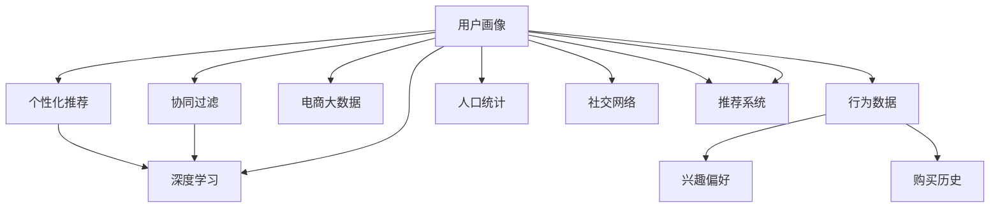

                 

# 用户画像在电商个性化推荐中的应用：方法与实践

> 关键词：用户画像,个性化推荐,协同过滤,深度学习,电商大数据

## 1. 背景介绍

### 1.1 问题由来
随着电商行业的快速发展，电商企业面临的竞争日益激烈，如何提升用户购物体验、提高用户转化率成为电商企业的核心目标。个性化推荐系统通过向用户推荐符合其兴趣和需求的商品，能有效提升用户体验，增加用户粘性。

个性化推荐的核心在于精准理解用户需求，为用户提供匹配度高的商品。传统的基于内容的推荐方式往往难以充分挖掘用户的潜在需求，无法在多样化的商品中选择合适的推荐内容。用户画像作为描述用户特征和行为的数据模型，能够全面、深刻地刻画用户的个性化需求，成为个性化推荐系统的重要支撑。

### 1.2 问题核心关键点
用户画像在电商个性化推荐系统中的核心作用在于：

1. **用户特征挖掘**：通过采集用户在电商网站上的各种行为数据，如浏览、点击、购买记录等，提取用户的兴趣偏好、购买历史、社交网络等信息。
2. **用户群体划分**：将用户分为不同的群体，如高价值用户、潜在流失用户等，为不同群体提供有针对性的推荐。
3. **推荐内容丰富度**：通过用户画像，推荐系统能够提供更加丰富多样的推荐内容，如商品、活动、个性化定制商品等。
4. **用户行为预测**：利用用户画像数据，进行行为预测，如用户是否会对某商品感兴趣、是否会购买某商品等，提升推荐系统的准确性。

### 1.3 问题研究意义
研究用户画像在电商个性化推荐中的应用，对于提升电商用户体验、优化用户留存、增加交易转化具有重要意义：

1. **提升用户体验**：通过精准的用户画像，电商企业能够为用户提供更加贴合需求的推荐内容，提升用户的购物体验。
2. **优化用户留存**：根据用户画像，电商企业可以识别潜在流失用户，通过个性化的营销策略提升用户留存率。
3. **增加交易转化**：利用用户画像数据，电商企业能够预测用户购买行为，进行精准的商品推荐，增加交易转化率。
4. **数据分析洞察**：用户画像数据可以为企业提供丰富的用户行为和特征分析，帮助企业制定更有针对性的市场策略。

## 2. 核心概念与联系

### 2.1 核心概念概述

为更好地理解用户画像在电商个性化推荐中的应用，本节将介绍几个密切相关的核心概念：

- **用户画像(User Profile)**：描述用户特征和行为的数据模型，通常包含用户的兴趣偏好、行为数据、人口统计信息等。
- **个性化推荐系统(Personalized Recommendation System)**：根据用户画像，为用户推荐符合其个性化需求的商品或内容，提升用户满意度和转化率。
- **协同过滤(Collaborative Filtering)**：基于用户行为或物品属性的相似度，推荐与用户过去喜欢的商品相似的商品，适用于推荐长尾商品、新品等。
- **深度学习(Deep Learning)**：通过构建深度神经网络模型，学习用户画像数据的深层次特征，提升个性化推荐系统的准确性和泛化能力。
- **电商大数据(E-commerce Big Data)**：电商网站在运营过程中产生的海量数据，包括用户行为数据、商品信息、交易记录等，是构建用户画像的重要数据来源。

这些核心概念之间的逻辑关系可以通过以下Mermaid流程图来展示：



这个流程图展示了几类关键概念及其之间的关系：

1. **电商大数据**：用户画像的基础数据来源，包括用户行为数据、商品信息等。
2. **用户画像**：基于电商大数据构建的用户特征和行为数据模型。
3. **协同过滤**：一种推荐算法，利用用户行为相似度推荐商品。
4. **深度学习**：一种强大的模型训练技术，用于学习用户画像数据的深层次特征。
5. **个性化推荐**：根据用户画像和推荐算法，为用户推荐个性化商品。

## 3. 核心算法原理 & 具体操作步骤
### 3.1 算法原理概述

用户画像在电商个性化推荐系统中的核心作用是通过刻画用户特征和行为，提高推荐系统的个性化和精准度。其算法原理主要包括以下几个步骤：

1. **数据采集与预处理**：从电商平台采集用户行为数据、商品信息等数据，并进行清洗、去重、标准化等预处理。
2. **用户画像建模**：利用机器学习、深度学习等方法，构建用户画像模型，刻画用户的兴趣偏好、行为特征等。
3. **协同过滤推荐**：根据用户画像和商品画像，计算用户与商品之间的相似度，推荐与用户过去喜欢的商品相似的商品。
4. **深度学习推荐**：利用深度学习模型，学习用户画像数据的深层次特征，提高推荐系统的准确性和泛化能力。
5. **推荐系统集成**：将协同过滤和深度学习推荐结果进行集成，提升推荐系统的整体性能。

### 3.2 算法步骤详解

以下将详细介绍电商个性化推荐系统中用户画像构建和推荐的详细步骤：

**Step 1: 数据采集与预处理**

电商企业可以通过多种渠道采集用户行为数据，如浏览器行为、应用行为、社交行为等。常用的数据源包括：

- 浏览记录：用户在电商网站上的浏览历史，如浏览的页面、停留时间等。
- 点击记录：用户在电商网站上的点击记录，如点击的按钮、链接等。
- 购买记录：用户在电商网站上的购买记录，如购买商品、支付金额等。
- 评分记录：用户对商品的评分记录，如五星评分、评价文本等。
- 登录信息：用户的登录时间、IP地址、设备信息等。
- 社交数据：用户在社交媒体上的互动数据，如好友关系、评论等。

采集到的数据需要进行预处理，包括数据清洗、缺失值处理、异常值检测等，确保数据的完整性和一致性。

**Step 2: 用户画像建模**

用户画像建模通常包括以下几个步骤：

1. **用户特征提取**：从电商大数据中提取用户的基本信息、兴趣偏好、行为特征等，如年龄、性别、职业、购买历史、浏览历史等。
2. **用户群体划分**：将用户分为不同的群体，如高价值用户、潜在流失用户等，根据不同群体提供有针对性的推荐策略。
3. **特征工程**：将原始数据转化为模型可用的特征表示，如将用户行为数据转化为时间序列特征、文本特征等。
4. **模型训练**：利用机器学习、深度学习等方法，训练用户画像模型，刻画用户的兴趣偏好和行为特征。

常用的用户画像建模方法包括：

- **基于规则的建模**：通过预设规则，自动提取用户特征，如利用浏览历史计算用户兴趣度、利用购买记录计算用户消费能力等。
- **基于统计的建模**：通过统计分析用户行为数据，提取用户的统计特征，如基于用户评分计算用户偏好度、基于浏览记录计算用户兴趣度等。
- **基于机器学习的建模**：通过机器学习算法，如决策树、随机森林、协同过滤等，自动学习用户特征和行为模式。
- **基于深度学习的建模**：通过深度学习模型，如卷积神经网络、循环神经网络、自编码器等，学习用户画像数据的深层次特征。

**Step 3: 协同过滤推荐**

协同过滤推荐通过计算用户与商品之间的相似度，推荐与用户过去喜欢的商品相似的商品。常用的协同过滤推荐算法包括：

- **基于用户的协同过滤**：利用用户与商品之间的评分数据，计算用户与商品之间的相似度，推荐与用户过去喜欢的商品相似的商品。
- **基于物品的协同过滤**：利用商品与商品之间的评分数据，计算商品与商品之间的相似度，推荐与用户过去喜欢的商品相似的商品。
- **基于矩阵分解的协同过滤**：将用户评分矩阵分解为低秩矩阵，利用矩阵分解结果进行推荐。

**Step 4: 深度学习推荐**

深度学习推荐通过构建深度神经网络模型，学习用户画像数据的深层次特征，提升推荐系统的准确性和泛化能力。常用的深度学习推荐模型包括：

- **基于深度神经网络的推荐模型**：如多层感知机、卷积神经网络、循环神经网络等，利用深度神经网络模型学习用户画像数据的深层次特征。
- **基于自编码器的推荐模型**：如变分自编码器、稀疏自编码器等，通过编码器-解码器结构学习用户画像数据的深层次特征。
- **基于深度强化学习的推荐模型**：如深度Q网络、策略梯度等，利用深度强化学习算法进行推荐策略的优化。

**Step 5: 推荐系统集成**

推荐系统集成是将协同过滤推荐和深度学习推荐结果进行集成，提升推荐系统的整体性能。常用的推荐系统集成方法包括：

- **加权集成**：根据不同推荐算法的效果，赋予不同的权重，加权融合推荐结果。
- **级联集成**：先进行协同过滤推荐，再进行深度学习推荐，将两个阶段的推荐结果进行融合。
- **混合集成**：将协同过滤推荐和深度学习推荐分别应用于不同类型的数据，如浏览数据、购买数据等，融合结果进行推荐。

### 3.3 算法优缺点

用户画像在电商个性化推荐系统中的优点包括：

1. **提升推荐准确性**：通过刻画用户特征和行为，提升推荐系统的个性化和精准度，提高推荐效果。
2. **增强用户粘性**：根据用户画像，提供个性化推荐内容，提升用户满意度和粘性，减少用户流失。
3. **降低运营成本**：通过个性化推荐，提高用户转化率，减少广告投放和促销活动，降低运营成本。

同时，用户画像在电商个性化推荐系统中也存在以下缺点：

1. **数据隐私风险**：用户画像数据涉及用户的隐私信息，如浏览记录、购买记录等，存在数据泄露和滥用的风险。
2. **数据质量问题**：电商企业的数据采集和预处理可能存在不准确、不完整的问题，影响用户画像的准确性。
3. **模型复杂度**：用户画像建模和深度学习推荐模型较为复杂，需要大量的计算资源和数据支持。

### 3.4 算法应用领域

用户画像在电商个性化推荐系统中的应用领域广泛，包括但不限于以下几个方面：

- **商品推荐**：根据用户画像，推荐用户可能感兴趣的商品，提升用户购买率。
- **活动推荐**：根据用户画像，推荐与用户兴趣相符的促销活动，增加用户参与度。
- **个性化定制**：根据用户画像，推荐个性化定制商品，提升用户满意度和转化率。
- **品牌推荐**：根据用户画像，推荐用户可能喜欢的品牌，提升品牌忠诚度。
- **用户行为预测**：利用用户画像数据，预测用户行为，进行精准的营销策略调整。

## 4. 数学模型和公式 & 详细讲解  
### 4.1 数学模型构建

在电商个性化推荐系统中，用户画像数据的建模通常采用多维特征向量表示。假设用户画像数据的特征向量为 $\mathbf{x}_u = [x_{u1}, x_{u2}, \dots, x_{um}]$，其中 $m$ 为特征维度，每个特征 $x_{ui}$ 对应一个数值。

用户画像数据的数学模型可以表示为：

$$
\mathbf{x}_u = [x_{u1}, x_{u2}, \dots, x_{um}]
$$

其中 $x_{ui}$ 表示用户 $u$ 在特征 $i$ 上的取值，$x_{ui}$ 的取值范围可以是离散的（如类别型特征）或连续的（如数值型特征）。

### 4.2 公式推导过程

在电商个性化推荐系统中，常用的协同过滤推荐算法包括基于用户的协同过滤和基于物品的协同过滤。以基于用户的协同过滤为例，假设用户 $u$ 的评分向量为 $\mathbf{r}_u = [r_{ui}]$，商品 $i$ 的评分向量为 $\mathbf{r}_i = [r_{i1}, r_{i2}, \dots, r_{in}]$，用户 $u$ 和商品 $i$ 之间的评分数据为 $r_{ui}$。

基于用户的协同过滤算法可以表示为：

$$
\hat{r}_{ui} = \alpha \sum_{j=1}^N \frac{r_{uj} r_{ij}}{p_u p_i}
$$

其中 $\alpha$ 为衰减因子，$p_u$ 和 $p_i$ 分别为用户 $u$ 和商品 $i$ 的平均值。

在协同过滤推荐中，还需要计算用户与商品之间的相似度。常用的相似度计算方法包括余弦相似度和皮尔逊相关系数等。

**余弦相似度**：

$$
sim(u, i) = \frac{\mathbf{r}_u \cdot \mathbf{r}_i}{||\mathbf{r}_u|| \cdot ||\mathbf{r}_i||}
$$

**皮尔逊相关系数**：

$$
sim(u, i) = \frac{Cov(\mathbf{r}_u, \mathbf{r}_i)}{\sigma_u \cdot \sigma_i}
$$

其中 $Cov(\mathbf{r}_u, \mathbf{r}_i)$ 表示用户 $u$ 和商品 $i$ 的协方差，$\sigma_u$ 和 $\sigma_i$ 分别表示用户 $u$ 和商品 $i$ 的标准差。

在深度学习推荐模型中，通常采用多层感知机(MLP)或卷积神经网络(CNN)等深度神经网络模型。以多层感知机为例，其基本结构如下：

$$
y = f(\mathbf{x}; \theta)
$$

其中 $\mathbf{x}$ 表示输入的特征向量，$\theta$ 表示模型的参数，$f(\cdot)$ 表示神经网络的前向传播函数。

### 4.3 案例分析与讲解

以下以一个简单的电商个性化推荐系统为例，展示用户画像在推荐系统中的应用：

**案例背景**：假设某电商网站有 $N=1000$ 名用户和 $M=1000$ 种商品。每个用户对每种商品都有一个评分，评分范围在 $[1, 5]$ 之间。

**数据集**：假设我们有一个用户评分矩阵 $\mathbf{R} \in \mathbb{R}^{N \times M}$，其中 $R_{ui}$ 表示用户 $u$ 对商品 $i$ 的评分。

**用户画像**：假设用户 $u$ 的特征向量为 $\mathbf{x}_u = [age, gender, job, purchase_history, browsing_history]$，其中 $age$、$gender$、$job$ 为基本特征，$purchase_history$ 和 $browsing_history$ 为行为特征。

**协同过滤推荐**：利用基于用户的协同过滤算法，计算用户 $u$ 和商品 $i$ 之间的相似度 $sim(u, i)$，推荐与用户过去喜欢的商品相似的商品。

**深度学习推荐**：利用多层感知机模型，学习用户画像数据的深层次特征，进行推荐。

## 5. 项目实践：代码实例和详细解释说明
### 5.1 开发环境搭建

在进行电商个性化推荐系统开发前，需要先搭建开发环境。以下是使用Python进行开发的环境配置流程：

1. 安装Anaconda：从官网下载并安装Anaconda，用于创建独立的Python环境。

2. 创建并激活虚拟环境：
```bash
conda create -n recommendation-env python=3.8 
conda activate recommendation-env
```

3. 安装必要的依赖包：
```bash
pip install pandas numpy scikit-learn scikit-learn torch torchvision transformers
```

4. 安装其他工具：
```bash
pip install matplotlib seaborn jupyter notebook ipython
```

完成上述步骤后，即可在`recommendation-env`环境中进行电商个性化推荐系统的开发。

### 5.2 源代码详细实现

以下是一个简单的电商个性化推荐系统的代码实现，展示了基于用户画像的协同过滤推荐过程：

```python
import pandas as pd
import numpy as np
import sklearn.metrics.pairwise
from sklearn.preprocessing import StandardScaler

# 加载用户评分数据
data = pd.read_csv('user_ratings.csv')

# 构建用户画像特征
user_features = pd.DataFrame({'age': data['age'], 'gender': data['gender'], 'job': data['job'], 
                             'purchase_history': data['purchase_history'], 'browsing_history': data['browsing_history']})
user_features = user_features.dropna()

# 构建商品画像特征
item_features = pd.DataFrame({'price': data['price'], 'category': data['category'], 'brand': data['brand']})
item_features = item_features.dropna()

# 标准化特征
user_features = StandardScaler().fit_transform(user_features)
item_features = StandardScaler().fit_transform(item_features)

# 构建用户评分矩阵
user_ratings = np.array(data['rating']).reshape(-1, 1)

# 计算用户与商品的相似度
similarity_matrix = sklearn.metrics.pairwise.cosine_similarity(user_features, item_features)

# 推荐商品
def recommend_items(user_id, k=10):
    user_score = user_ratings[user_id-1]
    similarity = similarity_matrix[user_id-1]
    recommended_items = []
    for i in range(M):
        score = user_score * similarity[i]
        if score < 0:
            score = 0
        recommended_items.append((i, score))
    recommended_items = sorted(recommended_items, key=lambda x: x[1], reverse=True)[:k]
    return recommended_items

# 测试推荐系统
user_id = 1001
recommended_items = recommend_items(user_id)
print('推荐商品：', recommended_items)
```

### 5.3 代码解读与分析

让我们再详细解读一下关键代码的实现细节：

**用户评分数据加载**：
- 通过 `pd.read_csv` 方法读取用户评分数据，将其转化为Pandas DataFrame对象。

**用户画像特征构建**：
- 从用户评分数据中提取基本特征和行为特征，如年龄、性别、职业、购买历史、浏览历史等。
- 使用 `pd.DataFrame` 方法创建用户画像的特征向量，去除缺失值。

**商品画像特征构建**：
- 从用户评分数据中提取商品的价格、类别、品牌等基本信息。
- 使用 `pd.DataFrame` 方法创建商品画像的特征向量，去除缺失值。

**特征标准化**：
- 使用 `StandardScaler` 方法对用户画像和商品画像的特征进行标准化处理，使其均值为0，方差为1。

**用户评分矩阵构建**：
- 将用户评分数据转化为numpy数组，并将其重塑为矩阵形式。

**用户与商品相似度计算**：
- 使用 `sklearn.metrics.pairwise.cosine_similarity` 方法计算用户画像和商品画像的余弦相似度。

**推荐系统实现**：
- `recommend_items` 函数接收用户ID和推荐数量k，计算用户与商品的相似度，返回推荐商品列表。

**测试推荐系统**：
- 调用 `recommend_items` 函数，输出推荐商品列表。

可以看到，基于用户画像的电商个性化推荐系统较为简单，但核心的协同过滤推荐算法和特征标准化过程已经基本完成。在实际应用中，还需要进一步扩展和优化推荐算法，如利用深度学习模型进行推荐、引入多模态数据进行推荐等。

## 6. 实际应用场景
### 6.1 智能客服系统

基于用户画像的电商个性化推荐技术可以应用于智能客服系统的构建。智能客服系统通过分析用户画像，提供个性化的客服服务，提升用户满意度和体验。

在技术实现上，可以收集用户的历史咨询记录、购买记录、浏览记录等，提取用户的兴趣偏好、购买历史、社交网络等信息。根据用户画像，智能客服系统能够自动匹配最适合的客服人员，提供针对性的回复，提升用户满意度。

### 6.2 个性化营销

基于用户画像的电商个性化推荐技术可以应用于个性化营销的制定和执行。个性化营销通过精准的用户画像，设计个性化的营销策略，提升营销效果。

在技术实现上，可以利用用户画像数据，预测用户的购买行为和兴趣偏好，进行精准的广告投放和促销活动设计。同时，根据用户画像数据，设计个性化的营销文案和内容，提升用户的参与度和转化率。

### 6.3 供应链优化

基于用户画像的电商个性化推荐技术可以应用于供应链的优化。电商企业可以通过用户画像数据，分析用户需求和行为，优化供应链管理。

在技术实现上，可以利用用户画像数据，预测用户的购买趋势和需求变化，优化库存管理。同时，根据用户画像数据，优化商品推荐策略，提升商品销售量和库存周转率。

### 6.4 未来应用展望

随着电商行业的不断发展，用户画像在电商个性化推荐系统中的应用前景广阔。未来，基于用户画像的个性化推荐技术将在以下方面得到进一步应用：

1. **跨平台推荐**：利用用户画像数据，实现跨电商平台的个性化推荐，提升用户在不同平台的购物体验。
2. **实时推荐**：利用用户实时行为数据，进行实时推荐，提升用户购物体验。
3. **语音推荐**：利用语音识别和自然语言处理技术，实现语音推荐，提升用户的交互体验。
4. **多模态推荐**：利用用户画像数据，结合图像、视频、音频等多模态数据，进行更加全面的个性化推荐。
5. **深度推荐**：利用深度学习技术，进行更加精准的个性化推荐，提升推荐系统的性能和效果。

## 7. 工具和资源推荐
### 7.1 学习资源推荐

为了帮助开发者系统掌握电商个性化推荐系统中的用户画像构建和推荐算法，这里推荐一些优质的学习资源：

1. 《Python机器学习》书籍：由Peter Harrington编写，全面介绍了机器学习算法在Python中的实现，包括协同过滤推荐和深度学习推荐等。
2. 《深度学习》课程：由斯坦福大学Andrew Ng教授开设，讲解深度学习算法及其在推荐系统中的应用。
3. 《电商大数据分析与用户画像》课程：由某知名在线教育平台提供，系统讲解电商大数据分析和用户画像构建的方法和实践。
4. Kaggle比赛：参与电商领域的Kaggle比赛，如电商推荐系统挑战赛，积累实战经验。
5. 《推荐系统实战》书籍：由某知名技术博客作者编写，介绍电商推荐系统的开发实践和经验总结。

通过对这些资源的学习实践，相信你一定能够快速掌握电商个性化推荐系统的核心技术和实现方法。

### 7.2 开发工具推荐

高效的开发离不开优秀的工具支持。以下是几款用于电商个性化推荐系统开发的常用工具：

1. PyTorch：基于Python的开源深度学习框架，灵活的动态计算图，适合快速迭代研究。

2. TensorFlow：由Google主导开发的开源深度学习框架，生产部署方便，适合大规模工程应用。

3. Scikit-learn：基于Python的机器学习库，提供丰富的机器学习算法和工具，适合数据预处理和模型训练。

4. Pandas：基于Python的数据处理库，提供高效的数据清洗和分析功能。

5. Jupyter Notebook：基于Python的交互式笔记本，支持代码编写和可视化，适合快速实验和调试。

合理利用这些工具，可以显著提升电商个性化推荐系统的开发效率，加快创新迭代的步伐。

### 7.3 相关论文推荐

电商个性化推荐系统的发展离不开学界的持续研究。以下是几篇奠基性的相关论文，推荐阅读：

1. Koren, Y., & Bell, K. M. (2010). Collaborative filtering for implicit feedback. In Proceedings of the 19th international conference on World wide web (pp. 285-294). ACM.

2. He, D., & Koren, Y. (2007). Random walks for recommender systems. In Proceedings of the 10th ACM SIGKDD international conference on Knowledge discovery and data mining (pp. 426-433). ACM.

3. Zhang, H., Yang, H., & Wang, F. (2015). Deep learning recommendation systems: A survey and experiments with rectangular neural networks. In Proceedings of the 19th ACM SIGKDD international conference on Knowledge discovery and data mining (pp. 1479-1488). ACM.

4. Salakhutdinov, R. R., & Mnih, A. (2008). Probabilistic matrix factorization techniques for collaborative prediction. In Proceedings of the 24th international conference on machine learning (pp. 928-936). ACM.

5. Burm, H. P., & Yu, S. (2008). A latent factor framework for top-n recommendation. In Proceedings of the 2008 conference on Recommender systems (pp. 25-32). ACM.

这些论文代表了大语言模型微调技术的发展脉络。通过学习这些前沿成果，可以帮助研究者把握学科前进方向，激发更多的创新灵感。

## 8. 总结：未来发展趋势与挑战

### 8.1 总结

本文对电商个性化推荐系统中的用户画像构建和推荐算法进行了全面系统的介绍。首先阐述了电商企业面临的个性化推荐需求，并明确了用户画像在电商个性化推荐系统中的核心作用。其次，从原理到实践，详细讲解了用户画像构建和协同过滤推荐、深度学习推荐的详细步骤，给出了电商个性化推荐系统的代码实现。同时，本文还广泛探讨了用户画像在智能客服、个性化营销、供应链优化等多个领域的应用前景，展示了用户画像的巨大潜力。

通过本文的系统梳理，可以看到，基于用户画像的电商个性化推荐系统通过刻画用户特征和行为，提高了推荐系统的个性化和精准度，提升了电商企业的运营效率和用户满意度。用户画像构建和推荐算法的发展为电商企业提供了有力的技术支持，帮助企业应对激烈的市场竞争，提高市场竞争力。

### 8.2 未来发展趋势

展望未来，电商个性化推荐系统中的用户画像构建和推荐算法将呈现以下几个发展趋势：

1. **多模态数据融合**：用户画像数据将不再局限于文本数据，将结合图像、视频、音频等多模态数据，提升推荐系统的全面性和准确性。
2. **实时推荐系统**：用户实时行为数据的采集和分析将使推荐系统更加智能和及时，提升用户购物体验。
3. **深度学习推荐**：深度学习技术将进一步提升推荐系统的性能和效果，提供更加精准的推荐服务。
4. **联邦学习**：利用联邦学习技术，保护用户隐私的同时，进行个性化推荐，提升推荐系统的安全性和可扩展性。
5. **跨平台推荐**：实现跨电商平台的个性化推荐，提升用户在不同平台的购物体验。

### 8.3 面临的挑战

尽管电商个性化推荐系统中的用户画像构建和推荐算法已经取得了瞩目成就，但在迈向更加智能化、普适化应用的过程中，它仍面临诸多挑战：

1. **数据隐私保护**：用户画像数据涉及用户的隐私信息，如何保护用户隐私，防止数据泄露和滥用，是一个亟待解决的问题。
2. **数据质量问题**：电商企业的数据采集和预处理可能存在不准确、不完整的问题，影响用户画像的准确性。
3. **模型复杂度**：用户画像建模和深度学习推荐模型较为复杂，需要大量的计算资源和数据支持。
4. **推荐系统公平性**：如何确保推荐系统的公平性，避免推荐算法中的偏见和歧视，是一个重要的问题。

### 8.4 研究展望

面对电商个性化推荐系统中的用户画像构建和推荐算法所面临的挑战，未来的研究需要在以下几个方面寻求新的突破：

1. **数据隐私保护技术**：研究更加安全和隐私保护的用户画像构建技术，保护用户数据隐私。
2. **数据质量提升技术**：研究更加准确和全面的用户画像数据采集和预处理技术，提升数据质量。
3. **推荐系统公平性**：研究更加公平和无偏见的推荐算法，提升推荐系统的公平性和可解释性。
4. **联邦学习技术**：研究联邦学习技术，实现跨平台用户画像的联邦建模，提升推荐系统的安全性和可扩展性。
5. **多模态数据融合**：研究多模态数据融合技术，提升推荐系统的全面性和准确性。

这些研究方向的探索，必将引领电商个性化推荐系统迈向更高的台阶，为电商企业提供更加精准和智能的推荐服务。面向未来，电商个性化推荐系统还需要与其他人工智能技术进行更深入的融合，如知识表示、因果推理、强化学习等，多路径协同发力，共同推动电商企业的数字化转型和智能化升级。

## 9. 附录：常见问题与解答

**Q1：电商个性化推荐系统中的用户画像构建有哪些关键步骤？**

A: 电商个性化推荐系统中的用户画像构建主要包括以下几个关键步骤：

1. **数据采集**：从电商平台采集用户行为数据，如浏览、点击、购买记录等。
2. **数据预处理**：对采集到的数据进行清洗、去重、标准化等预处理，确保数据的完整性和一致性。
3. **特征提取**：从预处理后的数据中提取用户的基本信息、兴趣偏好、行为特征等。
4. **特征工程**：将原始数据转化为模型可用的特征表示，如将用户行为数据转化为时间序列特征、文本特征等。
5. **模型训练**：利用机器学习、深度学习等方法，训练用户画像模型，刻画用户的兴趣偏好和行为特征。

**Q2：电商个性化推荐系统中的协同过滤推荐算法有哪些？**

A: 电商个性化推荐系统中的协同过滤推荐算法主要包括以下几种：

1. **基于用户的协同过滤**：利用用户与商品之间的评分数据，计算用户与商品之间的相似度，推荐与用户过去喜欢的商品相似的商品。
2. **基于物品的协同过滤**：利用商品与商品之间的评分数据，计算商品与商品之间的相似度，推荐与用户过去喜欢的商品相似的商品。
3. **基于矩阵分解的协同过滤**：将用户评分矩阵分解为低秩矩阵，利用矩阵分解结果进行推荐。

**Q3：电商个性化推荐系统中的深度学习推荐算法有哪些？**

A: 电商个性化推荐系统中的深度学习推荐算法主要包括以下几种：

1. **多层感知机**：利用多层神经网络模型，学习用户画像数据的深层次特征，进行推荐。
2. **卷积神经网络**：利用卷积神经网络模型，学习用户画像数据的局部特征，进行推荐。
3. **自编码器**：利用自编码器模型，学习用户画像数据的压缩表示，进行推荐。

**Q4：电商个性化推荐系统中的推荐结果如何评估？**

A: 电商个性化推荐系统中的推荐结果可以通过以下几个指标进行评估：

1. **准确率(accuracy)**：衡量推荐系统的正确性，即推荐的商品是否被用户购买或浏览过。
2. **召回率(recall)**：衡量推荐系统的全面性，即推荐的商品中用户感兴趣的商品占比。
3. **F1值(f1-score)**：综合考虑准确率和召回率，衡量推荐系统的综合性能。
4. **覆盖率(coverage)**：衡量推荐系统的多样性，即推荐的商品种类数量。
5. **平均精度(mean average precision)**：衡量推荐系统在不同用户上的表现，即平均的排序性能。

**Q5：电商个性化推荐系统中的用户画像构建如何保护用户隐私？**

A: 电商个性化推荐系统中的用户画像构建需要保护用户隐私，可以通过以下几种方法：

1. **数据匿名化**：将用户标识信息去除，只保留用户的基本特征和行为数据。
2. **差分隐私**：在数据采集和处理过程中，加入噪声，保护用户隐私，防止数据泄露。
3. **联邦学习**：利用联邦学习技术，在保护用户隐私的同时，进行用户画像的建模和推荐。
4. **数据加密**：对用户数据进行加密处理，防止数据泄露和滥用。

通过以上措施，可以有效保护用户隐私，提升用户对电商平台的信任度。

---

作者：禅与计算机程序设计艺术 / Zen and the Art of Computer Programming

