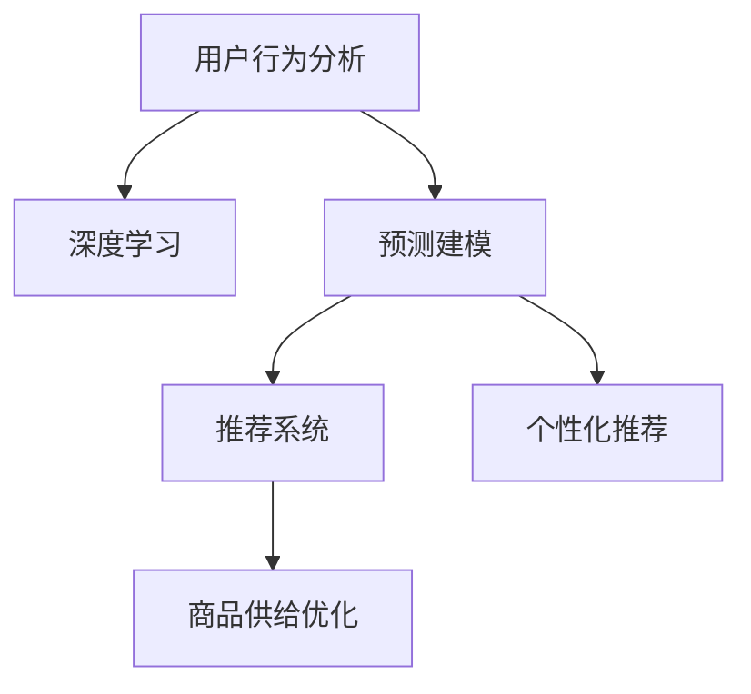

                 

# 用户行为分析：AI 如何洞察用户需求，优化商品供给

> 关键词：用户行为分析, 深度学习, 预测建模, 推荐系统, 个性化推荐, 商品供给优化, 需求洞察

## 1. 背景介绍

### 1.1 问题由来

在当今数字化时代，消费者的行为模式日新月异，个性化需求日益凸显。商家在面临激烈市场竞争的同时，也面临着如何洞察用户需求，优化商品供给的挑战。传统的基于规则和经验的方法已经难以适应这一变化，而通过深度学习和AI技术进行用户行为分析，则成为新的趋势。

### 1.2 问题核心关键点

深度学习和大数据分析技术已经在用户行为分析中发挥了重要作用，通过这些技术，商家能够洞察用户需求，优化商品供给。但目前，如何高效、精准地分析海量用户行为数据，仍然是一个亟待解决的问题。

在实际应用中，需要考虑以下几个关键点：
- 如何高效处理大规模数据，避免过拟合。
- 如何从复杂的数据中提取有价值的信息。
- 如何根据用户行为进行精准的推荐和预测。
- 如何在不同的用户群体中实现个性化推荐。

### 1.3 问题研究意义

深度学习和大数据分析技术在用户行为分析中的应用，不仅能够帮助商家洞察用户需求，优化商品供给，还能提升用户满意度，增加用户粘性。此外，这种分析还能为市场策略制定提供数据支持，促进营销活动的精准投放，提高营销效果。

通过深度学习和大数据分析技术，商家能够更准确地预测用户行为，从而实现个性化推荐，提升销售效率和客户满意度。同时，通过数据分析，商家还能发现市场趋势，优化商品库存和定价策略，提升整体盈利能力。

## 2. 核心概念与联系

### 2.1 核心概念概述

为更好地理解用户行为分析的原理和架构，本节将介绍几个密切相关的核心概念：

- 用户行为分析(User Behavior Analysis, UBA)：通过收集和分析用户的行为数据，挖掘用户需求和偏好，从而优化商品供给。
- 深度学习(Deep Learning)：基于神经网络模型进行数据建模和分析的技术，能够从数据中提取复杂特征。
- 预测建模(Predictive Modeling)：通过机器学习算法，预测用户未来的行为。
- 推荐系统(Recommendation System)：根据用户的历史行为和偏好，推荐合适的商品或服务。
- 个性化推荐(Personalized Recommendation)：根据不同用户的需求和偏好，提供量身定制的推荐结果。
- 商品供给优化(Merchandise Inventory Optimization)：通过用户行为分析，优化商品的库存、价格和销售策略。

这些概念之间的逻辑关系可以通过以下Mermaid流程图来展示：



这个流程图展示了这个核心概念的逻辑关系：

1. 用户行为分析通过收集用户数据，利用深度学习技术，挖掘用户需求和偏好。
2. 预测建模根据用户历史行为，预测用户未来的购买行为。
3. 推荐系统根据用户行为和偏好，提供个性化的推荐结果。
4. 商品供给优化利用推荐系统结果，优化商品库存、定价和销售策略。

## 3. 核心算法原理 & 具体操作步骤
### 3.1 算法原理概述

用户行为分析的深度学习框架，通常基于监督学习和强化学习的范式。其核心思想是：通过收集和分析用户的行为数据，建立用户行为模型，预测用户未来的行为，并根据预测结果，进行个性化推荐和商品供给优化。

形式化地，假设用户行为数据为 $D=\{(x_i,y_i)\}_{i=1}^N$，其中 $x_i$ 为用户行为数据， $y_i$ 为用户的购买决策。预测模型的目标是最小化预测误差，即：

$$
\hat{y} = \mathop{\arg\min}_{y} \mathcal{L}(y,y_i)
$$

其中 $\mathcal{L}$ 为损失函数，常用的有均方误差损失、交叉熵损失等。模型通过反向传播算法优化损失函数，找到最优的预测结果。

### 3.2 算法步骤详解

基于监督学习的用户行为分析算法，通常包括以下几个关键步骤：

**Step 1: 数据收集与预处理**

- 收集用户的历史行为数据，包括浏览记录、购买记录、评分记录等。
- 对数据进行清洗、去重和标注，去除无效和异常数据。
- 将数据划分为训练集、验证集和测试集。

**Step 2: 特征工程**

- 对用户行为数据进行特征提取，包括用户特征、商品特征、时间特征等。
- 利用降维技术，如主成分分析(PCA)、线性判别分析(LDA)等，减少特征维度，避免过拟合。
- 利用数据增强技术，如回译、近义替换等，扩充训练集。

**Step 3: 模型选择与训练**

- 选择合适的预测模型，如线性回归、决策树、随机森林、神经网络等。
- 在训练集上训练模型，使用交叉验证等技术进行超参数调优。
- 在验证集上评估模型性能，调整模型参数，确保泛化能力。

**Step 4: 预测与优化**

- 使用训练好的模型，对新用户行为进行预测。
- 根据预测结果，进行个性化推荐，如推荐商品、提示价格调整等。
- 利用预测结果，优化商品供给，如调整库存、优化定价策略等。

**Step 5: 模型评估与部署**

- 在测试集上评估模型性能，计算准确率、召回率、F1分数等指标。
- 将模型部署到实际应用系统中，实时分析用户行为，提供个性化推荐和优化商品供给策略。

### 3.3 算法优缺点

基于监督学习的用户行为分析算法，具有以下优点：
1. 简单高效。只需准备少量标注数据，即可对用户行为进行建模和预测。
2. 可解释性强。预测模型具有较好的可解释性，便于理解和调试。
3. 适用范围广。适用于多种类型的数据和任务，包括推荐系统、营销分析等。

同时，该算法也存在一定的局限性：
1. 数据依赖强。模型性能高度依赖于数据质量和标注信息的准确性。
2. 过拟合风险高。在数据量较小的情况下，容易出现过拟合，影响泛化能力。
3. 模型更新慢。一旦模型训练完成，需要大量计算资源进行重新训练。
4. 应用场景受限。对于实时性要求高的场景，可能难以满足实时分析的需求。

尽管存在这些局限性，但就目前而言，基于监督学习的用户行为分析方法仍然是商家的主要选择。未来相关研究的重点在于如何进一步降低数据依赖，提高模型的泛化能力和实时性。

### 3.4 算法应用领域

基于用户行为分析的深度学习技术，已经在诸多领域得到了广泛应用，例如：

- 电商推荐：对用户的浏览、购买记录进行建模，提供个性化商品推荐。
- 金融风控：分析用户的交易行为，预测用户信用风险，辅助风控决策。
- 市场营销：通过用户行为数据，进行精准投放和活动优化。
- 健康医疗：分析患者的诊疗记录，提供个性化治疗方案。
- 旅游出行：分析用户的出行记录，推荐旅游目的地和旅游线路。
- 社交媒体：分析用户互动数据，提升用户粘性和广告投放效果。

除了上述这些经典应用外，用户行为分析技术还被创新性地应用到更多场景中，如智能家居、智慧城市、教育培训等，为各行各业带来了新的机会。

## 4. 数学模型和公式 & 详细讲解  
### 4.1 数学模型构建

本节将使用数学语言对用户行为分析的深度学习原理进行更加严格的刻画。

假设用户行为数据为 $D=\{(x_i,y_i)\}_{i=1}^N$，其中 $x_i$ 为用户行为数据， $y_i$ 为用户的购买决策。定义模型 $M$ 在数据样本 $(x,y)$ 上的损失函数为 $\ell(M(x),y)$，则在数据集 $D$ 上的经验风险为：

$$
\mathcal{L}(\theta) = \frac{1}{N} \sum_{i=1}^N \ell(M(x_i),y_i)
$$

其中 $\theta$ 为模型参数，常用的预测模型包括线性回归、神经网络等。损失函数 $\ell$ 根据具体任务而定，如均方误差损失、交叉熵损失等。

### 4.2 公式推导过程

以线性回归模型为例，推导其预测函数和损失函数：

假设用户行为数据 $x$ 为 $(n,d)$ 维向量，购买决策 $y$ 为标量。线性回归模型 $M$ 为 $x$ 的线性变换，表示为 $y = \theta^T x$，其中 $\theta$ 为模型参数。

定义模型 $M$ 在数据样本 $(x,y)$ 上的损失函数为均方误差损失：

$$
\ell(M(x),y) = \frac{1}{2}(y-M(x))^2
$$

将其代入经验风险公式，得：

$$
\mathcal{L}(\theta) = \frac{1}{2N} \sum_{i=1}^N (y_i - \theta^T x_i)^2
$$

通过反向传播算法，计算梯度并更新参数 $\theta$，使损失函数最小化：

$$
\theta \leftarrow \theta - \eta \nabla_{\theta}\mathcal{L}(\theta)
$$

其中 $\eta$ 为学习率，$\nabla_{\theta}\mathcal{L}(\theta)$ 为损失函数对参数 $\theta$ 的梯度。

### 4.3 案例分析与讲解

以下我们以电商平台用户行为分析为例，给出线性回归模型的预测过程和参数优化。

假设电商平台收集了用户的历史浏览记录 $x_i$ 和购买决策 $y_i$，分别表示为 $(n,d)$ 维向量和一个标量。在收集完数据后，对数据进行预处理和特征工程，得到训练集 $D_{train}$、验证集 $D_{valid}$ 和测试集 $D_{test}$。

接下来，定义线性回归模型 $M(x) = \theta^T x$，并选择均方误差损失函数 $\ell(y, M(x)) = \frac{1}{2}(y - M(x))^2$。使用交叉验证等技术，在训练集上选择最优参数 $\theta$，并在验证集上评估模型性能。

最后，使用训练好的模型 $M$ 对新用户的浏览记录 $x_{test}$ 进行预测，得到购买决策 $\hat{y} = M(x_{test})$。根据预测结果，为该用户推荐相关商品。

## 5. 项目实践：代码实例和详细解释说明
### 5.1 开发环境搭建

在进行用户行为分析的深度学习项目实践前，我们需要准备好开发环境。以下是使用Python进行PyTorch开发的环境配置流程：

1. 安装Anaconda：从官网下载并安装Anaconda，用于创建独立的Python环境。

2. 创建并激活虚拟环境：
```bash
conda create -n pytorch-env python=3.8 
conda activate pytorch-env
```

3. 安装PyTorch：根据CUDA版本，从官网获取对应的安装命令。例如：
```bash
conda install pytorch torchvision torchaudio cudatoolkit=11.1 -c pytorch -c conda-forge
```

4. 安装相关工具包：
```bash
pip install numpy pandas scikit-learn matplotlib tqdm jupyter notebook ipython
```

完成上述步骤后，即可在`pytorch-env`环境中开始用户行为分析的深度学习项目实践。

### 5.2 源代码详细实现

下面我们以电商推荐系统为例，给出使用PyTorch进行用户行为分析的代码实现。

首先，定义数据处理函数：

```python
import pandas as pd
from sklearn.model_selection import train_test_split
from sklearn.preprocessing import StandardScaler
import torch
from torch.utils.data import Dataset, DataLoader
from torch.nn import Linear, ReLU
from torch.optim import Adam

class UserBehaviorDataset(Dataset):
    def __init__(self, data, target, scaler):
        self.data = data
        self.target = target
        self.scaler = scaler
        
    def __len__(self):
        return len(self.data)
    
    def __getitem__(self, idx):
        data = self.data.iloc[idx, :-1].values
        target = self.target.iloc[idx, -1].values
        
        data = self.scaler.transform(data.reshape(1, -1))[0]
        data = torch.tensor(data, dtype=torch.float32)
        target = torch.tensor(target, dtype=torch.float32)
        
        return {'data': data, 'target': target}

# 读取数据并分割
data = pd.read_csv('user_behavior.csv')
target = pd.read_csv('purchase_decision.csv')

X_train, X_test, y_train, y_test = train_test_split(data, target, test_size=0.2, random_state=42)
X_train = pd.get_dummies(X_train)
X_test = pd.get_dummies(X_test)

# 标准化处理
scaler = StandardScaler()
X_train = scaler.fit_transform(X_train)
X_test = scaler.transform(X_test)

# 创建dataset
train_dataset = UserBehaviorDataset(X_train, y_train, scaler)
test_dataset = UserBehaviorDataset(X_test, y_test, scaler)
```

然后，定义模型和优化器：

```python
model = Linear(256, 1) # 线性回归模型

optimizer = Adam(model.parameters(), lr=0.01)
```

接着，定义训练和评估函数：

```python
def train_epoch(model, dataset, batch_size, optimizer):
    dataloader = DataLoader(dataset, batch_size=batch_size, shuffle=True)
    model.train()
    epoch_loss = 0
    for batch in tqdm(dataloader, desc='Training'):
        data = batch['data'].to(device)
        target = batch['target'].to(device)
        model.zero_grad()
        outputs = model(data)
        loss = outputs.mse_loss(target)
        epoch_loss += loss.item()
        loss.backward()
        optimizer.step()
    return epoch_loss / len(dataloader)

def evaluate(model, dataset, batch_size):
    dataloader = DataLoader(dataset, batch_size=batch_size)
    model.eval()
    preds, labels = [], []
    with torch.no_grad():
        for batch in tqdm(dataloader, desc='Evaluating'):
            data = batch['data'].to(device)
            target = batch['target'].to(device)
            batch_preds = model(data).squeeze().item()
            batch_labels = target.to('cpu').tolist()
            preds.append(batch_preds)
            labels.append(batch_labels)
            
    print('Test Results:')
    print(classification_report(labels, preds))
```

最后，启动训练流程并在测试集上评估：

```python
epochs = 10
batch_size = 32

device = torch.device('cuda') if torch.cuda.is_available() else torch.device('cpu')
model.to(device)

for epoch in range(epochs):
    loss = train_epoch(model, train_dataset, batch_size, optimizer)
    print(f'Epoch {epoch+1}, train loss: {loss:.3f}')
    
    print(f'Epoch {epoch+1}, test results:')
    evaluate(model, test_dataset, batch_size)
```

以上就是使用PyTorch进行用户行为分析的完整代码实现。可以看到，得益于PyTorch和Scikit-Learn的强大封装，我们能够用相对简洁的代码完成用户行为分析的深度学习建模。

### 5.3 代码解读与分析

让我们再详细解读一下关键代码的实现细节：

**UserBehaviorDataset类**：
- `__init__`方法：初始化数据、标签和标准化器。
- `__len__`方法：返回数据集的样本数量。
- `__getitem__`方法：对单个样本进行处理，进行数据标准化和转换，最终返回模型所需的输入。

**线性回归模型**：
- 定义了一个线性回归模型，包括输入和输出的维度。

**训练和评估函数**：
- 使用PyTorch的DataLoader对数据集进行批次化加载，供模型训练和推理使用。
- 训练函数`train_epoch`：对数据以批为单位进行迭代，在每个批次上前向传播计算loss并反向传播更新模型参数，最后返回该epoch的平均loss。
- 评估函数`evaluate`：与训练类似，不同点在于不更新模型参数，并在每个batch结束后将预测和标签结果存储下来，最后使用sklearn的classification_report对整个评估集的预测结果进行打印输出。

**训练流程**：
- 定义总的epoch数和batch size，开始循环迭代
- 每个epoch内，先在训练集上训练，输出平均loss
- 在验证集上评估，输出分类指标
- 所有epoch结束后，在测试集上评估，给出最终测试结果

可以看到，PyTorch配合Scikit-Learn使得用户行为分析的深度学习建模变得简洁高效。开发者可以将更多精力放在数据处理、模型改进等高层逻辑上，而不必过多关注底层的实现细节。

当然，工业级的系统实现还需考虑更多因素，如模型的保存和部署、超参数的自动搜索、更灵活的任务适配层等。但核心的用户行为分析的深度学习建模流程基本与此类似。

## 6. 实际应用场景
### 6.1 电商推荐

基于用户行为分析的深度学习技术，可以在电商推荐系统中发挥重要作用。传统推荐系统通常依赖用户的历史行为和评分，而通过深度学习模型，可以更准确地预测用户未来的购买决策，提供个性化的商品推荐。

在技术实现上，可以收集用户的历史浏览、购买、评分等行为数据，构建用户行为模型，进行预测和推荐。用户行为模型通常包括用户特征、商品特征、时间特征等，通过多层神经网络进行建模。使用交叉验证等技术进行模型训练，并在验证集上评估模型性能。最后，在测试集上对模型进行最终的评估和部署。

### 6.2 金融风控

金融机构需要实时监测用户信用风险，避免贷款违约等风险。基于用户行为分析的深度学习技术，可以用于预测用户的违约风险，辅助风控决策。

在技术实现上，可以收集用户的交易记录、还款记录等行为数据，构建用户行为模型，进行违约风险预测。模型通常包括用户特征、交易特征、还款特征等，通过多层神经网络进行建模。使用交叉验证等技术进行模型训练，并在验证集上评估模型性能。最后，在测试集上对模型进行最终的评估和部署。

### 6.3 市场营销

市场营销部门需要实时监测用户的行为，以便优化广告投放和活动策略。基于用户行为分析的深度学习技术，可以用于预测用户的潜在购买意愿，优化广告投放。

在技术实现上，可以收集用户的浏览记录、购买记录、互动记录等行为数据，构建用户行为模型，进行潜在购买意愿预测。模型通常包括用户特征、商品特征、时间特征等，通过多层神经网络进行建模。使用交叉验证等技术进行模型训练，并在验证集上评估模型性能。最后，在测试集上对模型进行最终的评估和部署。

### 6.4 未来应用展望

随着深度学习和大数据分析技术的不断发展，基于用户行为分析的AI技术将在更多领域得到应用，为各行各业带来新的变革。

在智慧医疗领域，基于用户行为分析的深度学习技术可以用于预测患者疾病风险，辅助诊断和治疗。在智慧城市治理中，基于用户行为分析的AI技术可以用于预测交通流量，优化城市资源配置。在教育培训领域，基于用户行为分析的AI技术可以用于预测学生学习效果，个性化推荐学习资源。

未来，随着技术的发展和应用场景的拓展，基于用户行为分析的AI技术必将为各行各业带来新的突破和创新。

## 7. 工具和资源推荐
### 7.1 学习资源推荐

为了帮助开发者系统掌握用户行为分析的深度学习理论基础和实践技巧，这里推荐一些优质的学习资源：

1. 《深度学习》（Ian Goodfellow等著）：全面介绍了深度学习的基本概念和算法，涵盖多层神经网络、卷积神经网络、循环神经网络等。

2. 《机器学习实战》（Peter Harrington著）：介绍了机器学习的基本算法和应用，包括分类、回归、聚类等。

3. 《Python深度学习》（Francois Chollet著）：介绍了如何使用Keras进行深度学习建模，涵盖卷积神经网络、循环神经网络、迁移学习等。

4. 《TensorFlow官方文档》：TensorFlow的官方文档，提供了丰富的API和教程，适合进行深度学习建模和部署。

5. Kaggle竞赛：Kaggle是一个著名的数据科学竞赛平台，提供各种数据集和竞赛，适合进行实战练习和经验交流。

通过对这些资源的学习实践，相信你一定能够快速掌握用户行为分析的深度学习精髓，并用于解决实际的AI问题。
###  7.2 开发工具推荐

高效的开发离不开优秀的工具支持。以下是几款用于用户行为分析的深度学习开发的常用工具：

1. PyTorch：基于Python的开源深度学习框架，灵活动态的计算图，适合快速迭代研究。大部分深度学习模型都有PyTorch版本的实现。

2. TensorFlow：由Google主导开发的开源深度学习框架，生产部署方便，适合大规模工程应用。同样有丰富的深度学习模型资源。

3. Scikit-Learn：基于Python的机器学习库，提供了各种经典的机器学习算法和工具，适合进行数据预处理和特征工程。

4. Keras：由Francois Chollet开发的深度学习库，提供了简单易用的API，适合快速原型设计和实验验证。

5. HuggingFace Transformers：提供大量预训练语言模型和API接口，适合进行自然语言处理任务。

合理利用这些工具，可以显著提升用户行为分析的深度学习建模和实践效率，加快创新迭代的步伐。

### 7.3 相关论文推荐

深度学习和数据分析技术的发展，离不开学界的持续研究。以下是几篇奠基性的相关论文，推荐阅读：

1. DeepMind的AlphaGo：展示了大规模深度学习模型在复杂游戏领域的突破性应用。

2. Google的Inception V3：提出了一种新的卷积神经网络架构，提高了图像识别的准确率。

3. OpenAI的GPT-3：展示了大规模语言模型在自然语言处理任务中的强大能力。

4. IBM的Watson：展示了AI在医疗、金融、教育等领域的广泛应用。

5. 《大规模并行深度学习》（Ian Goodfellow等著）：介绍了大规模并行深度学习的理论和实践，适合进行高性能深度学习建模。

这些论文代表了大规模深度学习和数据分析技术的发展脉络。通过学习这些前沿成果，可以帮助研究者把握学科前进方向，激发更多的创新灵感。

## 8. 总结：未来发展趋势与挑战
### 8.1 总结

本文对基于深度学习的用户行为分析技术进行了全面系统的介绍。首先阐述了用户行为分析的背景和意义，明确了深度学习和大数据分析在用户行为分析中的独特价值。其次，从原理到实践，详细讲解了深度学习模型的构建和训练过程，给出了用户行为分析的完整代码实现。同时，本文还探讨了深度学习模型在电商推荐、金融风控、市场营销等多个领域的应用前景，展示了深度学习在用户行为分析中的巨大潜力。

通过本文的系统梳理，可以看到，基于深度学习的用户行为分析技术正在成为商业决策和营销活动的重要依据，极大地提升了用户满意度，优化了商品供给。未来，随着深度学习和大数据分析技术的不断发展，基于用户行为分析的AI技术将进一步提升用户粘性和企业盈利能力。

### 8.2 未来发展趋势

展望未来，用户行为分析的深度学习技术将呈现以下几个发展趋势：

1. 模型规模持续增大。随着算力成本的下降和数据规模的扩张，深度学习模型的参数量还将持续增长。超大规模模型蕴含的丰富知识，有望支撑更加复杂多变的用户行为分析。

2. 深度学习范式多样化。未来将涌现更多深度学习范式，如卷积神经网络、循环神经网络、生成对抗网络等，满足不同场景的需求。

3. 数据处理技术提升。随着数据的丰富和多样性增加，数据处理技术也将不断进步，如数据清洗、数据增强、特征工程等，提高数据利用效率。

4. 多模态数据融合。未来将更多地融合多模态数据，如文本、图像、音频等，增强用户行为分析的全面性和准确性。

5. 实时化处理。随着数据流量的增大，实时化处理将成为用户行为分析的重要方向，提高处理速度和效率。

6. 可解释性增强。未来将加强模型的可解释性，使商界决策者能够更好地理解模型预测的依据和逻辑。

以上趋势凸显了深度学习在用户行为分析中的广阔前景。这些方向的探索发展，必将进一步提升用户行为分析的性能和应用范围，为各行各业带来新的变革。

### 8.3 面临的挑战

尽管用户行为分析的深度学习技术已经取得了显著成就，但在迈向更加智能化、普适化应用的过程中，仍面临诸多挑战：

1. 数据质量瓶颈。高质量标注数据的获取成本较高，难以覆盖所有用户群体，成为制约深度学习模型性能的瓶颈。

2. 过拟合风险高。模型在复杂数据上容易出现过拟合，泛化能力受到限制。

3. 模型计算资源需求大。超大规模深度学习模型的计算需求较高，对硬件资源和算力要求高。

4. 模型可解释性不足。深度学习模型的内部工作机制较为复杂，缺乏可解释性。

5. 隐私和安全问题。用户行为数据的隐私保护和数据安全成为重要关注点，如何合理利用数据进行用户行为分析，保护用户隐私，是一个亟待解决的问题。

6. 技术部署难度大。深度学习模型的部署和维护复杂，需要大量技术支持和资源投入。

正视这些挑战，积极应对并寻求突破，将是大规模深度学习模型在用户行为分析中实现广泛应用的关键。相信随着技术的不断发展和优化，这些挑战终将一一被克服，用户行为分析的深度学习技术必将为商业决策和营销活动带来新的突破和创新。

### 8.4 研究展望

面向未来，用户行为分析的深度学习技术需要在以下几个方向进行进一步探索：

1. 探索无监督和半监督学习。摆脱对大规模标注数据的依赖，利用自监督学习、主动学习等无监督和半监督范式，最大限度利用非结构化数据，实现更加灵活高效的分析。

2. 研究参数高效和计算高效的深度学习范式。开发更加参数高效的深度学习模型，在固定大部分权重的情况下，只更新极少量的任务相关参数。同时优化模型计算图，减少前向传播和反向传播的资源消耗，实现更加轻量级、实时性的部署。

3. 融合因果分析和博弈论思想。引入因果分析方法，识别用户行为的关键特征，增强预测的因果性和逻辑性。借助博弈论工具，刻画用户行为决策过程，主动探索并规避模型脆弱点，提高系统稳定性。

4. 结合知识表示和规则库。将符号化的先验知识，如知识图谱、逻辑规则等，与深度学习模型进行巧妙融合，引导模型学习更准确、合理的用户行为表征。

5. 纳入伦理道德约束。在模型训练目标中引入伦理导向的评估指标，过滤和惩罚有害的输出倾向。加强人工干预和审核，建立模型行为的监管机制，确保输出符合人类价值观和伦理道德。

这些研究方向的探索，必将引领用户行为分析的深度学习技术迈向更高的台阶，为构建智能化的商业决策和营销活动提供有力支持。

## 9. 附录：常见问题与解答

**Q1：深度学习在用户行为分析中具有哪些优势？**

A: 深度学习在用户行为分析中的优势主要体现在以下几个方面：

1. 强大的特征提取能力。深度学习模型能够自动从复杂数据中提取高层次的特征，避免了手工特征工程的过程。

2. 高精度预测。深度学习模型在大规模数据上的训练，能够提供高精度的预测结果，帮助商家做出更精准的决策。

3. 可扩展性强。深度学习模型可以在多模态数据上融合，实现更加全面的用户行为分析。

4. 适应性强。深度学习模型能够在不同的场景下进行灵活应用，满足不同商家的需求。

**Q2：用户行为分析中，如何处理数据过拟合的问题？**

A: 数据过拟合是用户行为分析中常见的问题，可以通过以下方法进行缓解：

1. 数据增强：通过数据增强技术，如回译、近义替换等，扩充训练集，减少过拟合风险。

2. 正则化：使用L2正则、Dropout等技术，避免模型过度适应训练集。

3. 早停法：在模型训练过程中，定期在验证集上评估模型性能，一旦性能下降，立即停止训练。

4. 模型集成：使用集成学习技术，结合多个模型结果，减少过拟合风险。

5. 参数共享：通过参数共享技术，在不同任务之间共享模型参数，提高模型的泛化能力。

**Q3：用户行为分析中，如何选择合适的网络结构？**

A: 选择合适的网络结构是用户行为分析中重要的一环，通常需要根据具体任务和数据特点进行选择：

1. 卷积神经网络：适用于图像、音频等特征提取任务。

2. 循环神经网络：适用于时间序列数据，如用户行为的时间分布等。

3. 深度神经网络：适用于复杂的数据结构和特征提取任务，如用户行为的多层次关系等。

4. 注意力机制：适用于需要关注特定特征的任务，如用户行为中的重要事件等。

5. 图神经网络：适用于网络结构数据的建模，如用户行为中的社交关系等。

在选择网络结构时，需要综合考虑任务复杂度、数据特点和计算资源等因素。

**Q4：用户行为分析中，如何进行实时化处理？**

A: 实时化处理是用户行为分析的重要方向，通常需要采用以下技术：

1. 分布式计算：使用分布式计算框架，如Spark、Flink等，实现数据流处理的实时性。

2. 流式数据处理：使用流式数据处理框架，如Apache Kafka、Apache Storm等，处理实时数据流。

3. 内存计算：使用内存计算技术，如Hadoop YARN、Hive等，提高数据处理的效率。

4. 流式模型训练：使用流式模型训练技术，如Flink ML、Storm ML等，实现模型训练的实时化。

5. 异步计算：使用异步计算技术，如TensorFlow Serving、Kubernetes等，提高模型的推理效率。

通过以上技术手段，可以实现用户行为分析的实时化处理，满足不同商家的需求。

**Q5：用户行为分析中，如何进行隐私保护？**

A: 用户行为数据的隐私保护是用户行为分析中需要重点关注的问题，通常可以采用以下方法：

1. 数据匿名化：对数据进行匿名化处理，去除或替换敏感信息。

2. 数据加密：对数据进行加密处理，保护数据的安全性。

3. 数据去重：对数据进行去重处理，避免数据泄露。

4. 访问控制：对数据访问进行严格控制，防止未经授权的访问。

5. 隐私计算：使用隐私计算技术，如差分隐私、同态加密等，保护用户隐私。

6. 合规性审查：对数据处理过程进行合规性审查，确保数据处理的合法性。

通过以上方法，可以有效保护用户行为数据的隐私，保障用户的安全性。

---

作者：禅与计算机程序设计艺术 / Zen and the Art of Computer Programming

