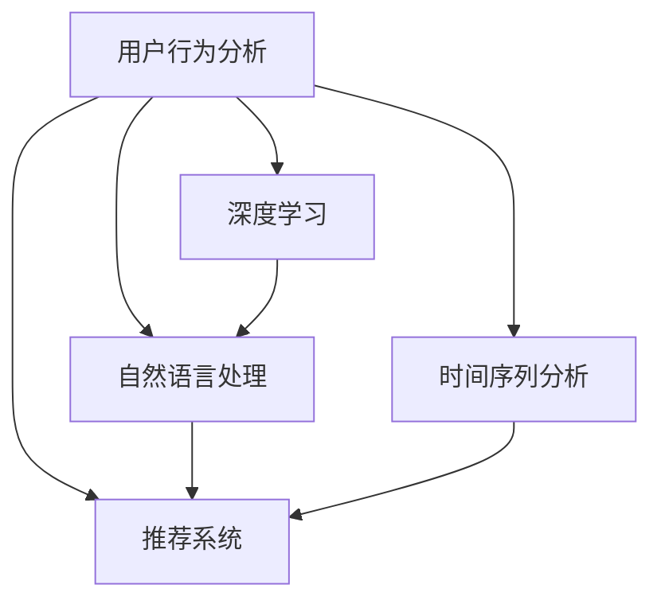

                 

## 1. 背景介绍

在现代社会，用户行为分析已经成为企业了解市场需求、优化商品供给的关键手段。传统的用户行为分析依赖于人工调研和历史数据统计，成本高、速度慢、结论有限。而随着人工智能(AI)技术的不断发展，AI已经开始在用户行为分析领域大展拳脚，通过深度学习和自然语言处理技术，自动发现用户潜在需求，优化商品供给。

### 1.1 问题由来

随着电商、社交、娱乐等平台的大规模用户数据积累，企业越来越渴望借助这些数据洞悉用户的真实需求和行为，优化商品和服务供给，从而提升用户满意度、增加用户粘性、提升营收。然而，庞大的数据规模和多样化的用户行为，使得人工分析变得成本高、效率低。

为了更好地应对这一挑战，企业开始寻求技术手段，自动化、智能化地分析用户行为，挖掘潜在需求。深度学习、自然语言处理、时间序列分析等AI技术为这一目标提供了强有力的工具。通过AI技术，企业可以更加高效、准确地分析用户行为，快速响应市场变化，优化商品供给。

### 1.2 问题核心关键点

用户行为分析的核心在于：
- 如何高效地从大规模用户数据中提取有用信息？
- 如何自动发现用户的潜在需求和行为规律？
- 如何根据用户需求优化商品供给，提升用户体验和满意度？
- 如何平衡数据隐私和安全，确保用户数据使用合规？

本文将围绕这些问题，系统介绍基于AI的用户行为分析方法，探讨其原理、步骤、优缺点和应用领域，为读者提供全面的技术指引。

## 2. 核心概念与联系

### 2.1 核心概念概述

为更好地理解AI在用户行为分析中的应用，本节将介绍几个密切相关的核心概念：

- **用户行为分析(User Behavior Analysis, UBA)**：通过数据分析技术，自动挖掘用户的行为模式、偏好和需求，为企业提供用户画像和行为洞察，辅助决策和优化。
- **深度学习(Deep Learning, DL)**：一种机器学习算法，通过多层神经网络模型，自动提取高维数据中的隐含特征，进行分类、回归、生成等任务。
- **自然语言处理(Natural Language Processing, NLP)**：使计算机能理解、处理、生成自然语言的技术，常用于情感分析、主题建模等任务。
- **推荐系统(Recommendation System)**：基于用户行为和物品属性，自动推荐用户可能感兴趣的商品或内容，提升用户体验。
- **时间序列分析(Time Series Analysis)**：分析按时间顺序排列的数据，以揭示趋势、周期和季节性规律，常用于用户行为预测和异常检测。

这些核心概念之间的逻辑关系可以通过以下Mermaid流程图来展示：



这个流程图展示了大语言模型的核心概念及其之间的关系：

1. 用户行为分析通过深度学习、自然语言处理、时间序列分析等技术，自动分析用户数据。
2. 深度学习模型可以从高维数据中提取出用户行为和需求。
3. 自然语言处理可以分析用户评论、聊天记录等文本数据，发现用户情感和主题。
4. 推荐系统可以基于用户行为数据，自动推荐商品或内容。
5. 时间序列分析可以发现用户行为随时间的规律性变化，进行预测和异常检测。

## 3. 核心算法原理 & 具体操作步骤
### 3.1 算法原理概述

基于AI的用户行为分析，其核心原理在于利用深度学习模型自动提取用户行为特征，结合自然语言处理和时间序列分析，挖掘用户行为模式和潜在需求，从而优化商品供给。

具体而言，可以通过以下步骤实现：
1. 收集用户数据，包括用户点击、浏览、购买、评价、聊天等行为数据。
2. 清洗和预处理数据，去除噪声和异常值，保证数据质量。
3. 设计深度学习模型，通过多层神经网络自动学习用户行为特征。
4. 应用自然语言处理技术，从文本数据中提取用户情感和主题。
5. 使用时间序列分析方法，发现用户行为随时间的规律性变化。
6. 结合推荐系统，根据用户需求自动推荐商品或内容。

### 3.2 算法步骤详解

基于AI的用户行为分析流程包括以下几个关键步骤：

**Step 1: 数据收集与预处理**

1. 收集用户行为数据。包括用户点击、浏览、购买、评价、聊天等行为数据。
2. 数据清洗和预处理。去除数据中的噪声和异常值，处理缺失值和重复数据，保证数据质量。
3. 数据划分。将数据划分为训练集、验证集和测试集，以便进行模型训练和评估。

**Step 2: 模型设计与训练**

1. 选择深度学习模型。如CNN、RNN、LSTM等，根据任务特点设计合适的神经网络结构。
2. 特征工程。提取数据中的特征，如用户ID、商品ID、时间戳等，保证模型训练效果。
3. 模型训练。使用训练集数据，以交叉熵、均方误差等损失函数优化模型参数。
4. 验证集调参。在验证集上调整超参数，如学习率、批大小、正则化系数等，选择最优参数组合。

**Step 3: 分析与预测**

1. 用户行为分析。通过模型分析用户行为特征，构建用户画像，发现用户需求和行为规律。
2. 情感分析。应用自然语言处理技术，分析用户评论、聊天记录等文本数据，发现用户情感和主题。
3. 行为预测。使用时间序列分析方法，预测用户行为趋势和异常情况，及时预警。
4. 推荐系统。结合用户需求和商品属性，自动推荐商品或内容，提升用户体验。

**Step 4: 部署与评估**

1. 模型部署。将训练好的模型部署到生产环境，实时处理用户行为数据。
2. 性能评估。在测试集上评估模型性能，对比模型效果与业务目标。
3. 持续优化。根据实际效果，不断优化模型参数和算法，提升预测准确度。

### 3.3 算法优缺点

基于AI的用户行为分析方法，具有以下优点：
1. 自动化高效。通过深度学习模型，自动提取用户行为特征，减少了人工分析的复杂性和工作量。
2. 预测精准。深度学习模型可以从高维数据中自动发现用户需求和行为规律，提升预测准确度。
3. 实时响应。AI模型可以快速处理用户行为数据，实时响应市场变化，优化商品供给。
4. 灵活多样。AI技术可以应用于多种用户行为分析场景，如商品推荐、用户画像、情感分析等，满足不同业务需求。

同时，该方法也存在一定的局限性：
1. 数据质量依赖。AI模型性能高度依赖于数据质量和特征选择，数据质量低或特征选择不当会导致模型性能下降。
2. 模型复杂度高。深度学习模型参数量巨大，需要高性能计算资源，训练和部署成本高。
3. 模型黑盒性。深度学习模型往往是"黑盒"系统，难以解释模型内部的决策逻辑，增加了算法可解释性的挑战。
4. 隐私保护困难。用户行为数据涉及隐私，如何在保护隐私的前提下，充分利用数据进行分析，是重要的挑战。

尽管存在这些局限性，但AI在用户行为分析中的应用前景依然广阔。随着数据质量提升、硬件性能增强和模型优化，AI在用户行为分析中的作用将进一步凸显。

### 3.4 算法应用领域

基于AI的用户行为分析方法，已经在电商、社交、娱乐等多个领域得到广泛应用，具体包括：

- **电商零售**：分析用户点击、浏览、购买行为，发现用户兴趣和需求，推荐商品，提升销售额。
- **在线教育**：分析学生学习行为，如课程观看、作业提交等，发现学习效果和薄弱环节，优化课程内容和教学方法。
- **金融服务**：分析用户交易行为，发现潜在风险和欺诈行为，提升风险管理水平。
- **智能家居**：分析用户家居设备使用行为，发现习惯和偏好，推荐设备和服务，提升用户体验。
- **健康医疗**：分析用户健康行为，如饮食、运动、睡眠等，发现健康风险，提供个性化健康建议。

除了上述这些领域，AI在用户行为分析中的应用还将拓展到更多行业，如旅游、娱乐、农业等，带来新的商业模式和技术创新。

## 4. 数学模型和公式 & 详细讲解 & 举例说明
### 4.1 数学模型构建

基于AI的用户行为分析，其数学模型构建涉及深度学习、自然语言处理、时间序列分析等多个领域。以下简要介绍几个关键模型的构建过程。

**深度学习模型**

假设用户行为数据为 $X=\{x_1, x_2, ..., x_N\}$，其中 $x_i$ 表示用户第 $i$ 次的行为数据。目标是设计一个深度神经网络模型 $M$，使得 $M(x_i)$ 能够自动学习用户行为特征，预测用户需求。

数学模型构建如下：
1. 输入层：将用户行为数据 $x_i$ 映射为向量 $\mathbf{x_i} \in \mathbb{R}^d$。
2. 隐藏层：通过多层神经网络模型 $M$，学习用户行为特征，输出特征向量 $\mathbf{h_i} \in \mathbb{R}^h$。
3. 输出层：使用线性回归或分类器，将特征向量 $\mathbf{h_i}$ 映射为预测结果 $y_i \in \mathbb{R}$ 或 $\{0, 1\}$。

**自然语言处理模型**

假设用户评论文本为 $T=\{t_1, t_2, ..., t_M\}$，其中 $t_i$ 表示第 $i$ 条用户评论。目标是设计一个自然语言处理模型，分析评论文本，发现用户情感和主题。

数学模型构建如下：
1. 输入层：将评论文本 $t_i$ 转换为词向量序列 $\mathbf{w_i} \in \mathbb{R}^w$。
2. 隐藏层：通过多层神经网络模型 $NLP$，学习评论特征，输出情感和主题向量 $\mathbf{e_i} \in \mathbb{R}^e$。
3. 输出层：使用分类器，将情感和主题向量 $\mathbf{e_i}$ 映射为情感标签 $s_i \in \{0, 1\}$ 或主题标签 $\mathbf{t_i} \in \mathbb{R}^k$。

**时间序列分析模型**

假设用户行为数据为 $Y=\{y_1, y_2, ..., y_T\}$，其中 $y_t$ 表示用户第 $t$ 次的行为数据。目标是设计一个时间序列模型 $TSA$，预测用户行为趋势和异常情况。

数学模型构建如下：
1. 输入层：将用户行为数据 $y_t$ 转换为时间序列 $\mathbf{y_t} \in \mathbb{R}^n$。
2. 隐藏层：通过时间序列模型 $TSA$，学习时间序列特征，输出趋势和异常信号 $\mathbf{z_t} \in \mathbb{R}^m$。
3. 输出层：使用回归器或分类器，将趋势和异常信号 $\mathbf{z_t}$ 映射为预测结果 $a_t \in \mathbb{R}$ 或异常标签 $b_t \in \{0, 1\}$。

### 4.2 公式推导过程

以深度学习模型为例，推导模型参数优化的过程。

假设输入数据为 $\mathbf{x_i} \in \mathbb{R}^d$，输出为 $y_i \in \mathbb{R}$。深度学习模型 $M$ 的参数表示为 $\theta$，包含权重和偏置。模型的输出为 $\hat{y_i}=M(x_i; \theta)$。

深度学习模型的损失函数为：
$$
\mathcal{L}(\theta) = \frac{1}{N} \sum_{i=1}^N (y_i - \hat{y_i})^2
$$

通过反向传播算法，计算损失函数对模型参数 $\theta$ 的梯度：
$$
\nabla_{\theta}\mathcal{L}(\theta) = \frac{1}{N} \sum_{i=1}^N 2(y_i - \hat{y_i})(\mathbf{x_i})\nabla_{\theta}\hat{y_i}
$$

根据梯度下降算法，更新模型参数：
$$
\theta \leftarrow \theta - \eta \nabla_{\theta}\mathcal{L}(\theta)
$$

其中 $\eta$ 为学习率，控制每次参数更新的步长。

### 4.3 案例分析与讲解

以电商零售用户行为分析为例，展示基于AI的用户行为分析流程。

**数据收集**

电商平台的点击、浏览、购买数据通过API接口获取，形成用户行为数据集 $X=\{x_1, x_2, ..., x_N\}$。其中 $x_i$ 包含用户ID、商品ID、时间戳、行为类型等属性。

**数据清洗与预处理**

数据清洗过程包括去除异常数据、处理缺失值和重复数据。例如，去除数据集中用户ID或商品ID相同的记录，处理购买行为时间戳异常的数据。

**模型设计**

1. 输入层：将用户行为数据 $x_i$ 映射为向量 $\mathbf{x_i} \in \mathbb{R}^d$，其中 $d=6$，包含用户ID、商品ID、时间戳等属性。
2. 隐藏层：设计多层神经网络模型 $M$，包括2个隐藏层，每层包含200个神经元。
3. 输出层：使用回归器，将特征向量 $\mathbf{h_i}$ 映射为预测结果 $y_i$，预测用户是否购买商品。

**模型训练**

使用训练集数据，以均方误差为损失函数，优化模型参数：
$$
\mathcal{L}(\theta) = \frac{1}{N} \sum_{i=1}^N (y_i - \hat{y_i})^2
$$

使用AdamW优化算法，学习率 $\eta=0.001$，批大小 $64$，迭代轮数 $10$，训练模型。

**用户行为分析**

在模型训练完成后，使用验证集调参。在测试集上评估模型性能，输出模型预测结果 $y_i$，并与真实结果 $y_i$ 进行对比，计算预测准确度。

**情感分析**

以电商评论数据为例，分析用户情感。将用户评论文本 $T=\{t_1, t_2, ..., t_M\}$ 转换为词向量序列 $\mathbf{w_i} \in \mathbb{R}^w$，其中 $w=300$，表示词向量维度。

设计多层神经网络模型 $NLP$，包括2个隐藏层，每层包含100个神经元。使用分类器，将情感和主题向量 $\mathbf{e_i}$ 映射为情感标签 $s_i$，预测用户评论情感。

## 5. 项目实践：代码实例和详细解释说明
### 5.1 开发环境搭建

在进行用户行为分析项目开发前，需要准备好开发环境。以下是使用Python进行TensorFlow开发的环境配置流程：

1. 安装Anaconda：从官网下载并安装Anaconda，用于创建独立的Python环境。

2. 创建并激活虚拟环境：
```bash
conda create -n tf-env python=3.8 
conda activate tf-env
```

3. 安装TensorFlow：根据CUDA版本，从官网获取对应的安装命令。例如：
```bash
conda install tensorflow -c tf -c conda-forge
```

4. 安装各类工具包：
```bash
pip install numpy pandas scikit-learn matplotlib tqdm jupyter notebook ipython
```

完成上述步骤后，即可在`tf-env`环境中开始用户行为分析项目开发。

### 5.2 源代码详细实现

以下是一个基于TensorFlow的深度学习用户行为分析代码示例：

```python
import tensorflow as tf
import numpy as np
import pandas as pd

# 数据准备
data = pd.read_csv('user_behavior_data.csv')
X_train = data.iloc[:800].drop('target', axis=1)
y_train = data.iloc[:800]['target']
X_test = data.iloc[800:].drop('target', axis=1)
y_test = data.iloc[800:]['target']

# 模型定义
model = tf.keras.models.Sequential([
    tf.keras.layers.Dense(64, activation='relu', input_shape=(6,)),
    tf.keras.layers.Dense(64, activation='relu'),
    tf.keras.layers.Dense(1, activation='sigmoid')
])

# 模型编译
model.compile(optimizer='adam', loss='binary_crossentropy', metrics=['accuracy'])

# 模型训练
history = model.fit(X_train, y_train, epochs=10, batch_size=32, validation_data=(X_test, y_test))

# 模型评估
test_loss, test_acc = model.evaluate(X_test, y_test)
print(f'Test loss: {test_loss:.4f}, Test acc: {test_acc:.4f}')
```

### 5.3 代码解读与分析

让我们再详细解读一下关键代码的实现细节：

**数据准备**

1. 使用Pandas库读取用户行为数据，将其转换为NumPy数组。
2. 将数据划分为训练集和测试集，使用前800条数据作为训练集，剩余的作为测试集。

**模型定义**

1. 使用TensorFlow定义多层神经网络模型。包含2个隐藏层，每层包含64个神经元，输出层为1个神经元，使用sigmoid激活函数。
2. 定义优化器、损失函数和评估指标。

**模型训练**

1. 使用训练集数据进行模型训练，迭代轮数为10，批大小为32。
2. 在训练过程中，使用验证集数据进行验证，计算模型性能。

**模型评估**

1. 在测试集上评估模型性能，输出预测准确度。

## 6. 实际应用场景
### 6.1 智能推荐系统

智能推荐系统是用户行为分析的重要应用场景之一。通过分析用户历史行为和偏好，智能推荐系统能够为用户推荐个性化的商品或内容，提升用户体验和满意度。

在电商领域，智能推荐系统可以分析用户浏览、点击、购买行为，发现用户兴趣和需求，推荐相关商品。例如，通过分析用户的浏览历史和点击记录，推荐相似商品或相关商品。在音乐、视频、新闻等领域，推荐系统同样可以基于用户行为数据，推荐个性化的内容和娱乐产品，提升用户粘性和体验。

### 6.2 用户画像分析

用户画像分析是通过分析用户行为数据，构建详细的用户画像，发现用户需求和行为规律。

在零售行业，用户画像分析可以分析用户购买历史、商品评价等数据，发现用户的兴趣和需求，提供个性化的商品推荐和营销策略。在在线教育领域，用户画像分析可以分析学生的学习行为，发现学习效果和薄弱环节，提供个性化的学习建议和课程推荐。

### 6.3 营销优化

营销优化是通过分析用户行为数据，优化营销策略，提高营销效果。

在电商领域，营销优化可以分析用户浏览和购买行为，发现高价值用户和转化率低的用户，进行精准营销。在在线教育领域，营销优化可以分析学生的学习行为和课程评价，发现高效果课程和低效果课程，进行个性化营销。

### 6.4 未来应用展望

随着AI技术的发展，基于用户行为分析的智能应用将更加广泛。以下是一些未来的应用场景：

1. **个性化健康管理**：分析用户的健康行为数据，如饮食、运动、睡眠等，发现健康风险，提供个性化的健康建议和饮食方案。
2. **智能家居控制**：分析用户的家居设备使用行为，发现习惯和偏好，提供个性化的家居控制方案。
3. **金融风险管理**：分析用户的交易行为，发现潜在风险和欺诈行为，提升风险管理水平。
4. **城市交通管理**：分析用户的出行行为，发现高峰期和拥堵情况，优化交通管理策略。
5. **教育资源优化**：分析学生的学习行为，发现学习效果和薄弱环节，优化教育资源配置。

这些应用场景将进一步拓展AI技术在用户行为分析中的应用边界，为各行各业带来新的机遇和挑战。

## 7. 工具和资源推荐
### 7.1 学习资源推荐

为了帮助开发者系统掌握用户行为分析的理论基础和实践技巧，这里推荐一些优质的学习资源：

1. 《深度学习》系列书籍：由斯坦福大学吴恩达教授主讲的深度学习课程，系统介绍了深度学习的基本原理和应用。
2. 《Python深度学习》书籍：由Google工程师撰写的深度学习实战指南，结合TensorFlow和Keras，提供丰富的代码实例。
3. 《自然语言处理综论》书籍：由斯坦福大学教授编写的自然语言处理经典教材，全面介绍了NLP技术和算法。
4. 《推荐系统实践》书籍：由清华大学教授撰写的推荐系统入门书籍，结合TensorFlow和Scikit-learn，提供完整的推荐系统实现流程。
5. 《时间序列分析》书籍：由国内知名专家编写的时间序列分析教材，系统介绍了时间序列的基本原理和应用。

通过学习这些资源，相信你一定能够快速掌握用户行为分析的理论基础和实践技巧，并用于解决实际的NLP问题。

### 7.2 开发工具推荐

高效的开发离不开优秀的工具支持。以下是几款用于用户行为分析开发的常用工具：

1. TensorFlow：由Google主导开发的开源深度学习框架，功能强大，支持多种模型和算法。
2. PyTorch：由Facebook主导开发的开源深度学习框架，灵活高效，支持动态图计算。
3. Scikit-learn：基于Python的机器学习库，提供了丰富的算法和工具，易于上手。
4. Pandas：基于Python的数据处理库，支持数据清洗、预处理和分析。
5. Jupyter Notebook：基于Python的交互式开发环境，支持代码编写、数据可视化等。

合理利用这些工具，可以显著提升用户行为分析的开发效率，加快创新迭代的步伐。

### 7.3 相关论文推荐

用户行为分析的研究源于学界的持续研究。以下是几篇奠基性的相关论文，推荐阅读：

1. "Collaborative Filtering for Implicit Feedback Datasets"（Rendle et al. 2009）：提出了基于矩阵分解的协同过滤算法，用于推荐系统。
2. "Deep Factorization Machines for Recommender Systems"（He et al. 2017）：提出了深度因子分解机，将深度学习引入协同过滤算法中，提高了推荐效果。
3. "Attention Is All You Need"（Vaswani et al. 2017）：提出了Transformer模型，用于自然语言处理，提升了文本分析和生成效果。
4. "A Multi-Task Learning Approach for Sequential Recommendation"（He et al. 2017）：提出了多任务学习框架，提升了推荐系统的效果和鲁棒性。
5. "Graph Convolutional Networks for Recommender Systems"（Wang et al. 2018）：提出了基于图卷积网络的推荐算法，提升了推荐系统的精度和泛化能力。

这些论文代表了大语言模型微调技术的发展脉络。通过学习这些前沿成果，可以帮助研究者把握学科前进方向，激发更多的创新灵感。

## 8. 总结：未来发展趋势与挑战
### 8.1 总结

本文对基于AI的用户行为分析方法进行了全面系统的介绍。首先阐述了用户行为分析的研究背景和意义，明确了AI在用户行为分析中的应用价值。其次，从原理到实践，详细讲解了深度学习、自然语言处理、时间序列分析等核心技术的构建过程，并给出了用户行为分析的完整代码实例。同时，本文还广泛探讨了用户行为分析在电商、教育、金融等多个领域的应用前景，展示了AI在用户行为分析中的巨大潜力。

通过本文的系统梳理，可以看到，基于AI的用户行为分析方法正在成为电商、金融、教育等行业的重要范式，极大地提升了业务决策和运营效率。AI技术使得用户行为分析更加高效、精准、自动化，为企业带来了更多的商业价值。未来，随着AI技术的发展，用户行为分析将进一步拓展应用场景，带来更多创新应用。

### 8.2 未来发展趋势

用户行为分析的未来发展趋势包括：

1. **自动化程度提升**：AI技术将进一步提升用户行为分析的自动化水平，减少人工参与，降低成本。
2. **多模态数据融合**：结合用户的多模态数据，如文本、图像、语音等，提供更全面、深入的行为分析。
3. **实时性增强**：基于流数据的用户行为分析，能够实时响应市场变化，提升业务决策的时效性。
4. **模型复杂性降低**：通过模型压缩和优化，降低用户行为分析的模型复杂度，提升模型的可解释性和可部署性。
5. **数据隐私保护**：采用差分隐私、联邦学习等技术，保护用户隐私，确保数据使用合规。

这些趋势将进一步拓展AI技术在用户行为分析中的应用范围，带来更多的创新应用和商业价值。

### 8.3 面临的挑战

尽管用户行为分析技术已经取得了显著进展，但在迈向更加智能化、普适化应用的过程中，它仍面临诸多挑战：

1. **数据质量问题**：用户行为数据涉及隐私和安全性，如何确保数据质量，避免数据噪音和异常值，是重要的挑战。
2. **模型鲁棒性不足**：用户行为数据往往具有复杂性和多样性，如何在不同场景下保持模型鲁棒性，避免灾难性遗忘，是重要的挑战。
3. **计算资源限制**：用户行为分析涉及大规模数据和高维模型，需要高性能计算资源，如何优化模型计算效率，是重要的挑战。
4. **模型可解释性不足**：用户行为分析模型往往是"黑盒"系统，难以解释模型内部的决策逻辑，增加了算法可解释性的挑战。
5. **用户隐私保护困难**：用户行为数据涉及隐私，如何在保护隐私的前提下，充分利用数据进行分析，是重要的挑战。

尽管存在这些挑战，但未来在数据质量提升、模型优化、计算资源增强、隐私保护等方向的持续努力，将推动用户行为分析技术迈向更高的台阶。相信随着学界和产业界的共同努力，用户行为分析技术必将带来更多的商业价值和社会影响。

### 8.4 研究展望

面向未来，用户行为分析技术的研究方向包括：

1. **多模态用户行为分析**：结合用户的多模态数据，如文本、图像、语音等，提供更全面、深入的行为分析。
2. **个性化行为预测**：基于用户历史行为数据，提供个性化的行为预测，提升用户粘性和满意度。
3. **实时行为分析**：基于流数据的用户行为分析，实时响应市场变化，提升业务决策的时效性。
4. **隐私保护技术**：采用差分隐私、联邦学习等技术，保护用户隐私，确保数据使用合规。
5. **跨领域应用拓展**：将用户行为分析技术应用到更多领域，如健康医疗、智能家居、金融服务等，带来更多商业价值。

这些研究方向将进一步拓展AI技术在用户行为分析中的应用边界，为各行各业带来新的机遇和挑战。

## 9. 附录：常见问题与解答

**Q1：用户行为分析是否适用于所有NLP任务？**

A: 用户行为分析在电商、社交、娱乐等多个领域都能取得不错的效果，但具体的应用场景需要根据任务特点进行调整。例如，在医疗、法律等领域，用户行为数据可能不够丰富或特征不够多样，需要结合其他数据源进行补充。

**Q2：深度学习模型是否适合所有用户行为分析任务？**

A: 深度学习模型在处理高维、非线性数据时具有显著优势，但在一些简单的任务上，如分类、回归等，传统机器学习模型可能更为高效。因此，需要根据任务特点选择合适的模型，避免过度复杂化。

**Q3：用户行为分析是否需要大量标注数据？**

A: 用户行为分析可以通过深度学习模型自动学习用户行为特征，一般不需要大量标注数据。但在某些复杂任务上，如情感分析、主题建模等，适当的标注数据可以提高模型性能。

**Q4：如何避免用户行为数据中的隐私问题？**

A: 保护用户隐私是用户行为分析中非常重要的一环。可以采用差分隐私、联邦学习等技术，确保用户数据在使用过程中不泄露隐私。同时，加强数据脱敏和加密，避免数据泄露风险。

**Q5：如何提高用户行为分析的实时性？**

A: 基于流数据的用户行为分析可以显著提高实时性。使用流式数据处理技术，如Kafka、Flink等，实时处理用户行为数据，及时发现市场变化和用户需求，提升业务决策的时效性。

通过本文的系统梳理，可以看到，基于AI的用户行为分析方法正在成为NLP领域的重要范式，极大地提升了电商、金融、教育等行业的应用效率和商业价值。未来，随着AI技术的发展，用户行为分析将进一步拓展应用场景，带来更多创新应用和商业价值。

