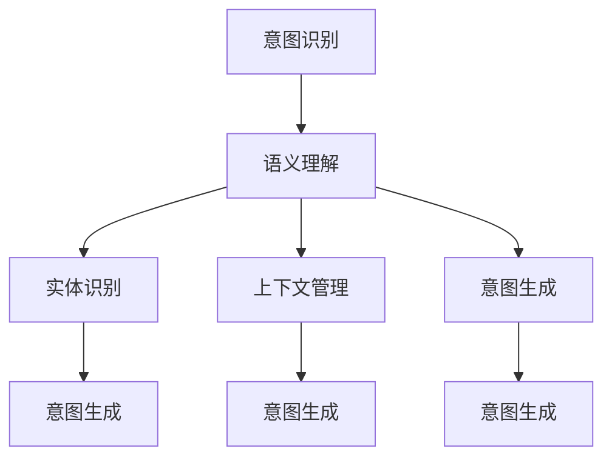

                 

# 用户需求表达在CUI中的详细实现方式

> 关键词：用户需求表达, 对话系统, 自然语言处理, 语义理解, 意图识别, 意图生成, 上下文管理, 多轮对话

## 1. 背景介绍

### 1.1 问题由来
在当今数字化时代，人们越来越依赖于与机器的交互来完成任务，这种交互通常通过对话形式进行，即计算机用户界面（Computer User Interface，CUI）。用户可以通过语音、文本等多种方式与计算机进行互动，但如何准确理解用户的意图并做出相应的回应，是CUI领域的一个重要挑战。

### 1.2 问题核心关键点
在CUI中，用户需求表达是指用户如何将自己的意图、要求或问题以自然语言的形式传达给计算机系统。准确地理解用户需求是CUI系统的核心问题，因为只有理解了用户需求，系统才能做出恰当的响应，提供有效的帮助。

### 1.3 问题研究意义
研究用户需求表达在CUI中的应用，对于提升用户交互体验、优化CUI系统性能、推动智能客服和虚拟助手等应用的发展具有重要意义。它不仅能提升系统的自然语言处理能力，还能提高用户的满意度和使用效率。

## 2. 核心概念与联系

### 2.1 核心概念概述

为了更好地理解用户需求表达在CUI中的应用，我们需要了解以下几个核心概念：

- **意图识别（Intent Recognition）**：识别用户从文本或语音中传达出来的意图或需求。
- **实体识别（Entity Recognition）**：从用户输入中提取出特定的信息实体，如人名、地名、日期等。
- **语义理解（Semantic Understanding）**：理解用户输入的含义，不仅包括字面意思，还包括上下文和隐含信息。
- **上下文管理（Context Management）**：在多轮对话中保持对话的连续性和一致性。
- **意图生成（Intent Generation）**：根据用户输入和对话历史，生成系统的意图或需求。

这些概念通过以下Mermaid流程图连接起来：



这个流程图展示了意图识别、语义理解、实体识别和上下文管理之间的关系，以及它们如何共同作用于意图生成。

## 3. 核心算法原理 & 具体操作步骤
### 3.1 算法原理概述

在CUI中，用户需求表达的实现通常依赖于自然语言处理（NLP）技术，尤其是意图识别和语义理解。常见的意图识别算法包括基于规则的方法、基于机器学习的方法和基于深度学习的方法。其中，基于深度学习的方法，特别是使用预训练的语言模型（如BERT、GPT），在理解用户需求方面表现尤为出色。

### 3.2 算法步骤详解

在CUI中，用户需求表达的实现通常包括以下步骤：

**Step 1: 数据准备**
- 收集和标注大量对话数据，用于训练意图识别和语义理解模型。
- 准备实体识别模型所需的实体标注数据集。

**Step 2: 模型选择和训练**
- 选择合适的意图识别和语义理解模型，如使用BERT、GPT等预训练模型，进行微调以适应特定任务。
- 使用标注数据集进行模型的训练和优化。

**Step 3: 意图识别**
- 在用户输入文本中识别意图，通常使用分类器对意图进行预测。
- 对于实体识别，可以通过命名实体识别（Named Entity Recognition，NER）模型进行。

**Step 4: 语义理解**
- 对用户输入文本进行语义理解，以理解其深层次含义。
- 使用语言模型预测文本的上下文和隐含信息。

**Step 5: 上下文管理**
- 在多轮对话中，维护对话历史，并利用上下文信息提高意图识别的准确性。
- 使用对话管理模型来管理对话流程，确保对话的连贯性和一致性。

**Step 6: 意图生成**
- 根据意图识别和语义理解的结果，生成系统的意图。
- 使用生成模型预测用户的下一步行动或回应。

### 3.3 算法优缺点

用户需求表达在CUI中的实现，具有以下优点：
1. **高准确性**：使用深度学习模型，能够准确识别用户意图和实体，提高系统响应准确率。
2. **灵活性**：可以适应不同的用户和情境，提供个性化的服务。
3. **可扩展性**：随着对话数据的积累，模型可以不断更新和改进，提高性能。

但同时，也存在以下缺点：
1. **依赖高质量数据**：需要大量标注数据，数据标注成本较高。
2. **资源消耗高**：深度学习模型通常需要较高的计算资源，训练和推理成本较高。
3. **上下文管理复杂**：多轮对话中的上下文管理较为复杂，需要更高级别的算法支持。
4. **模型的可解释性不足**：深度学习模型的内部决策过程难以解释，影响系统的透明性和可信度。

### 3.4 算法应用领域

用户需求表达在CUI中的应用非常广泛，包括但不限于以下领域：

- **智能客服**：提供自动化的客服解决方案，提升用户满意度。
- **虚拟助手**：如Apple的Siri、亚马逊的Alexa等，为用户提供全天候的自然语言交互体验。
- **智能家居**：与家居设备进行语音交互，控制家中的各种设施。
- **健康医疗**：帮助患者与医生进行自然语言交流，提供医疗咨询和建议。
- **金融服务**：提供自动化客户服务和咨询，提升金融服务的效率和质量。

## 4. 数学模型和公式 & 详细讲解  
### 4.1 数学模型构建

在CUI中，用户需求表达的实现通常依赖于多个NLP模型，包括意图识别、实体识别、语义理解和上下文管理。下面我们将分别介绍这些模型的数学模型构建。

**意图识别模型**：
- 使用分类模型，如逻辑回归、SVM或深度学习模型，如BERT、GPT等，对用户输入文本进行分类，识别出意图。
- 数学模型：
$$
\hat{y} = softmax(Wx + b)
$$
其中，$W$ 和 $b$ 为模型的权重和偏置，$x$ 为输入特征向量，$\hat{y}$ 为意图类别概率分布。

**实体识别模型**：
- 使用命名实体识别模型，如CRF、BiLSTM-CRF等，从用户输入文本中识别出特定实体。
- 数学模型：
$$
\hat{y} = CRF(V,W,E)
$$
其中，$V$ 为词汇表，$W$ 为转移矩阵，$E$ 为发射矩阵。

**语义理解模型**：
- 使用预训练的语言模型，如BERT、GPT等，对用户输入文本进行编码，并使用解码器生成上下文表示。
- 数学模型：
$$
h = G(x,W)
$$
$$
c = D(h)
$$
其中，$G$ 为编码器，$W$ 为编码器权重，$h$ 为编码器输出，$c$ 为上下文表示。

**上下文管理模型**：
- 使用序列到序列模型，如GRU、LSTM等，对对话历史进行编码，并生成上下文表示。
- 数学模型：
$$
h_t = R(h_{t-1}, c)
$$
其中，$R$ 为解码器，$h_t$ 为当前时间步的上下文表示，$h_{t-1}$ 为前一时间步的上下文表示，$c$ 为对话历史。

### 4.2 公式推导过程

以下我们以BERT为例，详细推导意图识别模型的公式推导过程。

**模型结构**：
- 输入文本 $x$ 经过BERT编码器得到隐藏表示 $h$。
- 使用全连接层对隐藏表示 $h$ 进行分类，得到意图类别 $y$。

**公式推导**：
- 输入文本 $x$ 通过BERT编码器，得到隐含表示 $h$：
$$
h = BERT(x,W)
$$
其中，$W$ 为BERT模型的权重。
- 使用全连接层对隐含表示 $h$ 进行分类，得到意图类别 $y$：
$$
y = softmax(W'h + b')
$$
其中，$W'$ 和 $b'$ 为全连接层的权重和偏置。

### 4.3 案例分析与讲解

以智能客服为例，分析用户需求表达在CUI中的应用。

**场景描述**：
- 用户希望查询航班信息，向智能客服系统输入：“请问明天的北京到上海的航班有哪些？”

**步骤分析**：
1. **意图识别**：系统首先使用意图识别模型对用户输入进行分类，识别出意图为“航班查询”。
2. **实体识别**：系统接着使用实体识别模型识别出地点实体“北京”和“上海”，以及时间实体“明天”。
3. **语义理解**：系统使用语义理解模型对用户输入进行深度理解，推断出用户想要查询的是“明天”的“北京到上海”的航班信息。
4. **上下文管理**：系统使用上下文管理模型维护对话历史，记录用户的查询意图和实体信息。
5. **意图生成**：系统根据意图识别和语义理解的结果，生成系统的意图为“提供航班信息”，并调用航班查询API获取结果。

## 5. 项目实践：代码实例和详细解释说明
### 5.1 开发环境搭建

要进行用户需求表达在CUI中的实现，需要搭建好开发环境。以下是使用Python进行PyTorch开发的环境配置流程：

1. 安装Anaconda：从官网下载并安装Anaconda，用于创建独立的Python环境。

2. 创建并激活虚拟环境：
```bash
conda create -n pytorch-env python=3.8 
conda activate pytorch-env
```

3. 安装PyTorch：根据CUDA版本，从官网获取对应的安装命令。例如：
```bash
conda install pytorch torchvision torchaudio cudatoolkit=11.1 -c pytorch -c conda-forge
```

4. 安装TensorFlow：
```bash
conda install tensorflow -c pytorch
```

5. 安装其他必要的库：
```bash
pip install numpy pandas scikit-learn torchtext datasets
```

完成上述步骤后，即可在`pytorch-env`环境中开始开发。

### 5.2 源代码详细实现

下面我们以BERT模型为例，展示用户需求表达在CUI中的实现代码。

```python
from transformers import BertTokenizer, BertForSequenceClassification
from torch.utils.data import DataLoader
from torchtext.data import Field, BucketIterator

# 数据预处理
tokenizer = BertTokenizer.from_pretrained('bert-base-uncased')
train_data, test_data = load_data()

# 定义数据字段
TEXT = Field(tokenize=tokenizer, lower=True)
LABEL = Field(sequential=False, use_vocab=False)

# 定义数据集和批处理器
train_data = [(train_text, label) for train_text, label in train_data]
test_data = [(test_text, label) for test_text, label in test_data]
TEXT.build_vocab(train_data, min_freq=2)
LABEL.build_vocab(train_data)
train_iterator, test_iterator = BucketIterator.splits(
    (train_data, test_data), batch_size=32, device='cuda')

# 加载预训练模型
model = BertForSequenceClassification.from_pretrained('bert-base-uncased', num_labels=2)

# 定义优化器和学习率调度器
optimizer = AdamW(model.parameters(), lr=5e-5)
scheduler = get_linear_schedule_with_warmup(optimizer, num_warmup_steps=0, num_training_steps=len(train_iterator))

# 训练模型
for epoch in range(epochs):
    for batch in train_iterator:
        optimizer.zero_grad()
        predictions = model(batch.text)
        loss = F.cross_entropy(predictions, batch.label)
        loss.backward()
        optimizer.step()
        scheduler.step()

# 测试模型
with torch.no_grad():
    test_predictions = []
    for batch in test_iterator:
        predictions = model(batch.text)
        test_predictions.extend(predictions)
    
    # 计算准确率和精确率
    accuracy = (test_predictions == test_labels).sum().item() / len(test_labels)
    precision = (test_predictions == 1).sum().item() / (test_predictions == 1).sum().item()

print(f'Accuracy: {accuracy:.2f}, Precision: {precision:.2f}')
```

### 5.3 代码解读与分析

让我们再详细解读一下关键代码的实现细节：

**数据预处理**：
- 使用BertTokenizer将输入文本转换为BERT所需的token ids，并进行分词和标准化处理。
- 定义数据字段，包括输入字段和标签字段，并进行分词和序列化处理。

**模型加载**：
- 使用BertForSequenceClassification加载预训练的BERT模型，设置输出层为2，用于二分类任务。

**优化器和学习率调度器**：
- 定义AdamW优化器和线性学习率调度器，控制模型的学习过程。

**训练和测试**：
- 在训练过程中，使用BucketIterator进行批处理，并在每个批次上进行前向传播和反向传播，更新模型参数。
- 在测试过程中，对模型进行前向传播，计算模型的准确率和精确率。

## 6. 实际应用场景
### 6.1 智能客服系统

智能客服系统可以为用户提供7x24小时不间断的服务，快速响应用户咨询，并提供个性化的回答。在智能客服系统中，用户需求表达可以通过语音输入、文本输入等多种方式进行。系统首先对用户输入进行意图识别和实体识别，然后根据识别结果，生成系统的意图，并调用相应的服务API，获取相应的响应结果，最后对结果进行意图生成，生成对用户的回应。

### 6.2 金融服务

在金融服务领域，用户需求表达可以用于自动化客户服务和咨询。系统可以自动识别用户输入中的金融术语和实体，理解用户的金融需求，并根据需求提供个性化的金融建议和服务。例如，用户可以通过语音或文本输入咨询贷款、理财等问题，系统根据用户输入生成相应的金融需求，并调用金融API获取相关信息，最后生成对用户的回应。

### 6.3 健康医疗

在健康医疗领域，用户需求表达可以用于提供医疗咨询和建议。用户可以输入病情描述、症状等，系统通过自然语言处理技术，理解用户的医疗需求，并调用医疗API获取相关的医疗建议和服务。例如，用户可以咨询医生关于感冒的预防和治疗方案，系统根据用户输入生成相应的医疗需求，并调用医疗API获取相关信息，最后生成对用户的回应。

## 7. 工具和资源推荐
### 7.1 学习资源推荐

为了帮助开发者系统掌握用户需求表达在CUI中的应用，这里推荐一些优质的学习资源：

1. 《自然语言处理综述》系列博文：深入介绍自然语言处理的基础知识和最新进展，涵盖意图识别、语义理解等多个方面。

2. CS224N《深度学习自然语言处理》课程：斯坦福大学开设的NLP明星课程，提供详细的课程视频和配套作业，带你深入理解自然语言处理的核心算法。

3. 《Python深度学习》书籍：讲解深度学习在自然语言处理中的应用，涵盖意图识别、语义理解等多个方面。

4. HuggingFace官方文档：提供大量预训练模型和完整的代码示例，是进行自然语言处理任务开发的利器。

5. CLUE开源项目：提供中文语言理解测评基准，涵盖大量不同类型的中文NLP数据集，并提供了基于微调的baseline模型，助力中文NLP技术发展。

通过对这些资源的学习实践，相信你一定能够快速掌握用户需求表达在CUI中的实现方法，并用于解决实际的NLP问题。

### 7.2 开发工具推荐

高效的开发离不开优秀的工具支持。以下是几款用于CUI用户需求表达开发的常用工具：

1. PyTorch：基于Python的开源深度学习框架，灵活动态的计算图，适合快速迭代研究。大部分预训练语言模型都有PyTorch版本的实现。

2. TensorFlow：由Google主导开发的开源深度学习框架，生产部署方便，适合大规模工程应用。同样有丰富的预训练语言模型资源。

3. Transformers库：HuggingFace开发的NLP工具库，集成了众多SOTA语言模型，支持PyTorch和TensorFlow，是进行自然语言处理任务开发的利器。

4. Weights & Biases：模型训练的实验跟踪工具，可以记录和可视化模型训练过程中的各项指标，方便对比和调优。与主流深度学习框架无缝集成。

5. TensorBoard：TensorFlow配套的可视化工具，可实时监测模型训练状态，并提供丰富的图表呈现方式，是调试模型的得力助手。

6. Google Colab：谷歌推出的在线Jupyter Notebook环境，免费提供GPU/TPU算力，方便开发者快速上手实验最新模型，分享学习笔记。

合理利用这些工具，可以显著提升自然语言处理任务的开发效率，加快创新迭代的步伐。

### 7.3 相关论文推荐

用户需求表达在CUI中的应用研究源于学界的持续研究。以下是几篇奠基性的相关论文，推荐阅读：

1. Attention is All You Need（即Transformer原论文）：提出了Transformer结构，开启了自然语言处理的预训练大模型时代。

2. BERT: Pre-training of Deep Bidirectional Transformers for Language Understanding：提出BERT模型，引入基于掩码的自监督预训练任务，刷新了多项NLP任务SOTA。

3. Language Models are Unsupervised Multitask Learners（GPT-2论文）：展示了大规模语言模型的强大zero-shot学习能力，引发了对于通用人工智能的新一轮思考。

4. Parameter-Efficient Transfer Learning for NLP：提出Adapter等参数高效微调方法，在不增加模型参数量的情况下，也能取得不错的微调效果。

5. Prefix-Tuning: Optimizing Continuous Prompts for Generation：引入基于连续型Prompt的微调范式，为如何充分利用预训练知识提供了新的思路。

6. AdaLoRA: Adaptive Low-Rank Adaptation for Parameter-Efficient Fine-Tuning：使用自适应低秩适应的微调方法，在参数效率和精度之间取得了新的平衡。

这些论文代表了大语言模型微调技术的发展脉络。通过学习这些前沿成果，可以帮助研究者把握学科前进方向，激发更多的创新灵感。

## 8. 总结：未来发展趋势与挑战
### 8.1 总结

本文对用户需求表达在CUI中的应用进行了全面系统的介绍。首先阐述了用户需求表达在CUI中的实现背景和意义，明确了意图识别、语义理解、实体识别和上下文管理等核心概念的联系。其次，从原理到实践，详细讲解了意图识别、实体识别、语义理解和上下文管理的数学模型和实现步骤，给出了CUI用户需求表达的完整代码实例。同时，本文还广泛探讨了用户需求表达在智能客服、金融服务、健康医疗等多个行业领域的应用前景，展示了其在CUI中的巨大潜力。最后，本文精选了用户需求表达在CUI中的学习资源、开发工具和相关论文，力求为读者提供全方位的技术指引。

通过本文的系统梳理，可以看到，用户需求表达在CUI中的应用不仅能够提升用户交互体验，还能优化系统性能，推动智能客服和虚拟助手等应用的发展。未来，伴随深度学习模型和大规模预训练技术的持续演进，用户需求表达在CUI中的应用将会更加广泛，为人们的生活带来更多便利和智能化的体验。

### 8.2 未来发展趋势

展望未来，用户需求表达在CUI中的应用将呈现以下几个发展趋势：

1. **多模态用户交互**：结合语音、文本、图像、视频等多种模态，提供更加自然和丰富的用户交互体验。
2. **深度强化学习**：引入强化学习机制，优化对话策略，提升系统的响应速度和用户满意度。
3. **语义增强**：利用语义增强技术，提高系统的理解能力和推理能力，提升系统对复杂自然语言的理解和处理能力。
4. **跨语言支持**：支持多语言的自然语言处理，实现全球化的用户交互。
5. **个性化服务**：根据用户的历史行为和偏好，提供个性化的服务和推荐。
6. **隐私保护**：保护用户隐私，确保用户数据的安全和隐私。

以上趋势凸显了用户需求表达在CUI中的广阔前景。这些方向的探索发展，必将进一步提升用户交互体验，推动自然语言处理技术的发展。

### 8.3 面临的挑战

尽管用户需求表达在CUI中的应用已经取得了显著进展，但在迈向更加智能化、普适化应用的过程中，它仍面临着诸多挑战：

1. **数据质量瓶颈**：高质量标注数据的需求量较大，数据标注成本较高，且标注数据可能存在噪音和偏差。
2. **计算资源消耗**：深度学习模型的训练和推理需要较高的计算资源，资源消耗较大。
3. **上下文管理复杂性**：多轮对话中的上下文管理较为复杂，需要更高级别的算法支持。
4. **模型的可解释性不足**：深度学习模型的内部决策过程难以解释，影响系统的透明性和可信度。
5. **隐私和安全问题**：用户隐私保护和数据安全问题，特别是在多轮对话中的隐私保护，是一个重要的挑战。

### 8.4 研究展望

面对用户需求表达在CUI中面临的挑战，未来的研究需要在以下几个方面寻求新的突破：

1. **无监督和半监督学习**：探索无监督和半监督学习范式，降低对标注数据的需求，提高系统的灵活性和普适性。
2. **多模态用户交互**：结合语音、文本、图像、视频等多种模态，提升系统的自然语言处理能力。
3. **隐私保护技术**：开发隐私保护技术，保护用户隐私，确保数据安全。
4. **模型可解释性**：开发可解释性强的模型，提高系统的透明性和可信度。
5. **个性化服务**：根据用户的历史行为和偏好，提供个性化的服务和推荐。

这些研究方向的探索，必将引领用户需求表达在CUI中的进一步发展，为构建智能、高效、安全的自然语言交互系统铺平道路。

## 9. 附录：常见问题与解答
### Q1: 用户需求表达在CUI中的实现需要哪些步骤？
A: 用户需求表达在CUI中的实现需要以下步骤：
1. 数据准备：收集和标注大量对话数据，用于训练意图识别和语义理解模型。
2. 模型选择和训练：选择合适的意图识别和语义理解模型，使用标注数据集进行模型的训练和优化。
3. 意图识别：使用分类模型对用户输入进行分类，识别出意图。
4. 实体识别：使用命名实体识别模型从用户输入文本中识别出特定实体。
5. 语义理解：使用预训练的语言模型对用户输入进行编码，并使用解码器生成上下文表示。
6. 上下文管理：使用序列到序列模型对对话历史进行编码，并生成上下文表示。
7. 意图生成：根据意图识别和语义理解的结果，生成系统的意图，并调用相应的服务API获取结果。

### Q2: 用户需求表达在CUI中的实现需要哪些工具和资源？
A: 用户需求表达在CUI中的实现需要以下工具和资源：
1. Python：使用Python进行深度学习模型的开发和训练。
2. PyTorch：基于Python的开源深度学习框架，适合快速迭代研究。
3. TensorFlow：由Google主导开发的开源深度学习框架，适合大规模工程应用。
4. Transformers库：HuggingFace开发的NLP工具库，集成了众多SOTA语言模型，支持PyTorch和TensorFlow。
5. Weights & Biases：模型训练的实验跟踪工具，可以记录和可视化模型训练过程中的各项指标，方便对比和调优。
6. TensorBoard：TensorFlow配套的可视化工具，可实时监测模型训练状态，并提供丰富的图表呈现方式。
7. Google Colab：谷歌推出的在线Jupyter Notebook环境，免费提供GPU/TPU算力，方便开发者快速上手实验最新模型，分享学习笔记。

### Q3: 用户需求表达在CUI中的实现面临哪些挑战？
A: 用户需求表达在CUI中的实现面临以下挑战：
1. 数据质量瓶颈：高质量标注数据的需求量较大，数据标注成本较高，且标注数据可能存在噪音和偏差。
2. 计算资源消耗：深度学习模型的训练和推理需要较高的计算资源，资源消耗较大。
3. 上下文管理复杂性：多轮对话中的上下文管理较为复杂，需要更高级别的算法支持。
4. 模型的可解释性不足：深度学习模型的内部决策过程难以解释，影响系统的透明性和可信度。
5. 隐私和安全问题：用户隐私保护和数据安全问题，特别是在多轮对话中的隐私保护，是一个重要的挑战。

### Q4: 用户需求表达在CUI中的应用场景有哪些？
A: 用户需求表达在CUI中的应用场景包括但不限于以下领域：
1. 智能客服：提供自动化的客服解决方案，提升用户满意度。
2. 金融服务：自动识别用户输入中的金融术语和实体，理解用户的金融需求，并根据需求提供个性化的金融建议和服务。
3. 健康医疗：理解用户的医疗需求，并调用医疗API获取相关的医疗建议和服务。
4. 教育培训：自动回答学生的学习问题，提供个性化的学习建议和资源。
5. 智能家居：与家居设备进行语音交互，控制家中的各种设施。

### Q5: 用户需求表达在CUI中的应用前景如何？
A: 用户需求表达在CUI中的应用前景非常广阔，未来将会更加广泛地应用于各个领域：
1. 智能客服：提供全天候的自然语言交互服务，提升用户满意度和效率。
2. 金融服务：实现自动化客户服务和咨询，提升金融服务的效率和质量。
3. 健康医疗：提供医疗咨询和建议，提升医疗服务的质量和效率。
4. 教育培训：自动回答学生的学习问题，提供个性化的学习建议和资源。
5. 智能家居：与家居设备进行语音交互，提升家居生活的智能化水平。
6. 多模态用户交互：结合语音、文本、图像、视频等多种模态，提供更加自然和丰富的用户交互体验。

---

作者：禅与计算机程序设计艺术 / Zen and the Art of Computer Programming

