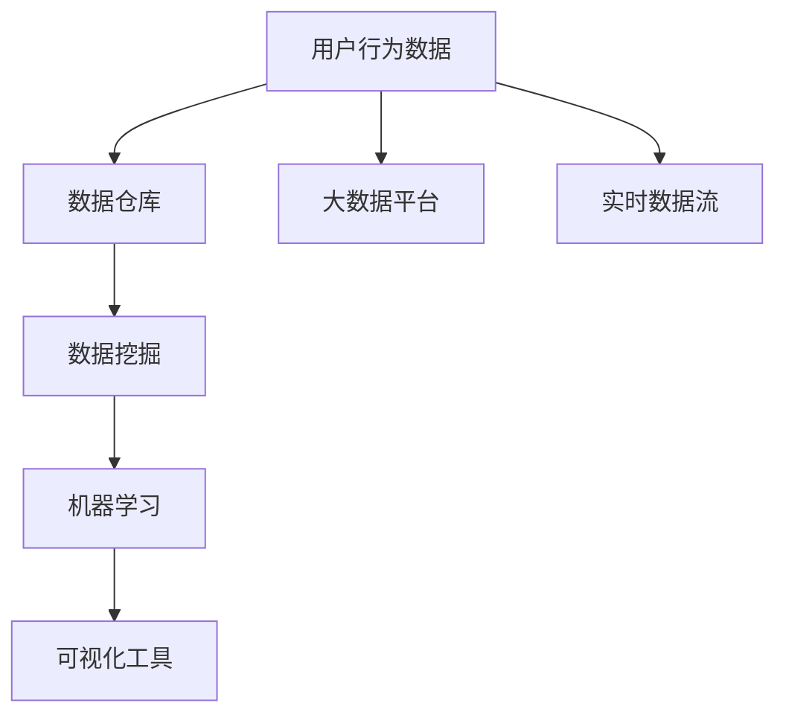

                 

# 电商平台中用户行为数据分析功能的设计与实现

## 1. 背景介绍

随着互联网的快速发展，电商平台成为越来越多消费者进行购物的主要渠道。如何通过用户行为数据分析，深入了解用户需求，优化用户体验，提升销售转化率，成为各大电商平台亟待解决的问题。本文将详细介绍电商平台中用户行为数据分析功能的实现过程，包括需求分析、系统架构设计、数据处理与分析、算法设计与优化等关键环节。

## 2. 核心概念与联系

### 2.1 核心概念概述

在电商平台中，用户行为数据分析主要涉及以下概念：

- **用户行为数据**：用户在平台上的各种操作记录，包括浏览、点击、购买、评价等。
- **数据仓库**：存储大量结构化和半结构化数据的中央数据存储系统。
- **数据挖掘**：从大量数据中自动发现知识、模式和规律的过程。
- **机器学习**：利用算法构建模型，对数据进行分析和预测。
- **大数据平台**：处理、存储和分析大规模数据的平台，如Hadoop、Spark等。
- **可视化工具**：将分析结果以图形化方式展示，帮助用户直观理解数据。

这些概念之间存在紧密的联系，共同构成了电商平台用户行为数据分析的核心技术体系。

### 2.2 核心概念原理和架构的 Mermaid 流程图



这个流程图展示了用户行为数据分析的基本流程：从用户行为数据出发，通过数据仓库存储和管理数据，然后应用数据挖掘和机器学习技术进行分析和预测，最后通过可视化工具将结果直观展示给用户和决策者。

## 3. 核心算法原理 & 具体操作步骤

### 3.1 算法原理概述

电商平台中的用户行为数据分析主要分为以下几步：

1. **数据收集与预处理**：从电商平台获取用户行为数据，进行清洗、归一化等预处理操作。
2. **特征提取与选择**：从原始数据中提取有用的特征，并选择合适的特征集合进行建模。
3. **模型构建与训练**：选择适当的机器学习算法，利用训练数据集训练模型。
4. **模型评估与优化**：通过测试数据集评估模型性能，进行模型优化。
5. **结果可视化**：将模型结果以图表等形式展示，供决策者参考。

### 3.2 算法步骤详解

**Step 1: 数据收集与预处理**

1. **数据源选择**：确定电商平台上哪些数据源可以用于用户行为分析，如点击流、购买记录、评价反馈等。
2. **数据清洗**：去除重复、缺失、异常等无用或错误数据，确保数据质量。
3. **数据归一化**：对不同来源的数据进行归一化处理，统一数据格式和单位。

**Step 2: 特征提取与选择**

1. **特征提取**：从原始数据中提取有用的特征，如用户的浏览时长、浏览路径、购买频率等。
2. **特征选择**：利用特征选择算法（如卡方检验、信息增益等）筛选最相关的特征。

**Step 3: 模型构建与训练**

1. **模型选择**：选择合适的机器学习算法，如随机森林、K近邻、神经网络等。
2. **模型训练**：利用训练数据集训练模型，调整模型参数。

**Step 4: 模型评估与优化**

1. **模型评估**：使用测试数据集评估模型性能，计算准确率、召回率、F1分数等指标。
2. **模型优化**：根据评估结果，调整模型参数，优化模型性能。

**Step 5: 结果可视化**

1. **图表展示**：使用可视化工具（如Tableau、PowerBI等）将分析结果以图表形式展示。
2. **报告生成**：根据分析结果生成报告，提供给决策者参考。

### 3.3 算法优缺点

**优点**：
1. **数据驱动决策**：通过数据分析发现用户行为规律，指导业务决策。
2. **提高销售转化率**：通过个性化推荐和行为预测，提升用户体验，增加销售额。
3. **减少人力成本**：自动化数据分析流程，降低人工干预。

**缺点**：
1. **数据隐私问题**：用户行为数据涉及个人隐私，需注意数据保护。
2. **模型复杂度高**：大数据量和高维度特征集合可能导致模型复杂度高。
3. **结果解释性差**：机器学习模型通常为"黑盒"，难以解释分析结果。

### 3.4 算法应用领域

用户行为数据分析在电商平台中的应用非常广泛，涵盖以下几方面：

1. **用户画像构建**：通过数据分析构建用户画像，了解用户兴趣、行为偏好等。
2. **个性化推荐**：根据用户行为数据，提供个性化推荐商品，提升用户体验。
3. **流失预警**：利用用户行为数据分析，预测用户流失风险，采取挽留措施。
4. **库存管理**：通过分析历史购买数据，优化库存管理，减少库存积压和缺货情况。
5. **营销策略优化**：通过用户行为数据，优化营销策略，提高营销效果。

## 4. 数学模型和公式 & 详细讲解

### 4.1 数学模型构建

用户行为数据分析的主要数学模型包括回归模型、分类模型和聚类模型等。这里以回归模型为例，介绍其构建过程。

假设用户行为数据为 $X=[x_1, x_2, ..., x_n]$，目标变量为 $y$。回归模型的目标是最小化预测值与实际值之间的误差，常用的回归模型有线性回归、多项式回归、支持向量回归等。

**线性回归**：
$$
y = \beta_0 + \beta_1x_1 + \beta_2x_2 + ... + \beta_nx_n
$$

其中，$\beta_0, \beta_1, ..., \beta_n$ 为模型参数。

### 4.2 公式推导过程

**线性回归**：
1. **模型训练**：利用训练数据集 $(x_1, y_1), (x_2, y_2), ..., (x_m, y_m)$ 最小化损失函数：
$$
\min_{\beta_0, \beta_1, ..., \beta_n} \sum_{i=1}^m (y_i - (\beta_0 + \beta_1x_{i1} + \beta_2x_{i2} + ... + \beta_nx_{in}))^2
$$
2. **求解参数**：通过最小二乘法求解模型参数：
$$
\beta_j = \frac{\sum_{i=1}^m x_{ij}y_i}{\sum_{i=1}^m x_{ij}^2} / \frac{\sum_{i=1}^m x_{ij}^2}{m}
$$

### 4.3 案例分析与讲解

以电商平台中的个性化推荐系统为例，利用用户行为数据构建推荐模型。具体步骤如下：

1. **数据收集**：从电商平台收集用户的历史浏览记录、购买记录、评价反馈等。
2. **特征提取**：从浏览记录中提取用户兴趣特征，如浏览时长、浏览路径、访问次数等。
3. **模型训练**：利用用户兴趣特征和购买记录，构建推荐模型，如协同过滤、内容推荐等。
4. **模型评估**：通过测试数据集评估模型性能，计算准确率、召回率、F1分数等指标。
5. **结果可视化**：使用可视化工具展示推荐结果，供用户参考。

## 5. 项目实践：代码实例和详细解释说明

### 5.1 开发环境搭建

以下是在Python环境下搭建数据分析项目开发环境的步骤：

1. **安装Python**：
   - 下载Python安装包，进行安装。
   - 设置Python环境变量，使系统能够找到Python解释器。

2. **安装依赖库**：
   - 使用pip命令安装常用的数据分析库，如NumPy、Pandas、Matplotlib等。
   - 安装机器学习库，如scikit-learn、TensorFlow、PyTorch等。

3. **配置环境变量**：
   - 设置Jupyter Notebook环境，支持Python开发和可视化。
   - 配置Docker环境，支持容器化开发和部署。

### 5.2 源代码详细实现

以下是一个简单的用户行为数据分析项目的代码实现：

**数据预处理**：
```python
import pandas as pd

# 读取数据集
data = pd.read_csv('user_behavior.csv')

# 数据清洗
data.dropna(inplace=True)
data.drop_duplicates(inplace=True)

# 特征提取
data['interest'] = data['浏览时长'] + data['浏览路径'] + data['访问次数']
data['购买频率'] = data['购买次数'] / data['浏览记录数']

# 特征选择
features = ['兴趣特征', '购买频率']

# 数据分割
train_data = data.sample(frac=0.8, random_state=42)
test_data = data.drop(train_data.index)
```

**模型训练**：
```python
from sklearn.linear_model import LinearRegression

# 模型构建
model = LinearRegression()

# 训练模型
model.fit(train_data[features], train_data['购买记录'])
```

**模型评估**：
```python
from sklearn.metrics import mean_squared_error

# 模型评估
predictions = model.predict(test_data[features])
mse = mean_squared_error(test_data['购买记录'], predictions)
print(f'MSE: {mse}')
```

### 5.3 代码解读与分析

**数据预处理**：
1. **数据读取**：使用Pandas库读取用户行为数据集。
2. **数据清洗**：去除缺失和重复记录，确保数据质量。
3. **特征提取**：从原始数据中提取用户兴趣特征和购买频率等特征。
4. **特征选择**：选择最相关的特征进行建模。
5. **数据分割**：将数据集划分为训练集和测试集。

**模型训练**：
1. **模型选择**：选择线性回归模型。
2. **模型构建**：使用训练数据集构建模型。
3. **模型训练**：利用训练数据集对模型进行拟合，调整模型参数。

**模型评估**：
1. **模型预测**：使用测试数据集进行模型预测。
2. **评估指标**：计算模型预测结果与实际值之间的均方误差（MSE）。
3. **结果展示**：输出模型评估指标。

### 5.4 运行结果展示

在模型训练和评估后，可以通过可视化工具将结果展示出来。例如，使用Matplotlib库绘制预测值与实际值之间的散点图：

```python
import matplotlib.pyplot as plt

# 绘制散点图
plt.scatter(test_data['购买记录'], predictions)
plt.xlabel('实际购买记录')
plt.ylabel('预测购买记录')
plt.show()
```

## 6. 实际应用场景

用户行为数据分析在电商平台中的应用非常广泛，以下是几个典型的应用场景：

**个性化推荐**：
- 通过用户历史行为数据，构建用户画像，提供个性化推荐商品。
- 利用协同过滤、内容推荐等算法，提升推荐效果。

**流失预警**：
- 通过分析用户行为数据，预测用户流失风险。
- 及时采取挽留措施，减少用户流失。

**库存管理**：
- 利用历史购买数据，优化库存管理，减少库存积压和缺货情况。
- 根据用户行为预测未来需求，进行库存补充。

**营销策略优化**：
- 分析用户行为数据，优化广告投放策略。
- 通过数据分析，发现营销活动的成功因素，优化营销策略。

## 7. 工具和资源推荐

### 7.1 学习资源推荐

1. **在线课程**：Coursera、Udacity等平台提供的数据分析和机器学习课程，适合初学者和进阶者学习。
2. **书籍**：《Python数据分析》、《机器学习实战》、《深度学习》等书籍，详细介绍数据分析和机器学习技术。
3. **博客与论坛**：Kaggle、Medium、GitHub等平台上的数据分析博客和开源项目，提供丰富的学习资源。

### 7.2 开发工具推荐

1. **Jupyter Notebook**：支持Python编程和数据可视化，适合数据分析和机器学习项目开发。
2. **Python IDE**：如PyCharm、VS Code等，提供高效的开发环境和调试工具。
3. **大数据平台**：如Hadoop、Spark等，处理大规模数据集，适合高并发、大数据量场景。

### 7.3 相关论文推荐

1. **《电商平台用户行为数据分析》**：介绍电商平台用户行为数据分析的基本方法，适合入门学习。
2. **《个性化推荐系统》**：详细介绍个性化推荐系统的设计和实现，适合深入学习。
3. **《用户行为数据挖掘》**：探讨用户行为数据挖掘和分析的技术，适合高级学习。

## 8. 总结：未来发展趋势与挑战

### 8.1 研究成果总结

本文介绍了电商平台中用户行为数据分析功能的实现过程，涵盖需求分析、系统架构设计、数据处理与分析、算法设计与优化等关键环节。通过详细讲解各个步骤，展示了数据驱动决策、个性化推荐、流失预警等典型应用场景。

### 8.2 未来发展趋势

未来，电商平台用户行为数据分析将呈现以下几个发展趋势：

1. **数据驱动决策**：随着数据采集和存储技术的不断发展，用户行为数据将更加丰富和多样。数据驱动决策将成为电商平台的重要发展方向。
2. **实时数据处理**：实时数据处理技术将使电商平台能够及时响应用户行为变化，提高用户满意度。
3. **自动化分析**：自动化数据分析和报告生成技术将进一步降低人工干预，提高分析效率。
4. **个性化推荐优化**：通过机器学习和深度学习技术，提升个性化推荐系统的精准度和用户体验。
5. **多渠道融合**：电商平台将更多地融合社交媒体、移动应用等多渠道用户行为数据，进行综合分析。

### 8.3 面临的挑战

尽管电商平台用户行为数据分析技术取得了一定的进展，但仍面临以下挑战：

1. **数据隐私问题**：用户行为数据涉及个人隐私，需注意数据保护。
2. **数据质量问题**：用户行为数据可能存在噪音和不完整，影响数据分析结果。
3. **模型复杂度高**：高维度特征集合和复杂模型可能导致计算资源消耗大。
4. **结果解释性差**：机器学习模型通常为"黑盒"，难以解释分析结果。

### 8.4 研究展望

未来，电商平台用户行为数据分析的研究方向可能包括：

1. **隐私保护技术**：研究如何保护用户隐私，确保数据安全。
2. **数据质量提升**：研究数据清洗和处理技术，提高数据质量。
3. **高效模型优化**：研究高效模型优化算法，降低计算资源消耗。
4. **结果可视化**：研究更直观、易理解的结果可视化方法，提升决策效果。

## 9. 附录：常见问题与解答

**Q1: 电商平台中用户行为数据分析的目的是什么？**

A: 电商平台中用户行为数据分析的目的是通过用户行为数据，深入了解用户需求，优化用户体验，提升销售转化率。具体应用包括个性化推荐、流失预警、库存管理、营销策略优化等。

**Q2: 用户行为数据分析需要哪些技术支持？**

A: 用户行为数据分析需要以下技术支持：
1. 数据采集与存储：从电商平台收集用户行为数据，进行存储和管理。
2. 数据清洗与预处理：去除重复、缺失、异常等无用或错误数据，确保数据质量。
3. 特征提取与选择：从原始数据中提取有用的特征，并选择合适的特征集合进行建模。
4. 机器学习与深度学习：利用算法构建模型，对数据进行分析和预测。
5. 数据可视化：将分析结果以图表等形式展示，供决策者参考。

**Q3: 如何提高用户行为数据分析的准确性？**

A: 提高用户行为数据分析的准确性，可以从以下几个方面入手：
1. 数据采集全面：尽可能多地收集用户行为数据，涵盖不同渠道和场景。
2. 数据清洗彻底：对数据进行严格的清洗和预处理，去除噪音和异常。
3. 特征提取准确：选择合适的特征集合，避免冗余和缺失。
4. 模型选择合适：根据数据特点和分析目标，选择最合适的机器学习算法。
5. 结果评估充分：通过多维度评估指标，全面评估模型性能，及时发现问题并进行优化。

**Q4: 用户行为数据分析的实际应用有哪些？**

A: 用户行为数据分析在电商平台中的应用包括：
1. 个性化推荐：通过分析用户行为数据，提供个性化推荐商品。
2. 流失预警：预测用户流失风险，及时采取挽留措施。
3. 库存管理：优化库存管理，减少库存积压和缺货情况。
4. 营销策略优化：分析用户行为数据，优化营销策略，提高营销效果。

**Q5: 用户行为数据分析的挑战是什么？**

A: 用户行为数据分析面临以下挑战：
1. 数据隐私问题：用户行为数据涉及个人隐私，需注意数据保护。
2. 数据质量问题：用户行为数据可能存在噪音和不完整，影响数据分析结果。
3. 模型复杂度高：高维度特征集合和复杂模型可能导致计算资源消耗大。
4. 结果解释性差：机器学习模型通常为"黑盒"，难以解释分析结果。

**Q6: 用户行为数据分析的未来趋势是什么？**

A: 用户行为数据分析的未来趋势包括：
1. 数据驱动决策：随着数据采集和存储技术的不断发展，用户行为数据将更加丰富和多样。
2. 实时数据处理：实时数据处理技术将使电商平台能够及时响应用户行为变化，提高用户满意度。
3. 自动化分析：自动化数据分析和报告生成技术将进一步降低人工干预，提高分析效率。
4. 个性化推荐优化：通过机器学习和深度学习技术，提升个性化推荐系统的精准度和用户体验。
5. 多渠道融合：电商平台将更多地融合社交媒体、移动应用等多渠道用户行为数据，进行综合分析。

---

作者：禅与计算机程序设计艺术 / Zen and the Art of Computer Programming

