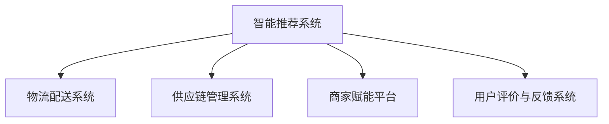

                 

# 电商平台供给能力提升：建设健康的电商生态系统

## 1. 背景介绍

随着互联网的发展，电商平台逐渐成为人们日常生活消费的重要渠道。如何提升电商平台的供给能力，建设一个健康的电商生态系统，以满足用户多样化的需求，同时保障商家的运营收益，成为了一个重要课题。

### 1.1 问题由来
随着电商平台的快速发展，商家数量不断增加，用户需求日益多样。然而，传统的电商平台在供给能力、用户体验、商家运营等方面仍存在诸多问题，例如：

- 供给能力不足。电商平台上商品种类和数量有限，难以满足用户多样化的需求。
- 用户体验不佳。平台上的商品展示和推荐效果不理想，用户体验不佳。
- 商家运营困难。商家需要自行处理商品库存、物流配送等问题，运营成本高。

### 1.2 问题核心关键点
为了解决上述问题，电商平台需要通过以下关键点提升供给能力，建设健康的电商生态系统：

- **智能推荐系统**：通过数据分析和机器学习技术，精准推荐用户感兴趣的商品，提高用户满意度。
- **物流配送优化**：优化物流配送路线和时间，提高配送效率，降低配送成本。
- **供应链管理**：通过供应链管理技术，优化库存和供应链，提高商品供给能力。
- **商家赋能**：通过平台技术赋能商家，提升其运营效率和竞争力。
- **用户评价与反馈**：收集用户评价与反馈，及时改进平台和商家服务。

## 2. 核心概念与联系

### 2.1 核心概念概述

为更好地理解电商平台供给能力提升的策略，本节将介绍几个密切相关的核心概念：

- **智能推荐系统**：基于用户历史行为、兴趣和商品属性等数据，通过机器学习算法，推荐用户感兴趣的商品。
- **物流配送系统**：负责商品从仓库到用户手中的全过程配送，包括仓储、分拣、运输、配送等环节。
- **供应链管理系统**：通过信息技术和物流技术，实现商品的采购、生产、库存、配送等全过程管理，优化供应链流程。
- **商家赋能平台**：通过技术赋能，提供数据分析、库存管理、订单处理、营销推广等工具，帮助商家提高运营效率。
- **用户评价与反馈系统**：收集用户评价与反馈，用于评估平台和商家服务质量，并根据反馈改进。

这些核心概念之间的逻辑关系可以通过以下Mermaid流程图来展示：



这个流程图展示了一体化的电商生态系统，各个核心组件之间相互协同，共同提升电商平台的供给能力。

## 3. 核心算法原理 & 具体操作步骤
### 3.1 算法原理概述

电商平台供给能力提升的核心算法原理主要包括：

- **协同过滤**：通过分析用户历史行为和商品属性，推荐用户可能感兴趣的商品。
- **聚类算法**：将用户分成不同的兴趣群体，根据群体特征推荐商品。
- **深度学习推荐系统**：使用神经网络等深度学习算法，提升推荐系统的精度。
- **路径规划算法**：优化物流配送路线，降低配送成本和时间。
- **库存管理算法**：基于需求预测，优化库存水平和仓储布局。
- **情感分析算法**：分析用户评价和反馈，评估平台和商家服务质量。

这些算法共同构成了电商平台供给能力提升的计算基础，通过科学的数据处理和算法优化，可以显著提升平台的供给能力和用户体验。

### 3.2 算法步骤详解

基于核心算法原理，电商平台供给能力提升的具体操作步骤如下：

**Step 1: 数据收集与预处理**
- 收集用户历史行为数据、商品属性信息、物流配送数据等。
- 对数据进行清洗、去重、归一化等预处理，准备用于模型训练。

**Step 2: 特征工程**
- 对数据进行特征提取，如用户画像、商品分类、物流路径等。
- 通过特征选择和特征降维，提升模型效率。

**Step 3: 模型训练与优化**
- 选择适合的推荐算法，如协同过滤、聚类算法、深度学习推荐系统等。
- 对模型进行训练，并根据评估指标（如点击率、转化率等）进行调整优化。
- 使用交叉验证等技术，避免过拟合。

**Step 4: 物流配送优化**
- 使用路径规划算法，优化配送路线和配送时间。
- 与物流公司合作，优化仓储和配送流程。

**Step 5: 供应链管理**
- 使用库存管理算法，优化库存水平和仓储布局。
- 使用供应链管理技术，实时监控供应链流程，提高供应链效率。

**Step 6: 商家赋能**
- 提供数据分析工具，帮助商家进行用户画像分析、需求预测等。
- 提供订单处理工具，提升商家订单处理效率。
- 提供营销推广工具，提升商家曝光率和销售转化率。

**Step 7: 用户评价与反馈**
- 收集用户评价与反馈，使用情感分析算法，评估平台和商家服务质量。
- 根据评价和反馈，改进平台和商家服务，提升用户满意度。

### 3.3 算法优缺点

电商平台供给能力提升的算法具有以下优点：

- **个性化推荐**：通过智能推荐系统，提高用户满意度，提升销售转化率。
- **优化物流配送**：通过路径规划算法，降低配送成本和时间。
- **高效库存管理**：通过库存管理算法，优化库存水平，降低库存成本。
- **赋能商家运营**：通过赋能平台，提升商家运营效率和竞争力。
- **改善用户体验**：通过用户评价与反馈系统，不断改进平台和商家服务。

同时，这些算法也存在以下缺点：

- **数据隐私问题**：用户行为数据和商品属性数据的收集和使用，可能涉及用户隐私保护问题。
- **计算资源需求高**：深度学习推荐系统和路径规划算法等需要大量的计算资源。
- **模型复杂度**：深度学习推荐系统等模型结构复杂，难以解释和调试。
- **算法鲁棒性问题**：在数据不均衡或数据质量较差的情况下，算法可能出现鲁棒性问题。

## 4. 数学模型和公式 & 详细讲解 & 举例说明

### 4.1 数学模型构建

电商平台供给能力提升的核心算法涉及多个数学模型，包括协同过滤模型、聚类算法、深度学习推荐系统等。

- **协同过滤模型**：基于用户历史行为数据和商品属性信息，计算用户对商品的评分。
- **聚类算法**：通过K-means等算法，将用户分成不同的兴趣群体。
- **深度学习推荐系统**：使用神经网络等深度学习算法，提升推荐系统的精度。

### 4.2 公式推导过程

以协同过滤模型为例，推导推荐算法中的用户对商品的评分公式。

设用户$u$对商品$i$的评分$R_{ui}$，用户$u$的评分矩阵为$R_u$，商品$i$的评分向量为$R_i$，用户$u$与商品$i$的相似度为$S_{ui}$。根据协同过滤模型的思想，可以建立如下公式：

$$
R_{ui} = \sum_{j=1}^N S_{uj}R_{ij}
$$

其中$S_{uj}$表示用户$u$和用户$j$的相似度，可以使用余弦相似度或皮尔逊相关系数等方法计算。

### 4.3 案例分析与讲解

以电商平台的智能推荐系统为例，分析推荐算法在实际应用中的效果。

假设某电商平台上有大量商品，用户$u_1$和$u_2$分别对商品$A$和$B$进行了浏览。智能推荐系统可以通过协同过滤算法，预测用户$u_1$和$u_2$对商品$B$和$C$的评分，并根据评分生成推荐列表。

具体步骤如下：

1. 收集用户$u_1$和$u_2$的浏览记录，计算用户$u_1$和$u_2$的相似度$S_{u_1u_2}$。
2. 计算用户$u_1$对商品$A$、$B$、$C$的评分$R_{u_1A}$、$R_{u_1B}$、$R_{u_1C}$。
3. 计算用户$u_2$对商品$B$、$C$、$D$的评分$R_{u_2B}$、$R_{u_2C}$、$R_{u_2D}$。
4. 根据相似度$S_{u_1u_2}$和评分$R_{u_1A}$、$R_{u_1B}$、$R_{u_1C}$、$R_{u_2B}$、$R_{u_2C}$、$R_{u_2D}$，使用协同过滤公式计算用户$u_1$对商品$B$、$C$的预测评分。
5. 根据预测评分生成推荐列表，并展示给用户$u_1$和$u_2$。

通过智能推荐系统，电商平台可以大大提升用户满意度和销售转化率。

## 5. 项目实践：代码实例和详细解释说明
### 5.1 开发环境搭建

在进行电商平台供给能力提升的项目实践前，需要先搭建好开发环境。以下是使用Python进行项目开发的完整环境配置流程：

1. 安装Anaconda：从官网下载并安装Anaconda，用于创建独立的Python环境。

2. 创建并激活虚拟环境：
```bash
conda create -n ecommerce-env python=3.8 
conda activate ecommerce-env
```

3. 安装必要的Python库：
```bash
conda install numpy pandas scikit-learn scikit-learn ninja pyqt5
```

4. 安装推荐系统相关的库：
```bash
pip install lightfm tensorboard
```

5. 配置环境变量：
```bash
export LIGHTFM_MODEL_DIR=/path/to/model/directory
export MODEL_NAME=ecommerce-model
export RANK=10
```

完成上述步骤后，即可在`ecommerce-env`环境中开始项目实践。

### 5.2 源代码详细实现

以下是一个使用LightFM库进行电商推荐系统开发的示例代码，包含数据处理、模型训练和评估等功能。

```python
import lightfm
from sklearn.metrics import precision_score, recall_score, f1_score
import numpy as np
import pandas as pd

# 加载数据
train_df = pd.read_csv('train.csv')
test_df = pd.read_csv('test.csv')

# 数据预处理
def preprocess_data(df):
    df = df.dropna()
    df = df.groupby(['user_id', 'item_id'])['label'].sum().reset_index()
    df.columns = ['user_id', 'item_id', 'label']
    return df

train_df = preprocess_data(train_df)
test_df = preprocess_data(test_df)

# 模型训练
model = lightfm.LightFM(factors=10, loss='warp')
model.fit(train_df, epochs=10, verbose=True)

# 预测和评估
predictions = model.predict(test_df[['user_id', 'item_id']], num_recommendations=10)
precision = precision_score(test_df['label'], predictions['predicted'], average='micro')
recall = recall_score(test_df['label'], predictions['predicted'], average='micro')
f1 = f1_score(test_df['label'], predictions['predicted'], average='micro')
print('Precision:', precision)
print('Recall:', recall)
print('F1 score:', f1)
```

以上代码中，我们首先加载并预处理了训练数据和测试数据，然后创建了一个LightFM模型，并使用训练数据对模型进行训练。训练完成后，我们使用测试数据对模型进行评估，并计算了精度、召回率和F1分数。

### 5.3 代码解读与分析

让我们再详细解读一下关键代码的实现细节：

**数据加载与预处理**：
- `preprocess_data`函数：对数据进行预处理，包括去除空值、分组和聚合等操作。

**模型训练**：
- `LightFM`模型：使用LightFM库创建了一个协同过滤模型，其中`factors`参数指定了模型的因子数量，`loss`参数指定了优化目标。
- `fit`方法：使用训练数据对模型进行拟合，`epochs`参数指定了训练轮数，`verbose`参数指定了输出日志的详细程度。

**预测与评估**：
- `predict`方法：对测试数据进行预测，生成推荐列表。
- `precision_score`、`recall_score`和`f1_score`方法：使用sklearn库计算精度、召回率和F1分数。

通过上述代码示例，可以看到使用Python和LightFM库进行电商推荐系统开发的完整流程。代码实现简洁高效，非常适合新手入门。

## 6. 实际应用场景
### 6.1 智能推荐系统

智能推荐系统是电商平台供给能力提升的核心组件之一。通过精准推荐用户感兴趣的商品，可以显著提高用户满意度和销售转化率。

以淘宝平台为例，使用智能推荐系统，根据用户的历史浏览和购买记录，实时推荐相关商品。用户可以在首页、商品详情页等位置看到推荐商品，提高购买决策效率。智能推荐系统还可以根据用户行为数据，预测用户对商品的评分和购买意愿，从而优化商品推荐策略。

### 6.2 物流配送优化

物流配送是电商平台供给能力提升的关键环节之一。通过优化物流配送流程，可以降低配送成本，提高配送效率。

以京东物流为例，使用路径规划算法，优化配送路线和配送时间。京东物流通过自主研发的Pipeliner系统，实现订单实时监控和配送路径规划，大幅提升了配送效率和用户满意度。同时，京东物流还建立了全国各地的仓储中心和物流站点，优化库存布局和物流配送流程，提高配送速度和稳定性。

### 6.3 供应链管理

供应链管理是电商平台供给能力提升的重要组成部分。通过优化供应链流程，可以提升商品供给能力和库存管理效率。

以苏宁易购为例，使用供应链管理技术，实现商品的采购、生产、库存、配送等全过程管理。苏宁易购建立了自动化的库存管理系统，实时监控商品库存水平，自动补货和调货，提高库存管理效率。同时，苏宁易购还建立了供应链合作网络，与供应商、物流公司等企业合作，优化供应链流程，提高商品供给能力。

### 6.4 商家赋能平台

商家赋能平台是电商平台供给能力提升的重要工具之一。通过赋能商家，可以提升其运营效率和市场竞争力。

以美团平台为例，使用商家赋能平台，提供数据分析、库存管理、订单处理、营销推广等工具，帮助商家提高运营效率。美团平台通过商家管理系统，实时监控商家订单和库存情况，提供订单预测和库存优化建议。同时，美团平台还提供了商家推广工具，帮助商家提升曝光率和销售转化率。

### 6.5 用户评价与反馈系统

用户评价与反馈系统是电商平台供给能力提升的重要保障之一。通过收集用户评价与反馈，可以评估平台和商家服务质量，并根据反馈改进。

以携程平台为例，使用用户评价与反馈系统，收集用户对酒店、机票等服务的评价和反馈，评估平台和商家服务质量。携程平台通过情感分析算法，分析用户评价和反馈，识别出平台和商家服务的优点和不足。根据用户评价和反馈，携程平台可以不断改进平台和商家服务，提升用户满意度。

## 7. 工具和资源推荐
### 7.1 学习资源推荐

为了帮助开发者系统掌握电商平台供给能力提升的理论基础和实践技巧，这里推荐一些优质的学习资源：

1. 《机器学习实战》：入门机器学习算法的经典书籍，涵盖协同过滤、聚类算法、深度学习等核心内容。

2. 《深度学习》：斯坦福大学教授所写的深度学习经典教材，全面介绍了深度学习算法和应用。

3. 《电商数据分析》：讲解电商数据分析的实用书籍，涵盖用户行为分析、商品销售分析等内容。

4. 《智能推荐系统》：讲解智能推荐系统的经典教材，涵盖协同过滤、矩阵分解、深度学习等核心算法。

5. 《Python深度学习》：讲解使用Python实现深度学习算法的书籍，涵盖TensorFlow、Keras等深度学习框架。

6. 《Python机器学习》：讲解使用Python实现机器学习算法的书籍，涵盖分类、聚类、回归等核心算法。

通过对这些资源的学习实践，相信你一定能够快速掌握电商平台供给能力提升的精髓，并用于解决实际的电商问题。

### 7.2 开发工具推荐

高效的开发离不开优秀的工具支持。以下是几款用于电商平台供给能力提升开发的常用工具：

1. Python：Python语言以其简洁高效的特点，成为数据分析和机器学习的首选语言。

2. TensorFlow：由Google主导开发的深度学习框架，生产部署方便，适合大规模工程应用。

3. PyTorch：基于Python的深度学习框架，灵活度高，适合研究型项目开发。

4. LightFM：轻量级的协同过滤推荐系统库，适合电商推荐系统开发。

5. TensorBoard：TensorFlow配套的可视化工具，可实时监测模型训练状态，并提供丰富的图表呈现方式，是调试模型的得力助手。

6. Weights & Biases：模型训练的实验跟踪工具，可以记录和可视化模型训练过程中的各项指标，方便对比和调优。

合理利用这些工具，可以显著提升电商平台供给能力提升任务的开发效率，加快创新迭代的步伐。

### 7.3 相关论文推荐

电商平台供给能力提升涉及众多前沿技术，以下是几篇奠基性的相关论文，推荐阅读：

1. 《推荐系统实用手册》：讲解推荐系统理论和技术的应用书籍，涵盖协同过滤、聚类算法、深度学习等核心算法。

2. 《电商数据分析技术》：讲解电商数据分析技术的书籍，涵盖用户行为分析、商品销售分析等内容。

3. 《智能推荐系统》：讲解智能推荐系统的经典教材，涵盖协同过滤、矩阵分解、深度学习等核心算法。

4. 《物流配送优化算法》：讲解物流配送优化算法的论文，涵盖路径规划、车辆调度等内容。

5. 《供应链管理技术》：讲解供应链管理技术的论文，涵盖库存管理、物流优化等内容。

这些论文代表了大平台供给能力提升的研究方向和前沿成果，通过学习这些论文，可以帮助研究者把握学科前进方向，激发更多的创新灵感。

## 8. 总结：未来发展趋势与挑战
### 8.1 总结

本文对电商平台供给能力提升的方法进行了全面系统的介绍。首先阐述了电商平台供给能力提升的研究背景和意义，明确了提升供给能力、建设健康电商生态系统的重要性。其次，从原理到实践，详细讲解了协同过滤、聚类算法、深度学习推荐系统等核心算法的数学原理和操作步骤，给出了电商平台供给能力提升的完整代码实例。同时，本文还广泛探讨了智能推荐系统、物流配送优化、供应链管理、商家赋能平台、用户评价与反馈系统等多个组件的应用场景，展示了电商平台供给能力提升的广泛应用。最后，本文精选了电商平台供给能力提升的各类学习资源，力求为读者提供全方位的技术指引。

通过本文的系统梳理，可以看到，电商平台供给能力提升的方法在提高用户体验、提升商家运营效率、优化供应链流程等方面具有重要意义。未来，伴随相关技术的持续演进，电商平台供给能力提升必将在电商领域扮演越来越重要的角色，为构建健康电商生态系统贡献更多力量。

### 8.2 未来发展趋势

展望未来，电商平台供给能力提升将呈现以下几个发展趋势：

1. **人工智能技术的应用**：随着人工智能技术的不断发展，电商平台将更加依赖智能推荐、情感分析、路径规划等算法，提升用户体验和运营效率。

2. **多模态数据的融合**：未来的电商平台将更好地融合图像、语音、视频等多模态数据，提升商品展示效果和用户交互体验。

3. **实时化和大数据处理**：电商平台的供给能力提升将更加依赖实时化和大数据处理技术，实现全流程实时监控和优化。

4. **跨平台协同**：未来的电商平台将更加注重跨平台协同，实现不同平台之间的数据共享和业务协同。

5. **区块链技术的应用**：利用区块链技术，电商平台可以提升供应链透明度和安全性，保障用户数据隐私。

这些趋势凸显了电商平台供给能力提升的广阔前景，为构建健康电商生态系统提供了新的方向。只有不断创新、积极探索，才能更好地适应电商行业的发展需求。

### 8.3 面临的挑战

尽管电商平台供给能力提升取得了诸多进展，但在迈向更加智能化、普适化应用的过程中，仍面临以下挑战：

1. **数据隐私保护**：用户行为数据和商品属性数据的收集和使用，可能涉及用户隐私保护问题。如何保护用户隐私，同时获取有价值的数据，仍是一个重要挑战。

2. **计算资源需求高**：深度学习推荐系统和路径规划算法等需要大量的计算资源，如何降低计算成本，提高计算效率，仍是一个重要课题。

3. **算法复杂性高**：协同过滤、深度学习等算法结构复杂，难以解释和调试，如何简化算法，提高算法的可解释性，仍是一个重要研究方向。

4. **鲁棒性和泛化能力**：算法在数据不均衡或数据质量较差的情况下，可能出现鲁棒性问题，如何提高算法的泛化能力，仍是一个重要挑战。

5. **安全性问题**：电商平台面临多种安全威胁，如恶意攻击、数据泄露等，如何保障数据和系统的安全性，仍是一个重要挑战。

6. **市场竞争激烈**：电商平台市场竞争激烈，如何通过技术创新，提升平台的竞争力和用户粘性，仍是一个重要课题。

### 8.4 研究展望

面对电商平台供给能力提升所面临的挑战，未来的研究需要在以下几个方面寻求新的突破：

1. **多模态数据的融合**：利用多模态数据，提升电商平台的展示效果和用户交互体验，探索图像、语音、视频等多模态数据在电商平台中的应用。

2. **实时化和大数据处理**：利用实时化和大数据处理技术，实现全流程实时监控和优化，提高平台的运营效率。

3. **人工智能技术的应用**：利用人工智能技术，如深度学习、自然语言处理等，提升电商平台的智能化水平，优化用户体验。

4. **数据隐私保护**：探索数据隐私保护技术，如差分隐私、联邦学习等，保护用户隐私，同时获取有价值的数据。

5. **区块链技术的应用**：利用区块链技术，提升电商平台的供应链透明度和安全性，保障用户数据隐私。

6. **安全性问题**：探索安全保护技术，如加密技术、区块链技术等，保障电商平台的系统安全和数据安全。

通过以上研究方向，可以不断提升电商平台供给能力，建设健康的电商生态系统，为电商行业的发展贡献更多力量。

## 9. 附录：常见问题与解答

**Q1：电商平台如何提升供给能力？**

A: 电商平台可以通过智能推荐系统、物流配送优化、供应链管理、商家赋能平台、用户评价与反馈系统等多个组件，提升供给能力。智能推荐系统可以根据用户历史行为和兴趣，推荐相关商品；物流配送优化可以通过路径规划算法，降低配送成本和时间；供应链管理可以优化库存和物流流程，提高商品供给能力；商家赋能平台可以提供数据分析、库存管理、订单处理等工具，提升商家运营效率；用户评价与反馈系统可以收集用户评价与反馈，评估平台和商家服务质量，并根据反馈改进。

**Q2：电商平台的数据隐私保护措施有哪些？**

A: 电商平台可以通过以下措施保护用户数据隐私：

1. 数据匿名化处理：对用户数据进行去标识化处理，保护用户隐私。

2. 差分隐私技术：通过在数据中添加噪声，保护用户隐私。

3. 加密技术：对数据进行加密，防止数据泄露。

4. 联邦学习：在保护用户隐私的前提下，进行分布式机器学习。

5. 数据访问控制：对数据访问进行严格的权限控制，防止数据滥用。

6. 安全审计：对数据处理过程进行审计，确保数据安全。

这些措施可以有效地保护用户隐私，同时获取有价值的数据，为电商平台的发展提供支持。

**Q3：电商平台的计算资源需求高，如何解决？**

A: 电商平台可以通过以下措施解决计算资源需求高的问题：

1. 云服务：利用云计算平台，如AWS、阿里云等，进行分布式计算和存储，降低计算资源成本。

2. GPU加速：使用GPU进行深度学习算法的计算，提高计算效率。

3. 模型压缩：对深度学习模型进行压缩和优化，减小模型规模，降低计算资源需求。

4. 模型并行：利用多GPU、多线程等技术，进行模型并行计算，提高计算效率。

5. 边缘计算：在用户端进行数据处理，减少对中心服务器的计算压力。

通过这些措施，可以降低计算资源需求，提高电商平台的运营效率。

**Q4：电商平台的算法鲁棒性和泛化能力如何提升？**

A: 电商平台可以通过以下措施提升算法的鲁棒性和泛化能力：

1. 数据增强：通过数据增强技术，增加数据样本的多样性，提升算法的鲁棒性。

2. 正则化技术：使用L2正则、Dropout等技术，防止算法过拟合。

3. 迁移学习：通过迁移学习，将通用算法应用于特定任务，提升算法的泛化能力。

4. 对抗样本训练：使用对抗样本训练技术，提升算法的鲁棒性。

5. 模型融合：通过模型融合技术，将多个算法进行组合，提升算法的泛化能力。

6. 多模态数据融合：利用多模态数据，提升算法的泛化能力。

通过这些措施，可以提升电商平台的算法鲁棒性和泛化能力，提高算法的稳定性和可靠性。

**Q5：电商平台的系统安全性和用户体验如何保障？**

A: 电商平台可以通过以下措施保障系统安全性和用户体验：

1. 数据加密：对用户数据进行加密，防止数据泄露。

2. 访问控制：对系统访问进行严格的权限控制，防止未授权访问。

3. 安全审计：对系统操作进行审计，防止恶意攻击。

4. 安全培训：对系统操作人员进行安全培训，提升安全意识。

5. 用户体验设计：进行用户界面设计，提升用户体验。

6. 实时监控：对系统运行进行实时监控，及时发现和解决问题。

通过这些措施，可以保障电商平台的系统安全性和用户体验，提升用户满意度和平台信任度。

---

作者：禅与计算机程序设计艺术 / Zen and the Art of Computer Programming

