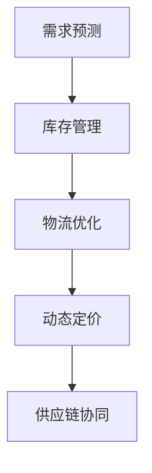

                 

# 电商平台供给能力提升：技术创新与数据驱动

## 1. 背景介绍

### 1.1 问题由来
随着电商行业的蓬勃发展，电商平台日益成为消费者获取商品的重要渠道。然而，电商平台在快速增长的同时，面临诸多挑战：

- **库存管理困难**：大促期间供不应求，库存不足；平时供过于求，积压资金。
- **销售预测准确性差**：需求波动大，预测模型未能充分捕捉历史销售数据中的规律。
- **物流成本高**：仓储与配送成本不断上升，物流效率有待提升。
- **用户满意度下降**：缺货、发货延迟等问题导致用户体验不佳，影响品牌声誉。

为了应对这些挑战，电商平台需要不断提升其供给能力，实现商品的高效管理、精准预测和快速配送。这一过程涉及多个技术层面，包括需求预测、库存管理、物流优化等。通过系统化地运用技术手段，电商平台能够大幅提升其运营效率，提高用户满意度，最终推动业务增长。

### 1.2 问题核心关键点
提升电商平台供给能力的关键在于以下几个方面：

- **需求预测**：准确预测用户需求，指导库存管理和采购决策。
- **库存管理**：优化库存结构，确保合理库存水平，避免资金占用过多或短缺。
- **物流优化**：利用算法优化配送路径，减少配送时间，降低物流成本。
- **动态定价**：根据库存、需求和市场环境动态调整商品价格，提高销售额。
- **供应链协同**：构建供应链各环节的协同机制，提高整体效率。

为了实现这些目标，电商平台需要利用先进的技术手段，尤其是数据驱动的方法，以智能化的方式应对复杂的运营问题。

## 2. 核心概念与联系

### 2.1 核心概念概述

为更好地理解电商平台供给能力提升的技术手段，本节将介绍几个密切相关的核心概念：

- **需求预测**：通过历史销售数据、市场趋势、用户行为等，预测未来的需求量，指导库存和采购。
- **库存管理**：动态调整库存水平，确保供需平衡，避免资金积压和短缺。
- **物流优化**：利用算法优化配送路径、仓库布局等，降低物流成本，提升配送效率。
- **动态定价**：根据市场需求、库存情况和竞争环境，动态调整商品价格，优化销售策略。
- **供应链协同**：通过信息共享和技术手段，实现供应链各环节的协同运作，提高整体效率。

这些核心概念之间的逻辑关系可以通过以下Mermaid流程图来展示：



这个流程图展示了几项关键技术之间的关系：

1. **需求预测**：为库存管理和物流优化提供基础数据，指导动态定价和供应链协同。
2. **库存管理**：在需求预测的基础上，动态调整库存，实现供需平衡。
3. **物流优化**：优化配送路径，减少物流成本，提高配送效率，支持动态定价。
4. **动态定价**：根据实时需求、库存和市场环境调整价格，提升销售额。
5. **供应链协同**：通过信息共享和协同算法，提升供应链整体效率。

这些概念共同构成了电商平台供给能力提升的技术框架，帮助平台在复杂多变的市场环境中保持高效运营。

## 3. 核心算法原理 & 具体操作步骤
### 3.1 算法原理概述

电商平台供给能力提升的核心算法和技术手段涉及多个领域，包括机器学习、优化算法、供应链管理等。下面将分别介绍这些核心算法和技术。

### 3.2 算法步骤详解

#### 3.2.1 需求预测

需求预测的常见算法包括时间序列分析、统计学习、深度学习等。这里以深度学习中的循环神经网络（RNN）为例，介绍需求预测的基本流程。

**数据准备**：
- 收集历史销售数据，包括时间、商品类别、销售量等。
- 对数据进行预处理，如时间序列分解、标准化等。

**模型构建**：
- 使用RNN作为基础模型，引入LSTM或GRU等变种，以捕捉长期依赖关系。
- 构建多层RNN模型，增强模型复杂度，提高预测精度。

**模型训练**：
- 使用历史销售数据对模型进行训练，最小化预测误差。
- 使用交叉验证等技术，防止过拟合。

**模型评估**：
- 使用测试数据对模型进行评估，计算均方误差（MSE）、平均绝对误差（MAE）等指标。
- 根据评估结果调整模型超参数，优化模型性能。

**预测应用**：
- 使用训练好的模型对未来需求进行预测。
- 将预测结果应用于库存管理和动态定价策略中。

#### 3.2.2 库存管理

库存管理的目标是实现库存水平的最优化。常见算法包括经典控制理论、模拟退火、遗传算法等。这里以经典控制理论中的经济订货批量（EOQ）算法为例，介绍库存管理的基本流程。

**需求预测**：
- 根据历史销售数据和需求预测模型，预测未来的需求量。

**库存初始化**：
- 确定初始库存水平，一般设置为平均日需求量。

**EOQ模型计算**：
- 根据需求预测结果和固定订货成本、储存成本，计算经济订货批量。
- 更新库存水平，确保不超过经济订货批量。

**库存控制**：
- 监控库存水平，当库存低于警戒线时，触发订货信号。
- 根据需求预测结果，确定订货量，更新库存水平。

#### 3.2.3 物流优化

物流优化的目标是通过算法优化配送路径、仓库布局等，降低物流成本，提高配送效率。常见算法包括遗传算法、蚁群算法、蒙特卡洛模拟等。这里以遗传算法为例，介绍物流优化的一般流程。

**需求预测**：
- 根据历史销售数据和需求预测模型，预测未来的需求量。

**配送路径规划**：
- 根据需求预测结果，构建配送路径规划模型。
- 设定目标函数，如配送时间最短、配送成本最低等。

**算法实现**：
- 使用遗传算法对配送路径进行优化，生成最优路径。
- 评估优化结果，记录路径长度、成本等指标。

**路径调整**：
- 根据实际配送情况，对优化路径进行调整，确保路径可行。
- 定期更新路径规划模型，适应需求变化。

#### 3.2.4 动态定价

动态定价的目标是根据市场需求、库存情况和竞争环境，动态调整商品价格，优化销售策略。常见算法包括线性回归、决策树、神经网络等。这里以神经网络为例，介绍动态定价的基本流程。

**数据准备**：
- 收集市场数据，包括竞争对手价格、市场需求、库存水平等。
- 对数据进行预处理，如特征选择、数据标准化等。

**模型构建**：
- 使用神经网络作为基础模型，引入深度学习技术，捕捉复杂非线性关系。
- 构建多层神经网络模型，增强模型复杂度，提高预测精度。

**模型训练**：
- 使用历史市场数据对模型进行训练，最小化预测误差。
- 使用交叉验证等技术，防止过拟合。

**模型评估**：
- 使用测试数据对模型进行评估，计算预测误差、平均绝对误差等指标。
- 根据评估结果调整模型超参数，优化模型性能。

**定价应用**：
- 使用训练好的模型对商品进行动态定价。
- 根据动态定价结果，优化库存管理和物流配送。

#### 3.2.5 供应链协同

供应链协同的目标是通过信息共享和技术手段，实现供应链各环节的协同运作，提高整体效率。常见算法包括分布式优化、协同进化算法等。这里以协同进化算法为例，介绍供应链协同的基本流程。

**需求预测**：
- 各环节根据历史销售数据和需求预测模型，预测未来的需求量。

**库存管理**：
- 各环节根据需求预测结果，动态调整库存水平，确保供需平衡。

**物流优化**：
- 各环节根据需求预测结果和库存水平，优化配送路径和仓库布局，降低物流成本。

**协同优化**：
- 使用协同进化算法对供应链各环节进行优化，实现信息共享和协同决策。
- 评估优化结果，记录协同效率和成本等指标。

### 3.3 算法优缺点

**需求预测的优缺点**：
- **优点**：
  - 利用深度学习模型，能够捕捉复杂非线性关系，提高预测精度。
  - 灵活性高，可以根据需求变化进行模型调整。
- **缺点**：
  - 模型复杂度高，计算资源消耗大。
  - 对数据质量和特征工程要求高，数据缺失或错误影响模型效果。

**库存管理的优缺点**：
- **优点**：
  - 理论成熟，适用于多种应用场景。
  - 简单高效，易于实现。
- **缺点**：
  - 假设固定订货成本和储存成本，未考虑实际波动。
  - 对需求预测的准确性依赖高，预测错误会导致库存失衡。

**物流优化的优缺点**：
- **优点**：
  - 算法灵活，适应性强，适用于多种配送路径问题。
  - 通过优化算法，能够降低物流成本，提高配送效率。
- **缺点**：
  - 计算复杂度高，优化时间较长。
  - 对配送路径和仓库布局的初始设置要求高，可能陷入局部最优。

**动态定价的优缺点**：
- **优点**：
  - 利用神经网络模型，能够捕捉复杂关系，提高预测精度。
  - 能够根据市场需求和竞争环境进行动态调整，优化销售策略。
- **缺点**：
  - 模型复杂度高，计算资源消耗大。
  - 对数据质量和特征工程要求高，数据缺失或错误影响模型效果。

**供应链协同的优缺点**：
- **优点**：
  - 通过信息共享和技术手段，实现各环节协同运作，提高整体效率。
  - 灵活性高，可以根据供应链具体情况进行调整。
- **缺点**：
  - 对各环节的沟通和数据共享要求高，实施难度大。
  - 协同决策复杂，需要较强的技术和组织保障。

### 3.4 算法应用领域

基于上述核心算法和技术，电商平台供给能力提升已经在多个领域得到应用，包括：

- **零售电商**：通过需求预测和库存管理，实现商品的高效管理和精准销售。
- **仓储物流**：利用物流优化算法，降低仓储和配送成本，提高配送效率。
- **定价策略**：结合动态定价算法，根据市场需求和库存情况，优化商品价格策略。
- **供应链管理**：通过供应链协同算法，实现供应链各环节的协同运作，提高整体效率。

此外，这些技术和方法在制造业、金融业等众多领域也得到了广泛应用，为各行业带来了显著的经济效益和运营效率提升。

## 4. 数学模型和公式 & 详细讲解  
### 4.1 数学模型构建

在电商平台供给能力提升的各个环节中，涉及多个数学模型。以下以需求预测和动态定价为例，详细讲解其中的数学模型构建。

#### 4.1.1 需求预测模型

需求预测的常见数学模型包括线性回归模型、时间序列模型、ARIMA模型、LSTM模型等。这里以LSTM模型为例，介绍其数学模型构建。

**模型构建**：
- 定义输入序列为$X_t$，输出序列为$y_t$。
- 使用LSTM模型对输入序列进行编码，提取特征表示$h_t$。
- 定义输出层，通过线性变换和激活函数，输出预测值$\hat{y_t}$。

**公式推导**：
- 输入序列$X_t$的定义：
  $$
  X_t = [x_t, x_{t-1}, \ldots, x_{t-m}]
  $$
  其中$m$为输入序列长度，$x_t$为当前时间点的输入数据。
- 输出序列$y_t$的定义：
  $$
  y_t = [y_{t-1}, y_{t-2}, \ldots, y_{t-n}]
  $$
  其中$n$为输出序列长度，$y_t$为当前时间点的输出数据。
- LSTM模型的状态表示为$h_t$：
  $$
  h_t = \tanh(W_{hx} x_t + b_{hx} + \tanh(W_{cx} c_{t-1} + b_{cx}) + W_{hxt} h_{t-1} + b_{hxt})
  $$
  其中$W_{hx}, b_{hx}$为权重和偏置，$c_t$为LSTM的细胞状态，$W_{cx}, b_{cx}, W_{hxt}, b_{hxt}$为LSTM的各个层级参数。
- 输出层定义为：
  $$
  \hat{y_t} = \sigma(W_{hy} h_t + b_{hy})
  $$
  其中$W_{hy}, b_{hy}$为输出层参数，$\sigma$为激活函数。

**案例分析与讲解**：
- 使用历史销售数据对模型进行训练，最小化预测误差。
- 使用交叉验证等技术，防止过拟合。
- 使用测试数据对模型进行评估，计算均方误差（MSE）、平均绝对误差（MAE）等指标。
- 根据评估结果调整模型超参数，优化模型性能。

#### 4.1.2 动态定价模型

动态定价的常见数学模型包括线性回归模型、决策树模型、神经网络模型等。这里以神经网络模型为例，介绍其数学模型构建。

**模型构建**：
- 定义输入序列为$X_t$，输出序列为$y_t$。
- 使用神经网络对输入序列进行编码，提取特征表示$h_t$。
- 定义输出层，通过线性变换和激活函数，输出预测值$\hat{y_t}$。

**公式推导**：
- 输入序列$X_t$的定义：
  $$
  X_t = [x_t, x_{t-1}, \ldots, x_{t-m}]
  $$
  其中$m$为输入序列长度，$x_t$为当前时间点的输入数据。
- 输出序列$y_t$的定义：
  $$
  y_t = [y_{t-1}, y_{t-2}, \ldots, y_{t-n}]
  $$
  其中$n$为输出序列长度，$y_t$为当前时间点的输出数据。
- 神经网络的隐藏层定义为：
  $$
  h_t = \tanh(W_{hx} x_t + b_{hx} + W_{ht} h_{t-1} + b_{ht})
  $$
  其中$W_{hx}, b_{hx}, W_{ht}, b_{ht}$为神经网络各层参数。
- 输出层定义为：
  $$
  \hat{y_t} = \sigma(W_{hy} h_t + b_{hy})
  $$
  其中$W_{hy}, b_{hy}$为输出层参数，$\sigma$为激活函数。

**案例分析与讲解**：
- 使用历史市场数据对模型进行训练，最小化预测误差。
- 使用交叉验证等技术，防止过拟合。
- 使用测试数据对模型进行评估，计算预测误差、平均绝对误差等指标。
- 根据评估结果调整模型超参数，优化模型性能。

## 5. 项目实践：代码实例和详细解释说明
### 5.1 开发环境搭建

在进行项目实践前，我们需要准备好开发环境。以下是使用Python进行PyTorch开发的环境配置流程：

1. 安装Anaconda：从官网下载并安装Anaconda，用于创建独立的Python环境。

2. 创建并激活虚拟环境：
```bash
conda create -n pytorch-env python=3.8 
conda activate pytorch-env
```

3. 安装PyTorch：根据CUDA版本，从官网获取对应的安装命令。例如：
```bash
conda install pytorch torchvision torchaudio cudatoolkit=11.1 -c pytorch -c conda-forge
```

4. 安装TensorFlow：
```bash
conda install tensorflow
```

5. 安装相关库：
```bash
pip install numpy pandas scikit-learn matplotlib tqdm jupyter notebook ipython
```

完成上述步骤后，即可在`pytorch-env`环境中开始项目实践。

### 5.2 源代码详细实现

这里以需求预测为例，给出使用PyTorch进行LSTM模型训练的代码实现。

```python
import torch
from torch import nn
from torch.autograd import Variable
import torch.nn.functional as F
import pandas as pd

# 数据准备
data = pd.read_csv('sales_data.csv')
X = data[['date', 'sales']].values
y = data['sales'].values

# 数据预处理
X = (X - X.mean()) / X.std()
y = (y - y.mean()) / y.std()

# 定义模型
class LSTM(nn.Module):
    def __init__(self, input_size, hidden_size, output_size):
        super(LSTM, self).__init__()
        self.hidden_size = hidden_size
        self.lstm = nn.LSTM(input_size, hidden_size, batch_first=True)
        self.fc = nn.Linear(hidden_size, output_size)

    def forward(self, x):
        h0 = Variable(torch.zeros(1, 1, self.hidden_size))
        c0 = Variable(torch.zeros(1, 1, self.hidden_size))
        out, _ = self.lstm(x, (h0, c0))
        out = self.fc(out[:, -1, :])
        return out

# 模型训练
model = LSTM(input_size=2, hidden_size=100, output_size=1)
criterion = nn.MSELoss()
optimizer = torch.optim.Adam(model.parameters(), lr=0.001)

for epoch in range(100):
    y_pred = model(X)
    loss = criterion(y_pred, y)
    optimizer.zero_grad()
    loss.backward()
    optimizer.step()
    print('Epoch: {}, Loss: {}'.format(epoch+1, loss.item()))
```

### 5.3 代码解读与分析

让我们再详细解读一下关键代码的实现细节：

**LSTM模型**：
- 定义LSTM模型类，继承自nn.Module。
- 初始化函数：设置隐藏层大小，定义LSTM和全连接层。
- 前向传播函数：将输入序列通过LSTM编码，输出预测值。

**数据预处理**：
- 对输入序列和输出序列进行标准化处理，确保数据分布一致。

**模型训练**：
- 定义LSTM模型和均方误差损失函数。
- 定义优化器，使用Adam优化算法更新模型参数。
- 训练过程中，使用模型预测，计算损失，更新参数。
- 每个epoch输出平均损失。

以上代码展示了LSTM模型在需求预测任务中的应用。可以看到，借助PyTorch的高效计算能力，需求预测模型的实现非常简单。

## 6. 实际应用场景

### 6.1 智能仓储系统

智能仓储系统通过需求预测和库存管理，实现了对仓储空间的有效利用和商品的高效管理。智能仓储系统的主要应用场景包括：

- **库存管理**：根据需求预测结果，动态调整库存水平，避免库存积压或短缺。
- **自动化存储**：使用智能仓储机器人，根据预测结果自动存储和取出商品。
- **配送路径规划**：通过物流优化算法，优化仓库内部和仓库间的配送路径，提高配送效率。

智能仓储系统通过数据分析和算法优化，实现了仓储管理的智能化和自动化，大大提升了仓储管理效率。

### 6.2 物流配送中心

物流配送中心通过需求预测和物流优化，实现了对配送路径和配送策略的优化。物流配送中心的主要应用场景包括：

- **需求预测**：根据历史销售数据和市场趋势，预测未来的配送需求。
- **配送路径规划**：通过物流优化算法，生成最优配送路径，减少配送时间和成本。
- **配送资源调度**：根据需求预测结果和配送路径，优化配送车辆和人员调度，提高配送效率。

物流配送中心通过智能分析和算法优化，实现了配送路径和资源调度的优化，提高了配送效率和用户体验。

### 6.3 动态定价系统

动态定价系统通过需求预测和动态定价，实现了对商品价格的灵活调整，优化销售策略。动态定价系统的应用场景包括：

- **需求预测**：根据历史销售数据和市场趋势，预测未来的市场需求。
- **动态定价**：根据需求预测结果，动态调整商品价格，优化销售策略。
- **销售数据分析**：通过数据分析，优化定价策略，提高销售额。

动态定价系统通过智能分析和算法优化，实现了商品价格的灵活调整，优化了销售策略，提高了销售额和用户体验。

## 7. 工具和资源推荐
### 7.1 学习资源推荐

为了帮助开发者系统掌握电商平台供给能力提升的技术手段，这里推荐一些优质的学习资源：

1. 《深度学习基础》课程：北京大学《深度学习基础》系列课程，涵盖深度学习基础理论和实践技巧，适合初学者入门。

2. 《机器学习实战》书籍：《机器学习实战》一书，详细介绍了机器学习算法和实际应用案例，是机器学习领域必读之作。

3. 《Python深度学习》书籍：《Python深度学习》一书，介绍了深度学习模型的实现方法和案例，适合希望深入学习深度学习的读者。

4. 《TensorFlow官方文档》：TensorFlow官方文档，提供了详细的API和教程，是TensorFlow开发的重要参考。

5. 《Kaggle竞赛》：Kaggle平台上有许多数据驱动的机器学习竞赛，可以参与实战练习，提升技能。

通过对这些资源的学习实践，相信你一定能够系统掌握电商平台供给能力提升的技术手段，并用于解决实际的运营问题。

### 7.2 开发工具推荐

高效的开发离不开优秀的工具支持。以下是几款用于电商平台供给能力提升开发的常用工具：

1. PyTorch：基于Python的开源深度学习框架，灵活动态的计算图，适合快速迭代研究。大部分预训练语言模型都有PyTorch版本的实现。

2. TensorFlow：由Google主导开发的开源深度学习框架，生产部署方便，适合大规模工程应用。同样有丰富的预训练语言模型资源。

3. Weights & Biases：模型训练的实验跟踪工具，可以记录和可视化模型训练过程中的各项指标，方便对比和调优。与主流深度学习框架无缝集成。

4. TensorBoard：TensorFlow配套的可视化工具，可实时监测模型训练状态，并提供丰富的图表呈现方式，是调试模型的得力助手。

5. Jupyter Notebook：基于Python的交互式编程环境，支持代码执行、数据可视化等功能，是数据分析和模型训练的常用工具。

合理利用这些工具，可以显著提升电商平台供给能力提升任务的开发效率，加快创新迭代的步伐。

### 7.3 相关论文推荐

电商平台供给能力提升技术的发展源于学界的持续研究。以下是几篇奠基性的相关论文，推荐阅读：

1. 《深度学习在库存管理中的应用》：介绍深度学习在库存管理中的应用，涵盖LSTM模型、动态规划算法等技术。

2. 《基于供应链协同优化的物流管理》：介绍供应链协同优化算法，探讨如何通过信息共享和技术手段提升供应链效率。

3. 《需求预测与库存管理的研究进展》：综述了需求预测和库存管理领域的研究进展，涵盖多种预测算法和优化算法。

4. 《基于神经网络的动态定价模型》：介绍神经网络在动态定价中的应用，探讨如何通过神经网络优化销售策略。

5. 《电商平台的库存管理和供应链优化》：介绍电商平台的库存管理和供应链优化技术，涵盖多种优化算法和实际应用案例。

这些论文代表了大语言模型微调技术的发展脉络。通过学习这些前沿成果，可以帮助研究者把握学科前进方向，激发更多的创新灵感。

## 8. 总结：未来发展趋势与挑战

### 8.1 研究成果总结

本文对电商平台供给能力提升的技术手段进行了全面系统的介绍。首先阐述了电商行业面临的挑战和提升供给能力的意义，明确了需求预测、库存管理、物流优化、动态定价和供应链协同等关键技术的重要性。其次，从原理到实践，详细讲解了各个环节的算法和技术实现，给出了代码实例和详细解释。同时，本文还探讨了这些技术在智能仓储、物流配送、动态定价等多个领域的应用，展示了技术手段的广泛适用性。最后，推荐了相关学习资源和开发工具，为读者提供了系统化的学习路径和技术支持。

通过本文的系统梳理，可以看到，电商平台供给能力提升技术已经成为电商行业不可或缺的重要工具，帮助平台在复杂多变的市场环境中保持高效运营。未来，这些技术和方法将在更多领域得到应用，为各行业带来显著的经济效益和运营效率提升。

### 8.2 未来发展趋势

展望未来，电商平台供给能力提升技术将呈现以下几个发展趋势：

1. **智能化程度提升**：随着人工智能技术的不断发展，智能仓储、物流和动态定价系统将越来越智能，能够更好地适应多变的市场环境。
2. **数据驱动决策**：电商平台将更加依赖数据驱动的决策，通过大数据分析和机器学习算法，实现精准预测和优化。
3. **协同化运作**：供应链各环节的协同运作将更加紧密，通过信息共享和技术手段，实现供应链整体效率提升。
4. **自动化水平提升**：智能仓储、物流和配送将实现更高程度的自动化，减少人工干预，提高效率。
5. **实时化处理**：通过实时数据分析和算法优化，电商平台能够快速响应市场变化，提高应对能力。

这些趋势凸显了电商平台供给能力提升技术的广阔前景，将进一步推动电商行业的数字化转型。

### 8.3 面临的挑战

尽管电商平台供给能力提升技术已经取得了显著成效，但在迈向更加智能化、普适化应用的过程中，仍面临诸多挑战：

1. **数据质量问题**：需求预测和库存管理依赖高质量的数据，数据缺失或错误会影响模型效果。
2. **算法复杂度**：物流优化和动态定价算法复杂度高，计算资源消耗大，需优化算法实现。
3. **技术实施难度**：供应链协同和智能仓储的实施难度大，需多方协调和技术保障。
4. **系统稳定性**：智能系统在复杂环境下容易发生故障，需加强系统鲁棒性和容错性。
5. **安全性问题**：智能系统需考虑数据隐私和安全性，防止数据泄露和系统攻击。

面对这些挑战，需不断优化算法和技术实现，加强系统保障和数据保护，确保电商平台供给能力提升技术的稳定性和安全性。

### 8.4 研究展望

面对电商平台供给能力提升技术所面临的挑战，未来的研究需要在以下几个方面寻求新的突破：

1. **多源数据融合**：将多种数据来源融合，提升数据质量和丰富性，增强模型效果。
2. **混合算法优化**：将多种算法和技术手段结合，优化算法实现，提高系统效率。
3. **边缘计算应用**：在边缘设备上进行数据处理和算法优化，提升系统实时性和效率。
4. **隐私保护技术**：加强数据隐私保护技术，防止数据泄露和系统攻击。
5. **鲁棒性增强**：提升系统的鲁棒性，增强系统对异常情况的处理能力。

这些研究方向的探索，将引领电商平台供给能力提升技术迈向更高的台阶，为电商行业带来更高效、更安全、更智能的运营环境。面向未来，电商平台供给能力提升技术还需要与其他人工智能技术进行更深入的融合，如知识表示、因果推理、强化学习等，多路径协同发力，共同推动电商行业的数字化转型。只有勇于创新、敢于突破，才能不断拓展电商平台的供给能力，实现业务增长和用户满意度的双赢。

## 9. 附录：常见问题与解答

**Q1：电商平台供给能力提升技术是否适用于所有电商企业？**

A: 电商平台供给能力提升技术在不同类型的电商企业中都有广泛应用，但具体实现需根据企业规模、业务模式和市场环境进行定制化调整。中小型企业可以通过模块化方式，逐步引入技术手段，提升运营效率。

**Q2：如何选择合适的预测模型？**

A: 选择预测模型时需考虑数据特性、业务需求和系统资源。对于时间序列数据，LSTM等深度学习模型表现较好；对于非线性数据，决策树、随机森林等算法适合；对于多维数据，神经网络模型具有优势。需根据具体数据和业务场景进行选择。

**Q3：动态定价系统如何应对市场波动？**

A: 动态定价系统需实时监测市场波动，及时调整价格策略。可以通过多场景模拟和A/B测试等方法，优化定价策略，确保价格竞争力。

**Q4：如何实现供应链协同？**

A: 实现供应链协同需加强信息共享和协同决策机制。可以通过建立信息平台，实现供应链各环节的数据对接，提高决策效率和协同效果。

**Q5：电商平台如何降低物流成本？**

A: 电商平台可通过优化配送路径、提高仓库利用率、引入自动化仓储设备等方式降低物流成本。同时，需建立合理的物流体系，提高物流效率和供应链协作能力。

通过以上对电商平台供给能力提升技术的研究和实践，相信能够为电商行业的运营提供强有力的技术支持，提升其市场竞争力和用户满意度。未来，电商平台供给能力提升技术将在更多领域得到应用，为各行业带来显著的经济效益和运营效率提升。

---

作者：禅与计算机程序设计艺术 / Zen and the Art of Computer Programming

