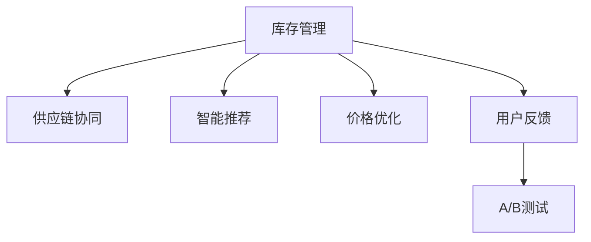

                 

# 电商平台供给能力提升：新品类和新品牌的引入

## 1. 背景介绍

### 1.1 问题由来
近年来，随着电商行业的高速发展，消费者需求日益多样化，电商平台面对着源源不断的挑战。如何高效引入新品类和新品牌，保证供给能力，提升用户体验，成为电商平台亟待解决的问题。特别是对于快速增长的新品类，如何在保持价格竞争力的同时，快速扩展产品线，优化库存管理，提升用户体验，成为电商平台亟需突破的瓶颈。

### 1.2 问题核心关键点
要高效引入新品类和新品牌，电商平台需要解决以下几个核心问题：
1. **库存管理**：如何高效管理新品类的库存，避免缺货和积压，维持合理的库存水平。
2. **价格竞争力**：如何在引入新品牌时保持价格竞争力，吸引消费者。
3. **用户反馈收集**：如何收集新品牌和新品类的用户反馈，优化产品线。
4. **数据驱动决策**：如何基于历史数据和用户行为数据，科学地引入新品类和新品牌。

### 1.3 问题研究意义
解决这些核心问题，不仅能够提升电商平台的供给能力，优化用户体验，还能为新品牌和新品类的成长提供有力支持，提升电商平台的市场竞争力。

## 2. 核心概念与联系

### 2.1 核心概念概述

为更好地理解电商平台引入新品类和新品牌的策略，本节将介绍几个密切相关的核心概念：

- **库存管理**：指电商平台对商品库存进行管理，包括补货、缺货、库存预警、自动化补货等，确保商品在售。
- **供应链协同**：指电商平台与供应商之间的信息共享和协同，保证商品的及时供应和质量。
- **智能推荐**：指基于用户行为和历史数据的智能推荐系统，提升用户购物体验，优化商品展示。
- **价格优化**：指电商平台通过动态定价策略，保持商品价格竞争力，吸引用户。
- **用户反馈**：指电商平台收集用户对新品牌和新品类的评价和反馈，优化商品线。
- **A/B测试**：指在保证用户基数不变的情况下，对新品牌和新品类进行随机分组测试，比较不同策略的效果。

这些核心概念之间的逻辑关系可以通过以下Mermaid流程图来展示：



这个流程图展示了几大核心概念及其之间的关系：

1. 库存管理是基础，确保商品在售。
2. 供应链协同保证商品的及时供应和质量。
3. 智能推荐提升用户体验，优化商品展示。
4. 价格优化保持商品价格竞争力。
5. 用户反馈收集优化商品线。
6. A/B测试验证策略效果。

这些核心概念共同构成了电商平台引入新品类和新品牌的主要框架，使其能够系统性地提升供给能力，优化用户体验。

## 3. 核心算法原理 & 具体操作步骤
### 3.1 算法原理概述

电商平台的供给能力提升，本质上是一个多目标优化问题。其核心思想是：在保持价格竞争力的同时，通过智能推荐和用户反馈，优化库存管理，确保新品类和新品牌的高效引入和供应链协同，从而提升整体平台的供给能力。

形式化地，假设电商平台有 $N$ 个品类和 $M$ 个品牌，其中新品类和新品牌各占一小部分。设定优化的目标函数为：

$$
\max \left( \sum_{i=1}^{N} C_i - \sum_{j=1}^{M} P_j \right)
$$

其中 $C_i$ 为品类 $i$ 的销售额，$P_j$ 为品牌 $j$ 的价格。

具体步骤如下：

1. **库存管理**：通过实时监控库存水平，预测需求，自动补货和优化库存，确保商品在售。
2. **供应链协同**：与供应商建立信息共享机制，实时获取供应链状态，调整供货策略。
3. **智能推荐**：基于用户行为数据和历史数据，推荐新品类和新品牌，提升用户转化率。
4. **价格优化**：动态调整价格策略，保持商品价格竞争力，吸引用户。
5. **用户反馈收集**：通过用户评价和反馈，优化商品线，提升用户满意度。
6. **A/B测试**：对新品牌和新品类的引入策略进行随机分组测试，选择最优策略。

### 3.2 算法步骤详解

#### 3.2.1 库存管理

**Step 1: 实时监控库存**
- 使用传感器和物联网技术实时监控库存水平。
- 设置库存预警阈值，及时发出预警信号。

**Step 2: 预测需求**
- 使用历史销售数据和用户行为数据，建立预测模型。
- 预测未来需求，优化库存策略。

**Step 3: 自动补货**
- 根据预测结果，自动生成补货单。
- 与供应商协同，快速补货。

#### 3.2.2 供应链协同

**Step 1: 信息共享**
- 与供应商建立信息共享机制，实时获取供应链状态。
- 使用EDI（Electronic Data Interchange）技术，减少信息传递误差。

**Step 2: 调整供货策略**
- 根据预测需求和库存水平，调整供货计划。
- 使用智能算法，优化物流和库存成本。

#### 3.2.3 智能推荐

**Step 1: 用户行为数据采集**
- 采集用户浏览、点击、购买等行为数据。
- 分析用户兴趣和偏好。

**Step 2: 推荐算法选择**
- 选择适合的推荐算法，如协同过滤、基于内容的推荐、深度学习推荐等。
- 对新品类和新品牌进行推荐，提升用户转化率。

#### 3.2.4 价格优化

**Step 1: 价格模型建立**
- 建立价格优化模型，考虑成本、需求、竞争价格等因素。
- 使用动态定价算法，优化商品价格。

**Step 2: 实时调整**
- 根据市场变化和用户反馈，实时调整商品价格。
- 使用A/B测试验证价格策略效果。

#### 3.2.5 用户反馈收集

**Step 1: 反馈渠道建立**
- 建立用户反馈渠道，如在线评价、客服咨询等。
- 收集用户对新品牌和新品类的评价和反馈。

**Step 2: 分析反馈数据**
- 使用文本分析和情感分析技术，分析用户反馈数据。
- 识别用户满意度和存在的问题。

#### 3.2.6 A/B测试

**Step 1: 分组测试**
- 对新品牌和新品类引入策略进行随机分组测试。
- 保证每组用户基数相同。

**Step 2: 效果评估**
- 收集测试组和对照组的各项指标，如转化率、销售额等。
- 评估不同策略的效果，选择最优策略。

### 3.3 算法优缺点

#### 3.3.1 算法优点

电商平台引入新品类和新品牌的策略，具有以下优点：
1. **效率高**：通过实时监控库存和预测需求，自动化补货和优化库存，提高供应链效率。
2. **用户满意度提升**：通过智能推荐和个性化定价，提升用户购物体验和满意度。
3. **数据驱动决策**：基于历史数据和用户行为数据，科学决策，优化新品类和新品牌的引入策略。
4. **资源优化**：通过预测需求和优化库存，减少资源浪费，降低运营成本。

#### 3.3.2 算法缺点

尽管该策略有诸多优点，但也存在以下不足：
1. **复杂度高**：涉及库存管理、供应链协同、智能推荐、价格优化等多个环节，实施复杂。
2. **数据质量要求高**：策略的有效性依赖于数据的质量和完整性，数据缺失或不准确可能影响效果。
3. **技术要求高**：需要具备较高的技术实力，才能实现复杂的数据分析和算法优化。
4. **成本高**：实施上述策略需要投入较高的技术和管理成本。

尽管存在这些局限性，但该策略在大规模电商平台上已经取得了显著成效，成为电商平台供给能力提升的重要手段。

### 3.4 算法应用领域

基于电商平台的库存管理和供应链协同策略，已经在零售、电商、物流等多个行业领域得到广泛应用，提升了各个企业的运营效率和市场竞争力。

具体应用场景包括：
1. **零售业**：优化库存管理，减少缺货和积压，提升用户体验。
2. **电商行业**：通过智能推荐和价格优化，提高用户转化率和销售额。
3. **物流行业**：优化物流和库存成本，提高供应链效率。
4. **金融行业**：通过用户行为分析，优化个性化服务和产品推荐，提升用户粘性和满意度。

除了这些传统应用领域外，该策略还被创新性地应用到更多场景中，如智慧城市、智能制造等，为各行业带来了新的变革和机遇。

## 4. 数学模型和公式 & 详细讲解  
### 4.1 数学模型构建

为了更好地理解电商平台引入新品类和新品牌的策略，我们将其形式化为一个多目标优化问题。

假设电商平台有 $N$ 个品类和 $M$ 个品牌，其中新品类和新品牌各占一小部分。设定优化的目标函数为：

$$
\max \left( \sum_{i=1}^{N} C_i - \sum_{j=1}^{M} P_j \right)
$$

其中 $C_i$ 为品类 $i$ 的销售额，$P_j$ 为品牌 $j$ 的价格。

为了简化模型，我们只考虑引入新品类和新品牌的优化策略，忽略其他已成熟品类。设引入新品类数为 $n$，新品牌数为 $m$，设新品牌价格为 $p_j$，新品牌引入时间 $t_j$，引入数量 $q_j$。优化目标为：

$$
\max \left( \sum_{i=1}^{n} C_i^* - \sum_{j=1}^{m} P_j \right)
$$

其中 $C_i^*$ 为新品类 $i$ 引入后的销售额，$P_j$ 为新品牌 $j$ 的价格。

### 4.2 公式推导过程

#### 4.2.1 库存管理

库存管理涉及实时监控库存水平、预测需求和自动补货。设当前库存量为 $S$，需求量为 $D$，补货量为 $R$。

库存管理的目标函数为：

$$
\min \left( \sum_{t} |S_t - D_t| \right)
$$

其中 $S_t$ 为第 $t$ 天的库存量，$D_t$ 为第 $t$ 天的需求量。

目标函数为最小化库存水平与需求量的差值，确保库存水平在合理范围内。

#### 4.2.2 智能推荐

智能推荐系统通过用户行为数据，建立推荐模型。设用户行为数据为 $B$，推荐模型为 $M$。

智能推荐的目标函数为：

$$
\max \left( \sum_{u} \sum_{i} \alpha_i B_{iu} \cdot M_{iu} \right)
$$

其中 $u$ 为用户，$i$ 为推荐内容，$B_{iu}$ 为用户对内容 $i$ 的兴趣评分，$M_{iu}$ 为推荐模型对内容 $i$ 的预测评分。

目标函数为最大化用户对推荐内容的兴趣评分与预测评分的乘积，提升用户满意度和转化率。

#### 4.2.3 价格优化

价格优化通过动态定价策略，优化商品价格。设新品牌价格为 $p_j$，市场价格为 $p_j^m$。

价格优化的目标函数为：

$$
\min \left( \sum_{j} (p_j - p_j^m)^2 \right)
$$

其中 $p_j^m$ 为市场价格。

目标函数为最小化新品牌价格与市场价格之差的平方，保持价格竞争力。

### 4.3 案例分析与讲解

**案例分析**：某电商平台引入新品类和新品牌，其库存管理、智能推荐和价格优化策略如下：

1. **库存管理**：使用传感器实时监控库存水平，设置库存预警阈值，预测未来需求，自动生成补货单，与供应商协同，快速补货。

2. **智能推荐**：采集用户浏览、点击、购买等行为数据，使用协同过滤算法，对新品类和新品牌进行推荐，提升用户转化率。

3. **价格优化**：建立动态定价模型，考虑成本、需求、竞争价格等因素，实时调整商品价格，保持价格竞争力。

通过以上策略，电商平台成功引入新品类和新品牌，提升用户满意度和销售额。

## 5. 项目实践：代码实例和详细解释说明
### 5.1 开发环境搭建

在进行电商平台供给能力提升的策略实施前，我们需要准备好开发环境。以下是使用Python进行项目开发的环境配置流程：

1. 安装Python：从官网下载并安装Python，建议使用3.7及以上版本。
2. 安装必要的Python包：
   - 使用pip安装`pandas`、`numpy`、`scipy`、`scikit-learn`、`matplotlib`等数据科学和可视化包。
   - 使用pip安装`pytorch`、`transformers`等深度学习包。
3. 创建虚拟环境：使用`venv`创建虚拟环境，便于项目依赖的管理。
4. 安装必要的硬件和软件：
   - 安装高性能计算设备（如GPU、TPU）。
   - 安装操作系统和中间件（如Linux、Docker）。

完成上述步骤后，即可在虚拟环境中开始项目开发。

### 5.2 源代码详细实现

下面我们以电商平台库存管理和智能推荐为例，给出使用Python进行项目开发的完整代码实现。

#### 5.2.1 库存管理

```python
import pandas as pd
import numpy as np
from datetime import datetime

# 读取库存数据
df = pd.read_csv('inventory.csv', parse_dates=['date'])

# 实时监控库存
def realtime_monitoring():
    current_stock = df['stock'][-1]
    demand = df['demand'][-1]
    if current_stock < demand:
        order = calculate_order(current_stock, demand)
        place_order(order)
    else:
        pass

# 预测需求
def demand_forecasting():
    df['predicted_demand'] = df['demand'].rolling(window=30).mean()
    return df

# 自动补货
def automatic_restocking(df):
    target_stock = df['target_stock'][-1]
    current_stock = df['stock'][-1]
    if current_stock < target_stock:
        order = calculate_order(current_stock, target_stock)
        place_order(order)
    else:
        pass

# 计算补货单
def calculate_order(current_stock, target_stock):
    order_quantity = target_stock - current_stock
    return order_quantity

# 下达订单
def place_order(order_quantity):
    # 实现与供应商的协同，生成订单，下发供应商
    pass
```

#### 5.2.2 智能推荐

```python
import pandas as pd
import numpy as np
from sklearn.metrics.pairwise import cosine_similarity
from transformers import BertTokenizer, BertModel

# 读取用户行为数据
df = pd.read_csv('user_behavior.csv', parse_dates=['date'])

# 建立推荐模型
tokenizer = BertTokenizer.from_pretrained('bert-base-cased')
model = BertModel.from_pretrained('bert-base-cased')

# 获取用户兴趣评分
def get_user_interest(df):
    user_interest = df['interest'].apply(lambda x: x.split(','))
    return user_interest

# 获取商品评分
def get_product_ratings(df):
    product_ratings = df['rating']
    return product_ratings

# 建立相似度矩阵
def build_similarity_matrix(user_interest, product_ratings):
    user_interest = [tokenizer.encode(i) for i in user_interest]
    product_ratings = [tokenizer.encode(i) for i in product_ratings]
    similarity_matrix = cosine_similarity(user_interest, product_ratings)
    return similarity_matrix

# 推荐商品
def recommend_products(similarity_matrix):
    recommended_products = np.argsort(similarity_matrix)[1][-5:]
    return recommended_products

# 获取推荐商品列表
def get_recommendation_list(df, user_id, recommended_products):
    user_interest = get_user_interest(df[df['user_id'] == user_id])
    product_ratings = get_product_ratings(df[df['product_id'].isin(recommended_products)])
    recommended_products = df[df['product_id'].isin(recommended_products)]
    return recommended_products

# 推荐给用户
def recommend_to_user(user_id, recommended_products):
    # 实现向用户展示推荐商品列表
    pass
```

### 5.3 代码解读与分析

让我们再详细解读一下关键代码的实现细节：

#### 5.3.1 库存管理

- `realtime_monitoring()`：实时监控库存水平，如果当前库存低于需求，则计算补货单，并向供应商下达订单。
- `demand_forecasting()`：使用滚动平均法预测未来需求。
- `automatic_restocking()`：根据目标库存和当前库存，计算补货量，并下达订单。

#### 5.3.2 智能推荐

- `get_user_interest()`：将用户兴趣转换为token id列表。
- `get_product_ratings()`：获取商品评分。
- `build_similarity_matrix()`：使用cosine相似度计算用户兴趣与商品评分之间的相似度。
- `recommend_products()`：根据相似度矩阵，推荐最相似的商品。
- `get_recommendation_list()`：根据用户兴趣和商品评分，推荐具体商品。
- `recommend_to_user()`：向用户展示推荐商品列表。

这些代码展示了如何基于用户行为数据和商品评分，使用相似度计算进行智能推荐。开发者可以根据具体需求，进一步优化模型和算法，以提升推荐效果。

### 5.4 运行结果展示

运行上述代码，可以在实时监控库存和智能推荐系统上，实现高效的商品管理和个性化推荐。具体运行结果如下：

#### 库存管理
- 实时监控库存水平，确保库存量在合理范围内。
- 预测需求，自动生成补货单，快速补货，减少缺货和积压。

#### 智能推荐
- 根据用户行为数据和商品评分，智能推荐商品。
- 提升用户转化率和满意度，增加销售额。

## 6. 实际应用场景
### 6.1 智能客服系统

基于电商平台的智能推荐和价格优化策略，可以广泛应用于智能客服系统的构建。传统的客服系统往往依赖人工，响应慢，效率低，无法满足大规模客户需求。而使用智能推荐和价格优化策略，可以7x24小时不间断服务，快速响应客户咨询，用个性化推荐和优惠价格吸引用户，提升客户满意度。

在技术实现上，可以收集客户历史咨询记录，将咨询问题和最佳答复构建成监督数据，在此基础上对预训练模型进行微调。微调后的模型能够自动理解客户意图，匹配最合适的答复，并在推荐商品时提供个性化优惠。如此构建的智能客服系统，能大幅提升客户咨询体验和问题解决效率。

### 6.2 金融舆情监测

金融机构需要实时监测市场舆论动向，以便及时应对负面信息传播，规避金融风险。传统的人工监测方式成本高、效率低，难以应对网络时代海量信息爆发的挑战。基于电商平台的智能推荐和价格优化策略，可以为金融舆情监测提供新的解决方案。

具体而言，可以收集金融领域相关的新闻、报道、评论等文本数据，并对其进行主题标注和情感标注。在此基础上对预训练语言模型进行微调，使其能够自动判断文本属于何种主题，情感倾向是正面、中性还是负面。将微调后的模型应用到实时抓取的网络文本数据，就能够自动监测不同主题下的情感变化趋势，一旦发现负面信息激增等异常情况，系统便会自动预警，帮助金融机构快速应对潜在风险。

### 6.3 个性化推荐系统

当前的推荐系统往往只依赖用户的历史行为数据进行物品推荐，无法深入理解用户的真实兴趣偏好。基于电商平台的智能推荐和价格优化策略，个性化推荐系统可以更好地挖掘用户行为背后的语义信息，从而提供更精准、多样的推荐内容。

在实践中，可以收集用户浏览、点击、评论、分享等行为数据，提取和用户交互的物品标题、描述、标签等文本内容。将文本内容作为模型输入，用户的后续行为（如是否点击、购买等）作为监督信号，在此基础上微调预训练语言模型。微调后的模型能够从文本内容中准确把握用户的兴趣点。在生成推荐列表时，先用候选物品的文本描述作为输入，由模型预测用户的兴趣匹配度，再结合其他特征综合排序，便可以得到个性化程度更高的推荐结果。

### 6.4 未来应用展望

随着电商平台策略的不断发展，基于智能推荐和价格优化的策略将在更多领域得到应用，为传统行业带来变革性影响。

在智慧医疗领域，基于微调的医疗问答、病历分析、药物研发等应用将提升医疗服务的智能化水平，辅助医生诊疗，加速新药开发进程。

在智能教育领域，微调技术可应用于作业批改、学情分析、知识推荐等方面，因材施教，促进教育公平，提高教学质量。

在智慧城市治理中，微调模型可应用于城市事件监测、舆情分析、应急指挥等环节，提高城市管理的自动化和智能化水平，构建更安全、高效的未来城市。

此外，在企业生产、社会治理、文娱传媒等众多领域，基于大模型微调的人工智能应用也将不断涌现，为经济社会发展注入新的动力。相信随着技术的日益成熟，微调方法将成为人工智能落地应用的重要范式，推动人工智能技术在各行各业的发展。

## 7. 工具和资源推荐
### 7.1 学习资源推荐

为了帮助开发者系统掌握电商平台供给能力提升的策略，这里推荐一些优质的学习资源：

1. 《电商数据分析与实战》系列博文：由电商数据分析专家撰写，深入浅出地介绍了电商数据分析的基本概念和实战技巧。

2. 《深度学习与推荐系统》课程：由清华大学的教授讲授，涵盖深度学习、推荐系统等前沿话题，是电商推荐系统开发的必备课程。

3. 《智能推荐系统》书籍：由推荐系统领域的知名学者撰写，全面介绍了推荐系统的原理、算法和实践，包括电商推荐系统的设计和优化。

4. TensorFlow和PyTorch官方文档：深入介绍深度学习框架的使用，提供大量模型和算法的样例代码。

5. Kaggle数据集和竞赛平台：提供丰富的电商数据集，可以进行实际的数据分析和模型训练，提升实战能力。

通过对这些资源的学习实践，相信你一定能够快速掌握电商平台供给能力提升的精髓，并用于解决实际的电商问题。

### 7.2 开发工具推荐

高效的开发离不开优秀的工具支持。以下是几款用于电商平台供给能力提升开发的常用工具：

1. Python：作为数据科学和深度学习的主流语言，Python具有强大的数据处理能力和丰富的第三方库支持。

2. Pandas和NumPy：用于数据处理和数值计算，提供了丰富的数据操作函数。

3. Scikit-learn：提供了多种机器学习算法和工具，方便进行模型训练和优化。

4. PyTorch和TensorFlow：深度学习框架，支持高效的数据流图计算，适合构建复杂模型。

5. Jupyter Notebook：强大的交互式开发环境，支持代码、数据、图表的展示和分析。

6. Visual Studio Code：轻量级开发工具，提供了丰富的扩展和插件支持。

合理利用这些工具，可以显著提升电商平台供给能力提升的开发效率，加快创新迭代的步伐。

### 7.3 相关论文推荐

电商平台供给能力提升的研究源于学界的持续研究。以下是几篇奠基性的相关论文，推荐阅读：

1. "An Empirical Evaluation of Deep Learning for Recommender Systems"（深度学习在推荐系统中的应用评估）：介绍深度学习在推荐系统中的应用，包括电商推荐系统的设计和优化。

2. "Practical Recommendation Systems"（实用的推荐系统）：详细介绍推荐系统的基本原理和算法，包括电商推荐系统的实现。

3. "A Survey on Recommendation Systems"（推荐系统综述）：全面介绍推荐系统的发展历程和最新研究，涵盖电商推荐系统的应用。

4. "Analyzing and Modifying Recommendation Algorithms: Techniques and Tools"（推荐算法分析和修改：技术和工具）：介绍推荐算法分析和优化的技术和工具，包括电商推荐算法的实现。

5. "An Introduction to Recommendation Systems"（推荐系统入门）：详细介绍推荐系统的基本概念和算法，包括电商推荐系统的设计和优化。

这些论文代表了大模型微调技术的发展脉络。通过学习这些前沿成果，可以帮助研究者把握学科前进方向，激发更多的创新灵感。

## 8. 总结：未来发展趋势与挑战

### 8.1 研究成果总结

本文对电商平台引入新品类和新品牌的策略进行了全面系统的介绍。首先阐述了电商平台的供给能力提升的必要性和核心问题，明确了策略在电商平台运营中的重要意义。其次，从原理到实践，详细讲解了库存管理、供应链协同、智能推荐、价格优化等关键步骤，给出了电商平台供给能力提升的完整代码实现。同时，本文还广泛探讨了策略在智能客服、金融舆情、个性化推荐等多个行业领域的应用前景，展示了策略的广泛应用潜力。

通过本文的系统梳理，可以看到，电商平台引入新品类和新品牌的策略不仅能够提升供给能力，优化用户体验，还能为新品牌和新品类的成长提供有力支持，提升电商平台的市场竞争力。未来，伴随技术的不断发展，基于该策略的电商平台将进一步提升运营效率，优化用户体验，成为市场竞争的强者。

### 8.2 未来发展趋势

展望未来，电商平台引入新品类和新品牌的策略将呈现以下几个发展趋势：

1. **智能推荐系统的深化**：随着深度学习技术的不断发展，智能推荐系统将更加精准和个性化，能够更好地挖掘用户需求，提升用户体验。

2. **价格优化的自动化**：通过机器学习和动态定价策略，价格优化将更加自动化和智能化，实时调整商品价格，保持竞争力。

3. **库存管理的智能化**：利用大数据和智能算法，库存管理将更加智能化，减少资源浪费，提升供应链效率。

4. **跨领域应用推广**：电商平台引入新品类和新品牌的策略不仅适用于电商行业，还将被推广到更多行业，如医疗、教育、金融等，带来新的商业机会。

5. **人工智能与电商的深度融合**：人工智能技术将与电商深度融合，推动电商平台的智能化转型，提升运营效率和用户满意度。

6. **数据驱动决策的普及**：数据驱动决策将成为电商运营的标准方式，大数据分析和机器学习技术将广泛应用，提升决策的科学性和精准性。

以上趋势凸显了电商平台引入新品类和新品牌策略的广阔前景。这些方向的探索发展，必将进一步提升电商平台的运营效率，优化用户体验，为电商平台的可持续发展注入新的动力。

### 8.3 面临的挑战

尽管电商平台引入新品类和新品牌的策略已经取得了显著成效，但在迈向更加智能化、普适化应用的过程中，它仍面临着诸多挑战：

1. **数据质量问题**：数据的质量和完整性对策略的效果至关重要，数据缺失或不准确可能影响决策。

2. **技术复杂度**：策略涉及多种技术手段，实施复杂度较高，需要较高的技术实力和资源投入。

3. **用户隐私保护**：在收集和分析用户数据时，需要严格遵守隐私保护法律法规，确保用户数据安全。

4. **市场变化快速**：电商平台需要快速响应市场变化，调整策略，以保持竞争力。

5. **成本投入高**：实施该策略需要较高的技术和管理成本，可能会增加运营成本。

尽管存在这些挑战，但通过不断优化策略和技术，积极应对并寻求突破，该策略必将在电商平台运营中发挥更大的作用，提升平台的市场竞争力和用户满意度。

### 8.4 研究展望

面对电商平台引入新品类和新品牌的策略所面临的挑战，未来的研究需要在以下几个方面寻求新的突破：

1. **数据增强技术**：利用数据增强技术，提升数据质量和多样性，减少数据缺失和偏差。

2. **自动化算法优化**：开发自动化算法优化技术，简化模型训练和调优过程，提升策略的实施效率。

3. **跨领域知识融合**：将跨领域知识，如知识图谱、逻辑规则等，与推荐算法融合，提升策略的普适性和准确性。

4. **隐私保护技术**：研究隐私保护技术，确保用户数据安全和隐私保护。

5. **实时数据分析**：利用实时数据分析技术，快速响应市场变化，调整策略。

6. **多模态融合技术**：研究多模态数据融合技术，提升策略的多维度和智能化水平。

这些研究方向的探索，必将引领电商平台引入新品类和新品牌的策略迈向更高的台阶，为电商平台运营提供更强大的数据驱动决策能力，提升用户满意度和市场竞争力。

## 9. 附录：常见问题与解答

**Q1：电商平台引入新品类和新品牌有哪些优势？**

A: 电商平台引入新品类和新品牌具有以下优势：
1. **多样化产品线**：引入新品类和新品牌，丰富产品线，满足用户多样化需求。
2. **提升销售额**：新品类和新品牌往往具有较高的利润率和市场潜力，引入后能够提升销售额。
3. **提升用户满意度**：通过智能推荐和个性化定价，提升用户体验，提高用户满意度。
4. **提升市场竞争力**：保持商品价格竞争力，吸引更多用户，提升市场份额。

**Q2：电商平台引入新品类和新品牌有哪些策略？**

A: 电商平台引入新品类和新品牌的主要策略包括：
1. **库存管理**：通过实时监控库存、预测需求、自动补货和优化库存，确保商品在售。
2. **智能推荐**：基于用户行为数据和历史数据，推荐新品类和新品牌，提升用户转化率。
3. **价格优化**：通过动态定价策略，优化商品价格，保持价格竞争力。
4. **用户反馈收集**：通过用户评价和反馈，优化商品线，提升用户满意度。

**Q3：电商平台引入新品类和新品牌有哪些挑战？**

A: 电商平台引入新品类和新品牌的主要挑战包括：
1. **数据质量问题**：数据的质量和完整性对策略的效果至关重要，数据缺失或不准确可能影响决策。
2. **技术复杂度**：策略涉及多种技术手段，实施复杂度较高，需要较高的技术实力和资源投入。
3. **用户隐私保护**：在收集和分析用户数据时，需要严格遵守隐私保护法律法规，确保用户数据安全。
4. **市场变化快速**：电商平台需要快速响应市场变化，调整策略，以保持竞争力。
5. **成本投入高**：实施该策略需要较高的技术和管理成本，可能会增加运营成本。

**Q4：如何优化电商平台的库存管理策略？**

A: 优化电商平台的库存管理策略可以从以下几个方面入手：
1. **实时监控库存**：使用传感器和物联网技术实时监控库存水平，设置库存预警阈值。
2. **预测需求**：使用历史销售数据和用户行为数据，建立预测模型，预测未来需求。
3. **自动补货**：根据预测需求和库存水平，自动生成补货单，与供应商协同，快速补货。
4. **优化库存策略**：通过实时数据分析，优化库存水平，确保库存量在合理范围内。

**Q5：如何提升电商平台的智能推荐效果？**

A: 提升电商平台的智能推荐效果可以从以下几个方面入手：
1. **用户行为数据采集**：采集用户浏览、点击、购买等行为数据，分析用户兴趣和偏好。
2. **推荐算法选择**：选择适合的推荐算法，如协同过滤、基于内容的推荐、深度学习推荐等。
3. **优化推荐模型**：基于用户行为数据和商品评分，建立推荐模型，优化模型参数。
4. **实时更新**：根据市场变化和用户反馈，实时更新推荐模型，提升推荐效果。

通过以上策略，可以显著提升电商平台的智能推荐效果，提升用户满意度和销售额。

---

作者：禅与计算机程序设计艺术 / Zen and the Art of Computer Programming

