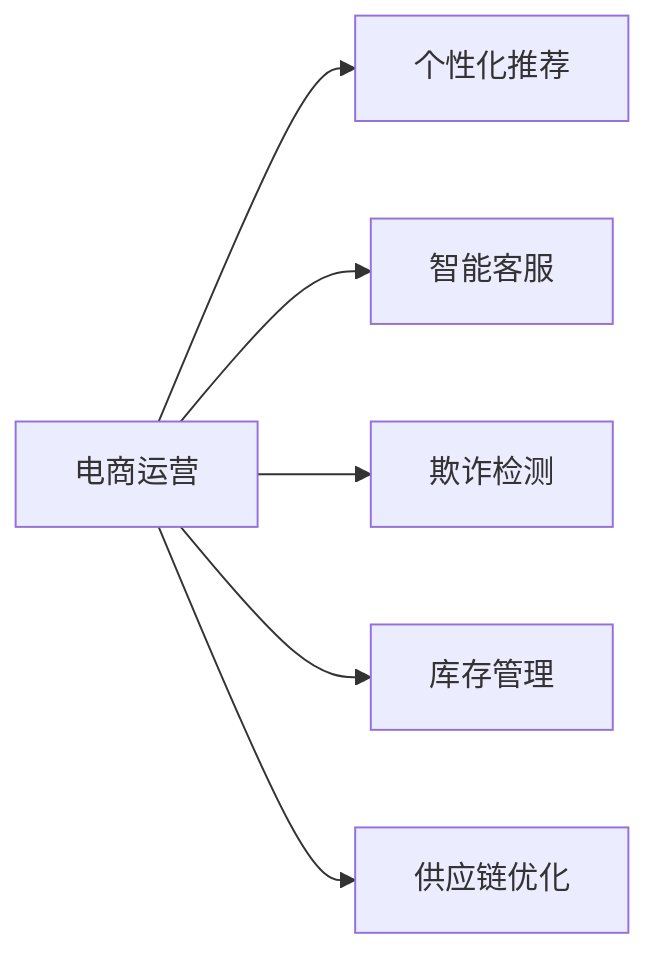
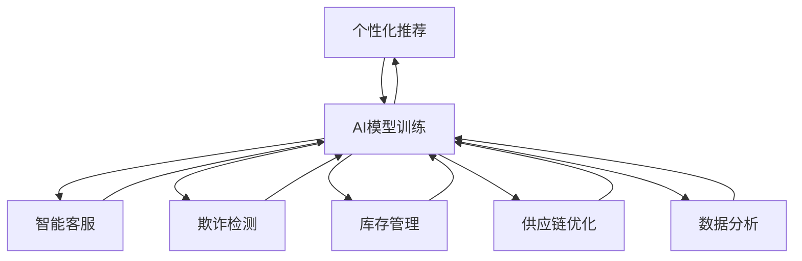

                 

# 电商运营效率的AI优化方案

## 1. 背景介绍

### 1.1 问题由来
随着电商市场的迅猛发展，传统的运营模式已难以适应新的业务挑战。如何通过人工智能(AI)技术优化电商运营效率，提升用户体验和业务绩效，成为了众多电商平台和运营团队关注的焦点。

### 1.2 问题核心关键点
1. **数据驱动决策**：电商运营中涉及大量数据，如何高效利用数据进行精细化运营决策，是提升运营效率的关键。
2. **个性化推荐**：通过AI技术为不同用户推荐个性化商品，能够显著提高用户购买转化率和满意度。
3. **智能客服**：使用AI驱动的智能客服系统，可以大幅提升用户服务体验，减少人工客服成本。
4. **库存管理**：通过AI预测商品销售趋势，优化库存管理，减少缺货和积压现象。
5. **欺诈检测**：利用AI识别和防范交易欺诈，保障平台安全和用户利益。
6. **供应链优化**：通过AI优化供应链各个环节，提高物流效率，降低运营成本。

### 1.3 问题研究意义
在电商运营中应用AI技术，有助于实现运营流程自动化、决策智能化、客户服务精准化，从而大幅提升运营效率和用户满意度。具体来说：

1. **降低运营成本**：自动化运营流程和智能决策能够减少人力投入，降低运营成本。
2. **提升用户体验**：个性化推荐和智能客服能够提供更好的用户购物体验，提升用户忠诚度。
3. **提高转化率**：智能推荐和库存管理能够优化用户路径，提高用户购买转化率。
4. **增强欺诈防护**：智能欺诈检测系统能够及时发现并防范欺诈行为，保护用户利益。
5. **优化供应链**：通过AI优化供应链管理，提高物流效率，减少运营成本。

本文将详细介绍基于AI的电商运营优化方案，包括个性化推荐、智能客服、库存管理、欺诈检测和供应链优化等方面的核心技术和应用实践。

## 2. 核心概念与联系

### 2.1 核心概念概述

为更好地理解AI在电商运营中的应用，本节将介绍几个关键概念：

- **人工智能(AI)**：通过机器学习、深度学习等技术，让机器具有类似于人类的智能决策能力。
- **电商运营**：包括商品展示、推荐、购买、客服、库存管理、物流等各个环节的运营工作。
- **个性化推荐**：根据用户行为和偏好，智能推荐可能感兴趣的商品。
- **智能客服**：使用AI技术驱动的聊天机器人等工具，提升用户服务体验。
- **欺诈检测**：通过机器学习模型，识别和防范交易欺诈行为。
- **供应链优化**：使用AI技术优化供应链管理，提高物流效率。

这些概念之间的联系通过以下Mermaid流程图展示：



### 2.2 核心概念原理和架构的 Mermaid 流程图

以下是核心概念原理和架构的 Mermaid 流程图，展示各技术之间的联系：



这个流程图展示了一个基本的AI驱动的电商运营架构，其中数据分析和AI模型训练是基础环节，通过数据驱动的决策支持，各个应用模块（个性化推荐、智能客服、欺诈检测、库存管理和供应链优化）能够实现高效运转。

## 3. 核心算法原理 & 具体操作步骤

### 3.1 算法原理概述

AI在电商运营中的应用，主要基于以下核心算法和原理：

- **机器学习(Machine Learning, ML)**：通过训练模型，利用历史数据预测未来行为或结果。
- **深度学习(Deep Learning, DL)**：使用神经网络模型，学习数据中的复杂非线性关系，提升模型预测能力。
- **强化学习(Reinforcement Learning, RL)**：通过试错，逐步优化决策策略，提升运营效率。
- **自然语言处理(Natural Language Processing, NLP)**：处理和理解人类语言，提升智能客服和推荐系统的精准度。
- **计算机视觉(Computer Vision, CV)**：处理图像和视频数据，提升欺诈检测和供应链管理能力。

### 3.2 算法步骤详解

基于AI的电商运营优化方案主要包括以下几个关键步骤：

**Step 1: 数据采集与预处理**
- 收集电商平台的各类运营数据，如用户行为数据、交易数据、物流数据等。
- 对数据进行清洗、归一化、特征工程等预处理，保证数据质量。

**Step 2: 数据分析与建模**
- 使用数据分析工具，对数据进行探索性分析，提取关键特征。
- 选择合适的机器学习模型，如线性回归、随机森林、神经网络等，进行模型训练。
- 对模型进行调参和验证，确保模型具有较好的泛化能力。

**Step 3: AI模型部署与监控**
- 将训练好的模型部署到生产环境，进行实时预测和决策。
- 监控模型运行状态，及时发现和修复问题。

**Step 4: 模型优化与迭代**
- 根据实际运营反馈，不断优化和迭代模型，提升模型性能。
- 结合最新的数据和技术进展，更新模型参数，保持模型前沿性。

### 3.3 算法优缺点

基于AI的电商运营优化方案具有以下优点：

1. **提升运营效率**：通过自动化流程和智能决策，大幅减少人工干预，提升运营效率。
2. **个性化服务**：利用AI技术，实现个性化推荐和智能客服，提升用户体验。
3. **精准决策**：通过数据分析和建模，实现更精准的运营决策，提高转化率和收入。
4. **实时监控**：利用实时数据监控，及时发现和解决问题，保障运营稳定性。
5. **灵活迭代**：基于反馈进行持续优化，适应运营环境变化，保持竞争优势。

同时，该方案也存在一些缺点：

1. **数据依赖**：AI方案依赖于高质量的数据，数据不充分或不准确会导致模型性能下降。
2. **模型复杂性**：复杂的AI模型需要较高的计算资源，部署和维护成本较高。
3. **隐私与安全**：AI方案需要处理大量敏感数据，隐私保护和安全问题需要特别关注。
4. **算法黑盒**：部分AI模型（如深度学习）具有较强的不透明性，难以解释其决策过程。

### 3.4 算法应用领域

基于AI的电商运营优化方案，广泛应用于以下领域：

- **个性化推荐系统**：通过用户行为和历史购买记录，推荐可能感兴趣的商品。
- **智能客服系统**：使用自然语言处理和对话系统，提升用户服务体验。
- **欺诈检测系统**：利用机器学习模型，识别和防范交易欺诈行为。
- **库存管理系统**：通过需求预测和库存优化算法，减少库存积压和缺货现象。
- **供应链优化系统**：使用AI技术，优化供应链各个环节，提高物流效率。
- **营销决策支持系统**：基于数据分析，辅助营销决策，提升广告效果和ROI。

## 4. 数学模型和公式 & 详细讲解 & 举例说明

### 4.1 数学模型构建

本节将使用数学语言对AI在电商运营中的应用进行更加严格的刻画。

记电商运营中的用户行为数据为 $X=\{(x_i, y_i)\}_{i=1}^N$，其中 $x_i$ 为输入特征向量， $y_i$ 为对应的行为标签（如购买、浏览等）。

定义模型的损失函数为 $L(\theta)$，其中 $\theta$ 为模型参数。假设模型为线性回归模型，则损失函数为：

$$
L(\theta) = \frac{1}{N}\sum_{i=1}^N (y_i - f_\theta(x_i))^2
$$

其中 $f_\theta(x_i)$ 为模型对输入 $x_i$ 的预测值。

### 4.2 公式推导过程

以下我们以线性回归模型为例，推导其损失函数的梯度公式。

首先，根据梯度下降算法的原理，对损失函数 $L(\theta)$ 求导，得到模型参数 $\theta$ 的梯度：

$$
\frac{\partial L(\theta)}{\partial \theta} = -\frac{2}{N}\sum_{i=1}^N (y_i - f_\theta(x_i)) x_i
$$

将 $f_\theta(x_i)$ 展开，得到：

$$
f_\theta(x_i) = \theta_0 + \sum_{j=1}^{p} \theta_j x_{ij}
$$

其中 $x_{ij}$ 为特征向量 $x_i$ 的第 $j$ 个特征值。

将 $f_\theta(x_i)$ 代入梯度公式，得到：

$$
\frac{\partial L(\theta)}{\partial \theta} = -\frac{2}{N}\sum_{i=1}^N \left[ y_i - (\theta_0 + \sum_{j=1}^{p} \theta_j x_{ij}) \right] x_i = -\frac{2}{N}\left[ y_i x_i - \theta_0 x_i - \sum_{j=1}^{p} \theta_j x_i x_{ij} \right]
$$

整理得到：

$$
\frac{\partial L(\theta)}{\partial \theta} = -\frac{2}{N}\left[ x_i y_i - \theta_0 x_i - \sum_{j=1}^{p} \theta_j x_i^2 \right]
$$

使用随机梯度下降算法，更新模型参数 $\theta$ 为：

$$
\theta \leftarrow \theta - \eta \frac{\partial L(\theta)}{\partial \theta}
$$

其中 $\eta$ 为学习率。

### 4.3 案例分析与讲解

以个性化推荐系统为例，分析其在电商运营中的应用。

假设电商平台有 $M$ 种商品，用户对每种商品 $m$ 的评分 $x_{im}$ 和评价 $y_{im}$。个性化推荐系统通过学习用户的历史评分数据，预测用户对商品 $m$ 的评分 $x_{im}'$，推荐评分高的商品。

构建线性回归模型 $f_\theta(x_i)$，其中 $\theta_0, \theta_1, \ldots, \theta_p$ 为模型参数，$x_i$ 为商品 $m$ 的评分数据。

模型训练时，使用用户的历史评分数据 $X$ 和目标评分 $Y$ 进行训练，最小化损失函数 $L(\theta)$：

$$
L(\theta) = \frac{1}{N}\sum_{i=1}^N (y_i - f_\theta(x_i))^2
$$

模型预测时，对新商品 $m'$ 的评分 $x_{m'}$，计算预测评分 $x_{m'}'$：

$$
x_{m'}' = f_\theta(x_{m'})
$$

根据预测评分排序，推荐评分高的商品给用户。

## 5. 项目实践：代码实例和详细解释说明

### 5.1 开发环境搭建

在进行AI电商运营优化方案的开发前，我们需要准备好开发环境。以下是使用Python进行TensorFlow开发的环境配置流程：

1. 安装Anaconda：从官网下载并安装Anaconda，用于创建独立的Python环境。

2. 创建并激活虚拟环境：
```bash
conda create -n tf-env python=3.8 
conda activate tf-env
```

3. 安装TensorFlow：根据CUDA版本，从官网获取对应的安装命令。例如：
```bash
conda install tensorflow -c tf
```

4. 安装各类工具包：
```bash
pip install numpy pandas scikit-learn matplotlib tqdm jupyter notebook ipython
```

完成上述步骤后，即可在`tf-env`环境中开始AI电商运营优化方案的开发。

### 5.2 源代码详细实现

这里以构建个性化推荐系统为例，给出使用TensorFlow进行模型训练的PyTorch代码实现。

首先，定义训练数据和标签：

```python
import tensorflow as tf

# 定义训练数据
X_train = tf.random.normal([1000, 10])

# 定义标签
Y_train = tf.random.normal([1000, 1])

# 定义模型
model = tf.keras.Sequential([
    tf.keras.layers.Dense(64, activation='relu', input_shape=(10,)),
    tf.keras.layers.Dense(1)
])

# 定义损失函数
loss_fn = tf.keras.losses.MeanSquaredError()

# 定义优化器
optimizer = tf.keras.optimizers.Adam(learning_rate=0.01)

# 定义评估指标
eval_metric = tf.keras.metrics.MeanAbsoluteError()

# 训练模型
model.compile(optimizer=optimizer, loss=loss_fn, metrics=[eval_metric])
model.fit(X_train, Y_train, epochs=10, validation_split=0.2)
```

然后，在训练集上进行模型训练：

```python
# 训练模型
model.fit(X_train, Y_train, epochs=10, validation_split=0.2)
```

最后，评估模型性能：

```python
# 评估模型
loss, eval_metric = model.evaluate(X_test, Y_test)
print(f"测试集损失: {loss:.4f}, 平均绝对误差: {eval_metric:.4f}")
```

以上就是使用TensorFlow进行个性化推荐系统训练的完整代码实现。可以看到，TensorFlow提供的高级API使得模型训练过程变得非常便捷，开发者可以更加专注于算法和业务逻辑的设计。

### 5.3 代码解读与分析

让我们再详细解读一下关键代码的实现细节：

**数据定义**：
- `X_train`和`Y_train`分别定义训练数据和标签，用于模型训练。
- `X_test`和`Y_test`定义测试数据和标签，用于模型评估。

**模型定义**：
- 使用`tf.keras.Sequential`定义线性回归模型，包含一个输入层和一个输出层。
- 输入层有10个神经元，激活函数为ReLU。
- 输出层只有一个神经元，用于预测评分。

**损失函数和优化器**：
- 使用`tf.keras.losses.MeanSquaredError`定义均方误差损失函数。
- 使用`tf.keras.optimizers.Adam`定义Adam优化器，学习率为0.01。

**评估指标**：
- 使用`tf.keras.metrics.MeanAbsoluteError`定义平均绝对误差指标，用于评估模型性能。

**模型训练**：
- 使用`model.compile`定义模型编译过程，设置优化器、损失函数和评估指标。
- 使用`model.fit`进行模型训练，设置训练轮数为10，验证集占比为20%。

**模型评估**：
- 使用`model.evaluate`进行模型评估，输出测试集的损失和平均绝对误差。

可以看到，TensorFlow提供的高级API使得模型训练过程变得非常便捷，开发者可以更加专注于算法和业务逻辑的设计。

## 6. 实际应用场景

### 6.1 智能客服系统

基于AI的智能客服系统可以应用于电商平台，提升用户服务体验，减少人工客服成本。具体来说，可以构建以下系统：

- **自然语言处理**：使用自然语言处理技术，将用户输入的自然语言转化为机器可理解的形式。
- **意图识别**：通过意图识别模型，确定用户意图，提供相应的服务。
- **上下文管理**：维护用户会话上下文，确保服务连续性和一致性。
- **交互优化**：根据用户反馈，不断优化服务流程和交互体验。

实际应用中，可以收集用户的历史客服数据，构建意图识别和对话管理模型，并在生产环境中部署。模型根据用户输入的自然语言，自动回复常见问题，或将复杂问题转接给人工客服。

### 6.2 欺诈检测系统

电商交易过程中，存在一定的欺诈风险。使用AI技术，可以构建欺诈检测系统，识别和防范欺诈行为。具体来说，可以构建以下系统：

- **异常检测**：通过异常检测模型，识别异常交易行为。
- **交易特征提取**：提取交易过程中的关键特征，用于模型训练。
- **模型训练与部署**：使用机器学习模型训练欺诈检测模型，并在生产环境中部署。

实际应用中，可以收集历史交易数据，构建异常检测模型，如基于规则的模型、基于机器学习的模型等。模型根据交易特征，判断是否存在欺诈行为，并及时报警或拦截交易。

### 6.3 库存管理系统

电商平台需要高效管理库存，避免库存积压或缺货现象。使用AI技术，可以构建库存管理系统，优化库存管理决策。具体来说，可以构建以下系统：

- **需求预测**：使用时间序列预测模型，预测商品需求趋势。
- **库存优化**：根据需求预测结果，优化库存管理策略。
- **补货管理**：根据库存状态和需求预测结果，自动补货。

实际应用中，可以收集历史销售数据，构建需求预测模型，如基于时间序列的ARIMA模型、基于深度学习的LSTM模型等。模型根据历史销售数据，预测未来需求，指导库存管理决策。

### 6.4 供应链优化系统

电商平台的物流管理需要高效的供应链优化系统。使用AI技术，可以构建供应链优化系统，提升物流效率，降低运营成本。具体来说，可以构建以下系统：

- **路径规划**：使用路径规划模型，优化物流路径。
- **运输优化**：使用运输优化模型，最小化运输成本。
- **仓储管理**：使用仓储管理模型，优化仓储布局。

实际应用中，可以收集物流数据，构建路径规划和运输优化模型，如基于强化学习的路径规划模型、基于遗传算法的运输优化模型等。模型根据物流数据，优化物流路径和运输方案，提升物流效率。

## 7. 工具和资源推荐

### 7.1 学习资源推荐

为了帮助开发者系统掌握AI在电商运营中的应用，这里推荐一些优质的学习资源：

1. **TensorFlow官方文档**：TensorFlow的官方文档提供了详细的使用指南和示例代码，是学习和实践TensorFlow的必备资源。
2. **TensorFlow实战指南**：一本由TensorFlow官方团队编写的实战指南，涵盖从基础到高级的TensorFlow应用。
3. **深度学习入门与实战**：一本深度学习领域的入门书籍，涵盖深度学习的基本概念和实践技术。
4. **自然语言处理综述**：一本自然语言处理领域的综述书籍，介绍自然语言处理的基本概念和前沿技术。
5. **电商数据分析与优化**：一本电商数据分析与优化的书籍，介绍电商运营中数据分析和优化的方法和实践。

通过对这些资源的学习实践，相信你一定能够快速掌握AI在电商运营中的应用，并用于解决实际的电商运营问题。

### 7.2 开发工具推荐

高效的开发离不开优秀的工具支持。以下是几款用于AI电商运营优化方案开发的常用工具：

1. **TensorFlow**：由Google主导开发的开源深度学习框架，生产部署方便，适合大规模工程应用。
2. **TensorFlow Hub**：TensorFlow提供的模型库，可以轻松加载和使用预训练模型。
3. **PyTorch**：由Facebook主导开发的深度学习框架，灵活动态的计算图，适合快速迭代研究。
4. **Keras**：高层次的深度学习API，易于上手，适合快速原型开发。
5. **Jupyter Notebook**：开源的交互式编程环境，方便调试和分享代码。
6. **Git**：版本控制系统，方便团队协作和代码管理。

合理利用这些工具，可以显著提升AI电商运营优化方案的开发效率，加快创新迭代的步伐。

### 7.3 相关论文推荐

AI在电商运营中的应用源于学界的持续研究。以下是几篇奠基性的相关论文，推荐阅读：

1. **《深度学习与电商运营》**：介绍深度学习在电商运营中的应用，涵盖个性化推荐、智能客服、欺诈检测等方面。
2. **《电商数据分析与优化》**：介绍电商数据分析与优化的基本方法和技术，涵盖需求预测、库存管理、物流优化等方面。
3. **《电商平台智能化运营》**：介绍电商平台智能化的运营管理方法，涵盖数据驱动决策、用户行为分析、运营优化等方面。
4. **《机器学习在电商欺诈检测中的应用》**：介绍机器学习在电商欺诈检测中的应用，涵盖异常检测、特征提取、模型训练等方面。
5. **《智能客服系统的设计与实现》**：介绍智能客服系统的设计与实现方法，涵盖自然语言处理、意图识别、对话管理等方面。

这些论文代表了大规模电商运营AI技术的最新进展，通过学习这些前沿成果，可以帮助研究者把握学科前进方向，激发更多的创新灵感。

## 8. 总结：未来发展趋势与挑战

### 8.1 总结

本文对基于AI的电商运营优化方案进行了全面系统的介绍。首先阐述了AI在电商运营中的应用背景和意义，明确了AI驱动运营效率提升的独特价值。其次，从原理到实践，详细讲解了AI电商运营优化方案的核心算法和具体操作步骤，给出了模型训练的完整代码实例。同时，本文还广泛探讨了AI在个性化推荐、智能客服、欺诈检测、库存管理、供应链优化等多个领域的应用前景，展示了AI技术在电商运营中的巨大潜力。

通过本文的系统梳理，可以看到，AI在电商运营中的应用已经取得了显著成效，为电商平台带来了新的运营模式和管理思路。未来，伴随AI技术的不断进步，电商运营将更加智能化、自动化，为电商市场带来更大的发展机遇。

### 8.2 未来发展趋势

展望未来，AI在电商运营中的应用将呈现以下几个发展趋势：

1. **智能化程度提升**：随着深度学习、强化学习等技术的发展，AI在电商运营中的应用将更加智能化、自适应，能够更好地应对复杂的运营场景。
2. **跨领域融合**：AI技术将与其他领域的技术，如物联网、区块链、人工智能等进行更深层次的融合，提升电商运营的综合能力。
3. **实时响应能力增强**：通过实时数据采集和处理，AI系统将能够实现实时响应，提高运营效率和用户满意度。
4. **个性化服务深化**：基于AI技术的个性化推荐和智能客服系统，将更深入地挖掘用户需求，提供更加精准的服务。
5. **供应链协同优化**：AI技术将进一步优化供应链各个环节，提高物流效率，降低运营成本。
6. **运营决策支持智能化**：AI技术将为运营决策提供更全面的数据支持和智能分析，提升决策准确性和效率。

以上趋势凸显了AI在电商运营中的广阔前景。这些方向的探索发展，必将进一步提升电商运营的智能化水平，为电商市场带来更大的发展机遇。

### 8.3 面临的挑战

尽管AI在电商运营中的应用已经取得了显著成效，但在迈向更加智能化、普适化应用的过程中，它仍面临诸多挑战：

1. **数据质量问题**：电商运营中涉及大量数据，数据质量问题如噪声、缺失等可能会影响模型的性能。
2. **模型复杂性**：复杂的AI模型需要较高的计算资源，部署和维护成本较高。
3. **隐私与安全**：AI方案需要处理大量敏感数据，隐私保护和安全问题需要特别关注。
4. **算法黑盒**：部分AI模型（如深度学习）具有较强的不透明性，难以解释其决策过程。
5. **系统集成**：将AI技术与其他系统集成，需要考虑兼容性和稳定性问题。
6. **用户接受度**：部分用户对AI技术可能存在抵触情绪，如何提升用户接受度也是一大挑战。

正视AI在电商运营中面临的这些挑战，积极应对并寻求突破，将是大规模电商运营AI技术迈向成熟的必由之路。相信随着学界和产业界的共同努力，这些挑战终将一一被克服，AI技术必将在电商运营中发挥更大的作用。

### 8.4 研究展望

面对AI在电商运营中面临的挑战，未来的研究需要在以下几个方面寻求新的突破：

1. **数据清洗与增强**：开发更加高效的数据清洗和增强技术，提升数据质量。
2. **模型压缩与优化**：开发更加高效、轻量级的模型，降低计算资源需求。
3. **可解释性与透明性**：开发更加可解释的AI模型，提升模型的透明性和用户信任度。
4. **多模态融合**：将图像、视频等多模态信息与文本信息结合，提升AI系统的综合能力。
5. **安全与隐私保护**：开发更加安全的AI系统，保护用户隐私，提升数据安全。
6. **跨领域融合**：将AI技术与其他领域的技术进行深度融合，提升电商运营的综合能力。

这些研究方向将进一步推动AI在电商运营中的应用，为电商平台带来更大的发展机遇。

## 9. 附录：常见问题与解答

**Q1：AI技术在电商运营中的应用主要有哪些？**

A: AI技术在电商运营中的应用主要包括以下几个方面：

1. **个性化推荐系统**：通过用户行为数据，推荐可能感兴趣的商品，提高用户转化率。
2. **智能客服系统**：使用自然语言处理和对话系统，提升用户服务体验。
3. **欺诈检测系统**：利用机器学习模型，识别和防范欺诈行为。
4. **库存管理系统**：使用需求预测和库存优化算法，减少库存积压和缺货现象。
5. **供应链优化系统**：使用AI技术，优化供应链各个环节，提高物流效率。
6. **营销决策支持系统**：基于数据分析，辅助营销决策，提升广告效果和ROI。

**Q2：AI在电商运营中如何提升运营效率？**

A: AI在电商运营中可以通过以下方式提升运营效率：

1. **自动化流程**：将运营流程自动化，减少人工干预，提高运营效率。
2. **智能决策**：通过数据分析和机器学习，实现更精准的运营决策，提升转化率和收入。
3. **实时监控**：利用实时数据监控，及时发现和解决问题，保障运营稳定性。
4. **智能客服**：使用AI技术，提升用户服务体验，减少人工客服成本。
5. **欺诈检测**：利用AI技术，识别和防范欺诈行为，保护用户利益。
6. **库存管理**：使用AI技术，优化库存管理，减少库存积压和缺货现象。

**Q3：AI在电商运营中如何保障数据安全？**

A: AI在电商运营中保障数据安全需要从以下几个方面进行：

1. **数据加密**：对敏感数据进行加密处理，防止数据泄露。
2. **访问控制**：严格控制数据访问权限，防止未经授权的访问。
3. **数据匿名化**：对敏感数据进行匿名化处理，保护用户隐私。
4. **模型可解释性**：开发可解释性强的AI模型，提升用户信任度。
5. **异常检测**：构建异常检测系统，及时发现和防范数据异常行为。

**Q4：AI在电商运营中面临的主要挑战是什么？**

A: AI在电商运营中面临的主要挑战包括：

1. **数据质量问题**：电商运营中涉及大量数据，数据质量问题如噪声、缺失等可能会影响模型的性能。
2. **模型复杂性**：复杂的AI模型需要较高的计算资源，部署和维护成本较高。
3. **隐私与安全**：AI方案需要处理大量敏感数据，隐私保护和安全问题需要特别关注。
4. **算法黑盒**：部分AI模型（如深度学习）具有较强的不透明性，难以解释其决策过程。
5. **系统集成**：将AI技术与其他系统集成，需要考虑兼容性和稳定性问题。
6. **用户接受度**：部分用户对AI技术可能存在抵触情绪，如何提升用户接受度也是一大挑战。

正视这些挑战，积极应对并寻求突破，将是大规模电商运营AI技术迈向成熟的必由之路。

**Q5：AI在电商运营中的应用前景如何？**

A: AI在电商运营中的应用前景非常广阔，主要体现在以下几个方面：

1. **提升运营效率**：通过自动化流程和智能决策，大幅减少人工干预，提升运营效率。
2. **个性化服务**：利用AI技术，实现个性化推荐和智能客服，提升用户体验。
3. **精准决策**：通过数据分析和建模，实现更精准的运营决策，提高转化率和收入。
4. **实时监控**：利用实时数据监控，及时发现和解决问题，保障运营稳定性。
5. **智能客服**：使用AI技术，提升用户服务体验，减少人工客服成本。
6. **欺诈检测**：利用AI技术，识别和防范欺诈行为，保护用户利益。
7. **库存管理**：使用AI技术，优化库存管理，减少库存积压和缺货现象。
8. **供应链优化**：使用AI技术，优化供应链各个环节，提高物流效率。

相信随着AI技术的不断进步，AI在电商运营中的应用将更加智能化、自动化，为电商市场带来更大的发展机遇。

---

作者：禅与计算机程序设计艺术 / Zen and the Art of Computer Programming

