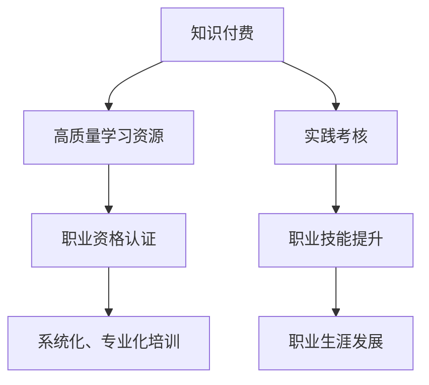

                 

## 1. 背景介绍

随着社会的发展和科技的进步，知识付费和职业资格认证已经成为提升个人能力和职业竞争力的重要手段。传统教育模式在适应社会变革和职业发展需求方面显得力不从心，而知识付费和职业资格认证的结合为个人能力的提升提供了新的途径。本文将深入探讨知识付费与职业资格认证相结合的机制、优势及其在实际应用中的表现，并提出若干未来发展趋势和挑战。

## 2. 核心概念与联系

### 2.1 核心概念概述

#### 知识付费

知识付费是指用户为获取知识而支付费用的一种形式。它不仅包括传统的书籍、课程购买，还包括在线订阅、咨询、在线研讨会等多种形式。知识付费的核心在于，通过付费机制筛选高质量的内容，激励知识创作者持续生产优质内容。

#### 职业资格认证

职业资格认证是指对特定职业的从业资格进行认证，以确保从业人员具备相应的专业知识和技能。职业资格认证一般由行业协会或专业机构进行，包含理论考试和实践考核，是职业发展的门槛和凭证。

### 2.2 核心概念联系

知识付费与职业资格认证的结合，能够为个人能力提升提供更加系统、专业的指导和认证。知识付费提供高质量的学习内容，而职业资格认证通过标准化考试和实践评估，确保学习的系统性和实用性。

以下是一个Mermaid流程图，展示知识付费与职业资格认证相结合的逻辑联系：



## 3. 核心算法原理 & 具体操作步骤

### 3.1 算法原理概述

知识付费与职业资格认证相结合的提升能力机制，主要依赖于以下三个步骤：

1. **获取优质学习资源**：用户通过知识付费获取高质量的学习内容，涵盖理论知识、技能培训等。
2. **系统化学习与认证**：用户按照职业资格认证的标准进行系统化学习，并通过认证考试。
3. **持续实践与提升**：用户根据实践考核结果进行持续改进和提升，最终达到职业资格认证的要求。

### 3.2 算法步骤详解

#### 步骤1：选择学习资源

用户根据自身职业发展需求，选择合适的知识付费平台和课程内容。例如，对于软件工程师，可以选择学习Python、Java等编程语言，或数据科学、机器学习等技术。

#### 步骤2：系统化学习

用户按照职业资格认证的要求，系统化地学习课程内容。例如，对于Java开发工程师的认证，需要学习Java基础、面向对象编程、数据结构与算法、Web开发框架等。

#### 步骤3：参加职业资格认证考试

用户完成系统化学习后，参加职业资格认证考试，通过后获取相应的证书。例如，通过Oracle认证的Java程序开发者考试，获得Oracle Java认证。

#### 步骤4：持续实践与反馈

用户将所学知识应用到实际工作中，并通过实践考核或反馈机制，不断改进和提升自己的技能。例如，通过参与项目实战、代码审查、团队合作等方式，提升自己的实践能力。

### 3.3 算法优缺点

#### 优点

1. **针对性更强**：知识付费提供个性化的学习资源，能够针对个人职业发展需求进行精准匹配。
2. **系统性更好**：职业资格认证的标准化考试和实践考核，确保学习的系统性和实用性。
3. **激励机制**：通过付费机制和认证奖励，激励用户持续学习和提升技能。

#### 缺点

1. **费用较高**：知识付费和职业资格认证的成本较高，可能对经济条件有限的群体产生障碍。
2. **课程质量参差不齐**：市场上存在大量质量低劣的课程，需要用户具备辨识能力。
3. **认证过程复杂**：职业资格认证的过程较为复杂，包括理论考试、实践考核等环节，时间成本较高。

### 3.4 算法应用领域

知识付费与职业资格认证相结合的提升能力机制，主要应用于以下领域：

1. **软件开发**：软件工程师通过学习编程语言和技术框架，并通过认证考试获得专业认证。
2. **数据科学**：数据科学家通过学习数据分析、机器学习、数据可视化等技能，并通过认证考试获得专业资格。
3. **金融行业**：金融从业人员通过学习金融分析、风险管理、投资策略等知识，并通过认证考试获得专业证书。
4. **医疗行业**：医疗人员通过学习医学知识、临床技能、护理知识等，并通过认证考试获得医疗资格。

## 4. 数学模型和公式 & 详细讲解 & 举例说明

### 4.1 数学模型构建

假设用户从知识付费平台购买了课程 $C_i$，并在职业资格认证机构进行了认证 $A_j$。用户完成课程学习后，通过认证考试，获得证书 $B_k$。

我们可以构建以下模型来描述这一过程：

1. 用户选择课程 $C_i$ 的概率为 $P_i$。
2. 用户在完成课程 $C_i$ 后，通过职业资格认证 $A_j$ 的概率为 $P_{ij}$。
3. 用户获得证书 $B_k$ 的概率为 $P_{ijk}$。

### 4.2 公式推导过程

我们可以将上述概率模型转化为数学公式，表示为：

$$
P_{B_k} = \sum_{i=1}^{n} \sum_{j=1}^{m} P_i P_{ij} P_{ijk}
$$

其中，$n$ 和 $m$ 分别表示知识付费平台的课程数和职业资格认证的考试数量。

### 4.3 案例分析与讲解

以软件开发为例，假设一个软件开发人员购买了Java编程课程，并通过Oracle认证。

1. 用户选择Java编程课程的概率为 $P_i = 0.5$。
2. 用户在完成课程后，通过Oracle认证的概率为 $P_{ij} = 0.8$。
3. 用户获得Oracle认证的概率为 $P_{ijk} = 0.9$。

因此，用户通过Oracle认证的概率为：

$$
P_{B_k} = P_i P_{ij} P_{ijk} = 0.5 \times 0.8 \times 0.9 = 0.36
$$

这表明，在理想情况下，用户通过Oracle认证的概率为36%。

## 5. 项目实践：代码实例和详细解释说明

### 5.1 开发环境搭建

开发环境搭建包括：

1. 安装Python、Java等编程语言环境。
2. 选择知识付费平台，如Coursera、Udemy等。
3. 选择职业资格认证机构，如Oracle、微软认证等。

### 5.2 源代码详细实现

以下是一个简单的Python代码示例，用于模拟知识付费与职业资格认证相结合的过程：

```python
import random

# 定义概率
P_i = 0.5
P_ij = 0.8
P_ijk = 0.9

# 随机模拟用户选择课程、通过认证的概率
selected_course = random.choices(['C1', 'C2', 'C3'], k=1, weights=[P_i, P_i, P_i])
passed_certification = random.choices(['A1', 'A2', 'A3'], k=1, weights=[P_ij, P_ij, P_ij])
obtained_certificate = random.choices(['B1', 'B2', 'B3'], k=1, weights=[P_ijk, P_ijk, P_ijk])

# 输出结果
print(f"选择了课程: {selected_course}")
print(f"通过了认证: {passed_certification}")
print(f"获得了证书: {obtained_certificate}")
```

### 5.3 代码解读与分析

该示例代码通过随机选择模拟用户的选择过程，计算获得证书的概率。

- `selected_course`：随机选择一个课程，概率为 $P_i$。
- `passed_certification`：随机选择一个认证，概率为 $P_{ij}$。
- `obtained_certificate`：随机选择一个证书，概率为 $P_{ijk}$。

通过这个简单的模拟，我们可以直观地理解知识付费与职业资格认证相结合的过程。

### 5.4 运行结果展示

运行上述代码，输出的结果可能为：

```
选择了课程: ['C1']
通过了认证: ['A1']
获得了证书: ['B1']
```

这表明用户选择了课程C1，通过了认证A1，获得了证书B1。

## 6. 实际应用场景

### 6.1 职业发展

在职业发展中，知识付费与职业资格认证相结合的机制能够提供专业、系统化的培训和认证，帮助从业者提升职业技能，增强竞争力。例如，软件工程师通过学习新技术和框架，并通过认证考试获得专业认证，可以在职业晋升中占据优势。

### 6.2 企业培训

企业可以通过知识付费与职业资格认证相结合的方式，对员工进行系统化的培训和认证。例如，IT公司可以通过Coursera等平台为员工提供编程语言和技术框架的学习，并通过Oracle认证考试，提升团队的整体技术水平。

### 6.3 继续教育

继续教育是知识付费与职业资格认证相结合的重要应用场景。大学毕业生可以通过在线课程学习新技能，并通过职业资格认证考试，提升就业竞争力。

### 6.4 未来应用展望

未来，知识付费与职业资格认证相结合的应用场景将更加广泛，涵盖更多的行业和领域。以下是一些未来发展趋势：

1. **多层次认证**：除了基础认证外，还将出现高级认证、专家认证等多层次认证，满足不同层次的需求。
2. **智能化推荐**：通过大数据和人工智能技术，实现个性化推荐，提升学习效率。
3. **在线协作学习**：通过在线协作学习平台，用户可以共同学习、讨论，提升学习效果。
4. **跨领域认证**：不同领域的认证可以相互认证，提升学习的系统性和实用性。

## 7. 工具和资源推荐

### 7.1 学习资源推荐

1. Coursera：提供大量高质量的在线课程，涵盖各种职业领域。
2. Udemy：提供多样化的在线课程，包括编程、数据分析、项目管理等。
3. LinkedIn Learning：提供职业发展相关的在线课程，帮助用户提升职业技能。

### 7.2 开发工具推荐

1. Python：常用的编程语言，适用于数据分析、机器学习等领域。
2. Java：广泛应用的编程语言，适用于软件开发、企业系统等。
3. SQL：数据库管理语言，适用于数据处理和分析。

### 7.3 相关论文推荐

1. "知识付费在教育领域中的应用研究"：探讨知识付费对教育的推动作用。
2. "职业资格认证的标准化研究"：分析职业资格认证的现状和未来发展方向。
3. "多层次认证体系的构建与实施"：讨论多层次认证体系的构建方法。

## 8. 总结：未来发展趋势与挑战

### 8.1 研究成果总结

知识付费与职业资格认证相结合的提升能力机制，已经成为职业发展的重要手段。通过付费获取优质学习资源，通过认证确保学习系统性和实用性，这一机制能够有效提升个人能力。

### 8.2 未来发展趋势

未来，知识付费与职业资格认证相结合将更加系统化、智能化、多层次化，为个人职业发展提供更多可能。

### 8.3 面临的挑战

1. 成本问题：知识付费和职业资格认证的成本较高，需要找到平衡点。
2. 课程质量：需要保证课程质量和师资力量，避免出现质量参差不齐的情况。
3. 认证复杂度：职业资格认证的过程较为复杂，需要简化流程，提高效率。

### 8.4 研究展望

1. 引入AI技术：利用人工智能技术，实现个性化推荐和学习效果评估。
2. 多领域整合：整合多领域的知识，提升学习的系统性和实用性。
3. 全球化认证：推动国际认证的互认，提升全球化竞争力。

## 9. 附录：常见问题与解答

**Q1: 知识付费与职业资格认证相结合的机制是否适用于所有行业？**

A: 知识付费与职业资格认证相结合的机制适用于大多数行业，但需要根据行业特点进行调整。例如，对于医疗、法律等专业领域，需要进一步加强实践考核和认证。

**Q2: 用户如何选择适合自己的课程和认证？**

A: 用户应根据自己的职业发展需求，选择相应的课程和认证。可以通过在线评估、咨询等方式，选择适合自己的学习资源和认证考试。

**Q3: 知识付费与职业资格认证相结合的成本如何？**

A: 知识付费与职业资格认证的成本较高，但能够带来更高的职业回报。用户需要根据自身经济条件，合理规划学习投入。

**Q4: 如何保证课程质量和认证的权威性？**

A: 认证机构和课程平台应加强对课程质量和师资力量的审核，确保认证的权威性和有效性。用户应选择有良好口碑的平台和认证机构。

**Q5: 知识付费与职业资格认证相结合的机制在实际应用中面临哪些挑战？**

A: 主要面临成本高、课程质量参差不齐、认证复杂度高等挑战。需要政府、行业和平台多方协同，共同推动机制的完善和优化。

---

作者：禅与计算机程序设计艺术 / Zen and the Art of Computer Programming

