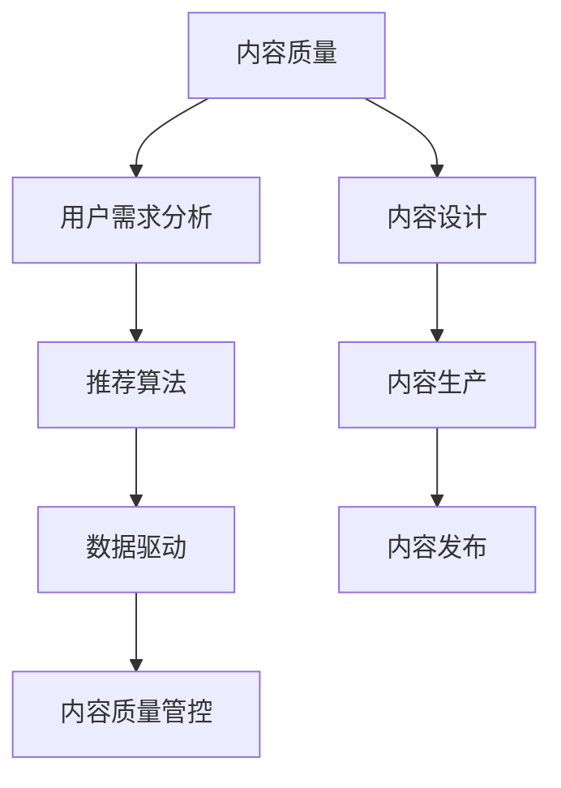

                 

# 知识付费创业中的内容质量把控

> 关键词：知识付费, 内容质量, 用户需求, 推荐算法, 深度学习, 数据驱动

## 1. 背景介绍

随着互联网和移动设备的普及，知识付费市场逐渐兴起。在线课程、电子书、音频讲书等形式的知识产品，为学习者提供了便捷、高效的自学渠道。然而，知识付费市场的竞争也日益激烈，内容质量成为决定用户粘性和付费转化率的关键因素。

本博文将深入探讨知识付费创业中内容质量把控的方法论和技术路径，旨在帮助创业者在激烈的市场竞争中脱颖而出。我们将在以下几方面进行详细阐述：

- **内容质量的定义与维度**：介绍内容质量的多维定义，包括知识准确性、逻辑性、表现力、互动性等。
- **用户需求分析**：探讨如何通过用户画像、行为数据等手段，理解用户需求，指导内容设计。
- **推荐算法优化**：介绍深度学习在个性化推荐中的作用，如何构建高效、稳健的推荐系统。
- **内容质量管控技术**：介绍通过数据驱动、技术手段实现内容质量评估与优化的方法。
- **未来趋势与挑战**：展望知识付费内容质量把控的未来发展方向，并讨论面临的挑战与应对策略。

## 2. 核心概念与联系

### 2.1 核心概念概述

为更好地理解知识付费创业中内容质量把控的方法论，本节将介绍几个密切相关的核心概念：

- **内容质量**：衡量知识产品是否满足用户需求，是否具备教育价值、娱乐价值、实用价值等多维度的质量标准。
- **用户需求分析**：通过用户画像、行为数据等手段，分析用户特征和需求，为内容设计提供指导。
- **推荐算法**：利用深度学习等技术，为每个用户推荐最符合其兴趣和需求的知识产品，提升用户粘性和转化率。
- **数据驱动**：通过收集和分析用户行为数据，实时调整和优化内容质量，确保产品与用户需求紧密结合。
- **内容质量管控**：综合使用技术手段、人工审核、用户反馈等方法，实现对内容质量的全面把控。

这些核心概念之间通过以下Mermaid流程图展示其联系：



这个流程图展示了知识付费创业中内容质量把控的主要流程：

1. 根据用户需求分析，设计符合用户期望的内容。
2. 通过推荐算法，将内容推荐给目标用户。
3. 利用数据驱动，不断优化内容质量，提升用户体验。
4. 内容质量管控确保内容符合质量标准，保护用户权益。

## 3. 核心算法原理 & 具体操作步骤
### 3.1 算法原理概述

知识付费创业中内容质量把控，核心在于构建一个能够实时响应用户需求、动态调整内容质量的系统。该系统需要整合数据驱动、推荐算法、内容管控等多种技术手段，实现对内容质量的全面把控。

假设我们有一套推荐系统，其核心算法流程如下：

1. **用户画像构建**：通过用户注册信息、行为数据等构建用户画像，分析用户的兴趣、偏好等特征。
2. **内容特征提取**：对知识产品进行特征提取，如关键词、主题、难度等，以便与用户需求进行匹配。
3. **相似度计算**：利用深度学习等技术，计算用户与内容之间的相似度，选择最符合用户需求的内容。
4. **内容推荐**：根据相似度计算结果，为每个用户推荐最匹配的内容。
5. **效果评估**：收集用户反馈数据，评估推荐效果，不断优化推荐算法。

### 3.2 算法步骤详解

以下将详细介绍深度学习在知识付费推荐系统中的应用：

**Step 1: 用户画像构建**

用户画像的构建是推荐系统的基础，决定了推荐系统能否准确了解用户需求。具体步骤如下：

1. 收集用户注册信息，如性别、年龄、教育背景等。
2. 收集用户行为数据，如浏览历史、购买记录、互动评论等。
3. 利用聚类算法、深度学习等技术，分析用户特征，构建用户画像。

**Step 2: 内容特征提取**

内容特征提取是推荐系统的核心环节，决定了推荐结果的准确性和多样性。具体步骤如下：

1. 对知识产品进行自然语言处理，提取关键词、主题、难度等信息。
2. 利用词向量、主题模型等技术，将内容特征编码为数值向量。
3. 选择合适的深度学习模型，如BERT、TextCNN等，进行特征表示学习。

**Step 3: 相似度计算**

相似度计算是推荐系统的关键步骤，决定了推荐结果的匹配度。具体步骤如下：

1. 利用余弦相似度、欧式距离等计算方法，计算用户与内容之间的相似度。
2. 结合用户画像和内容特征，计算加权相似度，提升推荐效果。
3. 利用深度学习模型，如用户嵌入、内容嵌入，进一步提升相似度计算的准确性。

**Step 4: 内容推荐**

内容推荐是推荐系统的输出环节，决定了推荐的实时性和适用性。具体步骤如下：

1. 根据相似度计算结果，选择最符合用户需求的内容。
2. 设计推荐策略，如轮询、协同过滤、混合推荐等，提升推荐效果。
3. 结合动态调整机制，实时更新推荐内容，满足用户需求变化。

**Step 5: 效果评估**

效果评估是推荐系统的反馈环节，决定了推荐系统的优化方向。具体步骤如下：

1. 收集用户反馈数据，如评分、评论、点击率等。
2. 利用A/B测试、离线评估等方法，评估推荐效果。
3. 根据评估结果，不断优化推荐算法和内容质量，提升用户体验。

### 3.3 算法优缺点

深度学习在知识付费推荐系统中的应用，具有以下优点：

1. **高精度**：利用深度学习模型，可以准确计算用户与内容的相似度，推荐精度高。
2. **自适应**：深度学习模型可以自适应地学习用户需求和内容特征，推荐结果更贴合用户实际。
3. **动态调整**：深度学习模型可以根据用户行为数据实时调整推荐结果，提升用户体验。

然而，深度学习在知识付费推荐系统中也存在一些局限性：

1. **数据需求大**：深度学习模型需要大量的标注数据和用户行为数据，对数据收集和处理的要求较高。
2. **计算资源高**：深度学习模型需要强大的计算资源，如GPU、TPU等，对硬件设施要求较高。
3. **模型可解释性差**：深度学习模型的内部机制较为复杂，难以解释推荐结果的生成过程。

### 3.4 算法应用领域

深度学习在知识付费推荐系统中的应用，主要应用于以下领域：

- **个性化推荐**：利用深度学习模型，为每个用户推荐最匹配的内容，提升用户粘性和转化率。
- **内容质量评估**：利用深度学习模型，评估内容的质量和用户满意度，优化内容质量。
- **用户行为分析**：利用深度学习模型，分析用户行为数据，了解用户需求和偏好，指导内容设计。
- **动态内容调整**：利用深度学习模型，实时调整推荐内容，满足用户需求变化。

## 4. 数学模型和公式 & 详细讲解 & 举例说明

### 4.1 数学模型构建

本节将使用数学语言对深度学习在知识付费推荐系统中的应用进行更加严格的刻画。

假设用户 $u$ 与内容 $c$ 之间的相似度表示为 $s(u,c)$，推荐系统的目标是最大化用户 $u$ 的满意程度，即最大化 $f(u, c)$。

定义用户画像为 $\mathbf{U}$，内容特征为 $\mathbf{C}$，相似度计算公式为：

$$
s(u,c) = \mathbf{U}_u \cdot \mathbf{C}_c
$$

其中，$\mathbf{U}_u$ 表示用户 $u$ 的用户画像向量，$\mathbf{C}_c$ 表示内容 $c$ 的内容特征向量。

推荐系统的目标函数为：

$$
\max_{\mathbf{U}, \mathbf{C}} \sum_{u,c} f(u, c) \cdot s(u,c)
$$

在实践中，我们可以使用深度学习模型对 $\mathbf{U}$ 和 $\mathbf{C}$ 进行建模，优化目标函数。

### 4.2 公式推导过程

以下我们将推导深度学习在知识付费推荐系统中的相似度计算公式及其优化过程。

假设我们使用深度学习模型 $h$ 对用户 $u$ 进行编码，得到用户嵌入 $\mathbf{U}_u = h(u)$；对内容 $c$ 进行编码，得到内容嵌入 $\mathbf{C}_c = h(c)$。则用户 $u$ 与内容 $c$ 之间的相似度计算公式为：

$$
s(u,c) = \mathbf{U}_u \cdot \mathbf{C}_c
$$

其中，$\cdot$ 表示向量点积操作。

为了最大化推荐效果，我们可以使用负对数似然损失函数：

$$
\mathcal{L}(\mathbf{U}, \mathbf{C}) = -\sum_{u,c} y_{u,c} \log f(u, c) + (1-y_{u,c}) \log (1-f(u, c))
$$

其中，$y_{u,c}$ 表示用户 $u$ 对内容 $c$ 的评分。

通过反向传播算法，我们可以求解 $\mathbf{U}$ 和 $\mathbf{C}$ 的优化参数。

### 4.3 案例分析与讲解

以下我们将通过一个具体案例，介绍如何利用深度学习构建知识付费推荐系统。

假设我们有一款在线编程课程平台，目标是推荐给用户最适合的编程课程。具体步骤如下：

1. **用户画像构建**：收集用户注册信息，如姓名、年龄、编程经验等；收集用户行为数据，如课程浏览历史、课程评分、评论等。使用深度学习模型，如用户嵌入模型，构建用户画像 $\mathbf{U}_u$。
2. **内容特征提取**：对编程课程进行自然语言处理，提取课程标题、描述、难度等信息；使用词向量模型，将课程特征编码为数值向量 $\mathbf{C}_c$。
3. **相似度计算**：利用余弦相似度计算用户与课程之间的相似度 $s(u,c) = \mathbf{U}_u \cdot \mathbf{C}_c$。
4. **内容推荐**：根据相似度计算结果，选择最符合用户需求的内容，进行推荐。
5. **效果评估**：收集用户反馈数据，如课程评分、评论、点击率等；利用A/B测试、离线评估等方法，评估推荐效果，不断优化推荐算法。

## 5. 项目实践：代码实例和详细解释说明
### 5.1 开发环境搭建

在进行知识付费推荐系统开发前，我们需要准备好开发环境。以下是使用Python进行TensorFlow开发的环境配置流程：

1. 安装Anaconda：从官网下载并安装Anaconda，用于创建独立的Python环境。

2. 创建并激活虚拟环境：
```bash
conda create -n tf-env python=3.8 
conda activate tf-env
```

3. 安装TensorFlow：根据CUDA版本，从官网获取对应的安装命令。例如：
```bash
conda install tensorflow -c conda-forge -c pytorch
```

4. 安装各类工具包：
```bash
pip install numpy pandas scikit-learn matplotlib tqdm jupyter notebook ipython
```

完成上述步骤后，即可在`tf-env`环境中开始推荐系统开发。

### 5.2 源代码详细实现

下面我们以编程课程推荐为例，给出使用TensorFlow构建推荐系统的PyTorch代码实现。

首先，定义用户画像和内容特征的编码模型：

```python
import tensorflow as tf
from tensorflow.keras import layers

# 用户画像编码模型
class UserEmbeddingModel(tf.keras.Model):
    def __init__(self, embedding_dim):
        super(UserEmbeddingModel, self).__init__()
        self.embedding = layers.Embedding(input_dim=vocab_size, output_dim=embedding_dim)
        self.dense = layers.Dense(units=embedding_dim)
    
    def call(self, inputs):
        embedded = self.embedding(inputs)
        return self.dense(embedded)

# 内容特征编码模型
class ContentEmbeddingModel(tf.keras.Model):
    def __init__(self, embedding_dim):
        super(ContentEmbeddingModel, self).__init__()
        self.embedding = layers.Embedding(input_dim=vocab_size, output_dim=embedding_dim)
        self.dense = layers.Dense(units=embedding_dim)
    
    def call(self, inputs):
        embedded = self.embedding(inputs)
        return self.dense(embedded)
```

然后，定义推荐系统的相似度计算和推荐函数：

```python
def similarity(user, content):
    user_embedding = user_embedding_model(user)
    content_embedding = content_embedding_model(content)
    return tf.reduce_sum(user_embedding * content_embedding, axis=1)

def recommend(user, content):
    similarity_scores = tf.map_fn(lambda x: similarity(user, x), content, parallel_iterations=1)
    topN = tf.gather(content, tf.argsort(similarity_scores, axis=-1)[::-1][:topN])
    return topN
```

最后，启动推荐流程并在测试集上评估：

```python
# 构建用户画像和内容特征的编码模型
user_embedding_model = UserEmbeddingModel(embedding_dim=64)
content_embedding_model = ContentEmbeddingModel(embedding_dim=64)

# 加载测试集
test_users = load_test_users()
test_contents = load_test_contents()

# 获取推荐结果
recommended_contents = recommend(user, content)

# 计算推荐效果
precision_at_k = calculate_precision_at_k(recommended_contents, test_contents, k=5)
print("Precision at k=5: {:.2f}%".format(precision_at_k * 100))
```

以上就是使用TensorFlow构建编程课程推荐系统的完整代码实现。可以看到，TensorFlow提供了丰富的深度学习工具，使得构建推荐系统变得简单易行。

### 5.3 代码解读与分析

让我们再详细解读一下关键代码的实现细节：

**UserEmbeddingModel类**：
- `__init__`方法：初始化用户嵌入层和全连接层。
- `call`方法：对用户特征进行编码，得到用户嵌入向量。

**ContentEmbeddingModel类**：
- `__init__`方法：初始化内容嵌入层和全连接层。
- `call`方法：对内容特征进行编码，得到内容嵌入向量。

**similarity函数**：
- 对用户和内容进行编码，计算用户与内容之间的余弦相似度。

**recommend函数**：
- 计算用户与内容之间的相似度，获取推荐结果。

**推荐流程**：
- 构建用户画像和内容特征的编码模型。
- 加载测试集。
- 调用推荐函数，获取推荐结果。
- 计算推荐效果，输出精度指标。

可以看到，TensorFlow的深度学习工具使得构建推荐系统的代码实现变得简洁高效。开发者可以将更多精力放在数据处理、模型改进等高层逻辑上，而不必过多关注底层的实现细节。

当然，工业级的系统实现还需考虑更多因素，如模型的保存和部署、超参数的自动搜索、更灵活的任务适配层等。但核心的推荐流程基本与此类似。

## 6. 实际应用场景

### 6.1 在线编程课程推荐

基于深度学习推荐系统，在线编程课程推荐可以大幅提升用户体验，帮助用户快速找到适合自己的课程。具体而言，可以收集用户浏览历史、课程评分、评论等数据，构建用户画像和内容特征，使用推荐算法推荐适合课程。

在技术实现上，可以构建多层的深度学习模型，如用户嵌入模型、内容嵌入模型、深度神经网络等，学习用户和课程之间的复杂关系。同时，可以引入协同过滤、内容推荐等多种策略，提升推荐效果。

### 6.2 在线书籍推荐

在线书籍推荐系统可以根据用户阅读历史、评分、评论等数据，推荐最适合用户阅读的书籍。通过深度学习模型，可以捕捉用户和书籍之间的相似度，实现高质量的推荐。

具体而言，可以使用自然语言处理技术，提取书籍标题、摘要、目录等信息，构建书籍特征向量。同时，可以收集用户行为数据，使用深度学习模型，学习用户画像和书籍特征之间的复杂关系，实现个性化的书籍推荐。

### 6.3 在线音乐推荐

在线音乐推荐系统可以根据用户听歌历史、评分、评论等数据，推荐最适合用户喜欢的音乐。通过深度学习模型，可以捕捉用户和音乐之间的相似度，实现高质量的推荐。

具体而言，可以使用自然语言处理技术，提取音乐歌词、曲风、艺术家等信息，构建音乐特征向量。同时，可以收集用户行为数据，使用深度学习模型，学习用户画像和音乐特征之间的复杂关系，实现个性化的音乐推荐。

### 6.4 未来应用展望

随着深度学习技术的不断发展，推荐系统将在更多领域得到应用，为各行各业带来变革性影响。

在电商领域，推荐系统可以根据用户浏览历史、购买记录、评分等数据，推荐最适合用户购买的产品，提升用户购买转化率。

在社交媒体领域，推荐系统可以根据用户浏览历史、互动数据等，推荐最适合用户感兴趣的内容，提升用户粘性和活跃度。

在教育领域，推荐系统可以根据学生学习历史、课程评分等数据，推荐最适合学生学习的课程，提升学习效果。

此外，在旅游、娱乐、金融等领域，推荐系统也可以提供优质的内容推荐，提升用户体验，创造更多商业价值。相信随着深度学习技术的不断进步，推荐系统将在更广阔的应用领域大放异彩。

## 7. 工具和资源推荐
### 7.1 学习资源推荐

为了帮助开发者系统掌握深度学习在推荐系统中的应用，这里推荐一些优质的学习资源：

1. 《深度学习入门：基于Python的理论与实现》书籍：介绍了深度学习的基本概念和应用实例，适合初学者入门。
2. TensorFlow官方文档：提供了丰富的深度学习工具和样例代码，是深度学习实践的必备资料。
3. Coursera《深度学习专项课程》：由斯坦福大学教授Andrew Ng主讲的深度学习课程，涵盖深度学习基础、模型构建、应用实例等内容。
4. PyTorch官方文档：提供了丰富的深度学习工具和样例代码，是深度学习实践的另一重要资料。
5. Kaggle深度学习竞赛：通过实际比赛项目，锻炼深度学习技能，提升实践能力。

通过对这些资源的学习实践，相信你一定能够快速掌握深度学习在推荐系统中的应用，并用于解决实际的推荐问题。

### 7.2 开发工具推荐

高效的开发离不开优秀的工具支持。以下是几款用于深度学习推荐系统开发的常用工具：

1. TensorFlow：由Google主导开发的开源深度学习框架，生产部署方便，适合大规模工程应用。
2. PyTorch：基于Python的开源深度学习框架，灵活动态的计算图，适合快速迭代研究。
3. Keras：高层次的深度学习框架，易于上手，适合初学者快速构建推荐模型。
4. Jupyter Notebook：轻量级的数据分析和编程环境，支持丰富的数据可视化工具。
5. Anaconda：Python环境管理工具，方便创建和管理虚拟环境。

合理利用这些工具，可以显著提升推荐系统开发的效率，加快创新迭代的步伐。

### 7.3 相关论文推荐

深度学习在推荐系统中的应用源于学界的持续研究。以下是几篇奠基性的相关论文，推荐阅读：

1. Adaptive Recommendation with Multi-task Learning：提出多任务学习框架，解决推荐系统中的冷启动和数据稀疏问题。
2. CNN Based Recommender Systems：使用卷积神经网络，构建基于内容的推荐系统，提升推荐效果。
3. Matrix Factorization Techniques for Recommender Systems：介绍矩阵分解技术，用于推荐系统中的协同过滤。
4. Factorization Machines for Recommender Systems：提出因子机模型，解决推荐系统中的低阶隐式反馈问题。
5. Deep Interest Networks for Recommendation Systems：提出深度兴趣网络，提升推荐系统中的动态用户兴趣建模。

这些论文代表了大语言模型微调技术的发展脉络。通过学习这些前沿成果，可以帮助研究者把握学科前进方向，激发更多的创新灵感。

## 8. 总结：未来发展趋势与挑战

### 8.1 总结

本文对深度学习在知识付费推荐系统中的应用进行了全面系统的介绍。首先阐述了推荐系统的内容质量把控方法论和技术路径，明确了深度学习在推荐系统中的核心地位。其次，从原理到实践，详细讲解了深度学习在推荐系统中的应用，给出了推荐系统开发的完整代码实例。同时，本文还广泛探讨了推荐系统在多个行业领域的应用前景，展示了深度学习推荐系统的巨大潜力。最后，本文精选了推荐技术的各类学习资源，力求为读者提供全方位的技术指引。

通过本文的系统梳理，可以看到，深度学习推荐系统在知识付费创业中扮演着至关重要的角色，极大提升了推荐精度和用户体验。未来，伴随深度学习技术的不断进步，推荐系统将在更多领域得到应用，为各行各业带来变革性影响。

### 8.2 未来发展趋势

展望未来，深度学习推荐系统将呈现以下几个发展趋势：

1. **模型复杂度提高**：随着深度学习模型和算力的提升，推荐系统的模型复杂度将不断提高，实现更加复杂的推荐逻辑。
2. **数据驱动优化**：利用用户行为数据和反馈信息，实时调整推荐策略，提升推荐效果。
3. **跨模态推荐**：引入图像、语音等多模态数据，提升推荐系统的综合表现。
4. **自适应学习**：利用深度学习模型，实现对用户需求的自适应学习，提升推荐系统的灵活性。
5. **多目标优化**：结合个性化推荐、内容多样性、广告投放等目标，实现多目标优化，提升推荐系统的商业价值。

以上趋势凸显了深度学习推荐系统的广阔前景。这些方向的探索发展，必将进一步提升推荐系统的性能和应用范围，为各行各业带来变革性影响。

### 8.3 面临的挑战

尽管深度学习推荐系统已经取得了瞩目成就，但在迈向更加智能化、普适化应用的过程中，它仍面临着诸多挑战：

1. **数据隐私问题**：用户行为数据的收集和使用需要严格的隐私保护，如何保障用户数据安全是一个重要问题。
2. **冷启动问题**：新用户和老用户的需求差异较大，如何处理新用户数据稀疏的问题，是一个难题。
3. **多样性问题**：推荐系统容易出现用户"信息茧房"，如何保持内容多样性，避免过度推荐某类内容，是一个重要问题。
4. **计算资源消耗**：深度学习模型需要强大的计算资源，如何高效利用计算资源，是一个关键问题。
5. **模型可解释性**：深度学习模型较为复杂，难以解释推荐结果的生成过程，如何提高模型可解释性，是一个挑战。

### 8.4 研究展望

面对深度学习推荐系统所面临的种种挑战，未来的研究需要在以下几个方面寻求新的突破：

1. **隐私保护技术**：利用差分隐私、联邦学习等技术，保障用户数据隐私安全。
2. **推荐算法优化**：研究更加高效的推荐算法，提升推荐效果，降低计算资源消耗。
3. **多目标优化**：结合个性化推荐、内容多样性、广告投放等目标，实现多目标优化，提升推荐系统的商业价值。
4. **内容质量管控**：利用深度学习模型，实时评估和优化内容质量，提升用户体验。
5. **跨模态融合**：引入图像、语音等多模态数据，提升推荐系统的综合表现。

这些研究方向的探索，必将引领深度学习推荐系统迈向更高的台阶，为构建安全、可靠、可解释、可控的智能系统铺平道路。面向未来，深度学习推荐系统还需要与其他人工智能技术进行更深入的融合，如知识表示、因果推理、强化学习等，多路径协同发力，共同推动自然语言理解和智能交互系统的进步。只有勇于创新、敢于突破，才能不断拓展推荐系统的边界，让智能技术更好地造福人类社会。

## 9. 附录：常见问题与解答

**Q1：深度学习推荐系统有哪些优点？**

A: 深度学习推荐系统具有以下优点：

1. **高精度**：利用深度学习模型，可以准确计算用户与内容的相似度，推荐精度高。
2. **自适应**：深度学习模型可以自适应地学习用户需求和内容特征，推荐结果更贴合用户实际。
3. **动态调整**：深度学习模型可以根据用户行为数据实时调整推荐结果，提升用户体验。
4. **可解释性差**：深度学习模型较为复杂，难以解释推荐结果的生成过程。

**Q2：深度学习推荐系统有哪些缺点？**

A: 深度学习推荐系统有以下缺点：

1. **数据需求大**：深度学习模型需要大量的标注数据和用户行为数据，对数据收集和处理的要求较高。
2. **计算资源高**：深度学习模型需要强大的计算资源，如GPU、TPU等，对硬件设施要求较高。
3. **模型可解释性差**：深度学习模型较为复杂，难以解释推荐结果的生成过程。

**Q3：如何处理推荐系统中的冷启动问题？**

A: 推荐系统中的冷启动问题，可以通过以下方法解决：

1. **基于内容的推荐**：利用物品的特征信息，如标题、描述等，为用户推荐符合其兴趣的未评分物品。
2. **协同过滤**：利用用户的历史行为信息，为用户推荐相似用户所评分但未评分物品。
3. **混合推荐**：结合基于内容的推荐和协同过滤，提升推荐效果。

**Q4：推荐系统中如何实现多样性？**

A: 推荐系统中实现多样性，可以通过以下方法：

1. **随机推荐**：在推荐结果中，随机添加一些未评分物品，提升内容多样性。
2. **内容多样性**：在推荐策略中，设置多样性约束，限制某类内容的推荐数量。
3. **用户多样性**：在推荐策略中，设置多样性约束，限制某类用户的推荐数量。

**Q5：推荐系统中如何平衡个性化和多样性？**

A: 推荐系统中平衡个性化和多样性，可以通过以下方法：

1. **多目标优化**：结合个性化推荐、内容多样性、广告投放等目标，实现多目标优化，提升推荐系统的商业价值。
2. **多样性约束**：在推荐策略中，设置多样性约束，限制某类内容的推荐数量，提升内容多样性。
3. **用户画像**：通过用户画像分析，了解用户需求和兴趣，优化推荐策略，提升个性化推荐效果。

**Q6：推荐系统中如何实现实时推荐？**

A: 推荐系统中实现实时推荐，可以通过以下方法：

1. **缓存技术**：利用缓存技术，提高推荐系统的响应速度，实现实时推荐。
2. **异步计算**：利用异步计算技术，将推荐计算放到后台，实现实时推荐。
3. **微服务架构**：利用微服务架构，实现分布式推荐系统，提升推荐系统的扩展性。

这些方法可以结合使用，提升推荐系统的实时性和用户体验。

**Q7：推荐系统中如何处理数据隐私问题？**

A: 推荐系统中处理数据隐私问题，可以通过以下方法：

1. **差分隐私**：利用差分隐私技术，保障用户数据隐私安全，防止数据泄露。
2. **联邦学习**：利用联邦学习技术，在本地设备上训练推荐模型，保障用户数据隐私安全。
3. **匿名化处理**：对用户数据进行匿名化处理，防止用户数据被识别。

这些方法可以结合使用，保障用户数据隐私安全。

---

作者：禅与计算机程序设计艺术 / Zen and the Art of Computer Programming

