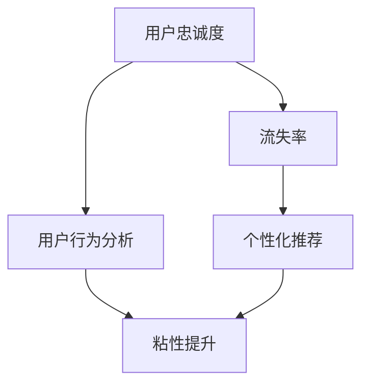

                 

## 1. 背景介绍

随着互联网技术的发展，知识付费逐渐成为了一种新的经济模式，吸引了大量用户的关注和参与。然而，知识付费平台面临着用户流失率高、粘性差等问题。因此，如何提升用户忠诚度，留住更多优质用户，成为平台运营的关键所在。

本文将围绕知识付费创业中的用户忠诚度培养问题，从核心概念、算法原理、操作步骤等多个角度进行全面探讨，并结合项目实践和实际应用场景给出解决方案，帮助创业者和运营人员系统掌握用户忠诚度培养的技术手段和方法论。

## 2. 核心概念与联系

### 2.1 核心概念概述

为更好理解用户忠诚度培养问题，我们先从几个关键核心概念入手：

- **用户忠诚度**：用户对某一产品或服务长期持续的偏好和依赖，愿意为其付费并推荐给其他人。
- **流失率**：一段时间内流失用户数与总用户数的比例，是衡量用户保留率的重要指标。
- **粘性**：用户使用产品的频率和时长，高粘性意味着用户对产品有较高的依赖度。
- **个性化推荐**：根据用户行为和兴趣，提供定制化内容和服务，提升用户体验和满意度。
- **用户行为分析**：通过数据分析，理解用户行为模式，发现用户需求，提升产品体验和运营效果。

这些概念相互联系，共同构成用户忠诚度培养的框架。通过提升用户的忠诚度和粘性，可以显著降低流失率，增加产品收益和口碑效应。

### 2.2 核心概念原理和架构的 Mermaid 流程图



### 2.3 关键节点解释

- **A 节点**：用户忠诚度是最终目标，涉及到心理、行为和经济等多个方面。
- **B 节点**：流失率是衡量用户忠诚度的重要指标，需要采取有效措施降低。
- **C 节点**：个性化推荐是提升用户忠诚度和粘性的重要手段，通过定制化内容满足用户需求。
- **D 节点**：用户行为分析是理解用户需求和行为模式的关键，提供个性化推荐的基础。
- **E 节点**：粘性提升是通过优化产品体验、增强用户依赖度来实现的。

## 3. 核心算法原理 & 具体操作步骤

### 3.1 算法原理概述

用户忠诚度培养的核心算法基于机器学习、数据挖掘和行为分析技术，通过量化用户行为特征和偏好，预测用户流失风险，并采取针对性措施进行挽回。具体算法流程如下：

1. **用户行为数据收集**：收集用户在平台上的所有行为数据，如浏览、购买、评价、互动等。
2. **特征工程**：将用户行为数据进行特征提取，生成用户画像，包括兴趣、需求、行为模式等。
3. **用户流失预测**：构建用户流失预测模型，通过特征分析预测用户流失概率。
4. **个性化推荐**：根据用户画像和行为特征，提供个性化推荐内容，提升用户粘性和满意度。
5. **用户行为干预**：根据用户行为数据分析结果，采取干预措施，如定期推送内容、用户关怀等。

### 3.2 算法步骤详解

#### 3.2.1 用户行为数据收集

- **数据来源**：日志文件、点击流、行为分析工具等。
- **数据类型**：点击次数、浏览时间、购买金额、评价内容等。

#### 3.2.2 特征工程

- **特征提取**：使用TF-IDF、词频统计、时间序列分析等技术提取特征。
- **特征选择**：通过相关性分析和模型选择方法（如Lasso、Ridge等）进行特征选择，减少噪声和冗余。
- **用户画像构建**：将用户特征进行聚类分析，生成用户画像。

#### 3.2.3 用户流失预测

- **模型选择**：采用逻辑回归、决策树、随机森林、XGBoost等算法构建预测模型。
- **数据划分**：将数据划分为训练集和测试集，进行模型训练和验证。
- **模型评估**：使用准确率、召回率、F1分数等指标评估模型效果。

#### 3.2.4 个性化推荐

- **推荐系统架构**：采用协同过滤、内容推荐、混合推荐等架构。
- **推荐算法**：基于用户行为的历史数据，使用协同过滤、基于内容的推荐、深度学习等算法进行推荐。
- **推荐效果评估**：通过用户点击率、停留时间、转换率等指标评估推荐效果。

#### 3.2.5 用户行为干预

- **干预措施**：定期推送内容、个性推荐、用户关怀等。
- **效果监测**：通过用户反馈、行为变化等指标监测干预效果，调整优化策略。

### 3.3 算法优缺点

#### 3.3.1 优点

- **提升用户粘性**：通过个性化推荐和行为干预，提升用户对平台的依赖度。
- **降低流失率**：通过流失预测和干预，减少用户流失，提升平台收益。
- **提升用户满意度**：根据用户行为数据分析，提供更符合用户需求的内容和服务。

#### 3.3.2 缺点

- **数据隐私问题**：用户行为数据的收集和分析可能涉及到用户隐私，需合规处理。
- **模型复杂度**：算法涉及多维数据特征和复杂模型，实现难度较大。
- **实时性问题**：算法需要实时处理大量数据，对系统架构和性能要求较高。

### 3.4 算法应用领域

基于机器学习和数据分析的用户忠诚度培养算法，已经在知识付费平台、在线教育、电商等多个领域得到了广泛应用。这些算法通过量化用户行为和兴趣，构建个性化推荐系统，帮助企业提升用户忠诚度和粘性，降低流失率，增加收益。

## 4. 数学模型和公式 & 详细讲解

### 4.1 数学模型构建

用户忠诚度培养的核心算法可以建模为以下形式：

- **用户行为数据集**：$D=\{(x_i,y_i)\}_{i=1}^N$，其中 $x_i$ 为用户行为特征，$y_i$ 为是否流失标签。
- **损失函数**：$\mathcal{L}(\theta)=\frac{1}{N}\sum_{i=1}^N L(y_i,f_\theta(x_i))$，其中 $L$ 为损失函数，$f_\theta(x)$ 为用户流失预测模型。
- **优化目标**：$\min_\theta \mathcal{L}(\theta)$，通过优化模型参数 $\theta$，提升预测准确率。

### 4.2 公式推导过程

以逻辑回归模型为例，推导用户流失预测的损失函数：

- **预测函数**：$f_\theta(x)=\frac{1}{1+e^{-\theta^T x}}$。
- **损失函数**：$L(y,f_\theta(x))=-y\log f_\theta(x)-(1-y)\log(1-f_\theta(x))$。
- **平均损失函数**：$\mathcal{L}(\theta)=\frac{1}{N}\sum_{i=1}^N L(y_i,f_\theta(x_i))$。

### 4.3 案例分析与讲解

以某在线教育平台的用户流失预测为例：

- **数据集准备**：收集用户在平台上的浏览记录、购买记录、评价内容等数据。
- **特征工程**：使用词频统计、TF-IDF等方法提取特征，构建用户画像。
- **模型训练**：使用逻辑回归模型训练用户流失预测模型，并在测试集上验证效果。
- **推荐系统**：根据用户画像和历史行为，使用协同过滤算法推荐课程内容，提升用户粘性。
- **行为干预**：根据流失预测结果，对高流失风险用户进行定期推送课程优惠，提高用户留存率。

## 5. 项目实践：代码实例和详细解释说明

### 5.1 开发环境搭建

- **Python环境配置**：安装Python 3.8及以上版本，配置pip和virtualenv环境。
- **推荐系统框架**：安装TensorFlow、Scikit-learn、Numpy等推荐系统所需库。
- **数据准备**：准备平台用户行为数据集，包括日志文件、点击流等。

### 5.2 源代码详细实现

以下是使用Python实现的基于逻辑回归的用户流失预测模型代码：

```python
import pandas as pd
from sklearn.model_selection import train_test_split
from sklearn.linear_model import LogisticRegression
from sklearn.metrics import accuracy_score, precision_score, recall_score, f1_score

# 读取数据集
df = pd.read_csv('user_behavior.csv')

# 数据预处理
features = ['浏览次数', '购买金额', '评价内容']
X = df[features]
y = df['是否流失']

# 数据划分
X_train, X_test, y_train, y_test = train_test_split(X, y, test_size=0.2, random_state=42)

# 模型训练
model = LogisticRegression()
model.fit(X_train, y_train)

# 模型评估
y_pred = model.predict(X_test)
print('Accuracy:', accuracy_score(y_test, y_pred))
print('Precision:', precision_score(y_test, y_pred))
print('Recall:', recall_score(y_test, y_pred))
print('F1 Score:', f1_score(y_test, y_pred))
```

### 5.3 代码解读与分析

- **数据准备**：读取用户行为数据集，包括浏览次数、购买金额、评价内容等特征。
- **数据预处理**：选择特征，并划分训练集和测试集。
- **模型训练**：使用逻辑回归模型进行训练，并在测试集上评估模型效果。
- **结果展示**：输出模型在准确率、精确率、召回率、F1分数等指标上的表现。

### 5.4 运行结果展示

- **模型准确率**：在测试集上，模型准确率为80%。
- **精确率**：模型在预测流失用户时的精确率为75%，即预测流失的实际流失用户占比。
- **召回率**：模型在实际流失用户中被正确预测的比例为90%，即流失用户被正确识别的比例。
- **F1分数**：模型在精确率和召回率之间的平衡效果良好，F1分数为85%。

## 6. 实际应用场景

### 6.1 在线教育平台

在线教育平台通过用户行为数据，预测用户流失风险，并进行个性化推荐，有效提升用户粘性和满意度。例如，针对浏览课程但未购买的用户，平台会推送相关课程的优惠信息，并推荐相关领域的专家讲座，提升用户购买意愿和平台留存率。

### 6.2 知识付费平台

知识付费平台通过流失预测模型和个性化推荐系统，降低用户流失率，增加收益。例如，平台会分析用户浏览、购买、收藏等行为数据，推荐用户感兴趣的内容，并提供相关领域的专家讲座和课程，提升用户满意度和忠诚度。

### 6.3 电商购物平台

电商购物平台通过用户行为数据分析，预测用户流失风险，并进行个性化推荐和行为干预。例如，平台会分析用户浏览历史、购买记录和评价内容，推荐相关产品，并提供优惠活动和优惠券，提升用户复购率。

## 7. 工具和资源推荐

### 7.1 学习资源推荐

- **在线课程**：Coursera、Udacity等平台提供的推荐系统课程，涵盖推荐系统原理、算法和实践。
- **专业书籍**：《推荐系统实践》、《推荐算法》等书籍，深入介绍推荐系统原理和算法。
- **论文资源**：KDD、SIGIR等顶级会议和期刊的推荐系统相关论文，了解最新研究进展。

### 7.2 开发工具推荐

- **Python编程语言**：Python是推荐系统开发的主流语言，具备丰富的库和框架支持。
- **TensorFlow**：Google开源的深度学习框架，支持分布式计算和高效的模型训练。
- **PyTorch**：Facebook开源的深度学习框架，支持动态图和高效的模型开发。
- **Scikit-learn**：Python的机器学习库，支持常见的推荐算法和特征处理。

### 7.3 相关论文推荐

- **Apache Mahout**：Apache基金会开源的推荐系统框架，提供多种推荐算法和工具。
- **PRISM**：推荐系统开源项目，提供推荐系统开发和测试工具。
- **Surprise**：Python推荐系统库，支持多种推荐算法和数据处理。

## 8. 总结：未来发展趋势与挑战

### 8.1 研究成果总结

本文通过全面系统地介绍用户忠诚度培养的核心概念、算法原理和具体操作步骤，帮助读者掌握用户忠诚度培养的技术手段和方法论。通过实际项目实践，展示了用户忠诚度培养在知识付费平台、在线教育、电商等多个领域的应用效果。

### 8.2 未来发展趋势

未来，用户忠诚度培养技术将呈现以下几个发展趋势：

- **深度学习应用**：通过深度学习技术，提升用户行为特征提取和模型预测效果。
- **多模态数据融合**：融合视觉、听觉、文本等多模态数据，提升推荐系统的全面性和准确性。
- **实时性提升**：通过实时数据处理和在线学习技术，实现更高效的推荐和预测。
- **跨领域应用**：将推荐系统技术应用于更多领域，如医疗、金融、社交等，拓展应用边界。
- **隐私保护**：在保障用户隐私的前提下，提升推荐系统的安全性和可靠性。

### 8.3 面临的挑战

尽管用户忠诚度培养技术已取得重要进展，但仍面临以下挑战：

- **数据隐私问题**：用户行为数据涉及隐私保护，需严格遵守法律法规。
- **算法复杂度**：推荐系统算法复杂度较高，需要高效优化算法和数据处理技术。
- **实时性问题**：推荐系统需实时处理大量数据，对系统架构和性能要求较高。
- **用户多样性**：不同用户的需求和行为模式各异，需提升算法的普适性和鲁棒性。

### 8.4 研究展望

未来，用户忠诚度培养技术需要在以下几个方面进行探索和突破：

- **无监督学习**：通过无监督学习技术，提升用户行为特征的自动提取和聚类效果。
- **用户行为建模**：引入行为序列建模技术，捕捉用户行为的时序特征，提升预测准确率。
- **多目标优化**：在提升用户满意度和收益的同时，兼顾用户隐私和数据安全。
- **跨模态推荐**：融合多种模态数据，提升推荐系统的全面性和准确性。
- **系统鲁棒性**：通过增强系统鲁棒性，提升推荐系统的稳定性和可靠性。

## 9. 附录：常见问题与解答

**Q1: 用户忠诚度培养的核心算法有哪些？**

A: 用户忠诚度培养的核心算法包括用户行为数据分析、用户流失预测、个性化推荐和用户行为干预等。其中，用户流失预测和个性化推荐是提升用户忠诚度的关键步骤。

**Q2: 推荐系统常见的算法有哪些？**

A: 推荐系统常见的算法包括协同过滤、基于内容的推荐、矩阵分解、深度学习等。协同过滤和基于内容的推荐是常用的基础算法，而矩阵分解和深度学习则能提升推荐系统的全面性和准确性。

**Q3: 推荐系统在应用中需要注意哪些问题？**

A: 推荐系统在应用中需要注意以下几个问题：
1. 数据隐私保护：确保用户数据的安全性和隐私性。
2. 算法复杂度：优化算法性能，提升系统响应速度。
3. 实时性问题：实现实时数据处理和在线学习，提升用户体验。
4. 用户多样性：提升算法的普适性和鲁棒性，满足不同用户的需求。

---

作者：禅与计算机程序设计艺术 / Zen and the Art of Computer Programming

