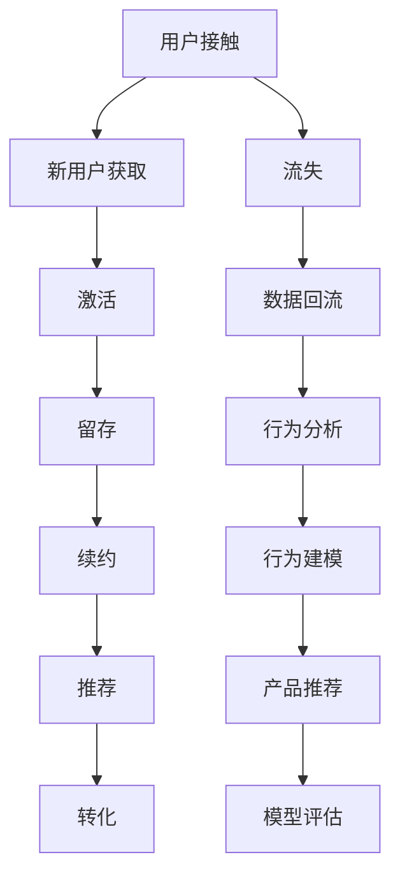

                 

# 知识付费创业中的用户成长体系设计

> 关键词：知识付费, 用户成长, 用户留存, 用户粘性, 用户分析, 产品推荐, 行为建模, 模型评估

## 1. 背景介绍

### 1.1 问题由来
近年来，知识付费行业迅猛发展，成为互联网领域一个极具潜力的市场。据艾媒咨询数据显示，预计到2023年，中国知识付费用户规模将突破4.7亿，市场规模达到617.6亿元。

知识付费行业用户留存率低下、用户流失快已成为普遍现象。由于知识付费平台的商业模式独特，用户获取的不仅仅是知识，更是一种消费体验。当用户认为所获得的知识价值不符，或是遇到不愉快的消费体验时，很容易流失。因此，如何设计一套有效的用户成长体系，在用户付费前、付费中和付费后持续提升用户满意度，增强用户粘性，延长用户生命周期，成为了知识付费创业中的核心挑战。

## 2. 核心概念与联系

### 2.1 核心概念概述

为更好地理解知识付费用户成长体系的设计，本节将介绍几个密切相关的核心概念：

- 用户成长体系(User Growth System)：指通过一系列策略和机制，不断优化用户行为，提升用户价值和体验，最终实现用户增长、留存、转化等目标的体系化设计。
- 用户生命周期(User Lifecycle)：指从用户接触到平台，到最终流失的整个过程，包括新用户获取、激活、留存、续约、推荐等多个阶段。
- 用户行为分析(User Behavior Analysis)：通过分析用户行为数据，发现用户需求，预测用户行为，提升产品体验和用户满意度。
- 产品推荐(Product Recommendation)：指根据用户的行为数据和特征，为用户推荐个性化内容，提升用户价值和转化率。
- 行为建模(Behavior Modeling)：指构建用户行为模型，对用户行为进行建模和预测，实现个性化推荐、精准营销等效果。
- 模型评估(Model Evaluation)：指对设计的用户成长体系、推荐算法、行为模型等进行评估，确保其有效性和合理性。

这些核心概念之间的逻辑关系可以通过以下Mermaid流程图来展示：



这个流程图展示了几类关键概念之间的联系：

1. 新用户在接触平台后，通过一系列激活策略，进入平台。
2. 用户在激活后，通过持续的留存策略，保持活跃。
3. 留存用户通过续约策略，继续订阅平台内容。
4. 平台根据用户行为，进行精准推荐，提升用户转化。
5. 流失用户在离开平台前，通过数据分析回流，为平台提供有价值的用户行为信息。
6. 通过行为分析和行为建模，优化产品推荐，提升用户满意度。
7. 最终通过模型评估，不断迭代和优化用户成长体系，实现用户留存和转化。

## 3. 核心算法原理 & 具体操作步骤

### 3.1 算法原理概述

知识付费用户成长体系的设计，本质上是构建一个用户行为预测和推荐的闭环。其核心思想是通过用户行为数据，构建用户行为模型，并不断优化模型，提升推荐精度，从而实现用户成长和留存。

具体而言，用户成长体系包括以下几个关键步骤：

1. **数据收集**：收集用户行为数据，如浏览、购买、评价、反馈等。
2. **特征工程**：对收集到的数据进行特征提取和处理，构建用户特征向量。
3. **用户建模**：根据用户特征向量，构建用户行为模型，如协同过滤、基于内容的推荐、深度学习模型等。
4. **推荐策略**：根据用户行为模型，进行个性化推荐，提升用户满意度。
5. **评估与优化**：通过评估推荐效果，不断优化模型和策略，提升用户留存率和转化率。

### 3.2 算法步骤详解

**Step 1: 数据收集**

收集用户行为数据是设计用户成长体系的基础。可以从以下方面入手：

- **用户基本信息**：包括性别、年龄、职业等基本信息。
- **行为数据**：包括浏览记录、购买记录、评价记录、反馈记录等。
- **社交数据**：包括好友关系、社交圈等社交网络信息。
- **其他数据**：包括设备信息、地理位置等非结构化数据。

**Step 2: 特征工程**

构建用户特征向量，是用户建模的第一步。常见的特征工程方法包括：

- **One-Hot编码**：将分类变量转换为稀疏向量。
- **归一化处理**：对连续变量进行归一化处理，避免数据范围差异带来的影响。
- **降维处理**：使用PCA、LDA等降维技术，简化数据表示，提高计算效率。
- **用户画像构建**：根据用户特征向量，构建用户画像，如年龄画像、兴趣画像等。

**Step 3: 用户建模**

用户建模是用户成长体系的核心环节。常见的方法包括：

- **协同过滤**：通过相似用户的行为数据，推荐可能感兴趣的内容。
- **基于内容的推荐**：根据内容标签和用户画像，推荐相关内容。
- **深度学习模型**：如矩阵分解、神经网络等，对用户行为进行建模和预测。

**Step 4: 推荐策略**

推荐策略是提升用户满意度的关键手段。常见的推荐方法包括：

- **个性化推荐**：根据用户行为模型，推荐个性化内容。
- **相关推荐**：推荐与当前内容相关的内容，提升内容关联度。
- **多样性推荐**：推荐多样性内容，提升用户体验。
- **实时推荐**：根据用户实时行为，进行动态推荐。

**Step 5: 评估与优化**

评估与优化是用户成长体系的持续改进过程。常见的方法包括：

- **A/B测试**：对不同推荐策略进行测试，评估效果。
- **用户满意度调查**：通过问卷、评论等方式，收集用户反馈。
- **数据分析**：通过行为数据分析，发现问题，优化策略。
- **模型调优**：通过调优推荐模型，提升推荐精度。

### 3.3 算法优缺点

知识付费用户成长体系的设计，具有以下优点：

- **数据驱动**：通过数据驱动，可以客观评估推荐效果，不断优化模型和策略。
- **个性化推荐**：通过个性化推荐，提升用户满意度，增强用户粘性。
- **精准营销**：通过精准推荐，提升用户转化率和收入。

同时，该方法也存在一定的局限性：

- **数据依赖**：需要收集大量的用户行为数据，对数据隐私和安全提出挑战。
- **模型复杂**：深度学习模型等复杂模型，对计算资源和模型训练能力有较高要求。
- **策略调整**：需要持续调整推荐策略，以适应用户行为变化。
- **用户隐私**：用户行为数据涉及隐私，需要合理保护用户隐私，避免数据滥用。

尽管存在这些局限性，但就目前而言，数据驱动的用户成长体系设计，仍是知识付费创业中最为有效的用户留存和转化策略。未来相关研究的重点在于如何进一步降低对数据的依赖，提高模型泛化能力，同时兼顾用户隐私和安全性等因素。

### 3.4 算法应用领域

知识付费用户成长体系设计，在知识付费平台、在线教育、社区论坛等多个领域，都得到了广泛的应用。具体而言：

- **知识付费平台**：通过用户成长体系设计，提升用户留存和转化，实现平台商业价值最大化。
- **在线教育**：通过用户行为分析，提升课程推荐精准度，实现个性化学习。
- **社区论坛**：通过用户画像构建和内容推荐，提升用户参与度和粘性。

除了上述这些经典应用外，用户成长体系还被创新性地应用到更多场景中，如金融理财、社交电商等，为平台用户价值增长提供了新的路径。

## 4. 数学模型和公式 & 详细讲解 & 举例说明

### 4.1 数学模型构建

本节将使用数学语言对知识付费用户成长体系的设计进行更加严格的刻画。

记用户特征向量为 $\mathbf{x} \in \mathbb{R}^d$，其中 $d$ 为特征维度。假设用户行为模型为 $f(\mathbf{x})$，预测用户对某个内容 $i$ 的评分 $r_i$。则用户行为模型可以表示为：

$$
r_i = f(\mathbf{x})_i
$$

其中 $f(\mathbf{x})$ 为预测函数，如深度神经网络、协同过滤模型等。

### 4.2 公式推导过程

以协同过滤模型为例，其基本思想是通过用户相似度，找到与目标用户行为相似的其他用户，推荐这些用户喜欢的内容。具体而言，设目标用户 $u$ 对内容 $i$ 的评分 $r_{ui}$，其他用户 $v$ 对内容 $i$ 的评分 $r_{vi}$，则用户相似度 $s_{uv}$ 可以表示为：

$$
s_{uv} = \frac{r_{ui}r_{vi}}{\sqrt{(r_{u} \cdot r_{v})}
$$

其中 $r_{u}$ 和 $r_{v}$ 分别表示目标用户和用户 $v$ 对所有内容的评分向量。则目标用户 $u$ 对内容 $i$ 的推荐评分 $p_{ui}$ 可以表示为：

$$
p_{ui} = \sum_{v \in N(u)} s_{uv}r_{vi}
$$

其中 $N(u)$ 表示与目标用户 $u$ 行为相似的其他用户集合。该公式可以通过用户相似度矩阵和用户评分矩阵进行高效计算。

### 4.3 案例分析与讲解

以知识付费平台为例，可以使用协同过滤模型对新用户进行个性化推荐。具体而言：

- **用户相似度计算**：通过计算新用户 $u$ 与其他用户的相似度，找到与新用户行为相似的其他用户 $v$。
- **内容评分预测**：根据用户 $v$ 对内容的评分，预测新用户 $u$ 对内容的评分。
- **内容推荐**：根据预测评分，推荐评分较高的内容给新用户 $u$。

例如，假设某新用户对一篇文章的评分 $r_{ui}$ 为 4，其相似用户对同一篇文章的评分 $r_{vi}$ 分别为 3、4、5，则该文章对新用户 $u$ 的推荐评分 $p_{ui}$ 可以计算为：

$$
p_{ui} = \frac{4 \cdot 3 + 4 \cdot 4 + 5 \cdot 5}{\sqrt{4 \cdot 3 \cdot 4 \cdot 5}} \approx 3.92
$$

即该文章对新用户的推荐评分约为 3.92，可以在推荐列表的前几位展示给用户。

## 5. 项目实践：代码实例和详细解释说明

### 5.1 开发环境搭建

在进行知识付费用户成长体系设计时，我们需要准备好开发环境。以下是使用Python进行Pandas和Scikit-learn开发的开发环境配置流程：

1. 安装Anaconda：从官网下载并安装Anaconda，用于创建独立的Python环境。

2. 创建并激活虚拟环境：
```bash
conda create -n user_growth_env python=3.8 
conda activate user_growth_env
```

3. 安装Pandas：
```bash
conda install pandas
```

4. 安装Scikit-learn：
```bash
conda install scikit-learn
```

5. 安装其他工具包：
```bash
pip install numpy matplotlib seaborn joblib
```

完成上述步骤后，即可在`user_growth_env`环境中开始项目实践。

### 5.2 源代码详细实现

下面我们以知识付费平台的用户成长体系设计为例，给出使用Pandas和Scikit-learn进行协同过滤模型代码实现。

首先，定义用户行为数据和用户特征数据：

```python
import pandas as pd
from sklearn.neighbors import NearestNeighbors

# 用户行为数据
user_behavior = pd.read_csv('user_behavior.csv')
user_behavior.head()
```

然后，构建用户行为矩阵和用户特征矩阵：

```python
# 构建用户行为矩阵
user_matrix = user_behavior.pivot_table(index='user_id', columns='content_id', values='score')

# 构建用户特征矩阵
user_profile = user_behavior.groupby(['user_id'])['age', 'gender'].mean()
user_profile.head()
```

接着，训练协同过滤模型：

```python
# 训练协同过滤模型
nn = NearestNeighbors(n_neighbors=10)
nn.fit(user_matrix)
```

最后，进行用户推荐：

```python
# 对新用户进行推荐
new_user_id = 1001
new_user_score = user_matrix.iloc[new_user_id, :]
new_user_similarity = nn.kneighbors(new_user_score.values.reshape(1, -1), return_distance=False)
new_user_recommendation = user_matrix.iloc[new_user_id, new_user_similarity[:, 1]].values
print(new_user_recommendation)
```

以上就是使用Pandas和Scikit-learn进行协同过滤模型用户推荐的全代码实现。可以看到，通过Pandas进行数据处理和特征工程，Scikit-learn进行模型训练和推荐，可以高效地实现知识付费平台的用户成长体系设计。

### 5.3 代码解读与分析

让我们再详细解读一下关键代码的实现细节：

**用户行为数据定义**：
- `user_behavior.csv`：包含用户对内容的评分数据。

**用户行为矩阵构建**：
- `pivot_table`方法：将用户行为数据转换为用户-内容评分矩阵，其中 `user_id` 为行，`content_id` 为列，`score` 为值。

**用户特征矩阵构建**：
- `groupby`方法：按用户分组，计算用户的基本信息，如年龄、性别等。

**协同过滤模型训练**：
- `NearestNeighbors`方法：根据用户行为矩阵，构建用户相似度矩阵。

**用户推荐实现**：
- `kneighbors`方法：根据新用户的行为评分，找到与其行为相似的其他用户，并推荐其喜欢的内容。

以上代码展示了如何通过Pandas和Scikit-learn实现协同过滤模型用户推荐，实现了知识付费平台的用户成长体系设计。

## 6. 实际应用场景

### 6.1 智能客服系统

知识付费用户成长体系设计，可以广泛应用于智能客服系统的构建。传统客服往往需要配备大量人力，高峰期响应缓慢，且一致性和专业性难以保证。而使用知识付费用户成长体系设计，可以7x24小时不间断服务，快速响应客户咨询，用个性化推荐满足客户需求。

在技术实现上，可以收集用户的历史行为数据，构建用户画像，并在此基础上进行个性化推荐。例如，根据用户最近关注的课程主题和评分，推荐相似课程，提升用户满意度。

### 6.2 金融理财系统

金融理财系统需要根据用户的行为数据，进行精准的用户画像构建和个性化推荐，帮助用户管理资产，提升理财收益。知识付费用户成长体系设计，可以通过构建用户画像，对用户行为进行精准预测，实现个性化理财推荐。

例如，根据用户的财务状况、投资偏好和历史交易记录，推荐适合的理财产品，帮助用户优化资产配置。

### 6.3 在线教育系统

在线教育系统需要根据用户的学习行为数据，进行个性化推荐，提升学习效果和用户满意度。知识付费用户成长体系设计，可以通过构建用户画像，对用户的知识水平、学习兴趣和学习习惯进行预测，实现个性化学习推荐。

例如，根据用户的学习历史和评分，推荐适合的课程，帮助用户高效学习。

### 6.4 社区论坛系统

社区论坛系统需要根据用户的行为数据，进行用户画像构建和内容推荐，提升用户参与度和粘性。知识付费用户成长体系设计，可以通过构建用户画像，对用户的话题兴趣和内容偏好进行预测，实现个性化内容推荐。

例如，根据用户的帖子参与度和评论内容，推荐相关话题和内容，提升用户参与度。

## 7. 工具和资源推荐

### 7.1 学习资源推荐

为了帮助开发者系统掌握知识付费用户成长体系设计的理论基础和实践技巧，这里推荐一些优质的学习资源：

1. 《推荐系统实战》书籍：全面介绍了推荐系统的算法和实现，包括协同过滤、基于内容的推荐、深度学习等。

2. 《用户行为分析》课程：来自Coursera的课程，系统讲解了用户行为分析的基本概念和常见技术。

3. 《Python数据科学手册》书籍：介绍了Pandas、Scikit-learn等工具的使用，是数据处理和建模的基础读物。

4. Kaggle平台：提供了大量的推荐系统数据集和竞赛，可以实战练习推荐算法的设计和优化。

5. 《数据科学实战》博客：深度学习大牛Vahid Mirjalili的博客，详细介绍了推荐系统和用户成长体系设计的前沿研究和实践技巧。

通过对这些资源的学习实践，相信你一定能够快速掌握知识付费用户成长体系设计的精髓，并用于解决实际的NLP问题。

### 7.2 开发工具推荐

高效的开发离不开优秀的工具支持。以下是几款用于知识付费用户成长体系设计的常用工具：

1. Jupyter Notebook：开源的交互式笔记本，方便进行代码调试和数据可视化。

2. PyTorch：基于Python的开源深度学习框架，灵活的计算图，适合快速迭代研究。

3. TensorFlow：由Google主导开发的开源深度学习框架，生产部署方便，适合大规模工程应用。

4. Apache Spark：分布式计算框架，适用于大规模数据处理和机器学习。

5. Airflow：开源的工作流调度系统，方便进行模型训练和评估的自动化管理。

6. Elasticsearch：分布式搜索引擎，适合大数据量用户行为数据的存储和检索。

合理利用这些工具，可以显著提升知识付费用户成长体系设计的开发效率，加快创新迭代的步伐。

### 7.3 相关论文推荐

知识付费用户成长体系的设计源于学界的持续研究。以下是几篇奠基性的相关论文，推荐阅读：

1. "Collaborative Filtering for Implicit Feedback Datasets"（协同过滤算法）：ICML 2008。

2. "A Survey of Collaborative Filtering Techniques"（协同过滤算法综述）：IEEE Trans. Knowl. Data Eng. 2008。

3. "Matrix Factorization Techniques for Recommender Systems"（矩阵分解算法）：IEEE Trans. Knowl. Data Eng. 2011。

4. "Learning from Sparse Data"（稀疏数据的机器学习方法）：JMLR 2014。

5. "Deep Personalized Recommendation with Key-Value Embedding"（深度个性化推荐算法）：ICML 2017。

6. "The Future of Recommendation Systems in Display Advertising: A Survey and Outlook"（广告推荐系统的未来展望）：IEEE J. Selected Areas Commun. 2016。

这些论文代表了大语言模型微调技术的发展脉络。通过学习这些前沿成果，可以帮助研究者把握学科前进方向，激发更多的创新灵感。

## 8. 总结：未来发展趋势与挑战

### 8.1 总结

本文对知识付费用户成长体系设计进行了全面系统的介绍。首先阐述了知识付费用户成长体系的设计背景和意义，明确了用户成长体系在提升用户价值和体验中的关键作用。其次，从原理到实践，详细讲解了用户成长体系设计的数学模型和关键步骤，给出了知识付费平台的用户推荐代码实例。同时，本文还广泛探讨了用户成长体系在智能客服、金融理财、在线教育等多个行业领域的应用前景，展示了用户成长体系设计的巨大潜力。此外，本文精选了用户成长体系的各类学习资源，力求为读者提供全方位的技术指引。

通过本文的系统梳理，可以看到，知识付费用户成长体系设计正在成为知识付费创业中最为有效的用户留存和转化策略。数据驱动的用户成长体系，通过个性化推荐和精准营销，提升用户满意度，增强用户粘性，延长用户生命周期，实现了知识付费平台的商业价值最大化。未来，伴随知识付费行业的持续发展，用户成长体系设计也将迎来更多的创新和突破，为知识付费创业注入新的活力。

### 8.2 未来发展趋势

展望未来，知识付费用户成长体系设计将呈现以下几个发展趋势：

1. **多模态推荐**：除了文本数据，还引入图像、视频、语音等多模态数据，实现多模态推荐，提升用户体验。

2. **自适应推荐**：根据用户实时行为，动态调整推荐策略，提升推荐精度和用户满意度。

3. **跨平台推荐**：实现跨平台数据共享和推荐，提升推荐效果。

4. **实时推荐系统**：实现低延迟、高可扩展的实时推荐系统，提升用户体验和平台效率。

5. **深度学习推荐**：引入深度学习算法，提升推荐模型的精度和泛化能力。

6. **联邦推荐**：通过分布式计算和联邦学习，保护用户隐私，提升推荐效果。

以上趋势凸显了知识付费用户成长体系设计的广阔前景。这些方向的探索发展，必将进一步提升用户推荐精度和体验，为知识付费平台带来更多的用户增长和商业价值。

### 8.3 面临的挑战

尽管知识付费用户成长体系设计已经取得了瞩目成就，但在迈向更加智能化、普适化应用的过程中，它仍面临着诸多挑战：

1. **数据隐私**：用户行为数据涉及隐私，如何合理保护用户隐私，避免数据滥用，将是未来研究的重要课题。

2. **模型泛化**：深度学习模型等复杂模型，如何提高模型泛化能力，避免模型过拟合，将是重要的研究方向。

3. **系统性能**：实时推荐系统需要高效计算和存储，如何提升系统性能，优化资源使用，将是重要的技术挑战。

4. **用户反馈**：如何获取用户真实反馈，优化推荐策略，提升用户满意度，将是持续改进的方向。

5. **多模态融合**：多模态数据融合是用户成长体系设计的难点之一，如何实现多模态数据的有效整合，提升推荐效果，将是重要的研究课题。

6. **跨平台推荐**：跨平台推荐需要解决数据孤岛、数据不一致等问题，如何实现数据共享和统一，将是重要的研究方向。

正视知识付费用户成长体系设计面临的这些挑战，积极应对并寻求突破，将是大语言模型微调走向成熟的必由之路。相信随着学界和产业界的共同努力，这些挑战终将一一被克服，知识付费用户成长体系设计必将在构建人机协同的智能时代中扮演越来越重要的角色。

### 8.4 研究展望

面向未来，知识付费用户成长体系设计需要在以下几个方面寻求新的突破：

1. **隐私保护**：研究如何合理保护用户隐私，同时实现个性化推荐。

2. **深度学习优化**：引入深度学习算法，优化推荐模型，提高推荐精度和泛化能力。

3. **实时推荐优化**：研究如何实现低延迟、高可扩展的实时推荐系统，提升用户体验和平台效率。

4. **多模态融合**：研究如何实现多模态数据的有效整合，提升推荐效果。

5. **联邦推荐**：研究如何通过分布式计算和联邦学习，保护用户隐私，提升推荐效果。

6. **用户行为分析**：研究如何通过用户行为分析，构建精准的用户画像，实现个性化推荐。

这些研究方向的探索，必将引领知识付费用户成长体系设计迈向更高的台阶，为知识付费创业注入新的活力。

## 9. 附录：常见问题与解答

**Q1：用户成长体系设计是否适用于所有知识付费平台？**

A: 用户成长体系设计在大多数知识付费平台上都能取得不错的效果。但对于一些特定类型的知识付费平台，如编程、职业培训等，可能需要结合领域特色进行优化。

**Q2：用户成长体系设计的核心在于什么？**

A: 用户成长体系设计的核心在于构建用户行为模型，进行个性化推荐，提升用户满意度。关键在于数据收集、特征工程、用户建模、推荐策略、评估优化等环节的协同配合。

**Q3：用户成长体系设计对数据隐私有哪些影响？**

A: 用户成长体系设计涉及大量用户行为数据，需要合理保护用户隐私。可以采用数据匿名化、差分隐私等技术，保护用户隐私，避免数据滥用。

**Q4：用户成长体系设计如何平衡个性化推荐和数据隐私？**

A: 用户成长体系设计需要在个性化推荐和数据隐私之间进行平衡。可以采用差分隐私、联邦学习等技术，保护用户隐私，同时实现个性化推荐。

**Q5：用户成长体系设计未来有哪些新的趋势？**

A: 用户成长体系设计的未来趋势包括多模态推荐、自适应推荐、跨平台推荐、实时推荐系统、深度学习推荐等。这些趋势将进一步提升推荐效果和用户体验。

这些问题的解答，将帮助读者更好地理解知识付费用户成长体系设计的内涵和实践要点。

---

作者：禅与计算机程序设计艺术 / Zen and the Art of Computer Programming

