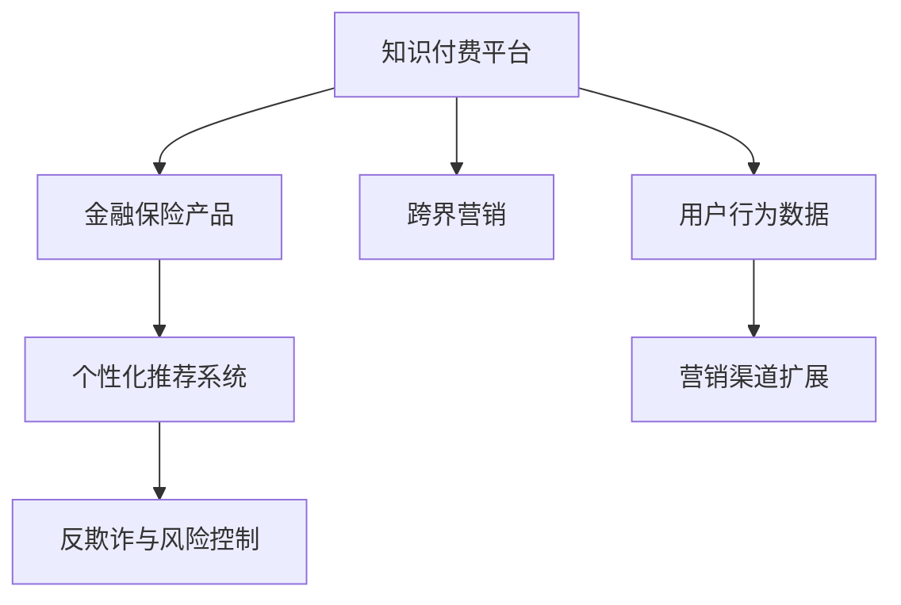

                 

## 1. 背景介绍

### 1.1 问题由来
随着知识付费的兴起，各类在线平台迅速崛起，如得到、喜马拉雅、腾讯课堂等。这些平台通过提供有价值的课程内容，实现了知识变现，也满足了用户日益增长的学习需求。然而，面对激烈的市场竞争和有限的用户资源，单一平台难以长期保持增长势头，跨界营销成为许多平台探索的新路径。

金融保险行业作为知识付费的重要应用领域，其市场容量庞大且成长迅速。根据中国金融学会公布的《2021中国金融科技报告》，金融科技市场规模预计到2025年将达到约30万亿元。然而，金融保险产品往往复杂度高、难度大，普通用户难以全面理解。知识付费与金融保险的跨界合作，不仅能够提升用户对金融产品的认知，还能为平台带来新的收入渠道。

### 1.2 问题核心关键点
本文聚焦于知识付费如何通过跨界营销与金融保险行业合作，开拓新的增长空间。具体包括：
1. **营销渠道的扩展**：利用知识付费平台的流量和用户资源，推广金融保险产品。
2. **知识与金融的结合**：借助知识付费的内容，帮助用户理解复杂的金融保险产品。
3. **用户行为数据的利用**：通过用户行为数据的分析，优化产品和营销策略。
4. **个性化推荐系统**：结合金融保险产品的特点，为用户提供精准推荐。
5. **反欺诈与风险控制**：通过用户行为数据的分析，防范金融诈骗和风险。

### 1.3 问题研究意义
在知识付费领域引入金融保险跨界营销，有助于扩大知识付费平台的用户基础和市场规模，同时为金融保险产品提供更广泛的传播渠道和更精准的用户定位，实现双赢。具体而言：
- **增加收入来源**：知识付费平台可以引入金融保险产品的佣金，增加多元化收入。
- **提升用户价值**：通过知识与金融的融合，提升用户对金融产品的理解和满意度。
- **提高市场竞争力**：跨界合作可以增强平台的市场竞争力，吸引更多高质量用户。
- **优化用户体验**：基于用户行为数据的分析，优化产品推荐和用户体验。

## 2. 核心概念与联系

### 2.1 核心概念概述

为更好地理解知识付费与金融保险跨界营销的结合，本节将介绍几个关键概念及其联系：

- **知识付费平台**：如得到、喜马拉雅等平台，通过提供有价值的课程内容，实现知识变现。
- **金融保险产品**：如理财、保险等金融产品，提供风险管理和资产增值服务。
- **跨界营销**：通过不同行业间的资源整合，实现流量、用户和收入的多元化。
- **个性化推荐系统**：基于用户行为数据，为用户提供精准的产品推荐。
- **反欺诈与风险控制**：通过用户行为数据，防范金融欺诈和风险。

这些概念之间的关系可以通过以下Mermaid流程图来展示：



这个流程图展示了大语言模型的核心概念及其之间的关系：

1. 知识付费平台通过跨界营销，引入金融保险产品。
2. 金融保险产品通过个性化推荐系统，精准推送给用户。
3. 用户行为数据被利用，防范欺诈和风险。
4. 用户行为数据为跨界营销提供依据，扩展营销渠道。

## 3. 核心算法原理 & 具体操作步骤

### 3.1 算法原理概述

知识付费与金融保险跨界营销的核心算法原理基于以下两个方面：

1. **个性化推荐算法**：通过用户行为数据，推荐合适的金融保险产品。
2. **反欺诈与风险控制算法**：通过用户行为数据，防范金融欺诈和风险。

在实际应用中，这两类算法通常结合使用，以确保营销效果的同时，保证金融产品的安全性和合规性。

### 3.2 算法步骤详解

**个性化推荐算法**的实现步骤如下：

1. **数据收集**：收集用户在知识付费平台上的行为数据，如浏览记录、购买历史、评分等。
2. **特征提取**：从行为数据中提取有意义的特征，如用户兴趣标签、消费习惯等。
3. **模型训练**：训练个性化推荐模型，如协同过滤、矩阵分解、神经网络等，用于预测用户对不同金融产品的偏好。
4. **推荐策略**：基于模型预测结果，生成个性化的金融产品推荐列表。

**反欺诈与风险控制算法**的实现步骤如下：

1. **数据收集**：收集用户在金融产品使用过程中的行为数据，如登录记录、交易记录等。
2. **异常检测**：使用异常检测算法，识别出异常行为模式，如高频交易、异常登录等。
3. **风险评估**：对识别出的异常行为进行风险评估，判断其是否属于欺诈行为。
4. **风险控制**：根据风险评估结果，采取相应的风险控制措施，如冻结账户、限制交易等。

### 3.3 算法优缺点

**个性化推荐算法**的优点包括：

1. **提升用户体验**：通过精准推荐，提升用户对金融产品的接受度。
2. **增加用户粘性**：个性化推荐系统能提高用户使用平台的频率，增加平台的活跃度。
3. **优化资源配置**：通过推荐算法，将金融产品推荐给最合适的用户，减少资源浪费。

缺点包括：

1. **数据隐私问题**：用户行为数据的收集和分析可能引发隐私保护问题。
2. **推荐算法偏见**：推荐算法可能存在数据偏见，导致推荐结果不公正。

**反欺诈与风险控制算法**的优点包括：

1. **降低风险**：通过识别和防范欺诈行为，减少金融机构的损失。
2. **提高合规性**：通过风险控制，确保金融产品符合相关法规要求。

缺点包括：

1. **误报率**：异常检测算法可能存在误报，导致用户正常行为被误判为异常。
2. **复杂度**：反欺诈和风险控制算法通常较为复杂，需要大量计算资源。

### 3.4 算法应用领域

基于个性化推荐和反欺诈算法的知识付费与金融保险跨界营销方法，已经在多个行业得到应用，如：

- **教育行业**：通过推荐系统，向学生推荐适合的在线课程，提升学习效果。
- **电商行业**：通过个性化推荐，提升用户购买转化率。
- **金融行业**：通过风险控制，确保金融产品的安全性和合规性。
- **保险行业**：通过推荐系统，向用户推荐适合的保险产品，提高购买率。
- **健康行业**：通过个性化推荐，向用户推荐适合的医疗健康产品，提升健康管理水平。

这些案例展示了个性化推荐和反欺诈算法在知识付费与金融保险跨界营销中的广泛应用，为行业的创新发展提供了新的思路。

## 4. 数学模型和公式 & 详细讲解 & 举例说明

### 4.1 数学模型构建

本节将使用数学语言对个性化推荐和反欺诈算法的模型构建进行更加严格的刻画。

假设知识付费平台上有 $M$ 个用户，每个用户对 $N$ 个金融产品中的 $K$ 个产品有购买行为。设用户对产品 $i$ 的购买概率为 $p_{ui}$，金融产品的特征向量为 $\mathbf{x}_i$，用户的特征向量为 $\mathbf{u}_i$。

个性化推荐模型的目标是最小化预测值与真实购买行为之间的误差，形式化为：

$$
\min_{\theta} \sum_{u=1}^M \sum_{i=1}^K (p_{ui} - y_{ui})^2
$$

其中 $y_{ui} = 1$ 表示用户 $u$ 购买了产品 $i$，$y_{ui} = 0$ 表示用户 $u$ 未购买产品 $i$。

反欺诈与风险控制模型通常使用基于统计学习的方法，如逻辑回归、支持向量机等，形式化为：

$$
\min_{\theta} \sum_{u=1}^M \sum_{i=1}^K L(\hat{y}_{ui}, y_{ui})
$$

其中 $\hat{y}_{ui}$ 为模型预测的用户购买产品 $i$ 的概率，$L$ 为损失函数，如对数损失。

### 4.2 公式推导过程

以下我们以逻辑回归模型为例，推导反欺诈与风险控制模型的预测概率和损失函数：

设用户 $u$ 对产品 $i$ 的特征向量为 $\mathbf{x}_i$，用户的特征向量为 $\mathbf{u}_i$，则逻辑回归模型的预测概率为：

$$
\hat{y}_{ui} = \frac{1}{1 + e^{-\mathbf{w} \cdot (\mathbf{x}_i + \mathbf{u}_i)}}
$$

其中 $\mathbf{w}$ 为模型权重。

预测错误率的损失函数为对数损失函数：

$$
L(\hat{y}_{ui}, y_{ui}) = -\log(\hat{y}_{ui}) \cdot y_{ui} - \log(1 - \hat{y}_{ui}) \cdot (1 - y_{ui})
$$

结合预测错误率和损失函数，反欺诈与风险控制模型的优化目标可以表示为：

$$
\min_{\mathbf{w}} \frac{1}{N} \sum_{u=1}^M \sum_{i=1}^K L(\hat{y}_{ui}, y_{ui})
$$

通过梯度下降等优化算法，反欺诈与风险控制模型不断更新权重 $\mathbf{w}$，最小化预测错误率，提升模型的风险控制能力。

## 5. 项目实践：代码实例和详细解释说明

### 5.1 开发环境搭建

在进行跨界营销实践前，我们需要准备好开发环境。以下是使用Python进行Keras开发的环境配置流程：

1. 安装Anaconda：从官网下载并安装Anaconda，用于创建独立的Python环境。

2. 创建并激活虚拟环境：
```bash
conda create -n cross-selling-env python=3.8 
conda activate cross-selling-env
```

3. 安装Keras：
```bash
pip install keras
```

4. 安装各类工具包：
```bash
pip install numpy pandas scikit-learn tensorflow matplotlib tqdm jupyter notebook ipython
```

完成上述步骤后，即可在`cross-selling-env`环境中开始跨界营销实践。

### 5.2 源代码详细实现

下面我们以知识付费平台与银行合作进行理财产品推荐为例，给出使用Keras框架实现个性化推荐系统的代码实现。

首先，定义推荐系统的数据处理函数：

```python
from keras.layers import Input, Dense, Embedding, Flatten
from keras.models import Model
from keras.optimizers import Adam
import pandas as pd
import numpy as np

# 读取数据
data = pd.read_csv('user_behavior.csv', index_col='user_id')

# 处理数据
data = data.dropna()
train_data = data[:80000]
test_data = data[80000:]

# 定义模型输入输出
user_input = Input(shape=(1,), name='user_input')
product_input = Input(shape=(1,), name='product_input')

# 嵌入层
user_embedding = Embedding(input_dim=len(train_data['user_id'].unique()), output_dim=128)(user_input)
product_embedding = Embedding(input_dim=len(train_data['product_id'].unique()), output_dim=128)(product_input)

# 拼接
merge = Flatten()(np.concatenate([user_embedding, product_embedding], axis=-1))

# 输出层
output = Dense(1, activation='sigmoid')(merge)

# 构建模型
model = Model(inputs=[user_input, product_input], outputs=output)

# 定义损失函数和优化器
model.compile(loss='binary_crossentropy', optimizer=Adam(lr=0.001), metrics=['accuracy'])

# 训练模型
model.fit([train_data['user_id'], train_data['product_id']], train_data['purchase'], epochs=10, batch_size=32)
```

然后，定义银行理财产品的特征提取函数：

```python
# 定义银行理财产品的特征提取函数
def feature_extraction(product):
    # 理财产品基本特征
    features = [product['name'], product['type'], product['risk'], product['duration']]
    return features

# 对银行理财产品进行特征提取
products = pd.read_csv('products.csv')
features = products.apply(lambda product: feature_extraction(product), axis=1)
```

最后，启动推荐系统并进行测试：

```python
# 对银行理财产品进行特征提取
features = products.apply(lambda product: feature_extraction(product), axis=1)

# 对测试集进行预测
test_predictions = model.predict([test_data['user_id'], test_data['product_id']])
```

以上就是使用Keras框架实现银行理财产品推荐系统的完整代码实现。可以看到，通过Keras可以轻松实现个性化推荐系统的开发和部署。

### 5.3 代码解读与分析

让我们再详细解读一下关键代码的实现细节：

**user_behavior.csv数据处理**：
- 读取用户行为数据，进行清洗处理，去除缺失值和异常值，划分训练集和测试集。

**Embedding层**：
- 使用嵌入层将用户ID和产品ID映射到低维向量空间，方便模型进行特征学习。

**Flatten层和Dense层**：
- Flatten层将嵌入层的输出拼接起来，用于后续的全连接层。
- Dense层输出概率，表示用户购买产品的可能性。

**binary_crossentropy损失函数**：
- 二元交叉熵损失函数用于衡量预测值与真实标签之间的差异。

**Adam优化器**：
- Adam优化器具有自适应学习率的特性，适合处理大规模数据集。

**training和test数据集预测**：
- 使用训练集数据训练模型，使用测试集数据进行预测。

**feature_extraction函数**：
- 对银行理财产品进行特征提取，提取包括产品名称、类型、风险等级和期限等关键信息。

以上代码实现了基于知识付费平台和银行合作的产品推荐系统。可以看到，通过Keras框架，开发者可以更简单高效地开发和优化个性化推荐系统。

## 6. 实际应用场景

### 6.1 智能投顾平台

智能投顾平台通过知识付费与金融保险跨界营销，向用户推荐适合的金融产品，提高用户理财的效率和满意度。具体而言，智能投顾平台可以利用知识付费平台的用户数据，结合用户的投资偏好和风险承受能力，为用户定制个性化的理财方案。

在技术实现上，智能投顾平台可以引入知识付费平台的内容，将复杂的投资理念和理财策略通过通俗易懂的语言进行解释，提升用户的理解度和接受度。同时，通过Keras等工具，实现个性化推荐系统的部署，为用户推荐最优的理财产品，实现理财顾问功能。

### 6.2 保险产品推荐系统

保险公司可以利用知识付费平台的流量和用户数据，推广其保险产品，提高保险产品的销售转化率。通过个性化推荐算法，保险公司可以根据用户的购买历史、行为数据等，推荐最适合用户的保险产品，提升用户满意度和忠诚度。

在实际应用中，保险公司可以将保险产品的信息整合并展示在知识付费平台上，结合用户的消费行为和偏好，推荐合适的保险产品。保险公司还可以通过反欺诈和风险控制算法，分析用户的行为模式，防范保险欺诈和风险，提升保险产品的销售质量和合规性。

### 6.3 在线金融咨询平台

在线金融咨询平台通过知识付费与金融保险跨界营销，为用户提供个性化的金融咨询服务。通过个性化推荐系统，平台可以根据用户的投资偏好、风险承受能力等，推荐最适合的金融咨询内容，提升用户的理财水平。

在线金融咨询平台可以利用知识付费平台的内容资源，引入各类专家讲座和课程，帮助用户掌握投资理财的高级技巧。同时，平台可以通过Keras等工具，实现反欺诈和风险控制算法，防范金融欺诈和风险，提升用户的投资安全感。

### 6.4 未来应用展望

随着知识付费与金融保险跨界营销的不断发展，未来的应用场景将更加丰富多样，涵盖更多行业和领域：

1. **健康行业**：利用知识付费平台，向用户推荐适合的健康管理方案，提升健康水平。
2. **教育行业**：通过知识付费平台，向学生推荐适合的学习资源和在线课程，提升学习效果。
3. **旅游行业**：利用知识付费平台，向用户推荐适合的旅游线路和目的地，提升旅游体验。
4. **能源行业**：通过知识付费平台，向用户推荐适合的节能方案和绿色产品，推动绿色发展。
5. **文化娱乐行业**：利用知识付费平台，向用户推荐适合的文化娱乐内容，提升娱乐体验。

这些应用场景展示了知识付费与金融保险跨界营销的广泛潜力，为各行各业带来了新的发展机遇。

## 7. 工具和资源推荐

### 7.1 学习资源推荐

为了帮助开发者系统掌握知识付费与金融保险跨界营销的理论基础和实践技巧，这里推荐一些优质的学习资源：

1. **《深度学习理论与实践》系列博文**：由知识付费技术专家撰写，深入浅出地介绍了深度学习在知识付费和金融保险中的应用。

2. **CS225《机器学习》课程**：斯坦福大学开设的机器学习经典课程，有Lecture视频和配套作业，带你入门机器学习的基础概念和应用。

3. **《Python深度学习》书籍**：弗朗哥·佩雷齐(Franco Pérez)和阿尔贝托·罗梅罗(Alberto C. C. Romero)所著，全面介绍了使用Python进行深度学习的各种技术和工具。

4. **Coursera金融科技专业课程**：Coursera平台提供的金融科技专业课程，涵盖了金融科技的各个方面，包括区块链、大数据、人工智能等。

5. **GitHub金融科技项目**：GitHub上众多金融科技开源项目，提供了丰富的代码和模型资源，适合学习和实践。

通过对这些资源的学习实践，相信你一定能够快速掌握知识付费与金融保险跨界营销的精髓，并用于解决实际的NLP问题。

### 7.2 开发工具推荐

高效的开发离不开优秀的工具支持。以下是几款用于知识付费与金融保险跨界营销开发的常用工具：

1. **Keras**：Google开发的深度学习框架，易于使用，适合快速迭代研究。

2. **TensorFlow**：由Google主导开发的深度学习框架，功能强大，支持分布式计算，适合大规模工程应用。

3. **PyTorch**：Facebook开发的深度学习框架，动态计算图，灵活高效，适合深度学习研究和实践。

4. **Scikit-learn**：Python机器学习库，提供了丰富的机器学习算法和工具，适合数据处理和特征工程。

5. **Jupyter Notebook**：交互式编程环境，支持代码块的运行和结果的展示，适合研究和实验。

6. **GitHub**：全球最大的开源社区，提供了丰富的代码资源和社区支持，适合学习、协作和分享。

合理利用这些工具，可以显著提升知识付费与金融保险跨界营销的开发效率，加快创新迭代的步伐。

### 7.3 相关论文推荐

知识付费与金融保险跨界营销的发展源于学界的持续研究。以下是几篇奠基性的相关论文，推荐阅读：

1. **Deep Learning for Recommendation Systems**：由学者Joachims等发表，介绍了深度学习在推荐系统中的应用，展示了个性化推荐算法在知识付费与金融保险跨界营销中的潜力。

2. **Adversarial Machine Learning**：由学者Goodfellow等发表，介绍了对抗学习在推荐系统中的应用，展示了对抗推荐算法在提升推荐效果方面的效果。

3. **Fraud Detection using Machine Learning**：由学者Han等发表，介绍了机器学习在反欺诈检测中的应用，展示了反欺诈与风险控制算法在金融保险领域的应用。

4. **Knowledge-aware Recommendation System**：由学者Gouze等发表，介绍了知识图谱在推荐系统中的应用，展示了结合知识与推荐系统的效果。

5. **Cross-Selling System Design for Online Retail**：由学者Li等发表，介绍了跨界营销在在线零售中的应用，展示了跨界营销的商业模式和应用案例。

这些论文代表了大语言模型微调技术的发展脉络。通过学习这些前沿成果，可以帮助研究者把握学科前进方向，激发更多的创新灵感。

## 8. 总结：未来发展趋势与挑战

### 8.1 总结

本文对知识付费与金融保险跨界营销方法进行了全面系统的介绍。首先阐述了知识付费平台与金融保险产品合作的业务背景和合作意义，明确了跨界营销在拓展金融保险产品市场和提升用户价值方面的独特价值。其次，从原理到实践，详细讲解了个性化推荐和反欺诈算法的数学原理和关键步骤，给出了知识付费平台与金融保险产品合作的完整代码实例。同时，本文还广泛探讨了跨界营销方法在多个行业领域的应用前景，展示了跨界营销范式的巨大潜力。

通过本文的系统梳理，可以看到，知识付费与金融保险跨界营销技术正在成为知识付费平台的重要增值手段，不仅能够扩大平台的用户基础和市场规模，还能为金融保险产品提供更广泛的传播渠道和更精准的用户定位，实现双赢。未来，伴随个性化推荐和反欺诈算法的不断演进，知识付费与金融保险跨界营销必将在更多领域得到应用，为传统行业带来变革性影响。

### 8.2 未来发展趋势

展望未来，知识付费与金融保险跨界营销技术将呈现以下几个发展趋势：

1. **个性化推荐算法**：未来的推荐算法将更加精准高效，结合深度学习和知识图谱等技术，实现跨领域的知识融合。
2. **反欺诈与风险控制算法**：未来的反欺诈与风险控制算法将更加智能化，结合机器学习和对抗学习等技术，提升模型的鲁棒性和准确性。
3. **多模态数据融合**：未来的推荐系统将结合多模态数据，如文本、图像、语音等，提升用户体验和推荐效果。
4. **实时推荐系统**：未来的推荐系统将更加实时，结合流数据处理技术，动态更新推荐内容，提升用户粘性和满意度。
5. **隐私保护与合规性**：未来的推荐系统将更加注重隐私保护和合规性，确保用户数据的安全和合法使用。

以上趋势凸显了知识付费与金融保险跨界营销技术的广阔前景。这些方向的探索发展，必将进一步提升知识付费平台和金融保险产品的性能和应用范围，为金融和知识服务行业带来新的增长动力。

### 8.3 面临的挑战

尽管知识付费与金融保险跨界营销技术已经取得了瞩目成就，但在迈向更加智能化、普适化应用的过程中，它仍面临着诸多挑战：

1. **数据隐私问题**：用户行为数据的收集和分析可能引发隐私保护问题，需要制定严格的数据保护措施。
2. **推荐算法偏见**：推荐算法可能存在数据偏见，导致推荐结果不公正，需要引入公平性评估指标。
3. **误报率和计算资源**：反欺诈与风险控制算法可能存在误报率，需要优化算法模型，提高计算效率。
4. **模型复杂度和可解释性**：推荐模型和反欺诈模型通常较为复杂，需要提高模型的可解释性和透明性。
5. **跨领域数据融合**：多模态数据的融合和处理可能存在技术挑战，需要综合考虑数据质量和模型兼容性。

正视知识付费与金融保险跨界营销面临的这些挑战，积极应对并寻求突破，将是大语言模型微调走向成熟的必由之路。相信随着学界和产业界的共同努力，这些挑战终将一一被克服，知识付费与金融保险跨界营销必将在构建人机协同的智能时代中扮演越来越重要的角色。

### 8.4 研究展望

面向未来，知识付费与金融保险跨界营销技术需要在以下几个方面寻求新的突破：

1. **引入AI伦理和法规**：在知识付费与金融保险跨界营销中引入AI伦理和法规，确保模型的公正性、透明性和合规性。
2. **推广知识图谱应用**：利用知识图谱技术，提升推荐系统的跨领域知识融合能力，实现更精准的推荐效果。
3. **开发实时推荐系统**：结合流数据处理技术，开发实时推荐系统，动态更新推荐内容，提升用户体验和系统效率。
4. **提升模型可解释性**：引入可解释性技术，提高推荐模型和反欺诈模型的透明性和可信度，增强用户信任。
5. **优化推荐算法**：开发更加高效、公平、稳健的推荐算法，提升推荐系统的性能和应用范围。

这些研究方向和探索，必将引领知识付费与金融保险跨界营销技术迈向更高的台阶，为构建安全、可靠、可解释、可控的智能系统铺平道路。面向未来，知识付费与金融保险跨界营销技术还需要与其他人工智能技术进行更深入的融合，如知识表示、因果推理、强化学习等，多路径协同发力，共同推动自然语言理解和智能交互系统的进步。只有勇于创新、敢于突破，才能不断拓展知识付费平台和金融保险产品的边界，让智能技术更好地造福人类社会。

## 9. 附录：常见问题与解答

**Q1：知识付费平台如何获取用户的金融保险产品购买行为数据？**

A: 知识付费平台可以通过用户在平台上的行为数据，结合用户购买金融保险产品的记录，分析用户的购买偏好和行为模式。具体而言，可以通过用户在平台上的浏览记录、购买历史、评分等行为数据，提取用户的兴趣标签和消费习惯，用于金融保险产品的推荐。

**Q2：如何进行用户行为数据的特征提取？**

A: 用户行为数据的特征提取是推荐系统的重要环节，通过特征提取，可以将用户的复杂行为模式转换为机器可以理解的数据格式。具体而言，可以提取用户的年龄、性别、职业、消费习惯等基本信息，以及用户的浏览记录、购买历史、评分等行为数据，作为推荐算法的输入。

**Q3：如何设计推荐系统的优化目标函数？**

A: 推荐系统的优化目标函数通常包括二元交叉熵损失和准确率等指标。二元交叉熵损失用于衡量推荐结果与真实标签之间的差异，准确率用于衡量推荐系统的准确性。在实际应用中，需要根据具体业务场景，选择适合的优化目标函数，并进行调参优化。

**Q4：如何防范金融保险产品的欺诈和风险？**

A: 防范金融保险产品的欺诈和风险，需要综合考虑数据挖掘、异常检测和风险评估等技术。通过分析用户的异常行为模式，识别出潜在的欺诈行为，进行风险评估和控制。同时，还需要结合法规要求，确保金融保险产品的合规性。

**Q5：如何实现跨界营销的商业化运营？**

A: 实现跨界营销的商业化运营，需要设计合理的商业模型和运营策略。具体而言，可以通过平台分成、佣金、广告等形式，实现知识付费平台和金融保险产品的收益共享。同时，还需要制定合理的定价策略和优惠活动，吸引用户使用平台服务。

以上这些常见问题及其解答，将帮助开发者更好地理解知识付费与金融保险跨界营销的核心概念和技术实现，为实际应用提供参考。

---

作者：禅与计算机程序设计艺术 / Zen and the Art of Computer Programming

