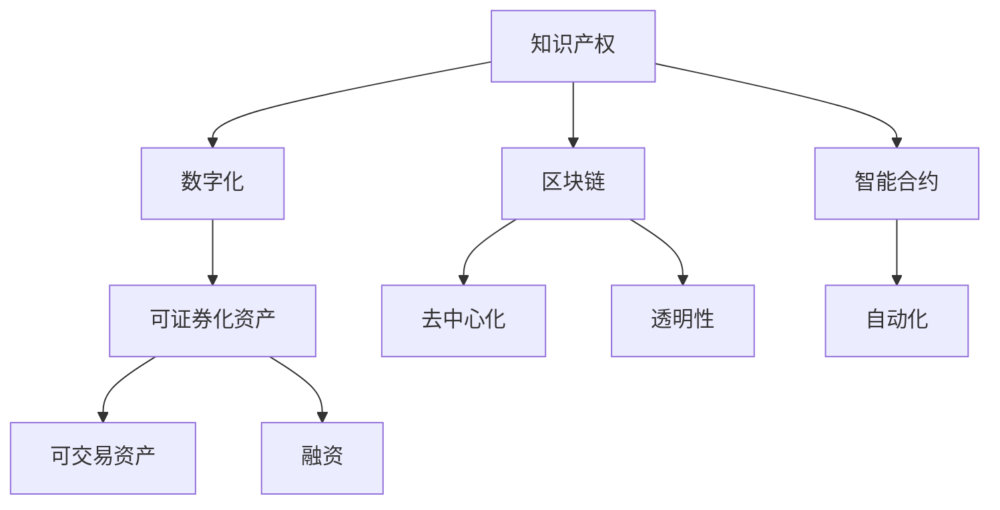

                 

# 知识付费要探索知识产权证券化的路径

> 关键词：知识付费, 知识产权, 证券化, 数字化转型, 区块链技术, 智能合约

## 1. 背景介绍

### 1.1 问题由来

随着互联网的普及和信息技术的快速发展，知识付费成为当前互联网经济的重要组成部分。传统的知识付费模式主要依赖于付费会员、订阅模式等，这种模式存在一定的局限性。一方面，用户对内容质量和形式的挑剔逐渐提升，传统模式难以满足用户的个性化需求。另一方面，随着版权纠纷频发，知识付费平台面临巨大的合规风险。

在这种背景下，探索新的知识付费模式，特别是在区块链等新技术的驱动下，成为了行业内外的共识。尤其是知识产权证券化，作为一种新型融资模式，其核心思想是将知识产权转化为可证券化的资产，通过区块链和智能合约等技术，实现知识付费和知识产权保护的双重目标。

### 1.2 问题核心关键点

知识产权证券化的核心关键点在于：

- **知识产权的数字化**：将传统的知识产权转化为数字资产，方便存储、传输和交易。
- **区块链的去中心化**：利用区块链的去中心化特性，实现知识产权的透明、不可篡改、可追溯。
- **智能合约的自动化**：通过智能合约，自动化管理知识产权的交易、版权分发、收益分配等事务。
- **证券化的融资**：将知识产权作为证券化的基础资产，发行证券筹集资金。

## 2. 核心概念与联系

### 2.1 核心概念概述

为了更好地理解知识产权证券化的实施路径，我们将涉及以下核心概念：

- **知识产权**：指在文学、艺术、科学等领域创造的具有特定价值的知识成果，包括版权、专利、商标等。
- **证券化**：指将非金融资产转化为可交易的金融资产的过程，如资产支持证券（ABS）。
- **区块链**：基于分布式账本技术的去中心化数据库，能够保证数据的透明性、不可篡改性和可追溯性。
- **智能合约**：自动执行、控制或文档的合约，利用区块链的智能合约技术可以自动执行合同条款。
- **知识付费**：用户为获取特定知识成果或服务而支付费用的模式。

这些核心概念之间的关系可以通过以下Mermaid流程图来展示：



这个流程图展示了知识产权证券化的核心步骤和关键技术：

1. 将知识产权数字化，转化为可证券化的资产。
2. 利用区块链技术，实现去中心化和透明性。
3. 通过智能合约，实现自动化和合约执行。
4. 将可证券化资产转化为可交易资产，发行证券进行融资。

## 3. 核心算法原理 & 具体操作步骤
### 3.1 算法原理概述

知识产权证券化的算法原理主要基于以下逻辑：

1. **数字化资产构建**：将知识产权转换为数字资产，包括文本、音频、视频等。
2. **区块链记录**：利用区块链的分布式账本技术，记录知识产权的数字形式和相关数据。
3. **智能合约设计**：通过智能合约，定义资产的生成、所有权转移、收益分配等规则。
4. **证券发行与交易**：利用区块链技术发行证券，并通过智能合约实现证券的交易和结算。

### 3.2 算法步骤详解

以下详细介绍知识产权证券化的具体算法步骤：

**Step 1: 知识产权数字化**

- 收集和整理知识产权相关数据，如文本、图片、视频、音频等。
- 对数据进行格式化和标准化处理，生成可编码的资产数据。

**Step 2: 资产上链**

- 利用区块链技术，将数字化资产和相关元数据上传到区块链上，实现去中心化和透明性。
- 为每个资产创建唯一的标识符，确保资产的可追溯性。

**Step 3: 智能合约设计**

- 定义智能合约的条款，包括资产生成、所有权转移、收益分配等。
- 利用智能合约技术，自动化执行合同条款，减少人为干预。

**Step 4: 证券发行**

- 设计证券的类型和数量，确定发行价格和条款。
- 利用智能合约，自动发行证券，记录证券的发行和交易信息。

**Step 5: 证券交易**

- 利用智能合约，自动化管理证券的买卖和结算。
- 确保交易的透明性和不可篡改性。

**Step 6: 收益分配**

- 利用智能合约，自动计算并分配收益，确保利益相关方的权益。
- 确保收益分配的透明性和公正性。

### 3.3 算法优缺点

知识产权证券化的算法具有以下优点：

1. **去中心化**：区块链的去中心化特性，保证了数据的透明性和不可篡改性，减少了版权纠纷的风险。
2. **可追溯性**：区块链的不可篡改特性，确保了知识产权的追溯性，便于版权保护。
3. **自动化**：智能合约的自动化特性，减少了人工干预，提高了运营效率。
4. **高效融资**：通过证券化融资，实现了高效的知识付费和知识产权保护。

同时，该算法也存在一些缺点：

1. **技术门槛高**：区块链和智能合约技术复杂，对技术开发和维护要求较高。
2. **初始成本高**：数字化和上链成本较高，需要较大的前期投入。
3. **法律合规问题**：知识产权证券化涉及复杂的法律问题，需要法律监管的配合。

### 3.4 算法应用领域

知识产权证券化的应用领域广泛，主要包括以下几个方面：

- **文化产业**：如音乐、影视、文学作品的版权证券化，提升内容创作者的经济收益。
- **科技产业**：如专利、软件著作权等知识产权的证券化，促进科技成果转化。
- **教育领域**：如教育资源、学术成果的证券化，推动教育资源的优化配置。
- **医疗行业**：如医疗专利、医疗数据的证券化，推动医疗技术的创新和应用。

## 4. 数学模型和公式 & 详细讲解 & 举例说明（备注：数学公式请使用latex格式，latex嵌入文中独立段落使用 $$，段落内使用 $)
### 4.1 数学模型构建

在知识产权证券化的过程中，可以构建以下数学模型：

设知识产权数字化后的资产为 $A$，资产价格为 $P$，发行证券数量为 $N$，证券价格为 $S$，发行后的总收益为 $R$，收益分配比例为 $\lambda$。

则有以下关系：

$$
A = P \times N
$$

$$
R = P \times N \times \lambda
$$

$$
S = \frac{R}{N}
$$

### 4.2 公式推导过程

以音乐作品的版权证券化为例，设版权所有者为 $A$，版权被许可给平台 $P$，平台通过发行证券 $S$ 融资，音乐作品的定价为 $P$，发行数量为 $N$，总收益为 $R$，版权许可费用为 $\lambda P$，其中 $\lambda$ 为版权许可比例。

根据版权许可费用，可以得到总收益为：

$$
R = \lambda P \times N
$$

根据发行证券，可以得到证券价格为：

$$
S = \frac{\lambda P \times N}{N} = \lambda P
$$

因此，音乐作品的版权证券化过程可以通过如下公式表示：

$$
S = \lambda P
$$

### 4.3 案例分析与讲解

以某知名作家的作品版权证券化为例，该作家拥有其作品的全文版权，将版权许可给某在线平台，平台通过发行证券筹集资金，版权许可费用为每次用户阅读收费的10%。

首先，对作品进行数字化处理，生成资产数据。然后，将资产数据上传到区块链上，实现去中心化和透明性。接着，设计智能合约，自动记录作品的阅读次数，每次阅读收费10%，并分配给作家。最后，平台发行证券，用户购买证券以获得阅读权限。

通过这种方式，作家可以持续获得经济收益，平台也能够通过证券化的方式筹集资金，实现了知识付费和知识产权保护的共赢。

## 5. 项目实践：代码实例和详细解释说明
### 5.1 开发环境搭建

要进行知识产权证券化的项目实践，需要搭建一个基于区块链和智能合约的开发环境。以下是搭建环境的步骤：

1. 安装Node.js和npm。
2. 安装以太坊钱包工具，如MetaMask或Ledger Nano S。
3. 安装区块链开发框架，如Web3.js或Truffle。
4. 配置开发环境，如本地测试网络，如Ganache。

### 5.2 源代码详细实现

以下是一个基于以太坊区块链的智能合约示例代码：

```javascript
// SPDX-License-Identifier: MIT
pragma solidity ^0.8.0;

contract IPAsset {
    address public owner;
    uint256 public assetCount;
    uint256 public assetPrice;
    uint256 public securityTokenId;
    uint256 public securityTokenPrice;
    uint256 public totalRevenue;

    mapping(uint256 => uint256) public assetOwnership;

    event AssetCreated(uint256 indexed assetId, uint256 owner);
    event AssetTransferred(uint256 indexed assetId, uint256 indexed newOwner);
    event RevenueDistributed(uint256 indexed assetId, uint256 indexed newOwner, uint256 amount);

    constructor(uint256 initialCount, uint256 initialPrice, address _owner) {
        owner = _owner;
        assetCount = initialCount;
        assetPrice = initialPrice;
        totalRevenue = 0;
        securityTokenId = 0;
        securityTokenPrice = 0;
    }

    function createAsset(uint256 _id) public {
        require(_id >= 0 && _id < assetCount, "Asset ID out of range");
        emit AssetCreated(_id, msg.sender);
        assetOwnership[_id] = msg.sender;
        totalRevenue += _id * assetPrice;
        securityTokenPrice = totalRevenue / assetCount;
        securityTokenId = _id;
    }

    function transferAsset(uint256 _id, address _newOwner) public {
        require(_newOwner != address(0), "Recipient must be set");
        require(_newOwner != owner, "You cannot transfer your own asset");
        require(assetOwnership[_id] == msg.sender, "You do not own this asset");
        require(_id >= 0 && _id < assetCount, "Asset ID out of range");
        emit AssetTransferred(_id, _newOwner);
        assetOwnership[_id] = _newOwner;
    }

    function distributeRevenue(uint256 _id, uint256 _amount) public {
        require(_amount > 0, "Revenue must be greater than zero");
        require(_id >= 0 && _id < assetCount, "Asset ID out of range");
        emit RevenueDistributed(_id, msg.sender, _amount);
        totalRevenue -= _amount;
        require(_amount * assetPrice <= totalRevenue, "Not enough revenue to distribute");
    }
}
```

该智能合约定义了一个IPAsset，用于管理数字知识产权的证券化过程。具体包括：

- `createAsset` 函数用于创建知识产权资产。
- `transferAsset` 函数用于转让知识产权资产。
- `distributeRevenue` 函数用于分配收益。

### 5.3 代码解读与分析

**`createAsset` 函数**：
- 初始化资产数量和价格。
- 记录资产所有权和总收益。
- 计算安全代币的价格。

**`transferAsset` 函数**：
- 检查接收者地址。
- 检查当前所有者。
- 检查资产ID是否合法。
- 记录资产所有权的转移。

**`distributeRevenue` 函数**：
- 检查收益金额。
- 检查资产ID是否合法。
- 记录收益分配情况。

## 6. 实际应用场景
### 6.1 文化产业

在文化产业中，如音乐、影视、文学作品的版权证券化，可以提升内容创作者的经济收益。

- **音乐作品**：将音乐作品数字化，上传到区块链，发行证券，用户购买证券以获得播放权限。每次播放收费10%，由内容创作者获得收益。
- **影视作品**：将影视作品数字化，上传到区块链，发行证券，用户购买证券以获得观看权限。每次观看收费10%，由内容创作者获得收益。
- **文学作品**：将文学作品数字化，上传到区块链，发行证券，用户购买证券以获得阅读权限。每次阅读收费10%，由内容创作者获得收益。

### 6.2 科技产业

在科技产业中，如专利、软件著作权等知识产权的证券化，可以促进科技成果转化。

- **专利**：将专利数字化，上传到区块链，发行证券，用户购买证券以获得专利使用权。每次使用收费10%，由专利所有者获得收益。
- **软件著作权**：将软件著作权数字化，上传到区块链，发行证券，用户购买证券以获得软件使用权。每次使用收费10%，由软件所有者获得收益。

### 6.3 教育领域

在教育领域中，如教育资源、学术成果的证券化，可以推动教育资源的优化配置。

- **教育资源**：将教育资源数字化，上传到区块链，发行证券，用户购买证券以获得资源使用权。每次使用收费10%，由教育资源提供者获得收益。
- **学术成果**：将学术成果数字化，上传到区块链，发行证券，用户购买证券以获得成果使用权。每次使用收费10%，由学术成果提供者获得收益。

### 6.4 医疗行业

在医疗行业，如医疗专利、医疗数据的证券化，可以推动医疗技术的创新和应用。

- **医疗专利**：将医疗专利数字化，上传到区块链，发行证券，用户购买证券以获得专利使用权。每次使用收费10%，由专利所有者获得收益。
- **医疗数据**：将医疗数据数字化，上传到区块链，发行证券，用户购买证券以获得数据使用权。每次使用收费10%，由数据提供者获得收益。

## 7. 工具和资源推荐
### 7.1 学习资源推荐

为了帮助开发者系统掌握知识产权证券化的理论基础和实践技巧，这里推荐一些优质的学习资源：

1. **《区块链技术应用指南》**：全面介绍区块链技术的基本概念和应用场景，包括智能合约和证券化等。
2. **《以太坊智能合约编程》**：介绍智能合约的编程语言和开发框架，如Solidity。
3. **《区块链与智能合约》**：讲解区块链和智能合约的基本原理和应用案例，适合初学者学习。
4. **《区块链与金融》**：探讨区块链技术在金融领域的应用，包括证券化和数字资产。
5. **《数字版权与区块链》**：分析数字版权的现状和区块链的应用前景，提供前沿观点和技术方案。

通过对这些资源的学习实践，相信你一定能够快速掌握知识产权证券化的精髓，并用于解决实际的版权问题。

### 7.2 开发工具推荐

高效的开发离不开优秀的工具支持。以下是几款用于知识产权证券化开发的常用工具：

1. **Node.js**：开源的JavaScript运行环境，支持区块链开发。
2. **MetaMask**：以太坊钱包工具，支持智能合约的测试和部署。
3. **Truffle**：以太坊智能合约开发框架，提供自动化测试、部署和管理功能。
4. **Ganache**：本地测试网络，支持以太坊智能合约的开发和测试。
5. **Blockchain Explorer**：提供区块链数据查询、分析和可视化的工具。

合理利用这些工具，可以显著提升知识产权证券化任务的开发效率，加快创新迭代的步伐。

### 7.3 相关论文推荐

知识产权证券化的发展源于学界的持续研究。以下是几篇奠基性的相关论文，推荐阅读：

1. **《区块链技术在知识产权中的应用》**：分析区块链技术在知识产权保护中的应用场景和优势。
2. **《数字版权管理与区块链》**：探讨数字版权管理的现状和区块链的应用前景，提供技术解决方案。
3. **《智能合约在知识产权证券化中的应用》**：介绍智能合约在知识产权证券化中的具体应用。
4. **《基于区块链的数字版权交易平台》**：设计基于区块链的数字版权交易平台，提供技术架构和实现方案。

这些论文代表了大语言模型微调技术的发展脉络。通过学习这些前沿成果，可以帮助研究者把握学科前进方向，激发更多的创新灵感。

## 8. 总结：未来发展趋势与挑战
### 8.1 总结

本文对知识产权证券化的实施路径进行了全面系统的介绍。首先阐述了知识产权证券化的研究背景和意义，明确了该技术在知识付费中的重要地位。其次，从原理到实践，详细讲解了知识产权证券化的数学模型和具体算法步骤，给出了代码实例和详细解释。同时，本文还探讨了知识产权证券化在文化产业、科技产业、教育领域和医疗行业等多个领域的应用前景，展示了其广阔的应用空间。

通过本文的系统梳理，可以看到，知识产权证券化技术在知识付费中的应用前景广阔，具有巨大的市场潜力。未来，伴随区块链、智能合约等技术的不断成熟，知识产权证券化必将在多个行业中得到广泛应用，为知识产权保护和知识付费模式带来深刻变革。

### 8.2 未来发展趋势

展望未来，知识产权证券化的发展趋势包括以下几个方面：

1. **普及化**：随着技术的成熟和应用场景的丰富，知识产权证券化将逐步普及到各个行业，成为知识付费和知识产权保护的重要手段。
2. **标准化**：知识产权证券化的标准和规范将逐步完善，提供更加透明、可信的证券化环境。
3. **智能化**：利用AI和大数据分析技术，提升知识产权证券化的智能决策能力，优化交易过程。
4. **国际化**：知识产权证券化技术将逐渐国际化，打破地域限制，实现全球范围内的知识产权交易。

以上趋势凸显了知识产权证券化的广阔前景，相信随着技术的发展和应用的推广，知识产权证券化必将在更多领域得到应用，为知识产权保护和知识付费模式带来深刻变革。

### 8.3 面临的挑战

尽管知识产权证券化技术已经取得了一定的进展，但在迈向更加智能化、普适化应用的过程中，仍面临诸多挑战：

1. **法律合规问题**：知识产权证券化涉及复杂的法律问题，需要法律监管的配合。如何在合法合规的前提下进行证券化，是亟待解决的问题。
2. **技术门槛高**：区块链和智能合约技术复杂，对技术开发和维护要求较高。如何在技术上实现高效、安全的证券化，是关键挑战。
3. **市场接受度**：用户对知识产权证券化的接受度和认可度尚需提升。如何让用户了解并接受新的支付方式，是实现普及化的重要条件。
4. **平台信任度**：用户对平台的信任度较低，如何提高平台的安全性和可靠性，是建立用户信任的关键。

这些挑战需要通过技术创新、法律保障和市场推广等多方面努力，逐步克服。相信在各方的共同努力下，知识产权证券化技术必将迎来更加广阔的应用前景。

### 8.4 研究展望

未来，在知识产权证券化技术的研究方向上，还需在以下几个方面进行探索：

1. **跨链技术**：实现不同区块链平台之间的互联互通，提升资产的流动性。
2. **去中心化身份认证**：利用区块链技术实现去中心化身份认证，减少信任问题。
3. **智能合约的多样化应用**：探索智能合约在更广泛场景下的应用，如金融、供应链管理等。
4. **安全与隐私保护**：提升证券化过程的安全性和隐私保护，防止数据泄露和滥用。
5. **自动化程度提升**：利用AI和大数据分析技术，提升证券化过程的自动化和智能化水平。

这些研究方向将推动知识产权证券化技术的不断成熟和完善，为知识产权保护和知识付费模式带来新的突破。

## 9. 附录：常见问题与解答

**Q1：如何选择合适的区块链平台？**

A: 选择合适的区块链平台需要考虑以下几个方面：

1. **技术成熟度**：选择技术成熟度较高的平台，如以太坊、Hyperledger等。
2. **生态系统**：选择拥有丰富生态系统的平台，便于开发和部署。
3. **性能指标**：考虑平台的网络速度、交易成本等因素，选择适合的平台。
4. **社区支持**：选择有活跃社区和广泛技术支持的平台，便于技术交流和问题解决。

**Q2：如何保证智能合约的安全性？**

A: 保证智能合约的安全性需要考虑以下几个方面：

1. **代码审计**：定期进行代码审计，发现和修复潜在的安全漏洞。
2. **自动化测试**：利用自动化测试工具，覆盖智能合约的各个功能模块。
3. **权限管理**：合理设置智能合约的权限，避免权限滥用。
4. **智能合约升级机制**：建立智能合约的升级机制，及时更新和修复漏洞。

**Q3：如何进行智能合约的部署和监控？**

A: 智能合约的部署和监控需要考虑以下几个方面：

1. **开发环境**：搭建合适的开发环境，如Ganache等本地测试网络。
2. **测试流程**：设计完整的测试流程，包括单元测试、集成测试和系统测试。
3. **部署平台**：选择适合的部署平台，如MetaMask、Truffle等。
4. **监控工具**：使用区块链监控工具，实时监控智能合约的状态和交易。

**Q4：如何提高用户对知识产权证券化的接受度？**

A: 提高用户对知识产权证券化的接受度需要考虑以下几个方面：

1. **宣传教育**：通过宣传和教育，让用户了解和理解知识产权证券化的原理和优势。
2. **用户案例**：展示成功案例，让用户看到实际效果和收益。
3. **用户体验**：优化用户界面和操作流程，提升用户体验。
4. **政策支持**：政府出台相关政策，提供法律保障和激励措施。

这些方法可以有效提升用户对知识产权证券化的接受度和认可度，推动其广泛应用。

---

作者：禅与计算机程序设计艺术 / Zen and the Art of Computer Programming

