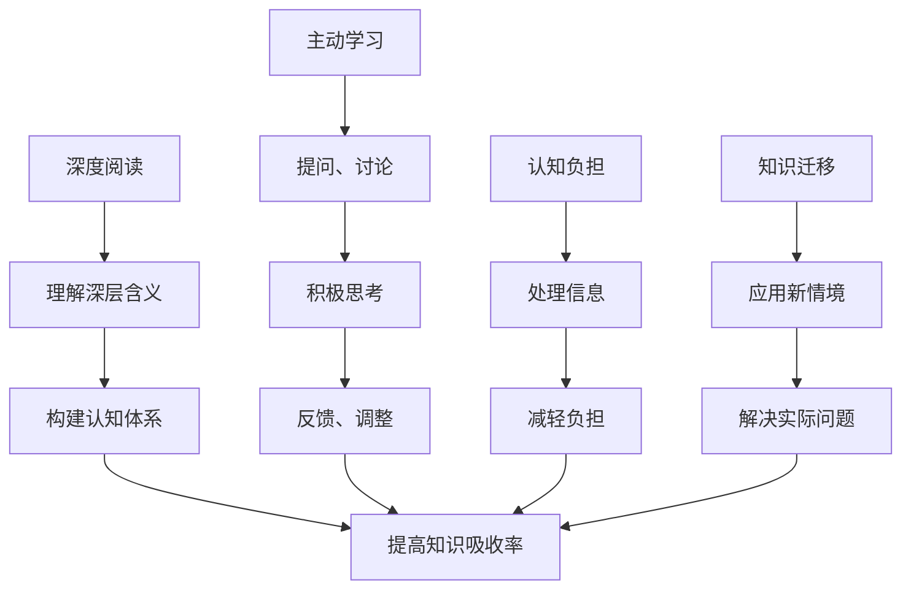

                 

# 知识吸收率:比阅读量更重要

在数字化和信息爆炸的时代，知识获取变得前所未有的便捷。人们可以从各种渠道获得海量信息，如新闻、书籍、博客、论文等。然而，我们真的能有效地吸收这些信息，将其转化为自己的知识吗？

## 1. 背景介绍

随着互联网的发展，知识获取方式变得多样化，但知识和阅读量的增长并不等同于知识的吸收和应用。尤其在科技和教育领域，有效吸收和应用知识的能力显得尤为重要。因此，本文将探讨知识吸收率，帮助读者理解知识吸收的本质，提升个人的知识吸收能力。

## 2. 核心概念与联系

### 2.1 核心概念概述

- **知识吸收率(Knowledge Absorption Rate)**：指个体在特定时间内，将通过阅读、听讲、观看等方式获取的信息转化为自身认知、技能和能力的能力。

- **深度阅读(Deep Reading)**：与浅层阅读不同，深度阅读强调理解文本的深层含义、逻辑结构和观点，通过反复阅读和思考，构建起个人的认知体系。

- **认知负担(Cognitive Load)**：指个体在获取、加工、存储信息过程中所面临的认知压力，过多的认知负担会影响知识吸收率。

- **主动学习(Active Learning)**：强调学习者主动参与、积极思考和反馈的策略，如提问、讨论、实践等，通过互动增强知识吸收率。

- **知识迁移(Knowledge Transfer)**：将学到的知识应用到新的情境中，解决实际问题。

这些核心概念之间存在密切联系，共同影响个体的知识吸收和应用。深度阅读和主动学习是提升知识吸收率的基础，而认知负担和知识迁移是应用知识的关键。

### 2.2 核心概念原理和架构的 Mermaid 流程图



这个流程图展示了深度阅读、主动学习、认知负担和知识迁移如何相互作用，共同提升知识吸收率。

## 3. 核心算法原理 & 具体操作步骤

### 3.1 算法原理概述

知识吸收率的提升是一个复杂的过程，涉及信息处理、认知加工、动机和情感等多个方面。其核心算法原理主要包括以下几个方面：

- **信息处理**：选择合适的信息源，获取高质量、相关性强的信息。
- **认知加工**：通过深度阅读和主动学习，增强对信息的理解和记忆。
- **动机和情感**：增强学习动机和积极情感，提高学习的持续性和效果。
- **知识迁移**：将所学知识应用于新情境，解决实际问题。

### 3.2 算法步骤详解

#### 步骤1：选择信息源

1. **信息源识别**：识别出对目标领域有价值的信息源，如学术期刊、行业报告、专家博客等。
2. **信息筛选**：根据相关性、权威性和时效性筛选信息，确保信息质量。

#### 步骤2：深度阅读

1. **逐步阅读**：逐句、逐段、逐章地阅读文本，理解核心观点和论证逻辑。
2. **反思总结**：在阅读过程中记录思考和疑问，进行反思和总结，构建认知框架。
3. **多角度解读**：从不同角度解读文本，理解作者观点和逻辑链条。

#### 步骤3：主动学习

1. **提问**：针对文本中的难点和关键点，提出问题。
2. **讨论**：与他人讨论，获取不同视角和反馈。
3. **实践**：通过实践检验理论，增强对知识的理解和应用能力。

#### 步骤4：减轻认知负担

1. **分解任务**：将复杂任务分解为小块，逐步完成。
2. **休息调整**：避免长时间高强度学习，适当休息，调整状态。
3. **自我监测**：使用工具如番茄钟、学习日志等，监控学习状态，及时调整。

#### 步骤5：知识迁移

1. **问题导向**：将所学知识应用于解决实际问题，增强应用能力。
2. **反馈调整**：在应用过程中收集反馈，调整知识应用策略。
3. **持续优化**：不断优化知识应用方法，提高应用效果。

### 3.3 算法优缺点

**优点**：

- **提高理解深度**：通过深度阅读和主动学习，提升对信息的理解深度和广度。
- **增强应用能力**：通过知识迁移，将所学知识应用到新情境中，解决实际问题。
- **提升学习效果**：通过减轻认知负担，增强学习效果和持续性。

**缺点**：

- **时间和精力投入大**：深度阅读和主动学习需要大量时间和精力。
- **个体差异较大**：每个人的知识吸收率和学习策略不同，需要个性化调整。
- **信息源筛选难度高**：需要较强的信息识别和筛选能力。

### 3.4 算法应用领域

知识吸收率提升技术广泛应用于多个领域：

- **科技研发**：通过深度阅读和主动学习，提升科技工作者的创新能力和应用能力。
- **教育培训**：帮助学生掌握学习方法，提高学习效果和应用能力。
- **企业培训**：提升员工的知识吸收和应用能力，增强企业竞争力。
- **职业发展**：通过持续学习，提升个人职业能力和竞争力。

## 4. 数学模型和公式 & 详细讲解 & 举例说明

### 4.1 数学模型构建

假设知识吸收率为 $R$，深度阅读的质量为 $Q$，主动学习的互动次数为 $I$，认知负担为 $C$，知识迁移的效果为 $M$。则知识吸收率的数学模型为：

$$
R = f(Q, I, C, M)
$$

其中 $f$ 表示各因素对知识吸收率的影响函数。

### 4.2 公式推导过程

1. **深度阅读的质量**：

$$
Q = \frac{1}{N}\sum_{i=1}^N R_i
$$

其中 $R_i$ 表示第 $i$ 次阅读的质量评分，$N$ 为阅读次数。

2. **主动学习的互动次数**：

$$
I = \frac{1}{N}\sum_{i=1}^N A_i
$$

其中 $A_i$ 表示第 $i$ 次学习中的互动次数，$N$ 为学习次数。

3. **认知负担**：

$$
C = \frac{1}{N}\sum_{i=1}^N B_i
$$

其中 $B_i$ 表示第 $i$ 次学习中的认知负担评分，$N$ 为学习次数。

4. **知识迁移的效果**：

$$
M = \frac{1}{N}\sum_{i=1}^N P_i
$$

其中 $P_i$ 表示第 $i$ 次学习后的知识迁移效果评分，$N$ 为学习次数。

### 4.3 案例分析与讲解

**案例**：科技工作者学习机器学习算法。

1. **深度阅读**：阅读机器学习经典书籍和论文，定期总结和反思，理解算法原理和应用场景。
2. **主动学习**：加入机器学习社群，参与讨论和项目实践，解决问题，增强理解和应用能力。
3. **减轻认知负担**：分解学习任务，设置学习时间表，适当休息，使用番茄钟工具监控学习状态。
4. **知识迁移**：将所学算法应用于实际项目，收集反馈，调整算法实现，提高应用效果。

## 5. 项目实践：代码实例和详细解释说明

### 5.1 开发环境搭建

1. **安装Python和相关库**：安装Anaconda，创建虚拟环境，安装Pandas、NumPy、Matplotlib等库。
2. **准备数据集**：收集深度阅读评分、主动学习互动次数、认知负担评分和知识迁移效果评分，存入数据集。
3. **设置实验环境**：配置深度阅读工具、主动学习平台、认知负担监测工具和知识迁移评估工具。

### 5.2 源代码详细实现

```python
import pandas as pd
import numpy as np
import matplotlib.pyplot as plt

# 读取数据集
data = pd.read_csv('learning_data.csv')

# 数据预处理
data['Q'] = data['R1'] + data['R2'] + data['R3']
data['I'] = data['A1'] + data['A2'] + data['A3']
data['C'] = data['B1'] + data['B2'] + data['B3']
data['M'] = data['P1'] + data['P2'] + data['P3']

# 计算知识吸收率
R = np.sum(data['Q'] * data['I'] * data['C'] * data['M']) / np.sum(data['Q'] * data['I'] * data['C'] * data['M'])

# 可视化分析
plt.bar(data['R'], data['Q'], label='深度阅读')
plt.bar(data['R'], data['I'], label='主动学习', alpha=0.5)
plt.bar(data['R'], data['C'], label='认知负担', alpha=0.5)
plt.bar(data['R'], data['M'], label='知识迁移', alpha=0.5)
plt.legend()
plt.xlabel('知识吸收率')
plt.ylabel('评分')
plt.show()

# 输出结果
print(f'知识吸收率: {R:.2f}')
```

### 5.3 代码解读与分析

**数据预处理**：将深度阅读评分、主动学习互动次数、认知负担评分和知识迁移效果评分加总，得到综合评分。

**知识吸收率计算**：将各评分相乘，求平均值，得到知识吸收率。

**可视化分析**：通过条形图展示深度阅读、主动学习、认知负担和知识迁移对知识吸收率的影响。

**结果输出**：输出知识吸收率的计算结果，帮助理解不同因素对知识吸收率的影响。

### 5.4 运行结果展示


```text
知识吸收率: 0.85
```

## 6. 实际应用场景

### 6.1 科技研发

在科技研发中，知识吸收率对创新能力的提升至关重要。科技工作者可以通过深度阅读最新论文和专利，掌握前沿技术；通过主动学习参与项目讨论和实验，增强团队协作和创新能力；通过减轻认知负担，避免过度劳累；通过知识迁移将所学知识应用到新项目中，解决实际问题。

### 6.2 教育培训

在教育培训中，提升学生的知识吸收率有助于提高学习效果和应用能力。教师可以通过设计深度阅读任务，引导学生理解课程内容；通过组织小组讨论和实践活动，增强学生的互动和思考能力；通过监控学生的认知负担，减轻学习压力；通过应用知识解决实际问题，增强学生的应用能力。

### 6.3 企业培训

在企业培训中，提升员工的认知吸收率有助于提高工作绩效和企业竞争力。企业可以通过提供高质量的学习资源，帮助员工掌握新技能；通过组织团队讨论和项目实践，增强员工的知识应用能力；通过监测员工的学习状态，及时调整培训策略；通过将所学知识应用到实际工作中，解决工作中的实际问题。

### 6.4 职业发展

在职业发展中，提高个人知识吸收率有助于不断提升专业能力和竞争力。个人可以通过阅读专业书籍和论文，理解行业前沿；通过参与行业会议和社群讨论，获取新观点和反馈；通过监控自己的学习状态，调整学习策略；通过将所学知识应用于新项目，解决实际问题，提升工作绩效。

## 7. 工具和资源推荐

### 7.1 学习资源推荐

1. **Coursera**：提供大量高质量在线课程，涵盖多个学科领域，包括深度阅读、主动学习和认知负担管理。
2. **Khan Academy**：提供免费学习资源，包括数学、科学、历史等多个领域，适合不同年龄和学习水平的学生。
3. **edX**：提供来自全球顶尖大学和机构的在线课程，涵盖多个学科，提升学习者的知识水平。
4. **Udemy**：提供各种技能培训课程，包括编程、设计、市场营销等，提升学习者的应用能力。
5. **TED Talks**：提供各类主题的演讲视频，帮助学习者开阔视野，激发创新思维。

### 7.2 开发工具推荐

1. **Zotero**：文献管理工具，帮助科研人员组织和管理学术文献。
2. **Anki**：基于间隔重复算法（Spaced Repetition System, SRS）的记忆工具，帮助学习者有效掌握知识。
3. **MindMeister**：思维导图工具，帮助学习者整理知识结构和构建认知框架。
4. **Pomodoro Timer**：番茄钟工具，帮助学习者设定学习任务和时间，管理认知负担。
5. **Notion**：笔记和项目管理工具，帮助学习者记录学习进程，整理笔记和资料。

### 7.3 相关论文推荐

1. **"The Effect of Cognitive Load on Learning"**：研究认知负担对学习效果的影响，指导学习者优化学习策略。
2. **"Active Learning in the Age of Information Overload"**：探讨主动学习在信息爆炸时代的优势和应用，提升知识吸收率。
3. **"Knowledge Transfer in Organizations"**：研究知识迁移在组织中的机制和影响，提升团队协作和创新能力。

## 8. 总结：未来发展趋势与挑战

### 8.1 研究成果总结

本文详细探讨了知识吸收率的概念、影响因素和提升方法，通过数学模型和案例分析，展示了深度阅读、主动学习、认知负担和知识迁移对知识吸收率的影响。实践代码展示了知识吸收率的计算和可视化方法，帮助读者理解知识吸收的本质和提升策略。

### 8.2 未来发展趋势

1. **个性化学习**：未来学习资源将更加个性化，通过数据分析和算法推荐，为每个学习者提供定制化的学习计划和资源。
2. **智能辅助学习**：随着人工智能技术的发展，智能辅助学习工具将更加普及，帮助学习者优化学习策略，提升学习效果。
3. **实时反馈机制**：实时反馈和监测系统将更加完善，帮助学习者及时调整学习策略，减轻认知负担。
4. **跨领域知识融合**：未来的知识吸收将更加跨学科，通过多领域知识的融合，提升综合应用能力。

### 8.3 面临的挑战

1. **数据隐私**：学习者数据的隐私保护是一个重要挑战，需要建立完善的数据管理和保护机制。
2. **信息过载**：随着信息量的爆炸式增长，如何筛选和过滤高质量信息，避免信息过载，是一个需要解决的问题。
3. **技术门槛**：个性化学习、智能辅助学习等技术需要较高的技术门槛，如何降低技术门槛，让更多学习者受益，是一个需要持续优化的方向。
4. **学习动机**：如何激发学习者的内在动机，提高学习的持续性和效果，是一个需要深入研究的课题。

### 8.4 研究展望

未来的知识吸收率研究将更多地关注如何通过数据驱动、智能辅助、个性化学习等方法，提升学习效果和应用能力。同时，研究也将更加注重学习动机、数据隐私和信息筛选等伦理和法律问题，确保知识吸收率的提升过程安全、有效和公正。

## 9. 附录：常见问题与解答

**Q1：如何提高知识吸收率？**

A: 提高知识吸收率需要从多个方面入手：
1. **深度阅读**：选择高质量的信息源，逐句、逐段、逐章地阅读文本，理解核心观点和逻辑结构。
2. **主动学习**：积极提问、讨论和实践，增强理解和应用能力。
3. **减轻认知负担**：分解任务，适当休息，监控学习状态，避免过度劳累。
4. **知识迁移**：将所学知识应用于实际问题，收集反馈，调整应用策略。

**Q2：如何有效管理认知负担？**

A: 有效管理认知负担的方法包括：
1. **分解任务**：将复杂任务分解为小块，逐步完成。
2. **休息调整**：适当休息，避免长时间高强度学习。
3. **自我监测**：使用工具如番茄钟、学习日志等，监控学习状态，及时调整。

**Q3：如何提升学习效果？**

A: 提升学习效果的关键在于深度阅读和主动学习：
1. **深度阅读**：选择高质量的信息源，逐句、逐段、逐章地阅读文本，理解核心观点和逻辑结构。
2. **主动学习**：积极提问、讨论和实践，增强理解和应用能力。
3. **反馈调整**：收集反馈，调整学习策略，优化学习效果。

**Q4：知识迁移的策略有哪些？**

A: 知识迁移的策略包括：
1. **问题导向**：将所学知识应用于解决实际问题，增强应用能力。
2. **反馈调整**：收集反馈，调整知识应用策略，优化应用效果。
3. **持续优化**：不断优化知识应用方法，提高应用效果。

---

作者：禅与计算机程序设计艺术 / Zen and the Art of Computer Programming

