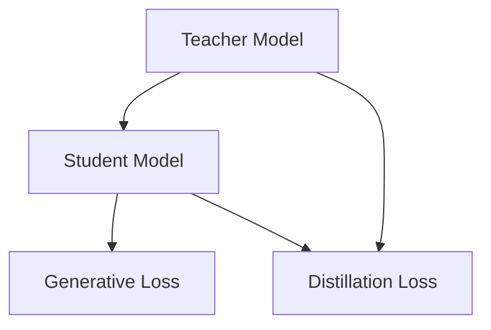

                 

# 知识蒸馏在图像生成任务中的应用探索

> 关键词：知识蒸馏, 图像生成, 神经网络, 自监督学习, 深度学习

## 1. 背景介绍

### 1.1 问题由来

图像生成技术近年来取得了巨大的进展，主要得益于深度学习和大规模数据训练。其中，生成对抗网络（GANs）和变分自编码器（VAEs）等模型成为图像生成的主流方法。这些模型通常以无监督的方式学习数据的潜在分布，并生成高质量的图像。

然而，这些无监督学习方法存在诸多挑战，包括训练不稳定、生成的图像多样性不足等问题。为了克服这些问题，研究人员提出了知识蒸馏（Knowledge Distillation）方法，通过有监督的学习方式，将高能力模型（Teacher）的知识转移到低能力模型（Student）中。知识蒸馏方法不仅能够提高模型的泛化能力，还能降低模型复杂度，加速训练过程。

在图像生成任务中，知识蒸馏方法可以用于提升生成模型的多样性、质量和可控性。通过对已有模型的蒸馏，生成模型可以学习到更多的生成技巧和细节，同时减少训练时间和计算成本。

### 1.2 问题核心关键点

知识蒸馏在图像生成任务中的应用涉及以下几个关键问题：
1. 如何选择合适的Teacher和Student模型结构？
2. 知识蒸馏的损失函数如何设计？
3. 知识蒸馏的训练策略如何设定？
4. 知识蒸馏在图像生成任务中的效果如何评估？

本文将围绕这些问题，详细探讨知识蒸馏在图像生成任务中的应用。

## 2. 核心概念与联系

### 2.1 核心概念概述

在图像生成任务中，知识蒸馏方法主要涉及以下几个概念：

- **Teacher模型**：通常是一个经过充分训练的预训练模型，能够生成高质量的图像。
- **Student模型**：一个相对简单的模型，用于学习Teacher模型的生成技巧和细节。
- **知识蒸馏**：通过有监督的学习方式，将Teacher模型的知识转移到Student模型中。
- **生成损失（Generative Loss）**：用于评估Student模型生成图像的质量，通常基于图像的像素值、几何特征等。
- **蒸馏损失（Distillation Loss）**：用于评估Teacher模型和Student模型之间的差距，通常基于教师模型的输出与学生模型的输出之间的距离。

这些概念之间的逻辑关系可以通过以下Mermaid流程图来展示：



这个流程图展示了知识蒸馏的过程：Teacher模型将知识传授给Student模型，Student模型通过生成损失和蒸馏损失来学习和优化。

## 3. 核心算法原理 & 具体操作步骤

### 3.1 算法原理概述

知识蒸馏在图像生成任务中的核心思想是，通过有监督的方式，将Teacher模型的知识（即生成的高质量图像）转移到Student模型中。知识蒸馏方法通过设计合理的损失函数和训练策略，使得Student模型在生成图像时能够尽可能地与Teacher模型相似。

知识蒸馏的过程可以形式化地表示为：

$$
\min_{\theta_S} \mathcal{L}_S = \alpha \mathcal{L}_G + \beta \mathcal{L}_D
$$

其中，$\theta_S$表示Student模型的参数，$\alpha$和$\beta$是平衡系数，$\mathcal{L}_G$和$\mathcal{L}_D$分别表示生成损失和蒸馏损失。

### 3.2 算法步骤详解

知识蒸馏在图像生成任务中的操作步骤包括：

1. **选择Teacher模型和Student模型**：选择合适的预训练模型作为Teacher模型，并设计合适的Student模型结构。
2. **设定蒸馏损失函数**：设计合理的蒸馏损失函数，如最大似然损失、均方误差损失等。
3. **训练Student模型**：在Teacher模型的指导下，使用生成的标注数据（真实图像和对应的标签）来训练Student模型。
4. **评估和优化**：在训练过程中，定期评估Student模型的生成质量，根据评估结果调整生成损失和蒸馏损失的权重，以优化Student模型的性能。

### 3.3 算法优缺点

知识蒸馏方法在图像生成任务中具有以下优点：
1. **提升生成质量**：通过学习高质量的Teacher模型，Student模型能够生成更高质量的图像。
2. **降低计算成本**：通过减少Student模型的复杂度，能够降低训练时间和计算成本。
3. **提高泛化能力**：知识蒸馏方法能够提高Student模型的泛化能力，使其在未见过的数据上也能生成高质量的图像。

同时，知识蒸馏方法也存在以下缺点：
1. **依赖Teacher模型**：知识蒸馏的效果很大程度上依赖于Teacher模型的质量，如果Teacher模型性能不佳，可能会导致Student模型性能不理想。
2. **蒸馏过程中存在信息丢失**：在蒸馏过程中，部分 Teacher 模型的知识可能会丢失，导致 Student 模型的表现不如预期。
3. **训练复杂度较高**：知识蒸馏需要设计合适的蒸馏损失函数和训练策略，对研究者要求较高，需要更多的实验和调试。

### 3.4 算法应用领域

知识蒸馏方法在图像生成任务中有着广泛的应用，包括但不限于：

- **风格迁移**：通过知识蒸馏，将一幅图像的风格迁移到另一幅图像中。
- **图像增强**：通过学习Teacher模型，增强Student模型的图像生成能力。
- **图像超分辨率**：通过知识蒸馏，提高Student模型对低分辨率图像的超分辨率能力。
- **图像去噪**：通过学习Teacher模型，提升Student模型对噪声图像的还原能力。

## 4. 数学模型和公式 & 详细讲解

### 4.1 数学模型构建

在图像生成任务中，知识蒸馏方法通常使用最大似然损失函数和蒸馏损失函数来设计。假设Teacher模型生成了高质量的图像$\hat{X}$，Student模型生成了低质量的图像$X$，则知识蒸馏的目标是最小化两者的差异，即：

$$
\min_{\theta_S} \mathcal{L} = \alpha \mathcal{L}_G + \beta \mathcal{L}_D
$$

其中，$\alpha$和$\beta$是平衡系数，$\mathcal{L}_G$是生成损失函数，$\mathcal{L}_D$是蒸馏损失函数。

### 4.2 公式推导过程

以最大似然损失函数为例，其定义为：

$$
\mathcal{L}_G = -\frac{1}{N} \sum_{i=1}^N \log p_{\theta_S}(x_i)
$$

其中，$p_{\theta_S}(x_i)$表示Student模型生成的图像$x_i$的概率分布。

蒸馏损失函数的设计有多种形式，常见的方法包括：

1. **最大似然蒸馏损失**：

$$
\mathcal{L}_D = -\frac{1}{N} \sum_{i=1}^N \log p_{\theta_T}(\hat{x}_i)
$$

其中，$p_{\theta_T}(\hat{x}_i)$表示Teacher模型生成的图像$\hat{x}_i$的概率分布。

2. **均方误差蒸馏损失**：

$$
\mathcal{L}_D = \frac{1}{N} \sum_{i=1}^N (\hat{x}_i - x_i)^2
$$

其中，$\hat{x}_i$和$x_i$分别表示Teacher模型和Student模型生成的图像。

### 4.3 案例分析与讲解

以图像超分辨率为例，假设Teacher模型是具有高超分辨率能力的模型，Student模型是低超分辨率能力的模型。通过知识蒸馏，可以将Teacher模型的超分辨率能力迁移到Student模型中。

具体步骤如下：

1. **选择Teacher和Student模型**：选择预训练的高超分辨率模型作为Teacher模型，设计低超分辨率模型作为Student模型。
2. **设定蒸馏损失函数**：使用均方误差蒸馏损失函数，最小化Teacher模型和Student模型之间的差异。
3. **训练Student模型**：在Teacher模型的指导下，使用低分辨率图像和对应的高分辨率图像作为标注数据，训练Student模型。
4. **评估和优化**：在训练过程中，定期评估Student模型的生成质量，根据评估结果调整生成损失和蒸馏损失的权重，以优化Student模型的性能。

## 5. 项目实践：代码实例和详细解释说明

### 5.1 开发环境搭建

在进行知识蒸馏实践前，我们需要准备好开发环境。以下是使用Python进行PyTorch开发的环境配置流程：

1. 安装Anaconda：从官网下载并安装Anaconda，用于创建独立的Python环境。

2. 创建并激活虚拟环境：
```bash
conda create -n pytorch-env python=3.8 
conda activate pytorch-env
```

3. 安装PyTorch：根据CUDA版本，从官网获取对应的安装命令。例如：
```bash
conda install pytorch torchvision torchaudio cudatoolkit=11.1 -c pytorch -c conda-forge
```

4. 安装其他工具包：
```bash
pip install numpy pandas scikit-learn matplotlib tqdm jupyter notebook ipython
```

完成上述步骤后，即可在`pytorch-env`环境中开始知识蒸馏实践。

### 5.2 源代码详细实现

以下是一个简单的知识蒸馏代码实现示例，使用PyTorch进行图像生成任务的蒸馏：

```python
import torch
import torch.nn as nn
import torch.optim as optim
from torch.utils.data import DataLoader
from torchvision import datasets, transforms

# 定义Teacher和Student模型
class TeacherModel(nn.Module):
    def __init__(self):
        super(TeacherModel, self).__init__()
        # Teacher模型结构

class StudentModel(nn.Module):
    def __init__(self):
        super(StudentModel, self).__init__()
        # Student模型结构

# 定义蒸馏损失函数
class DistillationLoss(nn.Module):
    def __init__(self):
        super(DistillationLoss, self).__init__()
        # 蒸馏损失函数

# 定义生成损失函数
class GenerativeLoss(nn.Module):
    def __init__(self):
        super(GenerativeLoss, self).__init__()
        # 生成损失函数

# 训练函数
def train_epoch(model, data_loader, optimizer):
    model.train()
    loss = 0
    for batch in data_loader:
        inputs, labels = batch
        optimizer.zero_grad()
        outputs = model(inputs)
        loss = GenerativeLoss()(outputs, labels)
        loss.backward()
        optimizer.step()
        loss += loss.item() * inputs.size(0)
    return loss / len(data_loader.dataset)

# 评估函数
def evaluate(model, data_loader):
    model.eval()
    loss = 0
    for batch in data_loader:
        inputs, labels = batch
        outputs = model(inputs)
        loss += GenerativeLoss()(outputs, labels).item()
    return loss / len(data_loader.dataset)

# 主函数
def main():
    # 加载数据集
    transform = transforms.Compose([
        transforms.ToTensor(),
        transforms.Normalize((0.5, 0.5, 0.5), (0.5, 0.5, 0.5))
    ])
    train_data = datasets.CIFAR10(root='./data', train=True, download=True, transform=transform)
    test_data = datasets.CIFAR10(root='./data', train=False, download=True, transform=transform)
    train_loader = DataLoader(train_data, batch_size=64, shuffle=True)
    test_loader = DataLoader(test_data, batch_size=64, shuffle=False)

    # 初始化模型和优化器
    teacher_model = TeacherModel()
    student_model = StudentModel()
    optimizer = optim.Adam([p for p in student_model.parameters() if p.requires_grad])

    # 训练和评估模型
    for epoch in range(100):
        train_loss = train_epoch(student_model, train_loader, optimizer)
        test_loss = evaluate(student_model, test_loader)
        print(f'Epoch {epoch+1}, train loss: {train_loss:.4f}, test loss: {test_loss:.4f}')

    # 保存模型
    torch.save(student_model.state_dict(), 'student_model.pth')

if __name__ == '__main__':
    main()
```

在这个代码示例中，我们使用了PyTorch的深度学习框架，定义了Teacher模型、Student模型、蒸馏损失函数和生成损失函数。通过加载CIFAR-10数据集，训练和评估Student模型，最终保存了Student模型的权重参数。

### 5.3 代码解读与分析

让我们再详细解读一下关键代码的实现细节：

**TeacherModel和StudentModel类**：
- `__init__`方法：初始化模型结构，包括卷积层、激活函数等。
- 定义了教师模型和学生模型的不同之处。

**DistillationLoss和GenerativeLoss类**：
- `__init__`方法：初始化蒸馏损失函数和生成损失函数。
- 蒸馏损失函数计算Teacher模型和Student模型之间的差异。

**train_epoch和evaluate函数**：
- 训练函数：前向传播计算生成损失，反向传播更新参数，返回训练集上的平均损失。
- 评估函数：前向传播计算生成损失，返回验证集上的平均损失。

**main函数**：
- 加载数据集。
- 初始化Teacher模型和Student模型，以及优化器。
- 训练和评估模型，输出训练集和验证集上的平均损失。
- 保存Student模型的权重参数。

这个代码示例展示了使用PyTorch进行知识蒸馏的基本流程。通过不断迭代训练，我们可以得到高质量的Student模型，用于生成图像。

## 6. 实际应用场景

### 6.1 图像风格迁移

图像风格迁移是知识蒸馏在图像生成任务中的典型应用之一。通过知识蒸馏，可以将一幅图像的风格迁移到另一幅图像中，生成具有特定风格的图像。

在实际应用中，可以选择一个已经训练好的风格迁移模型作为Teacher模型，设计一个低复杂度的学生模型作为Student模型。通过蒸馏损失函数，将Teacher模型的风格迁移到Student模型中。

### 6.2 图像增强

图像增强是另一个常见的应用场景。通过知识蒸馏，可以增强图像的亮度、对比度、清晰度等。

具体而言，可以选择一个已经训练好的图像增强模型作为Teacher模型，设计一个低复杂度的学生模型作为Student模型。通过蒸馏损失函数，将Teacher模型的增强能力迁移到Student模型中。

### 6.3 图像超分辨率

图像超分辨率是知识蒸馏在图像生成任务中的重要应用之一。通过知识蒸馏，可以将低分辨率图像转换为高分辨率图像。

在实际应用中，可以选择一个已经训练好的超分辨率模型作为Teacher模型，设计一个低复杂度的学生模型作为Student模型。通过蒸馏损失函数，将Teacher模型的超分辨率能力迁移到Student模型中。

### 6.4 未来应用展望

随着知识蒸馏技术的不断发展和完善，其在图像生成任务中的应用将更加广泛和深入。未来，知识蒸馏技术有望在以下几个方面取得新的突破：

1. **多模态知识蒸馏**：将图像、文本、语音等多种模态数据融合，提升知识蒸馏的效果。
2. **自监督知识蒸馏**：通过自监督学习方式，提升知识蒸馏的泛化能力。
3. **动态知识蒸馏**：根据数据分布的变化，动态调整蒸馏损失函数和蒸馏策略，提高知识蒸馏的适应性。

## 7. 工具和资源推荐

### 7.1 学习资源推荐

为了帮助开发者系统掌握知识蒸馏的理论基础和实践技巧，这里推荐一些优质的学习资源：

1. 《Knowledge Distillation for Deep Learning: A Survey and taxonomy》系列博文：由知识蒸馏领域的权威专家撰写，系统介绍了知识蒸馏的理论基础、方法和应用。

2. Deep Learning with PyTorch系列书籍：介绍PyTorch框架，包含知识蒸馏的案例和实践。

3 CS231n《Convolutional Neural Networks for Visual Recognition》课程：斯坦福大学开设的计算机视觉课程，涵盖了知识蒸馏在图像生成任务中的应用。

4 《Natural Language Processing with Transformers》书籍：Transformer库的作者所著，全面介绍了如何使用Transformers库进行NLP任务开发，包括知识蒸馏在内的诸多范式。

5 Weights & Biases：模型训练的实验跟踪工具，可以记录和可视化模型训练过程中的各项指标，方便对比和调优。

6 TensorBoard：TensorFlow配套的可视化工具，可实时监测模型训练状态，并提供丰富的图表呈现方式，是调试模型的得力助手。

通过对这些资源的学习实践，相信你一定能够快速掌握知识蒸馏的精髓，并用于解决实际的图像生成问题。

### 7.2 开发工具推荐

高效的开发离不开优秀的工具支持。以下是几款用于知识蒸馏开发的常用工具：

1. PyTorch：基于Python的开源深度学习框架，灵活动态的计算图，适合快速迭代研究。大部分预训练语言模型都有PyTorch版本的实现。

2 TensorFlow：由Google主导开发的开源深度学习框架，生产部署方便，适合大规模工程应用。同样有丰富的预训练语言模型资源。

3 Transformers库：HuggingFace开发的NLP工具库，集成了众多SOTA语言模型，支持PyTorch和TensorFlow，是进行知识蒸馏任务开发的利器。

4 Weights & Biases：模型训练的实验跟踪工具，可以记录和可视化模型训练过程中的各项指标，方便对比和调优。与主流深度学习框架无缝集成。

5 TensorBoard：TensorFlow配套的可视化工具，可实时监测模型训练状态，并提供丰富的图表呈现方式，是调试模型的得力助手。

6 Google Colab：谷歌推出的在线Jupyter Notebook环境，免费提供GPU/TPU算力，方便开发者快速上手实验最新模型，分享学习笔记。

合理利用这些工具，可以显著提升知识蒸馏任务的开发效率，加快创新迭代的步伐。

### 7.3 相关论文推荐

知识蒸馏技术的发展源于学界的持续研究。以下是几篇奠基性的相关论文，推荐阅读：

1. FitNets: A Simple Framework for Knowledge Distillation（FitNets论文）：提出一种简单有效的知识蒸馏方法，将大模型的知识迁移到小模型中。

2. Distillation as a Regularizer: Going Deeper without Increasing Overfitting（Distillation as a Regularizer论文）：将知识蒸馏作为一种正则化手段，提升模型的泛化能力。

3. Towards Transferable Learning with Big Data（Towards Transferable Learning论文）：讨论了如何通过大规模数据实现知识蒸馏，提升模型的泛化能力。

4 PixelRNN Distillation: Exploring Transfer Learning for Pixel-Level Pseudo Label Generation（PixelRNN Distillation论文）：通过知识蒸馏生成高精度的像素级伪标签，提升模型性能。

5 Automated Distillation of Deep Architectures for Smartphone Cameras（Automated Distillation论文）：提出一种自动化知识蒸馏方法，用于提升智能手机相机生成图像的质量。

这些论文代表了大语言模型微调技术的发展脉络。通过学习这些前沿成果，可以帮助研究者把握学科前进方向，激发更多的创新灵感。

## 8. 总结：未来发展趋势与挑战

### 8.1 总结

本文对知识蒸馏在图像生成任务中的应用进行了全面系统的介绍。首先阐述了知识蒸馏方法的基本原理和核心概念，明确了知识蒸馏在图像生成任务中的重要价值。其次，从原理到实践，详细讲解了知识蒸馏的数学模型和操作步骤，给出了知识蒸馏任务开发的完整代码实例。同时，本文还探讨了知识蒸馏方法在图像风格迁移、图像增强、图像超分辨率等多个应用场景中的应用前景，展示了知识蒸馏方法的广阔应用空间。此外，本文精选了知识蒸馏技术的各类学习资源，力求为读者提供全方位的技术指引。

通过本文的系统梳理，可以看到，知识蒸馏方法在大规模图像生成任务中具有重要应用价值，通过有监督的方式，能够将高质量的Teacher模型的知识迁移到Student模型中，显著提升生成图像的质量和多样性。未来，知识蒸馏方法在图像生成任务中还有着广阔的发展前景。

### 8.2 未来发展趋势

展望未来，知识蒸馏方法在图像生成任务中将呈现以下几个发展趋势：

1. **多模态知识蒸馏**：将图像、文本、语音等多种模态数据融合，提升知识蒸馏的效果。
2. **自监督知识蒸馏**：通过自监督学习方式，提升知识蒸馏的泛化能力。
3. **动态知识蒸馏**：根据数据分布的变化，动态调整蒸馏损失函数和蒸馏策略，提高知识蒸馏的适应性。

### 8.3 面临的挑战

尽管知识蒸馏方法在图像生成任务中取得了显著效果，但在迈向更加智能化、普适化应用的过程中，仍面临诸多挑战：

1. **依赖Teacher模型**：知识蒸馏的效果很大程度上依赖于Teacher模型的质量，如果Teacher模型性能不佳，可能会导致Student模型性能不理想。
2. **蒸馏过程中存在信息丢失**：在蒸馏过程中，部分 Teacher 模型的知识可能会丢失，导致 Student 模型的表现不如预期。
3. **训练复杂度较高**：知识蒸馏需要设计合适的蒸馏损失函数和训练策略，对研究者要求较高，需要更多的实验和调试。

### 8.4 研究展望

面对知识蒸馏面临的这些挑战，未来的研究需要在以下几个方面寻求新的突破：

1. **提升Teacher模型的性能**：通过改进Teacher模型的训练方法，提升其生成质量，增强知识蒸馏的效果。
2. **优化蒸馏损失函数**：设计更加合理的蒸馏损失函数，减少信息丢失，提升知识蒸馏的准确性。
3. **引入更多先验知识**：将符号化的先验知识，如知识图谱、逻辑规则等，与神经网络模型进行巧妙融合，引导知识蒸馏过程学习更准确、合理的语言模型。

这些研究方向的探索，必将引领知识蒸馏技术迈向更高的台阶，为构建安全、可靠、可解释、可控的智能系统铺平道路。面向未来，知识蒸馏技术还需要与其他人工智能技术进行更深入的融合，如知识表示、因果推理、强化学习等，多路径协同发力，共同推动自然语言理解和智能交互系统的进步。只有勇于创新、敢于突破，才能不断拓展知识蒸馏的边界，让智能技术更好地造福人类社会。

## 9. 附录：常见问题与解答

**Q1：知识蒸馏是否适用于所有图像生成任务？**

A: 知识蒸馏在大多数图像生成任务上都能取得不错的效果，特别是对于数据量较小的任务。但对于一些特定领域的任务，如医学、法律等，仅仅依靠通用语料预训练的模型可能难以很好地适应。此时需要在特定领域语料上进一步预训练，再进行蒸馏，才能获得理想效果。此外，对于一些需要时效性、个性化很强的任务，如对话、推荐等，知识蒸馏方法也需要针对性的改进优化。

**Q2：知识蒸馏过程中如何选择Teacher和Student模型？**

A: 选择Teacher和Student模型时，应根据具体任务需求和数据规模，设计合适的模型结构。对于高复杂度、高精度的任务，可以选择较大的Teacher模型；对于低复杂度、低精度的任务，可以选择较小的Student模型。同时，应确保Teacher和Student模型之间的计算图结构相似，避免出现网络结构不匹配的问题。

**Q3：知识蒸馏过程中如何设定蒸馏损失函数？**

A: 蒸馏损失函数的设计需要考虑具体任务的特点和要求。常见的蒸馏损失函数包括最大似然损失、均方误差损失等。在实际应用中，可以通过实验对比不同的蒸馏损失函数，选择最适合作业的场景。

**Q4：知识蒸馏在图像生成任务中如何评估生成质量？**

A: 生成质量的评估可以通过多种指标进行，如PSNR（峰值信噪比）、SSIM（结构相似性）、IS（信息瓶颈）等。通过计算生成图像和真实图像之间的差异，评估知识蒸馏的效果。

**Q5：知识蒸馏在图像生成任务中如何优化生成损失和蒸馏损失的权重？**

A: 生成损失和蒸馏损失的权重可以通过交叉验证或超参数调优的方式进行优化。在训练过程中，定期评估模型的生成质量，根据评估结果调整损失函数的权重，以优化知识蒸馏的效果。

---

作者：禅与计算机程序设计艺术 / Zen and the Art of Computer Programming

