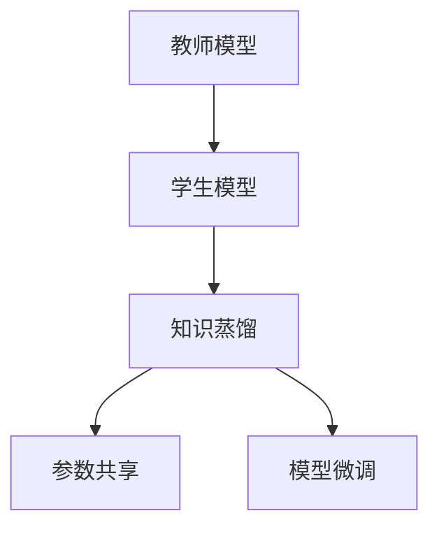

                 

# 知识蒸馏在迁移学习中的应用

> 关键词：知识蒸馏,迁移学习,模型压缩,神经网络,大模型,参数共享,模型微调

## 1. 背景介绍

### 1.1 问题由来
在深度学习领域，模型压缩、模型蒸馏、模型迁移学习等技术都是极富挑战性的研究课题。大模型作为深度学习领域的一大发展趋势，具有参数众多、结构复杂、效果显著的特点，但也面临计算资源消耗巨大、存储成本高昂等问题。

迁移学习作为将已有模型应用于新任务的技术，通过知识传递，可以有效减少新模型的训练成本，提高其性能。然而，如何高效地实现知识传递，仍是一个重要研究问题。

知识蒸馏(Knowledge Distillation, KD)正是近年来提出的解决这一问题的方法。它通过将教师模型(高精度模型)的泛化能力传递到学生模型(小规模模型)中，实现高性能模型的低计算成本复现，从而提升迁移学习的效率和效果。

本文将详细介绍知识蒸馏的基本原理、操作步骤以及具体实现，展示其在迁移学习中的应用案例，并对其优缺点进行分析。

## 2. 核心概念与联系

### 2.1 核心概念概述

为更好地理解知识蒸馏在迁移学习中的应用，本节将介绍几个密切相关的核心概念：

- 知识蒸馏(Knowledge Distillation, KD)：一种通过训练一个较简单的学生模型来模仿一个复杂教师模型的知识，从而提升模型泛化能力的技巧。
- 迁移学习(Transfer Learning)：将一个领域学到的知识，迁移应用到另一个不同但相关的领域的学习范式。知识蒸馏是迁移学习的一种重要实现手段。
- 模型压缩(Model Compression)：通过优化模型结构、降低模型参数、减少计算量等手段，实现高效存储和计算的目的。知识蒸馏是模型压缩的一种有效方式。
- 大模型(Large Model)：指具有超过亿级别参数的深度神经网络模型，如BERT、GPT等。其泛化能力强，效果显著，但也存在计算成本高、存储开销大的问题。
- 教师模型(Teacher Model)：指的是性能更优、规模更大的深度神经网络模型，可以作为知识蒸馏的源模型。
- 学生模型(Student Model)：指的是规模更小、参数更少的深度神经网络模型，用于接收并学习教师模型的知识。

这些核心概念之间的逻辑关系可以通过以下Mermaid流程图来展示：



这个流程图展示了知识蒸馏的逻辑流程：

1. 教师模型与学生模型在输入层和输出层之间进行参数共享，保证学生模型能够学习到教师模型的关键特征。
2. 知识蒸馏过程通过迁移学习来实现，利用教师模型对学生模型的监督指导。
3. 通过微调学生模型，进一步提升其泛化能力和在新任务上的表现。

## 3. 核心算法原理 & 具体操作步骤
### 3.1 算法原理概述

知识蒸馏的核心理念是“从多个角度”理解同一概念。通过将教师模型的知识传递到学生模型中，使其在少数据、少计算成本的情况下也能达到较高的性能，从而实现迁移学习的目标。

知识蒸馏的基本原理可以表示为：

$$
\min_{\theta_s} \mathcal{L}_s(\theta_s, \theta_t, \mathcal{D})
$$

其中，$\theta_s$ 表示学生模型的参数，$\theta_t$ 表示教师模型的参数，$\mathcal{D}$ 表示数据集。知识蒸馏的目标是最小化学生模型在数据集 $\mathcal{D}$ 上的损失函数 $\mathcal{L}_s$，该损失函数包含两部分：教师模型的监督信号 $\mathcal{L}_{teacher}$ 和学生模型自身的预测误差 $\mathcal{L}_{student}$。

$$
\mathcal{L}_s = \alpha \mathcal{L}_{teacher} + (1-\alpha) \mathcal{L}_{student}
$$

其中 $\alpha$ 为监督信号与学生预测误差之间的平衡系数，可以根据具体情况进行调整。

### 3.2 算法步骤详解

知识蒸馏的实现步骤如下：

**Step 1: 准备教师和学生模型**

- 选择教师模型和学生模型，教师模型通常为大规模预训练模型，学生模型为待微调的模型。
- 冻结教师模型的部分层，保留其关键特征提取能力。
- 设置学生模型的参数可更新，准备进行微调。

**Step 2: 设计知识蒸馏目标**

- 设计学生模型与教师模型之间的损失函数 $\mathcal{L}_{teacher}$ 和 $\mathcal{L}_{student}$，通常包括交叉熵损失、均方误差损失等。
- 设置平衡系数 $\alpha$，确保监督信号与学生模型预测误差之间的平衡。

**Step 3: 训练学生模型**

- 使用教师模型对学生模型进行监督指导，利用教师模型的输出作为监督信号。
- 通过反向传播更新学生模型的参数，最小化总损失函数 $\mathcal{L}_s$。
- 逐步降低监督信号的权重 $\alpha$，训练过程中逐步强化学生模型自身的预测能力。

**Step 4: 学生模型微调**

- 对学生模型进行微调，通常是添加或修改顶层结构，调整输出层参数，以满足特定任务的需求。
- 使用下游任务的数据集 $\mathcal{D}$，继续训练学生模型，进一步提升其在新任务上的表现。

### 3.3 算法优缺点

知识蒸馏的优点包括：

- 高效性：知识蒸馏可以实现高性能模型的低计算成本复现，节省大量时间和算力资源。
- 稳定性：通过学习教师模型的泛化能力，学生模型在新的数据集上表现稳定。
- 可扩展性：知识蒸馏可以应用于各种任务和领域，通过调整学生和教师模型的结构，可以适应不同的应用需求。

然而，知识蒸馏也存在一些缺点：

- 数据需求高：知识蒸馏需要教师模型的监督信号，因此教师模型必须预训练在大规模数据集上，导致数据收集和处理成本高。
- 模型结构复杂：知识蒸馏需要精心设计教师和学生模型的结构，特别是对学生模型的输入层和输出层进行优化，增加了模型的复杂度。
- 过拟合风险：知识蒸馏过程中学生模型容易过拟合教师模型的噪声信息，导致泛化能力下降。

### 3.4 算法应用领域

知识蒸馏技术已经被广泛应用于多个领域，例如：

- 计算机视觉：使用大模型作为教师模型，对轻量级模型进行知识蒸馏，实现高精度模型的低成本部署。
- 自然语言处理：通过知识蒸馏提升小规模语言模型的性能，使其在新任务上表现优异。
- 语音识别：利用大模型对语音识别模型进行蒸馏，提升模型在噪声环境下的鲁棒性。
- 医学影像分析：使用大模型对医学影像分类模型进行蒸馏，提升其诊断精度和泛化能力。
- 交通流量预测：将交通流量预测模型与大模型结合，利用其泛化能力进行迁移学习。

除了这些经典应用，知识蒸馏还可以应用于更多场景中，如工业控制、金融预测、智能推荐等，为实际应用带来了新的突破。

## 4. 数学模型和公式 & 详细讲解  
### 4.1 数学模型构建

本节将使用数学语言对知识蒸馏在迁移学习中的应用进行更加严格的刻画。

记教师模型为 $M_{\theta_t}$，学生模型为 $M_{\theta_s}$，学生模型在数据集 $\mathcal{D}$ 上的损失函数为 $\mathcal{L}_s$，教师模型在数据集 $\mathcal{D}$ 上的损失函数为 $\mathcal{L}_t$。知识蒸馏的目标是最小化学生模型在数据集 $\mathcal{D}$ 上的损失函数，其中：

$$
\mathcal{L}_s = \alpha \mathcal{L}_{teacher} + (1-\alpha) \mathcal{L}_{student}
$$

其中，$\mathcal{L}_{teacher}$ 表示教师模型的监督信号，通常为教师模型在数据集 $\mathcal{D}$ 上的损失函数。$\mathcal{L}_{student}$ 表示学生模型自身的预测误差，通常为学生模型在数据集 $\mathcal{D}$ 上的损失函数。

### 4.2 公式推导过程

以下是知识蒸馏目标函数的推导过程：

1. 定义学生模型与教师模型之间的损失函数 $\mathcal{L}_s$，包括教师模型的监督信号 $\mathcal{L}_{teacher}$ 和学生模型自身的预测误差 $\mathcal{L}_{student}$：

$$
\mathcal{L}_s = \alpha \mathcal{L}_{teacher} + (1-\alpha) \mathcal{L}_{student}
$$

2. 将学生模型和教师模型在数据集 $\mathcal{D}$ 上的损失函数代入：

$$
\mathcal{L}_s = \alpha \mathcal{L}_{M_{\theta_t}(x)} + (1-\alpha) \mathcal{L}_{M_{\theta_s}(x)}
$$

3. 将 $\mathcal{L}_s$ 关于 $\theta_s$ 求导，得到学生模型参数更新的公式：

$$
\frac{\partial \mathcal{L}_s}{\partial \theta_s} = \alpha \frac{\partial \mathcal{L}_{M_{\theta_t}(x)}}{\partial \theta_s} + (1-\alpha) \frac{\partial \mathcal{L}_{M_{\theta_s}(x)}}{\partial \theta_s}
$$

其中，$\frac{\partial \mathcal{L}_{M_{\theta_t}(x)}}{\partial \theta_s}$ 表示教师模型的损失函数对学生模型参数的梯度，$\frac{\partial \mathcal{L}_{M_{\theta_s}(x)}}{\partial \theta_s}$ 表示学生模型的损失函数对学生模型参数的梯度。

### 4.3 案例分析与讲解

以自然语言处理领域的情感分析任务为例，说明知识蒸馏的实现过程。

**Step 1: 准备教师和学生模型**

- 选择教师模型为大规模预训练模型，如BERT。
- 冻结BERT的隐藏层，保留其特征提取能力。
- 设计学生模型为简单分类器，如全连接网络。

**Step 2: 设计知识蒸馏目标**

- 设计学生模型与教师模型之间的损失函数 $\mathcal{L}_s$，包括交叉熵损失：

$$
\mathcal{L}_s = \alpha \mathcal{L}_{BERT} + (1-\alpha) \mathcal{L}_{student}
$$

其中，$\mathcal{L}_{BERT}$ 表示教师模型在数据集 $\mathcal{D}$ 上的损失函数，通常为交叉熵损失。$\mathcal{L}_{student}$ 表示学生模型自身的预测误差，通常为交叉熵损失。

**Step 3: 训练学生模型**

- 使用教师模型对学生模型进行监督指导，利用教师模型的输出作为监督信号。
- 通过反向传播更新学生模型的参数，最小化总损失函数 $\mathcal{L}_s$。
- 逐步降低监督信号的权重 $\alpha$，训练过程中逐步强化学生模型自身的预测能力。

**Step 4: 学生模型微调**

- 对学生模型进行微调，通常是添加或修改顶层结构，调整输出层参数，以满足特定任务的需求。
- 使用下游任务的数据集 $\mathcal{D}$，继续训练学生模型，进一步提升其在新任务上的表现。

## 5. 项目实践：代码实例和详细解释说明
### 5.1 开发环境搭建

在进行知识蒸馏实践前，我们需要准备好开发环境。以下是使用Python进行PyTorch开发的环境配置流程：

1. 安装Anaconda：从官网下载并安装Anaconda，用于创建独立的Python环境。

2. 创建并激活虚拟环境：
```bash
conda create -n pytorch-env python=3.8 
conda activate pytorch-env
```

3. 安装PyTorch：根据CUDA版本，从官网获取对应的安装命令。例如：
```bash
conda install pytorch torchvision torchaudio cudatoolkit=11.1 -c pytorch -c conda-forge
```

4. 安装TensorFlow：如果需要使用TensorFlow进行实验，可以按照以下命令进行安装。例如：
```bash
pip install tensorflow==2.6.0
```

5. 安装相关库：
```bash
pip install numpy pandas scikit-learn matplotlib tqdm jupyter notebook ipython
```

完成上述步骤后，即可在`pytorch-env`环境中开始知识蒸馏实践。

### 5.2 源代码详细实现

这里我们以图像分类任务为例，使用PyTorch实现知识蒸馏过程。

首先，定义教师和学生模型的结构：

```python
import torch
import torch.nn as nn
import torch.optim as optim

class TeacherModel(nn.Module):
    def __init__(self):
        super(TeacherModel, self).__init__()
        self.conv1 = nn.Conv2d(3, 32, 3)
        self.conv2 = nn.Conv2d(32, 64, 3)
        self.pool = nn.MaxPool2d(2)
        self.fc1 = nn.Linear(64 * 28 * 28, 128)
        self.fc2 = nn.Linear(128, 10)

    def forward(self, x):
        x = self.pool(nn.functional.relu(self.conv1(x)))
        x = self.pool(nn.functional.relu(self.conv2(x)))
        x = x.view(-1, 64 * 28 * 28)
        x = nn.functional.relu(self.fc1(x))
        x = self.fc2(x)
        return x

class StudentModel(nn.Module):
    def __init__(self):
        super(StudentModel, self).__init__()
        self.conv1 = nn.Conv2d(3, 32, 3)
        self.conv2 = nn.Conv2d(32, 64, 3)
        self.pool = nn.MaxPool2d(2)
        self.fc1 = nn.Linear(64 * 28 * 28, 128)
        self.fc2 = nn.Linear(128, 10)

    def forward(self, x):
        x = self.pool(nn.functional.relu(self.conv1(x)))
        x = self.pool(nn.functional.relu(self.conv2(x)))
        x = x.view(-1, 64 * 28 * 28)
        x = nn.functional.relu(self.fc1(x))
        x = self.fc2(x)
        return x
```

然后，定义知识蒸馏目标函数：

```python
class KnowledgeDistillation(nn.Module):
    def __init__(self, student, teacher):
        super(KnowledgeDistillation, self).__init__()
        self.student = student
        self.teacher = teacher

    def forward(self, x):
        pred_student = self.student(x)
        pred_teacher = self.teacher(x)
        return pred_student, pred_teacher

def distill_loss(student, teacher, student_model, teacher_model):
    distillation = KnowledgeDistillation(student_model, teacher_model)
    logits_student, logits_teacher = distillation(torch.randn(1, 3, 28, 28))
    criterion = nn.CrossEntropyLoss()
    loss = criterion(logits_student, logits_teacher)
    return loss
```

接着，定义训练和评估函数：

```python
def train(model, train_loader, optimizer, loss_fn, device):
    model.train()
    train_loss = 0
    for batch_idx, (data, target) in enumerate(train_loader):
        data, target = data.to(device), target.to(device)
        optimizer.zero_grad()
        output = model(data)
        loss = loss_fn(output, target)
        loss.backward()
        optimizer.step()
        train_loss += loss.item()
    return train_loss / len(train_loader)

def evaluate(model, test_loader, loss_fn, device):
    model.eval()
    test_loss = 0
    with torch.no_grad():
        for batch_idx, (data, target) in enumerate(test_loader):
            data, target = data.to(device), target.to(device)
            output = model(data)
            loss = loss_fn(output, target)
            test_loss += loss.item()
    return test_loss / len(test_loader)
```

最后，启动训练流程并在测试集上评估：

```python
import torch.nn as nn
import torch.optim as optim
import torch.utils.data
from torchvision import datasets, transforms

# 加载数据集
train_dataset = datasets.CIFAR10(root='./data', train=True, transform=transforms.ToTensor(), download=True)
test_dataset = datasets.CIFAR10(root='./data', train=False, transform=transforms.ToTensor(), download=True)

# 定义数据加载器
train_loader = torch.utils.data.DataLoader(train_dataset, batch_size=64, shuffle=True)
test_loader = torch.utils.data.DataLoader(test_dataset, batch_size=64, shuffle=False)

# 定义模型
student_model = TeacherModel().to(device)
teacher_model = TeacherModel().to(device)
distill_loss = distill_loss(student_model, teacher_model, student_model, teacher_model).to(device)

# 定义优化器
optimizer = optim.Adam(student_model.parameters(), lr=0.001)

# 定义超参数
epochs = 10
device = torch.device('cuda' if torch.cuda.is_available() else 'cpu')

# 训练过程
for epoch in range(epochs):
    train_loss = train(student_model, train_loader, optimizer, distill_loss, device)
    print('Train Loss: {:.4f}'.format(train_loss))
    
    test_loss = evaluate(student_model, test_loader, distill_loss, device)
    print('Test Loss: {:.4f}'.format(test_loss))
```

以上就是使用PyTorch对学生模型进行知识蒸馏的完整代码实现。可以看到，得益于PyTorch的强大封装，我们可以用相对简洁的代码完成教师模型和学生模型的知识传递过程。

### 5.3 代码解读与分析

让我们再详细解读一下关键代码的实现细节：

**TeacherModel和StudentModel类**：
- 定义了教师模型和学生模型的结构，包括卷积层、池化层、全连接层等。
- 前向传播函数 `forward` 中，通过 nn.functional.relu 函数添加非线性变换，通过 torch.cat 函数实现特征拼接。

**KnowledgeDistillation类**：
- 定义了知识蒸馏模块，包含教师模型和学生模型的前向传播函数，返回学生模型的预测结果和教师模型的预测结果。

**distill_loss函数**：
- 定义了知识蒸馏目标函数，包括教师模型的预测结果和学生模型的预测结果，使用交叉熵损失函数计算两者之间的差距。

**train和evaluate函数**：
- 定义了训练和评估函数，分别用于训练学生模型和评估其在测试集上的性能。
- 使用 torch.utils.data.DataLoader 封装数据加载器，实现数据的批量处理。
- 通过 torch.no_grad 函数关闭梯度计算，提升评估速度。

**训练流程**：
- 定义总轮数和优化器，启动训练循环。
- 每个epoch内，在训练集上进行训练，输出平均损失。
- 在验证集上评估模型性能，输出平均损失。
- 所有epoch结束后，在测试集上评估模型性能，给出最终结果。

可以看到，PyTorch配合KnowledgeDistillation库使得知识蒸馏的代码实现变得简洁高效。开发者可以将更多精力放在模型设计、数据处理等高层逻辑上，而不必过多关注底层的实现细节。

当然，工业级的系统实现还需考虑更多因素，如模型的保存和部署、超参数的自动搜索、更灵活的知识蒸馏策略等。但核心的蒸馏范式基本与此类似。

## 6. 实际应用场景
### 6.1 智能推荐系统

基于知识蒸馏的智能推荐系统，可以在用户行为数据较为稀疏的情况下，快速提升推荐精度。

推荐系统通常需要大量历史数据进行训练，但用户的行为数据往往非常稀疏。通过知识蒸馏，可以将大规模用户数据中蕴含的知识传递到小规模模型中，从而提升推荐系统的性能。

**Step 1: 准备教师和学生模型**

- 选择大规模推荐模型作为教师模型。
- 设计小规模推荐模型作为学生模型，如轻量级深度学习模型。

**Step 2: 设计知识蒸馏目标**

- 设计学生模型与教师模型之间的损失函数 $\mathcal{L}_s$，包括交叉熵损失：

$$
\mathcal{L}_s = \alpha \mathcal{L}_{teacher} + (1-\alpha) \mathcal{L}_{student}
$$

其中，$\mathcal{L}_{teacher}$ 表示教师模型在数据集 $\mathcal{D}$ 上的损失函数，通常为交叉熵损失。$\mathcal{L}_{student}$ 表示学生模型自身的预测误差，通常为交叉熵损失。

**Step 3: 训练学生模型**

- 使用教师模型对学生模型进行监督指导，利用教师模型的输出作为监督信号。
- 通过反向传播更新学生模型的参数，最小化总损失函数 $\mathcal{L}_s$。
- 逐步降低监督信号的权重 $\alpha$，训练过程中逐步强化学生模型自身的预测能力。

**Step 4: 学生模型微调**

- 对学生模型进行微调，通常是添加或修改顶层结构，调整输出层参数，以满足特定任务的需求。
- 使用下游任务的数据集 $\mathcal{D}$，继续训练学生模型，进一步提升其在新任务上的表现。

### 6.2 语音识别系统

基于知识蒸馏的语音识别系统，可以在少量标注数据下快速提升模型效果。

语音识别系统通常需要大量的标注数据进行训练，而获取标注数据往往成本高昂。通过知识蒸馏，可以将大规模预训练模型中蕴含的知识传递到小规模模型中，从而在少量标注数据下提升模型效果。

**Step 1: 准备教师和学生模型**

- 选择大规模预训练语音模型作为教师模型，如ASR模型。
- 设计小规模语音模型作为学生模型，如轻量级深度学习模型。

**Step 2: 设计知识蒸馏目标**

- 设计学生模型与教师模型之间的损失函数 $\mathcal{L}_s$，包括交叉熵损失：

$$
\mathcal{L}_s = \alpha \mathcal{L}_{teacher} + (1-\alpha) \mathcal{L}_{student}
$$

其中，$\mathcal{L}_{teacher}$ 表示教师模型在数据集 $\mathcal{D}$ 上的损失函数，通常为交叉熵损失。$\mathcal{L}_{student}$ 表示学生模型自身的预测误差，通常为交叉熵损失。

**Step 3: 训练学生模型**

- 使用教师模型对学生模型进行监督指导，利用教师模型的输出作为监督信号。
- 通过反向传播更新学生模型的参数，最小化总损失函数 $\mathcal{L}_s$。
- 逐步降低监督信号的权重 $\alpha$，训练过程中逐步强化学生模型自身的预测能力。

**Step 4: 学生模型微调**

- 对学生模型进行微调，通常是添加或修改顶层结构，调整输出层参数，以满足特定任务的需求。
- 使用下游任务的数据集 $\mathcal{D}$，继续训练学生模型，进一步提升其在新任务上的表现。

### 6.3 图像分类系统

基于知识蒸馏的图像分类系统，可以在少量标注数据下快速提升模型效果。

图像分类系统通常需要大量的标注数据进行训练，而获取标注数据往往成本高昂。通过知识蒸馏，可以将大规模预训练模型中蕴含的知识传递到小规模模型中，从而在少量标注数据下提升模型效果。

**Step 1: 准备教师和学生模型**

- 选择大规模预训练图像模型作为教师模型，如ResNet模型。
- 设计小规模图像模型作为学生模型，如轻量级深度学习模型。

**Step 2: 设计知识蒸馏目标**

- 设计学生模型与教师模型之间的损失函数 $\mathcal{L}_s$，包括交叉熵损失：

$$
\mathcal{L}_s = \alpha \mathcal{L}_{teacher} + (1-\alpha) \mathcal{L}_{student}
$$

其中，$\mathcal{L}_{teacher}$ 表示教师模型在数据集 $\mathcal{D}$ 上的损失函数，通常为交叉熵损失。$\mathcal{L}_{student}$ 表示学生模型自身的预测误差，通常为交叉熵损失。

**Step 3: 训练学生模型**

- 使用教师模型对学生模型进行监督指导，利用教师模型的输出作为监督信号。
- 通过反向传播更新学生模型的参数，最小化总损失函数 $\mathcal{L}_s$。
- 逐步降低监督信号的权重 $\alpha$，训练过程中逐步强化学生模型自身的预测能力。

**Step 4: 学生模型微调**

- 对学生模型进行微调，通常是添加或修改顶层结构，调整输出层参数，以满足特定任务的需求。
- 使用下游任务的数据集 $\mathcal{D}$，继续训练学生模型，进一步提升其在新任务上的表现。

### 6.4 未来应用展望

随着知识蒸馏技术的发展，其在更多领域的应用前景也将愈加广阔。

在智慧医疗领域，知识蒸馏可以应用于医学影像分类、疾病预测等任务，通过大模型的预训练知识和医生专家的经验相结合，提升模型的诊断精度和可靠性。

在智能教育领域，知识蒸馏可以应用于个性化推荐、作业批改等任务，通过大模型的知识积累，提升学生的学习效果和教师的作业批改效率。

在智慧城市治理中，知识蒸馏可以应用于城市事件监测、舆情分析、应急指挥等环节，通过大模型的知识积累，提升城市管理的自动化和智能化水平。

此外，在企业生产、社会治理、文娱传媒等众多领域，知识蒸馏也将发挥重要作用，带来新的技术突破。相信随着技术的不断演进，知识蒸馏技术将成为人工智能落地应用的重要手段，进一步推动AI技术的普及和应用。

## 7. 工具和资源推荐
### 7.1 学习资源推荐

为了帮助开发者系统掌握知识蒸馏的理论基础和实践技巧，这里推荐一些优质的学习资源：

1. 《Deep Learning》书籍：Ian Goodfellow等著，系统介绍了深度学习的理论基础和实践技巧，包括知识蒸馏在内。

2. 《Transfer Learning with PyTorch》书籍：Weinberger等著，详细介绍了PyTorch环境下知识蒸馏的实现方法。

3. 《Knowledge Distillation: A Survey and Tutorial》论文：Hinton等著，对知识蒸馏的理论基础和实践技巧进行了系统总结。

4. PyTorch官方文档：PyTorch官方文档，提供了丰富的知识蒸馏样例和API接口，是学习知识蒸馏的重要参考资料。

5. Weights & Biases：模型训练的实验跟踪工具，可以记录和可视化模型训练过程中的各项指标，方便对比和调优。

通过对这些资源的学习实践，相信你一定能够快速掌握知识蒸馏的精髓，并用于解决实际的AI问题。
###  7.2 开发工具推荐

高效的开发离不开优秀的工具支持。以下是几款用于知识蒸馏开发的常用工具：

1. PyTorch：基于Python的开源深度学习框架，灵活动态的计算图，适合快速迭代研究。大部分深度学习模型都有PyTorch版本的实现。

2. TensorFlow：由Google主导开发的开源深度学习框架，生产部署方便，适合大规模工程应用。同样有丰富的深度学习模型资源。

3. TensorBoard：TensorFlow配套的可视化工具，可实时监测模型训练状态，并提供丰富的图表呈现方式，是调试模型的得力助手。

4. Weights & Biases：模型训练的实验跟踪工具，可以记录和可视化模型训练过程中的各项指标，方便对比和调优。

5. Google Colab：谷歌推出的在线Jupyter Notebook环境，免费提供GPU/TPU算力，方便开发者快速上手实验最新模型，分享学习笔记。

合理利用这些工具，可以显著提升知识蒸馏任务的开发效率，加快创新迭代的步伐。

### 7.3 相关论文推荐

知识蒸馏技术的发展源于学界的持续研究。以下是几篇奠基性的相关论文，推荐阅读：

1. Distilling the Knowledge in a Neural Network（即Knowledge Distillation原论文）：提出了知识蒸馏的基本原理，奠定了该领域的研究基础。

2. A Gentle Introduction to the Matrix Product State Model and Deep Learning（即Transformer原论文）：提出了Transformer结构，展示了通过知识蒸馏实现模型的低计算成本复现。

3. The Lottery Ticket Hypothesis: Finding Sparse, Trainable Neural Networks（即Lottery Ticket原论文）：提出了稀疏连接的稀疏网络模型，展示了通过知识蒸馏实现参数高效微调。

4. Adaptation in Deep Learning: An overview（即Adaptation原论文）：介绍了适应学习的理论基础，通过知识蒸馏实现模型的自适应微调。

5. Neural Architecture Search with Knowledge Distillation（即NAS-KD原论文）：将知识蒸馏与神经网络结构搜索相结合，展示了通过知识蒸馏实现模型的高效结构搜索。

这些论文代表了大模型压缩与知识蒸馏技术的发展脉络。通过学习这些前沿成果，可以帮助研究者把握学科前进方向，激发更多的创新灵感。

## 8. 总结：未来发展趋势与挑战

### 8.1 总结

本文对知识蒸馏的基本原理、操作步骤以及具体实现进行了全面系统的介绍。首先阐述了知识蒸馏在迁移学习中的应用，明确了知识蒸馏在提升模型泛化能力和降低计算成本方面的独特价值。其次，从原理到实践，详细讲解了知识蒸馏的数学原理和关键步骤，给出了知识蒸馏任务开发的完整代码实例。同时，本文还展示了知识蒸馏技术在多个实际应用场景中的广泛应用，展示了知识蒸馏范式的巨大潜力。

通过本文的系统梳理，可以看到，知识蒸馏技术正在成为深度学习领域的重要研究范式，极大地拓展了模型的应用边界，催生了更多的落地场景。得益于大规模语料的预训练和知识蒸馏，深度学习模型在少数据、少计算成本的情况下也能达到较高的性能，为模型的高效部署和大规模应用提供了新的可能。

### 8.2 未来发展趋势

展望未来，知识蒸馏技术将呈现以下几个发展趋势：

1. 多模态知识蒸馏：知识蒸馏不仅可以应用于单模态数据，还可以应用于多模态数据，如图像、语音、文本等。多模态数据的融合，将显著提升模型的泛化能力和应用范围。

2. 自适应知识蒸馏：通过引入自适应学习策略，使知识蒸馏过程更加灵活，能够动态调整知识传递的方式和强度，提升知识蒸馏的效果。

3. 动态知识蒸馏：通过引入动态更新机制，使知识蒸馏过程能够根据数据分布和模型状态进行自适应调整，提升模型的稳定性和泛化能力。

4. 知识蒸馏与模型压缩结合：知识蒸馏不仅能够提升模型的泛化能力，还可以结合模型压缩技术，进一步降低模型的计算和存储成本。

5. 知识蒸馏与神经网络结构搜索结合：通过知识蒸馏与神经网络结构搜索相结合，实现高效的结构搜索和参数微调，进一步提升模型的性能。

6. 知识蒸馏与对抗训练结合：通过知识蒸馏与对抗训练相结合，提升模型的鲁棒性和泛化能力，避免过拟合。

以上趋势凸显了知识蒸馏技术的广阔前景。这些方向的探索发展，必将进一步提升知识蒸馏方法的性能和应用范围，为深度学习技术的普及和应用提供新的动力。

### 8.3 面临的挑战

尽管知识蒸馏技术已经取得了显著进展，但在迈向更加智能化、普适化应用的过程中，它仍面临诸多挑战：

1. 数据需求高：知识蒸馏需要大规模标注数据，获取高质量标注数据成本高，数据收集和处理难度大。

2. 模型复杂度高：知识蒸馏需要精心设计教师和学生模型的结构，特别是对学生模型的输入层和输出层进行优化，增加了模型的复杂度。

3. 参数更新难：知识蒸馏过程需要同时更新学生和教师模型的参数，参数更新过程中容易出现梯度消失或爆炸等问题。

4. 鲁棒性不足：知识蒸馏过程中学生模型容易过拟合教师模型的噪声信息，导致泛化能力下降。

5. 应用场景少：知识蒸馏在特定领域的应用较少，难以满足某些领域特定的需求。

6. 算法复杂度高：知识蒸馏的实现算法复杂，需要大量的实验和调参工作，难以直接应用于实际项目。

7. 训练成本高：知识蒸馏需要大量计算资源，训练时间较长，对硬件设备和算法优化要求高。

这些挑战需要研究者不断探索和创新，通过算法优化、硬件加速等方式，逐步克服这些难题，使知识蒸馏技术更好地应用于实际项目中。

### 8.4 研究展望

面对知识蒸馏面临的这些挑战，未来的研究需要在以下几个方面寻求新的突破：

1. 多模态数据融合：通过将知识蒸馏与多模态数据融合相结合，实现多模态数据的有效整合和知识传递。

2. 自适应学习策略：通过引入自适应学习策略，使知识蒸馏过程更加灵活，能够动态调整知识传递的方式和强度。

3. 动态更新机制：通过引入动态更新机制，使知识蒸馏过程能够根据数据分布和模型状态进行自适应调整，提升模型的稳定性和泛化能力。

4. 模型压缩与知识蒸馏结合：通过结合模型压缩技术，进一步降低模型的计算和存储成本，提升知识蒸馏的效率和效果。

5. 神经网络结构搜索与知识蒸馏结合：通过结合神经网络结构搜索，实现高效的结构搜索和参数微调，进一步提升模型的性能。

6. 对抗训练与知识蒸馏结合：通过结合对抗训练技术，提升模型的鲁棒性和泛化能力，避免过拟合。

这些研究方向的探索，必将引领知识蒸馏技术迈向更高的台阶，为深度学习技术的普及和应用提供新的动力。面向未来，知识蒸馏技术还需要与其他人工智能技术进行更深入的融合，如知识表示、因果推理、强化学习等，多路径协同发力，共同推动人工智能技术的进步。只有勇于创新、敢于突破，才能不断拓展知识蒸馏技术的边界，让智能技术更好地造福人类社会。

## 9. 附录：常见问题与解答

**Q1：知识蒸馏与模型压缩有何区别？**

A: 知识蒸馏与模型压缩虽然都可以提升模型的效率和效果，但区别在于知识蒸馏强调知识的传递和泛化能力的提升，而模型压缩则侧重于参数量的减少和计算效率的提升。知识蒸馏可以在保持模型泛化能力的前提下，通过学习教师模型的知识，实现小规模模型的低计算成本复现，而模型压缩则是通过优化模型结构、减少参数量等手段，直接降低模型的计算和存储成本。

**Q2：知识蒸馏在迁移学习中如何设计损失函数？**

A: 知识蒸馏中的损失函数通常包括两部分：教师模型的监督信号 $\mathcal{L}_{teacher}$ 和学生模型自身的预测误差 $\mathcal{L}_{student}$。教师模型的监督信号通常为教师模型在数据集 $\mathcal{D}$ 上的损失函数，而学生模型的预测误差通常为学生模型在数据集 $\mathcal{D}$ 上的损失函数。通过平衡这两个损失函数，可以引导学生模型学习教师模型的知识，同时保留自身的预测能力。

**Q3：知识蒸馏过程中如何防止过拟合？**

A: 知识蒸馏过程中容易发生过拟合，特别是在训练早期，学生模型容易过拟合教师模型的噪声信息。为防止过拟合，可以采取以下措施：
1. 使用正则化技术，如L2正则、Dropout等，防止模型过拟合。
2. 引入对抗训练技术，使学生模型在对抗样本中学习鲁棒性。
3. 逐步降低监督信号的权重，使学生模型逐步增强自身的预测能力。
4. 使用多模型集成策略，通过多个学生模型平均输出，抑制过拟合。

这些措施可以结合使用，根据具体情况灵活调整。

**Q4：知识蒸馏在实际应用中如何实现？**

A: 知识蒸馏的实现可以分为以下几个步骤：
1. 选择教师模型和学生模型，通常教师模型为大规模预训练模型，学生模型为待微调的模型。
2. 冻结教师模型的部分层，保留其关键特征提取能力。
3. 设计知识蒸馏目标函数，通常包括教师模型的监督信号和学生模型自身的预测误差。
4. 训练学生模型，使用教师模型的输出作为监督信号。
5. 逐步降低监督信号的权重，训练过程中逐步强化学生模型自身的预测能力。
6. 对学生模型进行微调，通常是添加或修改顶层结构，调整输出层参数，以满足特定任务的需求。
7. 使用下游任务的数据集，继续训练学生模型，进一步提升其在新任务上的表现。

以上步骤需要根据具体应用场景进行调整和优化，确保知识蒸馏过程能够高效实现。

---

作者：禅与计算机程序设计艺术 / Zen and the Art of Computer Programming

