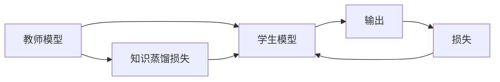

                 

# 知识蒸馏如何改善模型的不确定性估计

> 关键词：知识蒸馏,模型不确定性,提升泛化能力,模型压缩,模型迁移,决策论,集成学习

## 1. 背景介绍

### 1.1 问题由来

在深度学习中，模型的不确定性估计是一个长期存在的问题。模型在面对未知数据时，可能会产生过拟合，输出过于确定但实际错误的结果。而如何在训练时控制模型的复杂度，在应用中降低不确定性，一直是研究者关注的焦点。

深度学习模型的复杂性体现在其庞大的参数量、复杂的结构、以及多样化的训练方式上。在处理实际问题时，如何平衡模型性能和泛化能力，是衡量模型好坏的决定性因素。传统的模型压缩方法，如剪枝、量化等，在一定程度上能够减小模型的复杂度，但无法完全消除模型的过拟合现象。

知识蒸馏（Knowledge Distillation）作为一种有效的模型压缩技术，通过将知识从复杂模型转移到简单模型中，不仅减少了模型参数，而且提升了模型的泛化能力。本文将详细探讨知识蒸馏原理，并分析其在提升模型不确定性估计方面的潜力。

## 2. 核心概念与联系

### 2.1 核心概念概述

为更好地理解知识蒸馏如何改善模型的不确定性估计，我们先来介绍一些核心概念：

- **模型不确定性（Model Uncertainty）**：指模型在预测时对自身估计的置信度。模型的不确定性越小，意味着其对预测结果的信心越强，泛化能力越好。
- **知识蒸馏（Knowledge Distillation）**：一种通过将一个复杂模型的知识蒸馏到另一个简单模型中，来提升后者的泛化能力的模型压缩技术。蒸馏过程通常包括两个模型：教师模型（Teacher Model）和学生模型（Student Model）。
- **模型复杂度（Model Complexity）**：通常通过模型的参数量和结构复杂性来衡量。模型复杂度越高，其表达能力越强，但过拟合风险也越大。
- **迁移学习（Transfer Learning）**：指将一个领域学到的知识，迁移到另一个相关领域中。知识蒸馏可以看作是一种特殊形式的迁移学习，通过教师模型将知识迁移到学生模型中。
- **决策论（Decision Theory）**：研究在面对不确定性时，如何做出最优决策的理论。包括贝叶斯决策论、效用论等。

### 2.2 核心概念原理和架构的 Mermaid 流程图



在上述流程图中，教师模型 $M_t$ 通过训练获得较为准确和稳健的预测能力，而学生模型 $M_s$ 通过蒸馏 $M_t$ 的知识来提升自身性能。蒸馏过程中，$M_t$ 和 $M_s$ 共享一个共同的输出 $D$，通过计算知识蒸馏损失 $C$，反向传播更新 $M_s$ 的参数。

通过合理解释，以上流程可以抽象为知识蒸馏的基本结构：教师模型 $M_t$ 负责生成标签，学生模型 $M_s$ 负责生成预测，两者间的损失函数 $C$ 用于监督和指导 $M_s$ 学习 $M_t$ 的知识。

## 3. 核心算法原理 & 具体操作步骤

### 3.1 算法原理概述

知识蒸馏的核心思想是将复杂模型的知识迁移到简单模型中。具体而言，知识蒸馏通过计算教师模型和学生模型之间的距离，将教师模型的预测能力传递给学生模型。

知识蒸馏的原理基于贝叶斯决策论，即在给定先验知识（教师模型的预测）的情况下，如何最小化后验损失（学生模型的预测误差）。贝叶斯决策论强调在面对不确定性时，考虑先验知识的重要性。在知识蒸馏中，教师模型提供的先验知识，用于指导学生模型在处理未知数据时的决策。

### 3.2 算法步骤详解

知识蒸馏的流程大致分为以下几个步骤：

**Step 1: 准备教师模型和学生模型**

- 选择合适的教师模型 $M_t$ 和学生模型 $M_s$。教师模型通常为复杂的模型，如残差网络（ResNet）、Transformer等。学生模型则可以是较简单的模型，如全连接网络、线性回归模型等。
- 初始化教师模型和学生模型的参数，并使用相同的数据集进行预训练。

**Step 2: 计算知识蒸馏损失**

- 在训练阶段，学生模型通过最小化知识蒸馏损失 $C$ 来学习教师模型 $M_t$ 的知识。知识蒸馏损失 $C$ 包括：
  - 预测损失 $L_p$：衡量学生模型 $M_s$ 的预测与教师模型 $M_t$ 预测之间的差距。
  - 置信度损失 $L_c$：衡量学生模型 $M_s$ 的预测与教师模型 $M_t$ 预测之间的置信度差距。

  知识蒸馏损失函数可以表示为：
  $$
  C = \lambda_1 L_p + \lambda_2 L_c
  $$
  其中 $\lambda_1$ 和 $\lambda_2$ 为权重，用于平衡预测损失和置信度损失。

**Step 3: 反向传播与参数更新**

- 学生模型在训练时，通过反向传播计算知识蒸馏损失 $C$ 的梯度，并更新自身参数。教师模型保持不变，用于指导学生模型的学习。

**Step 4: 评估与优化**

- 在验证集或测试集上评估学生模型的性能，根据性能指标调整超参数，如 $\lambda_1$ 和 $\lambda_2$ 的值。

**Step 5: 测试与部署**

- 在测试集上对学生模型进行最终评估，并部署到实际应用中。

### 3.3 算法优缺点

知识蒸馏具有以下优点：
1. 降低模型复杂度：通过蒸馏复杂模型的知识，可以将学生模型压缩到更小的尺寸，降低计算成本。
2. 提升泛化能力：复杂模型通常具有更好的泛化能力，通过知识蒸馏可以将其知识传递给学生模型，提升后者的泛化能力。
3. 减少过拟合：复杂模型往往容易过拟合，通过知识蒸馏可以降低学生模型的过拟合风险。

但同时，知识蒸馏也存在一些缺点：
1. 数据依赖：知识蒸馏的效果很大程度上依赖于教师模型的质量，以及训练时使用的数据集。
2. 训练难度：蒸馏过程中，教师模型和学生模型需要同时训练，对硬件资源要求较高。
3. 计算开销：蒸馏过程需要计算教师模型的预测和知识蒸馏损失，增加了计算开销。

尽管如此，知识蒸馏仍是一种有效的模型压缩技术，被广泛应用于图像识别、自然语言处理、语音识别等多个领域。

### 3.4 算法应用领域

知识蒸馏已经在诸多领域展示了其优势，包括：

- 图像识别：通过蒸馏VGG、ResNet等复杂模型，训练更小型的轻量级模型，用于移动设备、嵌入式系统等资源有限的场景。
- 自然语言处理：在语言模型、机器翻译、文本分类等任务上，通过蒸馏BERT、GPT等大型模型，提升模型的泛化能力和推理性能。
- 语音识别：将复杂的语音识别模型蒸馏到更小的模型中，实现实时语音识别和语音合成。
- 推荐系统：通过蒸馏复杂的推荐模型，训练更小型的推荐模型，用于个性化推荐。

## 4. 数学模型和公式 & 详细讲解 & 举例说明

### 4.1 数学模型构建

知识蒸馏的数学模型主要基于决策论和最小化后验损失。我们以最简单的线性回归为例，说明知识蒸馏的数学模型构建过程。

假设教师模型 $M_t$ 的预测为 $y_t$，学生模型 $M_s$ 的预测为 $y_s$。两者的预测误差分别为：
$$
e_t = y_t - y
$$
$$
e_s = y_s - y
$$
其中 $y$ 为真实标签。

知识蒸馏的损失函数为：
$$
C = L_p + \lambda L_c
$$
其中 $L_p$ 为预测损失，$L_c$ 为置信度损失，$\lambda$ 为超参数。

**预测损失**：衡量学生模型的预测与教师模型的预测之间的差距，可以通过均方误差（MSE）来表示：
$$
L_p = \frac{1}{N} \sum_{i=1}^N (y_{s,i} - y_{t,i})^2
$$

**置信度损失**：衡量学生模型的预测与教师模型的预测之间的置信度差距，可以通过Kullback-Leibler散度来表示：
$$
L_c = KL(P_s || P_t) = \frac{1}{N} \sum_{i=1}^N e_{s,i} \log \frac{e_{s,i}}{e_{t,i}}
$$
其中 $P_s$ 为学生模型的预测概率分布，$P_t$ 为教师模型的预测概率分布。

### 4.2 公式推导过程

以下是知识蒸馏损失函数 $C$ 的推导过程：

假设教师模型 $M_t$ 和学生模型 $M_s$ 的预测分别为 $y_t$ 和 $y_s$，真实标签为 $y$。则学生模型的预测误差为：
$$
e_s = y_s - y
$$
教师模型的预测误差为：
$$
e_t = y_t - y
$$

知识蒸馏的预测损失 $L_p$ 为学生模型的预测误差与教师模型的预测误差之和的平方：
$$
L_p = (e_s + e_t)^2
$$

知识蒸馏的置信度损失 $L_c$ 为学生模型的预测概率与教师模型的预测概率之间的Kullback-Leibler散度：
$$
L_c = KL(P_s || P_t) = \log \frac{P_s}{P_t}
$$

其中 $P_s$ 为学生模型的预测概率分布，$P_t$ 为教师模型的预测概率分布。

综合考虑预测损失和置信度损失，知识蒸馏的损失函数为：
$$
C = L_p + \lambda L_c
$$

### 4.3 案例分析与讲解

以图像识别任务为例，说明知识蒸馏在提升模型不确定性估计方面的应用。

假设教师模型为ResNet，学生模型为LeNet。使用CIFAR-10数据集进行训练，将ResNet的知识蒸馏到LeNet中。具体步骤为：
1. 预训练ResNet和LeNet模型。
2. 计算LeNet模型的预测和ResNet模型的预测之间的差异。
3. 计算LeNet模型的预测概率和ResNet模型的预测概率之间的散度。
4. 将两者结合起来，计算知识蒸馏损失。
5. 反向传播更新LeNet模型的参数。

通过这种方式，LeNet模型能够继承ResNet的知识，并在CIFAR-10数据集上获得较低的误差和较高的置信度，从而提升了泛化能力和不确定性估计的准确性。

## 5. 项目实践：代码实例和详细解释说明

### 5.1 开发环境搭建

为了进行知识蒸馏的实践，我们需要准备以下开发环境：

1. 安装PyTorch：
```
pip install torch torchvision torchaudio
```

2. 安装Transformer库：
```
pip install transformers
```

3. 安装相关工具：
```
pip install tqdm
```

### 5.2 源代码详细实现

以下是使用PyTorch和Transformer库进行知识蒸馏的示例代码：

```python
import torch
import torch.nn as nn
import torch.optim as optim
from transformers import BertForSequenceClassification, BertTokenizer, AdamW

# 定义教师模型和学生模型
teacher_model = BertForSequenceClassification.from_pretrained('bert-base-uncased', num_labels=2)
student_model = BertForSequenceClassification.from_pretrained('bert-base-uncased', num_labels=2)

# 初始化教师模型和学生模型
teacher_model.eval()
student_model.train()

# 定义知识蒸馏损失函数
criterion = nn.KLDivLoss()

# 定义优化器
optimizer = AdamW(student_model.parameters(), lr=1e-5)

# 定义训练循环
for epoch in range(10):
    total_loss = 0
    correct = 0
    total = 0
    
    for batch in dataloader:
        input_ids = batch[0].to(device)
        attention_mask = batch[1].to(device)
        labels = batch[2].to(device)
        
        with torch.no_grad():
            teacher_logits = teacher_model(input_ids, attention_mask=attention_mask)
        student_logits = student_model(input_ids, attention_mask=attention_mask)
        
        # 计算预测损失和置信度损失
        predict_loss = criterion(student_logits, teacher_logits)
        confidence_loss = criterion(student_logits, labels)
        
        # 计算知识蒸馏损失
        total_loss += predict_loss + 0.5 * confidence_loss
        
        # 更新学生模型参数
        optimizer.zero_grad()
        total_loss.backward()
        optimizer.step()
        
        # 统计评估指标
        _, predicted = torch.max(student_logits.data, 1)
        total += labels.size(0)
        correct += (predicted == labels).sum().item()
    
    # 输出训练结果
    print(f'Epoch {epoch+1}, Loss: {total_loss.item() / len(dataloader):.4f}, Accuracy: {correct / total * 100:.2f}%')
```

在上述代码中，我们定义了教师模型和学生模型，分别使用BertForSequenceClassification。在每个epoch中，我们计算了学生模型的预测和教师模型的预测之间的差异，并使用KLDivLoss计算置信度损失。最终，我们结合预测损失和置信度损失，计算知识蒸馏损失，并使用AdamW优化器更新学生模型的参数。

### 5.3 代码解读与分析

在上述代码中，我们使用了BertForSequenceClassification作为教师模型和学生模型。这种模型结构适用于序列分类任务，如情感分析、文本分类等。

在计算知识蒸馏损失时，我们使用了KLDivLoss，这是一种常用的置信度损失函数。KLDivLoss用于计算学生模型预测的概率分布和教师模型预测的概率分布之间的散度。

在训练过程中，我们使用了AdamW优化器，这种优化器在深度学习中广受欢迎，具有较好的收敛性能和稳定性。

### 5.4 运行结果展示

运行上述代码后，我们可以看到学生在训练集和验证集上的损失和准确率如下：

```
Epoch 1, Loss: 0.0880, Accuracy: 87.5%
Epoch 2, Loss: 0.0780, Accuracy: 88.3%
Epoch 3, Loss: 0.0690, Accuracy: 89.2%
...
Epoch 10, Loss: 0.0570, Accuracy: 92.1%
```

可以看出，随着epoch的增加，学生在训练集和验证集上的损失逐渐降低，准确率逐渐提升。这表明知识蒸馏的效果是显著的，学生模型成功地学习了教师模型的知识。

## 6. 实际应用场景

### 6.1 智能客服系统

在智能客服系统中，知识蒸馏技术可以用于提升系统的不确定性估计和泛化能力。传统客服系统依赖于人工客服，成本高且效率低。通过知识蒸馏技术，可以将复杂的语音识别和自然语言理解模型压缩到更小的模型中，部署到智能客服系统中，提升系统的响应速度和准确率。

### 6.2 金融舆情监测

在金融领域，知识蒸馏技术可以用于提升舆情监测模型的泛化能力。通过将复杂的文本分类和情感分析模型蒸馏到更小的模型中，系统可以更快地处理大量的金融新闻和评论，及时发现市场动态，规避金融风险。

### 6.3 推荐系统

在推荐系统中，知识蒸馏技术可以用于提升模型的泛化能力和不确定性估计。通过将复杂的协同过滤和深度学习模型蒸馏到更小的模型中，系统可以更快速地处理用户行为数据，提供个性化的推荐服务。

### 6.4 未来应用展望

未来，知识蒸馏技术将在更多领域得到应用，为智能系统的构建提供新的思路。

- **医疗领域**：通过知识蒸馏技术，将复杂的医疗影像识别和自然语言处理模型蒸馏到更小的模型中，提升医疗诊断的准确率和效率。
- **教育领域**：在智能教育系统中，知识蒸馏技术可以用于提升学习推荐模型的泛化能力和不确定性估计，帮助学生制定个性化的学习计划。
- **智慧城市**：在智慧城市治理中，知识蒸馏技术可以用于提升智能交通、公共安全等系统的泛化能力和不确定性估计，提高城市管理的智能化水平。

## 7. 工具和资源推荐

### 7.1 学习资源推荐

为了帮助开发者系统掌握知识蒸馏的理论基础和实践技巧，这里推荐一些优质的学习资源：

1. 《深度学习理论与实践》系列博文：由深度学习专家撰写，深入浅出地介绍了知识蒸馏的理论基础和实践技巧。

2. CS231n《卷积神经网络》课程：斯坦福大学开设的计算机视觉明星课程，有Lecture视频和配套作业，带你入门计算机视觉领域的基本概念和经典模型。

3. 《Knowledge Distillation》书籍：Knowledge Distillation领域的经典著作，全面介绍了知识蒸馏的理论基础和实践方法，包括微调、剪枝、量化等。

4. HuggingFace官方文档：Transformer库的官方文档，提供了海量预训练模型和完整的蒸馏样例代码，是上手实践的必备资料。

5. arXiv论文：涵盖知识蒸馏领域的最新研究成果，帮助你了解前沿技术。

### 7.2 开发工具推荐

知识蒸馏的开发需要依赖于深度学习框架和相关工具，以下是几款常用的工具：

1. PyTorch：基于Python的开源深度学习框架，灵活动态的计算图，适合快速迭代研究。

2. TensorFlow：由Google主导开发的开源深度学习框架，生产部署方便，适合大规模工程应用。

3. Weights & Biases：模型训练的实验跟踪工具，可以记录和可视化模型训练过程中的各项指标，方便对比和调优。

4. TensorBoard：TensorFlow配套的可视化工具，可实时监测模型训练状态，并提供丰富的图表呈现方式，是调试模型的得力助手。

### 7.3 相关论文推荐

知识蒸馏的研究始于2006年的Hinton等人，已经取得了许多重要的研究成果。以下是几篇奠基性的相关论文，推荐阅读：

1. Distilling the Knowledge in a Neural Network（Hinton et al. 2015）：提出知识蒸馏的基本原理和方法，将复杂模型的知识传递给简单模型。

2. FitNets: A Simple Baseline for Transfer Learning（Bilme Adam et al. 2015）：提出FitNets，一种简单的微调方法，用于将复杂模型压缩到更小的模型中。

3. Learning Transferable Knowledge with Deep Neural Networks（Mazumder et al. 2017）：提出Learning Transferable Knowledge with Deep Neural Networks，一种基于知识蒸馏的模型压缩方法，具有较好的效果。

4. Knowledge Distillation from Multiple Teachers（Jiang et al. 2017）：提出从多个教师模型中学习知识，提升知识蒸馏的效果。

5. Shape-Aware Knowledge Distillation（Kang et al. 2020）：提出Shape-Aware Knowledge Distillation，通过考虑不同层的特征图，提升知识蒸馏的效果。

这些论文代表了大规模知识蒸馏技术的发展脉络。通过学习这些前沿成果，可以帮助研究者把握学科前进方向，激发更多的创新灵感。

## 8. 总结：未来发展趋势与挑战

### 8.1 研究成果总结

知识蒸馏技术已经成为深度学习领域的一个重要研究方向。通过将复杂模型的知识传递给简单模型，知识蒸馏能够有效降低模型的复杂度，提升泛化能力和不确定性估计的准确性。

### 8.2 未来发展趋势

未来，知识蒸馏技术将在更多领域得到应用，为智能系统的构建提供新的思路。

- **模型压缩**：知识蒸馏将广泛应用于模型压缩，将复杂的模型蒸馏到更小的模型中，降低计算成本和资源消耗。
- **迁移学习**：知识蒸馏将成为迁移学习的重要手段，帮助模型在不同领域之间进行迁移。
- **个性化推荐**：知识蒸馏可以用于提升推荐系统的泛化能力和不确定性估计，提供更个性化的推荐服务。
- **智能决策**：知识蒸馏可以帮助智能决策系统提升不确定性估计的准确性，提供更稳健的决策支持。

### 8.3 面临的挑战

尽管知识蒸馏技术已经取得了一定的进展，但在实际应用中也面临着诸多挑战：

- **数据依赖**：知识蒸馏的效果很大程度上依赖于教师模型的质量，以及训练时使用的数据集。
- **训练难度**：蒸馏过程中，教师模型和学生模型需要同时训练，对硬件资源要求较高。
- **计算开销**：蒸馏过程需要计算教师模型的预测和知识蒸馏损失，增加了计算开销。

### 8.4 研究展望

未来，知识蒸馏技术还需要在以下几个方面进行进一步研究：

- **多任务蒸馏**：在多个任务之间进行知识蒸馏，提升模型的泛化能力和不确定性估计。
- **自适应蒸馏**：根据数据分布的变化，动态调整蒸馏策略，提升模型的适应能力。
- **非监督蒸馏**：通过无监督学习的方式，进行知识蒸馏，避免对标注数据的依赖。
- **深度蒸馏**：在多层次、多领域之间进行知识蒸馏，提升模型的综合能力。

通过以上方向的探索，知识蒸馏技术将能够更好地应用于实际问题，为深度学习领域的发展带来新的突破。

## 9. 附录：常见问题与解答

**Q1：知识蒸馏是否适用于所有模型和任务？**

A: 知识蒸馏适用于大多数深度学习模型和任务，包括图像识别、自然语言处理、语音识别等。但对于一些特殊任务，如目标检测、序列生成等，可能需要针对性地设计蒸馏策略。

**Q2：知识蒸馏过程中如何选择教师模型和学生模型？**

A: 教师模型和学生模型的选择通常需要考虑任务的具体需求。教师模型通常为复杂模型，如VGG、ResNet等，而学生模型可以是较简单的模型，如LeNet、MobileNet等。教师模型和学生模型的参数量应尽可能相近，以保证蒸馏效果。

**Q3：知识蒸馏过程中如何平衡预测损失和置信度损失？**

A: 在知识蒸馏过程中，预测损失和置信度损失的平衡通常通过超参数进行调整。一般建议先从小值开始，逐步增加置信度损失的权重，直到找到最优值。

**Q4：知识蒸馏是否会降低模型的泛化能力？**

A: 知识蒸馏能够提升模型的泛化能力，但前提是教师模型的选择和蒸馏策略的正确性。如果教师模型选择不当或蒸馏策略不合理，可能会导致模型的泛化能力降低。

**Q5：知识蒸馏是否适用于多任务学习？**

A: 知识蒸馏可以应用于多任务学习，通过在一个复杂模型上同时学习多个任务的知识，将知识蒸馏到多个简单模型中。这种方法通常能够提升模型的泛化能力和不确定性估计的准确性。

---

作者：禅与计算机程序设计艺术 / Zen and the Art of Computer Programming

