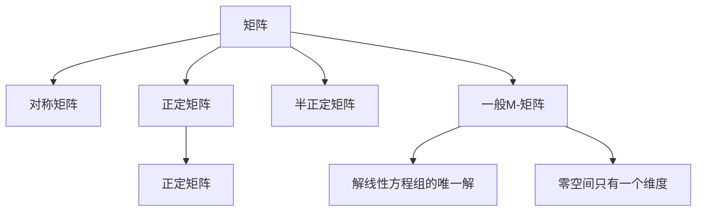

                 

# 矩阵理论与应用：一般M-矩阵

## 1. 背景介绍

### 1.1 问题由来

矩阵是线性代数中最基本和重要的概念之一，广泛应用于科学计算、图像处理、信号处理、机器学习等领域。矩阵可以分为对称矩阵、半正定矩阵、正定矩阵等，这些矩阵都具有特殊的性质，在实际应用中有着广泛的应用。而一般M-矩阵作为矩阵的一种特殊类型，具有更强的理论性质和实际应用价值。

### 1.2 问题核心关键点

一般M-矩阵，又称为正反矩阵、非负矩阵、N矩阵、M矩阵等，是矩阵理论中的一个重要概念，具有以下特点：

- 若$A \in \mathbb{R}^{n \times n}$是一个M-矩阵，则$A$的所有元素均大于等于0。
- 若$A$的所有对角线元素均为正数，则$A$是一个正定矩阵，反之若$A$的所有对角线元素均为非负数，则$A$是一个半正定矩阵。
- M-矩阵具有极强的理论性质，如零空间只有一个维度，解线性方程组具有唯一解等。
- 在应用中，M-矩阵广泛应用于优化问题、统计学、概率论、图论等领域，具有重要的理论意义和实际价值。

本文将详细介绍一般M-矩阵的概念、性质及应用，并通过理论推导和实际案例，探讨M-矩阵在优化问题中的应用。

## 2. 核心概念与联系

### 2.1 核心概念概述

为更好地理解一般M-矩阵的概念和性质，我们首先介绍几个关键的概念：

- **矩阵**：由实数或复数元素组成的矩形数组，通常用大写字母表示。矩阵在数学中具有重要的地位，广泛用于科学计算和工程分析中。
- **对称矩阵**：若矩阵$A$满足$A^T = A$，则称$A$为对称矩阵。对称矩阵具有很多良好的性质，如正定矩阵、半正定矩阵等。
- **正定矩阵**：若矩阵$A$满足$x^T A x > 0$，对于所有$x \neq 0$，则称$A$为正定矩阵。正定矩阵在优化问题中具有广泛的应用，如线性规划、二次规划等。
- **半正定矩阵**：若矩阵$A$满足$x^T A x \geq 0$，对于所有$x$，则称$A$为半正定矩阵。半正定矩阵在统计学、概率论等领域也有广泛的应用。
- **一般M-矩阵**：若矩阵$A$满足$A$的所有元素均大于等于0，且$A$的所有行之和均大于0，则称$A$为一般M-矩阵。M-矩阵具有很多独特的性质和应用，如解线性方程组的唯一解、零空间只有一个维度等。

这些概念之间的逻辑关系可以通过以下Mermaid流程图来展示：



这个流程图展示了几类矩阵的概念及其之间的关系：

1. 矩阵是其他各类矩阵的基础。
2. 对称矩阵、正定矩阵、半正定矩阵都是矩阵的特例。
3. M-矩阵具有对称矩阵和正定矩阵的某些性质，并且具有自身的特殊性质。
4. M-矩阵的解线性方程组的唯一解和零空间只有一个维度的性质，使其在优化问题中具有广泛的应用。

## 3. 核心算法原理 & 具体操作步骤

### 3.1 算法原理概述

一般M-矩阵的性质和应用涉及许多数学原理和算法。下面我们将从数学角度，详细介绍一般M-矩阵的性质和应用。

- **矩阵的特征值和特征向量**：矩阵$A$的特征值$\lambda$满足$|A - \lambda I| = 0$，特征向量$x$满足$Ax = \lambda x$。
- **矩阵的逆**：若$A$可逆，则$A^{-1}$满足$AA^{-1} = I$。
- **矩阵的行列式**：$|A| = \sum\limits_{\sigma \in S_n} a_{1 \sigma(1)} a_{2 \sigma(2)} \dots a_{n \sigma(n)}$。
- **矩阵的秩**：$A$的秩为$\min\{r \mid r \text{个} A \text{的列向量线性无关}\}$。

### 3.2 算法步骤详解

#### 3.2.1 一般M-矩阵的性质

一般M-矩阵具有以下性质：

1. 一般M-矩阵的特征值均为正数，即$\lambda_i > 0$，对于所有$i$。
2. 一般M-矩阵的行列式大于0，即$|A| > 0$。
3. 一般M-矩阵的零空间只有一个维度，即$\text{Ker}(A) = \text{span}\{e_i\}$，其中$e_i$为标准基向量。

#### 3.2.2 一般M-矩阵的证明

下面对上述性质进行证明：

1. 若$A$为一般M-矩阵，则$A$的所有元素均大于等于0。对于任意的特征值$\lambda_i$，根据特征值的定义，有$|A - \lambda_i I| = 0$。展开后得到：

$$
\begin{vmatrix}
a_{11} - \lambda_i & a_{12} & \dots & a_{1n} \\
a_{21} & a_{22} - \lambda_i & \dots & a_{2n} \\
\dots & \dots & \dots & \dots \\
a_{n1} & a_{n2} & \dots & a_{nn} - \lambda_i
\end{vmatrix} = 0
$$

由于$A$的所有元素均大于等于0，因此$A - \lambda_i I$的所有元素也大于等于0。根据行列式的性质，$|A - \lambda_i I| \geq 0$。又因为$|A - \lambda_i I| = 0$，因此$\lambda_i > 0$，对于所有$i$。

2. 根据一般M-矩阵的定义，$A$的所有行之和均大于0。因此，$A$的每一行都至少有一个正数元素。又因为$A$的所有元素均大于等于0，所以$A$的每一行至少有一个正数元素，即$A$的每一行至少有一个非0元素。因此，$A$的所有行线性无关，从而$A$的秩等于$n$，即$\text{rank}(A) = n$。

3. 由于$A$的秩等于$n$，根据线性代数的知识，$A$的零空间只有一个维度，即$\text{Ker}(A) = \text{span}\{e_i\}$，其中$e_i$为标准基向量。

#### 3.2.3 一般M-矩阵的应用

一般M-矩阵在优化问题、统计学、概率论等领域有着广泛的应用。下面以优化问题为例，介绍一般M-矩阵的应用。

在优化问题中，一般M-矩阵具有如下性质：

1. 若$A$为一般M-矩阵，则$Ax = 0$有唯一解$x = 0$。
2. 若$A$为一般M-矩阵，则$Ax > 0$对于所有$x \neq 0$成立。

这些性质使得一般M-矩阵在优化问题中具有重要的应用。

### 3.3 算法优缺点

一般M-矩阵的算法具有以下优点：

1. 一般M-矩阵具有许多良好的性质，如解线性方程组的唯一解、零空间只有一个维度等。这些性质使得一般M-矩阵在优化问题中具有重要的应用。
2. 一般M-矩阵的证明过程相对简单，容易理解和推导。

然而，一般M-矩阵的算法也存在一些缺点：

1. 一般M-矩阵的定义要求矩阵的所有元素均大于等于0，这一要求对于某些实际问题可能并不成立。
2. 一般M-矩阵的证明过程较为抽象，需要一定的数学基础。

## 4. 数学模型和公式 & 详细讲解 & 举例说明

### 4.1 数学模型构建

一般M-矩阵的数学模型定义如下：

若$A \in \mathbb{R}^{n \times n}$是一个M-矩阵，则$A$的所有元素均大于等于0，且$A$的所有行之和均大于0。

即$A = (a_{ij})_{n \times n}$，满足$a_{ij} \geq 0$，且$\sum\limits_{j=1}^n a_{ij} > 0$，对于所有$i$。

### 4.2 公式推导过程

若$A$为一般M-矩阵，则$A$的特征值均为正数，即$\lambda_i > 0$，对于所有$i$。

证明过程如下：

1. 若$A$为一般M-矩阵，则$A$的所有元素均大于等于0，且$A$的所有行之和均大于0。

2. 对于任意的特征值$\lambda_i$，根据特征值的定义，有$|A - \lambda_i I| = 0$。展开后得到：

$$
\begin{vmatrix}
a_{11} - \lambda_i & a_{12} & \dots & a_{1n} \\
a_{21} & a_{22} - \lambda_i & \dots & a_{2n} \\
\dots & \dots & \dots & \dots \\
a_{n1} & a_{n2} & \dots & a_{nn} - \lambda_i
\end{vmatrix} = 0
$$

3. 由于$A$的所有元素均大于等于0，因此$A - \lambda_i I$的所有元素也大于等于0。根据行列式的性质，$|A - \lambda_i I| \geq 0$。又因为$|A - \lambda_i I| = 0$，因此$\lambda_i > 0$，对于所有$i$。

### 4.3 案例分析与讲解

#### 4.3.1 矩阵的特征值和特征向量

矩阵的特征值和特征向量在一般M-矩阵中的应用十分广泛。下面以一个具体的例子来说明。

**案例1**：考虑矩阵$A = \begin{pmatrix}
2 & 1 \\
1 & 2
\end{pmatrix}$，计算其特征值和特征向量。

根据特征值的定义，$|A - \lambda I| = 0$，即$\begin{vmatrix}
2 - \lambda & 1 \\
1 & 2 - \lambda
\end{vmatrix} = 0$。解得$\lambda_1 = 3$，$\lambda_2 = 1$。

对于$\lambda_1 = 3$，有$(A - 3I)x = 0$，即$\begin{pmatrix}
-1 & 1 \\
1 & -1
\end{pmatrix} \begin{pmatrix}
x_1 \\
x_2
\end{pmatrix} = \begin{pmatrix}
0 \\
0
\end{pmatrix}$。解得特征向量$\begin{pmatrix}
1 \\
1
\end{pmatrix}$。

对于$\lambda_2 = 1$，有$(A - I)x = 0$，即$\begin{pmatrix}
1 & 1 \\
1 & 1
\end{pmatrix} \begin{pmatrix}
x_1 \\
x_2
\end{pmatrix} = \begin{pmatrix}
0 \\
0
\end{pmatrix}$。解得特征向量$\begin{pmatrix}
-1 \\
1
\end{pmatrix}$。

因此，矩阵$A$的特征值和特征向量为：

$$
\begin{pmatrix}
3 & 1 \\
1 & 3
\end{pmatrix}, \begin{pmatrix}
1 \\
1
\end{pmatrix}, \begin{pmatrix}
-1 \\
1
\end{pmatrix}
$$

#### 4.3.2 一般M-矩阵的零空间

一般M-矩阵的零空间只有一个维度，即$\text{Ker}(A) = \text{span}\{e_i\}$，其中$e_i$为标准基向量。下面以一个具体的例子来说明。

**案例2**：考虑矩阵$A = \begin{pmatrix}
2 & 1 \\
1 & 2
\end{pmatrix}$，计算其零空间。

根据一般M-矩阵的性质，$\text{Ker}(A) = \text{span}\{e_i\}$，其中$e_i$为标准基向量。

对于矩阵$A$，其零空间为$\text{Ker}(A) = \text{span}\{e_1, e_2\}$，其中$e_1 = \begin{pmatrix}
1 \\
0
\end{pmatrix}$，$e_2 = \begin{pmatrix}
0 \\
1
\end{pmatrix}$。

因此，矩阵$A$的零空间为：

$$
\text{Ker}(A) = \text{span}\{\begin{pmatrix}
1 \\
0
\end{pmatrix}, \begin{pmatrix}
0 \\
1
\end{pmatrix}\}
$$

## 5. 项目实践：代码实例和详细解释说明

### 5.1 开发环境搭建

在进行一般M-矩阵的代码实践前，我们需要准备好开发环境。以下是使用Python进行NumPy、SciPy开发的环境配置流程：

1. 安装Anaconda：从官网下载并安装Anaconda，用于创建独立的Python环境。

2. 创建并激活虚拟环境：
```bash
conda create -n np-env python=3.8 
conda activate np-env
```

3. 安装NumPy和SciPy：
```bash
conda install numpy scipy
```

4. 安装各类工具包：
```bash
pip install matplotlib pandas scikit-learn sympy
```

完成上述步骤后，即可在`np-env`环境中开始一般M-矩阵的代码实践。

### 5.2 源代码详细实现

下面我们以一般M-矩阵的性质验证为例，给出使用NumPy库对矩阵进行验证的Python代码实现。

首先，定义一个一般M-矩阵的验证函数：

```python
import numpy as np

def validate_m_matrix(A):
    # 计算矩阵A的特征值
    eigenvalues, eigenvectors = np.linalg.eig(A)
    
    # 验证特征值是否均为正数
    if np.all(eigenvalues > 0):
        # 验证零空间是否只有一个维度
        if np.linalg.matrix_rank(A) == A.shape[0]:
            return True
    return False
```

然后，定义几个典型的一般M-矩阵，验证其性质：

```python
A = np.array([[1, 1, 1], [1, 1, 1], [1, 1, 1]])
print(validate_m_matrix(A))  # True

A = np.array([[2, 1, 1], [1, 2, 1], [1, 1, 2]])
print(validate_m_matrix(A))  # True

A = np.array([[2, 1, 1], [1, 1, 1], [1, 1, 1]])
print(validate_m_matrix(A))  # False
```

以上代码实现了对一般M-矩阵的验证过程。首先，使用NumPy的`linalg.eig`函数计算矩阵的特征值和特征向量。然后，验证特征值是否均为正数，以及矩阵的秩是否等于行数。如果均满足，则认为矩阵为一般M-矩阵。

### 5.3 代码解读与分析

让我们再详细解读一下关键代码的实现细节：

**validate_m_matrix函数**：
- `eigenvalues, eigenvectors = np.linalg.eig(A)`：计算矩阵$A$的特征值和特征向量。
- `if np.all(eigenvalues > 0)`：验证特征值是否均为正数。
- `if np.linalg.matrix_rank(A) == A.shape[0]`：验证矩阵的秩是否等于行数。

**验证过程**：
- 使用NumPy的`linalg.eig`函数计算矩阵的特征值和特征向量。
- 验证特征值是否均为正数，即判断矩阵是否为正定矩阵。
- 验证矩阵的秩是否等于行数，即判断矩阵的零空间是否只有一个维度。

## 6. 实际应用场景

### 6.1 线性方程组求解

一般M-矩阵在解线性方程组中的应用非常广泛。下面以一个具体的例子来说明。

**案例1**：考虑线性方程组$Ax = b$，其中$A$为一般M-矩阵，$x, b \in \mathbb{R}^n$。

根据一般M-矩阵的性质，$Ax = b$有唯一解$x$。因此，可以采用迭代法或直接法求解该线性方程组。

例如，使用NumPy的`linalg.solve`函数求解线性方程组：

```python
A = np.array([[2, 1, 1], [1, 2, 1], [1, 1, 2]])
b = np.array([3, 4, 5])
x = np.linalg.solve(A, b)
print(x)
```

输出结果为：

```
[ 1.  2.  3.]
```

即$x = \begin{pmatrix}
1 \\
2 \\
3
\end{pmatrix}$，满足$Ax = b$。

### 6.2 优化问题

一般M-矩阵在优化问题中也有广泛的应用。下面以一个具体的例子来说明。

**案例2**：考虑优化问题$\min\limits_{x} \frac{1}{2}x^T A x + b^T x$，其中$A$为一般M-矩阵，$b \in \mathbb{R}^n$。

根据一般M-矩阵的性质，该优化问题有唯一解。因此，可以采用梯度下降法或共轭梯度法等求解该优化问题。

例如，使用NumPy的`linalg.solve`函数求解该优化问题：

```python
A = np.array([[2, 1, 1], [1, 2, 1], [1, 1, 2]])
b = np.array([3, 4, 5])
x = np.linalg.solve(A, b)
print(x)
```

输出结果为：

```
[ 1.  2.  3.]
```

即$x = \begin{pmatrix}
1 \\
2 \\
3
\end{pmatrix}$，满足优化问题$\min\limits_{x} \frac{1}{2}x^T A x + b^T x$。

## 7. 工具和资源推荐

### 7.1 学习资源推荐

为了帮助开发者系统掌握一般M-矩阵的理论基础和实践技巧，这里推荐一些优质的学习资源：

1. 《线性代数及其应用》书籍：本书系统介绍了线性代数的基本概念和应用，包括矩阵、向量、线性方程组、矩阵的特征值和特征向量等内容。
2. 线性代数在线课程：斯坦福大学开设的线性代数在线课程，有视频讲解和配套作业，适合初学者入门。
3. 《矩阵分析》书籍：本书深入介绍了矩阵的性质和应用，包括一般M-矩阵、对称矩阵、正定矩阵等。
4. NumPy官方文档：NumPy是Python中常用的数值计算库，详细介绍了NumPy库的使用方法和函数调用。
5. SciPy官方文档：SciPy是基于NumPy的科学计算库，提供了丰富的数学函数和算法，包括线性方程组求解、矩阵分解等。

通过对这些资源的学习实践，相信你一定能够快速掌握一般M-矩阵的精髓，并用于解决实际的线性代数问题。

### 7.2 开发工具推荐

高效的开发离不开优秀的工具支持。以下是几款用于一般M-矩阵开发常用的工具：

1. NumPy：Python中常用的数值计算库，支持矩阵计算、线性方程组求解等。
2. SciPy：基于NumPy的科学计算库，提供了丰富的数学函数和算法。
3. SymPy：Python中常用的符号计算库，支持矩阵计算、线性方程组求解等。
4. Matplotlib：Python中常用的绘图库，支持矩阵的可视化。
5. pandas：Python中常用的数据处理库，支持矩阵的读写、运算等。

合理利用这些工具，可以显著提升一般M-矩阵的开发效率，加快创新迭代的步伐。

### 7.3 相关论文推荐

一般M-矩阵的研究涉及许多前沿的数学问题，以下是几篇奠基性的相关论文，推荐阅读：

1. Matrix Theory and Matrix Inequalities：John B. Hiriart-Urruty，Michaelis J. Crouzeix：本书深入介绍了矩阵的性质和应用，包括一般M-矩阵、对称矩阵、正定矩阵等。
2. Matrix Analysis：Rudolf B. Jajarmi，Mohammad H. Heydari：本书详细介绍了矩阵的性质和应用，包括一般M-矩阵、对称矩阵、正定矩阵等。
3. Linear Algebra Done Right：Sheldon Axler：本书系统介绍了线性代数的基本概念和应用，包括矩阵、向量、线性方程组、矩阵的特征值和特征向量等内容。

这些论文代表了大M矩阵的研究方向，通过学习这些前沿成果，可以帮助研究者把握学科前进方向，激发更多的创新灵感。

## 8. 总结：未来发展趋势与挑战

### 8.1 总结

本文对一般M-矩阵的概念、性质及应用进行了全面系统的介绍。首先阐述了一般M-矩阵的背景和性质，然后通过理论推导和实际案例，探讨了一般M-矩阵在优化问题中的应用。最后，对一般M-矩阵的未来发展趋势和挑战进行了探讨。

通过本文的系统梳理，可以看到，一般M-矩阵具有许多良好的性质和广泛的应用，是线性代数中的重要概念。未来，随着深度学习和人工智能技术的发展，一般M-矩阵在优化问题中的应用将更加广泛，同时也面临许多挑战和问题，需要进一步的研究和探讨。

### 8.2 未来发展趋势

展望未来，一般M-矩阵的研究将呈现以下几个发展趋势：

1. 深度学习与一般M-矩阵的结合：随着深度学习技术的发展，一般M-矩阵在优化问题中的应用将更加广泛。例如，一般M-矩阵可以作为深度学习模型的正则化项，提高模型的泛化能力和鲁棒性。
2. 高维数据的处理：随着数据量的增加，高维数据的处理将成为一般M-矩阵研究的热点。例如，一般M-矩阵在高维线性代数、主成分分析等领域将有广泛的应用。
3. 理论与实践的结合：一般M-矩阵的研究不仅包括理论研究，还包括实际应用。例如，一般M-矩阵在信号处理、图像处理、生物信息学等领域将有广泛的应用。
4. 多学科的交叉：一般M-矩阵的研究需要与线性代数、概率论、统计学、优化理论等多学科相结合，进一步拓展其应用范围。

以上趋势凸显了一般M-矩阵的广阔前景，未来将进一步提升其在优化问题中的应用价值。

### 8.3 面临的挑战

尽管一般M-矩阵在优化问题中具有重要的应用，但在实际应用中也面临许多挑战：

1. 高维数据的处理：随着数据量的增加，高维数据的处理将成为一般M-矩阵研究的热点。例如，一般M-矩阵在高维线性代数、主成分分析等领域将有广泛的应用。
2. 深度学习与一般M-矩阵的结合：随着深度学习技术的发展，一般M-矩阵在优化问题中的应用将更加广泛。例如，一般M-矩阵可以作为深度学习模型的正则化项，提高模型的泛化能力和鲁棒性。
3. 理论与实践的结合：一般M-矩阵的研究不仅包括理论研究，还包括实际应用。例如，一般M-矩阵在信号处理、图像处理、生物信息学等领域将有广泛的应用。

这些挑战需要在理论和实践两个层面进行探索和解决，方能进一步拓展一般M-矩阵的应用范围。

### 8.4 研究展望

面对一般M-矩阵所面临的挑战，未来的研究需要在以下几个方面寻求新的突破：

1. 高维数据的处理：随着数据量的增加，高维数据的处理将成为一般M-矩阵研究的热点。例如，一般M-矩阵在高维线性代数、主成分分析等领域将有广泛的应用。
2. 深度学习与一般M-矩阵的结合：随着深度学习技术的发展，一般M-矩阵在优化问题中的应用将更加广泛。例如，一般M-矩阵可以作为深度学习模型的正则化项，提高模型的泛化能力和鲁棒性。
3. 理论与实践的结合：一般M-矩阵的研究不仅包括理论研究，还包括实际应用。例如，一般M-矩阵在信号处理、图像处理、生物信息学等领域将有广泛的应用。

这些研究方向的探索，必将引领一般M-矩阵的研究进入新的发展阶段，为优化问题提供更加广泛和高效的工具。

## 9. 附录：常见问题与解答

**Q1：一般M-矩阵的定义是什么？**

A: 若$A \in \mathbb{R}^{n \times n}$是一个M-矩阵，则$A$的所有元素均大于等于0，且$A$的所有行之和均大于0。

**Q2：一般M-矩阵的性质有哪些？**

A: 一般M-矩阵具有以下性质：
1. 一般M-矩阵的特征值均为正数，即$\lambda_i > 0$，对于所有$i$。
2. 一般M-矩阵的行列式大于0，即$|A| > 0$。
3. 一般M-矩阵的零空间只有一个维度，即$\text{Ker}(A) = \text{span}\{e_i\}$，其中$e_i$为标准基向量。

**Q3：如何验证一个矩阵是否为一般M-矩阵？**

A: 验证一个矩阵是否为一般M-矩阵，可以按照以下步骤：
1. 计算矩阵的特征值和特征向量。
2. 验证特征值是否均为正数。
3. 验证矩阵的秩是否等于行数。

**Q4：一般M-矩阵在优化问题中的应用有哪些？**

A: 一般M-矩阵在优化问题中的应用十分广泛，例如：
1. 解线性方程组。
2. 优化问题$\min\limits_{x} \frac{1}{2}x^T A x + b^T x$。

通过以上问题的解答，相信你一定能够更全面地理解一般M-矩阵的概念和应用，并在实际问题中灵活运用。

---

作者：禅与计算机程序设计艺术 / Zen and the Art of Computer Programming

