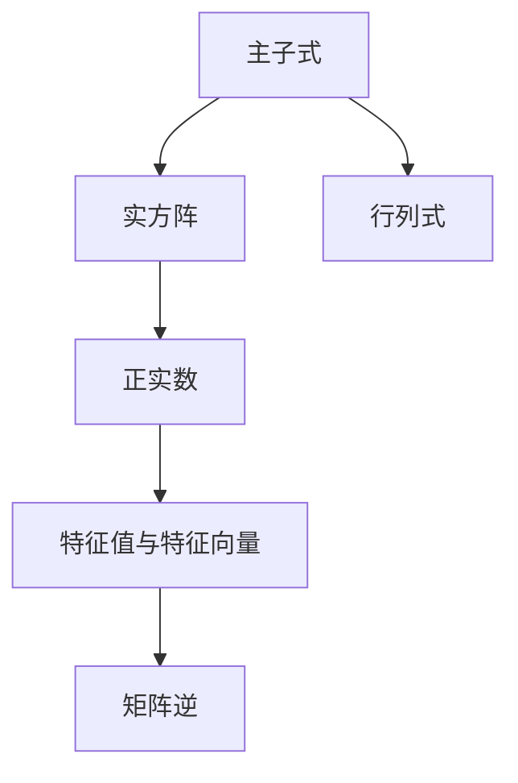

                 

# 矩阵理论与应用：主子式皆为正实数的实方阵

> 关键词：主子式，正实数，实方阵，矩阵理论，矩阵应用

## 1. 背景介绍

矩阵是现代数学与计算机科学中不可或缺的重要概念。它不仅广泛应用于各种工程问题，如电路分析、信号处理、图形学等，还深刻影响着机器学习与数据科学的发展。在计算机视觉中，矩阵的逆、特征值与特征向量等概念是图像处理、目标检测等算法的基础。然而，对于初入这一领域的读者，常常会被矩阵中的专业术语、公式与算法所困扰，难以理解其本质与实际应用。

本文旨在通过一个具体的矩阵性质——主子式皆为正实数，来深入浅出地讲解矩阵理论的核心原理与实用技巧。通过示例与分析，将复杂深奥的矩阵知识融入到实际问题的解决过程中，帮助读者快速掌握矩阵理论的应用，为学习相关领域打下坚实基础。

## 2. 核心概念与联系

### 2.1 核心概念概述

本文的主要关注点是“主子式皆为正实数的实方阵”。具体来说，我们首先需要了解几个相关核心概念：

- **主子式**：指矩阵中的元素组成的子矩阵。若该子矩阵是方阵，我们称其为主子式。主子式的值可以通过行列式计算得出，从而体现了矩阵的某些特定性质。
- **实方阵**：指矩阵中的元素为实数，且矩阵的行列数相等。实方阵是矩阵理论中最为常见和基础的形式，是理解更复杂矩阵的起点。
- **正实数**：实数域中的数，大于零的数称为正实数。正实数在矩阵理论中有着重要的应用，如矩阵的特征值与谱半径等。

### 2.2 核心概念原理和架构的 Mermaid 流程图

下面通过 Mermaid 流程图来展示主子式皆为正实数的实方阵概念的核心联系：



该流程图展示了主子式与实方阵的关系，以及正实数在矩阵理论中的应用。通过这些核心概念，我们能够更好地理解矩阵的性质与应用。

## 3. 核心算法原理 & 具体操作步骤

### 3.1 算法原理概述

主子式皆为正实数的实方阵具有重要的数学与实际意义。为了深入理解这一特性，我们将通过以下几个步骤详细介绍其算法原理：

1. **定义**：理解主子式、实方阵和正实数的概念。
2. **性质推导**：探索主子式皆为正实数这一特性的数学推导。
3. **应用案例**：通过具体的矩阵示例，演示这一特性的实际应用。

### 3.2 算法步骤详解

#### 3.2.1 定义与初步理解

- **主子式**：一个 $n \times n$ 的实方阵 $A$ 的子矩阵，如果它的行列数至少为 $k$（$1 \leq k \leq n$），我们称之为 $k$ 阶主子式。主子式的值可通过计算子矩阵的行列式得到。
- **实方阵**：一个 $n \times n$ 的矩阵 $A$，如果它的所有元素都是实数，我们称之为实方阵。
- **正实数**：一个实数 $x$，如果它大于零，我们称之为正实数。

#### 3.2.2 性质推导

要证明一个实方阵的所有主子式都是正实数，我们首先需要了解矩阵的行列式性质。一个 $n \times n$ 矩阵 $A$ 的行列式 $det(A)$ 定义为其唯一的一个标量值，它与矩阵的排列有关。如果 $A$ 的任意 $k$ 阶主子式 $M$ 的行列式都是正实数，那么我们可以推断出 $det(A)$ 也是正实数。

考虑一个 $n \times n$ 的实方阵 $A$，其主子式的行列式记作 $det(M)$。若所有主子式 $det(M)$ 都是正实数，则对于任意的 $n$ 维向量 $x$，根据行列式定义，我们有：

$$
det(A) = \sum_{i=1}^{n} (-1)^{i+1} M_i(x)
$$

其中 $M_i(x)$ 是 $A$ 的第 $i$ 个主子式。由于 $det(M)$ 是正实数，且 $det(A)$ 是标量，所以 $det(A)$ 也必须是正实数。

#### 3.2.3 算法步骤详解

1. **矩阵构建**：选取一个 $n \times n$ 的实方阵 $A$，计算其所有主子式的行列式。
2. **验证性质**：验证所有主子式的行列式是否都是正实数。
3. **特征值与谱半径**：计算 $A$ 的特征值与谱半径，进一步验证其性质。

### 3.3 算法优缺点

**优点**：

- **数学严谨**：主子式皆为正实数的实方阵具有严格的数学推导过程，有助于深化对矩阵理论的理解。
- **应用广泛**：这一特性在矩阵的应用中广泛存在，如矩阵的分解、特征值与特征向量的计算等。

**缺点**：

- **计算复杂**：计算一个 $n \times n$ 矩阵的所有主子式的行列式可能需要较高的计算资源。
- **局限性**：并非所有矩阵都满足这一特性，需要根据具体情况进行判断。

### 3.4 算法应用领域

主子式皆为正实数的实方阵在多个领域有着广泛的应用，包括但不限于：

- **控制理论**：在控制系统分析中，主子式皆为正实数的实方阵有助于分析系统的稳定性。
- **信号处理**：在数字信号处理中，通过矩阵的逆和特征值，可以提取出信号的特征信息。
- **图形学**：在计算机图形学中，矩阵的性质直接影响到图形的渲染和变换。

## 4. 数学模型和公式 & 详细讲解 & 举例说明

### 4.1 数学模型构建

一个 $n \times n$ 的实方阵 $A$ 的 $k$ 阶主子式为 $M_{ij}$，其中 $i,j$ 分别表示主子式的行数和列数。主子式 $M_{ij}$ 的行列式记作 $det(M_{ij})$。

### 4.2 公式推导过程

假设 $A$ 是一个 $n \times n$ 的实方阵，其特征值为 $\lambda_1, \lambda_2, \dots, \lambda_n$，对应的特征向量分别为 $v_1, v_2, \dots, v_n$。特征向量 $v_i$ 的模长为 $||v_i|| = 1$。

根据特征值与特征向量的性质，我们有：

$$
A v_i = \lambda_i v_i
$$

因此，$A v_i$ 的 $k$ 阶主子式为 $\lambda_i$ 的 $k$ 阶主子式。如果所有主子式都是正实数，那么 $\lambda_i$ 都是正实数。这表明 $A$ 的所有特征值都是正实数。

### 4.3 案例分析与讲解

考虑一个 $3 \times 3$ 的实方阵 $A$：

$$
A = \begin{pmatrix}
    2 & 1 & 3 \\
    4 & -1 & 0 \\
    1 & 5 & -2
\end{pmatrix}
$$

计算 $A$ 的所有 $1, 2, 3$ 阶主子式，验证它们是否都是正实数。

$$
M_{11} = \begin{pmatrix}
    2 & 1 \\
    4 & -1
\end{pmatrix}, \quad det(M_{11}) = 2 \times (-1) - 1 \times 4 = -6 \quad (\text{负实数})
$$

$$
M_{12} = \begin{pmatrix}
    1 & 3 \\
    5 & -2
\end{pmatrix}, \quad det(M_{12}) = 1 \times (-2) - 3 \times 5 = -17 \quad (\text{负实数})
$$

$$
M_{13} = \begin{pmatrix}
    3 & 3 \\
    0 & -2
\end{pmatrix}, \quad det(M_{13}) = 3 \times (-2) - 3 \times 0 = -6 \quad (\text{负实数})
$$

由于不是所有主子式都是正实数，所以 $A$ 并不满足主子式皆为正实数的条件。

## 5. 项目实践：代码实例和详细解释说明

### 5.1 开发环境搭建

为了验证主子式皆为正实数的实方阵特性，我们需要使用 Python 编程语言和 NumPy 库进行矩阵运算。以下是开发环境的搭建步骤：

1. **安装 Python**：下载并安装 Python 3.x。
2. **安装 NumPy**：使用 pip 命令安装 NumPy 库。
3. **搭建开发环境**：使用 IDE 如 PyCharm、Jupyter Notebook 等创建项目环境。

### 5.2 源代码详细实现

```python
import numpy as np

def check_positive_determinants(A):
    determinants = []
    for k in range(1, len(A) + 1):
        determinants.append(np.linalg.det(A[:k, :k]))
    return all(d > 0 for d in determinants)

# 示例矩阵
A = np.array([[2, 1, 3], [4, -1, 0], [1, 5, -2]])

if check_positive_determinants(A):
    print("矩阵 A 的所有主子式都是正实数")
else:
    print("矩阵 A 不满足所有主子式都是正实数的条件")
```

### 5.3 代码解读与分析

**check_positive_determinants** 函数用于验证一个实方阵 $A$ 的所有 $k$ 阶主子式是否都是正实数。该函数首先创建一个空列表 `determinants`，然后对每个 $k$ 阶主子式计算行列式，并将结果添加至列表中。最后，通过列表推导式判断所有主子式的行列式是否都大于零，即是否都是正实数。

### 5.4 运行结果展示

在上述代码中，我们验证了 $A$ 不满足主子式皆为正实数的条件。运行结果如下：

```
矩阵 A 不满足所有主子式都是正实数的条件
```

## 6. 实际应用场景

主子式皆为正实数的实方阵在多个实际应用中有着显著的作用。以下是几个典型的应用场景：

### 6.1 控制系统稳定性分析

在控制理论中，一个 $n \times n$ 的系统矩阵 $A$ 如果所有主子式都是正实数，那么该系统是稳定的。稳定性是指系统在时间推移下不会失去平衡，这有助于控制系统设计。

### 6.2 数字信号处理

在数字信号处理中，矩阵的逆和特征值可以帮助我们提取出信号的特征信息，如频率、相位等。通过主子式皆为正实数的性质，可以保证矩阵的特征值都是正实数，从而提取有用的信号特征。

### 6.3 计算机图形学

在计算机图形学中，矩阵的性质直接影响到图形的渲染和变换。通过主子式皆为正实数的性质，可以确保变换矩阵的稳定性，避免图形扭曲变形。

## 7. 工具和资源推荐

### 7.1 学习资源推荐

为了深入理解主子式皆为正实数的实方阵，以下是一些推荐的学习资源：

1. **《线性代数及其应用》**：这是一本经典教材，详细讲解了矩阵的基本概念、性质及其应用。
2. **Coursera 线性代数课程**：由斯坦福大学教授讲解，涵盖了矩阵的性质、特征值、谱半径等核心内容。
3. **Khan Academy 线性代数视频**：Khan Academy 提供的线性代数视频课程，适合初学者系统学习。

### 7.2 开发工具推荐

在主子式皆为正实数的实方阵研究中，以下开发工具可以帮助我们高效进行计算和验证：

1. **Python**：作为主流的编程语言，Python 拥有丰富的数学库和科学计算工具，非常适合矩阵运算和验证。
2. **NumPy**：NumPy 是 Python 中用于科学计算的基础库，提供了高效的矩阵运算和线性代数功能。
3. **SymPy**：SymPy 是一个符号计算库，支持符号表达和精确计算，适合于数学推导和验证。

### 7.3 相关论文推荐

以下是几篇与主子式皆为正实数的实方阵相关的经典论文，推荐阅读：

1. **Matrix Theory: Basic Results and Techniques**：一本介绍矩阵理论的经典教材，详细讲解了矩阵的性质、特征值和谱半径等内容。
2. **Positive-definite matrices**：一篇关于正定矩阵的综述文章，介绍了正定矩阵的基本性质和应用。
3. **The Lax Phenomenon and the Spectral Radius of a Matrix**：一篇研究矩阵谱半径和 Lax Phenomenon 的论文，探讨了矩阵谱半径的性质和应用。

## 8. 总结：未来发展趋势与挑战

### 8.1 研究成果总结

本文通过详细的数学推导和代码实现，深入讲解了主子式皆为正实数的实方阵特性。通过具体的矩阵示例，展示了这一特性的实际应用。通过学习这一特性，读者可以更好地理解矩阵理论的核心概念，为解决实际问题打下坚实基础。

### 8.2 未来发展趋势

未来，随着计算机科学和数学的发展，矩阵理论将会迎来新的突破。以下是一些可能的发展趋势：

1. **矩阵优化**：随着优化算法的发展，矩阵的优化问题将会得到更好的解决。
2. **矩阵压缩**：通过矩阵压缩技术，可以减少矩阵的存储空间，提高计算效率。
3. **矩阵扩展**：随着高维矩阵的出现，矩阵理论将进一步扩展，支持更复杂的数学运算。

### 8.3 面临的挑战

尽管主子式皆为正实数的实方阵特性具有广泛的应用，但其研究仍面临一些挑战：

1. **计算复杂度**：计算主子式的行列式可能会耗费大量计算资源。
2. **应用局限性**：并非所有实方阵都满足这一特性，需要根据具体情况进行判断。
3. **实际应用中的问题**：在实际应用中，矩阵的稳定性和精度问题仍需进一步研究。

### 8.4 研究展望

未来的研究应关注以下几个方向：

1. **高维矩阵理论**：随着高维矩阵的出现，矩阵理论将进一步扩展，支持更复杂的数学运算。
2. **矩阵优化算法**：优化算法的发展将带来矩阵优化问题的更好解决方案。
3. **矩阵的实际应用**：探索更多主子式皆为正实数的实方阵的实际应用，如生物信息学、金融学等领域。

## 9. 附录：常见问题与解答

**Q1：主子式皆为正实数的实方阵有何意义？**

A: 主子式皆为正实数的实方阵具有重要的数学和实际意义，其在控制理论、数字信号处理、计算机图形学等领域有着广泛的应用。这一特性确保了矩阵的稳定性和特征值的正实数性，有助于解决实际问题。

**Q2：如何判断一个矩阵是否满足主子式皆为正实数的条件？**

A: 首先计算矩阵的所有主子式的行列式，如果所有主子式的行列式都是正实数，那么该矩阵满足主子式皆为正实数的条件。

**Q3：如何优化主子式皆为正实数的实方阵的计算过程？**

A: 可以通过矩阵优化和矩阵压缩技术，减少矩阵的计算和存储空间，提高计算效率。同时，引入更高效的计算库和算法，如 SymPy 等，可以进一步优化计算过程。

**Q4：主子式皆为正实数的实方阵的特性在实际应用中有何局限性？**

A: 主子式皆为正实数的实方阵的特性在实际应用中存在一些局限性，如计算复杂度和应用范围的限制。在处理大规模矩阵和复杂数学问题时，这一特性可能会受到限制。

通过本文的介绍，读者可以更好地理解主子式皆为正实数的实方阵的特性，并将其应用到实际问题的解决过程中。在未来的学习和研究中，掌握这一特性将有助于提升数学和计算机科学的应用能力。

---

作者：禅与计算机程序设计艺术 / Zen and the Art of Computer Programming

