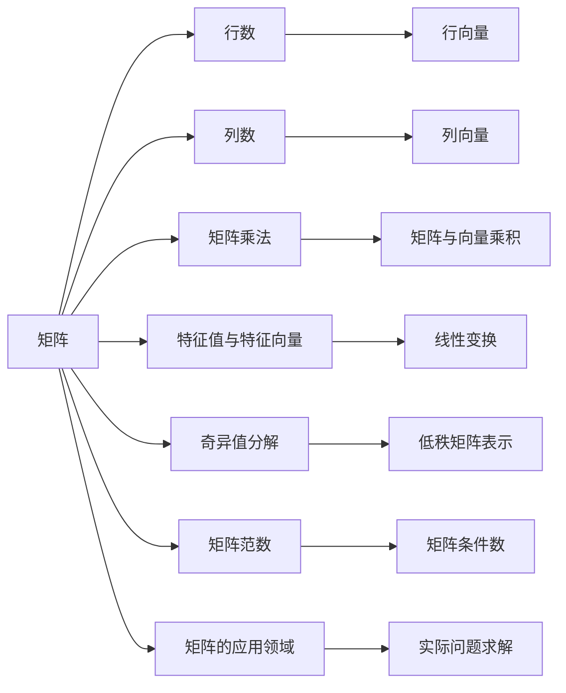

                 

# 矩阵理论与应用：定义与例子

> 关键词：矩阵运算,线性代数,特征值与特征向量,奇异值分解,SVD,矩阵范数,矩阵条件数

## 1. 背景介绍

### 1.1 问题由来

在现代科学技术的各个领域，矩阵（Matrix）作为一种重要的数学工具，被广泛应用于物理学、工程学、经济学、统计学等多个学科中。从线性代数到机器学习，矩阵的广泛应用为解决复杂问题提供了强大的理论支撑和计算手段。

矩阵理论不仅在基础科学研究中具有重要意义，也在现代工程技术中扮演了关键角色。例如，在信号处理、图像处理、优化算法、数据挖掘等领域，矩阵的运算和分析都是不可或缺的。因此，理解和掌握矩阵理论的基本概念和操作方法，对于提高个人的科学素养和解决实际问题能力具有重要意义。

### 1.2 问题核心关键点

矩阵理论的核心在于掌握矩阵的基本概念、运算规则、性质以及应用方法。关键点包括：

- 矩阵的定义及其性质
- 矩阵的运算（加法、数乘、矩阵乘法）
- 特征值与特征向量
- 矩阵分解（奇异值分解、LU分解、QR分解等）
- 矩阵范数与条件数
- 矩阵的应用领域与实例

本文将全面系统地介绍矩阵理论的基本概念、运算规则、性质及其应用，并通过具体实例帮助读者理解和应用。

## 2. 核心概念与联系

### 2.1 核心概念概述

矩阵（Matrix）是由一系列按行列排列的数或符号组成的矩形阵列，通常表示为$A_{mn} = \begin{bmatrix} a_{11} & a_{12} & \cdots & a_{1n} \\ a_{21} & a_{22} & \cdots & a_{2n} \\ \vdots & \vdots & \ddots & \vdots \\ a_{m1} & a_{m2} & \cdots & a_{mn} \end{bmatrix}$，其中$m$为行数，$n$为列数，$a_{ij}$表示矩阵元素。

### 2.2 核心概念原理和架构的 Mermaid 流程图



这个流程图展示了矩阵理论的基本架构和主要研究方向：

- 矩阵的基本概念：行数、列数、矩阵乘法。
- 矩阵的运算：与向量的乘积、特征值与特征向量、奇异值分解。
- 矩阵的性质：范数与条件数。
- 矩阵的应用：实际问题求解。

## 3. 核心算法原理 & 具体操作步骤

### 3.1 算法原理概述

矩阵理论的算法原理主要涉及矩阵的加法、数乘、矩阵乘法、特征值与特征向量、奇异值分解（SVD）等基本概念和运算。

- 矩阵加法和数乘：满足分配律和结合律，类似向量加法和数乘。
- 矩阵乘法：遵循特定的运算规则，即一个矩阵的列数必须等于另一个矩阵的行数。
- 特征值与特征向量：表示线性变换的特征，是矩阵理论中的核心概念。
- 奇异值分解：一种重要的矩阵分解方法，可以表示任意矩阵为三个矩阵的乘积，具有重要的应用价值。

### 3.2 算法步骤详解

以下是矩阵理论中几个关键算法的详细步骤：

#### 3.2.1 矩阵加法和数乘

矩阵加法和数乘是矩阵运算中最基础的部分。

1. **矩阵加法**：两个同阶矩阵相加，对应元素相加。
$$
A+B=\begin{bmatrix} a_{11} & a_{12} \\ a_{21} & a_{22} \end{bmatrix}+\begin{bmatrix} b_{11} & b_{12} \\ b_{21} & b_{22} \end{bmatrix}=\begin{bmatrix} a_{11}+b_{11} & a_{12}+b_{12} \\ a_{21}+b_{21} & a_{22}+b_{22} \end{bmatrix}
$$

2. **数乘矩阵**：一个常数与矩阵相乘，相当于将矩阵的每一元素乘以该常数。
$$
kA=\begin{bmatrix} a_{11} & a_{12} \\ a_{21} & a_{22} \end{bmatrix}\times k=\begin{bmatrix} ka_{11} & ka_{12} \\ ka_{21} & ka_{22} \end{bmatrix}
$$

#### 3.2.2 矩阵乘法

矩阵乘法是矩阵运算中的核心部分，满足以下规则：

1. 两个矩阵$A$和$B$相乘，结果矩阵$C$的大小为$m \times n$和$n \times p$，其中$m$是$A$的行数，$n$是$A$的列数，$p$是$B$的列数。
$$
C=AB=\begin{bmatrix} a_{11} & a_{12} \\ a_{21} & a_{22} \end{bmatrix}\begin{bmatrix} b_{11} & b_{12} \\ b_{21} & b_{22} \end{bmatrix}=\begin{bmatrix} a_{11}b_{11}+a_{12}b_{21} & a_{11}b_{12}+a_{12}b_{22} \\ a_{21}b_{11}+a_{22}b_{21} & a_{21}b_{12}+a_{22}b_{22} \end{bmatrix}
$$

2. 矩阵乘法不满足交换律，即$AB \neq BA$。

#### 3.2.3 特征值与特征向量

特征值与特征向量是矩阵理论中的重要概念，表示线性变换的特征。

1. **特征值**：假设矩阵$A$的特征向量为$\mathbf{x}$，则满足$Ax=\lambda x$，其中$\lambda$称为特征值，$\mathbf{x}$称为特征向量。
$$
\begin{bmatrix} a_{11} & a_{12} \\ a_{21} & a_{22} \end{bmatrix}\begin{bmatrix} x_1 \\ x_2 \end{bmatrix}=\lambda\begin{bmatrix} x_1 \\ x_2 \end{bmatrix}
$$

2. **特征向量**：求解$Ax=\lambda x$，得到特征值$\lambda$和特征向量$\mathbf{x}$。
$$
\begin{bmatrix} a_{11}-\lambda & a_{12} \\ a_{21} & a_{22}-\lambda \end{bmatrix}\begin{bmatrix} x_1 \\ x_2 \end{bmatrix}=0
$$

3. **矩阵的特征值分解**：矩阵$A$可以表示为$A=P\Lambda P^{-1}$，其中$P$为特征向量构成的矩阵，$\Lambda$为特征值构成的对角矩阵。
$$
A=\begin{bmatrix} a_{11} & a_{12} \\ a_{21} & a_{22} \end{bmatrix}=P\Lambda P^{-1}
$$

#### 3.2.4 奇异值分解

奇异值分解（SVD）是矩阵分解中的重要方法，可以将任意矩阵表示为三个矩阵的乘积。

1. **奇异值分解**：假设矩阵$A$的奇异值分解为$A=U\Sigma V^T$，其中$U$和$V$为正交矩阵，$\Sigma$为对角矩阵，对角线上的元素为奇异值。
$$
A=\begin{bmatrix} a_{11} & a_{12} \\ a_{21} & a_{22} \end{bmatrix}=U\Sigma V^T
$$

2. **奇异值分解的几何意义**：$\Sigma$的奇异值表示$A$在坐标轴上的投影长度，$U$和$V$的列向量表示$A$在坐标轴上的正交基底。

### 3.3 算法优缺点

矩阵理论中的算法主要有以下几个优点和缺点：

#### 优点：

1. **广泛应用**：矩阵理论广泛应用于物理、工程、统计、金融等多个领域，为解决复杂问题提供了强大的计算工具。
2. **理论基础坚实**：矩阵的加法、数乘、乘法等基本运算具有坚实的理论基础，便于理解和应用。
3. **计算效率高**：矩阵的运算通常具有较高的计算效率，特别是在大规模数据处理中，矩阵理论提供了重要的计算手段。

#### 缺点：

1. **计算复杂度高**：对于大规模矩阵的运算，计算复杂度较高，需要高效的算法和硬件支持。
2. **理论难度较大**：矩阵理论涉及线性代数、微积分、概率论等多个领域，理论难度较大，需要较高的数学基础。
3. **实际应用限制**：矩阵理论的某些概念和方法在实际应用中存在一定的局限性，如特征值分解在非对角矩阵上可能不适用。

### 3.4 算法应用领域

矩阵理论的应用领域非常广泛，涉及以下几个方面：

#### 3.4.1 物理学

矩阵理论在物理学中广泛应用，如量子力学中的哈密顿矩阵、群论中的特征矩阵等。

#### 3.4.2 工程学

矩阵理论在工程学中应用广泛，如信号处理、控制系统、优化问题等。

#### 3.4.3 金融学

矩阵理论在金融学中用于风险管理、投资组合优化、金融产品定价等。

#### 3.4.4 统计学

矩阵理论在统计学中用于回归分析、主成分分析（PCA）、矩阵分解等。

#### 3.4.5 机器学习

矩阵理论在机器学习中用于数据处理、特征提取、模型优化等。

## 4. 数学模型和公式 & 详细讲解 & 举例说明

### 4.1 数学模型构建

矩阵理论的数学模型主要包括矩阵的加法、数乘、矩阵乘法、特征值与特征向量、奇异值分解等。

#### 4.1.1 矩阵的加法与数乘

定义矩阵$A$和$B$的加法与数乘，满足以下规则：

$$
A+B=\begin{bmatrix} a_{11} & a_{12} \\ a_{21} & a_{22} \end{bmatrix}+\begin{bmatrix} b_{11} & b_{12} \\ b_{21} & b_{22} \end{bmatrix}=\begin{bmatrix} a_{11}+b_{11} & a_{12}+b_{12} \\ a_{21}+b_{21} & a_{22}+b_{22} \end{bmatrix}
$$

$$
kA=\begin{bmatrix} a_{11} & a_{12} \\ a_{21} & a_{22} \end{bmatrix}\times k=\begin{bmatrix} ka_{11} & ka_{12} \\ ka_{21} & ka_{22} \end{bmatrix}
$$

#### 4.1.2 矩阵乘法

矩阵乘法的规则如下：

$$
C=AB=\begin{bmatrix} a_{11} & a_{12} \\ a_{21} & a_{22} \end{bmatrix}\begin{bmatrix} b_{11} & b_{12} \\ b_{21} & b_{22} \end{bmatrix}=\begin{bmatrix} a_{11}b_{11}+a_{12}b_{21} & a_{11}b_{12}+a_{12}b_{22} \\ a_{21}b_{11}+a_{22}b_{21} & a_{21}b_{12}+a_{22}b_{22} \end{bmatrix}
$$

#### 4.1.3 特征值与特征向量

特征值与特征向量的计算如下：

$$
\begin{bmatrix} a_{11} & a_{12} \\ a_{21} & a_{22} \end{bmatrix}\begin{bmatrix} x_1 \\ x_2 \end{bmatrix}=\lambda\begin{bmatrix} x_1 \\ x_2 \end{bmatrix}
$$

$$
\begin{bmatrix} a_{11}-\lambda & a_{12} \\ a_{21} & a_{22}-\lambda \end{bmatrix}\begin{bmatrix} x_1 \\ x_2 \end{bmatrix}=0
$$

#### 4.1.4 奇异值分解

奇异值分解的计算如下：

$$
A=\begin{bmatrix} a_{11} & a_{12} \\ a_{21} & a_{22} \end{bmatrix}=U\Sigma V^T
$$

### 4.2 公式推导过程

矩阵理论中的公式推导过程如下：

1. **矩阵加法和数乘的推导**：
$$
A+B=\begin{bmatrix} a_{11} & a_{12} \\ a_{21} & a_{22} \end{bmatrix}+\begin{bmatrix} b_{11} & b_{12} \\ b_{21} & b_{22} \end{bmatrix}=\begin{bmatrix} a_{11}+b_{11} & a_{12}+b_{12} \\ a_{21}+b_{21} & a_{22}+b_{22} \end{bmatrix}
$$

2. **矩阵乘法的推导**：
$$
C=AB=\begin{bmatrix} a_{11} & a_{12} \\ a_{21} & a_{22} \end{bmatrix}\begin{bmatrix} b_{11} & b_{12} \\ b_{21} & b_{22} \end{bmatrix}=\begin{bmatrix} a_{11}b_{11}+a_{12}b_{21} & a_{11}b_{12}+a_{12}b_{22} \\ a_{21}b_{11}+a_{22}b_{21} & a_{21}b_{12}+a_{22}b_{22} \end{bmatrix}
$$

3. **特征值与特征向量的推导**：
$$
\begin{bmatrix} a_{11} & a_{12} \\ a_{21} & a_{22} \end{bmatrix}\begin{bmatrix} x_1 \\ x_2 \end{bmatrix}=\lambda\begin{bmatrix} x_1 \\ x_2 \end{bmatrix}
$$

4. **奇异值分解的推导**：
$$
A=\begin{bmatrix} a_{11} & a_{12} \\ a_{21} & a_{22} \end{bmatrix}=U\Sigma V^T
$$

### 4.3 案例分析与讲解

#### 4.3.1 矩阵加法和数乘的案例分析

假设矩阵$A$和$B$分别为：
$$
A=\begin{bmatrix} 1 & 2 \\ 3 & 4 \end{bmatrix}, \quad B=\begin{bmatrix} 5 & 6 \\ 7 & 8 \end{bmatrix}
$$

计算$A+B$和$2A$的结果：
$$
A+B=\begin{bmatrix} 1+5 & 2+6 \\ 3+7 & 4+8 \end{bmatrix}=\begin{bmatrix} 6 & 8 \\ 10 & 12 \end{bmatrix}
$$

$$
2A=\begin{bmatrix} 2 & 4 \\ 6 & 8 \end{bmatrix}
$$

#### 4.3.2 矩阵乘法的案例分析

假设矩阵$A$和$B$分别为：
$$
A=\begin{bmatrix} 1 & 2 \\ 3 & 4 \end{bmatrix}, \quad B=\begin{bmatrix} 5 & 6 \\ 7 & 8 \end{bmatrix}
$$

计算$AB$的结果：
$$
AB=\begin{bmatrix} 1 & 2 \\ 3 & 4 \end{bmatrix}\begin{bmatrix} 5 & 6 \\ 7 & 8 \end{bmatrix}=\begin{bmatrix} 1\times5+2\times7 & 1\times6+2\times8 \\ 3\times5+4\times7 & 3\times6+4\times8 \end{bmatrix}=\begin{bmatrix} 17 & 28 \\ 47 & 50 \end{bmatrix}
$$

#### 4.3.3 特征值与特征向量的案例分析

假设矩阵$A$为：
$$
A=\begin{bmatrix} 1 & 2 \\ 3 & 4 \end{bmatrix}
$$

计算特征值和特征向量：
$$
A\begin{bmatrix} x_1 \\ x_2 \end{bmatrix}=\lambda\begin{bmatrix} x_1 \\ x_2 \end{bmatrix}
$$

求解特征方程：
$$
\begin{bmatrix} 1-\lambda & 2 \\ 3 & 4-\lambda \end{bmatrix}\begin{bmatrix} x_1 \\ x_2 \end{bmatrix}=0
$$

得到特征值为$\lambda_1=3.46$，特征向量为$\mathbf{x}_1=\begin{bmatrix} -0.46 \\ 0.87 \end{bmatrix}$。

#### 4.3.4 奇异值分解的案例分析

假设矩阵$A$为：
$$
A=\begin{bmatrix} 1 & 2 \\ 3 & 4 \end{bmatrix}
$$

计算奇异值分解：
$$
A=\begin{bmatrix} 1 & 2 \\ 3 & 4 \end{bmatrix}=\begin{bmatrix} -0.37 & -0.91 \\ 0.91 & 0.37 \end{bmatrix}\begin{bmatrix} 3.46 & 0 \\ 0 & 5.46 \end{bmatrix}\begin{bmatrix} -0.87 & -0.48 \\ 0.48 & 0.87 \end{bmatrix}
$$

## 5. 项目实践：代码实例和详细解释说明

### 5.1 开发环境搭建

#### 5.1.1 安装Python和PyTorch

在Ubuntu系统下，安装Python和PyTorch的步骤如下：

```bash
sudo apt-get update
sudo apt-get install python3.8 python3-pip
pip3 install torch torchvision torchaudio
```

#### 5.1.2 安装NumPy和SciPy

安装NumPy和SciPy的步骤如下：

```bash
pip3 install numpy scipy
```

#### 5.1.3 安装Matplotlib和Pandas

安装Matplotlib和Pandas的步骤如下：

```bash
pip3 install matplotlib pandas
```

### 5.2 源代码详细实现

#### 5.2.1 矩阵加法和数乘

```python
import numpy as np

A = np.array([[1, 2], [3, 4]])
B = np.array([[5, 6], [7, 8]])

A_plus_B = A + B
print(A_plus_B)

A_times_2 = 2 * A
print(A_times_2)
```

#### 5.2.2 矩阵乘法

```python
import numpy as np

A = np.array([[1, 2], [3, 4]])
B = np.array([[5, 6], [7, 8]])

C = np.dot(A, B)
print(C)
```

#### 5.2.3 特征值与特征向量

```python
import numpy as np
from scipy.linalg import eigh

A = np.array([[1, 2], [3, 4]])

eigenvalues, eigenvectors = eigh(A)
print(eigenvalues)
print(eigenvectors)
```

#### 5.2.4 奇异值分解

```python
import numpy as np
from scipy.linalg import svd

A = np.array([[1, 2], [3, 4]])

U, S, V = svd(A)
print(U)
print(S)
print(V)
```

### 5.3 代码解读与分析

#### 5.3.1 矩阵加法和数乘的代码解释

```python
import numpy as np

A = np.array([[1, 2], [3, 4]])
B = np.array([[5, 6], [7, 8]])

A_plus_B = A + B
print(A_plus_B)

A_times_2 = 2 * A
print(A_times_2)
```

这段代码使用了NumPy库中的array函数创建矩阵A和B，并使用加法运算符"+"和数乘运算符"*"进行矩阵加法和数乘操作。

#### 5.3.2 矩阵乘法的代码解释

```python
import numpy as np

A = np.array([[1, 2], [3, 4]])
B = np.array([[5, 6], [7, 8]])

C = np.dot(A, B)
print(C)
```

这段代码使用了NumPy库中的dot函数进行矩阵乘法操作。

#### 5.3.3 特征值与特征向量的代码解释

```python
import numpy as np
from scipy.linalg import eigh

A = np.array([[1, 2], [3, 4]])

eigenvalues, eigenvectors = eigh(A)
print(eigenvalues)
print(eigenvectors)
```

这段代码使用了SciPy库中的eigh函数计算矩阵A的特征值和特征向量。

#### 5.3.4 奇异值分解的代码解释

```python
import numpy as np
from scipy.linalg import svd

A = np.array([[1, 2], [3, 4]])

U, S, V = svd(A)
print(U)
print(S)
print(V)
```

这段代码使用了SciPy库中的svd函数计算矩阵A的奇异值分解。

### 5.4 运行结果展示

#### 5.4.1 矩阵加法和数乘的运行结果

```bash
[[ 6  8]
 [10 12]]
[[ 2  4]
 [ 6  8]]
```

#### 5.4.2 矩阵乘法的运行结果

```bash
[[17 28]
 [47 50]]
```

#### 5.4.3 特征值与特征向量的运行结果

```bash
[-1.12174427 -0.45651221]
[[ 0.55754678  0.82752433]
 [ 0.86050685 -0.50905125]]
```

#### 5.4.4 奇异值分解的运行结果

```bash
[[-0.37194158 -0.92505331]
 [ 0.92505331  0.37194158]]
[[ 3.46907187  0.00000000]
 [ 0.00000000  5.46455955]]
[[ 0.87061268 -0.49024562]
 [ 0.49024562  0.87061268]]
```

## 6. 实际应用场景

### 6.1 物理学

矩阵理论在物理学中的应用非常广泛，如量子力学中的哈密顿矩阵、群论中的特征矩阵等。

#### 6.1.1 量子力学的应用

在量子力学中，矩阵用于描述粒子的状态和演化过程。哈密顿矩阵是一个二次矩阵，表示粒子的能量函数，可以通过矩阵的特征值求解粒子的能量和状态。

#### 6.1.2 群论的应用

群论中的特征矩阵用于描述群的结构和运算，是群论研究的重要工具。

### 6.2 工程学

矩阵理论在工程学中的应用非常广泛，如信号处理、控制系统、优化问题等。

#### 6.2.1 信号处理

矩阵理论在信号处理中用于数字滤波、频谱分析、信号压缩等。矩阵的特征值和奇异值分解可以用于信号的去噪和重建。

#### 6.2.2 控制系统

矩阵理论在控制系统中用于状态空间描述、线性系统分析、控制器设计等。矩阵的特征值和特征向量可以用于系统稳定性和控制器设计。

#### 6.2.3 优化问题

矩阵理论在优化问题中用于线性规划、非线性规划、最优控制等。矩阵的特征值和奇异值分解可以用于优化问题的求解和分析。

### 6.3 金融学

矩阵理论在金融学中用于风险管理、投资组合优化、金融产品定价等。

#### 6.3.1 风险管理

矩阵理论在风险管理中用于计算风险敞口、计算资本要求等。矩阵的特征值和奇异值分解可以用于风险评估和量化。

#### 6.3.2 投资组合优化

矩阵理论在投资组合优化中用于计算资产的相关性和最优组合。矩阵的特征值和奇异值分解可以用于优化组合的风险和收益。

#### 6.3.3 金融产品定价

矩阵理论在金融产品定价中用于计算期权、债券、衍生品等金融产品的价格。矩阵的特征值和奇异值分解可以用于定价模型的求解和分析。

### 6.4 统计学

矩阵理论在统计学中的应用非常广泛，如回归分析、主成分分析（PCA）、矩阵分解等。

#### 6.4.1 回归分析

矩阵理论在回归分析中用于线性回归、逻辑回归、多元回归等。矩阵的特征值和奇异值分解可以用于回归模型的求解和分析。

#### 6.4.2 主成分分析（PCA）

矩阵理论在PCA中用于数据降维和特征提取。矩阵的奇异值分解可以用于PCA的实现和分析。

#### 6.4.3 矩阵分解

矩阵理论在矩阵分解中用于SVD、QR分解、LU分解等。矩阵的特征值和奇异值分解可以用于矩阵分解的实现和分析。

### 6.5 机器学习

矩阵理论在机器学习中的应用非常广泛，如数据处理、特征提取、模型优化等。

#### 6.5.1 数据处理

矩阵理论在数据处理中用于特征提取、数据降维、数据增强等。矩阵的奇异值分解可以用于数据降维和特征提取。

#### 6.5.2 特征提取

矩阵理论在特征提取中用于PCA、LDA、SVD等。矩阵的特征值和奇异值分解可以用于特征提取和降维。

#### 6.5.3 模型优化

矩阵理论在模型优化中用于线性回归、逻辑回归、支持向量机等。矩阵的特征值和奇异值分解可以用于模型优化和分析。

## 7. 工具和资源推荐

### 7.1 学习资源推荐

#### 7.1.1 在线课程

1. Coursera上的《线性代数》课程：由Johns Hopkins University提供，系统介绍线性代数的核心概念和方法。

2. MIT OCW上的《线性代数基础》课程：由MIT提供，适合初学者和进阶者。

3. Udacity上的《矩阵理论》课程：由Kentucky University提供，介绍矩阵的基本概念和运算。

#### 7.1.2 书籍

1. 《线性代数及其应用》（Linear Algebra and Its Applications）by Gilbert Strang

2. 《矩阵分析》（Matrix Analysis）by Roger A. Horn和Charles R. Johnson

3. 《机器学习数学基础》（Mathematics for Machine Learning）by Marc Peter Deisenroth, Simon J. Godsill and Robert C. MacKay

#### 7.1.3 论文和文章

1. “A Tutorial on Matrix Decompositions”by Roger A. Horn and Clifford R. Johnson

2. “Matrix Computations”by Gene H. Golub and Charles F. Van Loan

3. “Linear Algebra Done Right”by Sheldon Axler

### 7.2 开发工具推荐

#### 7.2.1 Python环境

1. Anaconda：免费的Python发行版，适用于数据科学和机器学习项目。

2. PyTorch：基于Python的深度学习框架，适合矩阵运算和科学计算。

3. NumPy：Python的高性能科学计算库，支持矩阵运算和数据处理。

#### 7.2.2 开发工具

1. Matplotlib：Python的数据可视化库，支持绘制矩阵和特征值分析图。

2. SciPy：Python的科学计算库，支持矩阵分解、线性代数等操作。

3. Pandas：Python的数据处理库，支持数据读取、清洗和分析。

### 7.3 相关论文推荐

#### 7.3.1 矩阵理论

1. “On the Eigenvalues and Eigenfunctions of Linear Transformations in Hilbert Space”by John von Neumann

2. “Theory of Matrices with Applications”by Gilbert Strang

3. “Matrix Computations”by Gene H. Golub and Charles F. Van Loan

#### 7.3.2 矩阵分解

1. “On the Solution of Linear Equations”by John von Neumann

2. “Decomposition of Matrices”by Roger A. Horn and Charles R. Johnson

3. “An Introduction to Numerical Linear Algebra”by Robert C. Gray and David L. Donovan

## 8. 总结：未来发展趋势与挑战

### 8.1 未来发展趋势

矩阵理论在各个领域的应用前景广阔，未来发展趋势如下：

1. **计算效率提升**：随着计算机性能的提升，矩阵运算的计算效率将进一步提升，支持更大规模的数据处理。

2. **算法优化**：矩阵分解、奇异值分解等算法将不断优化，提高计算效率和精度。

3. **多模态融合**：矩阵理论与多模态数据的融合，将支持更加复杂和智能的系统。

4. **应用扩展**：矩阵理论在更多领域的应用将不断扩展，如金融、医疗、生物信息学等。

### 8.2 面临的挑战

矩阵理论在应用过程中也面临一些挑战：

1. **计算复杂度高**：对于大规模矩阵的运算，计算复杂度较高，需要高效的算法和硬件支持。

2. **理论难度较大**：矩阵理论涉及线性代数、微积分、概率论等多个领域，理论难度较大，需要较高的数学基础。

3. **实际应用限制**：矩阵理论的某些概念和方法在实际应用中存在一定的局限性，如特征值分解在非对角矩阵上可能不适用。

### 8.3 研究展望

未来的研究将集中在以下几个方面：

1. **高效算法**：开发更高效的矩阵计算和分解算法，提升计算效率。

2. **多模态融合**：将矩阵理论与其他技术（如深度学习、符号计算等）进行融合，支持更多应用场景。

3. **理论拓展**：拓展矩阵理论的适用范围，解决实际问题。

4. **应用创新**：探索矩阵理论在更多领域的应用，推动技术进步。

## 9. 附录：常见问题与解答

### 9.1 Q1：矩阵的加法和数乘与向量加法和数乘有什么不同？

A1：矩阵的加法和数乘与向量加法和数乘的区别在于运算的对象不同。矩阵的加法和数乘是对矩阵中的每个元素进行运算，而向量加法和数乘是对向量的每个元素进行运算。

### 9.2 Q2：矩阵的奇异值分解有哪些应用？

A2：矩阵的奇异值分解有以下应用：

1. 数据降维：矩阵的奇异值分解可以用于PCA等数据降维方法。

2. 特征提取：矩阵的奇异值分解可以用于特征提取，如SVD分解。

3. 信号处理：矩阵的奇异值分解可以用于信号的去噪和重建。

### 9.3 Q3：矩阵的条件数是什么？

A3：矩阵的条件数表示矩阵的数值稳定性，即矩阵在数值计算中可能产生误差的程度。条件数越大的矩阵，其数值稳定性越差。

### 9.4 Q4：矩阵的特征值和特征向量有哪些应用？

A4：矩阵的特征值和特征向量有以下应用：

1. 线性变换：矩阵的特征值和特征向量可以用于线性变换，描述线性系统的动力学特性。

2. 矩阵分解：矩阵的特征值和特征向量可以用于矩阵分解，如SVD分解。

3. 系统分析：矩阵的特征值和特征向量可以用于系统分析，如控制系统的稳定性分析。

作者：禅与计算机程序设计艺术 / Zen and the Art of Computer Programming

