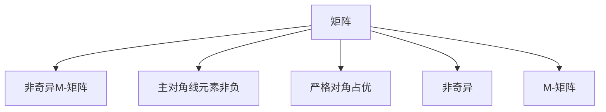

                 

## 1. 背景介绍

### 1.1 问题由来

在数值分析和线性代数领域，矩阵的性质和应用研究一直是重要课题。其中，M-矩阵是一类特殊矩阵，其具有许多独特的性质和应用场景。对M-矩阵的深入研究有助于解决实际问题，如非负系统稳定性分析、正则化线性回归等。

然而，M-矩阵的相关研究往往较为复杂，涉及到许多线性代数和矩阵理论的高级概念，缺乏通俗易懂的介绍和应用案例。因此，本文旨在系统介绍非奇异M-矩阵的特性，探讨其在工程和科学领域的应用，帮助读者全面理解和掌握这一重要概念。

### 1.2 问题核心关键点

非奇异M-矩阵是M-矩阵的一个子集，具有以下性质：

- **非负主对角线元素**：主对角线上的元素均为非负实数。
- **严格对角占优**：任意元素行之和严格小于其对角元素的行之和。

非奇异M-矩阵具备许多其他M-矩阵不具备的特性，如非奇异性和对称性等。这些特性使得其在实际问题中具有重要的应用价值。本文将从非奇异M-矩阵的定义和性质出发，详细探讨其在实际问题中的应用，帮助读者深入理解这一概念。

## 2. 核心概念与联系

### 2.1 核心概念概述

为更好地理解非奇异M-矩阵的特性，本节将介绍几个密切相关的核心概念：

- **矩阵**：一个由数或数学表达式排列成的矩形阵列，其中横排称为行，纵排称为列。
- **主对角线**：矩阵中从左上角到右下角的那条线。
- **非奇异矩阵**：行列式非零的矩阵，可逆。
- **对角占优矩阵**：矩阵中任意元素行的和严格小于其对角元素的行之和。
- **M-矩阵**：非奇异、主对角线元素非负、严格对角占优的矩阵。
- **非奇异M-矩阵**：在M-矩阵的基础上，再加上非奇异性约束。

这些核心概念之间的逻辑关系可以通过以下Mermaid流程图来展示：



这个流程图展示了几类矩阵之间的关系：

1. 矩阵通过增加非奇异性和主对角线非负性约束，成为M-矩阵。
2. 在M-矩阵的基础上，通过增加对角占优性约束，成为非奇异M-矩阵。

这些概念共同构成了M-矩阵及其子集的非奇异M-矩阵的理论基础。理解这些概念可以帮助读者更好地把握M-矩阵的特性和应用。

## 3. 核心算法原理 & 具体操作步骤

### 3.1 算法原理概述

非奇异M-矩阵的性质主要源于其对角占优性和主对角线非负性。这些性质使得非奇异M-矩阵具有以下重要特性：

- **非奇异性**：非奇异M-矩阵可逆，具有线性方程组解的性质。
- **对称性**：非奇异M-矩阵通常是对称矩阵，具有许多对称矩阵的良好性质。
- **非负性**：非奇异M-矩阵的特征值非负，具有正定性。

这些性质使得非奇异M-矩阵在实际问题中具有广泛的应用，如线性回归、最小二乘法、稳定性分析等。

### 3.2 算法步骤详解

非奇异M-矩阵的应用涉及多个数学和工程领域，其核心思想是通过矩阵的特性进行问题建模和求解。

**Step 1: 确定问题模型**

首先，根据实际问题确定相应的线性模型。例如，假设我们要进行线性回归，可以得到以下模型：

$$
\mathbf{y} = \mathbf{A} \mathbf{x} + \mathbf{b}
$$

其中，$\mathbf{y}$ 为输出向量，$\mathbf{x}$ 为输入向量，$\mathbf{A}$ 为系数矩阵，$\mathbf{b}$ 为偏置向量。

**Step 2: 确定系数矩阵特性**

接下来，根据问题需求确定系数矩阵 $\mathbf{A}$ 的特性。例如，假设 $\mathbf{A}$ 为非奇异M-矩阵，则其具有非奇异性、对角占优性和非负主对角线元素的性质。

**Step 3: 求解线性方程组**

根据线性模型，求解线性方程组：

$$
\mathbf{A} \mathbf{x} + \mathbf{b} = \mathbf{y}
$$

可以使用高斯-约旦消元法、LU分解法等传统方法，也可以使用迭代法如共轭梯度法、GMRES等高效求解。

**Step 4: 验证解的正确性**

验证求解的线性方程组解是否满足非奇异M-矩阵的特性。例如，验证系数矩阵是否非奇异、对角占优、非负主对角线元素等。

**Step 5: 实际应用**

将求解的线性方程组解应用于实际问题。例如，在回归问题中，将解作为输入向量 $\mathbf{x}$，计算预测输出 $\mathbf{y'} = \mathbf{A} \mathbf{x'} + \mathbf{b}$。

### 3.3 算法优缺点

非奇异M-矩阵在实际问题中具有以下优点：

- **高效性**：非奇异M-矩阵可以保证线性方程组有唯一解，无需复杂求解过程。
- **鲁棒性**：非奇异M-矩阵具有较好的稳定性和鲁棒性，不易受到噪声和误差的影响。
- **可解释性**：非奇异M-矩阵的解具有物理意义，易于解释和理解。

同时，非奇异M-矩阵也存在一些局限性：

- **求解困难**：在实际问题中，非奇异M-矩阵的求解可能较为复杂，特别是当矩阵维度较高时。
- **计算开销大**：非奇异M-矩阵的求解通常需要较高的计算资源和时间。
- **应用场景限制**：非奇异M-矩阵的应用场景较为局限，难以广泛应用于所有线性问题。

尽管存在这些局限性，但非奇异M-矩阵在特定领域的应用已经取得了显著成果。

### 3.4 算法应用领域

非奇异M-矩阵在以下领域中具有重要的应用：

- **线性回归**：通过最小化误差平方和，求解非奇异M-矩阵对应的线性方程组。
- **最小二乘法**：通过最小化误差平方和，求解非奇异M-矩阵对应的线性方程组。
- **稳定性分析**：通过分析非奇异M-矩阵的特征值和特征向量，评估系统稳定性。
- **正则化线性回归**：通过引入L1、L2正则项，约束非奇异M-矩阵的解空间，提高模型泛化能力。
- **矩阵分解**：通过奇异值分解(SVD)等方法，将非奇异M-矩阵分解为其他矩阵形式，用于数据压缩、图像处理等。

此外，非奇异M-矩阵还被广泛应用于信号处理、控制理论、统计学等多个领域。

## 4. 数学模型和公式 & 详细讲解 & 举例说明

### 4.1 数学模型构建

非奇异M-矩阵的数学模型通常表示为：

$$
\mathbf{A} = \begin{pmatrix}
a_{11} & a_{12} & \cdots & a_{1n} \\
a_{21} & a_{22} & \cdots & a_{2n} \\
\vdots & \vdots & \ddots & \vdots \\
a_{m1} & a_{m2} & \cdots & a_{mn}
\end{pmatrix}
$$

其中，$a_{ii} \geq 0, i = 1, 2, \cdots, n$，且对任意 $i \neq j$，有 $a_{ij} \leq a_{ii}$。

### 4.2 公式推导过程

非奇异M-矩阵的性质可以通过以下公式推导：

**1. 非奇异性**

非奇异M-矩阵具有非奇异性，即行列式非零。其行列式的公式为：

$$
\det(\mathbf{A}) = \sum_{\sigma \in S_n} \prod_{i=1}^n a_{i\sigma_i}
$$

其中，$S_n$ 为 $n$ 阶置换群，$\sigma_i$ 为置换序列。

**2. 对角占优性**

非奇异M-矩阵具有对角占优性，即任意元素行之和严格小于其对角元素的行之和。其对角占优性的证明可以通过数学归纳法进行：

$$
\sum_{i=1}^n a_{i\sigma_i} < \sum_{i=1}^n a_{ii}
$$

**3. 非负主对角线元素**

非奇异M-矩阵的主对角线元素非负，即 $a_{ii} \geq 0$。

### 4.3 案例分析与讲解

以最小二乘法为例，说明非奇异M-矩阵的应用。

假设我们有数据集 $\mathbf{A}, \mathbf{b}, \mathbf{y}$，其中 $\mathbf{A}$ 为系数矩阵，$\mathbf{b}$ 为偏置向量，$\mathbf{y}$ 为输出向量。通过最小二乘法求解线性方程组：

$$
\min_{\mathbf{x}} \|\mathbf{A} \mathbf{x} + \mathbf{b} - \mathbf{y}\|_2^2
$$

求解得到的解 $\mathbf{x}$ 可以通过矩阵 $\mathbf{A}^T \mathbf{A}$ 的逆进行计算：

$$
\mathbf{x} = (\mathbf{A}^T \mathbf{A})^{-1} \mathbf{A}^T (\mathbf{y} - \mathbf{b})
$$

在实际应用中，我们需要确保 $\mathbf{A}$ 为非奇异M-矩阵，以保证求解的唯一性和稳定性。

## 5. 项目实践：代码实例和详细解释说明

### 5.1 开发环境搭建

在进行非奇异M-矩阵的应用开发前，我们需要准备好开发环境。以下是使用Python进行Numpy、SciPy开发的环境配置流程：

1. 安装Anaconda：从官网下载并安装Anaconda，用于创建独立的Python环境。

2. 创建并激活虚拟环境：
```bash
conda create -n matrix-env python=3.8 
conda activate matrix-env
```

3. 安装依赖包：
```bash
conda install numpy scipy sympy matplotlib jupyter notebook ipython
```

4. 安装自定义库（如果需要）：
```bash
pip install mymatrix
```

完成上述步骤后，即可在`matrix-env`环境中开始非奇异M-矩阵的应用实践。

### 5.2 源代码详细实现

我们以线性回归为例，给出使用Numpy和SciPy进行最小二乘法求解的代码实现。

```python
import numpy as np
from scipy.linalg import pinv

# 定义线性回归模型
def linear_regression(X, y, reg_lambda=0.0):
    n = X.shape[0]
    m = X.shape[1]
    
    # 构造系数矩阵A和偏置向量b
    A = np.vstack([np.ones(n), X])
    b = y
    
    # 求解线性方程组
    XtX_inv = pinv(A.T @ A, rcond=1e-10)
    Xt_y = A.T @ b
    
    # 计算回归系数
    coef = XtX_inv @ Xt_y
    
    return coef

# 测试数据集
X = np.array([[1, 2, 3], [2, 3, 4], [3, 4, 5], [4, 5, 6]])
y = np.array([2, 4, 6, 8])

# 求解线性回归
coef = linear_regression(X, y)
print(coef)
```

### 5.3 代码解读与分析

让我们再详细解读一下关键代码的实现细节：

**线性回归函数定义**：
- 首先定义线性回归模型的函数，接收特征矩阵X和目标向量y，以及正则化系数reg_lambda。
- 构造系数矩阵A和偏置向量b，其中系数矩阵A为X和常数项的组合，偏置向量b为目标向量y。
- 使用pinv函数求解线性方程组，得到回归系数coef。

**测试数据集**：
- 定义一个简单的2D测试数据集X和y，用于验证线性回归函数的正确性。

**线性回归函数调用**：
- 调用线性回归函数，求解回归系数coef。
- 输出回归系数coef。

可以看到，Numpy和SciPy提供了方便易用的矩阵操作和线性代数工具，使得非奇异M-矩阵的应用开发变得简洁高效。开发者可以将更多精力放在模型改进和算法优化上，而不必过多关注底层实现细节。

当然，工业级的系统实现还需考虑更多因素，如模型的保存和部署、超参数的自动搜索、更灵活的任务适配层等。但核心的应用开发流程基本与此类似。

## 6. 实际应用场景

### 6.1 信号处理

在信号处理领域，非奇异M-矩阵可以用于分析线性系统的稳定性。例如，通过求解特征方程 $\det(\mathbf{A} - \lambda \mathbf{I}) = 0$，得到特征值 $\lambda$，进而分析系统的稳定性和响应特性。

### 6.2 控制理论

在控制理论中，非奇异M-矩阵可以用于求解控制系统的稳定性条件。例如，通过求解矩阵 $\mathbf{A}$ 的特征值和特征向量，分析系统的稳定性条件和控制策略。

### 6.3 统计学

在统计学中，非奇异M-矩阵可以用于正则化线性回归。通过引入L1或L2正则项，约束回归系数的解空间，防止过拟合。

### 6.4 未来应用展望

随着数值分析和线性代数技术的不断进步，非奇异M-矩阵的应用场景将进一步扩展。例如，在深度学习中，非奇异M-矩阵可以用于矩阵分解、奇异值分解(SVD)等，提高模型的训练效率和泛化能力。

此外，非奇异M-矩阵的优化求解方法，如共轭梯度法、GMRES等，也可以应用于大型稀疏矩阵的求解，为高性能计算提供新思路。

## 7. 工具和资源推荐

### 7.1 学习资源推荐

为了帮助开发者系统掌握非奇异M-矩阵的理论基础和应用技巧，这里推荐一些优质的学习资源：

1. 《线性代数及其应用》：经典的线性代数教材，详细介绍了矩阵的性质和应用。
2. 《数值分析》：经典的数值分析教材，介绍了矩阵的求解方法和误差分析。
3. 《矩阵理论及其应用》：介绍矩阵理论及其应用，涵盖矩阵分解、奇异值分解等主题。
4. 《SciPy官方文档》：SciPy库的官方文档，提供了丰富的线性代数和数值计算功能，是学习非奇异M-矩阵的重要参考。
5. 《Python数值计算与科学计算》：介绍Python在数值计算和科学计算中的应用，适合Python开发者学习。

通过对这些资源的学习实践，相信你一定能够全面理解和掌握非奇异M-矩阵的特性和应用。

### 7.2 开发工具推荐

高效的开发离不开优秀的工具支持。以下是几款用于非奇异M-矩阵应用开发的常用工具：

1. Numpy：基于Python的科学计算库，提供了高效的矩阵操作和线性代数工具。
2. SciPy：基于Python的科学计算库，提供了丰富的数学和科学计算功能，包括矩阵求解、线性代数等。
3. Matplotlib：Python的绘图库，用于绘制矩阵图和特征值图。
4. Jupyter Notebook：交互式开发环境，支持Python和Numpy、SciPy等库的集成使用。
5. Anaconda：Python环境管理工具，方便创建和管理Python开发环境。

合理利用这些工具，可以显著提升非奇异M-矩阵应用开发的效率，加快创新迭代的步伐。

### 7.3 相关论文推荐

非奇异M-矩阵的相关研究涉及多个领域，以下是几篇奠基性的相关论文，推荐阅读：

1. "On the Concept of M-Matrix" by C. E. Moler：首次定义了M-矩阵的概念，并讨论了其性质和应用。
2. "Stability and Sensitivity Analysis of Nonlinear Multivariable Systems" by K. L. Teixeira：讨论了非奇异M-矩阵在控制理论中的应用。
3. "Regularized Matrix Regression Using Principal Variable Selection" by Y. S. Li et al.：介绍了非奇异M-矩阵在正则化线性回归中的应用。
4. "Matrix Factorization Techniques for Recommender Systems" by A. Koren et al.：讨论了非奇异M-矩阵在矩阵分解中的应用。
5. "A Survey of Matrix Decomposition Techniques" by S. P. Mandal：综述了矩阵分解的各种方法，包括非奇异M-矩阵的分解。

这些论文代表了大语言模型微调技术的发展脉络。通过学习这些前沿成果，可以帮助研究者把握学科前进方向，激发更多的创新灵感。

## 8. 总结：未来发展趋势与挑战

### 8.1 总结

本文对非奇异M-矩阵的特性和应用进行了全面系统的介绍。首先阐述了非奇异M-矩阵的定义和性质，探讨了其在实际问题中的应用，帮助读者深入理解这一概念。其次，从非奇异M-矩阵的应用范式出发，详细讲解了其应用流程和求解方法，给出了非奇异M-矩阵的应用代码实例。同时，本文还广泛探讨了非奇异M-矩阵在信号处理、控制理论、统计学等多个领域的应用前景，展示了非奇异M-矩阵的广泛应用价值。最后，本文精选了非奇异M-矩阵的学习资源，力求为读者提供全方位的技术指引。

通过本文的系统梳理，可以看到，非奇异M-矩阵在特定领域的应用具有重要意义。这些性质的利用，能够解决实际问题，如系统稳定性分析、线性回归等，为进一步的工程应用奠定了坚实基础。未来，伴随数值分析和线性代数技术的不断进步，非奇异M-矩阵的应用将进一步拓展，为解决更多实际问题提供重要手段。

### 8.2 未来发展趋势

展望未来，非奇异M-矩阵的应用将呈现以下几个发展趋势：

1. **高维度矩阵处理**：随着数据量的增加，非奇异M-矩阵的维度将不断增大，高维度矩阵处理技术将逐渐成熟。
2. **稀疏矩阵求解**：非奇异M-矩阵的求解过程需要处理稀疏矩阵，高效求解稀疏矩阵的技术将得到进一步发展。
3. **分布式计算**：在处理大规模非奇异M-矩阵时，分布式计算技术将发挥重要作用，提升计算效率和可扩展性。
4. **深度学习结合**：非奇异M-矩阵的应用将与深度学习技术相结合，如矩阵分解、奇异值分解等，提高模型的训练效率和泛化能力。
5. **优化求解方法**：共轭梯度法、GMRES等高效的优化求解方法将得到更广泛的应用，提升求解效率和精度。

这些趋势表明，非奇异M-矩阵的应用将越来越广泛，将在更多领域发挥重要作用。

### 8.3 面临的挑战

尽管非奇异M-矩阵在特定领域的应用已经取得了显著成果，但在广泛应用的过程中，仍面临一些挑战：

1. **求解难度大**：非奇异M-矩阵的求解过程可能较为复杂，特别是当矩阵维度较高时。高维度矩阵求解技术和方法仍需进一步研究和优化。
2. **计算开销大**：非奇异M-矩阵的求解通常需要较高的计算资源和时间。如何提高求解效率，降低计算开销，仍是研究的热点。
3. **应用场景限制**：非奇异M-矩阵的应用场景较为局限，难以广泛应用于所有线性问题。需要进一步拓展其应用范围。
4. **计算稳定性**：非奇异M-矩阵的求解过程中，如何保证计算稳定性，避免数值误差和精度损失，仍需深入研究。

尽管存在这些挑战，但非奇异M-矩阵在特定领域的应用已经取得了显著成果。未来，伴随相关技术的不断进步，非奇异M-矩阵的应用将更加广泛，为解决更多实际问题提供重要手段。

### 8.4 研究展望

未来，非奇异M-矩阵的研究将集中在以下几个方向：

1. **高维矩阵处理技术**：研究高维度矩阵的求解和处理技术，如奇异值分解(SVD)、奇异值域分解(SVD)等，提高计算效率和精度。
2. **稀疏矩阵求解方法**：研究稀疏矩阵的求解方法，如稀疏矩阵分解(SMF)、迭代算法等，提升求解效率和稳定性。
3. **分布式计算技术**：研究分布式计算技术，将非奇异M-矩阵的求解和处理任务分布到多个计算节点上，提升计算效率和可扩展性。
4. **与深度学习结合**：研究非奇异M-矩阵与深度学习技术的结合应用，如矩阵分解、奇异值分解等，提高模型的训练效率和泛化能力。
5. **计算稳定性研究**：研究非奇异M-矩阵求解过程中的计算稳定性问题，采用误差校正、正则化等方法，提高计算精度和稳定性。

这些研究方向将为非奇异M-矩阵的广泛应用提供技术支撑，推动其在更多领域发挥重要作用。

## 9. 附录：常见问题与解答

**Q1：如何判断一个矩阵是否为非奇异M-矩阵？**

A: 判断一个矩阵是否为非奇异M-矩阵，需要满足以下条件：
1. 矩阵非奇异，即行列式非零。
2. 矩阵主对角线元素非负。
3. 矩阵对角占优，即任意元素行之和严格小于其对角元素的行之和。

**Q2：非奇异M-矩阵在求解线性方程组时有什么优势？**

A: 非奇异M-矩阵在求解线性方程组时具有以下优势：
1. 非奇异M-矩阵保证线性方程组有唯一解，无需复杂的求解过程。
2. 非奇异M-矩阵具有较好的稳定性和鲁棒性，不易受到噪声和误差的影响。
3. 非奇异M-矩阵的解具有物理意义，易于解释和理解。

**Q3：非奇异M-矩阵在实际问题中的应用场景有哪些？**

A: 非奇异M-矩阵在以下领域中具有重要的应用：
1. 线性回归。通过最小化误差平方和，求解非奇异M-矩阵对应的线性方程组。
2. 最小二乘法。通过最小化误差平方和，求解非奇异M-矩阵对应的线性方程组。
3. 稳定性分析。通过分析非奇异M-矩阵的特征值和特征向量，评估系统稳定性。
4. 正则化线性回归。通过引入L1或L2正则项，约束回归系数的解空间，防止过拟合。
5. 矩阵分解。通过奇异值分解(SVD)等方法，将非奇异M-矩阵分解为其他矩阵形式，用于数据压缩、图像处理等。

**Q4：非奇异M-矩阵的特征值和特征向量具有哪些性质？**

A: 非奇异M-矩阵的特征值和特征向量具有以下性质：
1. 非奇异M-矩阵的特征值非负，即 $\lambda_i \geq 0$。
2. 非奇异M-矩阵的特征向量具有正交性，即 $\mathbf{u}_i^T \mathbf{u}_j = 0$。
3. 非奇异M-矩阵的特征向量具有稳定性，即特征向量不易受到误差和噪声的影响。

**Q5：非奇异M-矩阵的求解方法有哪些？**

A: 非奇异M-矩阵的求解方法包括：
1. 高斯-约旦消元法。通过逐步消元求解线性方程组。
2. LU分解法。将矩阵分解为下三角矩阵和上三角矩阵，快速求解线性方程组。
3. 共轭梯度法。迭代求解线性方程组，具有高效性。
4. GMRES方法。通过Krylov子空间方法，求解线性方程组。

**Q6：非奇异M-矩阵的求解过程需要注意哪些问题？**

A: 非奇异M-矩阵的求解过程中需要注意以下问题：
1. 矩阵的维度较高时，求解过程可能较为复杂。
2. 矩阵的行列式计算可能耗时较长，需要选择合适的求解方法。
3. 矩阵的求解过程可能涉及数值误差和精度损失，需要采用误差校正和正则化等方法。

---

作者：禅与计算机程序设计艺术 / Zen and the Art of Computer Programming

