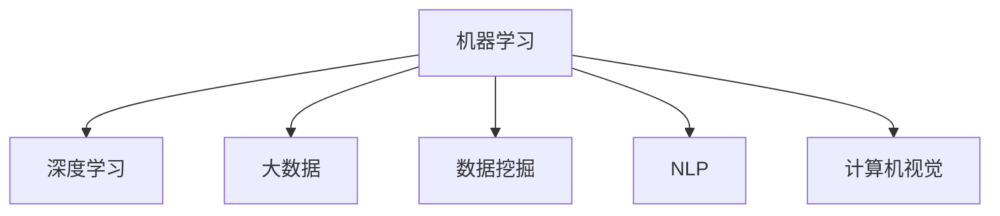

                 

# 硅谷人工智能:机器学习与大数据

## 1. 背景介绍

### 1.1 问题由来
近年来，人工智能（AI）技术迅速发展，尤其在硅谷，作为全球AI研究和产业的中心，各种前沿技术不断涌现。机器学习和大数据是AI两大核心技术，在自然语言处理（NLP）、计算机视觉、推荐系统等众多领域实现了广泛应用。

尽管AI取得显著进展，但在实际应用中，仍面临诸多挑战，如算法可解释性、鲁棒性、数据隐私保护、模型效率等。因此，探索AI技术的更多前沿应用，提升其实际落地效果，成为硅谷AI社区的重要任务。

### 1.2 问题核心关键点
本章节将阐述机器学习和大数据在大规模应用中的重要性，以及硅谷AI技术在多个领域的最新进展。这些进展不仅推动了AI技术的发展，也带来了新的应用挑战和研究方向。

## 2. 核心概念与联系

### 2.1 核心概念概述

为更好地理解机器学习和大数据在硅谷AI社区的应用，本节将介绍几个关键概念：

- **机器学习（Machine Learning）**：指通过数据驱动的方法，让计算机学习如何完成特定任务的技术。常见的机器学习算法包括回归、分类、聚类等。

- **深度学习（Deep Learning）**：一种基于神经网络的机器学习方法，其可以处理大量复杂数据，并在图像识别、语音识别、自然语言处理等领域取得突破。

- **大数据（Big Data）**：指数据量超出了传统数据处理工具的能力范围，需要进行特殊处理的巨量数据集合。大数据技术包括数据采集、存储、处理、分析等环节。

- **数据挖掘（Data Mining）**：从大量数据中提取有用信息和知识的过程。包括数据清洗、特征提取、模型训练、结果验证等步骤。

- **自然语言处理（NLP）**：使计算机能理解、解释和生成自然语言的技术，包括文本分类、机器翻译、情感分析等任务。

- **计算机视觉（CV）**：通过计算机处理图像和视频，使其具备“看”的功能。如目标检测、图像分割、人脸识别等任务。

这些概念之间的逻辑关系可以通过以下Mermaid流程图来展示：



这个流程图展示了一系列与AI相关的核心概念及其关联，通过理解这些概念，我们可以更好地把握AI技术的本质和发展方向。

## 3. 核心算法原理 & 具体操作步骤
### 3.1 算法原理概述

硅谷AI社区的机器学习和大数据算法原理涉及广泛，以下将重点介绍几种核心算法及其原理。

- **监督学习（Supervised Learning）**：指使用带有标签的数据进行训练，让模型学习如何从输入数据预测输出标签。例如，分类问题就是常见的监督学习任务。

- **非监督学习（Unsupervised Learning）**：指在没有标签的情况下，模型自行学习数据的内在结构和规律。聚类和降维是典型的非监督学习任务。

- **半监督学习（Semi-supervised Learning）**：介于监督和非监督之间，使用少量标签数据和大量未标签数据进行训练，试图在尽可能少的使用标签的同时提高模型性能。

- **强化学习（Reinforcement Learning）**：通过与环境的交互，模型根据执行动作的奖励（或惩罚）来调整策略，以最大化长期奖励。如自动驾驶、游戏AI等。

### 3.2 算法步骤详解

硅谷AI社区的机器学习和数据挖掘算法步骤大致包括以下几个环节：

**Step 1: 数据预处理**
- 数据采集：收集与任务相关的数据，包括文本、图像、音频等。
- 数据清洗：去除噪声和错误，确保数据质量。
- 数据增强：增加数据样本数量，如旋转、裁剪、数据扩增等，提升模型鲁棒性。

**Step 2: 特征工程**
- 特征选择：挑选对模型有帮助的特征，减少计算量，提高模型泛化能力。
- 特征提取：将原始数据转换为模型可以处理的特征表示，如TF-IDF、Word2Vec等。

**Step 3: 模型训练**
- 选择合适的算法和模型，如线性回归、决策树、随机森林、神经网络等。
- 划分训练集和验证集，设置交叉验证策略。
- 使用训练集训练模型，调整超参数，确保模型性能。

**Step 4: 模型评估**
- 在验证集上评估模型性能，如准确率、召回率、F1-score等指标。
- 调整模型参数，进一步提升模型性能。
- 使用测试集进行最终评估，确保模型泛化能力。

**Step 5: 模型部署**
- 将训练好的模型导出为模型文件或服务接口。
- 集成到实际应用中，进行实时预测或推理。
- 持续监控模型性能，定期更新和优化模型。

### 3.3 算法优缺点

硅谷AI社区的机器学习和数据挖掘算法具有以下优点：
1. 高效性：能够处理大规模数据，自动学习数据中的复杂模式。
2. 灵活性：适用于多种类型的数据和任务，能够灵活调整模型结构。
3. 普适性：能够在多个领域实现广泛应用，如金融、医疗、零售等。

同时，这些算法也存在一定的局限性：
1. 依赖大量标注数据：很多机器学习算法需要大量带标签的数据进行训练，标注成本较高。
2. 可解释性不足：许多模型如深度学习，其内部运作机理复杂，难以解释。
3. 对数据质量要求高：模型性能受到数据质量的影响较大。
4. 存在过拟合风险：模型可能在训练集上表现优异，但在新数据上泛化性能差。

尽管存在这些局限性，但机器学习和数据挖掘技术仍然是硅谷AI社区的重要基础，并广泛应用于多个实际场景。

### 3.4 算法应用领域

硅谷AI社区的机器学习和数据挖掘算法广泛应用于以下领域：

- **自然语言处理（NLP）**：如机器翻译、情感分析、文本分类、问答系统等。
- **计算机视觉（CV）**：如图像分类、目标检测、人脸识别、图像生成等。
- **推荐系统**：如协同过滤、基于内容的推荐、深度学习推荐等。
- **金融分析**：如信用评分、股票预测、风险管理等。
- **医疗健康**：如疾病诊断、医学影像分析、患者分诊等。
- **智能制造**：如工业质量检测、设备预测性维护等。
- **自动驾驶**：如车辆行为预测、道路识别、环境感知等。

此外，大数据和机器学习技术在供应链管理、智能客服、智能安防、智能交通等多个领域也得到了广泛应用。

## 4. 数学模型和公式 & 详细讲解
### 4.1 数学模型构建

硅谷AI社区的机器学习和大数据算法构建通常包括以下几个步骤：

1. **模型选择**：根据任务需求选择合适的机器学习算法和模型。
2. **损失函数设计**：定义模型预测与真实标签之间的误差函数，用于衡量模型性能。
3. **优化目标设置**：设置模型优化目标，最小化损失函数，以提升模型性能。

以线性回归模型为例，其数学模型可以表示为：
$$y = w_0 + w_1x_1 + w_2x_2 + \cdots + w_nx_n$$

其中，$y$为预测值，$x_i$为特征值，$w_i$为模型参数。

### 4.2 公式推导过程

以下以线性回归为例，推导其优化目标和求解过程：

1. **损失函数**：均方误差（Mean Squared Error, MSE），表示为：
$$J(w) = \frac{1}{2m}\sum_{i=1}^{m}(y_i - w_0 - w_1x_{i1} - w_2x_{i2} - \cdots - w_nx_{in})^2$$

2. **目标函数**：最小化损失函数，即：
$$\min_{w}J(w)$$

3. **求解过程**：使用梯度下降算法求解最优参数，具体为：
$$w_{k+1} = w_k - \alpha \frac{\partial J}{\partial w}$$

其中，$\alpha$为学习率，$\partial J / \partial w$为损失函数对参数$w$的梯度。

### 4.3 案例分析与讲解

在实际应用中，线性回归模型常常用于回归任务，如房价预测、股票价格预测等。以下以房价预测为例，说明其应用流程和实现细节：

1. **数据准备**：收集历史房价数据，包含多个特征如房屋面积、房龄、地理位置等。
2. **特征处理**：对数据进行归一化处理，避免数据特征间的差异对模型造成影响。
3. **模型训练**：使用梯度下降算法，最小化均方误差，训练线性回归模型。
4. **模型评估**：在测试集上评估模型预测性能，如使用均方误差评估预测准确度。

## 5. 项目实践：代码实例和详细解释说明
### 5.1 开发环境搭建

为了便于硅谷AI社区的开发者进行机器学习和数据挖掘项目开发，需要搭建一个良好的开发环境。以下是基本的搭建流程：

1. **选择编程语言和框架**：Python是数据科学和机器学习的主流语言，推荐使用PyTorch、TensorFlow、Scikit-learn等框架。
2. **安装相关库**：安装numpy、pandas、matplotlib等常用库，以及数据预处理和模型训练所需的库。
3. **环境配置**：设置虚拟环境，避免不同项目间库冲突，使用conda或virtualenv工具。

### 5.2 源代码详细实现

以下是一个简单的房价预测项目，使用Python和Scikit-learn实现线性回归模型：

```python
import pandas as pd
from sklearn.linear_model import LinearRegression
from sklearn.model_selection import train_test_split

# 数据准备
data = pd.read_csv('housing.csv')
X = data[['area', 'age', 'location']]
y = data['price']
X_train, X_test, y_train, y_test = train_test_split(X, y, test_size=0.2)

# 特征工程
X_train = X_train.apply(lambda x: (x - x.mean()) / x.std())
X_test = X_test.apply(lambda x: (x - x.mean()) / x.std())

# 模型训练
model = LinearRegression()
model.fit(X_train, y_train)

# 模型评估
y_pred = model.predict(X_test)
print('Mean Squared Error:', np.mean((y_pred - y_test)**2))
```

### 5.3 代码解读与分析

以上代码实现了一个基本的线性回归模型，用于预测房价。以下是关键代码的详细解读：

1. **数据准备**：使用pandas库读取CSV格式的数据文件，将特征和标签分开。
2. **特征工程**：对特征进行归一化处理，以消除不同特征之间的量纲差异。
3. **模型训练**：使用Scikit-learn库的线性回归模型，拟合训练数据。
4. **模型评估**：计算模型在测试集上的均方误差，评估预测准确度。

## 6. 实际应用场景
### 6.1 智能客服系统

硅谷AI社区的机器学习和大数据技术在智能客服系统中的应用非常广泛。传统的客服系统通常需要大量人工，且响应速度慢、效率低。通过机器学习和大数据技术，可以实现自动化的客服系统，提高客户满意度。

具体而言，可以通过收集历史客户对话数据，训练NLP模型进行文本分类和情感分析，识别客户需求，自动生成回复。对于新客户，通过对话生成和知识库检索，提供个性化的服务。

### 6.2 金融风控系统

金融行业对风险管理的需求非常迫切，机器学习和大数据技术可以用于构建智能风控系统，提升风险预测的准确性和效率。

例如，通过收集用户的贷款申请数据，包括个人信息、信用记录、行为数据等，训练模型预测用户的违约概率。模型可以在贷款审批过程中实时评估风险，优化贷款发放决策。

### 6.3 推荐系统

推荐系统是硅谷AI社区的热点应用之一，通过机器学习和大数据技术，可以实现个性化的推荐服务。

例如，电商平台可以收集用户的浏览、购买行为数据，训练协同过滤或深度学习推荐模型，预测用户可能感兴趣的商品，提升用户转化率和满意度。

### 6.4 医疗诊断系统

机器学习和大数据技术在医疗诊断领域也具有广阔应用前景。通过收集病历数据和医学影像数据，训练模型辅助医生诊断疾病。

例如，在影像诊断中，可以通过深度学习模型对医学影像进行分类和标注，识别病变区域。在临床决策中，模型可以辅助医生选择最佳治疗方案，提升诊断效率和准确性。

## 7. 工具和资源推荐
### 7.1 学习资源推荐

为了帮助硅谷AI社区的开发者更好地掌握机器学习和数据挖掘技术，以下推荐一些优质的学习资源：

1. **《深度学习》（Ian Goodfellow等著）**：全面介绍深度学习理论和技术，涵盖神经网络、反向传播、优化算法等内容。
2. **《统计学习方法》（李航著）**：介绍机器学习基本概念和算法，包括监督学习、非监督学习等。
3. **Coursera和Udacity课程**：提供大量免费的机器学习和数据科学课程，涵盖基础理论和实践技能。
4. **Kaggle竞赛**：参与各类数据科学竞赛，提升实战经验，学习前沿技术。
5. **论文和博客**：阅读硅谷AI社区顶级会议如NeurIPS、ICML上的最新论文，阅读开源社区的技术博客。

### 7.2 开发工具推荐

硅谷AI社区的开发者在机器学习和数据挖掘项目开发中，常常需要使用以下工具：

1. **Python和R语言**：主流的编程语言，广泛用于数据科学和机器学习。
2. **PyTorch和TensorFlow**：流行的深度学习框架，支持分布式计算和自动微分。
3. **Jupyter Notebook**：轻量级开发环境，支持代码编写、数据可视化等。
4. **Pandas和NumPy**：数据处理和分析的常用库，支持大量数据操作和计算。
5. **Scikit-learn和XGBoost**：常用机器学习库，提供丰富的算法和工具。

### 7.3 相关论文推荐

硅谷AI社区的机器学习和数据挖掘技术不断发展，以下是几篇经典的论文推荐：

1. **《ImageNet Classification with Deep Convolutional Neural Networks》**：提出卷积神经网络（CNN）用于图像分类任务，获得优异结果。
2. **《BERT: Pre-training of Deep Bidirectional Transformers for Language Understanding》**：提出BERT模型，用于大规模预训练，提升自然语言理解性能。
3. **《GANs Trained by a Two Time-Scale Update Rule Converge to the Fixed Points of the Mini-Game》**：提出生成对抗网络（GAN），用于生成逼真图像和数据增强。
4. **《Human-in-the-Loop Machine Learning》**：提出人机协同学习（HITL）方法，增强模型鲁棒性和解释性。
5. **《Adversarial Examples in Deep Learning》**：研究对抗样本对深度学习模型的影响，提出防御方法。

## 8. 总结：未来发展趋势与挑战
### 8.1 研究成果总结

硅谷AI社区的机器学习和数据挖掘技术在多个领域取得了显著进展，推动了NLP、CV、推荐系统、金融分析等应用的不断突破。通过构建高效的算法和模型，硅谷AI社区不断提升AI技术的实用性和普适性，为各行各业带来新的变革。

### 8.2 未来发展趋势

硅谷AI社区的机器学习和数据挖掘技术在未来将呈现以下发展趋势：

1. **自监督学习（Self-supervised Learning）**：利用无标签数据进行预训练，减少标注成本，提升模型性能。
2. **模型融合（Model Fusion）**：通过组合多个模型的优势，提升整体性能和鲁棒性。
3. **联邦学习（Federated Learning）**：在不共享数据的前提下，实现分布式训练，保护数据隐私。
4. **元学习（Meta-learning）**：在少样本情况下，快速适应新任务，提升模型泛化能力。
5. **跨模态学习（Cross-modal Learning）**：融合视觉、文本、语音等多模态数据，增强模型的理解和推理能力。
6. **对抗训练（Adversarial Training）**：通过对抗样本训练，提升模型的鲁棒性和抗干扰能力。

### 8.3 面临的挑战

尽管硅谷AI社区的机器学习和数据挖掘技术不断发展，但仍面临以下挑战：

1. **数据隐私和安全**：大规模数据集的使用需要严格的隐私保护措施，防止数据泄露和滥用。
2. **模型公平性**：模型决策过程需要避免偏见和歧视，确保公平性和透明性。
3. **计算资源限制**：大规模深度学习模型的训练和推理需要大量的计算资源，如何提高计算效率是关键。
4. **算法可解释性**：许多机器学习模型如深度学习具有"黑盒"特性，难以解释其内部运作机制。
5. **模型泛化能力**：机器学习模型在特定数据集上表现优异，但在新数据上泛化能力不足。
6. **数据标注成本**：许多机器学习算法需要大量标注数据，标注成本较高。

### 8.4 研究展望

面向未来，硅谷AI社区需要在以下方向进行深入研究和探索：

1. **跨学科融合**：将机器学习和数据挖掘技术与心理学、社会学等学科相结合，增强模型的智能性和实用性。
2. **伦理和法律研究**：研究AI技术的伦理和法律问题，确保其应用符合社会规范和法律要求。
3. **人机协同学习**：探索人机协同学习（HITL）方法，增强模型的可解释性和鲁棒性。
4. **自动化机器学习（AutoML）**：开发自动化机器学习工具，简化模型构建和调参过程，降低技术门槛。
5. **实时数据流处理**：研究实时数据流处理技术，支持大数据动态分析和实时决策。

硅谷AI社区的未来充满机遇与挑战，需要各方持续努力，共同推动AI技术的进步和应用。

## 9. 附录：常见问题与解答

**Q1：机器学习和数据挖掘技术在硅谷应用的主要场景有哪些？**

A: 机器学习和数据挖掘技术在硅谷应用的主要场景包括：
1. 自然语言处理（NLP）：如机器翻译、情感分析、文本分类、问答系统等。
2. 计算机视觉（CV）：如图像分类、目标检测、人脸识别、图像生成等。
3. 推荐系统：如协同过滤、基于内容的推荐、深度学习推荐等。
4. 金融分析：如信用评分、股票预测、风险管理等。
5. 医疗健康：如疾病诊断、医学影像分析、患者分诊等。
6. 智能制造：如工业质量检测、设备预测性维护等。
7. 自动驾驶：如车辆行为预测、道路识别、环境感知等。

**Q2：如何选择合适的机器学习算法和模型？**

A: 选择合适的机器学习算法和模型需要考虑以下几个因素：
1. 任务类型：根据任务是分类、回归还是聚类，选择合适的算法。
2. 数据规模：对于大规模数据，可以使用深度学习模型。
3. 模型复杂度：选择模型复杂度适中的算法，避免过拟合和欠拟合。
4. 计算资源：根据计算资源和训练时间，选择合适的模型和算法。
5. 可解释性：选择易于解释的模型，便于理解和调试。

**Q3：机器学习和数据挖掘算法的训练和调参有哪些常用技巧？**

A: 机器学习和数据挖掘算法的训练和调参技巧包括：
1. 交叉验证：使用交叉验证策略，评估模型性能，避免过拟合。
2. 学习率调整：使用学习率衰减或学习率调度策略，优化模型训练过程。
3. 正则化：使用L1、L2正则化等技术，防止过拟合。
4. 数据增强：通过数据增强技术，提高模型鲁棒性。
5. 特征工程：选择和构造对模型有帮助的特征，提升模型泛化能力。
6. 超参数搜索：使用网格搜索或贝叶斯优化，寻找最优超参数组合。

**Q4：机器学习和数据挖掘算法在实际应用中需要注意哪些问题？**

A: 机器学习和数据挖掘算法在实际应用中需要注意以下问题：
1. 数据质量：确保数据质量和完整性，避免噪声和错误。
2. 数据隐私：保护用户隐私，避免数据泄露。
3. 模型解释性：提升模型的可解释性，便于理解和调试。
4. 模型公平性：避免模型偏见和歧视，确保公平性。
5. 计算资源：优化模型结构和算法，提高计算效率，减少资源消耗。
6. 模型泛化：确保模型在新数据上具有泛化能力，避免过拟合。

**Q5：机器学习和数据挖掘技术在硅谷未来有哪些发展方向？**

A: 机器学习和数据挖掘技术在硅谷未来的发展方向包括：
1. 自监督学习：利用无标签数据进行预训练，提升模型性能。
2. 模型融合：通过组合多个模型的优势，提升整体性能和鲁棒性。
3. 联邦学习：在不共享数据的前提下，实现分布式训练，保护数据隐私。
4. 元学习：在少样本情况下，快速适应新任务，提升模型泛化能力。
5. 跨模态学习：融合视觉、文本、语音等多模态数据，增强模型的理解和推理能力。
6. 对抗训练：通过对抗样本训练，提升模型的鲁棒性和抗干扰能力。

**Q6：如何应对机器学习和数据挖掘技术面临的挑战？**

A: 应对机器学习和数据挖掘技术面临的挑战需要采取以下措施：
1. 数据隐私和安全：使用隐私保护技术和数据加密，确保数据安全。
2. 模型公平性：引入公平性约束和公正性指标，避免模型偏见和歧视。
3. 计算资源限制：优化算法和模型结构，提高计算效率，降低资源消耗。
4. 算法可解释性：开发可解释的机器学习模型，提升模型的透明性和可解释性。
5. 模型泛化能力：增加模型复杂度，使用正则化等技术，提高泛化能力。
6. 数据标注成本：使用自监督学习、主动学习等技术，降低标注成本。

以上回答基于硅谷AI社区的最新研究成果和实践经验，希望能为硅谷AI社区的开发者提供有价值的参考。

---

作者：禅与计算机程序设计艺术 / Zen and the Art of Computer Programming

