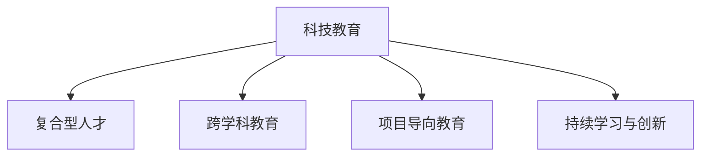

                 

## 1. 背景介绍

### 1.1 问题由来
随着科技产业的飞速发展，硅谷作为全球科技创新中心，面临着前所未有的挑战。一方面，技术迭代加速，新兴技术不断涌现，对从业者提出了更高的要求；另一方面，全球科技人才竞争加剧，硅谷企业必须寻找新的策略，以培养具备跨领域知识和技能的复合型人才。

### 1.2 问题核心关键点
科技教育改革的核心在于提升人才的多学科综合素质和创新能力。具体而言，包括：

- **多学科融合**：传统的单一学科专业教育已难以满足科技发展需求，需要引入更多跨学科知识和技能。
- **实践与理论结合**：仅仅掌握理论知识是不够的，实践经验和技术应用能力同样重要。
- **持续学习与创新**：科技日新月异，持续学习新技术和创新思维成为不可或缺的能力。

### 1.3 问题研究意义
科技教育改革对于提升硅谷的技术创新能力、保持其在全球科技产业链中的领先地位具有重要意义。通过培养更多的复合型人才，硅谷企业可以更好地应对市场变化，加速新技术的研发和应用，推动整个科技产业的健康发展。

## 2. 核心概念与联系

### 2.1 核心概念概述

为更好地理解硅谷科技教育改革，本节将介绍几个关键概念：

- **科技教育**：指通过教育系统培养科技领域人才的过程。包括从基础教育到高等教育，再到职业培训等各个阶段。
- **复合型人才**：指具备多学科知识和技能，能够跨领域协作、创新和解决问题的专家。
- **跨学科教育**：指将不同学科的知识、方法和思维方式融合，培养学生跨领域的综合能力和创新思维。
- **项目导向教育**：通过真实或模拟的项目，将理论知识应用于实践，培养学生的工程和团队协作能力。
- **持续学习与创新**：鼓励学生不断学习新知识，持续进行技术创新，适应快速变化的市场需求。

这些概念之间的关系可以通过以下Mermaid流程图来展示：



这个流程图展示了科技教育改革的四个关键方向：培养复合型人才，实施跨学科教育，采用项目导向教育，促进持续学习与创新。通过这些方向的协同推进，可以全面提升科技教育的质量和效果。

## 3. 核心算法原理 & 具体操作步骤

### 3.1 算法原理概述

硅谷科技教育改革的算法原理可以概括为以下几个方面：

- **多学科融合**：在课程设置上，引入跨学科的课程和项目，培养学生的多学科知识和综合能力。
- **实践与理论结合**：通过实习、实验室研究、项目实践等环节，将理论知识与实际应用结合起来。
- **持续学习与创新**：鼓励学生不断学习新技术，参与创新项目和科研活动，保持技术的前沿性和创新性。

### 3.2 算法步骤详解

硅谷科技教育改革的算法步骤包括以下几个关键环节：

**Step 1: 课程设置与规划**
- 制定跨学科课程体系，涵盖计算机科学、数学、工程、生物、心理学等多个学科。
- 引入案例研究、项目实践等课程，促进理论与实践的结合。
- 定期更新课程内容，确保教学内容的最新性和实用性。

**Step 2: 师资力量提升**
- 招募来自不同学科的专家和教师，形成跨学科的教学团队。
- 提供教师培训和发展机会，提升教师的跨学科教学能力。
- 引入行业专家和企业家参与教学，将行业经验引入课堂。

**Step 3: 学生培养模式创新**
- 采用混合学习模式，结合线上线下教学资源。
- 鼓励学生参与跨学科团队项目，增强协作和沟通能力。
- 设立持续学习机制，提供技术更新培训和研讨会。

**Step 4: 评估与反馈**
- 建立全面的评估体系，包括理论知识、实践技能、创新能力等。
- 定期收集学生和教师的反馈，不断改进教学方法和内容。
- 引入行业和学术界评估，提升教育质量的标准和透明度。

### 3.3 算法优缺点

硅谷科技教育改革的优势包括：

- **跨学科优势**：通过多学科知识的融合，培养学生的创新思维和综合能力。
- **实践能力提升**：通过项目导向教育，增强学生的工程和应用能力。
- **持续学习**：鼓励学生不断学习新知识和新技术，保持技术的前沿性。

同时，也存在一些不足之处：

- **课程体系复杂性**：跨学科课程的设计和实施较为复杂，需要充分协调不同学科的资源和内容。
- **师资力量需求高**：跨学科教学需要高质量的师资队伍，如何吸引和培养高水平的教师是挑战之一。
- **学生负担较重**：多学科和项目导向的学习模式，需要学生投入更多的时间和精力。

### 3.4 算法应用领域

硅谷科技教育改革的算法思想可以广泛应用于以下领域：

- **高等教育**：通过改革课程体系和教学方法，提升大学生的综合素质和就业竞争力。
- **职业教育**：培养具备技术应用能力和团队协作能力的技术技能人才。
- **企业培训**：通过定制化培训和项目实践，提升员工的技术水平和创新能力。
- **基础教育**：引入编程和科学实验等基础课程，培养学生对科技的兴趣和探索精神。

## 4. 数学模型和公式 & 详细讲解 & 举例说明

### 4.1 数学模型构建

假设学生A的初始能力为 $x$，通过多学科融合和实践学习，提升为 $y$。学生A在项目实践中的创新能力提升为 $y-x$。则模型公式为：

$$
y = x + \alpha \cdot (y-x)
$$

其中 $\alpha$ 为学生A在项目实践中的能力提升系数，通常为0.5到1之间。

### 4.2 公式推导过程

推导上述公式的过程如下：

设学生A的初始能力为 $x$，在多学科融合和实践学习后提升为 $y$，则有：

$$
y = x + \delta
$$

其中 $\delta$ 为学生A在多学科融合和实践学习中获得的综合能力提升。

又假设学生A在项目实践中的创新能力提升为 $y-x$，则有：

$$
y-x = \alpha \cdot (y-x)
$$

其中 $\alpha$ 为学生A在项目实践中的能力提升系数，通常为0.5到1之间。

将上式变形，得：

$$
y = x + \alpha \cdot (y-x)
$$

即得模型公式。

### 4.3 案例分析与讲解

**案例分析**：

假设学生A在入学时的初始能力为 $x=60$，通过多学科融合和实践学习后提升为 $y=80$。在项目实践中的创新能力提升为 $y-x=20$，则有：

$$
y = 60 + \alpha \cdot 20
$$

假设 $\alpha=0.75$，则：

$$
80 = 60 + 0.75 \cdot 20
$$

即学生A在项目实践中的创新能力提升为20%。

## 5. 项目实践：代码实例和详细解释说明

### 5.1 开发环境搭建

在项目实践前，我们需要准备好开发环境。以下是使用Python进行开发的环境配置流程：

1. 安装Anaconda：从官网下载并安装Anaconda，用于创建独立的Python环境。

2. 创建并激活虚拟环境：
```bash
conda create -n py39 python=3.9 
conda activate py39
```

3. 安装必要的Python包：
```bash
pip install matplotlib numpy pandas scikit-learn
```

### 5.2 源代码详细实现

下面是一个简化的Python代码示例，用于计算学生A的能力提升：

```python
def calculate_capacity_improvement(initial_capacity, final_capacity, alpha):
    """
    计算学生能力提升
    :param initial_capacity: 初始能力
    :param final_capacity: 最终能力
    :param alpha: 能力提升系数
    :return: 能力提升量
    """
    capacity_improvement = final_capacity - initial_capacity
    return capacity_improvement

# 设定初始能力和最终能力
initial_capacity = 60
final_capacity = 80
alpha = 0.75

# 计算能力提升
capacity_improvement = calculate_capacity_improvement(initial_capacity, final_capacity, alpha)
print(f"学生A在项目实践中的能力提升为：{capacity_improvement}")
```

### 5.3 代码解读与分析

**代码解读**：

1. `calculate_capacity_improvement`函数接收三个参数：初始能力 `initial_capacity`，最终能力 `final_capacity`，能力提升系数 `alpha`。
2. 函数内部计算能力提升量，并返回结果。
3. 在主程序中，设定初始能力为60，最终能力为80，能力提升系数为0.75。
4. 调用函数计算能力提升量，并输出结果。

**代码分析**：

1. `calculate_capacity_improvement`函数的实现简洁明了，代码量少，易于理解。
2. 函数定义符合Python的命名规范，变量和函数名均有清晰描述，便于阅读和维护。
3. 通过参数化设计，函数可以适用于不同场景下的能力提升计算，提高了代码的复用性和可扩展性。

## 6. 实际应用场景

### 6.1 高等教育改革

高等教育改革可以引入跨学科课程，培养学生的多学科综合能力。例如，计算机科学专业的学生可以选修数学、心理学等课程，增强其跨领域思维和问题解决能力。

**应用场景**：某大学计算机系开设了“计算心理学”课程，学生通过学习该课程，掌握了心理学基础知识，并在后续项目中能够更好地理解用户行为，提升软件开发的人机交互能力。

### 6.2 职业教育提升

职业教育改革可以通过项目导向教育，提升学生的实践能力和团队协作能力。例如，计算机专业的学生可以参与企业合作项目，解决实际问题。

**应用场景**：某职业学校与某科技企业合作，开设了“人工智能应用开发”课程，学生通过参与企业项目，积累了丰富的实战经验，提升了就业竞争力。

### 6.3 企业培训与人才储备

企业培训可以通过定制化课程，提升员工的技术水平和创新能力。例如，某科技企业为员工开设了“深度学习技术”培训，提升了团队的技术能力，促进了新产品的研发。

**应用场景**：某科技公司为其员工提供了“自然语言处理”培训课程，员工通过学习新知识，掌握了最新的自然语言处理技术，并应用于实际项目中，提升了企业的技术创新能力。

### 6.4 基础教育中的编程引入

基础教育改革可以通过引入编程和科学实验课程，培养学生的科技兴趣和探索精神。例如，某小学在低年级开设了“编程启蒙”课程，培养学生对编程的兴趣和基本编程能力。

**应用场景**：某小学为学生开设了“Python编程基础”课程，通过趣味编程项目，激发了学生对编程的兴趣，为未来的技术学习奠定了基础。

## 7. 工具和资源推荐

### 7.1 学习资源推荐

为帮助开发者系统掌握硅谷科技教育改革的理论基础和实践技巧，以下是推荐的几大资源：

1. **《跨学科教育概论》**：全面介绍了跨学科教育的基本概念和实施方法，适合教育工作者和科研人员参考。
2. **Coursera在线课程**：提供大量跨学科教育相关的在线课程，如“数据科学与机器学习”、“人工智能伦理”等，适合各层次的学习者。
3. **IEEE Xplore**：收录了大量科技教育相关的论文和报告，适合科研人员进行深度学习。
4. **TED Talks**：提供大量科技教育改革的讲座视频，涵盖课程设计、教学方法等多个方面，适合各层次的从业者参考。

通过对这些资源的学习实践，相信你一定能够全面掌握硅谷科技教育改革的理论和方法，并用于实际的教育场景中。

### 7.2 开发工具推荐

高效的开发离不开优秀的工具支持。以下是几款用于硅谷科技教育改革开发的常用工具：

1. **Anaconda**：用于创建独立的Python环境，方便管理和升级Python包。
2. **Jupyter Notebook**：支持Python代码的交互式执行和可视化展示，适合数据分析和科研工作。
3. **Google Colab**：谷歌提供的在线Jupyter Notebook环境，免费提供GPU/TPU算力，适合研究人员和学生快速迭代实验。
4. **GitHub**：用于代码版本管理和协作，支持团队协作和代码共享。

合理利用这些工具，可以显著提升硅谷科技教育改革的开发效率，加快创新迭代的步伐。

### 7.3 相关论文推荐

硅谷科技教育改革的研究源于学界的持续研究。以下是几篇奠基性的相关论文，推荐阅读：

1. **《跨学科学习与创新能力培养》**：研究了跨学科课程对学生创新能力的影响，提出了多学科融合的策略。
2. **《项目导向教育对学生实践能力的影响》**：分析了项目导向教育对学生工程能力提升的作用，提供了实用的教学方法。
3. **《持续学习与技术创新》**：探讨了持续学习对学生技术水平提升的重要性，提出了持续学习机制的构建方法。

这些论文代表了大语言模型微调技术的发展脉络。通过学习这些前沿成果，可以帮助研究者把握学科前进方向，激发更多的创新灵感。

## 8. 总结：未来发展趋势与挑战

### 8.1 总结

本文对硅谷科技教育改革进行了全面系统的介绍。首先阐述了科技教育改革的背景和意义，明确了跨学科融合、实践与理论结合、持续学习与创新等关键方向的改革目标。其次，从原理到实践，详细讲解了科技教育改革的数学模型和操作步骤，给出了项目实践的完整代码实例。同时，本文还广泛探讨了科技教育改革在高等教育、职业教育、企业培训和基础教育等各个领域的应用前景，展示了改革范式的巨大潜力。此外，本文精选了科技教育改革的学习资源，力求为读者提供全方位的技术指引。

通过本文的系统梳理，可以看到，硅谷科技教育改革已经成为提升科技人才综合素质和创新能力的重要手段。通过实施多学科融合、实践与理论结合、持续学习与创新等关键策略，硅谷能够培养出具备跨领域知识和技能的复合型人才，为硅谷的科技产业发展提供坚实的人才基础。

### 8.2 未来发展趋势

展望未来，硅谷科技教育改革将呈现以下几个发展趋势：

1. **多学科融合深入化**：未来的课程体系将更加强调跨学科知识的融合，培养学生的综合性思维和问题解决能力。
2. **项目导向教育普及化**：项目导向教育将成为主流教学方法，学生在实际项目中积累经验，提升实践能力。
3. **持续学习常态化**：建立持续学习机制，鼓励学生不断学习新知识和新技术，保持技术的前沿性。
4. **技术工具智能化**：引入人工智能和数据分析工具，提升教学效率和效果，培养学生的技术应用能力。
5. **在线教育广泛化**：在线课程和虚拟实验室等在线教育方式将成为重要的教学手段，突破时空限制。
6. **国际化教育合作化**：加强国际教育合作，吸收国际先进的教育理念和方法，提升教育质量。

这些趋势凸显了硅谷科技教育改革的广阔前景。这些方向的探索发展，必将进一步提升硅谷的人才培养质量，为科技产业的发展提供更多的创新动力。

### 8.3 面临的挑战

尽管硅谷科技教育改革已经取得了显著成果，但在迈向更加智能化、普适化应用的过程中，它仍面临着诸多挑战：

1. **课程体系复杂性**：跨学科课程的设计和实施较为复杂，需要充分协调不同学科的资源和内容。
2. **师资力量需求高**：跨学科教学需要高质量的师资队伍，如何吸引和培养高水平的教师是挑战之一。
3. **学生负担较重**：多学科和项目导向的学习模式，需要学生投入更多的时间和精力。
4. **评估体系多样性**：如何建立全面而科学的评估体系，评估学生的综合素质和创新能力，是一个重要挑战。
5. **技术工具普及性**：如何让更多的教师和学生熟练使用技术工具，提升教学效果，需要进一步推广和培训。
6. **国际化教育资源共享**：如何在全球范围内共享优质教育资源，提升教育质量，需要更多的国际合作。

这些挑战需要在政策、教学、评估、培训等多个方面协同推进，才能真正实现硅谷科技教育改革的持续发展和提升。

### 8.4 研究展望

面对硅谷科技教育改革所面临的种种挑战，未来的研究需要在以下几个方面寻求新的突破：

1. **课程体系优化**：进一步优化跨学科课程体系，确保课程的科学性和实用性，提升学生的学习效果。
2. **师资队伍建设**：建立多学科教师合作机制，提升教师的跨学科教学能力，吸引更多高水平教师加入教育系统。
3. **评估体系创新**：引入更多综合性评估指标，全面衡量学生的综合素质和创新能力，建立科学合理的评估体系。
4. **技术工具普及**：进一步推广和普及技术工具，提升教学效果和学生技能，缩短学习曲线。
5. **国际化教育合作**：加强国际教育合作，吸收国际先进的教育理念和方法，提升教育质量和国际化水平。

这些研究方向的探索，必将引领硅谷科技教育改革进入新的发展阶段，为培养更多的复合型人才奠定坚实基础。面向未来，硅谷科技教育改革需要持续创新和优化，才能在激烈的市场竞争中保持领先地位，为全球科技产业发展提供更多优质人才。

## 9. 附录：常见问题与解答

**Q1：跨学科教育是否会降低学生的专业深度？**

A: 跨学科教育不会降低学生的专业深度，反而通过多学科融合，提升学生的综合素质和创新能力。学生可以通过跨学科课程，掌握不同领域的基础知识和思维方式，增强问题解决能力。

**Q2：项目导向教育如何实施？**

A: 项目导向教育通常包括以下几个步骤：
1. 确定项目目标和任务
2. 分组分配任务
3. 制定项目计划和时间表
4. 实施项目并记录进展
5. 项目评估和总结

通过项目实践，学生能够在真实环境中应用所学知识，提升工程和团队协作能力。

**Q3：如何保证跨学科教育的有效性？**

A: 保证跨学科教育的有效性需要以下几点：
1. 课程设计要科学合理，确保不同学科的知识点有机融合。
2. 引入跨学科团队教学，提升教师的跨学科教学能力。
3. 提供跨学科实验和项目，增强学生的实践能力。
4. 建立综合评估体系，全面衡量学生的综合素质和创新能力。

通过以上措施，可以有效地实施跨学科教育，提升学生的综合素质和创新能力。

**Q4：项目导向教育在高等教育中的应用效果如何？**

A: 项目导向教育在高等教育中的应用效果显著，具体体现在以下几个方面：
1. 提升学生的工程和应用能力，增强实践技能。
2. 增强学生的团队协作和沟通能力，提升团队合作效果。
3. 提高学生的创新能力和问题解决能力，提升科研和工程项目成功率。

总之，项目导向教育是提升高等教育质量的重要手段，值得广泛推广和应用。

**Q5：持续学习与创新如何实现？**

A: 持续学习与创新可以通过以下几种方式实现：
1. 建立学习社区和平台，提供丰富的学习资源和交流平台。
2. 定期举办技术分享会和研讨会，促进技术交流和知识共享。
3. 提供技术更新培训和课程，帮助学生和教师掌握最新技术。
4. 设立创新基金和项目，鼓励学生参与创新活动和科研。

通过以上措施，可以建立持续学习与创新机制，提升学生的技术水平和创新能力。

---

作者：禅与计算机程序设计艺术 / Zen and the Art of Computer Programming

