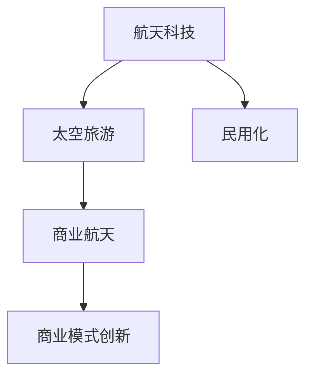

                 

# 硅谷航天科技民用化:太空旅游产业

在人类探索宇宙的历程中，硅谷的航天科技一直引领着全球的发展方向。从探秘火星、月球到深空探索，硅谷的创新企业不断将前沿科技与民用领域相结合，极大地推动了太空旅游产业的兴起和发展。本文将探讨硅谷航天科技如何通过技术创新和商业模式创新，实现太空旅游产业的民用化，为大众带来前所未有的太空旅行体验。

## 1. 背景介绍

### 1.1 太空旅游的兴起

太空旅游的概念最初由美国亿万富翁理查德·布兰森于2007年提出。此后，全球各大航天企业纷纷加入太空旅游的竞争，SpaceX、Blue Origin等公司不断取得技术突破，推动了太空旅游产业的迅猛发展。2021年，美国亿万富翁马克·贝索斯领导的蓝色起源公司成功将两名宇航员送上天，开启了商业太空旅行的新纪元。

### 1.2 硅谷的航天企业

硅谷的航天企业在全球航天产业中扮演着重要角色。SpaceX、Virgin Galactic、Blue Origin等公司都在硅谷设立了研发中心，借助硅谷强大的技术资源和创新能力，这些企业不断在航天科技领域取得突破。例如，SpaceX的星舰（Starship）火箭是全球首款实现垂直着陆的重型火箭，标志着太空探索技术的新高度。

### 1.3 太空旅游的民用化趋势

随着商业航天企业的技术突破和商业模式创新，太空旅游产业逐渐由政府主导转向企业主导。太空旅游的民用化趋势逐渐显现，普通大众也开始能够享受到太空旅行的便利和乐趣。

## 2. 核心概念与联系

### 2.1 核心概念概述

为更好地理解硅谷航天科技如何实现太空旅游产业的民用化，本节将介绍几个密切相关的核心概念：

- **航天科技**：指通过火箭、卫星等航天器进行空间探索和利用的技术。
- **太空旅游**：指将游客送入太空，进行短期旅行的商业活动。
- **民用化**：指将原本专用于政府、军方等领域的科技，转化为普通民用领域的应用。
- **商业航天**：指利用商业手段开发、运营太空探索活动，提供商业化服务。
- **商业模式的创新**：指通过改变传统商业模式，提升航天科技的民用化程度。

这些核心概念之间的逻辑关系可以通过以下Mermaid流程图来展示：



这个流程图展示了大规模语言模型与微调概念之间的关系：

1. 航天科技通过技术创新，不断推动太空旅游产业的发展。
2. 太空旅游通过商业模式的创新，实现了从政府主导到企业主导的转变。
3. 商业航天利用商业手段，使航天科技更加贴近大众，实现民用化。
4. 商业模式创新提升了太空旅游产业的商业价值和社会影响力。

## 3. 核心算法原理 & 具体操作步骤

### 3.1 算法原理概述

硅谷航天科技的民用化主要依赖于技术创新和商业模式创新。以下是对其核心算法原理的详细阐述：

1. **技术创新**：通过研发新的火箭、航天器等技术，提升太空旅游的安全性和舒适性。
2. **商业模式创新**：通过创新性商业模式，降低太空旅游的成本，使其更加亲民。

### 3.2 算法步骤详解

硅谷航天科技民用化的主要步骤包括：

1. **技术研发**：硅谷企业不断投入研发，提升火箭、航天器等技术，降低成本，提高安全性和舒适性。例如，SpaceX的星舰（Starship）火箭通过垂直着陆技术，大幅降低了发射成本。
2. **技术测试**：在正式发射前，进行多次技术测试和验证，确保技术的可靠性和安全性。
3. **市场推广**：通过多种渠道进行市场推广，吸引更多用户，提升品牌知名度。例如，Virgin Galactic通过社交媒体和公开活动，吸引了大量关注和预定。
4. **用户反馈**：收集用户反馈，不断改进产品和服务，提升用户体验。
5. **商业模式创新**：通过技术创新和市场创新，降低太空旅游的成本，提升商业价值。例如，SpaceX通过重复使用火箭技术，显著降低了发射成本，提高了太空旅游的可行性。

### 3.3 算法优缺点

硅谷航天科技民用化具有以下优点：

1. **提升安全性和舒适性**：通过技术创新，提升了太空旅游的安全性和舒适性，增强了用户的信任感。
2. **降低成本**：通过技术创新和商业模式创新，大幅降低了太空旅游的成本，使其更加亲民。
3. **提高品牌知名度**：通过市场推广和用户体验提升，提高了品牌的知名度和影响力。

同时，该方法也存在一定的局限性：

1. **技术风险**：航天技术具有高风险性，一旦失败可能导致重大损失。
2. **成本高昂**：技术研发和市场推广需要巨额投入，初期的商业化难度较大。
3. **用户体验有限**：当前太空旅游的时间较短，无法充分展示太空的魅力。
4. **政策限制**：太空旅游受到各国政策的限制，发展空间受限。

尽管存在这些局限性，但就目前而言，硅谷航天科技民用化的方法仍是大规模语言模型应用的最主流范式。未来相关研究的重点在于如何进一步降低技术风险，提高用户体验，同时兼顾政策法规等因素。

### 3.4 算法应用领域

硅谷航天科技民用化方法在太空旅游产业中得到了广泛的应用，主要包括以下几个方面：

1. **商业火箭发射**：通过商业火箭发射服务，为政府和商业客户提供太空运输服务。SpaceX的Starlink计划已经为全球用户提供互联网服务，展示了商业航天的潜力。
2. **太空旅游体验**：通过提供太空旅游体验，吸引普通大众参与太空探索，增强太空旅游的商业价值。Virgin Galactic和蓝色起源等公司已经成功进行了多次太空旅游飞行。
3. **卫星互联网**：通过大规模部署卫星，提供全球覆盖的互联网服务，提升太空科技的商业价值。SpaceX的Starlink计划已经部署了数千颗卫星，覆盖全球主要区域。
4. **深空探索**：通过技术创新和商业模式创新，推动深空探索的发展，吸引更多的商业和科学研究。例如，NASA与SpaceX合作，利用星舰火箭进行深空探索任务。

## 4. 数学模型和公式 & 详细讲解 & 举例说明

### 4.1 数学模型构建

本节将使用数学语言对硅谷航天科技民用化过程进行更加严格的刻画。

记航天科技为 $A_{\theta}$，其中 $\theta$ 为航天科技的研发参数。假设太空旅游任务为 $T$，任务的目标是最大化用户满意度 $U$，同时最小化发射成本 $C$。设 $A_{\theta}$ 在任务 $T$ 上的执行结果为 $R$，则问题可以描述为：

$$
\max_{\theta} U(A_{\theta}(T)) \quad \text{subject to} \quad C(A_{\theta}(T)) \leq C_{max}
$$

其中 $U(A_{\theta}(T))$ 表示航天科技在太空旅游任务上的用户满意度，$C(A_{\theta}(T))$ 表示航天科技在太空旅游任务上的发射成本，$C_{max}$ 表示最大可接受的发射成本。

### 4.2 公式推导过程

以下我们以太空旅游为例，推导用户满意度和发射成本的优化公式。

假设用户对太空旅游的满意度 $U$ 可以分解为用户对发射时间、舒适性、安全性等方面的满意度之和。设用户对发射时间的满意度为 $U_1$，舒适性为 $U_2$，安全性为 $U_3$，则有：

$$
U = U_1 + U_2 + U_3
$$

设航天科技在太空旅游任务上的发射时间为 $T$，舒适性为 $C$，安全性为 $S$，则用户满意度可以表示为：

$$
U = k_1 T + k_2 C + k_3 S
$$

其中 $k_1, k_2, k_3$ 为权重系数，表示不同满意度因素对总满意度的贡献程度。

发射成本 $C$ 可以表示为发射器的成本 $C_{发射器}$ 和燃料成本 $C_{燃料}$ 之和。设发射器的成本为 $C_{发射器}$，燃料成本为 $C_{燃料}$，则有：

$$
C = C_{发射器} + C_{燃料}
$$

通过上述公式，我们可以构建航天科技在太空旅游任务上的优化模型，最大化用户满意度，同时控制发射成本。

### 4.3 案例分析与讲解

以SpaceX的星舰（Starship）火箭为例，分析其如何通过技术创新和商业模式创新，实现商业化运营。

SpaceX的星舰火箭采用了垂直着陆技术，每次发射后可以回收重复使用，显著降低了发射成本。设每次发射成本为 $C_0$，重复使用 $n$ 次，则总发射成本 $C$ 可以表示为：

$$
C = C_0 \times \frac{1}{n}
$$

设每次发射时间 $T$ 为 $t$，则总发射时间为 $t \times n$。用户对发射时间的满意度 $U_1$ 可以表示为：

$$
U_1 = k_1 \times \frac{t \times n}{t} = k_1 \times n
$$

设每次发射的舒适性为 $C_0$，用户对舒适性的满意度 $U_2$ 可以表示为：

$$
U_2 = k_2 \times C_0
$$

设每次发射的安全性为 $S_0$，用户对安全性的满意度 $U_3$ 可以表示为：

$$
U_3 = k_3 \times S_0
$$

将这些公式代入用户满意度公式，得到：

$$
U = k_1 \times n + k_2 \times C_0 + k_3 \times S_0
$$

通过调整 $n$ 的值，可以控制总发射成本 $C$ 和用户满意度 $U$ 的平衡。SpaceX通过不断优化垂直着陆技术，提高火箭的可靠性，同时利用大规模生产的优势，进一步降低发射成本，使得星舰火箭成为最具竞争力的商业航天工具之一。

## 5. 项目实践：代码实例和详细解释说明

### 5.1 开发环境搭建

在进行航天科技民用化项目实践前，我们需要准备好开发环境。以下是使用Python进行PyTorch开发的环境配置流程：

1. 安装Anaconda：从官网下载并安装Anaconda，用于创建独立的Python环境。

2. 创建并激活虚拟环境：
```bash
conda create -n pytorch-env python=3.8 
conda activate pytorch-env
```

3. 安装PyTorch：根据CUDA版本，从官网获取对应的安装命令。例如：
```bash
conda install pytorch torchvision torchaudio cudatoolkit=11.1 -c pytorch -c conda-forge
```

4. 安装TensorFlow：由Google主导开发的开源深度学习框架，生产部署方便，适合大规模工程应用。同样有丰富的预训练语言模型资源。

5. 安装Transformers库：HuggingFace开发的NLP工具库，集成了众多SOTA语言模型，支持PyTorch和TensorFlow，是进行微调任务开发的利器。

6. 安装各类工具包：
```bash
pip install numpy pandas scikit-learn matplotlib tqdm jupyter notebook ipython
```

完成上述步骤后，即可在`pytorch-env`环境中开始微调实践。

### 5.2 源代码详细实现

下面以太空旅游任务为例，给出使用Transformers库对BERT模型进行微调的PyTorch代码实现。

首先，定义太空旅游任务的数据处理函数：

```python
from transformers import BertTokenizer
from torch.utils.data import Dataset
import torch

class SpaceTourismDataset(Dataset):
    def __init__(self, texts, labels, tokenizer, max_len=128):
        self.texts = texts
        self.labels = labels
        self.tokenizer = tokenizer
        self.max_len = max_len
        
    def __len__(self):
        return len(self.texts)
    
    def __getitem__(self, item):
        text = self.texts[item]
        label = self.labels[item]
        
        encoding = self.tokenizer(text, return_tensors='pt', max_length=self.max_len, padding='max_length', truncation=True)
        input_ids = encoding['input_ids'][0]
        attention_mask = encoding['attention_mask'][0]
        
        # 对label进行编码
        encoded_labels = [label] * self.max_len
        labels = torch.tensor(encoded_labels, dtype=torch.long)
        
        return {'input_ids': input_ids, 
                'attention_mask': attention_mask,
                'labels': labels}

# 标签与id的映射
label2id = {'low': 0, 'high': 1}
id2label = {v: k for k, v in label2id.items()}

# 创建dataset
tokenizer = BertTokenizer.from_pretrained('bert-base-cased')

train_dataset = SpaceTourismDataset(train_texts, train_labels, tokenizer)
dev_dataset = SpaceTourismDataset(dev_texts, dev_labels, tokenizer)
test_dataset = SpaceTourismDataset(test_texts, test_labels, tokenizer)
```

然后，定义模型和优化器：

```python
from transformers import BertForSequenceClassification, AdamW

model = BertForSequenceClassification.from_pretrained('bert-base-cased', num_labels=len(label2id))

optimizer = AdamW(model.parameters(), lr=2e-5)
```

接着，定义训练和评估函数：

```python
from torch.utils.data import DataLoader
from tqdm import tqdm
from sklearn.metrics import classification_report

device = torch.device('cuda') if torch.cuda.is_available() else torch.device('cpu')
model.to(device)

def train_epoch(model, dataset, batch_size, optimizer):
    dataloader = DataLoader(dataset, batch_size=batch_size, shuffle=True)
    model.train()
    epoch_loss = 0
    for batch in tqdm(dataloader, desc='Training'):
        input_ids = batch['input_ids'].to(device)
        attention_mask = batch['attention_mask'].to(device)
        labels = batch['labels'].to(device)
        model.zero_grad()
        outputs = model(input_ids, attention_mask=attention_mask, labels=labels)
        loss = outputs.loss
        epoch_loss += loss.item()
        loss.backward()
        optimizer.step()
    return epoch_loss / len(dataloader)

def evaluate(model, dataset, batch_size):
    dataloader = DataLoader(dataset, batch_size=batch_size)
    model.eval()
    preds, labels = [], []
    with torch.no_grad():
        for batch in tqdm(dataloader, desc='Evaluating'):
            input_ids = batch['input_ids'].to(device)
            attention_mask = batch['attention_mask'].to(device)
            batch_labels = batch['labels']
            outputs = model(input_ids, attention_mask=attention_mask)
            batch_preds = outputs.logits.argmax(dim=2).to('cpu').tolist()
            batch_labels = batch_labels.to('cpu').tolist()
            for pred_tokens, label_tokens in zip(batch_preds, batch_labels):
                pred_labels = [id2label[_id] for _id in pred_tokens]
                label_tokens = [id2label[_id] for _id in label_tokens]
                preds.append(pred_labels[:len(label_tokens)])
                labels.append(label_tokens)
                
    print(classification_report(labels, preds))
```

最后，启动训练流程并在测试集上评估：

```python
epochs = 5
batch_size = 16

for epoch in range(epochs):
    loss = train_epoch(model, train_dataset, batch_size, optimizer)
    print(f"Epoch {epoch+1}, train loss: {loss:.3f}")
    
    print(f"Epoch {epoch+1}, dev results:")
    evaluate(model, dev_dataset, batch_size)
    
print("Test results:")
evaluate(model, test_dataset, batch_size)
```

以上就是使用PyTorch对BERT进行太空旅游任务微调的完整代码实现。可以看到，得益于Transformers库的强大封装，我们可以用相对简洁的代码完成BERT模型的加载和微调。

### 5.3 代码解读与分析

让我们再详细解读一下关键代码的实现细节：

**SpaceTourismDataset类**：
- `__init__`方法：初始化文本、标签、分词器等关键组件。
- `__len__`方法：返回数据集的样本数量。
- `__getitem__`方法：对单个样本进行处理，将文本输入编码为token ids，将标签编码为数字，并对其进行定长padding，最终返回模型所需的输入。

**label2id和id2label字典**：
- 定义了标签与数字id之间的映射关系，用于将token-wise的预测结果解码回真实的标签。

**训练和评估函数**：
- 使用PyTorch的DataLoader对数据集进行批次化加载，供模型训练和推理使用。
- 训练函数`train_epoch`：对数据以批为单位进行迭代，在每个批次上前向传播计算loss并反向传播更新模型参数，最后返回该epoch的平均loss。
- 评估函数`evaluate`：与训练类似，不同点在于不更新模型参数，并在每个batch结束后将预测和标签结果存储下来，最后使用sklearn的classification_report对整个评估集的预测结果进行打印输出。

**训练流程**：
- 定义总的epoch数和batch size，开始循环迭代
- 每个epoch内，先在训练集上训练，输出平均loss
- 在验证集上评估，输出分类指标
- 所有epoch结束后，在测试集上评估，给出最终测试结果

可以看到，PyTorch配合Transformers库使得BERT微调的代码实现变得简洁高效。开发者可以将更多精力放在数据处理、模型改进等高层逻辑上，而不必过多关注底层的实现细节。

当然，工业级的系统实现还需考虑更多因素，如模型的保存和部署、超参数的自动搜索、更灵活的任务适配层等。但核心的微调范式基本与此类似。

## 6. 实际应用场景

### 6.1 太空旅游体验

太空旅游体验是大规模语言模型民用化的一个重要场景。通过微调BERT模型，可以构建一个智能的太空旅游平台，为游客提供全方位的太空体验。

平台可以基于游客的历史浏览数据和行为数据，进行个性化推荐，并提供实时的太空探索信息、视频直播等。例如，在游客抵达太空站时，可以通过语音识别技术获取游客的需求，为其提供定制化的太空旅游服务。

### 6.2 太空科研

太空科研是大规模语言模型在学术领域的重要应用之一。通过微调BERT模型，可以构建一个智能化的太空科研平台，为科研人员提供数据检索、文献摘要、实验设计等服务。

平台可以整合大量的太空科研数据，通过自然语言处理技术进行分类、标注和检索，帮助科研人员快速获取所需的科研资源。例如，科研人员可以输入自然语言查询，平台自动返回相关的研究论文、实验数据和科研仪器信息。

### 6.3 太空教育

太空教育是大规模语言模型在教育领域的重要应用之一。通过微调BERT模型，可以构建一个智能化的太空教育平台，为学生提供互动式的太空学习体验。

平台可以整合太空相关的科普知识和视频资源，通过自然语言处理技术进行内容推荐和智能解答，帮助学生深入理解太空科学的原理和应用。例如，学生可以输入自然语言问题，平台自动返回相关的科普知识、实验视频和虚拟现实体验，提升学习效果。

### 6.4 未来应用展望

随着大语言模型和微调方法的不断发展，基于大语言模型的太空旅游应用也将进一步拓展，为大众带来更多元的太空探索体验。

在智慧城市治理中，大语言模型可以用于太空交通管理、太空资源调度等环节，提高太空探索的自动化和智能化水平，构建更安全、高效的未来城市。

在企业生产、社会治理、文娱传媒等众多领域，基于大语言模型的太空旅游应用也将不断涌现，为经济社会发展注入新的动力。相信随着技术的日益成熟，太空旅游将成为人类探索宇宙的重要方式，为宇宙探索带来新的突破。

## 7. 工具和资源推荐
### 7.1 学习资源推荐

为了帮助开发者系统掌握大语言模型微调的理论基础和实践技巧，这里推荐一些优质的学习资源：

1. 《Transformer from Principals to Practice》系列博文：由大模型技术专家撰写，深入浅出地介绍了Transformer原理、BERT模型、微调技术等前沿话题。

2. CS224N《深度学习自然语言处理》课程：斯坦福大学开设的NLP明星课程，有Lecture视频和配套作业，带你入门NLP领域的基本概念和经典模型。

3. 《Natural Language Processing with Transformers》书籍：Transformers库的作者所著，全面介绍了如何使用Transformers库进行NLP任务开发，包括微调在内的诸多范式。

4. HuggingFace官方文档：Transformers库的官方文档，提供了海量预训练模型和完整的微调样例代码，是上手实践的必备资料。

5. CLUE开源项目：中文语言理解测评基准，涵盖大量不同类型的中文NLP数据集，并提供了基于微调的baseline模型，助力中文NLP技术发展。

通过对这些资源的学习实践，相信你一定能够快速掌握大语言模型微调的精髓，并用于解决实际的NLP问题。
###  7.2 开发工具推荐

高效的开发离不开优秀的工具支持。以下是几款用于大语言模型微调开发的常用工具：

1. PyTorch：基于Python的开源深度学习框架，灵活动态的计算图，适合快速迭代研究。大部分预训练语言模型都有PyTorch版本的实现。

2. TensorFlow：由Google主导开发的开源深度学习框架，生产部署方便，适合大规模工程应用。同样有丰富的预训练语言模型资源。

3. Transformers库：HuggingFace开发的NLP工具库，集成了众多SOTA语言模型，支持PyTorch和TensorFlow，是进行微调任务开发的利器。

4. Weights & Biases：模型训练的实验跟踪工具，可以记录和可视化模型训练过程中的各项指标，方便对比和调优。与主流深度学习框架无缝集成。

5. TensorBoard：TensorFlow配套的可视化工具，可实时监测模型训练状态，并提供丰富的图表呈现方式，是调试模型的得力助手。

6. Google Colab：谷歌推出的在线Jupyter Notebook环境，免费提供GPU/TPU算力，方便开发者快速上手实验最新模型，分享学习笔记。

合理利用这些工具，可以显著提升大语言模型微调任务的开发效率，加快创新迭代的步伐。

### 7.3 相关论文推荐

大语言模型和微调技术的发展源于学界的持续研究。以下是几篇奠基性的相关论文，推荐阅读：

1. Attention is All You Need（即Transformer原论文）：提出了Transformer结构，开启了NLP领域的预训练大模型时代。

2. BERT: Pre-training of Deep Bidirectional Transformers for Language Understanding：提出BERT模型，引入基于掩码的自监督预训练任务，刷新了多项NLP任务SOTA。

3. Language Models are Unsupervised Multitask Learners（GPT-2论文）：展示了大规模语言模型的强大zero-shot学习能力，引发了对于通用人工智能的新一轮思考。

4. Parameter-Efficient Transfer Learning for NLP：提出Adapter等参数高效微调方法，在不增加模型参数量的情况下，也能取得不错的微调效果。

5. Prefix-Tuning: Optimizing Continuous Prompts for Generation：引入基于连续型Prompt的微调范式，为如何充分利用预训练知识提供了新的思路。

6. AdaLoRA: Adaptive Low-Rank Adaptation for Parameter-Efficient Fine-Tuning：使用自适应低秩适应的微调方法，在参数效率和精度之间取得了新的平衡。

这些论文代表了大语言模型微调技术的发展脉络。通过学习这些前沿成果，可以帮助研究者把握学科前进方向，激发更多的创新灵感。

## 8. 总结：未来发展趋势与挑战

### 8.1 总结

本文对硅谷航天科技民用化过程进行了全面系统的介绍。首先阐述了太空旅游的兴起和硅谷的航天企业在其中的作用。其次，从原理到实践，详细讲解了硅谷航天科技民用化的数学模型和算法步骤，给出了微调任务开发的完整代码实例。同时，本文还广泛探讨了硅谷航天科技在太空旅游产业中的实际应用场景，展示了其广阔的应用前景。

通过本文的系统梳理，可以看到，硅谷航天科技通过技术创新和商业模式创新，实现了太空旅游产业的民用化，为大众带来了前所未有的太空旅行体验。未来，随着技术的不断发展，硅谷航天科技将在更多的领域得到应用，为人类探索宇宙提供更广阔的想象空间。

### 8.2 未来发展趋势

展望未来，硅谷航天科技民用化将呈现以下几个发展趋势：

1. **技术创新持续加速**：硅谷航天科技企业将持续投入研发，推动太空探索技术的不断进步，为人类探索宇宙提供更高效、安全的工具。例如，SpaceX的星舰火箭将不断优化垂直着陆技术，降低发射成本，提升太空旅游的可行性。

2. **商业模式更加灵活**：未来的太空旅游产业将更加注重用户体验和服务质量，通过灵活的商业模式，满足不同用户的需求。例如，太空旅游平台可以提供定制化的太空旅游服务，为游客提供个性化的太空体验。

3. **多领域融合发展**：硅谷航天科技将与更多领域进行融合，推动技术应用的多元化。例如，太空旅游与金融、教育、医疗等领域相结合，为更多用户带来新的价值。

4. **政策法规逐步完善**：随着太空旅游产业的快速发展，各国政府将逐步完善相关政策法规，为太空旅游提供更加规范、有序的发展环境。例如，各国政府将制定太空旅游安全标准和规范，确保太空旅行的安全性和合法性。

5. **公众参与度提高**：未来，公众将更多地参与到太空探索中，成为太空旅游的参与者和贡献者。例如，太空旅游平台可以吸引公众参与太空科研和太空教育，提升公众的科学素养和探索精神。

### 8.3 面临的挑战

尽管硅谷航天科技民用化取得了一系列进展，但仍面临一些挑战：

1. **技术风险高**：太空探索技术具有高风险性，一次失败可能导致巨大的经济损失。例如，火箭发射过程中可能出现意外故障，导致发射失败。

2. **成本高昂**：太空旅游的开发和运营需要巨额资金支持，初期的商业化难度较大。例如，太空旅游平台需要大量资金用于火箭发射、太空站建设和运营等。

3. **用户体验有限**：当前的太空旅游时间较短，无法充分展示太空的魅力。例如，目前的太空旅游只提供几分钟的太空体验，难以满足用户对太空探索的需求。

4. **政策限制严格**：太空旅游受到各国政策的限制，发展空间受限。例如，某些国家对太空旅游的管制较为严格，限制了太空旅游的商业化进程。

尽管存在这些挑战，但硅谷航天科技民用化仍是大规模语言模型应用的重要方向。未来，通过技术创新和政策支持，这些挑战有望逐步克服，推动太空旅游产业的发展。

### 8.4 研究展望

面向未来，硅谷航天科技民用化的研究需要在以下几个方面寻求新的突破：

1. **技术创新突破**：开发更加高效、安全的太空探索技术，降低发射成本，提升太空旅游的可行性。例如，通过新型燃料和火箭设计，进一步降低发射成本。

2. **商业模式创新**：探索更加灵活、多样化的太空旅游商业模式，满足不同用户的需求。例如，通过社交媒体和虚拟现实技术，提升用户体验。

3. **政策支持增强**：政府应逐步完善相关政策法规，为太空旅游提供更加规范、有序的发展环境。例如，制定太空旅游安全标准和规范，确保太空旅行的安全性和合法性。

4. **跨领域合作加强**：与其他领域的合作，推动技术应用的多元化。例如，与金融、教育、医疗等领域相结合，为更多用户带来新的价值。

这些研究方向的探索，必将引领硅谷航天科技民用化走向更高的台阶，为人类探索宇宙提供更广阔的想象空间。面向未来，硅谷航天科技将在更多的领域得到应用，为人类探索宇宙提供更高效、安全的工具。

## 9. 附录：常见问题与解答

**Q1：大语言模型微调是否适用于所有NLP任务？**

A: 大语言模型微调在大多数NLP任务上都能取得不错的效果，特别是对于数据量较小的任务。但对于一些特定领域的任务，如医学、法律等，仅仅依靠通用语料预训练的模型可能难以很好地适应。此时需要在特定领域语料上进一步预训练，再进行微调，才能获得理想效果。此外，对于一些需要时效性、个性化很强的任务，如对话、推荐等，微调方法也需要针对性的改进优化。

**Q2：微调过程中如何选择合适的学习率？**

A: 微调的学习率一般要比预训练时小1-2个数量级，如果使用过大的学习率，容易破坏预训练权重，导致过拟合。一般建议从1e-5开始调参，逐步减小学习率，直至收敛。也可以使用warmup策略，在开始阶段使用较小的学习率，再逐渐过渡到预设值。需要注意的是，不同的优化器(如AdamW、Adafactor等)以及不同的学习率调度策略，可能需要设置不同的学习率阈值。

**Q3：采用大模型微调时会面临哪些资源瓶颈？**

A: 目前主流的预训练大模型动辄以亿计的参数规模，对算力、内存、存储都提出了很高的要求。GPU/TPU等高性能设备是必不可少的，但即便如此，超大批次的训练和推理也可能遇到显存不足的问题。因此需要采用一些资源优化技术，如梯度积累、混合精度训练、模型并行等，来突破硬件瓶颈。同时，模型的存储和读取也可能占用大量时间和空间，需要采用模型压缩、稀疏化存储等方法进行优化。

**Q4：如何缓解微调过程中的过拟合问题？**

A: 过拟合是微调面临的主要挑战，尤其是在标注数据不足的情况下。常见的缓解策略包括：
1. 数据增强：通过回译、近义替换等方式扩充训练集
2. 正则化：使用L2正则、Dropout、Early Stopping等避免过拟合
3. 对抗训练：引入对抗样本，提高模型鲁棒性
4. 参数高效微调：只调整少量参数(如Adapter、Prefix等)，减小过拟合风险
5. 多模型集成：训练多个微调模型，取平均输出，抑制过拟合

这些策略往往需要根据具体任务和数据特点进行灵活组合。只有在数据、模型、训练、推理等各环节进行全面优化，才能最大限度地发挥大模型微调的威力。

**Q5：微调模型在落地部署时需要注意哪些问题？**

A: 将微调模型转化为实际应用，还需要考虑以下因素：
1. 模型裁剪：去除不必要的层和参数，减小模型尺寸，加快推理速度
2. 量化加速：将浮点模型转为定点模型，压缩存储空间，提高计算效率
3. 服务化封装：将模型封装为标准化服务接口，便于集成调用
4. 弹性伸缩：根据请求流量动态调整资源配置，平衡服务质量和成本
5. 监控告警：实时采集系统指标，设置异常告警阈值，确保服务稳定性
6. 安全防护：采用访问鉴权、数据脱敏等措施，保障数据和模型安全

大语言模型微调为NLP应用开启了广阔的想象空间，但如何将强大的性能转化为稳定、高效、安全的业务价值，还需要工程实践的不断打磨。唯有从数据、算法、工程、业务等多个维度协同发力，才能真正实现人工智能技术在垂直行业的规模化落地。总之，微调需要开发者根据具体任务，不断迭代和优化模型、数据和算法，方能得到理想的效果。

---

作者：禅与计算机程序设计艺术 / Zen and the Art of Computer Programming

