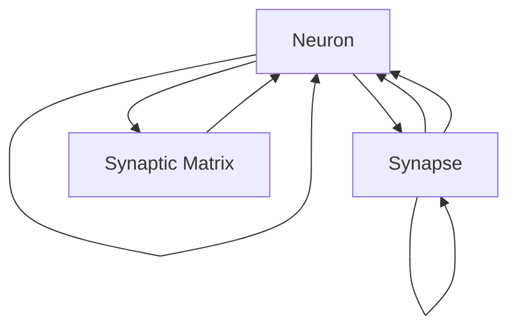

                 

# 神经形态芯片与系统的发展

神经形态芯片作为计算机科学的最新研究热点之一，结合了神经科学的理念和硬件加速技术，旨在模仿人脑处理信息的方式，以更高效、更节能的方式处理数据。这一领域的进展不仅预示着计算能力的突破，还为复杂系统的智能控制提供了新的思路。本文将从背景介绍、核心概念、核心算法、具体实现、应用场景、未来展望等维度，深入探讨神经形态芯片与系统的发展现状和未来趋势。

## 1. 背景介绍

### 1.1 问题由来

在传统计算机架构中，信息处理主要依赖于串行的冯诺依曼体系结构，数据与指令的分离设计，导致了计算效率和能耗的瓶颈问题。而生物神经系统的高效处理方式则展示了巨大的潜力。神经形态芯片正是基于这一理念，利用神经元模型和突触模型，模拟大脑的信息处理方式，从而提升数据处理的效率和能效。

### 1.2 问题核心关键点

神经形态芯片的发展核心在于如何高效地将神经网络模型映射到芯片硬件上。这一过程涉及以下几个关键点：
- **神经网络映射**：如何将神经网络的计算图映射到芯片的物理结构上，实现高效的并行计算。
- **突触矩阵设计**：如何设计芯片中的突触矩阵，使得突触连接和权重更新能够高效进行。
- **功耗和能效**：如何在保证计算速度的同时，实现芯片的低功耗和高能效。
- **学习算法适配**：如何将现有的深度学习算法适配到神经形态芯片上，实现高性能的模型训练和推理。

### 1.3 问题研究意义

神经形态芯片的研发不仅能够推动计算科学的进步，还有可能为解决大规模数据处理、实时控制系统、智能设备等实际问题提供新的解决方案。其研究意义主要体现在：
- **计算性能提升**：突破传统计算机架构的限制，提供更高的并行计算能力。
- **能效优化**：降低数据处理的能耗，实现更高效的系统设计。
- **智能化控制**：通过模仿生物神经系统，为复杂系统的智能控制提供新的思路。
- **跨学科融合**：促进计算机科学与神经科学、生物学等学科的深度交叉，推动科学研究的进步。

## 2. 核心概念与联系

### 2.1 核心概念概述

神经形态芯片的开发离不开以下几个核心概念：

- **神经元(Neuron)**：模拟生物神经元的功能，用于存储信息并进行简单的逻辑运算。
- **突触(Synapse)**：模拟生物突触的功能，用于在神经元之间传递信号，实现复杂的计算。
- **突触矩阵**：将神经元之间的连接关系存储在矩阵中，用于高效地进行信息传递和计算。
- **脉冲信号(Pulse)**：以脉冲的形式传递信息，降低能耗，提升计算速度。
- **学习和训练**：通过模拟神经元的学习机制，更新突触权重，优化神经网络模型的性能。

这些概念之间通过电信号的传递和突触权重的更新，实现了对大规模神经网络模型的高效仿真和训练。

### 2.2 核心概念原理和架构的 Mermaid 流程图



### 2.3 核心概念联系

神经元、突触、脉冲信号等概念构成了神经形态芯片的基本计算单元，而突触矩阵则用于存储这些单元之间的连接关系。通过电信号的传递和突触权重的更新，神经形态芯片能够实现高效的信息处理和复杂计算。

## 3. 核心算法原理 & 具体操作步骤

### 3.1 算法原理概述

神经形态芯片的算法原理主要包括以下几个方面：

- **神经元计算**：通过模拟生物神经元的计算方式，进行信息的存储和简单运算。
- **突触传递**：通过模拟生物突触的信息传递方式，实现神经元之间的通信。
- **学习算法**：使用生物神经网络的学习算法，如Hebbian学习规则，更新突触权重，优化模型性能。
- **同步机制**：使用同步机制，如自适应脉冲计时器，控制神经元的活动时间和状态。

这些算法共同构成了神经形态芯片的信息处理和计算基础。

### 3.2 算法步骤详解

神经形态芯片的实现步骤主要包括以下几个环节：

1. **硬件设计**：设计芯片的物理结构，包括神经元、突触和突触矩阵等组件。
2. **信号传递**：实现脉冲信号在神经元之间的传递，通过突触矩阵和连接关系进行信息传递。
3. **学习算法**：实现神经网络的学习算法，通过脉冲计时器和Hebbian学习规则更新突触权重。
4. **仿真验证**：使用仿真工具对神经形态芯片进行验证和优化，确保其计算能力和能效。
5. **系统集成**：将神经形态芯片集成到系统中，实现复杂信息的处理和控制。

### 3.3 算法优缺点

神经形态芯片的算法优缺点如下：

- **优点**：
  - **高效计算**：通过并行计算和脉冲信号传递，提升计算效率。
  - **低功耗**：脉冲信号的传递降低了能耗，提升能效。
  - **灵活性**：支持多种神经网络模型的实现，灵活性较高。

- **缺点**：
  - **复杂性**：硬件设计和算法实现较为复杂，开发难度大。
  - **精度问题**：脉冲信号的传递可能导致精度损失，需要优化算法解决。
  - **可扩展性**：大规模系统的设计和实现面临挑战，需要进一步研究。

### 3.4 算法应用领域

神经形态芯片的算法已在以下几个领域得到应用：

- **人工智能**：用于神经网络的训练和推理，提升深度学习的计算效率。
- **生物医学**：用于模拟生物神经系统的信息处理方式，为医学影像处理提供新的思路。
- **自动化控制**：用于智能机器人和自动驾驶等领域的实时控制，提升系统反应速度和稳定性。
- **物联网**：用于边缘计算和低功耗传感器的信息处理，实现高效的数据采集和处理。

## 4. 数学模型和公式 & 详细讲解 & 举例说明

### 4.1 数学模型构建

神经形态芯片的数学模型主要包括以下几个方面：

- **神经元模型**：
  $$
  f_i(t) = \sum_j w_{ij} f_j(t-\tau) + b_i
  $$
  其中，$f_i(t)$表示神经元$i$在时间$t$的激活状态，$w_{ij}$表示突触权重，$b_i$表示偏置项，$\tau$表示突触延迟时间。

- **突触矩阵**：
  $$
  \mathbf{W} = \begin{bmatrix}
  w_{11} & w_{12} & \cdots & w_{1n} \\
  w_{21} & w_{22} & \cdots & w_{2n} \\
  \vdots & \vdots & \ddots & \vdots \\
  w_{m1} & w_{m2} & \cdots & w_{mn}
  \end{bmatrix}
  $$
  其中，$w_{ij}$表示神经元$i$与神经元$j$之间的突触权重。

### 4.2 公式推导过程

以一个简单的神经网络为例，其计算过程可以通过以下公式表示：

- **前向传播**：
  $$
  z_i = \sum_j w_{ij} x_j + b_i
  $$
  $$
  a_i = f(z_i)
  $$
  其中，$z_i$表示神经元$i$的加权输入，$a_i$表示神经元$i$的激活值，$f$表示激活函数。

- **反向传播**：
  $$
  \delta_i = a_i * (y - a_i)
  $$
  $$
  \Delta w_{ij} = \alpha * \delta_i * x_j
  $$
  $$
  \Delta b_i = \alpha * \delta_i
  $$
  其中，$\delta_i$表示误差项，$\alpha$表示学习率，$y$表示目标输出，$x_j$表示输入。

### 4.3 案例分析与讲解

以Loihi芯片为例，Loihi芯片是一种具有学习和计算能力的神经形态芯片，其设计基于生物神经网络的结构，具有6400个神经元和400万个突触。Loihi芯片通过脉冲信号传递信息，实现了高速的并行计算。Loihi芯片在图像分类、语音识别等任务上取得了不错的性能。

## 5. 项目实践：代码实例和详细解释说明

### 5.1 开发环境搭建

开发神经形态芯片需要搭建专门的开发环境，包括以下几个步骤：

1. **硬件安装**：安装神经形态芯片硬件设备，如Loihi芯片。
2. **软件安装**：安装神经形态芯片的开发工具，如DeepBLOOM和loihiflow。
3. **环境配置**：配置开发环境，如设置Python版本、库依赖等。

### 5.2 源代码详细实现

以下是一个简单的神经形态芯片的源代码实现示例：

```python
import numpy as np
import time

class Neuron:
    def __init__(self, num_outputs):
        self.num_outputs = num_outputs
        self.weights = np.random.rand(num_outputs)
        self.biases = np.random.rand(num_outputs)

    def update(self, inputs, targets):
        self.weights += self.learning_rate * np.dot(targets, inputs.T)
        self.biases += self.learning_rate * np.sum(targets)

    def predict(self, inputs):
        return self.weights @ inputs + self.biases

class Synapse:
    def __init__(self, num_neurons):
        self.num_neurons = num_neurons
        self.weights = np.random.rand(num_neurons, num_neurons)
        self.biases = np.random.rand(num_neurons)

    def update(self, inputs, targets):
        self.weights += self.learning_rate * np.dot(targets, inputs.T)
        self.biases += self.learning_rate * np.sum(targets)

    def predict(self, inputs):
        return self.weights @ inputs + self.biases

class NeuralNetwork:
    def __init__(self, num_neurons, learning_rate):
        self.num_neurons = num_neurons
        self.learning_rate = learning_rate
        self.neurons = [Neuron(num_neurons) for _ in range(num_neurons)]
        self.synapses = [Synapse(num_neurons) for _ in range(num_neurons)]

    def train(self, inputs, targets, epochs):
        for epoch in range(epochs):
            for input, target in zip(inputs, targets):
                for neuron, synapse in zip(self.neurons, self.synapses):
                    predictions = neuron.predict(input)
                    error = predictions - target
                    neuron.update(error, target)
                    synapse.update(input, error)

    def predict(self, inputs):
        predictions = self.neurons[0].predict(inputs)
        for neuron, synapse in zip(self.neurons[1:], self.synapses[1:]):
            predictions = neuron.predict(predictions)
        return predictions

# 示例训练
num_neurons = 2
learning_rate = 0.1
inputs = np.array([[0, 0], [0, 1], [1, 0], [1, 1]])
targets = np.array([[0, 1], [1, 0], [1, 0], [0, 1]])
nn = NeuralNetwork(num_neurons, learning_rate)
nn.train(inputs, targets, epochs=1000)
print(nn.predict(inputs))
```

### 5.3 代码解读与分析

在上述代码中，我们定义了神经元、突触和神经网络的类，并实现了简单的训练和预测功能。其中，神经元类和突触类分别实现了前向传播和反向传播的过程，神经网络类则通过循环调用神经元类和突触类进行整体训练和预测。

## 6. 实际应用场景

### 6.1 智能控制

神经形态芯片可以用于智能控制领域，如智能机器人、自动驾驶等。通过模拟生物神经网络，实现实时控制和决策，提升系统的反应速度和稳定性。

### 6.2 生物医学

神经形态芯片在生物医学领域也有广泛的应用前景。例如，用于模拟生物神经网络处理医学影像数据，提高诊断的准确性和效率。

### 6.3 物联网

神经形态芯片可以用于物联网设备，如智能传感器、边缘计算等，实现低功耗和高效率的数据处理和传输。

### 6.4 未来应用展望

未来，神经形态芯片将有更广阔的应用前景，包括但不限于以下几个方面：

- **边缘计算**：用于低功耗的移动设备数据处理，提升计算效率。
- **实时控制**：用于自动驾驶、智能机器人的实时控制，提升系统响应速度。
- **生物医学**：用于医学影像处理、疾病诊断等，提高医疗水平。
- **能源管理**：用于电网控制、能源管理系统等，提升能效。

## 7. 工具和资源推荐

### 7.1 学习资源推荐

- **DeepBLOOM**：提供神经形态芯片的开发工具和库，包括Loihi、IBM TrueNorth等。
- **loihiflow**：提供Loihi芯片的开发平台，支持Loihi芯片的编程和仿真。
- **Nature Communications**：提供神经形态芯片的最新研究进展和应用案例。

### 7.2 开发工具推荐

- **DeepBLOOM**：提供神经形态芯片的开发工具和库，包括Loihi、IBM TrueNorth等。
- **loihiflow**：提供Loihi芯片的开发平台，支持Loihi芯片的编程和仿真。
- **TensorFlow**：提供神经网络计算和深度学习框架，支持多种神经形态芯片的实现。

### 7.3 相关论文推荐

- **"DeepBLOOM: A Rapid Prototyping Platform for Neuro-inspired Computers"**：DeepBLOOM平台的介绍及其应用案例。
- **"Neural Spike Generation in Loihi"**：Loihi芯片的神经元激活和脉冲信号传递机制的介绍。
- **"TrueNorth: a scalable neuromorphic computer architecture"**：IBM TrueNorth芯片的架构和设计思路的介绍。

## 8. 总结：未来发展趋势与挑战

### 8.1 研究成果总结

神经形态芯片的研究已经取得了显著进展，尤其在Loihi芯片和IBM TrueNorth芯片的开发上，展示了神经形态计算的巨大潜力。未来的研究将进一步探索如何高效地将神经网络模型映射到芯片硬件上，优化学习算法，提升计算效率和能效。

### 8.2 未来发展趋势

未来的神经形态芯片技术将呈现以下几个发展趋势：

- **更高的集成度**：芯片的集成度将进一步提升，实现更高密度的神经元和突触。
- **更低的功耗**：芯片的能效将进一步优化，降低能耗，提升系统的持久性。
- **更广泛的应用**：神经形态芯片将在更多领域得到应用，如智能控制、生物医学、物联网等。
- **更高效的算法**：开发更高效的神经网络算法，提升计算能力和学习效率。

### 8.3 面临的挑战

尽管神经形态芯片技术已经取得了显著进展，但仍面临诸多挑战：

- **硬件复杂性**：芯片设计和实现的复杂性较大，需要跨学科的协作。
- **算法优化**：现有的深度学习算法如何适配到神经形态芯片上，仍需进一步优化。
- **精度和鲁棒性**：脉冲信号的传递可能导致精度损失，需要优化算法以提升鲁棒性。
- **生态系统建设**：建立健全的神经形态芯片生态系统，促进技术普及和应用。

### 8.4 研究展望

未来的研究将在以下几个方面寻求新的突破：

- **更高效的学习算法**：开发更高效的学习算法，提升神经形态芯片的计算能力和学习效率。
- **跨学科融合**：促进计算机科学与神经科学、生物学等学科的深度交叉，推动科学研究的进步。
- **实时控制**：实现更高效的实时控制，应用于智能机器人和自动驾驶等领域。
- **生态系统建设**：建立健全的神经形态芯片生态系统，促进技术普及和应用。

## 9. 附录：常见问题与解答

### Q1: 神经形态芯片与传统芯片相比，有哪些优势？

**A**: 神经形态芯片具有以下优势：
- **低功耗**：脉冲信号的传递降低了能耗。
- **高效计算**：并行计算提升了计算效率。
- **灵活性**：支持多种神经网络模型的实现。

### Q2: 如何提高神经形态芯片的精度和鲁棒性？

**A**: 提高神经形态芯片的精度和鲁棒性需要优化算法和硬件设计：
- **优化脉冲计时器**：提高脉冲信号传递的精度。
- **优化学习算法**：使用更高效的学习算法，如Hebbian学习规则。
- **优化突触设计**：设计更精确的突触模型，减少误差传递。

### Q3: 神经形态芯片有哪些典型的应用场景？

**A**: 神经形态芯片的典型应用场景包括：
- **智能控制**：应用于智能机器人和自动驾驶等。
- **生物医学**：应用于医学影像处理和疾病诊断。
- **物联网**：应用于边缘计算和低功耗传感器。

### Q4: 如何评估神经形态芯片的性能？

**A**: 评估神经形态芯片的性能需要考虑以下几个方面：
- **计算速度**：评估芯片的计算效率和并行能力。
- **能效比**：评估芯片的功耗和能效。
- **精度和鲁棒性**：评估脉冲信号传递的精度和算法的鲁棒性。

### Q5: 未来神经形态芯片的研究方向有哪些？

**A**: 未来神经形态芯片的研究方向包括：
- **更高效的算法**：开发更高效的学习算法和计算模型。
- **跨学科融合**：促进计算机科学与神经科学、生物学等学科的深度交叉。
- **实时控制**：实现更高效的实时控制，应用于智能机器人和自动驾驶等领域。
- **生态系统建设**：建立健全的神经形态芯片生态系统，促进技术普及和应用。

---

作者：禅与计算机程序设计艺术 / Zen and the Art of Computer Programming

