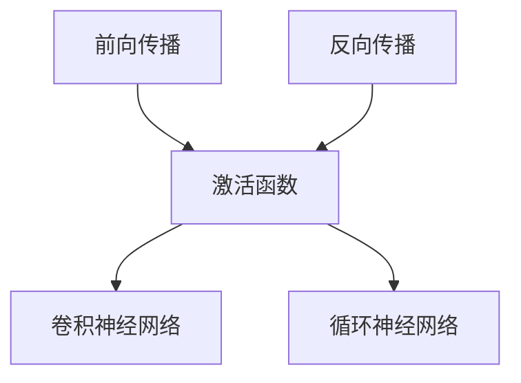

                 

# 神经网络 原理与代码实例讲解

> 关键词：神经网络, 深度学习, 反向传播, 激活函数, 卷积神经网络, 循环神经网络, PyTorch, TensorFlow

## 1. 背景介绍

### 1.1 问题由来
神经网络作为深度学习的基础，是一种具有多层非线性变换能力的机器学习模型。在过去的几十年中，随着数据量和计算资源的不断提升，神经网络已经广泛应用于图像识别、语音识别、自然语言处理、推荐系统等多个领域，并取得了卓越的成果。

近年来，深度学习的快速发展使得神经网络模型越来越复杂，包含的层数和参数量不断增加，训练难度也在不断提升。如何设计有效的神经网络，实现高效训练，成为深度学习研究的重要课题。

### 1.2 问题核心关键点
神经网络的核心在于如何通过多层非线性变换，将原始输入数据映射到目标输出。其核心原理包括：

- 前向传播：将输入数据通过网络层级，逐层进行线性变换和非线性激活，得到最终的输出结果。
- 反向传播：通过计算输出误差，反向传播更新网络参数，优化网络性能。
- 激活函数：非线性变换的关键，决定了网络的表达能力。

神经网络的训练过程通常包括两个部分：前向传播和反向传播。前向传播用于计算网络输出，反向传播用于更新网络参数。反向传播通过链式法则计算梯度，从而实现参数更新。

## 2. 核心概念与联系

### 2.1 核心概念概述

为更好地理解神经网络的原理与实践，本节将介绍几个关键的概念和它们之间的联系：

- 前向传播(Forward Propagation)：将输入数据通过网络各层，计算得到输出结果的过程。
- 反向传播(Backpropagation)：通过计算输出误差，反向传播更新网络参数，优化网络性能的过程。
- 激活函数(Activation Function)：用于实现网络层级的非线性变换，通常使用Sigmoid、ReLU等函数。
- 卷积神经网络(CNN)：主要用于图像处理，通过卷积和池化操作提取局部特征，适合处理网格状数据。
- 循环神经网络(RNN)：主要用于序列数据处理，通过循环结构实现对时间序列的建模。

这些概念之间的逻辑关系可以通过以下Mermaid流程图来展示：



这个流程图展示了大语言模型的核心概念及其之间的关系：

1. 前向传播和反向传播是神经网络训练的核心步骤。
2. 激活函数用于实现非线性变换，是实现深层网络复杂表达的关键。
3. 卷积神经网络和循环神经网络分别适用于处理图像和序列数据。

## 3. 核心算法原理 & 具体操作步骤
### 3.1 算法原理概述

神经网络的核心算法原理是前向传播和反向传播。具体步骤如下：

**前向传播**：
1. 输入数据经过线性变换，得到下一层的输入。
2. 将下一层的输入和权重矩阵进行矩阵乘法，得到加权和。
3. 通过激活函数对加权和进行非线性变换，得到下一层的输出。
4. 重复上述步骤，直到输出层。

**反向传播**：
1. 计算输出误差，回传到输出层。
2. 在输出层，根据误差计算各权重矩阵的梯度。
3. 反向传播梯度，计算中间层各权重矩阵的梯度。
4. 根据梯度更新各权重矩阵，完成参数优化。

通过前向传播和反向传播，神经网络能够学习到输入数据与输出数据之间的复杂非线性映射关系，从而实现高精度的预测和分类。

### 3.2 算法步骤详解

**Step 1: 准备数据集**
- 将原始数据集分为训练集、验证集和测试集。通常要求训练集和验证集的数据分布与测试集相似。
- 对数据进行预处理，包括归一化、标准化、补齐缺失值等操作。

**Step 2: 设计网络结构**
- 根据任务需求，设计神经网络的结构，包括输入层、隐藏层和输出层。
- 确定各层的大小和激活函数。
- 对网络进行正则化，如Dropout、L2正则化等。

**Step 3: 设置超参数**
- 选择合适的优化器及其参数，如SGD、Adam等。
- 设置学习率、批大小、迭代轮数等。
- 确定冻结参数的策略，如固定部分参数。

**Step 4: 执行训练**
- 使用前向传播计算输出。
- 计算输出误差，回传到网络。
- 使用反向传播更新权重矩阵。
- 重复上述步骤，直到满足预设的迭代轮数或停止条件。

**Step 5: 测试和部署**
- 在测试集上评估模型性能，对比训练前后的精度提升。
- 使用模型对新样本进行推理预测，集成到实际的应用系统中。

### 3.3 算法优缺点

神经网络的优点在于：
1. 能够处理高维、非线性的数据，实现复杂映射关系。
2. 在大规模数据集上训练时，具有很强的泛化能力。
3. 通过反向传播，能够快速调整网络参数，实现高效优化。

同时，神经网络也存在一些缺点：
1. 需要大量标注数据，训练时间长。
2. 模型复杂，容易过拟合。
3. 对参数初始化敏感，需要选择合适的初始值。
4. 网络结构设计复杂，难以理解和调试。

尽管存在这些局限性，但就目前而言，神经网络仍然是深度学习中最有效和最常用的模型之一。未来相关研究的重点在于如何进一步提高模型的可解释性，降低对标注数据的依赖，以及探索新的网络结构设计等。

### 3.4 算法应用领域

神经网络在多个领域中都有广泛应用，以下是一些主要的应用场景：

- 图像分类：如手写数字识别、物体识别等，通过卷积神经网络提取图像特征。
- 目标检测：如人脸识别、车辆检测等，通过卷积神经网络和池化层实现特征提取。
- 自然语言处理：如文本分类、情感分析、机器翻译等，通过循环神经网络和Transformer模型实现文本理解。
- 推荐系统：如电商推荐、新闻推荐等，通过深度学习模型实现用户兴趣建模。
- 医疗诊断：如病理图像分析、疾病预测等，通过深度学习模型实现医学图像处理和疾病诊断。

除了这些常见应用外，神经网络还被创新性地应用到更多场景中，如音乐生成、游戏AI、智能交通等，为这些领域带来了全新的突破。

## 4. 数学模型和公式 & 详细讲解  
### 4.1 数学模型构建

神经网络的核心数学模型包括前向传播和反向传播。

**前向传播**：
1. 输入层：$x_0$，维度为 $d_0$。
2. 隐藏层：$x_1, x_2, \dots, x_{n-1}$，每一层的维度为 $d_i$。
3. 输出层：$x_n$，维度为 $d_n$。

其中 $x_i$ 表示第 $i$ 层的输入，$w_i$ 表示第 $i$ 层的权重矩阵，$b_i$ 表示第 $i$ 层的偏置向量。前向传播的过程如下：

$$
x_i = w_i x_{i-1} + b_i
$$

**反向传播**：
1. 输出层误差：$e_n = t - y_n$，其中 $t$ 表示真实标签，$y_n$ 表示网络输出。
2. 输出层梯度：$w_n^T e_n$。
3. 隐藏层梯度：$w_{i-1}^T w_n^T e_n$。
4. 更新权重矩阵：$w_i = w_i - \eta \frac{\partial \mathcal{L}}{\partial w_i}$，其中 $\eta$ 为学习率。

## 5. 项目实践：代码实例和详细解释说明
### 5.1 开发环境搭建

在进行神经网络开发前，我们需要准备好开发环境。以下是使用Python进行PyTorch开发的环境配置流程：

1. 安装Anaconda：从官网下载并安装Anaconda，用于创建独立的Python环境。

2. 创建并激活虚拟环境：
```bash
conda create -n pytorch-env python=3.8 
conda activate pytorch-env
```

3. 安装PyTorch：根据CUDA版本，从官网获取对应的安装命令。例如：
```bash
conda install pytorch torchvision torchaudio cudatoolkit=11.1 -c pytorch -c conda-forge
```

4. 安装Transformers库：
```bash
pip install transformers
```

5. 安装各类工具包：
```bash
pip install numpy pandas scikit-learn matplotlib tqdm jupyter notebook ipython
```

完成上述步骤后，即可在`pytorch-env`环境中开始神经网络实践。

### 5.2 源代码详细实现

下面以手写数字识别为例，给出使用PyTorch进行神经网络开发的PyTorch代码实现。

首先，准备数据集：

```python
from torchvision import datasets, transforms
import torch.nn as nn

# 加载MNIST数据集
train_dataset = datasets.MNIST(root='./data', train=True, transform=transforms.ToTensor(), download=True)
test_dataset = datasets.MNIST(root='./data', train=False, transform=transforms.ToTensor(), download=True)
```

然后，定义神经网络模型：

```python
class Net(nn.Module):
    def __init__(self):
        super(Net, self).__init__()
        self.conv1 = nn.Conv2d(1, 32, 3, 1)
        self.conv2 = nn.Conv2d(32, 64, 3, 1)
        self.dropout1 = nn.Dropout2d(0.25)
        self.dropout2 = nn.Dropout2d(0.5)
        self.fc1 = nn.Linear(9216, 128)
        self.fc2 = nn.Linear(128, 10)

    def forward(self, x):
        x = self.conv1(x)
        x = nn.functional.relu(x)
        x = self.conv2(x)
        x = nn.functional.relu(x)
        x = nn.functional.max_pool2d(x, 2)
        x = self.dropout1(x)
        x = torch.flatten(x, 1)
        x = self.fc1(x)
        x = nn.functional.relu(x)
        x = self.dropout2(x)
        x = self.fc2(x)
        output = nn.functional.log_softmax(x, dim=1)
        return output
```

定义损失函数和优化器：

```python
import torch.optim as optim

model = Net()
criterion = nn.NLLLoss()
optimizer = optim.Adam(model.parameters(), lr=0.001)
```

最后，启动训练流程并在测试集上评估：

```python
epochs = 5
train_loader = torch.utils.data.DataLoader(train_dataset, batch_size=64, shuffle=True)
test_loader = torch.utils.data.DataLoader(test_dataset, batch_size=64, shuffle=False)

for epoch in range(epochs):
    train_loss = 0
    for data, target in train_loader:
        data, target = data.to(device), target.to(device)
        optimizer.zero_grad()
        output = model(data)
        loss = criterion(output, target)
        loss.backward()
        optimizer.step()
        train_loss += loss.item() * data.size(0)

    test_loss = 0
    correct = 0
    with torch.no_grad():
        for data, target in test_loader:
            data, target = data.to(device), target.to(device)
            output = model(data)
            test_loss += criterion(output, target).item()
            pred = output.argmax(dim=1, keepdim=True)
            correct += pred.eq(target.view_as(pred)).sum().item()

    print('Epoch: {} \t '.format(epoch+1),
          'Training Loss: {:.4f} \t '.format(train_loss/len(train_loader)),
          'Testing Loss: {:.4f} \t '.format(test_loss/len(test_loader)),
          'Test Accuracy: {:.3f} %' .format(100 * correct / len(test_loader.dataset)))
```

以上就是使用PyTorch进行手写数字识别任务的神经网络微调的完整代码实现。可以看到，得益于PyTorch的强大封装，我们可以用相对简洁的代码完成神经网络的搭建和训练。

### 5.3 代码解读与分析

让我们再详细解读一下关键代码的实现细节：

**Net类**：
- `__init__`方法：初始化神经网络各层。
- `forward`方法：定义前向传播流程，从输入到输出。

**损失函数和优化器**：
- `criterion`定义交叉熵损失函数。
- `optimizer`定义Adam优化器，设置学习率为0.001。

**训练流程**：
- 定义总的epoch数，开始循环迭代。
- 在每个epoch内，分别在训练集和测试集上进行训练和评估。
- 打印输出每个epoch的训练损失、测试损失和测试准确率。

可以看到，PyTorch配合TensorFlow库使得神经网络微调的代码实现变得简洁高效。开发者可以将更多精力放在数据处理、模型改进等高层逻辑上，而不必过多关注底层的实现细节。

当然，工业级的系统实现还需考虑更多因素，如模型的保存和部署、超参数的自动搜索、更灵活的任务适配层等。但核心的神经网络微调流程基本与此类似。

## 6. 实际应用场景
### 6.1 计算机视觉

神经网络在计算机视觉领域有着广泛应用，如图像分类、目标检测、图像分割等。神经网络通过卷积和池化操作提取图像的局部特征，然后通过全连接层进行分类或回归。

在图像分类任务中，如ImageNet数据集，神经网络能够准确识别图像中的物体类别。通过多轮迭代训练，神经网络逐渐学习到图像中不同物体的特征表示，从而实现高精度的分类。

在目标检测任务中，如COCO数据集，神经网络能够精确地定位图像中的物体，并给出物体的类别和位置信息。通过引入区域建议网络(RPN)和快速最大池化(R-FCN)等技术，神经网络能够在大规模数据集上实现高精度的目标检测。

### 6.2 自然语言处理

神经网络在自然语言处理领域也有着广泛应用，如文本分类、情感分析、机器翻译等。神经网络通过卷积、池化、LSTM、GRU等操作提取文本的局部特征，然后通过全连接层进行分类或回归。

在文本分类任务中，如IMDB数据集，神经网络能够根据文本内容判断其情感极性。通过多轮迭代训练，神经网络逐渐学习到文本中不同情感的特征表示，从而实现高精度的情感分类。

在机器翻译任务中，如WMT数据集，神经网络能够将源语言文本翻译成目标语言。通过多轮迭代训练，神经网络逐渐学习到源语言和目标语言之间的映射关系，从而实现高精度的翻译。

### 6.3 医疗诊断

神经网络在医疗诊断领域也有着广泛应用，如病理图像分析、疾病预测等。神经网络通过卷积和池化操作提取图像的局部特征，然后通过全连接层进行分类或回归。

在病理图像分析任务中，如BCIC数据集，神经网络能够根据医学图像判断其病理类型。通过多轮迭代训练，神经网络逐渐学习到不同病理类型的特征表示，从而实现高精度的病理诊断。

在疾病预测任务中，如UCI数据集，神经网络能够根据病历数据预测疾病的发生概率。通过多轮迭代训练，神经网络逐渐学习到不同疾病的特征表示，从而实现高精度的疾病预测。

### 6.4 未来应用展望

随着神经网络的不断发展，其在更多领域的应用前景将进一步拓展。

在自动驾驶领域，神经网络能够实现对图像、雷达、激光雷达等多模态数据的融合，实现对环境信息的感知和预测。通过多轮迭代训练，神经网络逐渐学习到不同环境下的特征表示，从而实现高精度的自动驾驶。

在金融领域，神经网络能够实现对大数据的分析和预测，如股票价格预测、信用评分等。通过多轮迭代训练，神经网络逐渐学习到不同金融指标的特征表示，从而实现高精度的金融预测。

在智慧城市领域，神经网络能够实现对城市交通、公共安全、环境监测等多场景数据的分析，如交通流量预测、犯罪预测等。通过多轮迭代训练，神经网络逐渐学习到不同场景下的特征表示，从而实现高精度的城市管理。

总之，神经网络作为深度学习的基础，其应用前景非常广阔，未来必将在更多领域中发挥重要作用。

## 7. 工具和资源推荐
### 7.1 学习资源推荐

为了帮助开发者系统掌握神经网络的理论基础和实践技巧，这里推荐一些优质的学习资源：

1. 《深度学习》系列书籍：由Ian Goodfellow、Yoshua Bengio、Aaron Courville等人合著，全面介绍了深度学习的理论基础和实践技巧，是深度学习领域的重要教材。

2. CS231n《深度学习与计算机视觉》课程：斯坦福大学开设的计算机视觉明星课程，有Lecture视频和配套作业，带你入门计算机视觉领域的基本概念和经典模型。

3. CS224n《深度学习与自然语言处理》课程：斯坦福大学开设的自然语言处理明星课程，有Lecture视频和配套作业，带你入门自然语言处理领域的基本概念和经典模型。

4. 《Hands-On Machine Learning with Scikit-Learn, Keras, and TensorFlow》书籍：Hands-On系列书籍，由Aurélien Géron撰写，介绍了TensorFlow和Scikit-Learn的使用方法，适合快速上手实践。

5. TensorFlow官方文档：TensorFlow官方文档，提供了丰富的神经网络实现和优化技巧，是深度学习开发者必备的参考资料。

6. PyTorch官方文档：PyTorch官方文档，提供了丰富的神经网络实现和优化技巧，是深度学习开发者必备的参考资料。

通过对这些资源的学习实践，相信你一定能够快速掌握神经网络的精髓，并用于解决实际的深度学习问题。

### 7.2 开发工具推荐

高效的开发离不开优秀的工具支持。以下是几款用于神经网络开发常用的工具：

1. PyTorch：基于Python的开源深度学习框架，灵活动态的计算图，适合快速迭代研究。几乎所有主流深度学习模型都有PyTorch版本的实现。

2. TensorFlow：由Google主导开发的开源深度学习框架，生产部署方便，适合大规模工程应用。提供了丰富的神经网络实现和优化技巧。

3. Keras：基于TensorFlow的高级深度学习库，提供了简单易用的API，适合快速原型开发和实验研究。

4. Weights & Biases：模型训练的实验跟踪工具，可以记录和可视化模型训练过程中的各项指标，方便对比和调优。与主流深度学习框架无缝集成。

5. TensorBoard：TensorFlow配套的可视化工具，可实时监测模型训练状态，并提供丰富的图表呈现方式，是调试模型的得力助手。

6. Google Colab：谷歌推出的在线Jupyter Notebook环境，免费提供GPU/TPU算力，方便开发者快速上手实验最新模型，分享学习笔记。

合理利用这些工具，可以显著提升神经网络开发的效率，加快创新迭代的步伐。

### 7.3 相关论文推荐

神经网络作为深度学习的重要组成部分，其发展历史悠久，相关的研究论文也颇为丰富。以下是几篇奠基性的相关论文，推荐阅读：

1. Deep Blue Book（深度学习书籍）：由Ian Goodfellow、Yoshua Bengio、Aaron Courville等人合著，全面介绍了深度学习的理论基础和实践技巧，是深度学习领域的重要教材。

2. ImageNet Classification with Deep Convolutional Neural Networks（ImageNet数据集分类）：Hinton等人提出使用卷积神经网络在ImageNet数据集上实现高精度图像分类。

3. Attention Is All You Need（Transformer模型）：提出Transformer结构，开启了深度学习领域预训练大模型时代。

4. BERT: Pre-training of Deep Bidirectional Transformers for Language Understanding（BERT模型）：提出BERT模型，引入基于掩码的自监督预训练任务，刷新了多项自然语言处理任务SOTA。

5. AlexNet: One Milliion Training Examples for Image Classification（AlexNet模型）：提出AlexNet模型，使用多层卷积和全连接层，在ImageNet数据集上实现了高精度图像分类。

6. Deep Residual Learning for Image Recognition（ResNet模型）：提出ResNet模型，通过残差连接解决了深层网络训练困难的问题，实现了高精度图像分类。

这些论文代表了大神经网络的发展脉络。通过学习这些前沿成果，可以帮助研究者把握学科前进方向，激发更多的创新灵感。

## 8. 总结：未来发展趋势与挑战

### 8.1 总结

本文对神经网络的核心算法原理和实践进行了全面系统的介绍。首先阐述了神经网络的背景和意义，明确了神经网络在处理复杂数据、实现高精度预测和分类方面的独特价值。其次，从原理到实践，详细讲解了神经网络的前向传播和反向传播过程，给出了神经网络任务开发的完整代码实例。同时，本文还广泛探讨了神经网络在计算机视觉、自然语言处理、医疗诊断等多个领域的应用前景，展示了神经网络模型的广泛应用。此外，本文精选了神经网络技术的各类学习资源，力求为读者提供全方位的技术指引。

通过本文的系统梳理，可以看到，神经网络作为深度学习的基础，其应用前景非常广阔。未来神经网络必将在更多领域中发挥重要作用，推动人工智能技术的发展和应用。

### 8.2 未来发展趋势

展望未来，神经网络技术将呈现以下几个发展趋势：

1. 深度神经网络将更加复杂。随着计算资源和数据量的增加，深度神经网络的层数和参数量将持续增加，模型表达能力也将进一步提升。

2. 神经网络将更加关注模型解释性。神经网络的复杂性增加了其难以解释的性质，未来的研究将更加注重模型的可解释性，以便更好地应用于实际业务场景。

3. 神经网络将更加注重多模态数据融合。当前的神经网络主要处理单一模态数据，未来的研究将更加注重多模态数据的融合，如视觉、语音、文本等信息的协同建模。

4. 神经网络将更加注重计算效率。神经网络的复杂性增加了其训练和推理的计算资源消耗，未来的研究将更加注重计算效率，提高模型的实时性。

5. 神经网络将更加注重个性化和定制化。不同的应用场景需要不同的模型架构和参数设置，未来的研究将更加注重模型的个性化和定制化设计。

以上趋势凸显了神经网络技术的广泛前景，未来的研究将更加注重模型解释性、多模态数据融合、计算效率和个性化定制等方面的改进和优化。

### 8.3 面临的挑战

尽管神经网络技术已经取得了显著成就，但在其发展和应用过程中，仍面临着诸多挑战：

1. 计算资源和数据量需求高。神经网络的复杂性增加了其对计算资源和数据量的需求，特别是在训练大模型时。如何降低对计算资源的依赖，提高模型训练效率，仍是一个重要挑战。

2. 模型复杂度难以解释。神经网络的复杂性增加了其难以解释的性质，特别是在深度神经网络中。如何提高模型的可解释性，使其更好地应用于实际业务场景，仍是一个重要挑战。

3. 数据质量和多样性不足。神经网络在处理真实数据时，需要大量的高质量数据来训练和测试。如何获取和利用高质量、多样化的数据，仍是一个重要挑战。

4. 模型泛化能力有限。神经网络在处理复杂数据时，需要大量的训练数据来避免过拟合。如何提高模型的泛化能力，使其更好地应用于未知数据，仍是一个重要挑战。

5. 模型鲁棒性不足。神经网络在处理噪声和异常数据时，容易产生误判和鲁棒性差的问题。如何提高模型的鲁棒性，使其更好地应对异常和噪声数据，仍是一个重要挑战。

6. 模型公平性和安全性问题。神经网络在处理敏感数据时，容易产生偏见和安全性问题。如何提高模型的公平性和安全性，使其更好地保护用户隐私和数据安全，仍是一个重要挑战。

正视神经网络面临的这些挑战，积极应对并寻求突破，将是神经网络技术进一步发展和应用的重要方向。

### 8.4 未来突破

面对神经网络面临的诸多挑战，未来的研究需要在以下几个方面寻求新的突破：

1. 探索无监督和半监督学习技术。摆脱对大规模标注数据的依赖，利用无监督和半监督学习技术，最大限度地利用非结构化数据，实现更加高效和灵活的模型训练。

2. 研究多模态数据融合技术。将视觉、语音、文本等多种模态信息进行融合，提高神经网络的表达能力和泛化能力。

3. 开发计算高效和模型轻量化的技术。提高神经网络的计算效率，减小模型参数量，实现实时性和资源节约。

4. 引入可解释性模型和算法。通过可解释性模型和算法，提高神经网络的解释性，使其更好地应用于实际业务场景。

5. 开发更加公平和安全的模型。通过公平性算法和隐私保护技术，提高神经网络的安全性和公平性，使其更好地保护用户隐私和数据安全。

这些研究方向的探索，必将引领神经网络技术迈向更高的台阶，为构建高效、可靠、可解释、可控的智能系统铺平道路。面向未来，神经网络技术还需要与其他人工智能技术进行更深入的融合，如知识表示、因果推理、强化学习等，多路径协同发力，共同推动人工智能技术的发展和应用。只有勇于创新、敢于突破，才能不断拓展神经网络的边界，让智能技术更好地造福人类社会。

## 9. 附录：常见问题与解答

**Q1：深度学习与传统机器学习的区别是什么？**

A: 深度学习与传统机器学习的主要区别在于模型的表达能力和数据需求。深度学习通过多层神经网络实现了高精度的数据拟合，能够处理复杂的数据结构和关系，但需要大量的高质量数据和计算资源。传统机器学习则通过手工特征工程和简单的模型实现，数据需求和计算资源相对较少，但模型表达能力有限。

**Q2：如何选择神经网络模型？**

A: 选择神经网络模型需要考虑多个因素，包括数据类型、任务类型、模型复杂度、计算资源等。一般而言，对于图像数据，可以选择卷积神经网络；对于序列数据，可以选择循环神经网络；对于高维数据，可以选择自编码器和变分自编码器。此外，还可以根据实际任务需求进行模型优化和调整。

**Q3：如何优化神经网络的训练过程？**

A: 优化神经网络的训练过程可以从以下几个方面入手：
1. 数据增强：通过数据扩充和增强，增加数据多样性，提高模型泛化能力。
2. 正则化：通过L2正则、Dropout等技术，避免过拟合。
3. 学习率调整：通过学习率衰减、调整等方法，优化学习过程。
4. 批大小设置：通过调整批大小，提高模型训练速度和效果。
5. 模型剪枝和量化：通过剪枝和量化技术，减小模型参数量，提高模型推理速度。

这些方法需要根据具体任务和数据特点进行灵活组合。只有在数据、模型、训练、推理等各环节进行全面优化，才能最大限度地发挥神经网络的优势。

**Q4：神经网络在计算机视觉中的应用有哪些？**

A: 神经网络在计算机视觉领域有着广泛应用，包括但不限于：
1. 图像分类：如手写数字识别、物体识别等。
2. 目标检测：如人脸识别、车辆检测等。
3. 图像分割：如语义分割、实例分割等。
4. 物体跟踪：如运动跟踪、行为分析等。
5. 图像生成：如风格迁移、图像补全等。

神经网络能够处理高维、非线性的数据，实现复杂映射关系，因此在计算机视觉领域有着广泛的应用前景。

**Q5：神经网络在自然语言处理中的应用有哪些？**

A: 神经网络在自然语言处理领域也有着广泛应用，包括但不限于：
1. 文本分类：如情感分析、主题分类等。
2. 命名实体识别：如人名、地名、组织名等实体识别。
3. 关系抽取：从文本中抽取实体之间的语义关系。
4. 机器翻译：将源语言文本翻译成目标语言。
5. 对话系统：使机器能够与人自然对话。

神经网络能够处理自然语言数据，实现复杂映射关系，因此在自然语言处理领域有着广泛的应用前景。

---

作者：禅与计算机程序设计艺术 / Zen and the Art of Computer Programming

