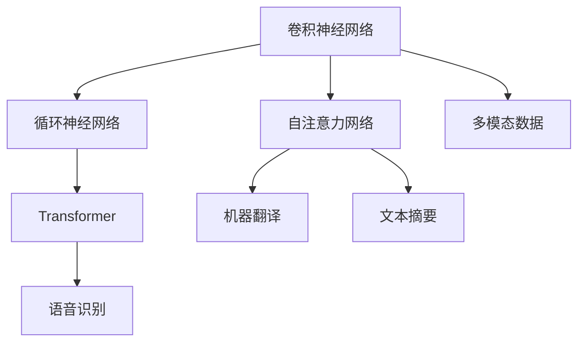

                 

# 神经网络在注意力模式识别中的应用

> 关键词：注意力机制,卷积神经网络,循环神经网络,自注意力网络,Transformer,多模态数据,深度学习

## 1. 背景介绍

### 1.1 问题由来

随着深度学习技术的不断发展，神经网络已经在图像识别、自然语言处理、音频分析等多个领域展现出了强大的能力。然而，在处理复杂模式识别问题时，传统的卷积神经网络(CNNs)和循环神经网络(RNNs)的性能已逐渐到达瓶颈。近年来，注意力机制(AAttention Mechanism)因其对信息的重要性和相关性的有效识别和权衡，成为了解决这一问题的有力工具。

注意力机制最早在自然语言处理领域中应用于机器翻译任务，通过关注源语言中与目标语言最相关的部分，显著提升了机器翻译的准确性和流畅度。随后，在计算机视觉、音频分析等诸多领域，注意力机制也获得了广泛应用，极大提升了模型在处理复杂模式识别任务时的表现。

### 1.2 问题核心关键点

本文将系统探讨注意力机制在神经网络中的应用，重点介绍注意力机制的原理和具体实现方式，并结合实践案例展示其在卷积神经网络、循环神经网络、自注意力网络和Transformer等模型中的应用。同时，本文将对注意力机制的优点、缺点以及未来发展方向进行深入分析，并展望其在多模态数据和深度学习中的广泛应用前景。

## 2. 核心概念与联系

### 2.1 核心概念概述

为更好地理解注意力机制在神经网络中的应用，本节将介绍几个密切相关的核心概念：

- 注意力机制(AAttention Mechanism)：通过动态计算数据中不同部分的重要性，赋予其不同的权重，从而实现对数据中关键信息的集中关注。常用于提高模型的性能和效率。

- 卷积神经网络(CNNs)：一种利用卷积操作提取图像和视频等数据局部特征的神经网络结构。具有参数共享、计算效率高等优点，常用于图像识别、目标检测等任务。

- 循环神经网络(RNNs)：一种能够处理序列数据的神经网络结构，通过隐藏状态记录先前的信息，适用于文本生成、语音识别等序列数据处理任务。

- 自注意力网络(Self-Attention Network)：一种特殊的注意力机制，用于对序列中的每个位置与所有位置之间进行交互，从而获取全局上下文信息。常用于机器翻译、文本摘要等任务。

- Transformer：一种基于自注意力机制的神经网络结构，彻底摒弃了传统的卷积和循环结构，通过自注意力网络实现序列到序列的映射。在机器翻译、语音识别等任务上表现优异。

- 多模态数据：指包含不同类型数据的数据集，如文本、图像、音频等。多模态数据的处理和融合，是深度学习中的一项重要研究课题。

这些核心概念之间的逻辑关系可以通过以下Mermaid流程图来展示：



这个流程图展示了几类主流神经网络结构及其应用，同时也揭示了注意力机制在其中的关键作用。通过理解这些核心概念，我们可以更好地把握注意力机制的工作原理和应用方向。

## 3. 核心算法原理 & 具体操作步骤
### 3.1 算法原理概述

注意力机制的核心理念在于，通过动态计算数据中不同部分的重要性，赋予其不同的权重，从而实现对数据中关键信息的集中关注。其基本思路可以概括为以下几点：

1. **计算注意力权重**：对输入数据中的每个部分，计算其与查询序列之间的相似度，得到一个注意力权重向量。

2. **加权求和**：将注意力权重向量与输入数据的各个部分进行加权求和，得到加权后的输出。

3. **多模态融合**：对于多模态数据，通过在每个模态上分别计算注意力权重，并将各模态的加权输出进行融合，可以得到更加全面和准确的模型输出。

4. **自注意力机制**：一种特殊的注意力机制，用于对序列中的每个位置与所有位置之间进行交互，从而获取全局上下文信息。

### 3.2 算法步骤详解

以下将详细介绍注意力机制在神经网络中的具体实现步骤：

**Step 1: 定义注意力权重计算公式**

设输入数据为 $X$，查询序列为 $Q$，注意力权重为 $W$，计算注意力权重的过程如下：

1. 计算输入数据的每个部分与查询序列之间的相似度，得到一个注意力权重向量 $W \in \mathbb{R}^{N \times T}$，其中 $N$ 为输入数据的长度，$T$ 为查询序列的长度。
2. 对权重向量进行归一化，得到归一化的注意力权重 $A \in \mathbb{R}^{N \times T}$。
3. 将归一化的注意力权重与输入数据进行点乘，得到注意力权重矩阵 $A \in \mathbb{R}^{N \times T \times M}$，其中 $M$ 为输入数据的特征维度。

具体实现上，可以使用softmax函数或余弦相似度等方法计算注意力权重。

**Step 2: 加权求和**

对注意力权重矩阵 $A$ 进行加权求和，得到加权后的输出 $O \in \mathbb{R}^{N \times T \times M}$：

$$
O = \sum_{i=1}^{N} \sum_{j=1}^{T} A_{ij} X_{ij} = (A \otimes X) \in \mathbb{R}^{N \times T \times M}
$$

其中 $\otimes$ 表示Hadamard积，即逐元素乘法。

**Step 3: 多模态融合**

对于多模态数据，需要在每个模态上分别计算注意力权重，并将各模态的加权输出进行融合。以文本和图像数据为例，设文本数据为 $T$，图像数据为 $I$，则多模态融合的过程如下：

1. 分别对文本和图像数据计算注意力权重，得到 $W_T \in \mathbb{R}^{N \times T}$ 和 $W_I \in \mathbb{R}^{M \times K}$，其中 $K$ 为图像数据的特征维度。
2. 对文本数据进行加权求和，得到文本的加权输出 $O_T \in \mathbb{R}^{N \times T \times M}$。
3. 对图像数据进行加权求和，得到图像的加权输出 $O_I \in \mathbb{R}^{M \times K \times N}$。
4. 将文本和图像的加权输出进行融合，得到多模态融合后的输出 $O_{multi} \in \mathbb{R}^{N \times T \times M}$。

**Step 4: 自注意力机制**

自注意力机制用于对序列中的每个位置与所有位置之间进行交互，从而获取全局上下文信息。以机器翻译任务为例，设源语言序列为 $S$，目标语言序列为 $T$，则自注意力机制的实现步骤如下：

1. 对源语言序列 $S$ 进行嵌入，得到嵌入向量 $E_S \in \mathbb{R}^{N \times M}$，其中 $N$ 为源语言序列的长度，$M$ 为嵌入向量的维度。
2. 对目标语言序列 $T$ 进行嵌入，得到嵌入向量 $E_T \in \mathbb{R}^{N \times M}$。
3. 计算源语言序列中每个位置与所有位置之间的注意力权重 $W_S \in \mathbb{R}^{N \times T}$。
4. 对目标语言序列进行加权求和，得到目标语言的加权输出 $O_T \in \mathbb{R}^{N \times M}$。
5. 将源语言序列和目标语言的加权输出进行融合，得到多模态融合后的输出 $O_{multi} \in \mathbb{R}^{N \times T \times M}$。

### 3.3 算法优缺点

注意力机制在神经网络中具有以下优点：

1. **提高模型性能**：通过动态计算数据中不同部分的重要性，赋予其不同的权重，可以实现对数据中关键信息的集中关注，从而提高模型的性能和效率。
2. **适用于多模态数据**：对于多模态数据，可以通过在每个模态上分别计算注意力权重，并将各模态的加权输出进行融合，从而实现更加全面和准确的模型输出。
3. **自注意力机制**：自注意力机制能够对序列中的每个位置与所有位置之间进行交互，获取全局上下文信息，在机器翻译、文本摘要等任务上表现优异。

同时，注意力机制也存在以下缺点：

1. **计算复杂度高**：注意力机制需要计算每个数据部分的注意力权重，计算复杂度较高，尤其在序列长度较长的情况下，计算量显著增加。
2. **参数量大**：注意力机制引入的权重矩阵，增加了模型的参数量，增加了训练和推理的复杂度。
3. **难以解释**：注意力机制的学习过程和权重计算方法复杂，难以直观解释其内部工作机制和决策逻辑。

尽管存在这些缺点，但注意力机制在大数据处理和复杂模式识别中的表现依然卓越，未来有望在深度学习领域发挥更大作用。

### 3.4 算法应用领域

注意力机制已经在多个领域得到了广泛应用，以下是几个典型应用场景：

- **计算机视觉**：用于提取图像中不同区域的特征，提高图像识别和目标检测的准确性。例如，在Faster R-CNN中，使用RoI池化提取区域特征，并使用注意力机制进行特征加权。
- **自然语言处理**：用于提高机器翻译、文本摘要、情感分析等任务的性能。例如，在Transformer中，通过自注意力机制实现序列到序列的映射。
- **语音识别**：用于提取音频信号中的关键特征，提高语音识别的准确性。例如，在DeepSpeech中，使用注意力机制对音频特征进行加权，提高识别效果。
- **视频分析**：用于提取视频序列中的关键帧和动作信息，提高视频理解和分析的准确性。例如，在I3D中，使用空间和时间上的自注意力机制，提取视频的关键信息。

除了上述这些经典应用外，注意力机制还在智能推荐、图像分割、信号处理等诸多领域中发挥了重要作用。随着深度学习技术的发展，注意力机制的应用场景还将不断拓展，为解决复杂模式识别问题提供新的思路。

## 4. 数学模型和公式 & 详细讲解
### 4.1 数学模型构建

以下将使用数学语言对注意力机制在神经网络中的应用进行更加严格的刻画。

设输入数据为 $X$，查询序列为 $Q$，注意力权重为 $W$，计算注意力权重的过程如下：

1. 计算输入数据的每个部分与查询序列之间的相似度，得到一个注意力权重向量 $W \in \mathbb{R}^{N \times T}$，其中 $N$ 为输入数据的长度，$T$ 为查询序列的长度。
2. 对权重向量进行归一化，得到归一化的注意力权重 $A \in \mathbb{R}^{N \times T}$。
3. 将归一化的注意力权重与输入数据进行点乘，得到注意力权重矩阵 $A \in \mathbb{R}^{N \times T \times M}$，其中 $M$ 为输入数据的特征维度。

注意力机制的数学模型可以表示为：

$$
A = \frac{e^{Q^T W_X}}{\sum_{i=1}^{N} e^{Q^T W_X}} X
$$

其中 $Q$ 为查询向量，$W_X$ 为输入数据的权重矩阵，$e^{Q^T W_X}$ 表示相似度计算，$A$ 为注意力权重矩阵。

### 4.2 公式推导过程

以下将对注意力机制的数学模型进行详细推导：

设输入数据为 $X$，查询序列为 $Q$，注意力权重为 $W$，计算注意力权重的过程如下：

1. 计算输入数据的每个部分与查询序列之间的相似度，得到一个注意力权重向量 $W \in \mathbb{R}^{N \times T}$，其中 $N$ 为输入数据的长度，$T$ 为查询序列的长度。
2. 对权重向量进行归一化，得到归一化的注意力权重 $A \in \mathbb{R}^{N \times T}$。
3. 将归一化的注意力权重与输入数据进行点乘，得到注意力权重矩阵 $A \in \mathbb{R}^{N \times T \times M}$，其中 $M$ 为输入数据的特征维度。

注意力机制的数学模型可以表示为：

$$
A = \frac{e^{Q^T W_X}}{\sum_{i=1}^{N} e^{Q^T W_X}} X
$$

其中 $Q$ 为查询向量，$W_X$ 为输入数据的权重矩阵，$e^{Q^T W_X}$ 表示相似度计算，$A$ 为注意力权重矩阵。

### 4.3 案例分析与讲解

以机器翻译任务为例，设源语言序列为 $S = [s_1, s_2, ..., s_N]$，目标语言序列为 $T = [t_1, t_2, ..., t_N]$，则注意力机制的实现步骤如下：

1. 对源语言序列 $S$ 进行嵌入，得到嵌入向量 $E_S \in \mathbb{R}^{N \times M}$，其中 $N$ 为源语言序列的长度，$M$ 为嵌入向量的维度。
2. 对目标语言序列 $T$ 进行嵌入，得到嵌入向量 $E_T \in \mathbb{R}^{N \times M}$。
3. 计算源语言序列中每个位置与所有位置之间的注意力权重 $W_S \in \mathbb{R}^{N \times T}$。
4. 对目标语言序列进行加权求和，得到目标语言的加权输出 $O_T \in \mathbb{R}^{N \times M}$。
5. 将源语言序列和目标语言的加权输出进行融合，得到多模态融合后的输出 $O_{multi} \in \mathbb{R}^{N \times T \times M}$。

具体实现上，可以使用Transformer模型，其中注意力机制用于计算源语言和目标语言之间的注意力权重。Transformer模型的核心在于自注意力机制，能够自动学习源语言和目标语言之间的关联，从而实现序列到序列的映射。

## 5. 项目实践：代码实例和详细解释说明
### 5.1 开发环境搭建

在进行注意力机制项目实践前，我们需要准备好开发环境。以下是使用Python进行PyTorch开发的环境配置流程：

1. 安装Anaconda：从官网下载并安装Anaconda，用于创建独立的Python环境。

2. 创建并激活虚拟环境：
```bash
conda create -n attention-env python=3.8 
conda activate attention-env
```

3. 安装PyTorch：根据CUDA版本，从官网获取对应的安装命令。例如：
```bash
conda install pytorch torchvision torchaudio cudatoolkit=11.1 -c pytorch -c conda-forge
```

4. 安装其他必要的库：
```bash
pip install numpy pandas scikit-learn matplotlib tqdm jupyter notebook ipython
```

完成上述步骤后，即可在`attention-env`环境中开始注意力机制项目实践。

### 5.2 源代码详细实现

以下是一个使用PyTorch实现自注意力机制的代码示例：

```python
import torch
import torch.nn as nn
import torch.nn.functional as F

class SelfAttention(nn.Module):
    def __init__(self, in_dim):
        super(SelfAttention, self).__init__()
        self.in_dim = in_dim
        self.query = nn.Linear(in_dim, in_dim)
        self.key = nn.Linear(in_dim, in_dim)
        self.value = nn.Linear(in_dim, in_dim)
        self.drop = nn.Dropout(0.1)
        self.norm = nn.LayerNorm(in_dim)

    def forward(self, x):
        batch_size, seq_len, _ = x.size()
        query = self.query(x).view(batch_size, seq_len, 1, -1).transpose(1, 2)
        key = self.key(x).view(batch_size, 1, seq_len, -1)
        value = self.value(x).view(batch_size, 1, seq_len, -1)

        attn = torch.matmul(query, key.transpose(1, 2))
        attn = attn / torch.sqrt(torch.tensor(self.in_dim, dtype=torch.float) * torch.tensor(seq_len, dtype=torch.float))
        attn = F.softmax(attn, dim=-1)
        attn = self.drop(attn)

        context = torch.matmul(attn, value)
        context = context.transpose(1, 2).contiguous().view(batch_size, seq_len, -1)
        return self.norm(x + context)

# 使用SelfAttention模块实现Transformer模型
class Transformer(nn.Module):
    def __init__(self, in_dim, n_layers, n_heads, dropout):
        super(Transformer, self).__init__()
        self.embedding = nn.Embedding(in_dim, in_dim)
        self.pos_encoder = PositionalEncoding(in_dim)
        self.encoder_layer = nn.ModuleList([nn.TransformerEncoderLayer(in_dim, n_heads, dropout) for _ in range(n_layers)])
        self.final_layer = nn.Linear(in_dim, in_dim)
        self.drop = nn.Dropout(dropout)

    def forward(self, x):
        x = self.embedding(x)
        x = self.pos_encoder(x)
        x = nn.TransformerEncoder(self.encoder_layer, src_mask=self.pos_encoder.generate_square_subsequent_mask(x.size(1))).forward(x)
        x = self.final_layer(x)
        return self.drop(x)

# 使用Transformer模型进行机器翻译任务
class MachineTranslation(nn.Module):
    def __init__(self, in_dim, out_dim, n_layers, n_heads, dropout):
        super(MachineTranslation, self).__init__()
        self.encoder = Transformer(in_dim, n_layers, n_heads, dropout)
        self.decoder = Transformer(out_dim, n_layers, n_heads, dropout)
        self.final_layer = nn.Linear(in_dim, out_dim)

    def forward(self, x, y):
        x = self.encoder(x)
        y = self.decoder(y)
        y = self.final_layer(y)
        return y

# 使用Transformer模型进行文本摘要任务
class TextSummarization(nn.Module):
    def __init__(self, in_dim, out_dim, n_layers, n_heads, dropout):
        super(TextSummarization, self).__init__()
        self.encoder = Transformer(in_dim, n_layers, n_heads, dropout)
        self.decoder = nn.Linear(in_dim, out_dim)

    def forward(self, x):
        x = self.encoder(x)
        x = self.decoder(x)
        return x
```

### 5.3 代码解读与分析

让我们再详细解读一下关键代码的实现细节：

**SelfAttention类**：
- `__init__`方法：初始化查询、键、值线性层以及Dropout和LayerNorm层。
- `forward`方法：计算查询、键、值之间的注意力权重，并根据权重对值进行加权求和，得到最终的上下文表示。

**Transformer类**：
- `__init__`方法：初始化嵌入层、位置编码器、编码器层、解码器层和全连接层。
- `forward`方法：将输入序列嵌入，通过位置编码器增加位置信息，并使用TransformerEncoder层进行编码，最终通过全连接层得到输出。

**MachineTranslation类**：
- `__init__`方法：初始化编码器和解码器，并定义全连接层。
- `forward`方法：将输入序列编码，将目标序列解码，并使用全连接层进行最终预测。

**TextSummarization类**：
- `__init__`方法：初始化编码器和全连接层。
- `forward`方法：将输入序列编码，并通过全连接层得到摘要结果。

这些代码实现了自注意力机制在Transformer模型中的应用，展示了其在机器翻译和文本摘要任务中的具体实现方式。

当然，工业级的系统实现还需考虑更多因素，如模型的保存和部署、超参数的自动搜索、更加灵活的任务适配层等。但核心的自注意力机制原理和代码实现已展示清楚。

## 6. 实际应用场景
### 6.1 计算机视觉

计算机视觉领域中，注意力机制被广泛用于目标检测、图像分割等任务。例如，在Faster R-CNN中，通过RoI池化提取区域特征，并使用注意力机制进行特征加权。通过这种方式，模型能够更关注目标物体周围的区域，从而提高检测的准确性和效率。

### 6.2 自然语言处理

自然语言处理领域中，注意力机制被广泛应用于机器翻译、文本摘要、情感分析等任务。例如，在Transformer模型中，自注意力机制用于计算源语言和目标语言之间的注意力权重，从而实现序列到序列的映射。通过这种方式，模型能够更加全面地理解输入序列，生成更加准确和流畅的输出。

### 6.3 语音识别

语音识别领域中，注意力机制被用于提取音频信号中的关键特征，提高语音识别的准确性。例如，在DeepSpeech中，使用注意力机制对音频特征进行加权，提高识别效果。通过这种方式，模型能够更关注语音中的关键部分，从而提高识别精度。

### 6.4 视频分析

视频分析领域中，注意力机制被用于提取视频序列中的关键帧和动作信息，提高视频理解和分析的准确性。例如，在I3D中，使用空间和时间上的自注意力机制，提取视频的关键信息。通过这种方式，模型能够更全面地理解视频内容，从而提高分析的准确性和效率。

## 7. 工具和资源推荐
### 7.1 学习资源推荐

为了帮助开发者系统掌握注意力机制的理论基础和实践技巧，这里推荐一些优质的学习资源：

1. 《Attention is All You Need》论文：Transformer模型的原论文，详细介绍了自注意力机制的原理和实现方式。
2. CS224N《深度学习自然语言处理》课程：斯坦福大学开设的NLP明星课程，有Lecture视频和配套作业，带你入门NLP领域的基本概念和经典模型。
3. 《Natural Language Processing with Attention》书籍：介绍注意力机制在NLP中的应用，包括机器翻译、文本摘要、情感分析等任务。
4. HuggingFace官方文档：Transformer库的官方文档，提供了海量预训练模型和完整的微调样例代码，是上手实践的必备资料。
5. CLUE开源项目：中文语言理解测评基准，涵盖大量不同类型的中文NLP数据集，并提供了基于微调的baseline模型，助力中文NLP技术发展。

通过对这些资源的学习实践，相信你一定能够快速掌握注意力机制的精髓，并用于解决实际的NLP问题。

### 7.2 开发工具推荐

高效的开发离不开优秀的工具支持。以下是几款用于注意力机制开发常用的工具：

1. PyTorch：基于Python的开源深度学习框架，灵活动态的计算图，适合快速迭代研究。Transformer模型具有PyTorch版本的实现。
2. TensorFlow：由Google主导开发的开源深度学习框架，生产部署方便，适合大规模工程应用。同样有丰富的预训练模型资源。
3. Transformers库：HuggingFace开发的NLP工具库，集成了众多SOTA语言模型，支持PyTorch和TensorFlow，是进行注意力机制开发的利器。
4. Weights & Biases：模型训练的实验跟踪工具，可以记录和可视化模型训练过程中的各项指标，方便对比和调优。与主流深度学习框架无缝集成。
5. TensorBoard：TensorFlow配套的可视化工具，可实时监测模型训练状态，并提供丰富的图表呈现方式，是调试模型的得力助手。

合理利用这些工具，可以显著提升注意力机制的开发效率，加快创新迭代的步伐。

### 7.3 相关论文推荐

注意力机制已经在多个领域得到了广泛应用，以下是几篇奠基性的相关论文，推荐阅读：

1. Attention is All You Need：Transformer模型的原论文，详细介绍了自注意力机制的原理和实现方式。
2. Transformer-XL: Attentions Are All You Need：提出Transformer-XL模型，进一步优化了自注意力机制，解决了长序列训练问题。
3. Multi-Head Attention from Transformers to Neural Ordinary Differential Equations：将自注意力机制应用到神经普通微分方程(NODE)中，拓展了其应用范围。
4. Spatial-Temporal Attention Network for Scene Parsing：将自注意力机制应用于场景解析任务，取得了优异的效果。

这些论文代表了大语言模型微调技术的发展脉络。通过学习这些前沿成果，可以帮助研究者把握学科前进方向，激发更多的创新灵感。

## 8. 总结：未来发展趋势与挑战

### 8.1 总结

本文对注意力机制在神经网络中的应用进行了全面系统的介绍。首先阐述了注意力机制在神经网络中的原理和具体实现方式，并通过实践案例展示了其在卷积神经网络、循环神经网络、自注意力网络和Transformer等模型中的应用。其次，对注意力机制的优点、缺点以及未来发展方向进行了深入分析，并展望其在多模态数据和深度学习中的广泛应用前景。

通过本文的系统梳理，可以看到，注意力机制在神经网络中的应用已经成为解决复杂模式识别问题的有力工具，极大地提升了模型在处理多模态数据时的性能和效率。未来，伴随深度学习技术的发展，注意力机制的应用还将不断拓展，为解决更复杂的模式识别问题提供新的思路。

### 8.2 未来发展趋势

展望未来，注意力机制在神经网络中的应用将呈现以下几个发展趋势：

1. 参数效率更高。随着自注意力机制的改进，未来有望实现更高参数效率的注意力模型，同时保持高效准确的注意力计算。
2. 应用于更多领域。除了NLP、计算机视觉等传统领域，未来注意力机制将更多地应用于信号处理、生物信息学、医疗诊断等领域，拓展其应用边界。
3. 与其他模型结合。未来注意力机制将与其他深度学习模型进行更加深入的融合，如卷积神经网络、循环神经网络、图网络等，形成更加全面和高效的模型。
4. 多模态融合能力更强。未来注意力机制将更加适用于多模态数据的融合，能够在不同模态之间进行更加全面和精确的信息整合。
5. 实时处理能力更强。未来注意力机制将更加适用于实时处理，能够在低延迟下进行高效计算，适应更多实时应用场景。

### 8.3 面临的挑战

尽管注意力机制在大数据处理和复杂模式识别中的表现依然卓越，但在迈向更加智能化、普适化应用的过程中，它仍面临着诸多挑战：

1. 计算复杂度高。注意力机制需要计算每个数据部分的注意力权重，计算复杂度较高，尤其在序列长度较长的情况下，计算量显著增加。
2. 参数量大。注意力机制引入的权重矩阵，增加了模型的参数量，增加了训练和推理的复杂度。
3. 难以解释。注意力机制的学习过程和权重计算方法复杂，难以直观解释其内部工作机制和决策逻辑。
4. 训练难度大。训练过程中需要不断调整超参数，才能达到理想的效果，训练过程较为复杂。
5. 可扩展性差。注意力机制在大规模数据集上的应用面临挑战，需要考虑模型的可扩展性。

尽管存在这些挑战，但注意力机制在深度学习领域的重要地位不容忽视，未来仍有望在更多领域发挥重要作用。

### 8.4 研究展望

面对注意力机制在神经网络中面临的挑战，未来的研究需要在以下几个方面寻求新的突破：

1. 研究更高参数效率的注意力模型。通过改进注意力机制的计算方式和结构设计，降低计算复杂度和参数量，提升模型的实时处理能力。
2. 拓展注意力机制的应用边界。通过与其他深度学习模型的结合，拓展注意力机制的应用范围，解决更复杂的模式识别问题。
3. 强化多模态数据的融合能力。通过在多模态数据上应用注意力机制，增强不同模态之间的信息整合能力，实现更加全面和准确的模型输出。
4. 改进训练过程和超参数优化。通过引入自动化调参技术，降低训练难度，提升模型的泛化能力和可解释性。
5. 提升模型的可扩展性。通过优化模型的计算图和存储结构，提升模型在大规模数据集上的应用能力。

这些研究方向的探索，必将引领注意力机制在神经网络中的应用走向更高的台阶，为解决复杂模式识别问题提供新的思路。

## 9. 附录：常见问题与解答

**Q1：注意力机制在深度学习中的作用是什么？**

A: 注意力机制在深度学习中的主要作用是通过动态计算数据中不同部分的重要性，赋予其不同的权重，从而实现对数据中关键信息的集中关注。它不仅能够提高模型的性能和效率，还能在多模态数据融合、跨模态信息匹配等方面发挥重要作用。

**Q2：注意力机制的计算复杂度如何？**

A: 注意力机制的计算复杂度主要取决于输入数据的长度和特征维度，以及模型中注意力层的数量。对于长序列和低维特征的输入数据，计算复杂度会显著增加。因此，在实际应用中，需要根据具体任务和数据特点，选择适当的模型结构。

**Q3：注意力机制的优点和缺点是什么？**

A: 注意力机制的优点包括：1) 提高模型性能，通过动态计算注意力权重，实现对关键信息的集中关注。2) 适用于多模态数据，通过在每个模态上分别计算注意力权重，实现更加全面和准确的模型输出。3) 自注意力机制能够获取全局上下文信息，适用于机器翻译、文本摘要等任务。

缺点包括：1) 计算复杂度高，需要计算每个数据部分的注意力权重。2) 参数量大，增加了模型的训练和推理复杂度。3) 难以解释，学习过程和权重计算方法复杂，难以直观解释其内部工作机制和决策逻辑。

尽管存在这些缺点，但注意力机制在深度学习领域的重要地位不容忽视，未来仍有望在更多领域发挥重要作用。

**Q4：注意力机制的实现方式有哪些？**

A: 注意力机制的实现方式主要包括自注意力机制、多头注意力机制、双向注意力机制等。其中，自注意力机制通过在序列中对每个位置进行全序列关注，获取全局上下文信息；多头注意力机制通过并行多个自注意力机制，提升模型的表达能力；双向注意力机制通过同时考虑前向和后向信息，增强模型的预测能力。

**Q5：注意力机制在实际应用中如何优化？**

A: 优化注意力机制的方法主要包括：1) 使用更高效的计算方式，如采用并行计算、分布式计算等。2) 优化模型结构，如使用更加紧凑的注意力计算方式、改进注意力层的层次结构等。3) 使用更高效的数据表示方式，如使用稀疏表示、张量核等技术。4) 引入先验知识，如使用预训练模型、知识图谱等，提升模型的泛化能力和可解释性。

这些优化方法可以针对具体任务和数据特点进行灵活应用，提升注意力机制在实际应用中的性能和效率。

