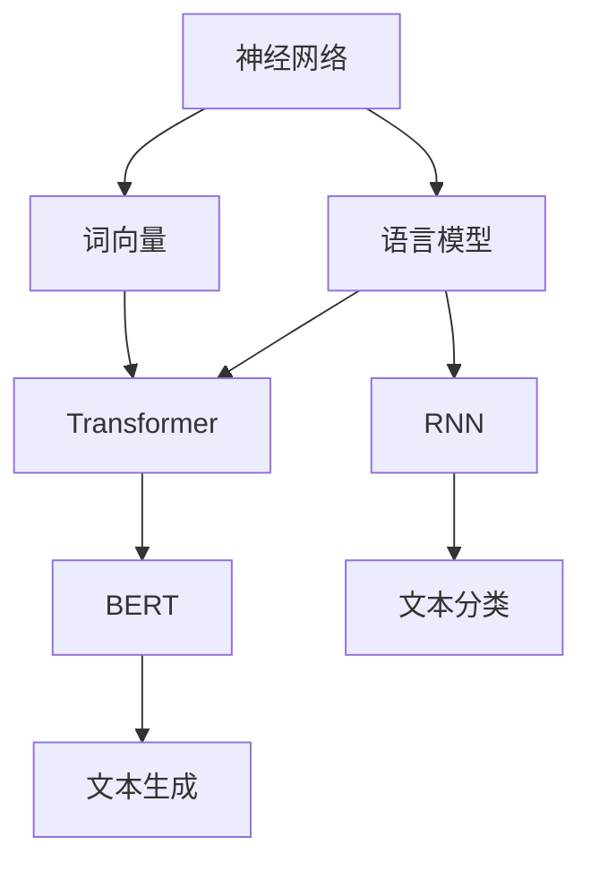

                 

# 神经网络在自然语言处理中的应用

> 关键词：神经网络,自然语言处理,深度学习,语言模型,词向量,Transformer,BERT,循环神经网络,RNN

## 1. 背景介绍

### 1.1 问题由来

自然语言处理(Natural Language Processing, NLP)是人工智能(AI)领域的重要分支之一，旨在让计算机理解和处理人类语言。传统的NLP方法多依赖于规则、特征工程和手工设计的语法模型，难以适应语言的复杂性和多样性。近年来，随着深度学习技术的发展，基于神经网络的NLP方法逐渐成为主流，极大地推动了NLP技术的发展和应用。

在深度学习时代，神经网络被广泛应用于文本分类、信息检索、机器翻译、对话系统、情感分析、文本生成等NLP任务中。其中，基于神经网络的语言模型和词向量技术尤为引人注目。本文将详细探讨神经网络在NLP中的应用，并分析其原理与实践。

## 2. 核心概念与联系

### 2.1 核心概念概述

为了深入理解神经网络在NLP中的应用，我们先介绍一些核心概念：

- 神经网络：一种通过层级结构对输入数据进行映射的计算模型，由大量的人工神经元相互连接组成。
- 自然语言处理：利用计算技术对文本、语音等自然语言进行理解、分析、生成等处理。
- 语言模型：通过统计语言学方法建立的语言规则和概率模型，用于评估给定序列的概率。
- 词向量：将自然语言中的词语映射到高维向量空间中的方法，用于刻画词语的语义和句法关系。
- Transformer：一种基于自注意力机制的神经网络结构，解决了传统RNN模型在长序列上的梯度消失问题，广泛应用于NLP任务中。
- BERT：基于Transformer的语言模型，通过大规模预训练在多项NLP任务上取得卓越表现。
- 循环神经网络(RNN)：一种特殊的神经网络结构，适用于处理序列数据，可用于自然语言处理中的文本生成和分类任务。

这些概念之间的联系可以通过以下Mermaid流程图展示：



这个流程图展示了神经网络在NLP中的主要应用路径：

1. 神经网络通过训练生成语言模型。
2. 语言模型经过预训练后生成词向量。
3. 词向量通过Transformer进一步增强语言理解能力。
4. 基于Transformer的BERT模型在多项NLP任务上取得显著效果。
5. RNN网络用于处理序列数据，例如文本生成和分类。

## 3. 核心算法原理 & 具体操作步骤
### 3.1 算法原理概述

神经网络在NLP中的应用，主要集中在语言模型、词向量生成和序列建模三个方面。

- 语言模型：通过统计语言学方法，建立文本序列的概率模型，用于预测下一个词语或文本片段。
- 词向量生成：将词语映射到高维向量空间，利用神经网络训练生成高质量的词向量，用于语义相似度计算、情感分析等任务。
- 序列建模：通过RNN或Transformer网络，对文本序列进行建模，用于文本分类、情感分析、机器翻译等任务。

这些应用的核心算法原理都是通过神经网络的学习和优化过程，利用大量的标注数据对模型进行训练，使其能够自动学习并提取文本数据的特征表示，从而实现对语言的理解和生成。

### 3.2 算法步骤详解

下面，我们以语言模型和词向量生成为例，详细讲解神经网络在NLP中的具体操作步骤：

#### 3.2.1 语言模型

**步骤1: 数据预处理**
- 收集并清洗大规模文本数据，如新闻、书籍、文章等。
- 对文本进行分词、去停用词、词形还原等预处理，得到可输入的特征序列。
- 对特征序列进行编码，得到神经网络的输入数据。

**步骤2: 模型训练**
- 设计并训练语言模型，如RNN、LSTM、GRU等，用于对文本序列进行建模。
- 使用训练数据集对模型进行迭代训练，更新权重参数，最小化预测误差。

**步骤3: 模型评估**
- 使用验证集对训练好的模型进行评估，计算准确率、精确率、召回率等指标。
- 调整模型超参数，如学习率、隐藏层大小等，以提高模型性能。

**步骤4: 模型应用**
- 将训练好的模型应用于新的文本数据，计算给定文本序列的概率分布，预测下一个词语或文本片段。

#### 3.2.2 词向量生成

**步骤1: 数据预处理**
- 收集并清洗大规模语料库，如维基百科、新闻网站等。
- 对文本进行分词、去停用词、词形还原等预处理，得到词汇表。
- 对词汇表进行向量化，生成稀疏矩阵。

**步骤2: 模型训练**
- 设计并训练词向量生成模型，如CBOW、Skip-gram等，用于生成高质量的词向量。
- 使用训练数据集对模型进行迭代训练，更新词向量参数，最小化预测误差。

**步骤3: 模型评估**
- 使用验证集对训练好的模型进行评估，计算词向量的质量指标，如词向量相似度、词向量相关性等。
- 调整模型超参数，如学习率、窗口大小等，以提高词向量质量。

**步骤4: 模型应用**
- 将训练好的模型应用于新的文本数据，计算文本中每个词语的词向量表示。
- 利用词向量进行语义相似度计算、情感分析等任务。

### 3.3 算法优缺点

神经网络在NLP中的应用具有以下优点：
1. 强大的非线性建模能力。神经网络可以学习复杂的非线性关系，适应语言的复杂多样性。
2. 自动特征提取。神经网络能够从大量数据中自动提取特征表示，无需手工设计特征。
3. 端到端训练。神经网络通过端到端的训练过程，直接从数据到输出，减少了中间步骤的复杂性。

但同时，神经网络在NLP中也有一些缺点：
1. 数据需求量大。神经网络需要大量标注数据进行训练，数据获取成本高。
2. 计算资源消耗高。神经网络模型参数量大，计算复杂度较高，对计算资源要求较高。
3. 模型复杂度高。神经网络结构复杂，模型调试和优化难度大。
4. 模型可解释性差。神经网络通常是"黑盒"模型，难以解释模型的内部工作机制。

### 3.4 算法应用领域

神经网络在NLP中的应用已经广泛应用于以下几个领域：

- 文本分类：如情感分析、主题分类、垃圾邮件过滤等。
- 信息检索：如搜索查询、问答系统等。
- 机器翻译：如中英文翻译、跨语言翻译等。
- 文本生成：如自动摘要、自动作文、对话生成等。
- 语音识别：如语音转文本、语音命令识别等。
- 自然语言理解：如命名实体识别、关系抽取、语义分析等。

## 4. 数学模型和公式 & 详细讲解  
### 4.1 数学模型构建

为了更加严格地描述神经网络在NLP中的应用，我们使用数学语言对其中的关键模型进行详细讲解。

以语言模型为例，我们假设输入文本为 $x=\{x_1, x_2, ..., x_n\}$，输出为 $y=\{y_1, y_2, ..., y_n\}$。语言模型的目标是最小化损失函数 $L(x,y)$，使用交叉熵损失函数：

$$
L(x,y) = -\frac{1}{n} \sum_{i=1}^n \log p(y_i|x)
$$

其中 $p(y_i|x)$ 为模型在给定输入 $x$ 条件下输出 $y_i$ 的概率。

在训练过程中，我们使用反向传播算法对模型参数进行优化，更新权重 $w$ 和偏置 $b$。具体的优化过程如下：

1. 前向传播：将输入 $x$ 通过神经网络得到输出 $y$。
2. 计算损失函数 $L(x,y)$。
3. 反向传播：计算损失函数对模型参数的梯度 $\nabla L$。
4. 更新模型参数 $w$ 和 $b$：
   $$
   w \leftarrow w - \eta \nabla L
   $$

其中 $\eta$ 为学习率。

### 4.2 公式推导过程

以下我们以语言模型为例，推导交叉熵损失函数的梯度。

假设神经网络由 $n$ 层组成，每一层的输出为 $z_i$，输入为 $z_{i-1}$。则前向传播的计算过程为：

$$
z_1 = wx_1 + b
$$
$$
z_2 = w_2z_1 + b_2
$$
$$
...
$$
$$
z_n = w_nz_{n-1} + b_n
$$

假设最终输出为 $y$，则有：

$$
y = \sigma(z_n)
$$

其中 $\sigma$ 为激活函数，如sigmoid函数。

假设模型在给定输入 $x$ 条件下，输出 $y_i$ 的概率为 $p(y_i|x)$，则交叉熵损失函数为：

$$
L(x,y) = -\frac{1}{n} \sum_{i=1}^n \log p(y_i|x)
$$

对损失函数求偏导，得到：

$$
\frac{\partial L}{\partial z_n} = -\frac{1}{n} \sum_{i=1}^n \frac{1}{p(y_i|x)} \frac{\partial p(y_i|x)}{\partial z_n}
$$

进一步，根据链式法则，有：

$$
\frac{\partial L}{\partial w_n} = \frac{\partial L}{\partial z_n} \frac{\partial z_n}{\partial w_n}
$$

$$
\frac{\partial L}{\partial b_n} = \frac{\partial L}{\partial z_n} \frac{\partial z_n}{\partial b_n}
$$

将上式带入反向传播算法，即可更新模型参数 $w_n$ 和 $b_n$。

### 4.3 案例分析与讲解

以BERT模型为例，BERT模型是一种基于Transformer的语言模型，通过大规模预训练和微调，在多项NLP任务上取得优异表现。BERT模型的架构如下：

1. 输入层：将文本序列转换为词向量。
2. Transformer编码器：使用多个自注意力层对词向量进行编码。
3. 输出层：使用全连接层将编码器输出转换为输出向量。

BERT模型的训练过程分为两个阶段：预训练和微调。

- 预训练阶段：使用大规模无标签文本数据对模型进行预训练，学习语言的通用表示。
- 微调阶段：使用下游任务的少量标注数据，对模型进行有监督的微调，获得特定任务的优化参数。

在预训练阶段，BERT模型通过掩码语言模型和下一句预测两个任务进行训练，具体公式如下：

$$
L_{MLM} = -\frac{1}{2N} \sum_{i=1}^N \sum_{j=1}^{2n} \log p(\hat{y_j}|x_i)
$$

$$
L_{NSP} = -\frac{1}{2N} \sum_{i=1}^N \sum_{j=1}^{2n-1} \log p(y_{2j}|y_{2j-1})
$$

其中 $\hat{y_j}$ 为掩码后的词向量，$p(\hat{y_j}|x_i)$ 为模型在给定输入 $x_i$ 条件下，预测 $\hat{y_j}$ 的概率。

在微调阶段，根据具体任务设计不同的输出层和损失函数。以文本分类为例，输出层为softmax层，损失函数为交叉熵损失函数：

$$
L_{classification} = -\frac{1}{N} \sum_{i=1}^N \log p(y_i|x_i)
$$

其中 $p(y_i|x_i)$ 为模型在给定输入 $x_i$ 条件下，预测 $y_i$ 的概率。

## 5. 项目实践：代码实例和详细解释说明
### 5.1 开发环境搭建

在进行神经网络在NLP中的应用实践前，我们需要准备好开发环境。以下是使用Python进行TensorFlow和Keras开发的Python环境配置流程：

1. 安装Anaconda：从官网下载并安装Anaconda，用于创建独立的Python环境。

2. 创建并激活虚拟环境：
```bash
conda create -n pytorch-env python=3.8 
conda activate pytorch-env
```

3. 安装TensorFlow：根据CUDA版本，从官网获取对应的安装命令。例如：
```bash
conda install tensorflow=2.6
```

4. 安装Keras：
```bash
pip install keras
```

5. 安装各类工具包：
```bash
pip install numpy pandas scikit-learn matplotlib tqdm jupyter notebook ipython
```

完成上述步骤后，即可在`pytorch-env`环境中开始神经网络在NLP中的应用实践。

### 5.2 源代码详细实现

这里我们以使用Keras构建简单的语言模型为例，详细讲解神经网络在NLP中的应用。

首先，导入必要的库和模块：

```python
import numpy as np
from keras.models import Sequential
from keras.layers import Dense, Embedding, LSTM
from keras.datasets import imdb
from keras.preprocessing import sequence

# 导入IMDB数据集
(X_train, y_train), (X_test, y_test) = imdb.load_data(num_words=10000)
```

然后，对数据进行预处理：

```python
# 将文本转换为整数序列
X_train = sequence.pad_sequences(X_train, maxlen=200)
X_test = sequence.pad_sequences(X_test, maxlen=200)
```

接着，定义模型：

```python
# 定义语言模型
model = Sequential()
model.add(Embedding(10000, 128, input_length=200))
model.add(LSTM(128))
model.add(Dense(1, activation='sigmoid'))
```

最后，训练和评估模型：

```python
# 编译模型
model.compile(optimizer='adam', loss='binary_crossentropy', metrics=['accuracy'])

# 训练模型
model.fit(X_train, y_train, epochs=5, batch_size=128, validation_data=(X_test, y_test))

# 评估模型
score, acc = model.evaluate(X_test, y_test, batch_size=128)
print('Test accuracy:', acc)
```

以上就是使用Keras构建简单的语言模型的完整代码实现。可以看到，Keras提供了便捷的API，使得神经网络在NLP中的应用变得非常容易。

### 5.3 代码解读与分析

让我们再详细解读一下关键代码的实现细节：

**输入层**：
- 使用Embedding层将文本转换为整数序列，并进行填充。
- 词汇表的大小为10000，表示前10000个最常见的词汇。
- 每个词汇的向量维度为128。

**编码层**：
- 使用LSTM层对整数序列进行编码，捕捉序列中的长期依赖关系。
- LSTM层的大小为128，表示模型的记忆能力。

**输出层**：
- 使用全连接层将编码器的输出转换为二分类预测结果，输出维度为1，激活函数为sigmoid。

**编译和训练**：
- 使用adam优化器和交叉熵损失函数编译模型。
- 对模型进行5轮训练，每轮训练128个样本。
- 使用测试集对模型进行评估，输出准确率。

可以看到，Keras大大简化了神经网络在NLP中的应用过程，使得开发者可以专注于模型设计、数据处理和性能调优，而不必过多关注底层实现。

## 6. 实际应用场景
### 6.1 智能客服系统

神经网络在NLP中的应用，最典型的场景之一是智能客服系统。传统客服系统需要配备大量人力，且响应速度较慢。智能客服系统通过神经网络进行文本理解和对话生成，能够24小时不间断服务，快速响应客户咨询，提供自然流畅的对话体验。

在技术实现上，可以收集企业的历史客服对话记录，构建监督数据集，训练神经网络模型。模型在客户输入的问题中，识别出用户意图，匹配最佳答复，生成对话回复。对于新的问题，系统可以实时搜索相关内容，动态组织生成回答，实现智能客服的落地应用。

### 6.2 金融舆情监测

神经网络在NLP中的应用，还可以用于金融舆情监测。金融机构需要实时监测市场舆论动向，及时应对负面信息传播，规避金融风险。

具体而言，可以收集金融领域相关的新闻、报道、评论等文本数据，并进行情感分析。使用神经网络模型对金融文本进行情感分类，判断情感倾向是正面、中性还是负面。将模型应用到实时抓取的网络文本数据，自动监测不同主题下的情感变化趋势，一旦发现负面信息激增等异常情况，系统便会自动预警，帮助金融机构快速应对潜在风险。

### 6.3 个性化推荐系统

神经网络在NLP中的应用，可以进一步拓展到个性化推荐系统。当前的推荐系统往往只依赖用户的历史行为数据进行物品推荐，难以深入理解用户的真实兴趣偏好。

使用神经网络模型，可以处理用户的浏览、点击、评论、分享等行为数据，提取和用户交互的物品标题、描述、标签等文本内容。将文本内容作为模型输入，用户的后续行为（如是否点击、购买等）作为监督信号，训练神经网络模型。模型能够从文本内容中准确把握用户的兴趣点。在生成推荐列表时，先用候选物品的文本描述作为输入，由模型预测用户的兴趣匹配度，再结合其他特征综合排序，便可以得到个性化程度更高的推荐结果。

### 6.4 未来应用展望

随着神经网络在NLP中的应用不断深入，未来将会在更多领域得到应用，为传统行业带来变革性影响：

- 智慧医疗：神经网络可以用于医疗问答、病历分析、药物研发等，提升医疗服务的智能化水平，辅助医生诊疗，加速新药开发进程。
- 智能教育：神经网络可以用于作业批改、学情分析、知识推荐等方面，因材施教，促进教育公平，提高教学质量。
- 智慧城市：神经网络可以用于城市事件监测、舆情分析、应急指挥等环节，提高城市管理的自动化和智能化水平，构建更安全、高效的未来城市。

此外，在企业生产、社会治理、文娱传媒等众多领域，神经网络的应用也将不断涌现，为NLP技术带来新的突破。

## 7. 工具和资源推荐
### 7.1 学习资源推荐

为了帮助开发者系统掌握神经网络在NLP中的应用，这里推荐一些优质的学习资源：

1. 《Deep Learning》书籍：Ian Goodfellow等作者，全面介绍了深度学习的基本概念和算法。
2. 《Neural Network and Deep Learning》书籍：Michael Nielsen，详细讲解了神经网络的原理和实现。
3. CS231n《卷积神经网络》课程：斯坦福大学开设的计算机视觉课程，涵盖神经网络的基础和高级应用。
4. CS224n《序列建模》课程：斯坦福大学开设的自然语言处理课程，涵盖神经网络在NLP中的应用。
5. Udacity深度学习课程：涵盖深度学习的基本概念、算法和应用，适合初学者入门。

通过对这些资源的学习实践，相信你一定能够快速掌握神经网络在NLP中的应用精髓，并用于解决实际的NLP问题。

### 7.2 开发工具推荐

高效的开发离不开优秀的工具支持。以下是几款用于神经网络在NLP中应用的常用工具：

1. TensorFlow：由Google主导开发的深度学习框架，生产部署方便，适合大规模工程应用。
2. PyTorch：基于Python的开源深度学习框架，灵活动态的计算图，适合快速迭代研究。
3. Keras：高级深度学习API，提供便捷的API接口，简化模型设计和训练过程。
4. Weights & Biases：模型训练的实验跟踪工具，可以记录和可视化模型训练过程中的各项指标，方便对比和调优。
5. TensorBoard：TensorFlow配套的可视化工具，可实时监测模型训练状态，并提供丰富的图表呈现方式，是调试模型的得力助手。
6. Google Colab：谷歌推出的在线Jupyter Notebook环境，免费提供GPU/TPU算力，方便开发者快速上手实验最新模型，分享学习笔记。

合理利用这些工具，可以显著提升神经网络在NLP中的应用开发效率，加快创新迭代的步伐。

### 7.3 相关论文推荐

神经网络在NLP中的应用源于学界的持续研究。以下是几篇奠基性的相关论文，推荐阅读：

1. Backpropagation and the Error Backpropagation Algorithm：Rumelhart等，首次提出反向传播算法，为神经网络的训练提供了重要理论基础。
2. Connectionist Temporal Classification：Hinton等，提出CTC算法，用于序列数据的预测。
3. Recurrent Neural Network for Sequence Prediction：Hochreiter等，提出RNN模型，用于处理序列数据。
4. Sequence to Sequence Learning with Neural Networks：Cho等，提出Seq2Seq模型，用于机器翻译和对话生成。
5. Attention is All You Need：Vaswani等，提出Transformer模型，解决RNN模型在长序列上的梯度消失问题。
6. Language Models are Unsupervised Multitask Learners：Devlin等，提出BERT模型，通过大规模预训练在多项NLP任务上取得卓越表现。

这些论文代表了大语言模型在NLP领域的发展脉络。通过学习这些前沿成果，可以帮助研究者把握学科前进方向，激发更多的创新灵感。

## 8. 总结：未来发展趋势与挑战

### 8.1 总结

本文对神经网络在NLP中的应用进行了全面系统的介绍。首先阐述了神经网络在NLP中的应用背景和意义，明确了神经网络在语言模型、词向量生成和序列建模三个方面的应用价值。其次，从原理到实践，详细讲解了神经网络在NLP中的具体操作步骤，给出了微调语言模型和生成词向量的代码实现。同时，本文还广泛探讨了神经网络在智能客服、金融舆情、个性化推荐等多个领域的应用前景，展示了神经网络在NLP中的强大应用能力。此外，本文精选了神经网络在NLP中的各类学习资源，力求为读者提供全方位的技术指引。

通过本文的系统梳理，可以看到，神经网络在NLP中的应用已经成为当前AI领域的重要范式，极大地拓展了预训练语言模型的应用边界，催生了更多的落地场景。得益于大规模语料的预训练，神经网络在NLP任务上取得了显著的性能提升，推动了NLP技术的产业化进程。未来，伴随神经网络在NLP中的持续演进，相信NLP技术将在更广阔的应用领域大放异彩，深刻影响人类的生产生活方式。

### 8.2 未来发展趋势

展望未来，神经网络在NLP中的应用将呈现以下几个发展趋势：

1. 模型规模持续增大。随着算力成本的下降和数据规模的扩张，神经网络模型的参数量还将持续增长。超大规模神经网络模型蕴含的丰富语言知识，有望支撑更加复杂多变的NLP任务。
2. 端到端训练成为常态。随着模型复杂度的增加，神经网络模型的训练和优化将更加困难，端到端训练成为必不可少的训练方式。
3. 自监督学习范式兴起。自监督学习范式可以利用大规模无标签数据进行模型训练，减少对标注数据的需求，增强模型的泛化能力。
4. 参数高效训练方法普及。参数高效训练方法，如Transformer、AdaLoRA等，可以显著减少模型训练的计算资源消耗，提高训练效率。
5. 多模态学习融合。神经网络可以融合视觉、语音等多模态信息，提升模型对现实世界的理解能力，推动跨模态NLP技术的发展。

这些趋势凸显了神经网络在NLP中的广阔前景。这些方向的探索发展，必将进一步提升神经网络在NLP系统中的性能和应用范围，为人类认知智能的进化带来深远影响。

### 8.3 面临的挑战

尽管神经网络在NLP中的应用已经取得了瞩目成就，但在迈向更加智能化、普适化应用的过程中，仍面临诸多挑战：

1. 数据需求量大。神经网络模型需要大量标注数据进行训练，数据获取成本高。
2. 计算资源消耗高。神经网络模型参数量大，计算复杂度较高，对计算资源要求较高。
3. 模型复杂度高。神经网络模型结构复杂，模型调试和优化难度大。
4. 模型可解释性差。神经网络通常是"黑盒"模型，难以解释模型的内部工作机制。
5. 数据隐私和安全问题。神经网络模型可能泄露用户隐私，面临数据安全和隐私保护等风险。

正视这些挑战，积极应对并寻求突破，将是大语言模型在NLP中迈向成熟的必由之路。相信随着学界和产业界的共同努力，这些挑战终将一一被克服，神经网络在NLP中必将在构建人机协同的智能时代中扮演越来越重要的角色。

### 8.4 研究展望

面对神经网络在NLP中面临的种种挑战，未来的研究需要在以下几个方面寻求新的突破：

1. 探索无监督和半监督神经网络模型。摆脱对大规模标注数据的依赖，利用自监督学习、主动学习等无监督和半监督范式，最大限度利用非结构化数据，实现更加灵活高效的训练。
2. 研究参数高效和计算高效的神经网络模型。开发更加参数高效的神经网络模型，在固定大部分预训练参数的同时，只更新极少量的任务相关参数。同时优化神经网络计算图，减少前向传播和反向传播的资源消耗，实现更加轻量级、实时性的部署。
3. 引入因果和对比学习范式。通过引入因果推断和对比学习思想，增强神经网络模型建立稳定因果关系的能力，学习更加普适、鲁棒的语言表征，从而提升模型泛化性和抗干扰能力。
4. 融合更多先验知识。将符号化的先验知识，如知识图谱、逻辑规则等，与神经网络模型进行巧妙融合，引导神经网络模型学习更准确、合理的语言模型。同时加强不同模态数据的整合，实现视觉、语音等多模态信息与文本信息的协同建模。
5. 纳入伦理道德约束。在神经网络模型的训练目标中引入伦理导向的评估指标，过滤和惩罚有偏见、有害的输出倾向。同时加强人工干预和审核，建立模型行为的监管机制，确保输出符合人类价值观和伦理道德。

这些研究方向的探索，必将引领神经网络在NLP中走向更高的台阶，为构建安全、可靠、可解释、可控的智能系统铺平道路。面向未来，神经网络在NLP中的应用还需要与其他人工智能技术进行更深入的融合，如知识表示、因果推理、强化学习等，多路径协同发力，共同推动自然语言理解和智能交互系统的进步。只有勇于创新、敢于突破，才能不断拓展神经网络在NLP的边界，让智能技术更好地造福人类社会。

## 9. 附录：常见问题与解答

**Q1：神经网络在NLP中应用的难点是什么？**

A: 神经网络在NLP中应用的难点主要集中在以下几个方面：
1. 数据获取和标注成本高：神经网络模型需要大量标注数据进行训练，标注成本较高。
2. 计算资源消耗大：神经网络模型参数量大，计算复杂度较高，对计算资源要求较高。
3. 模型复杂度高：神经网络模型结构复杂，模型调试和优化难度大。
4. 模型可解释性差：神经网络通常是"黑盒"模型，难以解释模型的内部工作机制。
5. 数据隐私和安全问题：神经网络模型可能泄露用户隐私，面临数据安全和隐私保护等风险。

解决这些难点，需要借助技术手段和行业实践，逐步优化神经网络在NLP中的应用。

**Q2：如何选择合适的神经网络模型？**

A: 选择合适的神经网络模型需要考虑以下几个因素：
1. 任务类型：不同类型的NLP任务需要不同的模型架构，如文本分类、机器翻译等。
2. 数据规模：数据规模决定了模型的复杂度和参数量，需要根据数据规模选择合适的模型。
3. 计算资源：计算资源决定了模型训练和推理的效率，需要根据计算资源选择适合的模型。
4. 性能要求：模型的性能指标如精度、召回率、F1值等，需要根据具体应用场景选择适合的模型。
5. 可解释性需求：部分应用场景要求模型具有较高的可解释性，需要考虑选择具有可解释性的模型。

在实际应用中，需要根据具体任务和数据特点进行选择，并在模型训练和优化过程中不断调整超参数，以获得最佳性能。

**Q3：如何提高神经网络在NLP中的应用效率？**

A: 提高神经网络在NLP中的应用效率需要从以下几个方面进行优化：
1. 模型压缩：通过剪枝、量化等技术，减小模型的参数量和计算复杂度，提高推理速度。
2. 模型并行：通过分布式训练和推理，减少单节点计算资源消耗，提高训练和推理效率。
3. 模型加速：通过GPU/TPU等硬件加速，提高计算速度，减少训练时间。
4. 数据增强：通过数据增强技术，增加训练集的多样性，提高模型泛化能力。
5. 参数高效训练：通过参数高效训练方法，减少模型训练的计算资源消耗，提高训练效率。
6. 端到端训练：通过端到端训练方式，减少中间步骤的复杂性，提高训练效率。

通过以上优化手段，可以有效提升神经网络在NLP中的应用效率，加快模型训练和推理速度。

**Q4：神经网络在NLP中的应用存在哪些风险？**

A: 神经网络在NLP中的应用存在以下风险：
1. 数据偏见：神经网络模型可能学习到数据中的偏见和歧视，输出结果存在偏见。
2. 模型泛化不足：神经网络模型在数据分布变化较大时，泛化能力不足，容易出现过拟合现象。
3. 计算资源消耗大：神经网络模型参数量大，计算复杂度较高，对计算资源要求较高，可能带来高成本。
4. 模型可解释性差：神经网络通常是"黑盒"模型，难以解释模型的内部工作机制，可能带来不可控的风险。
5. 数据安全和隐私问题：神经网络模型可能泄露用户隐私，带来数据安全和隐私保护的风险。

为应对这些风险，需要在模型训练和应用过程中加强数据预处理和模型监控，保护数据安全和隐私，提高模型可解释性和鲁棒性。

**Q5：神经网络在NLP中的应用前景如何？**

A: 神经网络在NLP中的应用前景非常广阔，主要体现在以下几个方面：
1. 智能客服：神经网络可以用于构建智能客服系统，提供24小时不间断服务，快速响应客户咨询。
2. 金融舆情监测：神经网络可以用于金融舆情监测，及时发现和应对负面信息传播，规避金融风险。
3. 个性化推荐：神经网络可以用于个性化推荐系统，根据用户兴趣生成个性化推荐内容。
4. 医疗问答：神经网络可以用于医疗问答系统，提供实时健康咨询和诊断。
5. 智能教育：神经网络可以用于智能教育系统，因材施教，提高教学质量。
6. 智慧城市：神经网络可以用于智慧城市治理，提高城市管理的自动化和智能化水平。

通过神经网络在NLP中的应用，可以为传统行业带来变革性影响，推动人工智能技术的产业化进程。

---

作者：禅与计算机程序设计艺术 / Zen and the Art of Computer Programming

