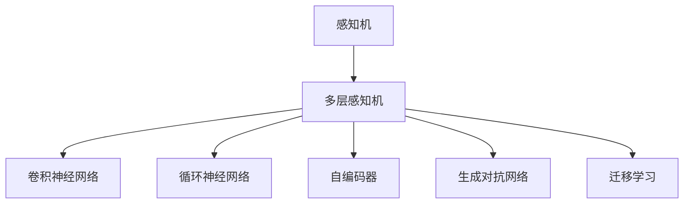

                 

# 神经网络：探索未知的领域

神经网络，这一术语听起来既神秘又熟悉，它既是人工智能（AI）领域的基石，也是前沿研究的前沿。本文将深入探讨神经网络的奥秘，从基础概念到最新进展，全面揭示其背后的原理与实践，并展望其未来的发展趋势与挑战。

## 1. 背景介绍

### 1.1 问题的由来

神经网络（Neural Network）的概念首次由罗森布拉特（Rosenblatt）在1958年提出，并由辛顿（Hinton）、罗森布拉特等人在20世纪80年代推动其发展，逐步成为机器学习领域的核心技术。神经网络模拟人脑神经元的工作原理，通过层层网络结构实现数据的复杂映射与变换。在深度学习（Deep Learning）大行其道的今天，神经网络的应用已经深入到图像识别、语音处理、自然语言处理（NLP）等诸多领域，取得了显著的成果。

### 1.2 问题的核心关键点

神经网络的核心关键点包括：
- **结构与层级**：由输入层、隐藏层和输出层组成的多层结构，通过前向传播和反向传播实现信息传递与参数优化。
- **激活函数**：非线性变换函数，赋予神经网络非线性表达能力。
- **损失函数**：衡量模型预测与真实标签差异的函数，用于优化模型参数。
- **优化算法**：如梯度下降（GD）、随机梯度下降（SGD）、Adam等，用于最小化损失函数。
- **正则化**：防止过拟合的技术，如L2正则、Dropout等。
- **模型训练与评估**：通过训练数据集训练模型，在验证集上评估性能，避免过拟合。

这些关键点共同构成神经网络的核心，使其能够在复杂数据上实现高效、精确的映射。

## 2. 核心概念与联系

### 2.1 核心概念概述

为了更好地理解神经网络，本节将介绍几个核心概念及其相互联系：

- **感知机（Perceptron）**：最早的神经网络模型，由单一神经元组成，用于二分类任务。
- **多层感知机（Multilayer Perceptron, MLP）**：多层神经元的组合，用于复杂分类任务。
- **卷积神经网络（Convolutional Neural Network, CNN）**：专门处理图像数据的神经网络，通过卷积操作提取特征。
- **循环神经网络（Recurrent Neural Network, RNN）**：处理序列数据，如时间序列、自然语言等，通过循环结构保持序列信息。
- **自编码器（Autoencoder）**：用于特征压缩和重构的神经网络，常用于数据降维和生成对抗网络（GAN）中。
- **生成对抗网络（GAN）**：由生成器和判别器组成的网络，用于生成逼真数据。
- **迁移学习（Transfer Learning）**：利用预训练模型在新任务上的微调，提升模型性能。

这些核心概念之间的关系可以通过以下Mermaid流程图来展示：



这个流程图展示了神经网络的不同类型及其应用场景，体现了神经网络从单一神经元到复杂网络结构的演变。

## 3. 核心算法原理 & 具体操作步骤

### 3.1 算法原理概述

神经网络通过反向传播算法（Backpropagation）实现参数优化。其基本流程包括前向传播（Forward Propagation）和反向传播（Backward Propagation）两个阶段：

- **前向传播**：将输入数据传递通过网络，计算每层输出。
- **反向传播**：根据输出误差，通过链式法则反向计算每层梯度，更新网络参数。

在优化方面，常用的优化算法包括随机梯度下降（SGD）、Adam等，通过不断迭代更新模型参数，最小化损失函数，提升模型性能。

### 3.2 算法步骤详解

神经网络的训练步骤包括数据准备、模型初始化、前向传播、损失计算、反向传播、参数更新等：

1. **数据准备**：收集标注数据集，划分训练集、验证集和测试集。
2. **模型初始化**：选择模型结构，初始化模型参数。
3. **前向传播**：将输入数据通过网络，计算输出。
4. **损失计算**：计算模型输出与真实标签之间的差异。
5. **反向传播**：根据损失计算每层梯度。
6. **参数更新**：使用优化算法更新模型参数。
7. **验证集评估**：在验证集上评估模型性能，避免过拟合。

### 3.3 算法优缺点

神经网络具有以下优点：
- **表达能力强**：多层的非线性组合能够处理复杂映射。
- **自适应性强**：通过反向传播算法，网络能够自动调整参数，适应不同任务。
- **泛化能力强**：通过迁移学习等方法，神经网络能够在多个领域中取得优异性能。

同时，神经网络也存在以下缺点：
- **训练时间长**：大数据集和高复杂度的模型训练时间较长。
- **参数量大**：需要大量的计算资源和存储空间。
- **易受噪声影响**：对抗样本和噪声数据可能影响模型稳定性和鲁棒性。

### 3.4 算法应用领域

神经网络在多个领域中得到广泛应用，包括但不限于：

- **计算机视觉**：用于图像识别、分类、检测等任务。
- **自然语言处理**：用于语言模型训练、机器翻译、文本生成等。
- **语音处理**：用于语音识别、语音合成、情感分析等。
- **推荐系统**：用于用户行为预测和个性化推荐。
- **医疗健康**：用于医学图像分析、疾病预测等。
- **金融风控**：用于信用评分、风险评估等。

神经网络在各个领域的成功应用，证明了其强大的表现能力和广泛的应用前景。

## 4. 数学模型和公式 & 详细讲解 & 举例说明

### 4.1 数学模型构建

神经网络的数学模型可以表示为：
$$
f(x) = \sum_{i=1}^m w_ix_i + b
$$
其中 $x$ 为输入向量，$w$ 为权重向量，$b$ 为偏置项，$m$ 为神经元数量。

神经网络的激活函数通常为：
$$
\sigma(z) = \frac{1}{1+\exp(-z)}
$$
其中 $z$ 为加权和。

损失函数常用的有交叉熵损失（Cross-Entropy Loss）：
$$
L = -\frac{1}{N} \sum_{i=1}^N \sum_{j=1}^C y_{ij}\log(p_{ij})
$$
其中 $N$ 为样本数量，$C$ 为类别数量，$y_{ij}$ 为真实标签，$p_{ij}$ 为模型预测概率。

### 4.2 公式推导过程

以简单的多层感知机为例，其前向传播和反向传播的公式分别为：
$$
y^{[l]} = \sigma(z^{[l]})
$$
$$
z^{[l+1]} = W^{[l+1]} y^{[l]} + b^{[l+1]}
$$
其中 $y^{[l]}$ 为第 $l$ 层输出，$z^{[l]}$ 为第 $l$ 层输入，$W^{[l+1]}$ 和 $b^{[l+1]}$ 为第 $l+1$ 层的权重和偏置。

### 4.3 案例分析与讲解

以手写数字识别为例，神经网络通过多层感知机实现，首先对输入图片进行预处理，得到一维向量输入到网络中，通过多个隐藏层进行特征提取，最终输出数字标签。训练过程中，使用交叉熵损失和随机梯度下降优化模型参数，不断迭代提升模型性能。

## 5. 项目实践：代码实例和详细解释说明

### 5.1 开发环境搭建

在进行神经网络项目开发前，需要准备相应的开发环境。以下是使用Python进行TensorFlow开发的环境配置流程：

1. 安装Anaconda：从官网下载并安装Anaconda，用于创建独立的Python环境。
2. 创建并激活虚拟环境：
```bash
conda create -n tf-env python=3.8 
conda activate tf-env
```
3. 安装TensorFlow：根据CUDA版本，从官网获取对应的安装命令。例如：
```bash
conda install tensorflow tensorflow-cpu -c conda-forge -c defaults
```
4. 安装相关工具包：
```bash
pip install numpy pandas scikit-learn matplotlib tensorflow
```
5. 设置GPU加速：使用`CUDA_VISIBLE_DEVICES`环境变量指定使用哪些GPU设备，如：
```bash
export CUDA_VISIBLE_DEVICES=0,1
```

完成上述步骤后，即可在`tf-env`环境中进行TensorFlow的开发和调试。

### 5.2 源代码详细实现

以下是使用TensorFlow实现手写数字识别的完整代码实现：

```python
import tensorflow as tf
from tensorflow.keras.datasets import mnist
from tensorflow.keras.models import Sequential
from tensorflow.keras.layers import Dense, Flatten
from tensorflow.keras.utils import to_categorical

# 加载MNIST数据集
(x_train, y_train), (x_test, y_test) = mnist.load_data()

# 数据预处理
x_train = x_train.reshape(-1, 28*28).astype('float32') / 255.0
x_test = x_test.reshape(-1, 28*28).astype('float32') / 255.0
y_train = to_categorical(y_train, 10)
y_test = to_categorical(y_test, 10)

# 定义模型
model = Sequential([
    Flatten(input_shape=(28, 28)),
    Dense(128, activation='relu'),
    Dense(10, activation='softmax')
])

# 编译模型
model.compile(optimizer='adam', loss='categorical_crossentropy', metrics=['accuracy'])

# 训练模型
model.fit(x_train, y_train, batch_size=128, epochs=10, validation_data=(x_test, y_test))

# 评估模型
model.evaluate(x_test, y_test)
```

这段代码实现了从数据加载、预处理、模型定义、编译、训练到评估的全流程。其中，`Flatten`层用于将二维输入展开成一维向量，`Dense`层用于全连接层，`softmax`激活函数用于多分类任务的输出。

### 5.3 代码解读与分析

让我们再详细解读一下关键代码的实现细节：

**数据加载与预处理**：
- `mnist.load_data()`：从TensorFlow内置数据集加载MNIST手写数字数据。
- `x_train = x_train.reshape(-1, 28*28).astype('float32') / 255.0`：将二维的28x28图像矩阵展开成一维向量，并将像素值归一化到[0, 1]范围内。

**模型定义**：
- `Sequential`：定义一个线性堆叠的神经网络模型。
- `Flatten`：将输入数据展开成一维向量。
- `Dense`：定义两个全连接层，其中第一个层有128个神经元，使用`relu`激活函数，第二个层有10个神经元，使用`softmax`激活函数，输出每个类别的概率分布。

**模型编译与训练**：
- `model.compile(optimizer='adam', loss='categorical_crossentropy', metrics=['accuracy'])`：编译模型，选择Adam优化器和交叉熵损失函数，并记录准确率作为评估指标。
- `model.fit(x_train, y_train, batch_size=128, epochs=10, validation_data=(x_test, y_test))`：训练模型，指定批次大小和迭代轮数，并在验证集上评估模型性能。

**模型评估**：
- `model.evaluate(x_test, y_test)`：在测试集上评估模型性能，返回损失值和准确率。

可以看到，TensorFlow提供了简单易用的接口，使得神经网络的开发变得高效快捷。

## 6. 实际应用场景

### 6.1 计算机视觉

神经网络在计算机视觉领域的应用非常广泛，包括图像分类、目标检测、图像分割等。在图像分类任务中，神经网络可以通过卷积层和池化层提取图像特征，并通过全连接层实现分类。在目标检测任务中，神经网络通过RPN（Region Proposal Network）生成候选区域，并使用RoI（Region of Interest）池化层提取特征，最后通过分类和回归层实现目标检测。

### 6.2 自然语言处理

自然语言处理（NLP）是神经网络的重要应用领域，包括语言模型训练、机器翻译、情感分析、问答系统等。在语言模型训练中，神经网络通过循环神经网络（RNN）或长短时记忆网络（LSTM）等模型结构，处理文本序列数据，并学习语言规律。在机器翻译中，神经网络通过编码器-解码器结构，将源语言文本转换为目标语言文本。在情感分析中，神经网络通过多层感知机（MLP）或卷积神经网络（CNN），提取文本情感特征，并进行分类。

### 6.3 医疗健康

神经网络在医疗健康领域也有重要应用，包括医学图像分析、疾病预测等。在医学图像分析中，神经网络通过卷积神经网络（CNN），对X光片、CT、MRI等医学图像进行分类和分割，辅助医生进行疾病诊断。在疾病预测中，神经网络通过时间序列预测模型，对病人的健康数据进行分析和预测，提供个性化的健康建议。

### 6.4 金融风控

神经网络在金融风控领域的应用包括信用评分、风险评估等。在信用评分中，神经网络通过多层感知机（MLP），对用户的财务信息进行分析和评估，预测其信用风险。在风险评估中，神经网络通过时间序列预测模型，对市场数据进行分析，评估金融市场的风险。

## 7. 工具和资源推荐

### 7.1 学习资源推荐

为了帮助开发者系统掌握神经网络的理论基础和实践技巧，这里推荐一些优质的学习资源：

1. 《深度学习》（Deep Learning）：Ian Goodfellow等著，全面介绍了深度学习的基本概念和算法。
2. CS231n《卷积神经网络》课程：斯坦福大学开设的计算机视觉课程，涵盖卷积神经网络的基本原理和应用。
3. CS224n《自然语言处理》课程：斯坦福大学开设的NLP课程，涵盖语言模型、序列建模、机器翻译等主题。
4. 《动手学深度学习》（Dive into Deep Learning）：李沐等著，介绍了深度学习的核心算法和实践。
5. Coursera的《深度学习专项课程》：由斯坦福大学、吴恩达教授主讲的深度学习课程，涵盖多个领域的深度学习实践。

通过对这些资源的学习实践，相信你一定能够快速掌握神经网络的精髓，并用于解决实际的机器学习问题。

### 7.2 开发工具推荐

高效的开发离不开优秀的工具支持。以下是几款用于神经网络开发的常用工具：

1. TensorFlow：由Google主导开发的开源深度学习框架，生产部署方便，适合大规模工程应用。
2. PyTorch：基于Python的开源深度学习框架，灵活性高，适合研究和实验。
3. Keras：高层次的神经网络API，易于使用，适合快速原型开发。
4. Jupyter Notebook：交互式编程环境，支持Python、R等语言，适合数据科学和机器学习实践。
5. Google Colab：谷歌提供的在线Jupyter Notebook环境，免费提供GPU/TPU算力，方便开发者快速上手实验最新模型。

合理利用这些工具，可以显著提升神经网络开发的效率，加快创新迭代的步伐。

### 7.3 相关论文推荐

神经网络的研究一直在不断推进，以下是几篇奠基性的相关论文，推荐阅读：

1. AlexNet：Hinton等人在2012年提出的卷积神经网络，开创了深度学习的新纪元。
2. ResNet：He等人提出的残差网络，解决了深层网络训练中的梯度消失问题，提升了模型深度。
3. LSTM：Hochreiter等人提出的长短时记忆网络，解决了传统RNN的梯度消失问题，提升了序列建模的准确性。
4. Transformer：Vaswani等人提出的自注意力机制，极大提升了机器翻译任务的精度和效率。
5. GAN：Goodfellow等人提出的生成对抗网络，能够生成逼真数据，推动了生成式模型的发展。

这些论文代表了大神经网络的发展脉络。通过学习这些前沿成果，可以帮助研究者把握学科前进方向，激发更多的创新灵感。

## 8. 总结：未来发展趋势与挑战

### 8.1 研究成果总结

本文对神经网络的原理与实践进行了全面系统的介绍，涵盖了从基础概念到最新进展的各个方面。通过系统梳理，读者可以清晰地理解神经网络的工作原理和应用范围，并掌握其开发和优化的关键技巧。

### 8.2 未来发展趋势

展望未来，神经网络的发展趋势如下：

1. **模型规模增大**：随着计算资源的增加，神经网络的规模将持续增大，模型参数量将达到数十亿。
2. **自适应性强**：未来的神经网络将具备更强的自适应能力，能够灵活适应各种场景。
3. **泛化能力强**：通过迁移学习等技术，神经网络能够在不同领域中取得优异性能。
4. **计算效率提升**：通过优化算法和硬件加速，神经网络将实现更高的计算效率。
5. **模型解释性增强**：未来的神经网络将具备更强的可解释性，能够提供清晰的推理过程和决策依据。

### 8.3 面临的挑战

尽管神经网络已经取得了显著的成就，但在迈向更加智能化、普适化应用的过程中，仍面临诸多挑战：

1. **计算资源限制**：大规模神经网络需要庞大的计算资源，如何高效利用资源，降低成本，是重要的研究方向。
2. **数据隐私问题**：神经网络需要大量标注数据进行训练，如何保护数据隐私，防止数据泄露，是亟需解决的问题。
3. **模型鲁棒性不足**：对抗样本和噪声数据可能影响神经网络的稳定性，如何提高模型的鲁棒性，是重要的研究课题。
4. **模型可解释性差**：神经网络的“黑盒”特性限制了其在需要解释和可控性强的领域的应用。如何提高模型的可解释性，增强用户信任，是重要的研究方向。

### 8.4 研究展望

面对神经网络所面临的挑战，未来的研究需要在以下几个方面寻求新的突破：

1. **模型压缩与量化**：通过模型压缩和量化技术，减小模型规模，提高计算效率。
2. **隐私保护技术**：通过差分隐私、联邦学习等技术，保护数据隐私，防止数据泄露。
3. **鲁棒性提升**：通过对抗训练、正则化等技术，提高神经网络的鲁棒性和稳定性。
4. **可解释性增强**：通过可视化、可解释性生成等技术，提高神经网络的解释性和可控性。

这些研究方向将引领神经网络技术走向更加智能化、普适化和可信化，为构建人机协同的智能系统铺平道路。

## 9. 附录：常见问题与解答

**Q1：神经网络中的激活函数有哪些？它们的作用是什么？**

A: 常用的激活函数包括Sigmoid、ReLU、Tanh、Softmax等。
- Sigmoid函数将输入映射到[0, 1]范围内，适用于二分类任务。
- ReLU函数将负数输入置为0，保留正数输入，适用于大多数隐藏层。
- Tanh函数将输入映射到[-1, 1]范围内，适用于多分类任务。
- Softmax函数将输入映射到[0, 1]范围内，且输出总和为1，适用于多分类任务。

**Q2：神经网络中的正则化技术有哪些？它们的作用是什么？**

A: 常用的正则化技术包括L1正则、L2正则、Dropout等。
- L1正则化通过惩罚权重绝对值，抑制过拟合。
- L2正则化通过惩罚权重平方和，抑制过拟合。
- Dropout通过随机丢弃部分神经元，防止过拟合。

**Q3：神经网络中的优化算法有哪些？它们的作用是什么？**

A: 常用的优化算法包括梯度下降（GD）、随机梯度下降（SGD）、Adam等。
- 梯度下降算法通过反向传播计算梯度，更新权重，适用于小型数据集。
- 随机梯度下降算法通过随机采样计算梯度，更新权重，适用于大型数据集。
- Adam算法通过动量更新和梯度衰减，加速收敛，适用于大多数应用场景。

**Q4：神经网络中的损失函数有哪些？它们的作用是什么？**

A: 常用的损失函数包括交叉熵损失、均方误差损失、对数损失等。
- 交叉熵损失用于分类任务，衡量模型预测与真实标签的差异。
- 均方误差损失用于回归任务，衡量模型预测与真实值之间的差异。
- 对数损失用于二分类任务，衡量模型预测概率与真实标签的差异。

**Q5：神经网络中的数据增强技术有哪些？它们的作用是什么？**

A: 常用的数据增强技术包括图像旋转、缩放、裁剪、翻转等。
- 图像旋转、缩放、裁剪、翻转等操作，可以生成更多的训练样本，增强模型泛化能力。

---

作者：禅与计算机程序设计艺术 / Zen and the Art of Computer Programming

