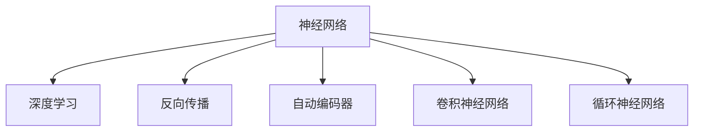

                 

# 神经网络：推动社会进步的力量

> 关键词：神经网络,深度学习,人工智能,计算机视觉,自然语言处理,推荐系统,医疗健康,自动驾驶

## 1. 背景介绍

### 1.1 问题由来

神经网络（Neural Networks）作为一种强有力的机器学习技术，正在逐步改变我们的生活方式。从简单的图像识别到复杂的自动驾驶，从智能推荐系统到精准医疗，神经网络在各个领域展示出了强大的应用潜力。这一技术的诞生和发展，无疑是一场改变世界的革命，其带来的影响之广、之深，足可以称之为推动社会进步的力量。

### 1.2 问题核心关键点

神经网络的成功应用源于其强大的自我学习能力。通过训练，神经网络能够从大量数据中提取并学习到各种复杂模式，从而在预测、分类、生成等任务中表现优异。其核心关键点包括：

1. **深度学习的概念**：神经网络是一种深度学习模型，能够处理复杂的数据结构，自动提取特征。
2. **反向传播算法**：用于训练神经网络的核心算法，通过梯度下降等优化算法来最小化损失函数，提升模型精度。
3. **数据驱动**：神经网络的性能高度依赖于数据的质量和数量，大量标注数据是其训练的基础。
4. **模型调参**：包括学习率、正则化、激活函数等超参数的选择和优化，对模型的最终效果有重要影响。
5. **并行计算**：现代神经网络的训练和推理过程需要大量的计算资源，现代高性能计算技术提供了支撑。

### 1.3 问题研究意义

研究神经网络技术，对于推动科技进步、促进经济社会发展具有重要意义：

1. **提升生产力**：神经网络可以自动化处理大量数据，提升信息处理速度和精度，降低人力成本。
2. **推动智能化**：在各个垂直领域（如医疗、金融、交通等）应用神经网络技术，可以提升服务效率和用户体验。
3. **促进产业升级**：神经网络技术赋能各行各业，为传统行业数字化转型提供新路径。
4. **培育新兴产业**：催生出人工智能、大数据、智能制造等新兴产业，创造新的经济增长点。
5. **提升社会福祉**：在教育、医疗、社会治理等领域应用神经网络，可以改善民生，促进社会公平。

## 2. 核心概念与联系

### 2.1 核心概念概述

为更好地理解神经网络技术及其在社会进步中的作用，本节将介绍几个关键概念：

- **神经网络**：一种由多个层级组成的计算模型，用于学习数据中的复杂关系和规律。
- **深度学习**：基于神经网络的技术，通过多层次的特征提取来处理高维数据。
- **反向传播算法**：一种优化算法，通过计算损失函数的梯度，反向传播更新模型参数。
- **自动编码器**：一种无监督学习的神经网络结构，用于特征提取和降维。
- **卷积神经网络**：专门用于图像处理的一种神经网络，包含卷积层和池化层。
- **循环神经网络**：用于序列数据处理的一种神经网络，包含循环层和记忆单元。

这些核心概念之间的逻辑关系可以通过以下Mermaid流程图来展示：



这个流程图展示了神经网络技术的基本架构和主要分支：

1. 神经网络作为基础结构，通过学习数据中的复杂关系，实现了深度学习和特征提取等功能。
2. 深度学习是神经网络的高级形式，能够处理更加复杂的数据结构，提升模型的泛化能力。
3. 反向传播算法是神经网络训练的核心，通过梯度下降优化模型参数，保证模型性能。
4. 自动编码器、卷积神经网络和循环神经网络是神经网络的具体实现形式，分别用于降维、图像处理和序列数据处理。

## 3. 核心算法原理 & 具体操作步骤

### 3.1 算法原理概述

神经网络通过模拟生物神经元之间的连接和信息传递机制，构建了一个复杂的网络结构。其核心算法原理如下：

1. **前向传播**：将输入数据依次通过各层神经元进行线性变换和激活函数计算，输出最终的特征表示。
2. **损失函数计算**：将模型输出与真实标签进行比较，计算损失函数，衡量模型的预测误差。
3. **反向传播**：通过链式法则计算损失函数对每一层神经元的梯度，反向传播更新模型参数。
4. **参数优化**：使用梯度下降等优化算法，最小化损失函数，不断调整模型参数，提升模型性能。

### 3.2 算法步骤详解

神经网络的训练过程主要包括以下几个步骤：

**Step 1: 准备数据集**
- 收集和预处理训练数据，包括数据清洗、标准化、分割等。
- 将数据集划分为训练集、验证集和测试集，确保模型在未见过的数据上也能表现良好。

**Step 2: 构建模型架构**
- 选择合适的神经网络架构，如全连接网络、卷积神经网络、循环神经网络等。
- 定义每层神经元的数量、激活函数和正则化技术。

**Step 3: 初始化模型参数**
- 随机初始化神经网络的权重和偏置。
- 设置初始学习率、批大小和迭代次数等超参数。

**Step 4: 前向传播计算**
- 将训练数据输入模型，通过前向传播计算每个神经元的输出。

**Step 5: 计算损失函数**
- 将模型输出与真实标签进行比较，计算损失函数。

**Step 6: 反向传播更新参数**
- 通过链式法则计算损失函数对每个参数的梯度。
- 使用梯度下降等优化算法更新模型参数。

**Step 7: 验证和测试**
- 在验证集上评估模型性能，调整超参数。
- 在测试集上评估最终模型的泛化能力。

### 3.3 算法优缺点

神经网络作为一种强大的机器学习技术，具有以下优点：

1. **强大的特征提取能力**：通过多层次的特征提取，能够处理高维、非线性的数据结构。
2. **自适应学习能力**：通过大量的数据训练，能够自动学习数据中的复杂模式和规律。
3. **高效的数据处理**：能够并行计算，处理大规模数据集，提升信息处理速度。
4. **广泛的应用领域**：在图像识别、语音识别、自然语言处理、推荐系统等领域都有广泛应用。

但同时也存在一些缺点：

1. **需要大量标注数据**：神经网络的训练依赖于大量标注数据，数据采集和标注成本较高。
2. **模型复杂度高**：大规模神经网络结构复杂，难以解释和调试。
3. **计算资源需求高**：训练和推理过程需要大量的计算资源，对硬件要求较高。
4. **易受噪声干扰**：对输入数据中的噪声敏感，模型稳定性较差。
5. **过拟合风险**：在训练过程中容易过拟合，需要采用正则化等技术进行优化。

### 3.4 算法应用领域

神经网络技术已经广泛应用于各个领域，具体包括：

- **计算机视觉**：如图像分类、目标检测、图像生成等。通过卷积神经网络（CNN）结构，神经网络能够高效地处理图像数据。
- **自然语言处理**：如文本分类、机器翻译、情感分析等。通过循环神经网络（RNN）和Transformer结构，神经网络能够处理序列数据。
- **推荐系统**：如商品推荐、新闻推荐、个性化广告等。通过神经网络结构，可以更好地理解用户行为和偏好，实现精准推荐。
- **医疗健康**：如医学影像分析、疾病预测、基因分析等。通过神经网络结构，可以提升医疗诊断的准确性和效率。
- **自动驾驶**：如车辆导航、路况预测、自动泊车等。通过神经网络结构，可以实现高精度和高可靠性的车辆控制。

除了这些领域外，神经网络技术还在金融、制造、物流、能源等多个行业得到了广泛应用，推动了各行业的数字化转型和智能化升级。

## 4. 数学模型和公式 & 详细讲解  
### 4.1 数学模型构建

神经网络的数学模型通常由以下几个组成部分构成：

1. **输入层**：将原始数据转换为模型可以处理的数值向量。
2. **隐藏层**：通过非线性变换提取数据中的特征，通常包含多个隐藏层。
3. **输出层**：根据任务类型，将隐藏层的特征映射为最终的预测结果。

以一个简单的全连接神经网络为例，其数学模型可以表示为：

$$
y = f(Wx + b)
$$

其中，$y$ 表示输出结果，$x$ 表示输入数据，$W$ 表示权重矩阵，$b$ 表示偏置向量，$f$ 表示激活函数。

### 4.2 公式推导过程

以一个简单的单层神经网络为例，推导其前向传播和反向传播的计算过程：

**前向传播**：

$$
z = wx + b
$$

$$
a = f(z)
$$

其中，$z$ 表示加权和，$a$ 表示激活函数输出。

**损失函数计算**：

$$
L = \frac{1}{N} \sum_{i=1}^N ||y_i - f(Wx_i + b)||^2
$$

其中，$L$ 表示损失函数，$y_i$ 表示真实标签，$x_i$ 表示输入数据。

**反向传播更新参数**：

$$
\frac{\partial L}{\partial W} = \frac{1}{N} \sum_{i=1}^N (\delta_a \cdot x_i^T)
$$

$$
\frac{\partial L}{\partial b} = \frac{1}{N} \sum_{i=1}^N \delta_a
$$

其中，$\delta_a$ 表示激活函数的导数，$x_i$ 表示输入数据的导数。

### 4.3 案例分析与讲解

以图像分类任务为例，展示神经网络的训练过程：

1. **数据准备**：收集和预处理图像数据，将其标准化并划分为训练集、验证集和测试集。
2. **模型构建**：选择卷积神经网络（CNN）结构，定义多个卷积层、池化层和全连接层。
3. **参数初始化**：随机初始化模型权重和偏置。
4. **前向传播计算**：将训练数据输入模型，通过多个卷积层和全连接层计算输出结果。
5. **损失函数计算**：将输出结果与真实标签进行比较，计算交叉熵损失函数。
6. **反向传播更新参数**：通过链式法则计算损失函数对每个参数的梯度，使用梯度下降等优化算法更新模型参数。
7. **验证和测试**：在验证集上评估模型性能，调整超参数；在测试集上评估最终模型的泛化能力。

## 5. 项目实践：代码实例和详细解释说明
### 5.1 开发环境搭建

在进行神经网络项目实践前，我们需要准备好开发环境。以下是使用Python进行TensorFlow开发的环境配置流程：

1. 安装Anaconda：从官网下载并安装Anaconda，用于创建独立的Python环境。

2. 创建并激活虚拟环境：
```bash
conda create -n tf-env python=3.8 
conda activate tf-env
```

3. 安装TensorFlow：根据CUDA版本，从官网获取对应的安装命令。例如：
```bash
conda install tensorflow
```

4. 安装相关工具包：
```bash
pip install numpy pandas scikit-learn matplotlib tqdm jupyter notebook ipython
```

完成上述步骤后，即可在`tf-env`环境中开始神经网络实践。

### 5.2 源代码详细实现

下面我们以图像分类任务为例，给出使用TensorFlow对卷积神经网络（CNN）进行训练的Python代码实现。

首先，定义数据预处理函数：

```python
import tensorflow as tf
from tensorflow.keras.preprocessing.image import ImageDataGenerator

def preprocess_data(data_dir, batch_size=32):
    train_datagen = ImageDataGenerator(rescale=1./255, shear_range=0.2, zoom_range=0.2, horizontal_flip=True)
    test_datagen = ImageDataGenerator(rescale=1./255)
    
    train_generator = train_datagen.flow_from_directory(data_dir + '/train', target_size=(224, 224), batch_size=batch_size, class_mode='categorical')
    test_generator = test_datagen.flow_from_directory(data_dir + '/test', target_size=(224, 224), batch_size=batch_size, class_mode='categorical')
    
    return train_generator, test_generator
```

然后，定义模型和优化器：

```python
from tensorflow.keras.models import Sequential
from tensorflow.keras.layers import Conv2D, MaxPooling2D, Flatten, Dense, Dropout

model = Sequential([
    Conv2D(32, (3, 3), activation='relu', input_shape=(224, 224, 3)),
    MaxPooling2D((2, 2)),
    Conv2D(64, (3, 3), activation='relu'),
    MaxPooling2D((2, 2)),
    Conv2D(128, (3, 3), activation='relu'),
    MaxPooling2D((2, 2)),
    Flatten(),
    Dense(512, activation='relu'),
    Dropout(0.5),
    Dense(10, activation='softmax')
])

optimizer = tf.keras.optimizers.Adam(learning_rate=0.001)
```

接着，定义训练和评估函数：

```python
def train_epoch(model, train_generator, optimizer, epochs=10):
    model.compile(optimizer=optimizer, loss='categorical_crossentropy', metrics=['accuracy'])
    
    for epoch in range(epochs):
        loss, accuracy = model.train_on_batch(train_generator)
        print(f'Epoch {epoch+1}, Loss: {loss:.4f}, Accuracy: {accuracy:.4f}')
    
    model.save_weights('model.h5')

def evaluate(model, test_generator):
    model.load_weights('model.h5')
    loss, accuracy = model.evaluate(test_generator)
    print(f'Test Loss: {loss:.4f}, Test Accuracy: {accuracy:.4f}')
```

最后，启动训练流程并在测试集上评估：

```python
data_dir = 'data'
train_generator, test_generator = preprocess_data(data_dir)

train_epoch(model, train_generator, optimizer)
evaluate(model, test_generator)
```

以上就是使用TensorFlow对卷积神经网络进行图像分类任务训练的完整代码实现。可以看到，得益于TensorFlow的强大封装，我们可以用相对简洁的代码完成CNN模型的加载和训练。

### 5.3 代码解读与分析

让我们再详细解读一下关键代码的实现细节：

**preprocess_data函数**：
- 使用ImageDataGenerator进行数据预处理，包括数据增强和标准化。
- 定义训练集和测试集的数据生成器，自动加载和处理图像数据。

**模型定义**：
- 使用Sequential模型定义卷积神经网络结构，包含多个卷积层、池化层和全连接层。
- 设置适当的激活函数和正则化技术。

**train_epoch函数**：
- 使用compile方法配置模型和优化器。
- 在每个epoch上训练模型，输出损失和准确率。

**evaluate函数**：
- 加载模型权重，在测试集上评估模型性能。

**训练流程**：
- 定义训练数据集和测试数据集。
- 调用train_epoch函数进行模型训练。
- 调用evaluate函数在测试集上评估模型效果。

可以看到，TensorFlow提供了丰富的API和工具，使得神经网络模型的开发和训练变得相对简单和高效。但工业级的系统实现还需考虑更多因素，如模型的保存和部署、超参数的自动搜索、模型的持续训练和更新等。

## 6. 实际应用场景

### 6.1 智能推荐系统

神经网络在智能推荐系统中的应用，通过学习用户行为和偏好，能够实现个性化的商品、内容、广告等推荐。例如，电商平台的推荐系统可以通过神经网络学习用户的历史浏览记录和点击行为，预测其对新商品的兴趣，从而提升推荐效果和用户满意度。

### 6.2 自动驾驶

神经网络在自动驾驶中的应用，通过学习大量的驾驶场景数据，能够实现车辆导航、路况预测、自动泊车等功能。例如，通过卷积神经网络（CNN）和循环神经网络（RNN）的结合，可以构建环境感知和决策控制系统，提升驾驶安全和效率。

### 6.3 医疗影像诊断

神经网络在医疗影像诊断中的应用，通过学习医学影像数据，能够实现对病变的自动检测和分类。例如，使用卷积神经网络（CNN）对医学影像进行分类，可以提升影像诊断的准确性和效率，辅助医生进行疾病诊断和治疗。

### 6.4 未来应用展望

随着神经网络技术的不断进步，其应用领域将更加广泛，带来更深远的影响。

1. **通用人工智能（AGI）**：未来神经网络将逐步发展为具有更全面智能能力的通用人工智能，具备自我学习、自我优化、自我推理等功能，为人类社会带来新的变革。
2. **元学习和自适应系统**：神经网络将具备更强的自适应能力，能够根据环境变化快速调整模型参数，实现更加智能和灵活的系统。
3. **跨模态学习**：神经网络将实现跨模态数据融合，将视觉、语音、文本等多种模态的信息进行联合建模，提升系统的综合感知能力。
4. **边缘计算和分布式学习**：神经网络将更多地应用于边缘计算和分布式学习中，实现数据的本地化处理和优化，提升系统的实时性和可靠性。
5. **量子计算与神经网络**：神经网络将与量子计算技术结合，提升计算效率和模型精度，实现更高层次的智能化。

## 7. 工具和资源推荐
### 7.1 学习资源推荐

为了帮助开发者系统掌握神经网络技术，这里推荐一些优质的学习资源：

1. 《深度学习》系列书籍：由深度学习领域的专家撰写，全面介绍了深度学习的基本概念和前沿技术。
2. Coursera《深度学习专项课程》：斯坦福大学开设的深度学习课程，系统讲解了深度学习的理论和实践。
3. Udacity《深度学习纳米学位》：提供深入的深度学习项目实践，涵盖计算机视觉、自然语言处理等多个方向。
4. GitHub《TensorFlow官方教程》：TensorFlow官方提供的学习教程，包含丰富的示例和代码实现。
5. PyTorch官方文档：PyTorch官方文档，提供了详细的API文档和使用方法。

通过对这些资源的学习实践，相信你一定能够快速掌握神经网络技术的精髓，并用于解决实际的AI问题。

### 7.2 开发工具推荐

高效的开发离不开优秀的工具支持。以下是几款用于神经网络开发的常用工具：

1. TensorFlow：由Google主导开发的开源深度学习框架，生产部署方便，适合大规模工程应用。
2. PyTorch：基于Python的开源深度学习框架，灵活动态的计算图，适合快速迭代研究。
3. Keras：一个高级神经网络API，提供了简单易用的接口，适合初学者和快速原型开发。
4. Jupyter Notebook：一个交互式的开发环境，支持代码编写、数据可视化、结果展示等，适合科研和教育。
5. Anaconda：一个科学计算环境，提供虚拟环境和包管理功能，方便高效地进行神经网络开发。

合理利用这些工具，可以显著提升神经网络模型的开发效率，加快创新迭代的步伐。

### 7.3 相关论文推荐

神经网络技术的发展源于学界的持续研究。以下是几篇奠基性的相关论文，推荐阅读：

1. A Neural Network for Machine Translation（神经网络翻译论文）：提出了使用神经网络进行机器翻译的思路，是神经网络在序列数据处理上的重要突破。
2. ImageNet Classification with Deep Convolutional Neural Networks（卷积神经网络论文）：介绍了卷积神经网络在图像分类任务上的应用，推动了计算机视觉领域的快速发展。
3. Recurrent Neural Network for Sentiment Analysis（循环神经网络情感分析论文）：提出了使用循环神经网络进行情感分析的方法，为自然语言处理提供了新的思路。
4. Deep Residual Learning for Image Recognition（残差网络论文）：提出了一种残差网络结构，解决了深度神经网络训练中的梯度消失问题，推动了深度学习的发展。
5. GANs Trained by a Two Time-Scale Update Rule Converge to the Fixed Points of Their Loss Functions（生成对抗网络论文）：提出了生成对抗网络（GAN），为生成模型和图像生成提供了新的方法。

这些论文代表了大神经网络技术的发展脉络。通过学习这些前沿成果，可以帮助研究者把握学科前进方向，激发更多的创新灵感。

## 8. 总结：未来发展趋势与挑战

### 8.1 总结

本文对神经网络技术及其在社会进步中的作用进行了全面系统的介绍。首先阐述了神经网络的诞生和发展背景，明确了其强大的数据处理能力和广泛的应用场景。其次，从原理到实践，详细讲解了神经网络的核心算法原理和操作步骤，给出了神经网络项目开发的完整代码实例。同时，本文还广泛探讨了神经网络在多个行业领域的应用前景，展示了神经网络技术的巨大潜力。此外，本文精选了神经网络技术的各类学习资源，力求为读者提供全方位的技术指引。

通过本文的系统梳理，可以看到，神经网络技术在推动社会进步方面发挥了重要作用。这一技术的普及和应用，不仅提升了生产力和服务效率，还催生了新兴产业，改善了社会福祉。未来，伴随神经网络技术的不断演进，其在各个领域的应用前景将更加广阔，将进一步推动社会的智能化和数字化进程。

### 8.2 未来发展趋势

展望未来，神经网络技术将呈现以下几个发展趋势：

1. **模型规模持续增大**：随着算力成本的下降和数据规模的扩张，神经网络模型的参数量还将持续增长，推动更大规模的模型应用。
2. **多模态融合**：神经网络将实现跨模态数据融合，将视觉、语音、文本等多种模态的信息进行联合建模，提升系统的综合感知能力。
3. **自适应和元学习**：神经网络将具备更强的自适应能力，能够根据环境变化快速调整模型参数，实现更加智能和灵活的系统。
4. **量子计算与神经网络**：神经网络将与量子计算技术结合，提升计算效率和模型精度，实现更高层次的智能化。
5. **通用人工智能（AGI）**：神经网络将逐步发展为具有更全面智能能力的通用人工智能，具备自我学习、自我优化、自我推理等功能。
6. **分布式计算和边缘计算**：神经网络将更多地应用于分布式计算和边缘计算中，实现数据的本地化处理和优化，提升系统的实时性和可靠性。

以上趋势凸显了神经网络技术在各个领域的广泛应用和巨大潜力，未来将继续引领AI技术的突破和发展。

### 8.3 面临的挑战

尽管神经网络技术已经取得了瞩目成就，但在迈向更加智能化、普适化应用的过程中，其仍面临诸多挑战：

1. **数据依赖性**：神经网络的性能高度依赖于数据的质量和数量，数据采集和标注成本较高。如何降低数据依赖，提升模型的泛化能力，是未来的重要研究方向。
2. **模型复杂度**：神经网络结构复杂，难以解释和调试，存在"黑盒"问题。如何提升模型的可解释性，增强其透明性，是亟待解决的问题。
3. **计算资源需求**：训练和推理过程需要大量的计算资源，硬件成本较高。如何优化模型结构，提升计算效率，降低资源消耗，是未来的重要研究方向。
4. **鲁棒性和泛化性**：神经网络对输入数据的噪声和扰动敏感，存在泛化性能不足的问题。如何提高模型的鲁棒性和泛化能力，是未来的重要研究方向。
5. **安全和隐私**：神经网络可能学习到有偏见、有害的信息，存在安全性风险。如何确保模型的公平性和安全性，是未来的重要研究方向。

### 8.4 研究展望

面对神经网络技术面临的挑战，未来的研究需要在以下几个方面寻求新的突破：

1. **数据增强与迁移学习**：通过数据增强和迁移学习，降低数据依赖，提升模型的泛化能力。
2. **模型压缩与优化**：通过模型压缩和优化，降低计算资源需求，提升模型的实时性和可靠性。
3. **模型解释与透明性**：通过可解释性和透明性研究，提升模型的可解释性和透明性，增强其可信度。
4. **鲁棒性与泛化性**：通过鲁棒性研究，提升模型的鲁棒性和泛化能力，增强其稳定性和可靠性。
5. **安全与隐私**：通过安全性和隐私保护研究，确保模型的公平性和安全性，增强其社会责任和可信度。

这些研究方向的探索，必将引领神经网络技术迈向更高的台阶，为构建更加智能、可信、安全的人工智能系统铺平道路。面向未来，神经网络技术还需要与其他人工智能技术进行更深入的融合，如知识表示、因果推理、强化学习等，多路径协同发力，共同推动人工智能技术的进步。

## 9. 附录：常见问题与解答

**Q1：神经网络是否适用于所有领域？**

A: 神经网络在图像识别、自然语言处理、推荐系统等领域具有强大的应用能力。但在某些特定领域，如医学、法律等，仅仅依靠神经网络可能难以适应，需要结合领域知识和专家规则进行改进。

**Q2：神经网络需要多少数据才能训练出一个好的模型？**

A: 神经网络的性能高度依赖于数据的质量和数量，通常需要数万到数百万的数据才能训练出一个好的模型。数据量越大，模型的泛化能力越强。

**Q3：神经网络是否会过拟合？**

A: 神经网络在训练过程中容易过拟合，需要采用正则化技术（如L2正则、Dropout等）和早停技术（Early Stopping）进行优化。

**Q4：如何评估神经网络模型的性能？**

A: 常用的评估指标包括准确率、精确率、召回率、F1分数等。需要根据具体任务选择合适的评估指标，并结合业务需求进行综合评估。

**Q5：神经网络在实际应用中需要考虑哪些因素？**

A: 神经网络在实际应用中需要考虑数据质量、模型结构、训练过程、推理效率、模型解释性、安全性等因素。合理设计和管理这些因素，才能充分发挥神经网络的潜力，实现高效、稳定的应用效果。

总之，神经网络技术在推动社会进步方面发挥了重要作用，但面对未来的挑战，需要不断优化和改进，才能更好地服务于社会和人类。相信随着技术的不断进步，神经网络将迎来更加辉煌的未来，为构建更加智能、可信、安全的人工智能系统提供更加坚实的技术基础。

