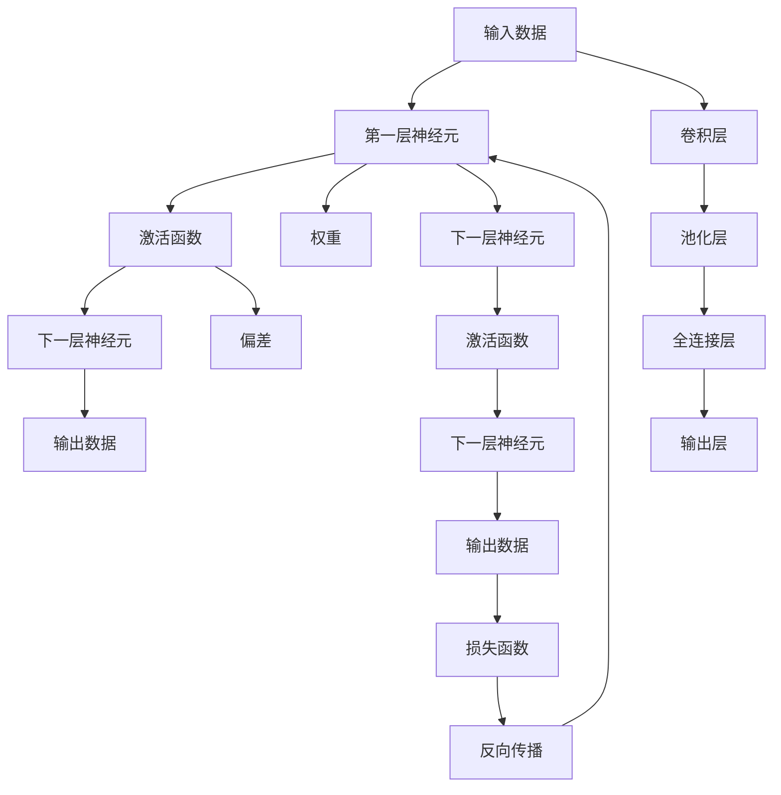

                 

# 神经网络：改变世界的技术

> 关键词：神经网络,深度学习,人工智能,机器学习,计算机视觉,自然语言处理

## 1. 背景介绍

### 1.1 问题由来
神经网络（Neural Networks, NN）作为一种强大的机器学习技术，在过去十年里经历了飞速的发展和演进。这一技术从最初在图像识别、语音识别等领域的突破性应用，到如今在自然语言处理、游戏AI、金融预测等多个领域的广泛应用，已经展现出了其深远的影响力和潜力。本文将深入探讨神经网络的基本原理和应用，探究其如何改变世界。

### 1.2 问题核心关键点
神经网络之所以能够取得如此成就，核心在于其独特的结构设计和强大的学习能力。其核心理念是通过多层非线性变换，学习输入数据到输出数据之间的复杂映射关系。这一映射过程由一组称为"神经元"的计算单元实现，每个神经元接收若干输入，通过加权和与激活函数计算输出。多个神经元组合成一层，并通过连接权重形成网络，可以处理极其复杂的数据结构。

本文将聚焦于神经网络的基本原理和应用，探讨其在计算机视觉、自然语言处理、语音识别等领域的突破性应用，并对未来的发展趋势和面临的挑战进行展望。

### 1.3 问题研究意义
神经网络技术的突破不仅推动了人工智能领域的发展，也深刻影响了人类社会的各个方面。从自动化生产线的智能控制到医疗诊断的精准分析，再到金融市场的智能预测，神经网络技术正成为推动各行业智能化的重要工具。研究神经网络的核心原理和应用，对于理解其在实际场景中的潜力，探索未来智能化发展的方向具有重要意义。

## 2. 核心概念与联系

### 2.1 核心概念概述

神经网络是一种模仿生物神经系统的计算模型，通过学习输入数据与输出数据之间的映射关系，实现复杂的模式识别和预测任务。其核心概念包括：

- 神经元（Neuron）：神经网络的基本计算单元，通过加权和与激活函数计算输出。
- 层（Layer）：由多个神经元组成的计算模块，网络通常由若干层构成。
- 权重（Weight）：连接神经元之间的可训练参数，决定了输入信号的加权和。
- 激活函数（Activation Function）：将加权和转换为输出信号的函数。
- 损失函数（Loss Function）：评估模型预测结果与真实标签之间差异的函数。
- 反向传播（Backpropagation）：通过链式法则计算梯度，用于更新网络参数的优化算法。

这些核心概念通过合理的架构设计和优化算法，使得神经网络具备强大的学习能力，可以处理复杂的非线性问题。

### 2.2 核心概念原理和架构的 Mermaid 流程图



这个流程图展示了神经网络的基本架构和工作原理：

1. 输入数据通过第一层神经元，进行加权和与激活函数处理，输出至下一层。
2. 多层的堆叠和组合，实现复杂模式的识别和预测。
3. 最终的输出数据通过损失函数与真实标签计算误差，反向传播算法用于更新权重和偏差，优化模型性能。

## 3. 核心算法原理 & 具体操作步骤
### 3.1 算法原理概述

神经网络的训练过程通常分为两个阶段：前向传播和反向传播。

**前向传播**（Forward Propagation）：输入数据通过网络逐层传递，计算输出结果的过程。每个神经元的输出依赖于前一层的输出，最终通过激活函数计算得到网络的最终输出。

**反向传播**（Backpropagation）：通过链式法则，计算损失函数对网络参数的梯度，从而更新网络权重和偏差的过程。反向传播算法利用梯度下降等优化算法，逐步调整网络参数，最小化损失函数。

### 3.2 算法步骤详解

**神经网络的构建步骤**：

1. 选择合适的网络结构：包括网络的层数、每层神经元的数量等。
2. 定义激活函数：常用的激活函数有Sigmoid、ReLU、Tanh等。
3. 初始化权重和偏差：通常使用随机初始化，或根据特定任务进行初始化。
4. 前向传播：将输入数据逐层传递，计算网络输出。
5. 计算损失函数：通常使用交叉熵损失、均方误差等，衡量模型预测与真实标签的差异。
6. 反向传播：计算损失函数对每个参数的梯度，使用优化算法更新参数。
7. 重复迭代：不断重复前向传播和反向传播过程，直至模型收敛。

**常见优化算法**：

- **随机梯度下降（SGD）**：在每次迭代中使用一个样本计算梯度，更新参数。
- **批量梯度下降（BGD）**：在每次迭代中使用整个训练集计算梯度，更新参数。
- **小批量梯度下降（MBGD）**：在每次迭代中使用一部分样本计算梯度，更新参数。
- **动量优化（Momentum）**：结合历史梯度信息，加速参数更新。
- **Adam优化**：结合动量和自适应学习率，具有较快的收敛速度。

### 3.3 算法优缺点

**优点**：

- 强大的学习能力：神经网络可以处理极其复杂的数据结构，具备强大的非线性映射能力。
- 广泛的应用场景：已经成功应用于计算机视觉、自然语言处理、语音识别等多个领域。
- 自动特征提取：无需手动提取特征，可以直接从原始数据中学习高级特征。

**缺点**：

- 需要大量数据和计算资源：神经网络通常需要大量的标注数据和强大的计算硬件支持。
- 过拟合风险：特别是在训练数据较少的情况下，容易发生过拟合。
- 模型解释性不足：神经网络的"黑盒"特性使得其输出难以解释，难以进行调试和优化。

### 3.4 算法应用领域

神经网络技术已经在多个领域展现了其强大的应用潜力，以下是其主要应用领域：

- **计算机视觉**：图像识别、目标检测、人脸识别等。通过卷积神经网络（CNN）进行图像处理，可以识别复杂的视觉模式。
- **自然语言处理**：语言模型、机器翻译、文本生成等。使用循环神经网络（RNN）、Transformer等结构，可以处理文本序列数据。
- **语音识别**：语音转文本、语音合成等。使用循环神经网络（RNN）或卷积神经网络（CNN）进行声音处理，可以识别和合成语音。
- **推荐系统**：个性化推荐、用户行为分析等。使用神经网络进行用户行为建模，可以预测用户兴趣，推荐个性化内容。
- **金融预测**：股票预测、风险评估等。使用神经网络进行市场数据建模，可以进行精准的金融预测。
- **医疗诊断**：疾病预测、影像分析等。使用神经网络进行医学影像分析，可以进行精准的医疗诊断。

## 4. 数学模型和公式 & 详细讲解 & 举例说明

### 4.1 数学模型构建

神经网络的数学模型可以表示为一个有向图，其中节点表示神经元，边表示连接权重。输入数据 $x$ 通过网络逐层传递，最终输出 $y$。

网络中的每个神经元 $i$ 接收若干输入 $x_j$，通过权重 $w_j^i$ 计算加权和 $z_i = \sum_{j=1}^m w_j^i x_j$，再通过激活函数 $f$ 计算输出 $a_i = f(z_i)$。所有神经元的输出通过连接权重和偏差 $b_i$，计算得到下一层输入。

最终输出层 $o$ 的输出通过激活函数 $f$ 计算得到，即 $o = f(\sum_{i=1}^n w_i o_i + b)$。

### 4.2 公式推导过程

以单层神经网络为例，其数学模型可以表示为：

$$
a = f(z) = f(w^T x + b)
$$

其中 $w$ 为权重向量，$b$ 为偏差，$f$ 为激活函数。对于多个神经元的单层网络，其输入为 $x_1, x_2, ..., x_n$，输出为 $a_1, a_2, ..., a_n$，计算过程可以表示为：

$$
a_i = f(z_i) = f(\sum_{j=1}^m w_{ij} x_j + b_i), \quad i=1,2,...,n
$$

### 4.3 案例分析与讲解

**案例分析：手写数字识别**

手写数字识别是一项经典的计算机视觉任务，使用卷积神经网络（CNN）进行处理。CNN通过卷积层和池化层提取图像特征，使用全连接层进行分类。具体实现步骤如下：

1. 数据预处理：将手写数字图像进行归一化和预处理，转化为神经网络所需的输入形式。
2. 构建CNN模型：使用卷积层和池化层提取图像特征，使用全连接层进行分类。
3. 定义损失函数：使用交叉熵损失函数衡量模型预测与真实标签的差异。
4. 训练模型：使用随机梯度下降等优化算法，最小化损失函数。
5. 模型评估：在测试集上评估模型性能，计算准确率和损失。

**讲解：**

- 数据预处理：将原始图像转换为数字矩阵，进行归一化处理。
- 卷积层：使用卷积核提取图像局部特征，保留图像边缘和纹理信息。
- 池化层：使用最大池化或平均池化操作，减小特征图尺寸，提取关键信息。
- 全连接层：将池化层的特征图展开为一维向量，使用全连接层进行分类。
- 损失函数：使用交叉熵损失函数计算模型预测与真实标签的差异。
- 反向传播：通过链式法则计算梯度，更新模型参数。

通过以上步骤，可以构建一个高效的卷积神经网络模型，实现手写数字的准确识别。

## 5. 项目实践：代码实例和详细解释说明

### 5.1 开发环境搭建

要进行神经网络的开发和训练，需要搭建一个高效的开发环境。以下是使用Python和TensorFlow进行神经网络开发的常见环境配置：

1. 安装Anaconda：从官网下载并安装Anaconda，用于创建独立的Python环境。
2. 创建并激活虚拟环境：
```bash
conda create -n tf-env python=3.7 
conda activate tf-env
```
3. 安装TensorFlow：根据CUDA版本，从官网获取对应的安装命令。例如：
```bash
pip install tensorflow
```
4. 安装其他依赖库：
```bash
pip install numpy scipy matplotlib scikit-learn
```
5. 安装TensorBoard：TensorFlow配套的可视化工具，用于监控和调试模型。

完成上述步骤后，即可在`tf-env`环境中开始神经网络的开发和训练。

### 5.2 源代码详细实现

以下是一个使用TensorFlow构建卷积神经网络进行手写数字识别的示例代码：

```python
import tensorflow as tf
from tensorflow.keras import layers, models

# 定义模型
model = models.Sequential()
model.add(layers.Conv2D(32, (3, 3), activation='relu', input_shape=(28, 28, 1)))
model.add(layers.MaxPooling2D((2, 2)))
model.add(layers.Conv2D(64, (3, 3), activation='relu'))
model.add(layers.MaxPooling2D((2, 2)))
model.add(layers.Conv2D(64, (3, 3), activation='relu'))
model.add(layers.Flatten())
model.add(layers.Dense(64, activation='relu'))
model.add(layers.Dense(10))

# 编译模型
model.compile(optimizer='adam',
              loss=tf.keras.losses.SparseCategoricalCrossentropy(from_logits=True),
              metrics=['accuracy'])

# 训练模型
model.fit(train_images, train_labels, epochs=10, validation_data=(test_images, test_labels))

# 评估模型
test_loss, test_acc = model.evaluate(test_images, test_labels)
print('Test accuracy:', test_acc)
```

### 5.3 代码解读与分析

这段代码实现了一个基本的卷积神经网络模型，用于对手写数字进行分类。具体步骤如下：

1. 定义模型：使用Sequential模型，依次添加卷积层、池化层和全连接层。
2. 编译模型：使用Adam优化器和交叉熵损失函数进行模型编译。
3. 训练模型：使用fit方法，在训练集上训练模型，并在验证集上评估性能。
4. 评估模型：在测试集上评估模型性能，输出准确率。

## 6. 实际应用场景

### 6.1 智能推荐系统

智能推荐系统已经成为各大电商平台和内容服务提供商的重要技术手段。通过神经网络模型对用户行为进行建模，可以预测用户的兴趣偏好，推荐个性化内容。

具体实现上，可以使用神经网络模型对用户的历史行为数据进行建模，使用全连接层或卷积神经网络进行特征提取，使用softmax层进行分类，从而预测用户的兴趣。

### 6.2 医疗影像分析

神经网络技术在医疗影像分析中的应用越来越广泛，通过深度学习模型对医学影像进行分类和分割，可以辅助医生进行精准诊断。

在实现上，可以使用卷积神经网络（CNN）对医学影像进行分割，使用全连接层或循环神经网络进行分类，从而实现对病变区域的精准识别和分类。

### 6.3 语音识别

语音识别技术在智能家居、车载、客服等领域有广泛应用。通过神经网络模型对语音信号进行建模，可以识别和转录语音内容。

具体实现上，可以使用循环神经网络（RNN）或卷积神经网络（CNN）对语音信号进行建模，使用softmax层进行分类，从而实现对语音内容的准确识别。

### 6.4 自然语言处理

自然语言处理（NLP）是神经网络的重要应用领域，通过神经网络模型对文本进行建模，可以实现文本分类、情感分析、机器翻译等任务。

在实现上，可以使用循环神经网络（RNN）或Transformer模型对文本进行建模，使用全连接层或softmax层进行分类，从而实现对文本内容的准确分类和处理。

## 7. 工具和资源推荐

### 7.1 学习资源推荐

为了帮助开发者系统掌握神经网络的理论基础和实践技巧，这里推荐一些优质的学习资源：

1. 《深度学习》（Ian Goodfellow）：全面介绍深度学习的基本概念和算法，包括神经网络、卷积神经网络、循环神经网络等。
2. 《动手学深度学习》：由李沐等人编写的在线教材，涵盖深度学习的前沿技术，包括神经网络、卷积神经网络、循环神经网络等。
3. 《Python深度学习》（Francois Chollet）：介绍TensorFlow和Keras的使用方法，帮助开发者快速上手神经网络开发。
4. 《神经网络与深度学习》（Michael Nielsen）：通过可视化工具，深入浅出地介绍神经网络的工作原理。
5. 《TensorFlow官方文档》：提供丰富的TensorFlow使用教程和示例，帮助开发者快速上手神经网络开发。

通过对这些资源的学习实践，相信你一定能够快速掌握神经网络的核心原理和应用技巧，并用于解决实际的NLP问题。

### 7.2 开发工具推荐

高效的开发离不开优秀的工具支持。以下是几款用于神经网络开发的常用工具：

1. TensorFlow：由Google主导开发的开源深度学习框架，生产部署方便，适合大规模工程应用。
2. PyTorch：基于Python的开源深度学习框架，灵活动态的计算图，适合快速迭代研究。
3. Keras：高层次的深度学习API，可以方便地构建和训练神经网络模型。
4. Scikit-learn：基于Python的机器学习库，提供了丰富的数据预处理和模型评估工具。
5. Weights & Biases：模型训练的实验跟踪工具，可以记录和可视化模型训练过程中的各项指标，方便对比和调优。

合理利用这些工具，可以显著提升神经网络开发的效率，加快创新迭代的步伐。

### 7.3 相关论文推荐

神经网络技术的发展源于学界的持续研究。以下是几篇奠基性的相关论文，推荐阅读：

1. Deep Neural Networks for Image Recognition（AlexNet）：提出深度卷积神经网络（CNN），用于图像分类任务，获得ImageNet竞赛冠军。
2. ImageNet Classification with Deep Convolutional Neural Networks：提出多层的卷积神经网络，用于大规模图像识别任务。
3. Sequence to Sequence Learning with Neural Networks：提出使用LSTM进行机器翻译任务，实现从英文到德文的高效翻译。
4. Attention is All You Need（Transformer）：提出Transformer结构，开启NLP领域的预训练大模型时代。
5. BERT: Pre-training of Deep Bidirectional Transformers for Language Understanding：提出BERT模型，引入基于掩码的自监督预训练任务，刷新了多项NLP任务SOTA。
6. Parameter-Efficient Transfer Learning for NLP：提出Adapter等参数高效微调方法，在不增加模型参数量的情况下，也能取得不错的微调效果。

这些论文代表了大神经网络微调技术的发展脉络。通过学习这些前沿成果，可以帮助研究者把握学科前进方向，激发更多的创新灵感。

## 8. 总结：未来发展趋势与挑战

### 8.1 总结

本文对神经网络的基本原理和应用进行了全面系统的介绍。首先阐述了神经网络技术的核心概念和基本架构，详细讲解了其数学模型和计算过程，并给出了基于TensorFlow的代码实现。同时，本文还探讨了神经网络在多个领域的广泛应用，展示了其在现实场景中的强大潜力。

通过本文的系统梳理，可以看到，神经网络技术已经成为推动人工智能领域发展的重要工具，其应用范围和潜力还在不断扩展。未来，神经网络技术将在更多领域展现出新的突破，带来更深刻的社会变革。

### 8.2 未来发展趋势

展望未来，神经网络技术将呈现以下几个发展趋势：

1. 模型规模持续增大。随着算力成本的下降和数据规模的扩张，神经网络模型的参数量还将持续增长。超大规模神经网络蕴含的丰富知识，有望支撑更加复杂多变的任务。
2. 模型结构多样化和复杂化。除了传统的卷积神经网络（CNN）、循环神经网络（RNN）、Transformer等结构，未来还将涌现更多创新结构，如注意力机制、自注意力机制、Transformer-XL等。
3. 多模态学习成为热点。将视觉、语音、文本等多种模态数据进行融合，实现多模态神经网络模型，提升信息获取的全面性和准确性。
4. 联邦学习和大规模分布式训练。在数据隐私保护和模型安全的要求下，联邦学习和分布式训练技术将成为神经网络的重要研究方向。
5. 模型压缩和优化技术不断进步。为了适应移动设备、边缘计算等低算力环境，模型压缩和优化技术将不断进步，提升神经网络的实时性和可部署性。
6. 人机协同智能发展。神经网络技术与人类智能的结合，将推动智能系统的智能化水平不断提升，实现更高效、更智能的智能交互。

### 8.3 面临的挑战

尽管神经网络技术已经取得了瞩目成就，但在迈向更加智能化、普适化应用的过程中，它仍面临着诸多挑战：

1. 数据获取与标注。高质量的数据和标注对于神经网络的训练至关重要，但获取和标注过程成本高、周期长。如何在数据稀缺的情况下，利用迁移学习、无监督学习等技术进行模型训练，将是一大挑战。
2. 模型过拟合。神经网络模型在训练数据较少的情况下容易发生过拟合，如何通过正则化、数据增强等技术，提高模型的泛化能力，仍需深入研究。
3. 计算资源消耗大。神经网络模型的计算量较大，需要高性能计算资源支持。如何在保持模型性能的同时，降低计算成本，提升模型可部署性，仍需更多优化技术。
4. 模型解释性不足。神经网络的"黑盒"特性使得其输出难以解释，难以进行调试和优化。如何提高模型的可解释性，增强其可信度，仍需进一步研究。
5. 模型安全与隐私保护。神经网络模型可能被攻击者利用，进行恶意行为。如何在保证模型安全的同时，保护用户隐私，仍需更多安全技术支持。

### 8.4 研究展望

面对神经网络技术面临的挑战，未来的研究需要在以下几个方面寻求新的突破：

1. 探索无监督和半监督学习方法。摆脱对大规模标注数据的依赖，利用自监督学习、主动学习等技术，提高模型在数据稀缺情况下的性能。
2. 研究参数高效和计算高效的模型结构。开发更加参数高效和计算高效的神经网络模型，提升模型性能和可部署性。
3. 引入更多先验知识。将符号化的先验知识，如知识图谱、逻辑规则等，与神经网络模型进行融合，提高模型的可解释性和准确性。
4. 引入多模态信息融合技术。将视觉、语音、文本等多种模态数据进行融合，实现多模态神经网络模型，提升信息获取的全面性和准确性。
5. 研究人机协同智能系统。将神经网络技术与人类智能进行结合，构建更加智能化的人机协同系统，提升系统的智能化水平。

这些研究方向将引领神经网络技术的进一步发展，为构建安全、可靠、可解释、可控的智能系统铺平道路。面向未来，神经网络技术还将不断扩展其应用范围，推动人工智能技术的广泛应用和深入发展。

## 9. 附录：常见问题与解答

**Q1：神经网络是否适用于所有数据类型？**

A: 神经网络主要适用于结构化数据，如图像、文本、音频等。对于非结构化数据，如自然语言、视频等，需要经过结构化处理后才能用于神经网络模型。此外，神经网络对数据的质量和标注也具有较高要求，需要在数据获取和标注过程中进行严格的筛选和处理。

**Q2：神经网络是否容易出现过拟合？**

A: 神经网络容易出现过拟合，特别是在训练数据较少的情况下。为了缓解过拟合，可以采用数据增强、正则化、dropout等技术。此外，可以通过迁移学习、联邦学习等方法，在数据稀缺情况下进行模型训练。

**Q3：神经网络是否容易受到攻击？**

A: 神经网络模型可能受到对抗攻击，如输入噪声、梯度截断等。为了提高模型的鲁棒性，可以采用对抗训练、梯度裁剪等技术，增强模型的抗干扰能力。此外，还可以引入对抗样本生成技术，主动发现和规避模型的脆弱点。

**Q4：神经网络是否适用于实时应用？**

A: 神经网络模型通常计算量大，实时应用时需要进行模型压缩、优化等处理，以适应低算力环境。例如，可以使用剪枝、量化、模型压缩等技术，提升神经网络的实时性和可部署性。

**Q5：神经网络是否容易受到数据分布变化的影响？**

A: 神经网络模型对数据分布的敏感度较高，数据分布的变化可能会影响模型的性能。为了提高模型的泛化能力，可以采用数据增强、迁移学习等技术，增强模型对数据分布变化的适应能力。

通过以上常见问题的解答，可以看到神经网络技术在实际应用中仍需不断优化和改进，以应对数据、计算、安全等方面的挑战。但正是这些挑战，推动了神经网络技术的不断进步和创新，使得其在各个领域展现出强大的应用潜力。

