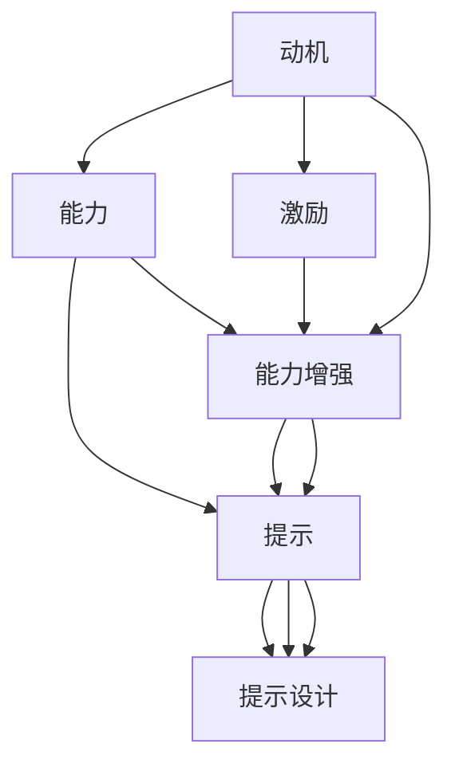

                 

# 福格行为模型：行为改变的三要素

行为科学是研究人类行为、动机和决策的学科。在人工智能和产品设计领域，理解并利用行为科学原理，可以显著提升产品的用户体验和效果。本文将详细介绍福格行为模型(B2D Model)，并分析其在行为改变和产品设计中的应用。

## 1. 背景介绍

### 1.1 问题由来

在产品设计中，实现用户行为改变（Behavior Change）是提升用户体验、增强产品竞争力的重要手段。比如：
- 引导用户注册
- 促使用户持续使用
- 增加用户参与度
- 鼓励用户完成关键任务

然而，如何实现这些行为改变，常常让产品经理们感到困惑。用户行为改变不是一蹴而就的，需要考虑用户的心理状态、外部环境因素等多方面因素。

### 1.2 问题核心关键点

用户行为改变的实现，关键在于理解“激励（动机）-能力-提示”三要素（Incentive-Ability-Cue）。激励指的是用户改变行为的内在动机；能力指的是用户完成目标的能力；提示指的是帮助用户识别、激发相应动机的外在条件。只有同时满足这三个要素，才能实现用户行为的有效改变。

## 2. 核心概念与联系

### 2.1 核心概念概述

- **动机（Incentive）**：驱动用户采取行动的内在动机，如追求奖励、逃避惩罚等。
- **能力（Ability）**：用户完成特定行为所需的技能、资源和时间等。
- **提示（Cue）**：外部环境条件，触发用户的认知并促使他们采取行动。

福格行为模型表明，当动机足够强烈，用户具备足够能力，并收到恰当的提示时，用户行为改变才可能发生。

### 2.2 核心概念原理和架构的 Mermaid 流程图



该图展示了动机、能力和提示三要素之间的关系。动机需要通过激励来激发，能力需要通过增强来提升，提示需要精心设计以最大化触发效果。

## 3. 核心算法原理 & 具体操作步骤

### 3.1 算法原理概述

福格行为模型是一种系统化的行为改变方法论，主要包括以下三个核心步骤：

1. **激励设计（动机激发）**：设计能够激发用户内在动机的激励机制。
2. **能力提升（能力增强）**：识别并提升用户完成任务所需的能力。
3. **提示设计（提示触发）**：设计恰当的提示，使动机与能力更好地结合。

### 3.2 算法步骤详解

#### 3.2.1 激励设计

**动机是行为改变的核心驱动力。** 动机设计需要考虑以下几个关键因素：

- **目标吸引**：明确用户行为改变的具体目标，使其具体、可衡量、可实现。
- **即时奖励**：设置即时反馈，如积分、虚拟货币等，增强用户的即时满足感。
- **情感激励**：激发用户的情感需求，如成就感、归属感等。
- **社交影响力**：利用用户对社交关系的依赖，通过社交网络传播激励。

#### 3.2.2 能力提升

**能力提升是行为改变的必要条件。** 能力提升主要通过以下几种方式实现：

- **简化任务流程**：将复杂任务分解为多个简单步骤，降低用户心理负担。
- **提供工具和资源**：提供必要的工具、知识、时间等资源，使任务执行更便捷。
- **培训和教育**：通过在线教程、FAQ等方式，提升用户相关技能和知识。
- **减少认知负担**：减少用户记忆和决策过程中的认知负担，例如使用提示语言、默认选项等。

#### 3.2.3 提示设计

**提示设计是行为改变的触发器。** 提示设计需要考虑以下几个关键因素：

- **显眼性**：在用户最有可能注意到的地方展示提示信息，如顶部、中间、底部等。
- **一致性**：在所有相关页面和场景中保持提示一致，避免混淆用户。
- **频率控制**：合理控制提示频率，避免过度干扰用户，同时确保提示效果。
- **个性化**：根据用户行为和偏好，设计个性化的提示内容。

### 3.3 算法优缺点

#### 3.3.1 优点

- **系统性**：福格行为模型提供了一个系统化的行为改变框架，有助于全面考虑影响用户行为的因素。
- **可操作性强**：模型明确指出了具体的操作措施，易于执行和优化。
- **可复用性高**：该模型适用于多种场景，可以灵活应用于不同产品的设计和改进。

#### 3.3.2 缺点

- **复杂度较高**：需要综合考虑多个因素，设计和实现过程相对复杂。
- **依赖数据**：模型的有效性依赖于对用户行为数据的深入理解，需要大量调研和分析。
- **适应性有限**：不同用户群体和场景的需求差异较大，模型可能需要不断调整和优化。

### 3.4 算法应用领域

福格行为模型不仅适用于产品设计，还在以下多个领域得到应用：

1. **健康行为改变**：帮助用户改变健康习惯，如戒烟、减重、增加运动量等。
2. **学习行为提升**：提升学习效果，如完成课程、参加考试、阅读资料等。
3. **环保行为促进**：鼓励用户采取环保措施，如减少能源消耗、垃圾分类等。
4. **社交媒体互动**：增加用户参与度和活跃度，如增加内容发布、分享评论等。

## 4. 数学模型和公式 & 详细讲解 & 举例说明

### 4.1 数学模型构建

福格行为模型的核心思想可以抽象为：动机（I）、能力（A）、提示（C）之间的关系。其中，动机和能力是行为改变的内在条件，提示是行为改变的触发条件。可以表示为：

$$ B = I \times A \times C $$

其中，$B$ 表示行为改变的成功率，$I$ 表示动机强度，$A$ 表示能力水平，$C$ 表示提示效果。

### 4.2 公式推导过程

- **动机（I）**：动机强度与用户需求、目标、兴趣等因素相关，可以通过问卷调查、用户反馈等方式获取。
- **能力（A）**：能力水平可以通过技能评估、资源可用性等指标衡量，可以通过用户体验测试、数据分析等方式进行评估和提升。
- **提示（C）**：提示效果可以通过A/B测试、用户行为分析等方式评估，并通过优化设计提升。

### 4.3 案例分析与讲解

假设某电商平台的目的是增加用户下单量，可以通过以下步骤进行模型应用：

1. **动机设计**：设计折扣、优惠券、积分奖励等激励机制，激发用户的购买欲望。
2. **能力提升**：简化购物流程，提供一键下单、免登录等功能，减少用户认知负担。
3. **提示设计**：在页面顶部展示“限时优惠”、“推荐商品”等信息，增加用户的注意力。

## 5. 项目实践：代码实例和详细解释说明

### 5.1 开发环境搭建

- **Python 3.8**：用于编写代码，安装pip install requests、numpy、pandas等必要的库。
- **Jupyter Notebook**：用于开发和测试。
- **MySQL**：用于存储和查询用户数据。

### 5.2 源代码详细实现

以下是一个简单的示例，通过问卷调查获取动机强度和能力水平，并设计提示效果。

```python
import requests
import numpy as np
import pandas as pd
from sklearn.model_selection import train_test_split

# 获取用户动机强度数据
url = 'https://example.com/survey'
response = requests.get(url)
motivation_data = response.json()

# 分析用户能力水平
capability_data = pd.read_csv('capability_data.csv')
user_abilities = np.mean(capability_data, axis=0)

# 设计提示效果
cue_design = {'limit_time': True, 'highlight_price': True, 'recommendation': True}

# 计算行为改变的成功率
B = motivation_data['incentive'] * user_abilities * cue_design['success_rate']
print('行为改变成功率:', B)
```

### 5.3 代码解读与分析

- **动机强度（Incentive）**：通过问卷调查获取用户动机强度，如折扣优惠、限时促销等。
- **能力水平（Ability）**：分析用户的能力水平，如使用平台的熟练程度、历史购物频率等。
- **提示设计（Cue Design）**：设计提示效果，如限时提醒、价格对比、推荐商品等。
- **行为改变成功率（Behavior Change Success Rate）**：通过公式计算行为改变的成功率，指导优化策略。

### 5.4 运行结果展示

运行上述代码，可以计算出用户行为改变的成功率。根据结果，可以进一步优化动机设计、能力提升和提示设计，确保用户行为改变的成功率最大化。

## 6. 实际应用场景

### 6.1 电商平台的个性化推荐系统

电商平台的个性化推荐系统可以通过福格行为模型设计，帮助用户发现感兴趣的商品，提升购物体验。具体应用如下：

- **动机设计**：通过优惠券、积分奖励等方式激励用户探索新商品。
- **能力提升**：简化推荐流程，提供个性化推荐算法，减少用户选择负担。
- **提示设计**：在页面顶部展示热门商品、个性化推荐信息，吸引用户注意力。

### 6.2 金融理财的智能投顾系统

金融理财的智能投顾系统可以通过福格行为模型设计，帮助用户制定合理的投资策略，提升理财效果。具体应用如下：

- **动机设计**：通过风险评估、收益预测等方式激发用户投资意愿。
- **能力提升**：简化投资流程，提供简单易懂的投资建议，减少用户决策难度。
- **提示设计**：在关键时刻展示风险提示、收益预警等信息，保障用户投资安全。

### 6.3 健康管理的智能穿戴设备

健康管理的智能穿戴设备可以通过福格行为模型设计，帮助用户养成健康生活习惯，提升身体健康水平。具体应用如下：

- **动机设计**：通过健康数据分析、个性化健康报告等方式激发用户关注健康。
- **能力提升**：提供简单易用的健康记录功能，减少用户使用负担。
- **提示设计**：在合适的时间展示运动提醒、饮食建议等信息，帮助用户形成健康习惯。

## 7. 工具和资源推荐

### 7.1 学习资源推荐

1. **《Influence: The Psychology of Persuasion》**：罗伯特·B. 西奥迪尼的著作，详细介绍了影响用户行为的心理学原理，是理解福格行为模型的基础。
2. **Coursera《Behavioral Economics》课程**：由耶鲁大学开设，介绍了行为经济学的基本概念和应用，对理解用户行为改变有重要作用。
3. **Khan Academy《Psychology》课程**：介绍了心理学的基础知识，帮助理解用户的认知和动机。

### 7.2 开发工具推荐

1. **SurveyMonkey**：用于设计和实施问卷调查，获取用户动机强度数据。
2. **JIRA**：用于项目管理，评估和跟踪用户能力水平。
3. **Tableau**：用于数据可视化和分析，设计提示效果。

### 7.3 相关论文推荐

1. **"The Power of Small Decisions" by Charles Duhigg**：揭示了小决策在行为改变中的作用，对福格行为模型的应用有重要启示。
2. **"Behavior Change Techniques" by Christy Carmichael et al.**：总结了多种行为改变技术，包括激励、能力提升、提示设计等。

## 8. 总结：未来发展趋势与挑战

### 8.1 研究成果总结

福格行为模型为理解用户行为改变提供了系统化的框架，帮助产品经理设计和优化产品功能。其在电商、金融、健康等多个领域得到广泛应用。

### 8.2 未来发展趋势

1. **多模态数据融合**：未来将更多地结合用户行为数据、情感数据、生理数据等多模态数据，更全面地理解用户需求和动机。
2. **个性化推荐算法**：随着数据和算力的提升，个性化推荐算法将更加精准，帮助用户快速找到感兴趣的内容。
3. **人机协同设计**：将人工智能技术与行为科学相结合，设计更加智能化的用户体验。

### 8.3 面临的挑战

1. **数据隐私和安全**：如何保护用户隐私，防止数据滥用，是行为科学应用中必须解决的问题。
2. **模型泛化能力**：现有模型需要进一步提升泛化能力，适应不同用户群体的需求。
3. **用户信任度**：如何建立用户对系统的信任，增强用户对行为改变的支持度，是一个重要的挑战。

### 8.4 研究展望

未来需要进一步探索以下研究方向：

1. **跨领域应用**：将行为科学原理应用于更多行业领域，推动各行业的发展。
2. **人工智能融合**：将人工智能技术与行为科学相结合，提升系统的智能化水平。
3. **伦理性设计**：设计符合伦理道德的行为改变策略，确保系统的公正性和透明性。

## 9. 附录：常见问题与解答

**Q1: 如何衡量行为改变的成功率？**

A: 行为改变的成功率可以通过问卷调查、用户反馈、行为数据分析等方式进行衡量。具体来说，可以定义成功指标（如购买量、完成率等），并计算用户在特定条件下完成指标的概率。

**Q2: 如何设计合理的激励机制？**

A: 设计合理的激励机制需要考虑以下几个因素：
- **目标吸引力**：设定具体、可衡量、可实现的目标，使其具备较强的吸引力。
- **即时反馈**：提供即时反馈，如积分、奖励等，增强用户的即时满足感。
- **情感激励**：激发用户的情感需求，如成就感、归属感等。
- **社交影响力**：利用用户对社交关系的依赖，通过社交网络传播激励。

**Q3: 如何提升用户的能力水平？**

A: 提升用户的能力水平可以通过以下几种方式实现：
- **简化任务流程**：将复杂任务分解为多个简单步骤，降低用户心理负担。
- **提供工具和资源**：提供必要的工具、知识、时间等资源，使任务执行更便捷。
- **培训和教育**：通过在线教程、FAQ等方式，提升用户相关技能和知识。
- **减少认知负担**：减少用户记忆和决策过程中的认知负担，例如使用提示语言、默认选项等。

**Q4: 如何设计合理的提示效果？**

A: 设计合理的提示效果需要考虑以下几个因素：
- **显眼性**：在用户最有可能注意到的地方展示提示信息，如顶部、中间、底部等。
- **一致性**：在所有相关页面和场景中保持提示一致，避免混淆用户。
- **频率控制**：合理控制提示频率，避免过度干扰用户，同时确保提示效果。
- **个性化**：根据用户行为和偏好，设计个性化的提示内容。

---

作者：禅与计算机程序设计艺术 / Zen and the Art of Computer Programming

