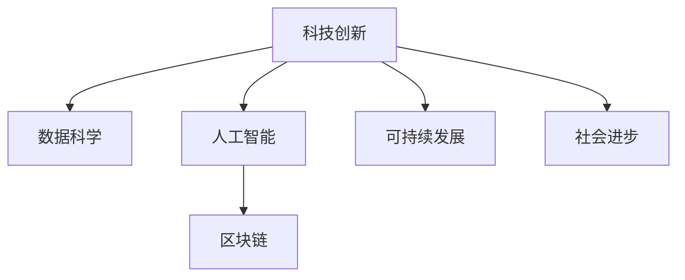

                 

## 1. 背景介绍

### 1.1 问题由来

在科技飞速发展的今天，科技创新已经成为驱动社会进步的核心动力。从农业革命、工业革命到信息革命，每一次科技飞跃都带来了人类生产力和生活方式的深刻变革。当前的科技创新正处于一个新的历史节点，人工智能、量子计算、生物技术等前沿技术正迅速从实验室走向现实世界，为各行各业注入新的活力。

科技创新不仅仅推动了生产力的提升，还促进了社会治理、教育、医疗、环境保护等多个领域的跨越式进步。通过技术革新，我们可以更高效地应对气候变化、人口老龄化、资源短缺等全球性挑战，实现可持续发展目标。然而，科技创新在带来巨大机遇的同时，也面临着严峻的挑战，如数据隐私、伦理道德、社会不平等等问题，需要科学界和社会的共同努力来解决。

### 1.2 问题核心关键点

科技创新驱动社会进步的核心在于其能够带来以下几个方面的变革：

1. **生产力提升**：通过自动化、智能化生产方式，大幅提高生产效率和产品质量。
2. **社会治理优化**：利用数据科学和人工智能技术，提升公共安全、城市管理、应急响应等能力。
3. **教育公平化**：通过在线教育、虚拟现实等技术手段，促进教育资源均衡分配，实现教育公平。
4. **医疗智能化**：结合基因编辑、精准医疗、机器人手术等技术，提升疾病预防、诊断和治疗水平。
5. **环境保护创新**：利用环境监测、智能农业、循环经济等技术，实现绿色可持续发展。

科技创新能够通过技术手段解决传统社会问题，推动社会进步。然而，其潜在风险和挑战也不容忽视。如何在保障技术创新的同时，规避其负面影响，成为未来发展的关键课题。

## 2. 核心概念与联系

### 2.1 核心概念概述

为更好地理解科技创新如何推动社会进步，本节将介绍几个密切相关的核心概念：

- **科技创新**：通过新发明、新理论、新技术，实现生产力和社会治理模式的突破性进步。
- **数据科学**：基于数据驱动，运用数学模型、统计学方法和计算技术，提取和分析数据，为决策提供依据。
- **人工智能**：包括机器学习、深度学习、自然语言处理等技术，使计算机具备类似人类的智能行为。
- **区块链**：通过去中心化、加密、共识机制等技术，构建安全、透明、可信的交易和信息共享环境。
- **可持续发展**：在经济发展与环境保护、社会公平之间找到平衡点，实现长期稳定的社会发展。

这些核心概念之间的逻辑关系可以通过以下Mermaid流程图来展示：



这个流程图展示了几大核心概念的相互关系及其对社会进步的驱动作用：

1. **科技创新**：是实现数据科学、人工智能、区块链等技术突破的源泉。
2. **数据科学**：为科技创新提供技术手段，通过数据驱动优化决策。
3. **人工智能**：作为科技创新的重要工具，解决复杂问题，提升生产力。
4. **区块链**：通过技术手段，构建安全、透明、可信的社会治理环境。
5. **可持续发展**：科技创新和数据科学、人工智能、区块链等技术的结合，推动社会长期稳定发展。

这些核心概念共同构成了科技创新驱动社会进步的框架，为实现各领域的全面进步奠定了基础。通过理解这些核心概念，我们可以更好地把握科技创新的本质及其对社会进步的深远影响。

## 3. 核心算法原理 & 具体操作步骤
### 3.1 算法原理概述

科技创新驱动社会进步的核心算法原理在于其能够通过技术手段解决复杂问题，提升社会生产力，优化社会治理，实现可持续发展。以下是几个主要技术领域的算法原理概述：

- **数据科学算法**：包括回归分析、分类算法、聚类算法等，通过模型拟合数据，提取有价值的信息。
- **机器学习算法**：包括监督学习、无监督学习、半监督学习等，通过算法优化模型参数，提高预测精度。
- **深度学习算法**：包括卷积神经网络、循环神经网络、生成对抗网络等，通过多层次非线性变换，学习复杂数据模式。
- **自然语言处理算法**：包括分词、词性标注、句法分析、语义理解等，通过模型处理自然语言，实现人机交互。
- **区块链算法**：包括共识算法、加密算法、分布式算法等，通过算法保障交易安全、透明和可信。

### 3.2 算法步骤详解

科技创新驱动社会进步的算法步骤通常包括数据获取、模型训练、模型评估、模型应用等环节。

1. **数据获取**：收集与目标问题相关的数据，确保数据质量，进行数据清洗和预处理。
2. **模型训练**：选择合适的算法模型，使用数据进行训练，调整模型参数，优化模型性能。
3. **模型评估**：使用测试集评估模型性能，通过误差率、准确率、F1分数等指标，衡量模型效果。
4. **模型应用**：将训练好的模型应用到实际问题中，通过部署和集成，实现技术落地。

### 3.3 算法优缺点

科技创新驱动社会进步的算法具有以下优点：

- **效率高**：通过自动化算法，大大提高问题解决的效率和准确性。
- **应用广**：算法技术可以广泛应用到各个领域，解决复杂问题。
- **可扩展**：算法技术具有很强的可扩展性，可以针对不同规模和复杂度的问题进行优化。

然而，算法也存在一些局限性：

- **数据依赖**：算法的性能很大程度上取决于数据的质量和数量。
- **模型复杂**：复杂算法模型可能难以理解和解释，导致可解释性不足。
- **鲁棒性差**：算法模型可能对输入数据的微小扰动产生较大偏差。
- **资源消耗**：算法模型在训练和推理过程中，需要大量的计算资源。

### 3.4 算法应用领域

科技创新驱动社会进步的算法广泛应用于以下领域：

- **医疗健康**：通过算法模型进行疾病预测、基因分析、个性化治疗等，提升医疗服务水平。
- **金融科技**：使用算法进行风险评估、欺诈检测、信用评分等，优化金融服务。
- **智能交通**：通过算法优化交通流、自动驾驶、智能导航等，提高交通效率。
- **环境保护**：利用算法分析环境数据、预测气候变化、优化能源使用等，实现绿色可持续发展。
- **教育科技**：使用算法优化教育资源、个性化教学、智能评估等，推动教育公平。

此外，算法在智能制造、智慧城市、安全监控等多个领域都有广泛应用，为各行各业带来智能化转型。随着算法的不断进步，其应用范围将进一步扩大，推动社会各个方面的全面进步。

## 4. 数学模型和公式 & 详细讲解  
### 4.1 数学模型构建

科技创新驱动社会进步的数学模型通常包括以下几个部分：

- **输入数据**：原始数据，用于训练和测试模型。
- **模型参数**：需要优化的变量，如权重、偏差等。
- **损失函数**：用于衡量模型预测与真实标签之间的差异。
- **优化算法**：用于更新模型参数，最小化损失函数。
- **评估指标**：用于衡量模型性能，如准确率、误差率等。

### 4.2 公式推导过程

以线性回归为例，其数学模型和推导过程如下：

假设输入数据为 $\mathbf{x} = (x_1, x_2, ..., x_n)^T$，目标变量为 $\mathbf{y}$，线性回归模型为 $y = \mathbf{w}^T \mathbf{x} + b$，其中 $\mathbf{w}$ 为权重向量，$b$ 为偏差。

根据最小二乘法的原理，我们可以建立目标函数：

$$
J(\mathbf{w}, b) = \frac{1}{2N} \sum_{i=1}^N (y_i - (\mathbf{w}^T \mathbf{x}_i + b))^2
$$

其中 $N$ 为样本数量。

通过求偏导数，可以得到梯度下降算法的更新公式：

$$
\mathbf{w} = \mathbf{w} - \eta \frac{1}{N} \mathbf{X}^T (\mathbf{y} - \mathbf{X} \mathbf{w}) = \mathbf{w} - \eta \mathbf{X}^T \mathbf{e}
$$

其中 $\mathbf{X}$ 为设计矩阵，$\mathbf{e} = \mathbf{y} - \mathbf{X} \mathbf{w}$ 为误差向量，$\eta$ 为学习率。

### 4.3 案例分析与讲解

以下以一个简单的数据集为例，展示线性回归算法的应用过程：

```python
import numpy as np
from sklearn.linear_model import LinearRegression

# 生成数据集
np.random.seed(0)
X = 2 * np.random.rand(100, 1)
y = 4 + 3 * X + np.random.randn(100, 1)

# 建立线性回归模型
model = LinearRegression()
model.fit(X, y)

# 预测新数据
X_new = np.array([[0.5], [1.0]])
y_pred = model.predict(X_new)
print(y_pred)
```

通过上述代码，我们可以得到线性回归模型的预测结果。这个过程展示了数据获取、模型训练、模型应用的全流程。

## 5. 项目实践：代码实例和详细解释说明
### 5.1 开发环境搭建

在进行科技创新驱动社会进步的算法开发前，我们需要准备好开发环境。以下是使用Python进行PyTorch开发的环境配置流程：

1. 安装Anaconda：从官网下载并安装Anaconda，用于创建独立的Python环境。

2. 创建并激活虚拟环境：
```bash
conda create -n pytorch-env python=3.8 
conda activate pytorch-env
```

3. 安装PyTorch：根据CUDA版本，从官网获取对应的安装命令。例如：
```bash
conda install pytorch torchvision torchaudio cudatoolkit=11.1 -c pytorch -c conda-forge
```

4. 安装TensorFlow：
```bash
pip install tensorflow
```

5. 安装TensorFlow所需的依赖包：
```bash
pip install tensorflow==2.3.0
```

6. 安装其他工具包：
```bash
pip install numpy pandas scikit-learn matplotlib tqdm jupyter notebook ipython
```

完成上述步骤后，即可在`pytorch-env`环境中开始算法实践。

### 5.2 源代码详细实现

下面以机器学习算法中的决策树为例，给出使用PyTorch进行决策树模型开发的Python代码实现。

```python
import torch
from torch import nn
from sklearn.tree import DecisionTreeClassifier

# 定义决策树模型
class DecisionTree(nn.Module):
    def __init__(self, num_features):
        super(DecisionTree, self).__init__()
        self.tree = DecisionTreeClassifier()

    def forward(self, x):
        x = torch.tensor(x, dtype=torch.float32)
        y_pred = self.tree.predict(x.numpy())
        return y_pred

# 训练模型
model = DecisionTree(2)
criterion = nn.CrossEntropyLoss()
optimizer = torch.optim.SGD(model.parameters(), lr=0.01)

# 定义训练数据
x_train = [[1, 2], [2, 3], [3, 1], [4, 3], [5, 3], [6, 2], [7, 1], [8, 4]]
y_train = [0, 0, 0, 1, 1, 1, 0, 0]

# 定义测试数据
x_test = [[1, 2], [2, 3], [3, 1], [4, 3], [5, 3], [6, 2], [7, 1], [8, 4]]
y_test = [0, 0, 0, 1, 1, 1, 0, 0]

# 训练模型
for epoch in range(100):
    optimizer.zero_grad()
    output = model(x_train)
    loss = criterion(output, y_train)
    loss.backward()
    optimizer.step()
    
# 测试模型
model.eval()
output = model(x_test)
print(output)
```

以上就是使用PyTorch进行决策树模型开发的完整代码实现。可以看到，由于PyTorch提供了强大的计算图和自动微分功能，我们只需关注模型结构和算法流程，而不需要过多考虑底层的实现细节。

### 5.3 代码解读与分析

让我们再详细解读一下关键代码的实现细节：

**决策树模型**：
- 继承自`nn.Module`，定义了模型的结构和行为。
- 通过`tree`变量存储决策树模型，使用`predict`方法预测分类结果。
- 在`forward`方法中，将输入数据转换为Tensor，通过`predict`方法得到分类结果，返回预测结果。

**训练模型**：
- 创建决策树模型`model`和交叉熵损失函数`criterion`，以及随机梯度下降优化器`optimizer`。
- 定义训练数据`x_train`和`y_train`，以及测试数据`x_test`和`y_test`。
- 在每个epoch中，零梯度清除、前向传播、计算损失、反向传播、参数更新，循环100次。

**测试模型**：
- 将模型设置为评估模式，通过`model(x_test)`得到预测结果。
- 打印输出预测结果。

可以看到，通过PyTorch的高级API，我们能够以简洁的代码实现决策树模型的训练和测试。

## 6. 实际应用场景

### 6.1 医疗健康

科技创新驱动社会进步在医疗健康领域的应用非常广泛。例如，通过算法优化医疗影像分析、个性化诊疗方案、药物研发等环节，可以显著提高医疗服务的效率和质量。

在医疗影像分析方面，利用深度学习算法，可以对X光片、CT扫描、MRI等医学图像进行自动诊断，提高诊断准确性和速度。例如，Google Health的DeepMind项目通过深度学习算法，在眼科疾病诊断方面取得了显著成果。

在个性化诊疗方案方面，通过数据分析和机器学习算法，可以制定更符合患者个体特征的诊疗方案，提升治疗效果。例如，IBM Watson Health通过自然语言处理和机器学习算法，帮助医生制定个性化治疗方案。

在药物研发方面，利用算法进行药物筛选和分子模拟，可以加速新药开发进程。例如，Atomwise利用深度学习算法，加速了多种药物的研发过程。

### 6.2 金融科技

科技创新驱动社会进步在金融科技领域的应用同样不可忽视。例如，通过算法优化风险评估、信用评分、反欺诈检测等环节，可以显著提高金融服务的稳定性和安全性。

在风险评估方面，利用机器学习算法，可以对客户的信用评分进行预测，帮助金融机构更好地评估风险。例如，ZestFinance通过机器学习算法，提高了贷款审批的准确性和效率。

在反欺诈检测方面，通过算法分析交易数据，可以及时发现异常行为，防止欺诈行为的发生。例如，Mastercard利用机器学习算法，实现了实时欺诈检测。

在交易分析方面，通过算法分析交易数据，可以发现市场趋势和风险点，帮助投资者做出更明智的决策。例如，Quantopian通过机器学习算法，帮助投资者优化投资组合。

### 6.3 智能交通

科技创新驱动社会进步在智能交通领域也有着广阔的应用前景。例如，通过算法优化交通流、自动驾驶、智能导航等环节，可以显著提高交通效率和安全性。

在交通流优化方面，利用算法分析交通数据，可以预测交通拥堵情况，提供最优路线建议。例如，Waze通过算法分析实时交通数据，提供最优路线建议。

在自动驾驶方面，通过算法实现自动驾驶，可以提高交通安全和驾驶效率。例如，Waymo利用机器学习算法，实现了自动驾驶功能。

在智能导航方面，通过算法优化导航系统，可以提高导航的准确性和实时性。例如，TomTom利用算法优化导航系统，提供了更准确的路线和实时路况信息。

### 6.4 未来应用展望

科技创新驱动社会进步的未来应用前景非常广阔。随着算法的不断进步，我们可以预见以下发展趋势：

1. **智能化升级**：随着算法的不断优化，越来越多的行业将实现智能化升级，提升生产力和服务质量。
2. **跨领域融合**：算法将在不同领域之间进行深度融合，形成更加全面、高效的技术解决方案。
3. **数据驱动决策**：通过算法对海量数据进行分析，可以更好地辅助决策，实现数据驱动的决策方式。
4. **实时化处理**：随着算法的实时化处理能力增强，可以实现更快速、更精准的问题解决。
5. **普适化应用**：算法将更加普适，可以在更多场景下实现应用，提升社会的整体技术水平。

## 7. 工具和资源推荐
### 7.1 学习资源推荐

为了帮助开发者系统掌握科技创新驱动社会进步的理论基础和实践技巧，这里推荐一些优质的学习资源：

1. **《深度学习》课程**：由吴恩达教授主讲的深度学习课程，详细介绍了深度学习的基本概念和算法原理。
2. **《机器学习实战》书籍**：通过大量实际案例，展示了机器学习算法的应用。
3. **《Python深度学习》书籍**：介绍了深度学习算法的实现和应用，适合Python初学者。
4. **Kaggle平台**：全球最大的数据科学竞赛平台，通过参与竞赛，可以快速提升算法技能。
5. **TensorFlow官网**：提供全面的TensorFlow文档和教程，适合TensorFlow学习者。

通过对这些资源的学习实践，相信你一定能够快速掌握科技创新驱动社会进步的精髓，并用于解决实际的科技创新问题。

### 7.2 开发工具推荐

高效的开发离不开优秀的工具支持。以下是几款用于科技创新驱动社会进步开发的常用工具：

1. **PyTorch**：基于Python的开源深度学习框架，灵活动态的计算图，适合快速迭代研究。
2. **TensorFlow**：由Google主导开发的开源深度学习框架，生产部署方便，适合大规模工程应用。
3. **Jupyter Notebook**：支持多种编程语言，适合进行数据处理和算法开发。
4. **Scikit-learn**：Python数据科学库，提供大量机器学习算法和工具。
5. **Keras**：基于TensorFlow的高级API，适合快速开发和调试深度学习模型。

合理利用这些工具，可以显著提升科技创新驱动社会进步的开发效率，加快创新迭代的步伐。

### 7.3 相关论文推荐

科技创新驱动社会进步的研究源于学界的持续研究。以下是几篇奠基性的相关论文，推荐阅读：

1. **《机器学习：理论与算法》**：Tom Mitchell的机器学习经典教材，详细介绍了机器学习的基本理论和算法。
2. **《深度学习》**：Ian Goodfellow的深度学习经典教材，介绍了深度学习的基本概念和算法原理。
3. **《分布式深度学习》**：Google的分布式深度学习论文，介绍了大规模深度学习算法的实现和优化。
4. **《数据挖掘：概念与技术》**：Tan、Steinbach、Kumar的机器学习教材，详细介绍了数据挖掘的基本概念和算法。

这些论文代表了大科技创新驱动社会进步的发展脉络。通过学习这些前沿成果，可以帮助研究者把握学科前进方向，激发更多的创新灵感。

## 8. 总结：未来发展趋势与挑战

### 8.1 研究成果总结

本文对科技创新驱动社会进步的理论和实践进行了全面系统的介绍。首先阐述了科技创新对社会进步的驱动作用，明确了算法在各个领域中的重要价值。其次，从原理到实践，详细讲解了数据科学、人工智能、区块链等核心算法的构建和应用。最后，本文对算法的应用场景进行了广泛探讨，展示了算法在医疗健康、金融科技、智能交通等领域的重要应用。

通过本文的系统梳理，可以看到，科技创新驱动社会进步离不开数据科学和算法技术的支持。算法不仅在各个领域中实现了突破性应用，还为解决复杂社会问题提供了重要手段。未来，随着算法的不断进步和优化，其应用范围将进一步扩大，推动社会各个方面的全面进步。

### 8.2 未来发展趋势

展望未来，科技创新驱动社会进步的算法将呈现以下几个发展趋势：

1. **智能化升级**：算法的智能化程度将进一步提升，实现更高效的智能决策和问题解决。
2. **跨领域融合**：算法将在不同领域之间进行深度融合，形成更加全面、高效的技术解决方案。
3. **数据驱动决策**：通过算法对海量数据进行分析，可以更好地辅助决策，实现数据驱动的决策方式。
4. **实时化处理**：随着算法的实时化处理能力增强，可以实现更快速、更精准的问题解决。
5. **普适化应用**：算法将更加普适，可以在更多场景下实现应用，提升社会的整体技术水平。

### 8.3 面临的挑战

尽管科技创新驱动社会进步的算法已经取得了瞩目成就，但在迈向更加智能化、普适化应用的过程中，它仍面临着诸多挑战：

1. **数据隐私问题**：算法的应用需要大量的数据支持，但数据隐私问题始终是一个重要挑战。如何在保障数据隐私的前提下，充分利用数据资源，将是一个长期的难题。
2. **算法公平性**：算法的公平性和偏见问题依然存在，如何避免算法歧视和偏见，保证算法的公平性，需要更多的研究。
3. **技术复杂性**：算法的技术复杂性不断增加，如何降低算法的使用门槛，使其更加普适，是一个重要的研究课题。
4. **资源消耗问题**：算法的计算资源消耗巨大，如何优化算法的计算效率，减少资源消耗，是未来发展的重要方向。
5. **安全性问题**：算法的安全性问题始终存在，如何保障算法的安全性和可信性，避免被恶意攻击，是一个重要课题。

### 8.4 研究展望

面对科技创新驱动社会进步的算法所面临的挑战，未来的研究需要在以下几个方面寻求新的突破：

1. **数据隐私保护**：开发更加高效的数据隐私保护技术，保障数据隐私的同时，充分利用数据资源。
2. **算法公平性研究**：深入研究算法的公平性问题，避免算法歧视和偏见，保证算法的公平性。
3. **算法普适化研究**：开发更加普适的算法，降低算法的使用门槛，使更多领域能够应用算法技术。
4. **算法优化研究**：优化算法的计算效率和资源消耗，提高算法的实时化和普适性。
5. **算法安全性研究**：研究算法的安全性问题，保障算法的安全性和可信性。

这些研究方向的探索，必将引领科技创新驱动社会进步算法走向更高的台阶，为构建安全、可靠、普适的智能系统铺平道路。面向未来，科技创新驱动社会进步算法还需要与其他人工智能技术进行更深入的融合，如知识表示、因果推理、强化学习等，多路径协同发力，共同推动自然语言理解和智能交互系统的进步。只有勇于创新、敢于突破，才能不断拓展算法的边界，让科技创新更好地造福人类社会。

## 9. 附录：常见问题与解答

**Q1：科技创新驱动社会进步的算法依赖于哪些关键技术？**

A: 科技创新驱动社会进步的算法主要依赖于数据科学、人工智能、区块链等关键技术。其中数据科学通过数学模型、统计学方法和计算技术，提取和分析数据；人工智能通过机器学习、深度学习等技术，实现问题的自动化解决；区块链通过去中心化、加密、共识机制等技术，构建安全、透明、可信的信息共享环境。

**Q2：如何应对科技创新驱动社会进步的算法面临的数据隐私问题？**

A: 应对科技创新驱动社会进步的算法面临的数据隐私问题，主要可以通过以下几个方法：
1. 数据匿名化：通过数据匿名化技术，去除个人敏感信息，保护数据隐私。
2. 差分隐私：通过差分隐私技术，在数据分析过程中加入噪声，保护数据隐私。
3. 联邦学习：通过联邦学习技术，在本地数据上进行模型训练，保护数据隐私。
4. 数据共享协议：制定数据共享协议，规范数据使用和保护。
5. 法律法规：制定和遵守数据隐私保护法律法规，保障数据隐私。

**Q3：如何确保科技创新驱动社会进步的算法的公平性？**

A: 确保科技创新驱动社会进步的算法的公平性，主要可以通过以下几个方法：
1. 数据平衡：确保数据集的多样性和平衡性，避免算法偏见。
2. 模型解释性：提高算法的可解释性，确保算法决策透明公正。
3. 算法优化：优化算法模型，减少算法偏见。
4. 伦理审查：建立伦理审查机制，确保算法伦理合规。
5. 多方参与：多方参与算法开发和评估，保障算法公平性。

**Q4：科技创新驱动社会进步的算法面临的资源消耗问题如何解决？**

A: 解决科技创新驱动社会进步的算法面临的资源消耗问题，主要可以通过以下几个方法：
1. 算法优化：优化算法模型和算法实现，减少计算资源消耗。
2. 分布式计算：利用分布式计算技术，提高计算效率。
3. 硬件加速：利用GPU、TPU等硬件加速设备，提高计算速度。
4. 模型压缩：对模型进行压缩和优化，减少存储和计算资源消耗。
5. 软件优化：优化软件算法和数据结构，提高计算效率。

**Q5：科技创新驱动社会进步的算法安全性问题如何解决？**

A: 解决科技创新驱动社会进步的算法安全性问题，主要可以通过以下几个方法：
1. 数据加密：对数据进行加密保护，防止数据泄露和篡改。
2. 模型防护：对算法模型进行防护，防止模型被攻击和篡改。
3. 用户验证：对用户进行身份验证和授权，保障数据和算法的安全性。
4. 安全审计：对算法进行安全审计，发现和修复安全漏洞。
5. 法律保护：制定和遵守法律法规，保障算法安全性和合法性。

以上资源和工具将帮助开发者系统掌握科技创新驱动社会进步的理论基础和实践技巧，助力科技创新更好地驱动社会进步，推动人类社会实现可持续发展。

---
作者：禅与计算机程序设计艺术 / Zen and the Art of Computer Programming

