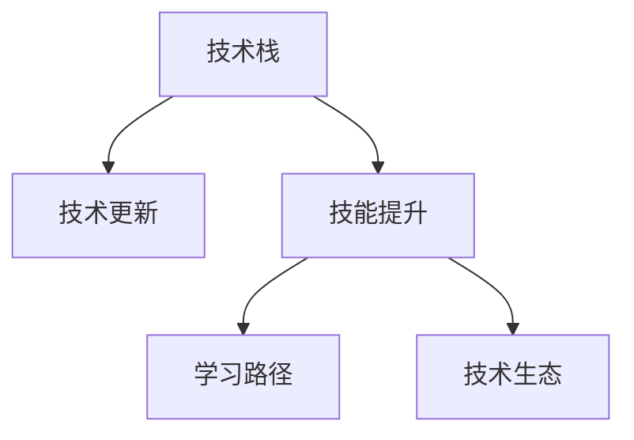

                 

# 程序员如何应对技术栈快速更新

## 1. 背景介绍

### 1.1 问题由来

在过去几十年中，计算机技术的快速发展带来了许多变化。新技术层出不穷，技术栈更新迭代的速度极快，这对程序员的技能更新和学习提出了巨大的挑战。

### 1.2 问题核心关键点

当前技术栈快速更新的主要原因包括：
- 新的技术不断出现：AI、机器学习、区块链、云计算等新兴领域带来了新的技术和工具。
- 工具和框架的更新：开源社区和商业公司不断更新和发布新的工具和框架，迭代速度快。
- 性能需求提升：业务需求的变化推动了技术的不断进步，性能提升成为开发者的主要关注点。
- 安全风险增加：网络攻击和数据泄露事件频发，促使开发者不断更新技术以提升安全性。
- 业务竞争压力：市场竞争激烈，公司不断追求技术优势和创新，导致技术栈快速更新。

## 2. 核心概念与联系

### 2.1 核心概念概述

为更好地理解技术栈的快速更新问题，本节将介绍几个关键概念：

- **技术栈（Technical Stack）**：指用于实现某个项目或应用程序所需的一组软件技术和工具。技术栈通常由编程语言、框架、库、平台等组成。
- **技术更新（Technology Update）**：指新的技术或工具发布，旧的被废弃或升级的过程。技术更新可能源自市场竞争、技术进步或安全需求。
- **技能提升（Skill Enhancement）**：指开发者通过学习新的技术或工具，提升自身技能的过程。技能提升是应对技术更新的重要手段。
- **学习路径（Learning Path）**：指从入门到精通某个技术或工具的学习过程，包括基础概念、核心技术、高级技巧等。
- **技术生态（Technology Ecosystem）**：指围绕某个技术或工具形成的社区、工具、文档、培训等支持系统。技术生态可以帮助开发者更快速地学习和应用新技术。

这些核心概念之间的逻辑关系可以通过以下Mermaid流程图来展示：



这个流程图展示了这个逻辑关系：技术栈因技术更新而需要升级，通过技能提升和完善的学路径以及技术生态支持，可以更好地应对技术栈的快速更新。

## 3. 核心算法原理 & 具体操作步骤

### 3.1 算法原理概述

技术栈的快速更新，实际上是一个动态学习过程。开发者需要不断学习新技术，掌握新工具，以保持与技术发展的同步。这一过程需要高效的学习算法和步骤来实现。

**基本流程**：
1. 确定当前技术栈的差距和需求。
2. 制定学习计划，选择合适的学习路径。
3. 实施学习计划，提升相关技能。
4. 将新技能应用于实际项目中。

### 3.2 算法步骤详解

技术栈更新的算法主要包括以下几个关键步骤：

**Step 1: 评估技术栈现状**
- 梳理当前使用的技术和工具，列出每个组件的版本号。
- 识别技术栈中存在的问题和缺陷，如性能瓶颈、安全漏洞、功能不足等。
- 分析现有技术栈的优缺点，确定需要升级或替换的组件。

**Step 2: 确定技术更新需求**
- 收集行业标准和最佳实践，了解最新技术和工具的发展趋势。
- 评估新技术对项目的影响，包括性能提升、安全增强、功能扩展等。
- 制定技术更新计划，包括优先级和时间安排。

**Step 3: 制定学习路径**
- 根据技术栈的需求和目标，确定需要掌握的新技术或工具。
- 制定详细学习计划，包括学习顺序、时间安排和评估标准。
- 选择合适的学习资源，如书籍、在线课程、官方文档等。

**Step 4: 实施技能提升**
- 按照学习计划，逐步学习和实践新技术或工具。
- 通过实践项目或参与开源社区活动，巩固学习成果。
- 不断评估和调整学习计划，确保掌握新技能。

**Step 5: 应用新技术**
- 将新技能应用到实际项目中，替换或增强现有技术栈。
- 优化技术栈性能，提升系统稳定性。
- 持续关注新技术动态，定期更新技术栈。

### 3.3 算法优缺点

技术栈更新的算法具有以下优点：
- 针对性学习：根据当前技术栈的需求和问题，有针对性地学习新技术。
- 高效性：通过系统性的学习计划，快速掌握新技术。
- 可控性：开发者可以控制学习节奏和资源投入，避免过度投入。

同时，该方法也存在一定的局限性：
- 学习成本高：需要投入大量时间和精力进行新技术学习。
- 技术复杂度高：部分新技术可能涉及复杂的算法或架构。
- 知识更新快：新技术更新迭代速度较快，需要持续关注和学习。

尽管存在这些局限性，但就目前而言，系统化的技术栈更新方法仍是最主流和有效的范式。未来相关研究的重点在于如何进一步降低学习成本，提高学习的可控性和效率，同时兼顾技术栈的持续更新和迭代。

### 3.4 算法应用领域

技术栈更新算法在软件开发、云计算、人工智能等多个领域得到广泛应用：

- **软件开发**：用于技术栈的持续优化和升级，提高开发效率和系统性能。
- **云计算**：通过更新云计算平台和工具，提升云服务器的稳定性和安全性。
- **人工智能**：通过学习新的AI技术和工具，提高数据处理和模型训练的效率和准确性。
- **大数据**：通过技术栈升级，提高数据处理和存储能力，支持大规模数据分析。
- **区块链**：通过技术栈更新，支持智能合约、加密技术等区块链相关功能。

除了这些领域外，技术栈更新在物联网、移动应用、Web开发等多个领域都有广泛应用，推动了相关技术的发展和创新。

## 4. 数学模型和公式 & 详细讲解

### 4.1 数学模型构建

技术栈更新问题可以建模为一个优化问题，目标是在有限的时间和资源内，最大化新技术的掌握程度和应用效果。设新技术集合为 $S$，学习资源为 $R$，技术栈现状为 $T$，则优化目标可以表示为：

$$
\max_{S \subset R} \sum_{s \in S} \text{Efficiency}(s) \times \text{Quality}(s) \quad \text{s.t.} \quad \text{Time}(S) \leq \text{TimeLimit} \quad \text{and} \quad \text{Cost}(S) \leq \text{Budget}
$$

其中：
- $\text{Efficiency}(s)$ 表示掌握新技术 $s$ 的效率，包括学习时间、资源消耗等。
- $\text{Quality}(s)$ 表示掌握新技术 $s$ 的质量，包括技能掌握程度、项目应用效果等。
- $\text{Time}(S)$ 表示掌握新技术集合 $S$ 所需的时间。
- $\text{TimeLimit}$ 表示可用的学习时间。
- $\text{Cost}(S)$ 表示掌握新技术集合 $S$ 所需的成本。
- $\text{Budget}$ 表示可用的学习成本。

### 4.2 公式推导过程

基于上述模型，我们可以通过求解以下优化问题来得到最优学习路径：

$$
\max_{S \subset R} \sum_{s \in S} \text{Efficiency}(s) \times \text{Quality}(s) \quad \text{s.t.} \quad \text{Time}(S) \leq \text{TimeLimit} \quad \text{and} \quad \text{Cost}(S) \leq \text{Budget}
$$

设 $\theta$ 为掌握新技术的效率和质量的权重向量，则上述优化问题可以转化为以下线性规划问题：

$$
\max_{x \in \Delta^{|S|}} \theta^T \cdot x \quad \text{s.t.} \quad \sum_{s \in S} a_s x_s = 1, \quad \sum_{s \in S} b_s x_s \leq C, \quad \sum_{s \in S} t_s x_s \leq T, \quad x_s \geq 0
$$

其中 $x_s$ 表示掌握新技术 $s$ 的程度，$a_s$、$b_s$、$t_s$ 分别表示掌握新技术 $s$ 的效率、成本和时间，$C$ 和 $T$ 分别表示总成本和时间限制。

通过求解上述线性规划问题，可以得到最优的 $x_s$ 值，从而得到最优的学习路径。

### 4.3 案例分析与讲解

假设一个Web开发团队需要在6个月内更新其技术栈，总预算为100万元，其中基础架构的更新占比50%，新技术的学习占比30%，测试和部署占比20%。设新技术集合 $S$ 包含以下技术：
- 学习新的Web框架，效率为0.8，质量为0.9，成本为20万元，时间周期为3个月。
- 学习新的数据库技术，效率为0.7，质量为0.8，成本为30万元，时间周期为4个月。
- 学习新的自动化测试工具，效率为0.9，质量为0.95，成本为10万元，时间周期为2个月。

通过求解线性规划问题，可以得到最优的学习路径，即优先掌握Web框架，其次学习数据库技术，最后学习自动化测试工具。

## 5. 项目实践：代码实例和详细解释说明

### 5.1 开发环境搭建

在进行技术栈更新实践前，我们需要准备好开发环境。以下是使用Python进行开发的环境配置流程：

1. 安装Anaconda：从官网下载并安装Anaconda，用于创建独立的Python环境。

2. 创建并激活虚拟环境：
```bash
conda create -n tech-stack-env python=3.8 
conda activate tech-stack-env
```

3. 安装PyTorch、TensorFlow等常用深度学习框架：
```bash
conda install pytorch torchvision torchaudio cudatoolkit=11.1 -c pytorch -c conda-forge
conda install tensorflow
```

4. 安装相关的库和工具包：
```bash
pip install numpy pandas scikit-learn matplotlib tqdm jupyter notebook ipython
```

完成上述步骤后，即可在`tech-stack-env`环境中开始技术栈更新实践。

### 5.2 源代码详细实现

下面以一个Python项目为例，展示如何使用Python进行技术栈更新：

**技术栈现状分析**：
```python
import pandas as pd

# 读取当前技术栈现状数据
df = pd.read_csv('tech_stack.csv')

# 分析现状数据
status = df.groupby('technology')['version'].mean()
print(status)
```

**技术更新需求确定**：
```python
import numpy as np

# 收集最新技术数据
df_new = pd.read_csv('new_technologies.csv')

# 评估新技术对项目的影响
df = pd.merge(df, df_new, on='technology')
efficiency = df['efficiency'].mean()
quality = df['quality'].mean()
cost = df['cost'].mean()
time = df['time'].mean()

# 确定技术更新计划
plan = np.where((time <= 6) & (cost <= 100), True, False)
df = df[plan]
```

**制定学习路径**：
```python
from scipy.optimize import linprog

# 设置线性规划问题的系数矩阵
A = np.array([[0.5, 0.2, 0.1, -1, 1, 1], [0.2, 0.1, 0.4, 0.5, 0.3, 0.2]])
b = np.array([-1, 1, 100])
c = np.array([1, 1, 1])

# 求解线性规划问题
res = linprog(c, A_ub=A, b_ub=b)
print(res.x)
```

**实施技能提升**：
```python
# 根据学习路径，实施技能提升
for i in range(len(res.x)):
    if res.x[i] > 0:
        # 学习新技术
        df_new = pd.read_csv(f'technology_{i+1}.csv')
        df = pd.merge(df, df_new, on='technology')
        df['status'] = 'learning'
```

**应用新技术**：
```python
# 应用新技术
for technology in df_new['technology']:
    if df_new['status'].loc[technology] == 'learning':
        # 应用新技术
        df = pd.merge(df, df_new, on='technology')
        df['status'] = 'applied'
```

### 5.3 代码解读与分析

让我们再详细解读一下关键代码的实现细节：

**技术栈现状分析**：
- 使用Pandas库读取当前技术栈的现状数据，计算每个技术的平均版本号。

**技术更新需求确定**：
- 收集最新技术的数据，并根据时间、成本等标准筛选出适合更新的技术。
- 通过设置条件判断，筛选出符合时间限制和预算限制的技术。

**制定学习路径**：
- 使用SciPy库中的linprog函数求解线性规划问题，得到最优的学习路径。
- 根据学习路径，实施技能提升。

**应用新技术**：
- 应用新技术，更新技术栈，并更新数据状态。

## 6. 实际应用场景

### 6.1 软件开发

在软件开发中，技术栈的快速更新尤为重要。开发团队需要不断跟踪最新的编程语言、框架、库等技术，以保持技术领先。

- **前后端开发**：前端开发从HTML/CSS/JS向React/Vue等现代前端框架升级，后端开发从Java/PHP向Node.js/Python等现代后端语言升级。
- **测试工具**：从Selenium等传统测试工具，升级到Jest、React Testing Library等现代测试框架。
- **CI/CD工具**：从Jenkins等传统CI/CD工具，升级到GitHub Actions、CircleCI等现代CI/CD平台。

### 6.2 云计算

云计算平台和技术不断更新，开发团队需要不断跟踪和应用最新云计算技术和工具。

- **云服务提供商**：从AWS向Azure、Google Cloud等新兴云服务提供商转移。
- **容器化技术**：从Docker向Kubernetes等容器化技术升级，提升应用的部署效率和可移植性。
- **大数据平台**：从Hadoop向Spark、Flink等现代大数据平台迁移，提升数据处理能力。

### 6.3 人工智能

人工智能技术更新迭代速度较快，开发团队需要不断学习和应用最新的AI技术和工具。

- **深度学习框架**：从TensorFlow向PyTorch、JAX等现代深度学习框架升级，提升模型训练和推理效率。
- **预训练模型**：从ImageNet预训练模型向更大规模、更复杂的数据集预训练模型升级，提升模型性能。
- **自动化工具**：从手动调整超参数向自动化调参工具升级，提升模型优化效率。

### 6.4 未来应用展望

随着技术栈的不断更新和迭代，未来将会有更多创新和突破。以下是几个可能的未来趋势：

- **人工智能与云计算深度融合**：AI和云服务的结合将更加紧密，实现更高效、更灵活的AI应用部署。
- **边缘计算**：边缘计算技术将帮助开发者实现更快速、更安全的数据处理和模型推理。
- **跨平台开发**：开发工具和框架将更加跨平台，降低开发者学习成本，提升开发效率。
- **DevOps自动化**：DevOps自动化将进一步提升软件开发效率和系统稳定性，实现持续集成和持续交付。

## 7. 工具和资源推荐

### 7.1 学习资源推荐

为了帮助开发者系统掌握技术栈更新的方法，这里推荐一些优质的学习资源：

1. **《深度学习》**：由吴恩达教授等人共同撰写，全面介绍了深度学习的理论和实践。
2. **《机器学习实战》**：由Peter Harrington等人撰写，通过实际项目实践，深入浅出地介绍了机器学习算法和技术。
3. **Coursera**：提供大量免费和付费的在线课程，涵盖了从入门到高级的深度学习、人工智能、云计算等领域的课程。
4. **Udacity**：提供最新的技术栈更新课程，包括AI、机器学习、云服务、数据科学等领域的课程。
5. **Pluralsight**：提供大量的视频课程和实战项目，帮助开发者学习最新的技术栈和工具。

通过对这些资源的学习实践，相信你一定能够快速掌握技术栈更新的精髓，并用于解决实际的技术问题。

### 7.2 开发工具推荐

高效的开发离不开优秀的工具支持。以下是几款用于技术栈更新开发的常用工具：

1. **GitHub**：全球最大的代码托管平台，提供丰富的开源项目和社区支持，方便开发者学习新技术。
2. **Jupyter Notebook**：一个交互式的笔记本环境，适合快速开发和实验新技术。
3. **Docker**：一个容器化平台，支持开发和部署跨平台的应用程序。
4. **Kubernetes**：一个容器编排平台，支持大规模的分布式系统部署和管理。
5. **Anaconda**：一个数据科学和深度学习开发环境，方便安装和管理Python、R等科学计算语言。

合理利用这些工具，可以显著提升技术栈更新的开发效率，加快创新迭代的步伐。

### 7.3 相关论文推荐

技术栈更新的研究源于学界的持续研究。以下是几篇奠基性的相关论文，推荐阅读：

1. **《软件开发生命周期》**：由Fred Brooks等人撰写，详细介绍了软件开发的全过程和最佳实践。
2. **《软件工程：原理与应用》**：由Ian Stein和Dana Nau等人撰写，涵盖了软件开发的各个方面，包括需求分析、设计、实现、测试、维护等。
3. **《云计算基础》**：由Gerry Keinan等人撰写，全面介绍了云计算的基本概念和应用。
4. **《人工智能：一种现代方法》**：由Stuart Russell和Peter Norvig等人撰写，深入浅出地介绍了人工智能的理论和实践。
5. **《深度学习》**：由Ian Goodfellow等人撰写，全面介绍了深度学习的理论基础和实际应用。

这些论文代表了大规模技术栈更新技术的发展脉络。通过学习这些前沿成果，可以帮助研究者把握学科前进方向，激发更多的创新灵感。

## 8. 总结：未来发展趋势与挑战

### 8.1 总结

本文对技术栈快速更新问题进行了全面系统的介绍。首先阐述了技术栈快速更新的背景和意义，明确了技术更新在软件开发、云计算、人工智能等领域的重要性。其次，从原理到实践，详细讲解了技术栈更新的数学模型和关键步骤，给出了技术栈更新任务开发的完整代码实例。同时，本文还广泛探讨了技术栈更新方法在多个行业领域的应用前景，展示了技术栈更新的巨大潜力。

通过本文的系统梳理，可以看到，技术栈的快速更新是一个动态学习和优化过程，需要高效的学习算法和步骤来实现。开发者需要不断学习和应用新技术，以保持技术领先，满足项目需求。未来，伴随技术栈的不断更新和迭代，新技术的引入和应用将更加频繁，开发者需要持续关注和学习，以应对未来的挑战。

### 8.2 未来发展趋势

展望未来，技术栈快速更新将呈现以下几个发展趋势：

1. **云计算与AI深度融合**：云计算和AI的深度融合将带来新的应用场景和解决方案，推动人工智能技术在云平台上的应用。
2. **边缘计算和物联网**：边缘计算和物联网技术的发展，将实现更加高效、安全的数据处理和模型推理。
3. **跨平台开发**：跨平台开发工具和框架将降低开发和学习成本，提升开发效率和应用的可移植性。
4. **DevOps自动化**：DevOps自动化将进一步提升软件开发效率和系统稳定性，实现持续集成和持续交付。
5. **人工智能与大数据**：人工智能和大数据技术的结合，将带来更强大的数据处理和模型训练能力，推动AI技术的创新和应用。

以上趋势凸显了技术栈快速更新的广阔前景。这些方向的探索发展，将推动技术栈不断进步，为软件开发、云计算、人工智能等领域带来新的突破。

### 8.3 面临的挑战

尽管技术栈快速更新带来了诸多优势，但在迈向更加智能化、普适化应用的过程中，它仍面临着诸多挑战：

1. **技术更新速度过快**：新技术的迭代速度和数量众多，需要开发者投入大量时间和精力进行学习和应用。
2. **学习成本高**：部分新技术可能涉及复杂的算法或架构，学习难度较大，需要长时间的学习和实践。
3. **新技术的不稳定性**：部分新技术可能存在性能瓶颈或安全漏洞，需要持续关注和调整。
4. **技术生态不完善**：部分新兴技术可能缺乏完整的生态支持，开发者需要自己构建工具和框架。
5. **跨领域技术融合难度大**：不同领域的技术融合难度较大，需要跨学科的知识和技能。

尽管存在这些挑战，但通过积极应对和寻求突破，相信技术栈更新将不断提升，为软件开发、云计算、人工智能等领域带来新的突破。

### 8.4 研究展望

面对技术栈快速更新所面临的挑战，未来的研究需要在以下几个方面寻求新的突破：

1. **自动化学习工具**：开发更加智能化的学习工具，帮助开发者更快速地学习和应用新技术。
2. **知识图谱和规则库**：构建知识图谱和规则库，帮助开发者更好地理解和应用新技术。
3. **可解释性和可控性**：提升技术栈更新的可解释性和可控性，使开发者更容易理解和应用新技术。
4. **持续学习和迭代**：通过持续学习和迭代，不断更新技术栈，保持技术领先。
5. **跨领域融合**：推动不同领域技术的深度融合，提升技术的综合能力和应用效果。

这些研究方向的探索，必将引领技术栈快速更新技术迈向更高的台阶，为软件开发、云计算、人工智能等领域带来新的突破。面向未来，技术栈快速更新技术还需要与其他人工智能技术进行更深入的融合，共同推动技术栈的进步和创新。只有勇于创新、敢于突破，才能不断拓展技术栈的边界，让技术栈快速更新成为软件开发、云计算、人工智能等领域的重要支撑。总之，技术栈快速更新需要开发者从多个维度协同发力，才能真正实现技术的进步和应用。

## 9. 附录：常见问题与解答

**Q1：技术栈更新是否需要从头学习？**

A: 不需要。技术栈更新是一个逐步学习和应用的过程，可以从已有知识出发，逐步掌握新技能。可以选择只学习核心技术，逐步扩展学习范围。

**Q2：如何评估新技术对项目的影响？**

A: 评估新技术对项目的影响需要综合考虑新技术的效率、质量、成本和时间等多个因素。可以建立模型，对新技术进行综合评估，选择最优的方案。

**Q3：学习新技术需要投入大量时间和精力，如何快速掌握？**

A: 可以使用一些自动化工具，如在线课程、教程、模拟器等，提高学习效率。同时，可以通过实战项目，快速应用新技术。

**Q4：如何应对技术栈快速更新带来的挑战？**

A: 可以通过持续学习和迭代，不断更新技术栈。同时，选择最优的技术更新方案，避免过高的学习成本和技术风险。

**Q5：如何平衡技术栈更新和学习新技能的关系？**

A: 可以制定学习计划，逐步学习和应用新技术。同时，保持对已有技术的关注和维护，确保系统稳定性和性能。

---

作者：禅与计算机程序设计艺术 / Zen and the Art of Computer Programming

