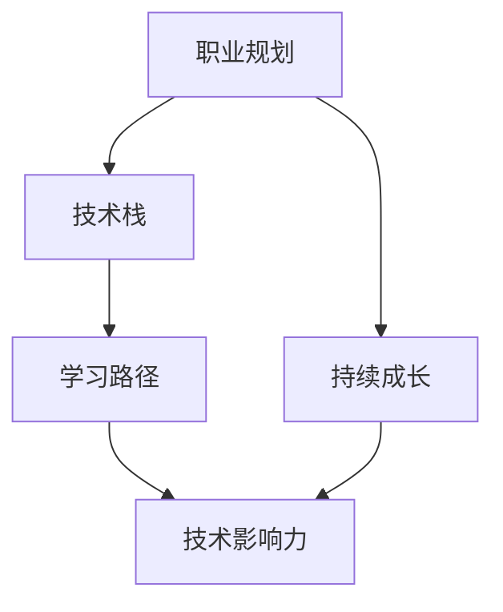

                 

# 程序员如何建立持久的职业竞争力与影响力

> 关键词：职业规划, 技术栈, 学习路径, 持续成长, 技术影响力

## 1. 背景介绍

### 1.1 问题由来
随着科技行业的迅猛发展，程序员面临的职业环境日益复杂多变。新技术、新工具层出不穷，对程序员的技能要求也水涨船高。如何在如此动态的环境中保持竞争力，成为每位程序员都面临的挑战。本文旨在为程序员提供一套系统性的职业规划和影响力塑造策略，帮助他们建立持久的竞争力，并逐步影响技术发展的方向。

### 1.2 问题核心关键点
在当下，程序员的竞争力体现在多方面：掌握前沿技术、具备高效解决问题的能力、能够在团队中发挥领导作用等。而技术影响力则更多体现在推动技术进步、驱动行业变革等方面。本文将从职业规划、技术栈建设、持续学习和影响力塑造四个方面进行详细探讨。

## 2. 核心概念与联系

### 2.1 核心概念概述

为更好地理解如何建立持久的职业竞争力和影响力，本节将介绍几个密切相关的核心概念：

- **职业规划**：设定明确的职业目标，制定详细的成长路径，并为之不断努力的过程。
- **技术栈**：程序员在不同技术领域和应用场景下掌握的技术集合。
- **学习路径**：根据职业目标和技术栈，规划出一条逐步提升技能、积累经验的学习路线。
- **持续成长**：通过不断学习新技术、新知识，保持个人技能和思维的更新。
- **技术影响力**：通过技术实践、开源贡献、技术分享等方式，影响技术社区、行业标准和未来技术发展方向。

这些核心概念之间的逻辑关系可以通过以下Mermaid流程图来展示：



这个流程图展示了我們的思考框架：

1. 设定明确的职业目标，确定技术栈。
2. 根据技术栈，规划学习路径，实现持续成长。
3. 在持续成长的过程中，不断积累经验，提升技术影响力。

这些核心概念共同构成了程序员职业发展和影响力塑造的基石。通过理解这些概念，我们可以更清晰地规划个人职业路径，并在技术实践中逐步提升自己的竞争力。

## 3. 核心算法原理 & 具体操作步骤
### 3.1 算法原理概述

建立持久的职业竞争力和影响力的过程，本质上是一个持续学习和适应变化的过程。其核心思想是：通过不断学习新技术、积累经验，逐步构建和扩展自己的技术栈，并在实际工作中应用这些技能，影响技术社区、推动行业进步。

形式化地，假设目标职业为 $\mathcal{O}$，当前技术栈为 $\mathcal{T}$，则职业规划的目标可以表示为：

$$
\mathcal{O} = \mathcal{T} + \Delta\mathcal{T}
$$

其中 $\Delta\mathcal{T}$ 为未来需要掌握的新技能集合。假设当前技术栈已经达到状态 $\mathcal{T}$，则目标职业的达成可以表示为：

$$
\mathcal{O} = \mathcal{T} \cup \Delta\mathcal{T}
$$

在实际操作中，这个达成过程可以分为以下几个步骤：

1. **技术栈建设**：根据职业目标，确定需要掌握的技术栈，并进行初步学习和实践。
2. **持续学习**：在实际工作中应用新技术，不断优化和扩展技术栈。
3. **经验积累**：通过项目实践、开源贡献等方式，积累技术经验，提升技术影响力。
4. **影响力塑造**：通过技术分享、写作、演讲等方式，影响技术社区和行业标准，成为技术意见领袖。

### 3.2 算法步骤详解

建立持久的职业竞争力和影响力，主要分为以下几个关键步骤：

**Step 1: 设定明确的职业目标**
- 明确个人职业发展的方向和目标，如成为技术专家、架构师、技术管理者等。
- 对目标进行分解，设定短期和长期目标，例如掌握某个技术栈，参与某类开源项目等。

**Step 2: 确定所需技术栈**
- 根据职业目标，确定需要掌握的核心技术领域和工具。
- 考虑技术栈的广度和深度，以及技术之间的关联性。

**Step 3: 制定学习路径**
- 根据技术栈，规划出一条逐步提升技能、积累经验的学习路线。
- 考虑到时间、资源等因素，设定合理的学习阶段和目标。

**Step 4: 持续学习和实践**
- 在实际工作中应用新技术，不断优化和扩展技术栈。
- 参与开源项目、技术社区活动，积累技术经验。

**Step 5: 提升技术影响力**
- 通过技术分享、写作、演讲等方式，影响技术社区和行业标准。
- 成为技术意见领袖，推动技术进步和行业变革。

### 3.3 算法优缺点

建立持久的职业竞争力和影响力，具有以下优点：
1. **系统性**：通过明确职业目标和技术栈，制定学习路径，能够更系统地提升个人技能和经验。
2. **可持续性**：持续学习和实践，能够保持技术栈的活力和更新，适应技术环境的快速变化。
3. **高性价比**：通过开源贡献、技术分享等方式提升技术影响力，能够获得行业认可，推动个人职业发展。

同时，该方法也存在一定的局限性：
1. **初始投入大**：确定职业目标和技术栈需要较长时间，且需要较高的学习投入。
2. **缺乏即时反馈**：技术栈的扩展和学习路径的制定，往往需要较长时间才能见效。
3. **易受外部环境影响**：技术栈的选择和路径的规划，需要根据外部环境的变化进行适时调整。

尽管存在这些局限性，但就目前而言，建立持久的职业竞争力和影响力，仍然是大规模人工智能时代程序员提升自我发展的最佳策略。未来相关研究的重点在于如何进一步优化学习路径，缩短学习时间，提升学习效率。

### 3.4 算法应用领域

建立持久的职业竞争力和影响力的策略，适用于各种类型的程序员和开发环境。以下是几个典型应用场景：

- **软件开发**：通过掌握多种编程语言、框架和工具，提升项目开发效率和质量。
- **数据科学**：通过学习数据分析、机器学习等技术，解决复杂业务问题，推动数据驱动的业务决策。
- **云计算**：通过掌握云平台、容器、微服务等技术，实现高效、安全的云上应用部署和运维。
- **人工智能**：通过学习深度学习、自然语言处理等技术，构建智能化应用，驱动AI技术的创新和落地。

这些场景涵盖了IT行业的主要方向，通过系统性的职业规划和持续学习，程序员可以在这些领域建立持久的竞争力和影响力。

## 4. 数学模型和公式 & 详细讲解
### 4.1 数学模型构建

本节将使用数学语言对建立职业竞争力和影响力的过程进行更加严格的刻画。

假设程序员当前掌握的技术栈为 $\mathcal{T}$，目标职业所需的技术栈为 $\mathcal{O}$，则建立职业竞争力的过程可以表示为：

$$
\Delta\mathcal{T} = \mathcal{O} - \mathcal{T}
$$

其中 $\Delta\mathcal{T}$ 为需要掌握的新技能集合。

### 4.2 公式推导过程

以软件开发为例，假设当前掌握的技术栈为 $\{\text{Python, Django, Redis}\}$，目标职业所需的技术栈为 $\{\text{Python, Django, Redis, Kubernetes, Docker, Terraform}\}$，则需要掌握的新技能集合为 $\Delta\mathcal{T} = \{\text{Kubernetes, Docker, Terraform}\}$。

在实践中，我们需要将目标职业所需的技能进行分解，设定每个技能的学习目标和评估标准。例如，对于Kubernetes，可以设定目标为掌握其基本概念、能够编写简单配置文件、能够进行基本的资源管理和部署等。然后，根据这些目标，制定详细的学习路径，并在实际项目中逐步应用这些技能。

### 4.3 案例分析与讲解

以下是一个具体的案例分析：

假设某位程序员的目标是成为全栈工程师，当前掌握的技术栈为 $\{\text{JavaScript, React, Node.js}\}$，目标职业所需的技术栈为 $\{\text{JavaScript, React, Node.js, Python, Django, TensorFlow}\}$。则首先需要掌握的新技能集合为 $\Delta\mathcal{T} = \{\text{Python, Django, TensorFlow}\}$。

1. **技术栈建设**：制定详细的学习路径，包括在线课程、书籍、实战项目等。
2. **持续学习**：在工作中不断应用新技术，通过实际项目积累经验。
3. **经验积累**：参与开源项目，进行技术分享和演讲，提升技术影响力。

通过这个过程，程序员不仅能够掌握新的技术，还能在实践中不断优化和扩展技术栈，最终实现职业目标。

## 5. 项目实践：代码实例和详细解释说明
### 5.1 开发环境搭建

在进行职业规划和持续学习的实践前，我们需要准备好开发环境。以下是使用Python进行PyTorch开发的环境配置流程：

1. 安装Anaconda：从官网下载并安装Anaconda，用于创建独立的Python环境。

2. 创建并激活虚拟环境：
```bash
conda create -n pytorch-env python=3.8 
conda activate pytorch-env
```

3. 安装PyTorch：根据CUDA版本，从官网获取对应的安装命令。例如：
```bash
conda install pytorch torchvision torchaudio cudatoolkit=11.1 -c pytorch -c conda-forge
```

4. 安装各类工具包：
```bash
pip install numpy pandas scikit-learn matplotlib tqdm jupyter notebook ipython
```

完成上述步骤后，即可在`pytorch-env`环境中开始开发实践。

### 5.2 源代码详细实现

下面我们以Python开发全栈工程师所需的技能为例，给出完整的代码实现。

首先，定义Python的学习路径：

```python
from IPython.display import Markdown

# 定义Python的学习目标和评估标准
py_path = {
    '阶段1': '掌握Python基础语法和数据结构',
    '阶段2': '熟悉Python标准库和第三方库',
    '阶段3': '熟练使用Python进行Web开发和后端开发',
    '阶段4': '掌握Python机器学习框架和数据处理技术'
}

# 输出学习路径
Markdown(str(py_path))
```

然后，定义学习目标和评估标准：

```python
# 定义学习目标和评估标准
py_tasks = {
    '阶段1': [
        'Python基础语法',
        '数据结构',
        'Python标准库',
        '第三方库安装和使用'
    ],
    '阶段2': [
        'Web框架（Flask/Django）',
        '后端开发（SQLite/MySQL）',
        'Web应用部署',
        'API开发'
    ],
    '阶段3': [
        '机器学习基础',
        '数据处理',
        '模型评估',
        '数据可视化'
    ],
    '阶段4': [
        '深度学习框架（TensorFlow/Keras）',
        '自然语言处理',
        '计算机视觉',
        '数据集构建和处理'
    ]
}

# 输出学习目标和评估标准
Markdown(str(py_tasks))
```

接下来，定义学习资源和评估方法：

```python
# 定义学习资源和评估方法
py_resources = {
    '阶段1': {
        '资源': [
            '《Python基础教程》书籍',
            'Python官方文档',
            '在线课程平台（Coursera/edX）'
        ],
        '评估': [
            '编写代码实现',
            '项目实战',
            '在线测试'
        ]
    },
    '阶段2': {
        '资源': [
            '《Django Web开发教程》书籍',
            '《Flask Web开发教程》书籍',
            '官方文档和API'
        ],
        '评估': [
            '编写代码实现',
            '项目实战',
            '代码评审'
        ]
    },
    '阶段3': {
        '资源': [
            '《Python机器学习》书籍',
            '《数据科学实战》书籍',
            '在线课程平台（Coursera/edX）'
        ],
        '评估': [
            '模型训练和调优',
            '数据处理和可视化',
            '项目实战'
        ]
    },
    '阶段4': {
        '资源': [
            '《TensorFlow实战》书籍',
            '《深度学习》书籍',
            '官方文档和API'
        ],
        '评估': [
            '模型训练和调优',
            '数据处理和可视化',
            '项目实战'
        ]
    }
}

# 输出学习资源和评估方法
Markdown(str(py_resources))
```

最后，启动学习流程：

```python
# 开始学习
learning_status = '未开始'
current_stage = None

while current_stage not in py_path:
    if learning_status == '未开始':
        print('开始学习Python')
        current_stage = '阶段1'
    elif current_stage == '阶段1':
        print('学习Python基础语法和数据结构')
        # 完成阶段1任务
        learning_status = '已完成'
    elif current_stage == '阶段2':
        print('学习Python Web开发和后端开发')
        # 完成阶段2任务
        learning_status = '已完成'
    elif current_stage == '阶段3':
        print('学习Python机器学习和数据处理技术')
        # 完成阶段3任务
        learning_status = '已完成'
    elif current_stage == '阶段4':
        print('学习Python深度学习和自然语言处理技术')
        # 完成阶段4任务
        current_stage = None
```

通过上述代码，我们可以看到，程序员可以通过明确的职业规划和学习路径，逐步掌握所需的技术栈，并不断积累实践经验，最终实现职业目标。

### 5.3 代码解读与分析

让我们再详细解读一下关键代码的实现细节：

**学习路径定义**：
- `py_path`字典：定义了从基础到高级的学习路径，每个阶段都有明确的学习目标。
- `Markdown`函数：用于格式化输出学习路径，方便展示和阅读。

**学习目标和评估标准**：
- `py_tasks`字典：定义了每个阶段的学习目标和评估标准，帮助评估学习进度和成果。

**学习资源和评估方法**：
- `py_resources`字典：定义了每个阶段的学习资源和评估方法，帮助选择合适的学习材料和评估方式。

**学习流程控制**：
- 使用`while`循环，根据学习状态和当前阶段，逐步完成每个阶段的学习任务，最终达到职业目标。

可以看到，通过这种系统性的规划和执行，程序员能够更有条理地学习新技术，逐步提升自己的职业竞争力。

当然，在实际应用中，还需要根据具体职业特点和实际情况，灵活调整学习路径和学习资源，以实现最佳的提升效果。

## 6. 实际应用场景
### 6.1 软件开发

在大规模软件开发中，持续学习和职业规划是提升技术能力和职业影响力的关键。通过掌握新的编程语言、框架和工具，程序员能够更高效地开发和维护软件系统，推动技术创新。

例如，通过掌握JavaScript、React、Node.js等前端和后端技术，程序员可以构建高性能、可扩展的Web应用。同时，通过学习Python、Django、TensorFlow等技术，可以开发智能推荐系统、机器学习模型等复杂应用，提升业务智能化水平。

### 6.2 数据科学

在数据科学领域，持续学习和职业规划同样重要。通过学习数据分析、机器学习等技术，程序员可以解决复杂的业务问题，推动数据驱动的业务决策。

例如，通过学习Python、NumPy、Pandas、Scikit-learn等技术，可以构建数据预处理、特征工程、模型训练和评估的完整流程。同时，通过参与开源项目、技术分享和演讲，可以提升个人影响力和行业认可度。

### 6.3 云计算

在云计算领域，持续学习和职业规划能够帮助程序员掌握云平台、容器、微服务等技术，实现高效、安全的云上应用部署和运维。

例如，通过学习AWS、Azure、Google Cloud等云平台，可以构建高性能、可靠、可扩展的云应用。同时，通过参与云社区活动、开源项目和技术分享，可以提升个人影响力，推动云计算技术的普及和应用。

### 6.4 人工智能

在大规模人工智能领域，持续学习和职业规划能够帮助程序员掌握深度学习、自然语言处理等技术，构建智能化应用，推动AI技术的创新和落地。

例如，通过学习TensorFlow、PyTorch、OpenAI等技术，可以开发智能推荐系统、语音识别、图像识别等复杂应用。同时，通过参与开源项目、技术分享和演讲，可以提升个人影响力，推动人工智能技术的普及和应用。

## 7. 工具和资源推荐
### 7.1 学习资源推荐

为了帮助程序员系统掌握新技术和职业规划的方法，这里推荐一些优质的学习资源：

1. **《程序员编程艺术》**：一本经典的技术书籍，涵盖编程语言、算法、数据结构、操作系统等核心内容。
2. **《深入理解计算机系统》**：深入讲解计算机系统和网络原理，帮助程序员理解底层实现。
3. **《机器学习实战》**：介绍机器学习的基础知识和实战案例，适合入门和进阶。
4. **Coursera、edX**：提供大量高质量的在线课程，涵盖编程、数据科学、机器学习等多个领域。
5. **GitHub**：开源项目的聚集地，适合学习和参与技术实践，积累项目经验。

通过这些资源的学习实践，相信程序员能够更系统地掌握新技术，提升个人职业竞争力和影响力。

### 7.2 开发工具推荐

高效的开发离不开优秀的工具支持。以下是几款用于持续学习和职业规划的常用工具：

1. **Jupyter Notebook**：开源的交互式编程环境，支持多种编程语言，适合编写和分享代码。
2. **Visual Studio Code**：轻量级且功能强大的编辑器，支持代码高亮、智能补全、调试等功能。
3. **Git**：版本控制工具，支持代码版本管理和团队协作，适合项目开发和版本控制。
4. **GitHub**：开源项目的托管平台，支持代码管理和团队协作，适合学习和参与技术实践。
5. **Slack**：团队协作工具，支持实时沟通和文件共享，适合团队合作和项目管理。

合理利用这些工具，可以显著提升程序员的开发效率和学习体验，加快技术实践和职业发展的步伐。

### 7.3 相关论文推荐

持续学习和职业规划的研究源于学界的持续探索。以下是几篇具有代表性的相关论文，推荐阅读：

1. **《程序员如何学习新技术》**：介绍程序员如何通过系统化的学习路径和方法，掌握新技术。
2. **《职业规划对技术发展的影响》**：研究职业规划对技术人才成长和行业发展的长期影响。
3. **《学习路径设计与持续成长》**：探讨如何通过系统化的学习路径设计，实现持续成长和技能提升。
4. **《开源贡献与技术影响力》**：研究开源贡献对技术社区和行业标准的影响。
5. **《技术分享与行业变革》**：探讨技术分享对技术社区和行业标准的推动作用。

这些论文代表了大规模人工智能时代程序员职业规划和持续学习的研究方向。通过学习这些前沿成果，可以帮助程序员更好地把握职业发展的方向，加速技术实践的步伐。

## 8. 总结：未来发展趋势与挑战
### 8.1 总结

本文对程序员建立持久的职业竞争力和影响力的过程进行了系统性的介绍。首先阐述了持续学习和职业规划的重要性和核心思想，明确了职业目标和技术栈的选择策略。其次，从职业规划、技术栈建设、持续学习和影响力塑造四个方面，详细讲解了建立竞争力和影响力的步骤和方法。

通过本文的系统梳理，可以看到，程序员可以通过系统性的规划和实践，逐步提升个人技能和经验，建立持久的职业竞争力和影响力。在未来的大规模人工智能时代，这种持续学习和职业规划的策略，将成为每位程序员提升自我发展的最佳选择。

### 8.2 未来发展趋势

展望未来，程序员的持续学习和职业规划将呈现以下几个发展趋势：

1. **技术栈的融合和扩展**：未来的技术栈将更加注重跨领域的融合，程序员需要掌握多种技术，构建多模态的技术栈，以应对复杂的应用场景。
2. **持续学习的自动化**：通过AI辅助学习、智能推荐等技术，实现个性化、自动化的学习路径推荐，加速技术学习和实践。
3. **开源贡献和社区活跃**：开源贡献和社区活跃将成为衡量程序员技术影响力的重要指标，更多的程序员将通过开源项目和技术分享，提升个人和团队的影响力。
4. **技术和业务结合**：未来的技术发展将更加注重技术在业务中的应用，程序员需要具备更强的业务理解和项目管理能力，推动技术创新和业务发展。
5. **跨领域知识整合**：未来的技术发展将更加注重多学科的整合，程序员需要具备跨领域的知识，推动技术进步和应用创新。

以上趋势凸显了持续学习和职业规划在未来的重要性。这些方向的探索和发展，必将进一步提升程序员的职业竞争力和技术影响力。

### 8.3 面临的挑战

尽管持续学习和职业规划具有广阔的前景，但在迈向更加智能化、普适化应用的过程中，它仍面临诸多挑战：

1. **学习成本高**：掌握新的技术栈和职业目标需要较长时间和较高投入，且不同技术栈的学习路径和资源差异较大。
2. **知识更新快**：新技术和新工具层出不穷，程序员需要持续学习和跟进，保持技术栈的活力。
3. **时间管理难**：平衡工作和学习需要良好的时间管理能力，且学习过程中的即时反馈相对较少。
4. **行业需求多变**：不同行业和企业的技术需求差异较大，程序员需要灵活调整学习路径和方向。
5. **缺乏支持体系**：缺乏系统化的学习路径和指导，难以制定合理的职业规划。

尽管存在这些挑战，但通过持续学习和职业规划，程序员仍然可以在大规模人工智能时代保持竞争力，逐步影响技术发展的方向。未来相关研究的重点在于如何进一步优化学习路径，提高学习效率，同时提供更多的学习支持和指导。

### 8.4 研究展望

面对持续学习和职业规划面临的挑战，未来的研究需要在以下几个方面寻求新的突破：

1. **自动化学习路径设计**：通过AI技术，自动推荐学习路径和资源，提升学习效率和效果。
2. **跨领域知识整合**：研究多学科知识的整合方法，推动技术进步和应用创新。
3. **开源社区支持**：提供更多的开源项目和社区支持，促进程序员的持续学习和技术分享。
4. **技术影响力评估**：研究技术影响力的评估指标和方法，推动技术社区和行业标准的进步。
5. **跨领域合作**：促进不同学科的合作和交流，推动技术的跨领域应用和创新。

这些研究方向将引领程序员持续学习和职业规划的发展方向，推动技术进步和应用创新，为大规模人工智能时代的技术发展贡献力量。

## 9. 附录：常见问题与解答
**Q1：如何设定明确的职业目标？**

A: 设定明确的职业目标，首先需要对自己的兴趣、优势和市场需求进行综合分析。可以参考行业趋势、职业报告等资源，选择适合自己的职业方向。同时，可以将目标分解为短期和长期目标，设定合理的里程碑，逐步实现职业目标。

**Q2：如何确定所需技术栈？**

A: 确定所需技术栈，需要考虑职业目标、市场需求和个人兴趣。可以通过职业调研、行业报告等方式，了解目标职业所需的关键技术。同时，需要考虑技术栈的广度和深度，以及技术之间的关联性。

**Q3：如何制定详细的学习路径？**

A: 制定详细的学习路径，需要设定每个阶段的学习目标和评估标准，选择适当的学习资源和方法。可以参考在线课程、书籍、技术博客等资源，逐步学习和实践。同时，需要灵活调整学习路径，根据实际情况进行适时调整。

**Q4：如何提升技术影响力？**

A: 提升技术影响力，需要通过开源贡献、技术分享和演讲等方式，积极参与技术社区和行业标准的讨论和推动。可以参与开源项目、技术博客、技术会议等活动，展示自己的技术成果和见解，提升个人和团队的影响力。

通过本文的系统梳理，程序员可以更好地理解如何建立持久的职业竞争力和影响力。通过明确职业目标和技术栈，制定详细的学习路径，进行持续学习和实践，并积极提升技术影响力，程序员可以在大规模人工智能时代，保持竞争力，逐步影响技术发展的方向。

