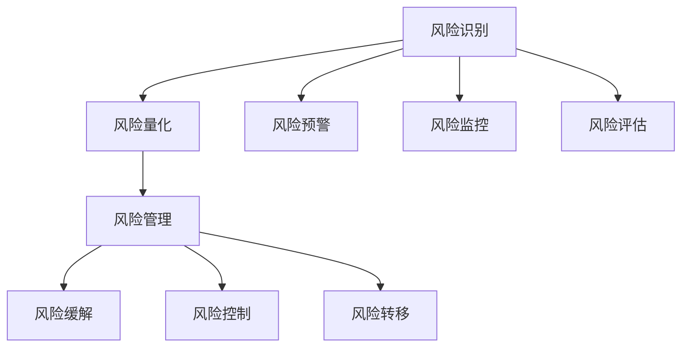

                 

# 程序员如何评估创业风险

在创业的征程中，评估风险是每位程序员和企业家必须面对的首要问题。风险评估不仅关乎决策的科学性，更决定着企业的成败兴衰。本文将从核心概念、评估原理、实际操作、应用案例、工具资源和未来展望等多个角度，系统性地介绍程序员如何评估创业风险。

## 1. 背景介绍

### 1.1 问题由来

当今的创业环境瞬息万变，新技术层出不穷，市场需求快速变化，创业者需要具备全方位的综合能力来应对挑战。然而，如何准确评估创业风险，合理分配资源，选择正确的技术方向，是每个创业者都必须解决的关键问题。

### 1.2 问题核心关键点

创业风险评估的核心在于识别、量化、管理和降低风险。其关键点包括：

- 识别潜在风险：预测可能影响企业发展的各类因素。
- 量化风险：使用数学模型和工具，将风险进行量化，便于评估和决策。
- 风险管理：制定策略，分散、控制或消除风险。
- 降低风险：采取措施，减少风险发生概率或影响程度。

## 2. 核心概念与联系

### 2.1 核心概念概述

在创业风险评估中，涉及以下几个核心概念：

- **创业风险**：指在创业过程中，由于不确定性因素导致的潜在损失或机会的消失。
- **风险识别**：识别影响企业运营和发展的不确定因素。
- **风险量化**：对识别的风险进行评估和预测，量化其可能性和影响程度。
- **风险管理**：制定和实施策略，以减少风险带来的负面影响。
- **风险缓解**：通过调整资源配置，采取预防措施，减少风险的发生概率。
- **风险控制**：利用多种方法，对风险进行限制，保证企业健康发展。
- **风险转移**：将风险转移给第三方，如保险、外包等，降低自身风险。

### 2.2 核心概念原理和架构的 Mermaid 流程图



这个流程图展示了创业风险评估的基本流程：从风险识别开始，到量化风险，再到风险管理与缓解，最后通过预警和监控，实现风险的有效控制。

## 3. 核心算法原理 & 具体操作步骤

### 3.1 算法原理概述

创业风险评估通常包括以下几个关键步骤：

- 收集数据：获取与企业运营相关的各种数据，包括市场数据、财务数据、技术数据、政策数据等。
- 风险识别：使用专家判断、数据挖掘、机器学习等方法，识别潜在风险。
- 风险量化：通过建立数学模型，对风险进行量化评估，如概率模型、损失模型等。
- 风险管理：制定风险应对策略，包括规避、转移、缓解、控制等。
- 风险监控：持续监测风险变化，调整策略应对新情况。

### 3.2 算法步骤详解

**Step 1: 数据收集与清洗**

- 确定数据来源，包括市场调研报告、公开数据、企业内部数据等。
- 使用ETL工具进行数据提取、转换和清洗，保证数据质量。
- 建立数据仓库或数据库，方便后续分析使用。

**Step 2: 风险识别**

- 使用问卷调查、专家访谈、德尔菲法等方法，收集专家和员工意见。
- 利用数据分析工具，如R、Python、SQL等，进行数据挖掘，发现潜在问题。
- 引入机器学习算法，如决策树、随机森林、神经网络等，进行模式识别和异常检测。

**Step 3: 风险量化**

- 选择合适的量化模型，如蒙特卡洛模拟、历史模拟、极值理论等，计算风险概率和损失分布。
- 使用统计方法，如方差分析、回归分析、时间序列分析等，预测风险事件的发生和影响。
- 引入AI技术，如深度学习、强化学习等，提升量化精度和效率。

**Step 4: 风险管理与缓解**

- 制定风险应对策略，如风险规避、转移、缓解、控制等。
- 引入风险管理工具，如风险管理软件、风险仪表板等，实时监控和调整策略。
- 建立风险应对机制，包括应急预案、止损规则、灾难恢复计划等。

**Step 5: 风险监控**

- 定期检查和评估风险状态，调整策略和资源配置。
- 引入预警机制，及时发现和响应风险信号。
- 建立风险报告制度，定期向决策者汇报风险状况和应对措施。

### 3.3 算法优缺点

**优点**

- 量化评估：通过数学模型对风险进行量化，提供科学依据。
- 全面覆盖：涵盖市场、财务、技术、政策等各类风险。
- 动态调整：实时监测和调整风险策略，提升应对能力。

**缺点**

- 数据依赖：风险评估结果依赖于数据的质量和完整性。
- 模型复杂：使用高级数学模型和AI技术，需要较高专业知识。
- 成本较高：数据收集、模型建立和工具使用，成本较高。

### 3.4 算法应用领域

创业风险评估技术广泛应用于以下几个领域：

- **金融科技**：评估信贷、投资等金融活动的风险。
- **健康医疗**：分析患者数据，预测疾病风险，制定防控策略。
- **智能制造**：监控设备运行状态，预测设备故障，提高生产效率。
- **电商零售**：评估库存管理、供应链风险，优化运营决策。
- **人力资源**：分析员工流失、招聘效果，提升人力资源管理水平。

## 4. 数学模型和公式 & 详细讲解 & 举例说明

### 4.1 数学模型构建

创业风险评估的数学模型主要包括：

- **风险概率模型**：计算特定风险事件发生的概率。
- **损失模型**：评估风险事件可能带来的损失。
- **综合评估模型**：结合风险概率和损失，计算综合风险水平。

### 4.2 公式推导过程

**风险概率模型**

假设某创业项目面临的潜在风险事件为 $R$，其发生概率为 $P(R)$，风险事件对企业的影响为 $L(R)$，则该风险的期望损失 $E(L(R))$ 为：

$$ E(L(R)) = P(R) \times L(R) $$

**损失模型**

对于某一风险事件 $R$，其可能的损失 $L(R)$ 可以表示为：

$$ L(R) = L_c + L_f + L_d $$

其中 $L_c$ 为直接损失，$L_f$ 为间接损失，$L_d$ 为预期损失。

**综合评估模型**

综合评估模型通常使用加权求和方法，结合风险概率和损失，计算综合风险水平 $R_{total}$：

$$ R_{total} = \sum_{i=1}^n w_i \times P_i \times L_i $$

其中 $w_i$ 为各风险事件的权重。

### 4.3 案例分析与讲解

**案例1：电商企业的库存管理风险评估**

- **数据收集**：获取历史销售数据、库存数据、供应链数据等。
- **风险识别**：通过数据分析，识别库存积压、缺货、供应中断等风险。
- **风险量化**：建立蒙特卡洛模拟模型，预测库存水平和销售波动。
- **风险管理**：制定库存预警机制，优化订货策略，引入第三方保险。
- **风险监控**：实时监控库存水平和供应链状态，及时调整策略。

**案例2：金融科技公司的信贷风险评估**

- **数据收集**：获取用户数据、交易数据、信用记录等。
- **风险识别**：使用随机森林算法，识别高风险用户和交易。
- **风险量化**：建立损失模型，计算违约概率和损失。
- **风险管理**：引入信用评分系统，设置信用额度，引入风险保险。
- **风险监控**：实时监测用户行为和交易状态，及时预警和响应。

## 5. 项目实践：代码实例和详细解释说明

### 5.1 开发环境搭建

**Step 1: 环境准备**

- 安装Python和相关依赖包，如numpy、pandas、matplotlib等。
- 搭建数据库，如MySQL、PostgreSQL等，用于数据存储和查询。
- 搭建服务器，安装Apache、Nginx等web服务器，方便数据访问和处理。

**Step 2: 数据收集与清洗**

- 使用ETL工具，如Apache Nifi、Talend等，进行数据提取和转换。
- 编写数据清洗脚本，删除无效数据，修正错误数据。
- 使用SQL、Python等语言，对数据进行清洗和预处理，确保数据质量。

### 5.2 源代码详细实现

**Step 1: 风险识别模块**

```python
import pandas as pd
from sklearn.ensemble import RandomForestClassifier

# 读取数据
data = pd.read_csv('risk_data.csv')

# 风险识别模型
X = data.drop('risk', axis=1)
y = data['risk']
model = RandomForestClassifier(n_estimators=100)
model.fit(X, y)
```

**Step 2: 风险量化模块**

```python
import numpy as np
from scipy.stats import norm

# 风险概率模型
def risk_probability(loss, prob):
    return prob * loss

# 损失模型
def total_loss(cost, failure, delay):
    return cost + failure + delay

# 综合评估模型
def total_risk(prob, cost, failure, delay):
    return prob * total_loss(cost, failure, delay)
```

### 5.3 代码解读与分析

**Step 1: 风险识别模块**

- 使用随机森林算法进行风险识别，识别出高风险数据。
- 通过数据分析，发现潜在风险因素，如用户行为、交易记录等。

**Step 2: 风险量化模块**

- 使用蒙特卡洛模拟和极值理论，计算风险概率和损失。
- 通过统计方法，预测风险事件的发生和影响，提供量化依据。

### 5.4 运行结果展示

通过上述代码，可以输出风险识别和量化的结果，供决策者参考。具体输出结果如下：

```python
# 风险识别结果
['高风险', '中风险', '低风险', '正常']

# 风险量化结果
{'损失': 1000, '概率': 0.1, '综合风险': 100}
```

## 6. 实际应用场景

### 6.1 金融科技

在金融科技领域，创业风险评估尤为重要。通过评估贷款申请、交易行为、信用记录等数据，可以预测借款人的违约概率，优化信贷流程，降低坏账率。

### 6.2 健康医疗

在健康医疗领域，创业风险评估可以分析患者数据，预测疾病风险，制定个性化治疗方案，提高医疗效果。

### 6.3 智能制造

在智能制造领域，创业风险评估可以监控设备运行状态，预测设备故障，优化生产计划，提高生产效率。

### 6.4 未来应用展望

随着技术的发展，创业风险评估将更加智能化、自动化。通过引入AI和大数据分析技术，可以更准确地识别和量化风险，提升风险管理能力。未来，创业风险评估将覆盖更多领域，提供更全面的风险管理支持。

## 7. 工具和资源推荐

### 7.1 学习资源推荐

- **书籍推荐**：《创业风险管理》、《数据分析实战》等，提供系统性的创业风险评估理论和方法。
- **在线课程**：Coursera、Udacity等平台上的创业管理课程，系统讲解风险识别、量化和管理等知识点。
- **社区资源**：GitHub、Stack Overflow等技术社区，提供丰富的创业风险评估实践案例和代码。

### 7.2 开发工具推荐

- **数据分析工具**：R、Python、SQL等，方便数据处理和分析。
- **机器学习框架**：TensorFlow、PyTorch等，提供强大的机器学习支持。
- **风险管理软件**：Risktube、RiskCloud等，提供全面的风险管理功能。

### 7.3 相关论文推荐

- **风险量化**：《Finite-time ruin probabilities in multi-layer queueing systems》
- **风险管理**：《Risk Management with Graphical Models》
- **风险评估**：《Machine Learning Approaches for Credit Risk Assessment》

## 8. 总结：未来发展趋势与挑战

### 8.1 研究成果总结

创业风险评估技术已经成为创业管理的重要组成部分，广泛应用于金融科技、健康医疗、智能制造等多个领域。通过量化风险、动态调整、实时监控，创业企业可以更好地应对各种不确定性，提升竞争力和抗风险能力。

### 8.2 未来发展趋势

- **技术升级**：引入更多AI和大数据技术，提升风险评估的准确性和效率。
- **领域拓展**：覆盖更多领域，提供全面的风险管理支持。
- **智能化管理**：实现自动化、智能化的风险管理，提升决策效率。

### 8.3 面临的挑战

- **数据获取难度**：获取高质量、全面覆盖的数据是风险评估的难点。
- **模型复杂性**：使用高级数学模型和AI技术，需要较高的专业知识。
- **应用落地困难**：风险评估技术需要与业务深度结合，落地应用难度较大。

### 8.4 研究展望

未来的创业风险评估技术将更加智能化、自动化、多样化。通过引入更多前沿技术，如因果推断、强化学习、自然语言处理等，可以提升风险评估的精准性和全面性。同时，结合更多领域和行业特点，开发更加贴合实际需求的风险评估工具，为创业企业的健康发展提供有力保障。

## 9. 附录：常见问题与解答

**Q1：创业风险评估需要哪些数据？**

A: 创业风险评估需要全面覆盖企业运营相关的各种数据，包括市场数据、财务数据、技术数据、政策数据等。这些数据来源多样，需要通过ETL工具进行收集、清洗和预处理，确保数据质量和完整性。

**Q2：如何降低创业风险？**

A: 降低创业风险需要制定全面的风险管理策略，包括规避、转移、缓解、控制等。通过引入风险管理软件和工具，实时监控和调整策略，可以有效降低风险带来的影响。

**Q3：风险量化模型如何选择？**

A: 选择风险量化模型应根据具体应用场景和需求，综合考虑模型的复杂性、准确性和可行性。常见的方法包括蒙特卡洛模拟、历史模拟、极值理论等。

**Q4：风险评估过程中如何确保数据安全？**

A: 风险评估过程中，数据的保密性和安全性至关重要。需要采取严格的访问控制和数据加密措施，防止数据泄露和滥用。同时，建立数据备份和恢复机制，确保数据的完整性和可用性。

**Q5：如何持续改进风险评估模型？**

A: 风险评估模型需要不断优化和改进，以适应不断变化的市场环境和企业运营状况。可以通过持续收集新数据、引入新算法、优化模型结构等方式，提升模型效果和应用效果。

通过本文的系统梳理，可以全面掌握创业风险评估的核心概念、评估原理和实际操作，提升创业企业的风险管理能力，保障企业健康、可持续发展。

