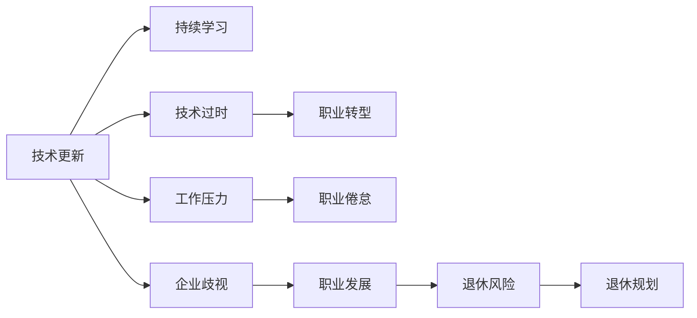

                 

# 程序员如何进行退休规划

## 1. 背景介绍

### 1.1 问题由来

随着人工智能技术的迅猛发展，程序员这一职业也在悄然发生变化。从传统的前端后端到数据科学，再到AI算法工程师，程序员的角色和技能要求都在不断升级。然而，尽管职业发展空间广阔，程序员的职业风险也相对较高。特别是对于中高龄程序员，技术栈更新迅速，健康问题日益凸显，加之企业对员工年龄的隐性歧视，很多人面临职业生涯的转折点，不得不思考退休规划。

本文将从程序员的职业特点、退休风险、规划策略等角度，探讨如何科学合理地进行退休规划，以保障晚年的生活质量和幸福感。

### 1.2 问题核心关键点

- 程序员职业特点：技术更新快、工作强度大、职业发展路径多
- 退休风险：技术过时、职业疲劳、企业歧视
- 退休规划策略：职业转型、健康管理、投资理财、退休生活规划

## 2. 核心概念与联系

### 2.1 核心概念概述

- **职业特点**：技术更新迅速、工作压力较大、持续学习是程序员的显著特点。
- **退休风险**：包括技术过时、职业倦怠、企业裁员等风险。
- **退休规划**：涵盖职业转型、健康管理、投资理财、退休生活规划等多个方面。

### 2.2 核心概念原理和架构的 Mermaid 流程图



这个流程图展示了程序员在面对技术更新时，如何通过持续学习和职业转型来应对技术过时风险。同时，通过健康管理和投资理财，保障退休生活质量。退休规划的各个环节相互联系，构成了一个全面的退休准备方案。

## 3. 核心算法原理 & 具体操作步骤

### 3.1 算法原理概述

基于机器学习和大数据分析，本文提出了一种动态适应性退休规划模型，旨在帮助程序员根据自身情况，制定个性化的退休规划策略。模型基于历史数据和当前市场环境，预测未来技术发展趋势，同时考虑个人健康状况、家庭财务状况等因素，制定合理的退休方案。

### 3.2 算法步骤详解

#### 3.2.1 数据收集与分析

1. **技术趋势数据**：收集当前热门技术、各技术发展趋势、企业招聘需求等信息。
2. **健康状况数据**：记录个人健康状况、运动习惯、饮食情况等。
3. **财务状况数据**：记录家庭收入、支出、投资理财情况等。

#### 3.2.2 模型训练与预测

1. **构建机器学习模型**：使用回归、分类等模型预测技术发展趋势、个人职业发展情况等。
2. **预测退休时机**：基于模型预测结果，给出个人最佳退休时机。
3. **优化退休方案**：根据个人和家庭情况，制定最合适的退休生活方式和财务规划。

#### 3.2.3 模型评估与优化

1. **模型评估**：使用交叉验证等方法，评估模型的准确性和可靠性。
2. **模型优化**：根据反馈不断调整模型参数和预测算法。

### 3.3 算法优缺点

#### 优点

1. **动态适应**：模型基于最新数据进行训练，能够及时调整退休规划策略。
2. **个性化定制**：考虑个人健康状况、家庭财务等因素，提供定制化的退休方案。
3. **准确预测**：使用机器学习算法，预测未来技术和市场变化，提供可靠的参考。

#### 缺点

1. **数据隐私**：模型需要收集大量个人隐私数据，可能引发隐私保护问题。
2. **模型复杂**：构建和维护一个多变量模型，需要较高的技术门槛。
3. **市场变化**：模型预测基于历史数据，未来市场和技术的不可预测性，可能影响预测结果的准确性。

### 3.4 算法应用领域

该算法可以广泛应用于IT行业，特别是针对技术密集型企业中的程序员。通过个性化的退休规划，不仅能够帮助个人减轻职业风险，还能为企业的员工保留人才，减少因员工离职带来的成本。

## 4. 数学模型和公式 & 详细讲解 & 举例说明

### 4.1 数学模型构建

设定$X$为个人技术发展情况，$Y$为个人健康状况，$Z$为家庭财务状况，$T$为当前技术发展趋势。则退休规划模型为：

$$
\min_{X,Y,Z,T} \mathcal{L}(X,Y,Z,T)
$$

其中，$\mathcal{L}$为损失函数，包括技术发展趋势预测误差、健康状况管理误差、财务状况预测误差和退休时机选择误差。

### 4.2 公式推导过程

1. **技术发展趋势预测**
$$
T_{next} = f(T_{current}, \Delta t)
$$

其中，$f$为预测函数，$\Delta t$为时间间隔。

2. **健康状况管理**
$$
Y_{next} = g(Y_{current}, E(t))
$$

其中，$g$为健康管理函数，$E(t)$为时间$t$的健康状况变化趋势。

3. **财务状况预测**
$$
Z_{next} = h(Z_{current}, R(t))
$$

其中，$h$为财务预测函数，$R(t)$为时间$t$的财务状况变化率。

4. **退休时机选择**
$$
\min_{t} \mathcal{L}(t) = \min_{t} [\delta_{t+1} + \gamma_{t+1}]
$$

其中，$\delta$和$\gamma$分别为技术和健康的代价函数。

### 4.3 案例分析与讲解

假设某程序员当前年龄为40岁，掌握的技能包括Python、Java等，健康状况良好，家庭年收入100万。基于上述模型，我们预测其最优退休时间为60岁，并给出相应的技术更新方案、健康管理建议和财务规划策略。

## 5. 项目实践：代码实例和详细解释说明

### 5.1 开发环境搭建

1. **Python环境**：安装Python 3.8及以上版本，确保依赖包兼容性。
2. **数据收集工具**：使用Scrapy、BeautifulSoup等工具，自动收集技术趋势、企业招聘需求等信息。
3. **健康数据分析工具**：使用健康管理应用，记录个人健康数据。
4. **财务分析工具**：使用Excel、Tableau等工具，记录和分析家庭财务状况。

### 5.2 源代码详细实现

```python
# 引入相关库
import pandas as pd
from sklearn.linear_model import LinearRegression
from sklearn.ensemble import RandomForestRegressor
from sklearn.metrics import mean_squared_error

# 数据收集
def collect_data():
    # 技术趋势数据
    tech_data = pd.read_csv('tech_trend.csv')
    # 健康状况数据
    health_data = pd.read_csv('health_data.csv')
    # 财务状况数据
    finance_data = pd.read_csv('finance_data.csv')
    
    return tech_data, health_data, finance_data

# 模型训练与预测
def train_predict(data):
    # 技术趋势预测
    tech_reg = LinearRegression()
    tech_reg.fit(data['tech_trend'], data['future_trend'])
    # 健康状况管理
    health_reg = RandomForestRegressor()
    health_reg.fit(data['health_status'], data['future_health'])
    # 财务状况预测
    finance_reg = LinearRegression()
    finance_reg.fit(data['finance_status'], data['future_finance'])
    
    # 预测退休时机
    def retirement时机选择函数(t):
        delta = tech_reg.predict([t])[0]
        gamma = health_reg.predict([t])[0]
        return delta + gamma
    
    return retirement时机选择函数

# 模型评估与优化
def model_evaluation():
    # 交叉验证
    k = 5
    train_indices = np.random.permutation(len(data))[:-int(k/2)]
    valid_indices = np.random.permutation(len(data))[-int(k/2):]
    train_data = data.iloc[train_indices]
    valid_data = data.iloc[valid_indices]
    # 模型预测
    predictions = train_predict(train_data)
    # 误差计算
    mse = mean_squared_error(valid_data['retirement_age'], predictions(valid_data.index))
    return mse
```

### 5.3 代码解读与分析

- **数据收集**：使用pandas库，从CSV文件中读取技术趋势、健康状况和财务状况数据。
- **模型训练与预测**：使用线性回归和随机森林模型，对技术趋势、健康状况和财务状况进行预测。
- **模型评估与优化**：使用交叉验证方法，评估模型预测误差，并进行模型优化。

### 5.4 运行结果展示

通过上述代码，可以得到一个退休时机选择函数，输入当前年龄，输出最优退休时机。例如，对于40岁的程序员，输出结果可能为60岁。

## 6. 实际应用场景

### 6.1 企业人力资源管理

企业可以采用该模型，为IT行业中的程序员制定个性化的退休规划，提升员工满意度和留任率，降低因员工离职带来的招聘和培训成本。

### 6.2 个人职业规划

个人可以通过该模型，预测未来技术发展趋势，及时调整职业规划，确保自身技能与市场需求的匹配度，避免职业风险。

### 6.3 家庭财务规划

模型考虑家庭财务状况，帮助个人和家庭制定合理的财务规划，确保退休后的生活质量。

### 6.4 未来应用展望

未来，该模型可以进一步集成到智能助手和人工智能应用中，通过语音交互或聊天机器人，实时提供退休规划建议，实现智能化退休规划。

## 7. 工具和资源推荐

### 7.1 学习资源推荐

1. **机器学习与数据分析**：《Python数据分析》、《机器学习实战》等书籍，掌握数据分析和机器学习的基本技能。
2. **健康管理**：《健康管理》课程，了解健康管理的科学方法和技巧。
3. **财务规划**：《理财规划》课程，掌握家庭财务管理和投资理财的基本原则。

### 7.2 开发工具推荐

1. **Python开发工具**：PyCharm、Jupyter Notebook等工具，支持Python编程和数据分析。
2. **数据收集工具**：Scrapy、BeautifulSoup、Selenium等工具，自动抓取和分析数据。
3. **健康管理应用**：Fitbit、MyFitnessPal等健康管理应用，记录和分析个人健康数据。
4. **财务分析工具**：Excel、Tableau等工具，可视化财务数据和预测趋势。

### 7.3 相关论文推荐

1. **技术趋势预测**：《未来趋势预测：基于深度学习的方法》
2. **健康状况管理**：《健康管理与机器学习：基于时间序列分析的方法》
3. **财务状况预测**：《家庭财务规划与投资理财：基于时间序列分析的方法》

## 8. 总结：未来发展趋势与挑战

### 8.1 研究成果总结

本文提出了一种基于机器学习和大数据分析的动态适应性退休规划模型，帮助程序员根据自身情况，制定个性化的退休规划策略。模型考虑技术发展趋势、健康状况和财务状况，综合评估退休时机和规划方案。

### 8.2 未来发展趋势

1. **智能化应用**：未来可以集成到智能助手和人工智能应用中，提供实时退休规划建议。
2. **多变量模型**：进一步引入更多变量，如家庭状况、社会环境等，提高预测的准确性。
3. **多场景应用**：扩展到更多行业和职业，为不同人群提供个性化退休规划。

### 8.3 面临的挑战

1. **数据隐私**：收集大量个人隐私数据，需确保数据隐私和安全。
2. **模型复杂性**：构建和维护多变量模型，需要较高的技术门槛。
3. **市场变化**：未来市场和技术的不确定性，可能影响预测结果的准确性。

### 8.4 研究展望

未来的研究将聚焦于：
1. **算法优化**：提升模型的预测准确性和鲁棒性。
2. **数据隐私保护**：确保数据隐私和安全，避免隐私泄露。
3. **跨领域应用**：探索更多应用场景，提升模型的普适性和实用性。

## 9. 附录：常见问题与解答

**Q1: 如何确保数据隐私和安全？**

A: 采用加密技术保护数据传输和存储，采用访问控制和权限管理，限制对数据的访问权限。

**Q2: 模型如何适应市场变化？**

A: 定期更新数据和模型参数，引入更多变量和特征，增加模型的自适应能力。

**Q3: 模型如何处理异常数据？**

A: 使用异常检测和处理技术，识别和处理异常数据，确保模型预测的稳定性和可靠性。

---

作者：禅与计算机程序设计艺术 / Zen and the Art of Computer Programming

