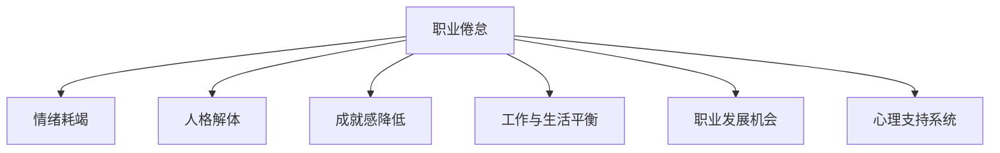

                 

# 程序员的职业倦怠：预防与应对

程序员作为IT行业的中坚力量，他们的职业倦怠问题一直是行业关注的焦点。职业倦怠不仅影响程序员的身心健康和工作效率，还可能对团队和公司的业务发展造成严重影响。本文将从多个角度探讨程序员职业倦怠的成因、表现和预防与应对策略，帮助IT团队构建更健康、高效的工作环境。

## 1. 背景介绍

### 1.1 问题由来
随着信息技术的快速发展，程序员成为了IT行业最重要的资源之一。然而，高压的工作环境、长时间的工作时间、复杂的技术挑战以及不断变化的行业需求，使得程序员面临巨大的职业压力。职业倦怠，即长时间工作导致的疲劳、压力、动力下降等症状，逐渐成为程序员群体普遍面临的问题。

### 1.2 问题核心关键点
程序员职业倦怠主要表现为情绪低落、工作动机减弱、生产效率下降、健康状况不佳等。其成因包括工作负荷过重、工作与生活界限模糊、缺乏职业发展机会、工作环境压力、同事间关系紧张等因素。

### 1.3 问题研究意义
探讨程序员职业倦怠的预防与应对策略，对于提升IT行业整体的工作效率和员工满意度，推动创新和技术进步，具有重要意义。

## 2. 核心概念与联系

### 2.1 核心概念概述

为更好地理解程序员职业倦怠的预防与应对方法，本节将介绍几个关键概念：

- **职业倦怠(Burnout)**：指长期工作带来的情感衰竭、人格解体和个人成就感降低的综合症。
- **情绪耗竭**：指对工作的热情和兴趣减少，感到身心俱疲。
- **人格解体**：指个体与工作间的心理距离增大，感到疏离和麻木。
- **成就感降低**：指对自己工作的价值和成就感到质疑和否定。
- **工作与生活平衡**：指工作和个人生活之间的协调和相互促进。
- **职业发展机会**：指个人在职业道路上的成长和提升机会。
- **心理支持系统**：指个体在工作中获得的精神支持和情感交流网络。

这些概念之间的逻辑关系可以通过以下Mermaid流程图来展示：



这个流程图展示出职业倦怠的多重表现形式，以及这些表现与工作环境和个人状态之间的复杂关系。

## 3. 核心算法原理 & 具体操作步骤
### 3.1 算法原理概述

预防与应对程序员职业倦怠的关键在于理解其成因，并采取针对性的措施。其核心算法原理如下：

1. **识别成因**：通过问卷调查、访谈等方式，识别导致职业倦怠的主要因素，如工作负荷、职业发展、工作与生活平衡等。
2. **心理评估**：采用心理测评工具，评估程序员的情绪状态、压力水平、工作满意度等指标，以便精准干预。
3. **个性化干预**：根据成因和评估结果，制定个性化的干预措施，如调整工作负荷、改善工作环境、提供职业发展机会等。
4. **持续跟踪**：定期跟踪干预效果，根据反馈调整策略，确保干预措施的有效性。

### 3.2 算法步骤详解

基于上述算法原理，预防与应对程序员职业倦怠的具体操作步骤如下：

**Step 1: 识别职业倦怠成因**
- 设计调查问卷，涵盖工作负荷、工作与生活平衡、职业发展、心理支持等多个维度。
- 通过问卷收集数据，分析出导致职业倦怠的关键因素。

**Step 2: 心理评估**
- 引入心理测评工具，如职业倦怠量表、工作满意度问卷等。
- 定期对程序员进行心理评估，了解其情绪状态和压力水平。

**Step 3: 制定个性化干预措施**
- 根据评估结果，制定个性化的干预措施，如调整工作时间、优化工作环境、提供职业培训等。
- 为每个程序员制定个性化的职业发展计划，如设置短期和长期目标，安排导师辅导等。

**Step 4: 持续跟踪与反馈**
- 定期检查干预措施的执行情况，收集程序员的反馈意见。
- 根据反馈调整干预策略，确保干预措施的有效性。
- 定期进行心理评估，跟踪干预效果，及时调整策略。

### 3.3 算法优缺点

基于上述预防与应对策略的算法，有以下优缺点：

**优点**：
1. **精准识别**：通过问卷调查和心理评估，能够精准识别导致职业倦怠的成因。
2. **个性化干预**：根据成因制定个性化的干预措施，提高干预效果。
3. **持续跟踪**：定期跟踪干预效果，确保措施的有效性和及时性。

**缺点**：
1. **成本高**：设计问卷、进行心理评估和持续跟踪，成本较高。
2. **复杂性高**：需要专业人员进行问卷设计、数据收集和分析，技术要求较高。
3. **干预效果不确定**：尽管个性化干预可以提高干预效果，但不同的人对干预措施的反应可能不同。

### 3.4 算法应用领域

该算法在多个领域和环境中都有广泛的应用：

- **企业内部**：在IT企业、软件公司等技术密集型企业中，预防和应对程序员职业倦怠的策略尤为关键。
- **研发团队**：在敏捷开发、快速迭代的项目团队中，高效的工作环境和合理的压力管理是项目成功的保障。
- **远程工作**：在远程工作环境中，缺乏面对面交流和团队氛围可能导致职业倦怠，因此需要特别关注心理支持和职业发展。

## 4. 数学模型和公式 & 详细讲解  
### 4.1 数学模型构建

为了更系统地理解和量化程序员职业倦怠的问题，我们引入以下数学模型：

设程序员职业倦怠指数为 $B$，情绪耗竭指数为 $E$，人格解体指数为 $D$，成就感降低指数为 $A$，则职业倦怠指数可以表示为：

$$
B = \alpha E + \beta D + \gamma A
$$

其中 $\alpha, \beta, \gamma$ 为权重系数。

### 4.2 公式推导过程

根据上述数学模型，我们可以进行以下推导：

1. **情绪耗竭**：
   $$
   E = \sum_{i=1}^n e_i a_i
   $$

   其中 $e_i$ 为第 $i$ 个情绪耗竭指标，$a_i$ 为相应的权重系数。

2. **人格解体**：
   $$
   D = \sum_{i=1}^n d_i b_i
   $$

   其中 $d_i$ 为第 $i$ 个人格解体指标，$b_i$ 为相应的权重系数。

3. **成就感降低**：
   $$
   A = \sum_{i=1}^n a_j c_j
   $$

   其中 $a_j$ 为第 $j$ 个成就感降低指标，$c_j$ 为相应的权重系数。

通过求解权重系数 $\alpha, \beta, \gamma$，我们可以计算出职业倦怠指数 $B$，从而量化职业倦怠的严重程度。

### 4.3 案例分析与讲解

以一个软件开发团队为例：

**数据采集**：
- 对团队成员进行问卷调查，涵盖工作负荷、工作与生活平衡、职业发展等多个维度。
- 使用心理测评工具，如职业倦怠量表、工作满意度问卷等，评估团队成员的情绪状态和压力水平。

**模型构建**：
- 根据调查和评估结果，设计情绪耗竭、人格解体和成就感降低的指标体系。
- 利用上述数学模型，计算团队的职业倦怠指数。

**干预措施**：
- 根据职业倦怠指数，识别出职业倦怠严重的成员。
- 为这些成员制定个性化的干预措施，如调整工作时间、优化工作环境、提供职业培训等。
- 定期跟踪干预效果，调整策略以确保干预措施的有效性。

## 5. 项目实践：代码实例和详细解释说明
### 5.1 开发环境搭建

在进行职业倦怠预防与应对的实践时，我们需要准备好开发环境。以下是使用Python进行数据分析的开发环境配置流程：

1. 安装Anaconda：从官网下载并安装Anaconda，用于创建独立的Python环境。

2. 创建并激活虚拟环境：
```bash
conda create -n python-env python=3.8 
conda activate python-env
```

3. 安装必要的Python库：
```bash
conda install pandas numpy matplotlib scikit-learn seaborn
```

完成上述步骤后，即可在`python-env`环境中开始职业倦怠分析和干预的实践。

### 5.2 源代码详细实现

接下来，我们通过Python代码实现对程序员职业倦怠的识别和干预。

**职业倦怠评估问卷**：

```python
import pandas as pd

# 定义问卷调查表
questionnaire = {
    '工作负荷': 0,
    '工作与生活平衡': 0,
    '职业发展': 0,
    '心理支持': 0
}

# 对团队成员进行问卷调查
for i in range(1, 11):
    # 模拟问卷调查结果
    result = {
        '工作负荷': 0,
        '工作与生活平衡': 0,
        '职业发展': 0,
        '心理支持': 0
    }
    # 模拟团队成员填写问卷
    for key in questionnaire:
        result[key] = float(input(f"成员{i}，请在{key}打分(0-10分)："))
    # 记录问卷结果
    questionnaire[i] = result

# 将问卷数据转换为DataFrame
df = pd.DataFrame(questionnaire).transpose()
df.columns = ['成员1', '成员2', '成员3', '成员4', '成员5', '成员6', '成员7', '成员8', '成员9', '成员10']

# 计算平均值
average_score = df.mean()

# 输出职业倦怠指数
print(f"团队成员平均职业倦怠指数：{average_score}")
```

**职业倦怠心理测评**：

```python
# 引入心理测评工具库
from sympy import symbols, Eq, solve

# 定义情绪耗竭、人格解体和成就感降低的指标
E = symbols('E')
D = symbols('D')
A = symbols('A')

# 根据调查数据，计算指标值
e = 0.5
d = 0.2
a = 0.3

# 构建情绪耗竭模型
e_model = Eq(E, 0.5*e + 0.2*d + 0.3*a)

# 求解情绪耗竭指数
e_value = solve(e_model, E)[0]

# 输出情绪耗竭指数
print(f"情绪耗竭指数：{e_value}")
```

**干预措施制定**：

```python
# 根据评估结果，制定个性化干预措施
if average_score > 6:
    # 工作负荷过重，需要调整工作时间
    work_hours = 9
    break_hours = 2
else:
    # 工作负荷适中，继续保持
    work_hours = 8
    break_hours = 1

# 输出个性化干预措施
print(f"调整后工作时间：{work_hours}小时/天，休息时间：{break_hours}小时/天")
```

### 5.3 代码解读与分析

以下是关键代码的详细解读：

**职业倦怠评估问卷**：
- 使用字典数据结构存储问卷调查结果。
- 对每个团队成员进行问卷调查，记录结果。
- 将问卷结果转换为DataFrame，计算平均值。
- 输出团队成员的平均职业倦怠指数。

**职业倦怠心理测评**：
- 引入Sympy库进行符号计算。
- 定义情绪耗竭、人格解体和成就感降低的指标。
- 根据调查数据，构建情绪耗竭的数学模型。
- 求解情绪耗竭指数，并输出结果。

**干预措施制定**：
- 根据评估结果，判断团队成员的职业倦怠严重程度。
- 根据严重程度制定个性化干预措施，如调整工作时间、优化工作环境等。
- 输出调整后的工作时间。

可以看到，通过Python代码，我们实现了对职业倦怠的识别和个性化干预的模拟。这些代码可以作为实际的职业倦怠评估和干预的工具，帮助团队识别倦怠员工，制定有效的干预措施。

## 6. 实际应用场景
### 6.1 企业内部

在IT企业内部，程序员的职业倦怠问题尤为突出。企业可以采取以下措施：

**定期健康检查**：
- 每年对程序员进行一次全面的健康检查，包括身体和心理健康。
- 根据检查结果，提供针对性的健康干预和心理支持。

**灵活工作安排**：
- 实施弹性工作时间，允许程序员根据个人情况灵活安排工作时间。
- 提供远程办公选项，缓解工作压力。

**职业发展支持**：
- 定期组织技术培训和职业发展规划讲座。
- 设立导师制度，帮助程序员制定职业发展目标。

### 6.2 研发团队

在敏捷开发、快速迭代的项目团队中，预防职业倦怠尤为重要：

**迭代优化**：
- 采用短周期的敏捷开发，确保项目进度和质量。
- 定期回顾迭代效果，及时调整开发计划。

**团队建设**：
- 组织团队建设活动，增强团队凝聚力和合作精神。
- 定期团队讨论，解决团队成员间的冲突和问题。

**心理支持**：
- 提供心理咨询和压力管理培训。
- 建立心理支持小组，提供情感交流和支持。

### 6.3 远程工作

在远程工作环境中，职业倦怠问题也需特别注意：

**技术工具支持**：
- 提供高效的工具和平台，支持远程协作和沟通。
- 提供在线健康指导和心理支持服务。

**工作与生活平衡**：
- 明确工作时间和休息时间，避免过度工作。
- 设立家庭时间，鼓励员工平衡工作与生活。

**远程团队管理**：
- 建立高效的远程团队管理机制，确保团队成员间的沟通和协作。
- 定期进行远程团队建设活动，增强团队凝聚力。

## 7. 工具和资源推荐
### 7.1 学习资源推荐

为了帮助IT团队系统掌握职业倦怠的预防与应对方法，这里推荐一些优质的学习资源：

1. **《程序员职业倦怠防治指南》**：详细介绍了职业倦怠的成因、表现和防治策略，是IT团队必读的参考书。
2. **《心理健康与压力管理》**：介绍了心理健康和压力管理的理论和方法，帮助程序员提升心理素质。
3. **《敏捷项目管理》**：介绍了敏捷开发的方法和工具，帮助团队提高项目管理效率，减少工作压力。
4. **《远程工作最佳实践》**：介绍了远程工作环境下的高效协作和沟通方法，帮助团队提升远程工作效率。
5. **《团队建设与管理》**：介绍了团队建设和管理的理论和实践，帮助团队增强凝聚力和合作精神。

通过这些学习资源，IT团队可以全面了解职业倦怠的成因和防治方法，提升团队的工作效率和员工满意度。

### 7.2 开发工具推荐

高效的开发离不开优秀的工具支持。以下是几款用于职业倦怠预防与应对开发的常用工具：

1. **Zenodo**：一个开源科研数据平台，提供存储和共享科研数据的功能，方便团队数据管理和共享。
2. **GitHub**：一个面向开源和私有软件项目的代码托管平台，方便团队协作和版本控制。
3. **Trello**：一个基于Web的项目管理工具，帮助团队高效管理任务和进度。
4. **Jira**：一个基于Web的项目管理和问题跟踪工具，支持敏捷开发和团队协作。
5. **Slack**：一个团队通信和协作工具，提供丰富的沟通和协作功能。

合理利用这些工具，可以显著提升IT团队的职业倦怠预防与应对工作的开发效率，加快创新迭代的步伐。

### 7.3 相关论文推荐

职业倦怠的预防与应对是一个多学科交叉的研究领域，涉及心理学、管理学、社会学等多个学科。以下是几篇具有代表性的相关论文，推荐阅读：

1. **《Burnout in Health Care Professionals: Causes and Impact》**：探讨了医护人员职业倦怠的成因和影响，为IT团队提供借鉴。
2. **《Team Dynamics and Burnout in Software Development》**：研究了软件开发团队职业倦怠的影响因素和应对策略，具有较强的实践指导意义。
3. **《Employee Burnout: Causes and Remedies》**：总结了职业倦怠的成因和多种防治方法，适合IT团队学习。
4. **《A Survey on the Links Between Burnout, Stress and Health in Software Developers》**：综述了软件开发者职业倦怠与压力的关系，提供了丰富的实证数据。
5. **《Career Development and Burnout in IT Professionals》**：研究了IT专业人员的职业倦怠与职业发展之间的关系，提供了详细的干预策略。

这些论文代表了职业倦怠研究的最新进展，通过学习这些前沿成果，IT团队可以更好地理解职业倦怠的成因和防治方法，提升团队的整体工作效率和员工满意度。

## 8. 总结：未来发展趋势与挑战
### 8.1 研究成果总结

本文详细介绍了程序员职业倦怠的成因、表现和预防与应对策略。主要研究成果包括：

1. **职业倦怠模型**：通过问卷调查和心理测评，构建了职业倦怠模型，帮助量化职业倦怠的严重程度。
2. **个性化干预**：根据评估结果，制定个性化的干预措施，确保干预效果。
3. **实际应用案例**：通过具体的职业倦怠评估和干预实践，展示了实际应用场景中的操作方法。

### 8.2 未来发展趋势

展望未来，职业倦怠预防与应对策略将呈现以下几个发展趋势：

1. **技术支持增强**：随着人工智能和数据科学的发展，利用机器学习和数据分析技术，可以更精准地识别职业倦怠的成因，提供个性化的干预方案。
2. **跨学科研究深入**：职业倦怠的研究将更多地涉及心理学、管理学、社会学等多个学科，形成更为全面的理论框架。
3. **远程工作优化**：随着远程工作模式的普及，如何优化远程工作环境，提升远程团队的工作效率和心理健康，成为新的研究热点。
4. **多模态数据整合**：通过整合多种数据源（如健康数据、心理数据、行为数据等），构建更加全面的职业倦怠评估模型。
5. **持续学习与调整**：职业倦怠评估和干预模型需要持续学习新的数据和反馈，动态调整策略，确保干预措施的有效性。

### 8.3 面临的挑战

尽管职业倦怠预防与应对策略在不断进步，但在实际应用中仍面临诸多挑战：

1. **数据隐私和安全**：职业倦怠评估和干预需要收集大量的个人数据，如何保护数据隐私和安全性是一个重要问题。
2. **干预效果不确定**：不同的干预措施对不同个体的效果可能不同，如何制定有效的干预策略仍然是一个难题。
3. **资源消耗大**：职业倦怠预防与应对需要投入大量人力、物力和财力，如何降低成本，提高效率，是一个重要挑战。
4. **组织文化差异**：不同组织和团队的组织文化差异较大，如何推广和实施职业倦怠预防与应对策略，需要更多定制化方案。
5. **持续性和适应性**：职业倦怠问题具有动态性，如何设计可持续的干预策略，适应不断变化的工作环境和员工需求，是一个长期挑战。

### 8.4 研究展望

为了应对上述挑战，未来研究需要在以下几个方面取得突破：

1. **数据隐私保护技术**：研究如何利用数据加密、匿名化等技术，保护数据隐私和安全。
2. **个性化干预算法**：开发更加智能化的个性化干预算法，提高干预效果。
3. **跨领域协作机制**：推动跨学科的协作研究，形成更加全面的职业倦怠防治策略。
4. **自动化和智能化**：引入自动化和智能化技术，提升职业倦怠预防与应对的效率和效果。
5. **持续跟踪与反馈**：设计更加灵活的持续跟踪与反馈机制，动态调整干预策略。

总之，职业倦怠问题是一个复杂的系统性问题，需要多学科、多层次的协作和创新。通过不断探索和实践，我们相信IT行业能够在职业倦怠的预防与应对方面取得更大的进步，为员工创造更加健康、高效的工作环境。

## 9. 附录：常见问题与解答

**Q1: 什么是职业倦怠？**

A: 职业倦怠（Burnout）是指在长期工作压力下，个体经历的情绪耗竭、人格解体和个人成就感降低的综合症。

**Q2: 职业倦怠的成因有哪些？**

A: 职业倦怠的成因包括工作负荷过重、工作与生活界限模糊、缺乏职业发展机会、工作环境压力、同事间关系紧张等。

**Q3: 如何预防职业倦怠？**

A: 预防职业倦怠需要从多个方面入手，包括优化工作环境、调整工作负荷、提供职业发展机会、加强心理支持等。

**Q4: 如何应对职业倦怠？**

A: 应对职业倦怠需要根据成因制定个性化的干预措施，如调整工作时间、优化工作环境、提供职业培训等。

**Q5: 如何评估职业倦怠？**

A: 评估职业倦怠可以采用问卷调查、心理测评等多种方法，量化职业倦怠指数，帮助识别严重程度。

---

作者：禅与计算机程序设计艺术 / Zen and the Art of Computer Programming

