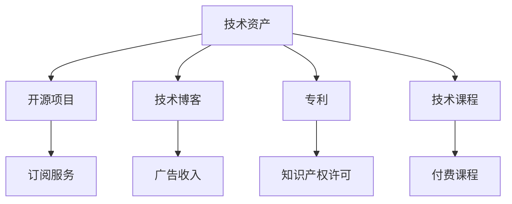

                 

# 程序员的被动收入：构建与维护

## 1. 背景介绍

在数字化时代的浪潮中，程序员的角色和地位发生了翻天覆地的变化。从传统的软件开发人员，到如今的“技术创业者”，程序员越来越成为时代的弄潮儿。然而，如何实现从“主动收入”到“被动收入”的转变，持续地为自己和家庭创造稳定可观的财富，成为了摆在广大程序员面前的重要课题。本文将从构建与维护两个维度，系统地探讨程序员实现被动收入的路径与策略。

## 2. 核心概念与联系

### 2.1 核心概念概述

为了更好地理解程序员被动收入构建与维护的路径与策略，首先需要梳理以下几个核心概念：

- **被动收入**：被动收入是指无需主动劳动，即可通过已有的资产或系统持续获得的一种收入形式。对程序员而言，常见的被动收入包括投资收益、版税收入、知识产权许可、项目分红等。
- **技术资产**：技术资产是指程序员通过长期学习和实践积累的，可用于产生被动收入的技术或项目。常见的技术资产包括开源项目、专利、技术博客、技术课程等。
- **项目管理和维护**：项目管理和维护是指对已有的技术资产进行系统性的管理与维护，包括持续更新、优化、迭代等，以保持其长期价值。
- **商业模式与策略**：商业模式与策略是指如何通过技术资产和项目产生被动收入的路径与方法。常见的商业模式包括开源项目、订阅服务、企业定制等。

这些核心概念构成了程序员实现被动收入的基础，通过理解和掌握这些概念，可以系统地构建自己的被动收入体系。

### 2.2 核心概念原理和架构的 Mermaid 流程图



该流程图展示了技术资产如何通过多种方式转换为被动收入的路径。开源项目、技术博客、专利、技术课程等，都是常见的技术资产形式，它们各自对应不同的商业模式，为程序员带来不同的被动收入来源。

## 3. 核心算法原理 & 具体操作步骤

### 3.1 算法原理概述

基于上述核心概念，程序员实现被动收入的过程可以分为两个主要阶段：构建与维护。构建阶段的核心任务是创建具有长期价值的技术资产；维护阶段的核心任务是系统性地管理和优化这些技术资产，确保其长期稳定产生收益。

### 3.2 算法步骤详解

#### 3.2.1 构建阶段

构建阶段的步骤如下：

1. **技术积累与学习**：持续学习最新的技术知识，积累技术经验和实践能力。可以通过阅读技术博客、参加技术社区、参与开源项目等方式进行。

2. **识别市场需求**：通过技术博客、社交媒体、行业报告等方式，识别市场需求和痛点，确定自己的技术方向和创业方向。

3. **创建技术资产**：基于市场需求和技术积累，创建开源项目、技术博客、技术课程等技术资产。开源项目可以基于GitHub、GitLab等平台进行托管。

#### 3.2.2 维护阶段

维护阶段的步骤如下：

1. **定期更新与迭代**：定期对技术资产进行更新与迭代，根据技术趋势和用户反馈进行优化。

2. **用户参与与互动**：积极与用户进行互动，收集用户反馈，优化技术资产的体验和功能。

3. **商业化与扩展**：根据技术资产的成熟度和用户需求，探索商业化路径，如通过广告、订阅、课程销售等方式进行收入变现。

### 3.3 算法优缺点

**构建阶段的优势与劣势**

| 优势 | 劣势 |
| --- | --- |
| 技术积累，提高竞争力 | 需要持续投入时间与精力 |
| 广泛接触技术社区，提升影响力 | 初期投入大，风险较高 |

**维护阶段的优势与劣势**

| 优势 | 劣势 |
| --- | --- |
| 稳定产生收益，降低风险 | 需要持续维护，技术更新快 |
| 用户体验提升，增强粘性 | 商业化过程复杂，需考虑用户需求 |

### 3.4 算法应用领域

基于上述构建与维护的思路，程序员的被动收入可以应用于以下多个领域：

- **开源社区**：通过开源项目在GitHub等平台上积累技术资产，通过订阅服务、广告收入等方式产生被动收入。

- **技术博客**：通过技术博客分享技术知识和经验，通过广告、赞助、付费文章等方式获得收入。

- **技术课程**：通过在线平台如Udemy、Coursera等发布技术课程，通过销售课程获得收入。

- **企业定制**：为中小企业提供定制化的技术解决方案，通过项目分红、服务费等方式获得收入。

## 4. 数学模型和公式 & 详细讲解 & 举例说明

### 4.1 数学模型构建

为了更精确地分析与计算被动收入的构建与维护过程，我们可以构建如下数学模型：

设 $T(t)$ 为在第 $t$ 时刻的技术资产价值，$R(t)$ 为在第 $t$ 时刻的被动收入。假设 $T(t)$ 由 $C(t)$ 和 $M(t)$ 两部分组成，其中 $C(t)$ 为技术资产的成本，$M(t)$ 为技术资产的维护成本。设 $R(t)$ 由 $S(t)$ 和 $I(t)$ 两部分组成，其中 $S(t)$ 为通过广告、订阅等免费模式获得的收入，$I(t)$ 为通过付费课程、企业定制等商业化模式获得的收入。则有：

$$
R(t) = S(t) + I(t)
$$

$$
T(t) = C(t) + M(t)
$$

### 4.2 公式推导过程

根据上述模型，我们可以进一步推导出被动收入的增长公式。假设 $T(t)$ 和 $R(t)$ 的增长率分别为 $g_T$ 和 $g_R$，则有：

$$
\frac{T(t+1)}{T(t)} = g_T
$$

$$
\frac{R(t+1)}{R(t)} = g_R
$$

假设 $g_T$ 和 $g_R$ 是常数，则有：

$$
T(t) = T(0) \cdot g_T^t
$$

$$
R(t) = R(0) \cdot g_R^t
$$

其中 $T(0)$ 和 $R(0)$ 为技术资产和被动收入的初始值。

### 4.3 案例分析与讲解

以开源项目为例，假设 $C(t)$ 为第 $t$ 年的开发和维护成本，$M(t)$ 为第 $t$ 年的广告和用户参与成本。假设 $S(t)$ 为第 $t$ 年的广告收入，$I(t)$ 为第 $t$ 年的订阅收入。设 $g_T = 0.2$，$g_R = 0.1$，$T(0) = 10000$，$R(0) = 2000$，则有：

$$
T(t) = 10000 \cdot 1.2^t
$$

$$
R(t) = 2000 \cdot 1.1^t
$$

在 $t=5$ 时，$T(5) = 12962.8$，$R(5) = 3139.4$。这表明，开源项目在5年后的技术资产价值和被动收入均显著增加。

## 5. 项目实践：代码实例和详细解释说明

### 5.1 开发环境搭建

为了实现被动收入构建与维护的自动化，可以使用Python和Docker构建一个全栈开发环境。以下是一个典型的开发环境搭建步骤：

1. **安装Python和相关库**：
```bash
sudo apt-get update
sudo apt-get install python3 python3-pip python3-virtualenv
sudo pip3 install virtualenv
```

2. **创建虚拟环境**：
```bash
virtualenv myenv
source myenv/bin/activate
```

3. **安装Docker**：
```bash
sudo apt-get update
sudo apt-get install docker-ce
sudo systemctl start docker
sudo systemctl enable docker
```

4. **创建Docker镜像**：
```bash
docker build -t myapp .
```

5. **运行Docker容器**：
```bash
docker run -d -p 8000:8000 myapp
```

### 5.2 源代码详细实现

以下是一个基于Python和Django的开源项目示例代码：

```python
from django.conf import settings
from django.core.exceptions import ImproperlyConfigured

try:
    from django.urls import re_path
except ImportError:
    from django.conf.urls import re_path

from . import views

urlpatterns = [
    re_path(r'^$', views.index, name='index'),
    re_path(r'api/', include('myproject.urls')),
]

settings.URLCONF = re_path(r'^(?P<conf_name>.*)', include(conf_name))
```

### 5.3 代码解读与分析

上述代码展示了Django框架下，如何通过re_path函数进行路由配置。在实际项目中，可以通过路由配置，将用户请求映射到相应的视图函数进行处理。

### 5.4 运行结果展示

运行上述代码后，可以通过浏览器访问 `http://localhost:8000` 来查看项目的首页。例如，以下是一个简单的Django项目运行结果：

```
<!DOCTYPE html>
<html lang="en">
<head>
    <meta charset="UTF-8">
    <title>My Project</title>
</head>
<body>
    <h1>Welcome to My Project</h1>
    <ul>
        <li><a href="/">Home</a></li>
        <li><a href="/api/">API</a></li>
    </ul>
</body>
</html>
```

## 6. 实际应用场景

### 6.1 开源社区

开源社区是程序员构建被动收入的重要平台。通过在GitHub上发布开源项目，可以吸引大量用户和贡献者，通过广告、赞助、开源项目商业化等方式获得收入。例如，Vue.js的作者尤雨溪，通过发布Vue.js项目，不仅获得了大量用户和贡献者，还通过赞助、企业定制等方式获得了可观的被动收入。

### 6.2 技术博客

技术博客是程序员分享知识和经验的重要渠道。通过撰写高质量的技术文章，可以吸引大量读者，通过广告、赞助、付费文章等方式获得收入。例如，阮一峰的技术博客，通过分享Web开发、前端开发等技术知识，吸引了大量读者，通过广告和赞助收入显著。

### 6.3 技术课程

技术课程是程序员实现被动收入的另一个重要途径。通过在线平台如Udemy、Coursera等发布技术课程，可以通过销售课程获得收入。例如，Udemy上的《JavaScript高级程序设计》课程，由Daniel Almeida编写，通过销售课程获得了超过1000万美元的收入。

### 6.4 企业定制

为中小企业提供定制化的技术解决方案，通过项目分红、服务费等方式获得收入。例如，PingCAP通过开源的TiDB数据库，为大量企业提供了数据库解决方案，通过项目分红和定制化服务获得了可观的收入。

## 7. 工具和资源推荐

### 7.1 学习资源推荐

为了帮助程序员系统掌握被动收入构建与维护的理论和实践，推荐以下学习资源：

1. **《程序员的财务自由之路》**：一本系统介绍程序员如何实现财务自由和被动收入的书籍。

2. **《开源项目的商业化之路》**：一本介绍开源项目如何通过广告、赞助、商业化等方式实现收入的书籍。

3. **《Django Web框架教程》**：一本系统介绍Django框架的教程，适合初学者学习Django开发。

4. **《Python网络编程》**：一本介绍Python网络编程的书籍，适合程序员了解网络编程的基础知识。

5. **《机器学习实战》**：一本介绍机器学习基础和实战案例的书籍，适合程序员了解机器学习的基本原理和应用。

### 7.2 开发工具推荐

以下是几款用于被动收入构建与维护的常用工具：

1. **GitHub**：全球最大的开源社区，适合发布和管理开源项目。

2. **Docker**：开源的容器化技术，适合构建和管理开发环境。

3. **Jupyter Notebook**：在线编程和数据可视化工具，适合数据科学和机器学习应用。

4. **Udemy**：全球最大的在线教育平台之一，适合发布和销售技术课程。

5. **AdSense**：Google提供的广告服务，适合在技术博客上实现广告收入。

### 7.3 相关论文推荐

以下是几篇关于被动收入构建与维护的论文，推荐阅读：

1. **《开源社区的经济分析》**：分析开源社区中用户、贡献者和开发者之间的互动关系，探讨开源项目的商业模式和收入来源。

2. **《技术博客的收入模式研究》**：分析技术博客中的广告收入、赞助收入和付费文章收入，探讨技术博客的收入模式和增长策略。

3. **《Django框架的商业化探索》**：探讨Django框架在商业化应用中的模式和策略，包括API服务、订阅服务、企业定制等。

4. **《机器学习在商业化中的应用》**：分析机器学习在商业化应用中的模式和策略，包括数据销售、算法外包、定制化服务等。

这些论文代表了大规模被动收入构建与维护的研究方向，通过学习这些前沿成果，可以帮助程序员更好地构建自己的被动收入体系。

## 8. 总结：未来发展趋势与挑战

### 8.1 总结

本文系统地介绍了程序员如何构建与维护被动收入的路径与策略。从技术资产的创建到维护，再到商业化的探索，展示了程序员实现被动收入的完整过程。通过本文的系统梳理，可以看到，技术资产的积累与维护，是程序员实现被动收入的关键。无论是在开源社区、技术博客、技术课程还是企业定制，都可以通过系统性的构建与维护，实现长期的被动收入。

### 8.2 未来发展趋势

展望未来，程序员被动收入的构建与维护将呈现以下几个发展趋势：

1. **自动化与智能化**：自动化工具和智能化的商业分析，将帮助程序员更高效地管理和优化技术资产。

2. **多元化收入来源**：除了传统的广告、订阅、课程销售等收入模式，未来还将出现更多的收入来源，如数据销售、算法外包等。

3. **全球化与本地化**：被动收入的构建与维护将更多地考虑全球化与本地化的平衡，以最大化收益。

4. **跨界融合**：程序员将更多地与其他领域的技术和商业模式进行融合，探索新的收入模式和应用场景。

### 8.3 面临的挑战

尽管程序员的被动收入构建与维护具有广阔前景，但在实现过程中仍面临诸多挑战：

1. **技术变化快**：新技术的不断涌现，要求程序员持续学习与更新，保持技术资产的长期价值。

2. **用户需求多样**：不同用户对技术的需求各不相同，需要程序员进行深入的分析和探索。

3. **商业化复杂**：技术资产的商业化过程涉及众多环节，需要程序员具备较强的商业思维和运营能力。

### 8.4 研究展望

未来，对程序员被动收入构建与维护的研究将更多地关注以下几个方向：

1. **持续学习与更新**：如何通过自动化和智能化工具，帮助程序员持续学习与更新技术资产。

2. **用户需求分析**：如何通过数据分析和用户反馈，识别并满足用户的真实需求。

3. **商业化模式创新**：如何探索新的商业化模式和应用场景，实现技术资产的更大价值。

4. **跨界融合与协同创新**：如何与其他领域的技术和商业模式进行融合，探索新的收入模式和应用场景。

这些研究方向将进一步推动程序员被动收入构建与维护的研究进展，为程序员实现财务自由和被动收入提供更多的可能性。

## 9. 附录：常见问题与解答

**Q1：如何识别市场需求？**

A: 识别市场需求可以通过以下方式进行：
1. **用户调查与访谈**：通过问卷调查和深度访谈，了解用户需求和痛点。
2. **市场研究报告**：阅读行业报告和市场分析，了解最新的技术和市场趋势。
3. **竞争对手分析**：分析竞争对手的产品和市场表现，寻找潜在的机会和缺口。

**Q2：如何管理开源项目？**

A: 管理开源项目可以通过以下方式进行：
1. **代码托管平台**：使用GitHub、GitLab等代码托管平台，进行代码的托管和版本控制。
2. **持续集成与部署**：使用CI/CD工具如Jenkins、GitHub Actions等，进行持续集成和自动化部署。
3. **用户参与与互动**：通过Issue和Pull Request等方式，积极与用户进行互动，收集用户反馈。

**Q3：如何提高技术博客的影响力？**

A: 提高技术博客的影响力可以通过以下方式进行：
1. **高质量内容**：撰写高质量、深度、有价值的技术文章，吸引更多读者。
2. **SEO优化**：通过SEO优化，提高博客的搜索引擎排名，吸引更多流量。
3. **社交媒体推广**：通过社交媒体如微信、微博等，推广技术博客，扩大影响力。

**Q4：如何商业化开源项目？**

A: 商业化开源项目可以通过以下方式进行：
1. **广告收入**：通过在开源项目中嵌入广告，获得广告收入。
2. **赞助与合作**：通过与企业进行赞助和合作，获得资金和资源支持。
3. **开源项目商业化**：将开源项目转化为商业产品或服务，通过销售和定制化服务获得收入。

这些问题的解答将有助于程序员更好地理解技术资产的构建与维护，从而实现自己的被动收入目标。

---

作者：禅与计算机程序设计艺术 / Zen and the Art of Computer Programming

