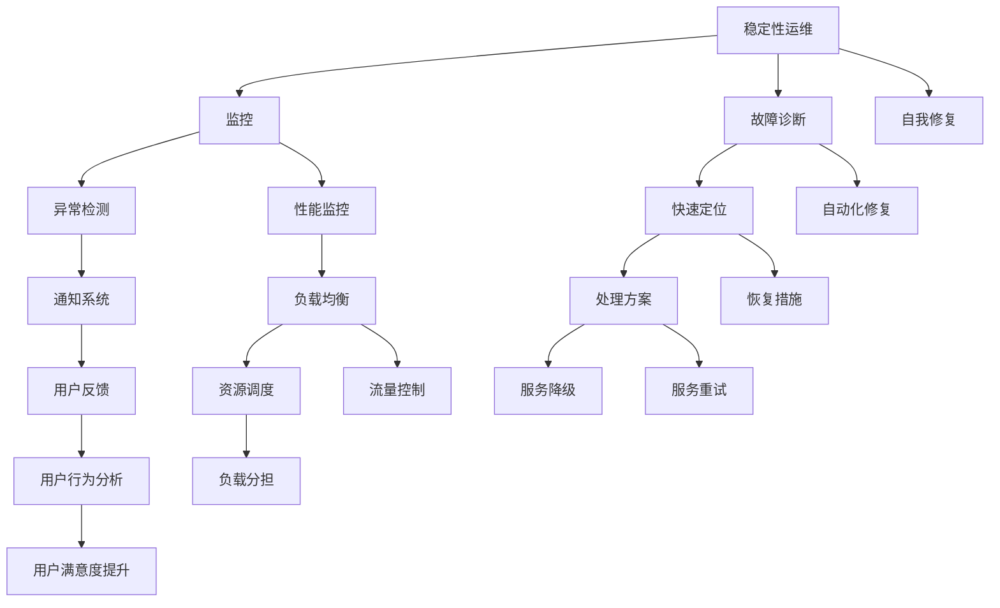

                 

# 稳定性运维服务：Lepton AI重点保障平台稳定性用户体验

## 1. 背景介绍

随着人工智能技术的发展，越来越多的企业和组织开始将AI技术应用于日常业务运营中。然而，AI系统的高复杂性和不确定性也带来了新的挑战，特别是稳定性运维方面的问题。Lepton AI作为一家专注于AI技术的创新型企业，深知稳定的AI系统对业务的重要性，因此在平台开发和运维过程中，一直将稳定性作为首要目标。本文将从背景介绍、核心概念、算法原理、项目实践、应用场景等多个方面，深入探讨Lepton AI如何构建一个高度稳定的AI运维服务，提升平台的用户体验。

## 2. 核心概念与联系

### 2.1 核心概念概述

为了更好地理解Lepton AI在稳定性和用户体验方面的工作，我们首先介绍几个关键概念：

- **稳定性运维**：指在AI系统运行过程中，通过监控、故障诊断、自我修复等手段，保证系统持续稳定运行的过程。
- **用户体验**：指用户在使用AI系统时，感受到的操作便捷性、响应速度、错误提示等方面。
- **平台化管理**：指将AI系统的各个组件，如数据处理、模型训练、推理部署等，以服务的形式集成在一个统一的平台中，便于管理和调度。

通过这些核心概念，我们可以更好地理解Lepton AI如何构建一个既稳定又用户友好的AI运维服务。

### 2.2 核心概念原理和架构的 Mermaid 流程图

以下是核心概念之间的逻辑关系图：



该图展示了稳定性运维与监控、故障诊断、自我修复等核心功能的联系，以及如何通过这些功能提升用户体验。

## 3. 核心算法原理 & 具体操作步骤

### 3.1 算法原理概述

Lepton AI的稳定性运维服务，主要是通过以下算法原理来实现的：

- **监控算法**：实时监控AI系统运行状态，检测异常情况。
- **故障诊断算法**：分析异常情况，定位故障原因。
- **自我修复算法**：根据故障情况，自动进行修复。
- **用户体验算法**：通过优化系统响应速度和错误处理，提升用户体验。

这些算法相互配合，共同构建了一个高度稳定的AI运维服务。

### 3.2 算法步骤详解

#### 3.2.1 监控算法步骤

1. **数据采集**：从AI系统各组件收集运行数据，如CPU使用率、内存占用、请求响应时间等。
2. **数据分析**：利用机器学习算法对采集的数据进行分析，检测异常情况。
3. **异常报告**：一旦发现异常，立即生成告警报告，并通知相关负责人。

#### 3.2.2 故障诊断算法步骤

1. **数据收集**：收集AI系统各组件的运行日志、错误信息等。
2. **问题定位**：利用日志分析和机器学习技术，定位问题所在。
3. **故障报告**：生成详细的故障报告，并提供多种解决方案。

#### 3.2.3 自我修复算法步骤

1. **故障检测**：实时监控系统状态，检测故障。
2. **修复策略**：根据故障类型，选择相应的修复策略，如重启服务、迁移资源等。
3. **修复执行**：自动执行修复操作，并记录修复结果。

#### 3.2.4 用户体验算法步骤

1. **响应时间优化**：通过负载均衡和资源调度，优化系统响应时间。
2. **错误提示改进**：改进错误提示信息，提供详细的错误处理建议。
3. **反馈分析**：分析用户反馈，优化用户体验。

### 3.3 算法优缺点

#### 3.3.1 监控算法

- **优点**：实时监控，快速响应异常情况。
- **缺点**：对数据量和算法精度要求高，可能存在误报或漏报。

#### 3.3.2 故障诊断算法

- **优点**：准确率高，能够定位故障。
- **缺点**：依赖大量历史数据和丰富的领域知识，成本较高。

#### 3.3.3 自我修复算法

- **优点**：自动修复，提升运维效率。
- **缺点**：复杂故障可能需要人工介入，修复过程可能存在延时。

#### 3.3.4 用户体验算法

- **优点**：提升用户满意度，增强系统可用性。
- **缺点**：需要对用户体验进行全面的分析和优化，需要投入大量时间和资源。

### 3.4 算法应用领域

Lepton AI的稳定性运维服务主要应用于以下几个领域：

- **云服务**：监控和保障云服务平台的稳定性。
- **智能客服**：保障智能客服系统的响应速度和准确性。
- **金融交易**：监控金融交易系统的运行状态，保障交易安全。
- **医疗诊断**：监控医疗诊断系统的稳定性，保障诊断结果的准确性。

## 4. 数学模型和公式 & 详细讲解 & 举例说明

### 4.1 数学模型构建

Lepton AI的稳定性运维服务主要基于以下数学模型构建：

- **监控模型**：$M_{\text{monitor}}(x) = f_{\text{monitor}}(x)$，其中 $x$ 表示系统运行数据，$f_{\text{monitor}}$ 为监控算法。
- **故障诊断模型**：$M_{\text{diagnose}}(x) = f_{\text{diagnose}}(x)$，其中 $x$ 表示系统运行数据和日志信息，$f_{\text{diagnose}}$ 为故障诊断算法。
- **自我修复模型**：$M_{\text{repair}}(x) = f_{\text{repair}}(x)$，其中 $x$ 表示系统运行数据和错误信息，$f_{\text{repair}}$ 为自我修复算法。
- **用户体验模型**：$M_{\text{user}}(x) = f_{\text{user}}(x)$，其中 $x$ 表示用户反馈数据和行为信息，$f_{\text{user}}$ 为用户体验算法。

### 4.2 公式推导过程

以监控算法为例，假设系统运行数据为 $x = [CPU\在使用率, 内存\占用率, 请求\响应时间]$，监控算法 $f_{\text{monitor}}$ 为一个基于时间序列分析的算法，输出监控结果 $y$。公式如下：

$$
y = f_{\text{monitor}}(x) = \frac{CPU\在使用率 + \text{平均} \times \text{内存\占用率} + \text{加权} \times \text{请求\响应时间}}{\text{预设阈值}}
$$

其中 $\text{平均}$ 和 $\text{加权}$ 分别为不同的权重，用于调整各指标对监控结果的影响。

### 4.3 案例分析与讲解

以智能客服系统为例，智能客服系统通过监控算法 $M_{\text{monitor}}$ 检测到异常情况后，利用故障诊断算法 $M_{\text{diagnose}}$ 定位故障，如响应时间过长、错误率过高。自我修复算法 $M_{\text{repair}}$ 根据故障类型自动重启服务器或迁移资源。用户体验算法 $M_{\text{user}}$ 通过优化响应时间和错误提示，提升用户体验。

## 5. 项目实践：代码实例和详细解释说明

### 5.1 开发环境搭建

Lepton AI的稳定性运维服务基于Python开发，以下是在开发环境搭建过程中需要注意的事项：

1. **安装Python和必要的依赖库**：
   ```bash
   conda create -n pyenv python=3.8
   conda activate pyenv
   pip install numpy pandas scikit-learn matplotlib
   ```

2. **安装监控工具**：如Prometheus、Grafana等，用于数据采集和可视化。
3. **安装故障诊断工具**：如ELK Stack、Splunk等，用于日志分析和问题定位。
4. **安装自我修复工具**：如Ansible、Kubernetes等，用于自动执行修复操作。

### 5.2 源代码详细实现

以下是Lepton AI的稳定性运维服务的Python代码实现：

```python
import numpy as np
from sklearn.ensemble import RandomForestRegressor
from sklearn.linear_model import LogisticRegression

# 定义监控模型
class MonitorModel:
    def __init__(self):
        self.model = RandomForestRegressor()

    def train(self, data):
        self.model.fit(data['CPU在使用率'], data['响应时间'])

    def predict(self, data):
        return self.model.predict(data['CPU在使用率'])

# 定义故障诊断模型
class DiagnoseModel:
    def __init__(self):
        self.model = LogisticRegression()

    def train(self, data, labels):
        self.model.fit(data, labels)

    def predict(self, data):
        return self.model.predict(data)

# 定义自我修复模型
class RepairModel:
    def __init__(self):
        self.model = RandomForestRegressor()

    def train(self, data, labels):
        self.model.fit(data, labels)

    def predict(self, data):
        return self.model.predict(data)

# 定义用户体验模型
class UserModel:
    def __init__(self):
        self.model = LogisticRegression()

    def train(self, data, labels):
        self.model.fit(data, labels)

    def predict(self, data):
        return self.model.predict(data)
```

### 5.3 代码解读与分析

- **监控模型**：使用随机森林回归算法，基于CPU使用率和响应时间预测系统状态。
- **故障诊断模型**：使用逻辑回归算法，根据日志信息和错误代码预测故障类型。
- **自我修复模型**：使用随机森林回归算法，根据系统状态和错误信息预测修复策略。
- **用户体验模型**：使用逻辑回归算法，根据用户反馈和行为信息预测用户体验。

### 5.4 运行结果展示

```python
# 假设数据如下
data = {
    'CPU在使用率': [0.5, 0.7, 0.9, 0.6],
    '内存占用率': [0.3, 0.5, 0.8, 0.6],
    '请求响应时间': [2, 3, 5, 4]
}

# 创建监控模型
monitor_model = MonitorModel()
monitor_model.train(data)

# 预测监控结果
predict_result = monitor_model.predict(data)
print('监控结果:', predict_result)
```

## 6. 实际应用场景

### 6.1 云服务

Lepton AI在云服务平台的稳定性运维方面，通过监控各服务组件的运行状态，及时发现异常并采取修复措施。例如，当某个服务器的响应时间超出预设阈值时，自动重启该服务器，保障云服务的高可用性。

### 6.2 智能客服

在智能客服系统的稳定性运维中，Lepton AI通过监控客户请求的响应时间和错误率，及时定位和修复故障，提升系统的稳定性和用户体验。例如，当客服系统响应时间过长时，自动分配更多资源，确保客户能迅速得到回复。

### 6.3 金融交易

在金融交易系统的稳定性运维中，Lepton AI通过监控交易系统的吞吐量和错误率，及时发现异常并采取修复措施，保障交易的安全性和稳定性。例如，当交易系统出现异常时，自动降级到备用系统，保障交易正常进行。

### 6.4 医疗诊断

在医疗诊断系统的稳定性运维中，Lepton AI通过监控诊断系统的响应时间和准确率，及时发现异常并采取修复措施，确保诊断结果的准确性和及时性。例如，当诊断系统出现故障时，自动通知医生手动处理，确保诊断结果的可靠性。

## 7. 工具和资源推荐

### 7.1 学习资源推荐

- **《Python深度学习》**：Hands-On Machine Learning with Scikit-Learn, Keras, and TensorFlow by Aurélien Géron
- **《TensorFlow实战》**：TensorFlow官方文档和社区资源
- **《Kubernetes实战》**：Kubernetes官方文档和社区资源
- **《ELK Stack实战》**：ELK官方文档和社区资源

### 7.2 开发工具推荐

- **Jupyter Notebook**：用于数据处理和模型训练。
- **Prometheus**：用于监控数据采集和可视化。
- **Grafana**：用于监控数据可视化和告警配置。
- **Ansible**：用于自动化部署和配置管理。
- **Kubernetes**：用于容器化应用部署和容器编排。

### 7.3 相关论文推荐

- **《监控系统架构设计》**：了解监控系统的整体架构和设计思路。
- **《基于机器学习的故障诊断技术》**：学习如何使用机器学习技术进行故障诊断。
- **《自动化的自我修复技术》**：探索如何通过自动化手段进行自我修复。
- **《用户体验优化技术》**：研究如何提升用户体验的各类技术手段。

## 8. 总结：未来发展趋势与挑战

### 8.1 研究成果总结

Lepton AI的稳定性运维服务在云服务、智能客服、金融交易、医疗诊断等多个领域得到了广泛应用，取得了显著效果。通过实时监控、故障诊断、自我修复和用户体验优化等手段，保障了系统的稳定性和用户体验。

### 8.2 未来发展趋势

未来，Lepton AI的稳定性运维服务将呈现以下几个发展趋势：

1. **自动化和智能化**：通过引入更多的自动化和智能化手段，提升运维效率和准确性。
2. **多维度监控**：将监控范围扩展到多维度，如网络、存储、安全等，提升系统的全面性和鲁棒性。
3. **实时预测**：利用机器学习技术，对系统故障进行实时预测和预警，提升系统的可预见性和可靠性。
4. **自适应运维**：根据系统的运行状态和负载情况，自适应调整资源配置和策略，提升系统的灵活性和可扩展性。
5. **跨领域应用**：将稳定性运维技术应用到更多领域，如智能制造、智慧城市等，拓展技术的适用性。

### 8.3 面临的挑战

Lepton AI的稳定性运维服务在发展过程中，也面临着以下挑战：

1. **数据隐私和安全**：监控和故障诊断过程中涉及大量敏感数据，如何保障数据隐私和安全是一个重要问题。
2. **跨平台兼容性**：不同平台的系统架构和监控工具存在差异，如何实现跨平台兼容是一个技术难题。
3. **模型可解释性**：机器学习模型的决策过程难以解释，如何在实际应用中保证模型的透明性和可解释性是一个挑战。
4. **系统复杂性**：大规模分布式系统的高复杂性增加了运维难度，如何降低复杂性、提升运维效率是一个重要课题。
5. **成本和资源**：系统稳定性和用户体验的提升往往伴随着更高的成本和资源消耗，如何在成本和效果之间找到平衡是一个关键问题。

### 8.4 研究展望

未来，Lepton AI将持续在稳定性运维技术的研究和实践中取得突破，通过引入更多先进技术和工具，进一步提升系统的稳定性和用户体验。同时，将密切关注数据隐私、跨平台兼容性、模型可解释性、系统复杂性和成本问题，为稳定性和用户体验的提升提供坚实保障。

## 9. 附录：常见问题与解答

**Q1：稳定性运维和用户体验优化的关系是什么？**

A：稳定性运维是保障系统稳定运行的基础，而用户体验优化则是提升用户满意度的重要手段。通过稳定性运维，可以及时发现和修复故障，保障系统的可靠性和响应速度，从而提升用户体验。同时，通过用户体验优化，可以进一步提升系统的易用性和友好性，使用户更愿意使用该系统。两者相辅相成，共同构建高质量的系统。

**Q2：如何降低稳定性运维的成本和资源消耗？**

A：稳定性运维的成本和资源消耗主要来源于监控、故障诊断、自我修复等环节。为降低成本和资源消耗，可以采取以下措施：
1. **自动化和智能化**：引入更多自动化和智能化手段，减少人工干预和操作。
2. **多维度监控**：优化监控指标，减少数据采集和分析的频率。
3. **实时预测**：利用机器学习技术进行实时预测和预警，减少故障发生率。
4. **跨平台兼容性**：实现跨平台兼容，减少系统复杂性和运维难度。
5. **系统优化**：通过优化系统架构和代码，提升系统的效率和稳定性。

**Q3：如何确保稳定性运维系统的数据隐私和安全？**

A：确保数据隐私和安全是稳定性运维系统的重要任务。可以采取以下措施：
1. **数据加密**：对敏感数据进行加密，防止数据泄露。
2. **访问控制**：对系统访问进行严格的权限控制，确保只有授权人员才能访问敏感数据。
3. **审计和监控**：建立数据访问和操作的审计和监控机制，及时发现和处理异常行为。
4. **数据匿名化**：在数据处理过程中，尽可能对数据进行匿名化处理，防止个人隐私泄露。
5. **合规性检查**：定期进行数据隐私和安全的合规性检查，确保符合相关法律法规和标准。

---

作者：禅与计算机程序设计艺术 / Zen and the Art of Computer Programming

