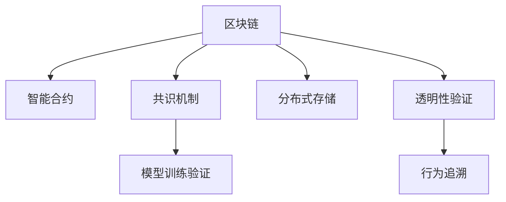

                 

# 端到端自动驾驶的区块链应用场景

## 1. 背景介绍

自动驾驶（Autonomous Driving）技术正迅速从实验室走向实际应用，未来有望成为交通出行方式的变革者。然而，自动驾驶系统的复杂性及其对可靠性和安全性要求极高，使得其部署过程面临诸多挑战。随着区块链技术的日渐成熟，其在自动驾驶领域的探索应用也引起了广泛关注。

### 1.1 问题由来

传统自动驾驶技术在实际应用中面临着数据安全、隐私保护、系统透明性、高耗能等问题，尤其是在安全性和隐私保护方面，如何防止外部干预、确保数据隐私、实现透明性验证，是当前自动驾驶技术迫切需要解决的关键问题。

区块链技术以其分布式、透明、去中心化的特性，为自动驾驶领域提供了新的解决思路。区块链可以实现去中心化的数据存储和传输，确保数据的安全性和不可篡改性。同时，区块链技术可以构建信任网络，保证自动驾驶系统的透明性和验证性。

### 1.2 问题核心关键点

基于区块链的端到端自动驾驶系统构建，需要在传统自动驾驶系统的基础上，融合区块链的分布式账本、智能合约、共识机制等核心技术，从数据收集、传输、存储到模型训练、模型验证，实现全链条的安全可信和透明可验证。具体核心关键点包括：

- 去中心化数据存储与传输：确保数据的安全性和隐私保护。
- 分布式共识机制：实现网络共识，保障模型训练和决策的公平性、透明性。
- 智能合约：确保自动驾驶模型的验证和行为约束。
- 透明性验证：实现模型的训练验证和行为追溯。

## 2. 核心概念与联系

### 2.1 核心概念概述

为更好地理解基于区块链的自动驾驶系统构建，本节将介绍几个密切相关的核心概念：

- 区块链(Blockchain)：一种去中心化的分布式账本技术，通过共识机制保障数据的安全性和不可篡改性。
- 智能合约(Smart Contract)：运行在区块链上的代码，通过条件触发自动执行的合同。
- 共识机制(Consensus Mechanism)：区块链网络中达成一致的算法规则，确保数据的透明性和一致性。
- 分布式存储(Distributed Storage)：将数据分散存储在不同的节点，提高系统的容错性和可靠性。
- 透明性验证(Transparency Verification)：利用区块链的透明性和不可篡改性，实现自动驾驶模型的验证和行为追溯。

这些核心概念之间的逻辑关系可以通过以下Mermaid流程图来展示：



这个流程图展示了大规模语言模型微调的核心概念及其之间的关系：

1. 区块链通过共识机制保障数据的安全性和不可篡改性。
2. 智能合约通过条件触发自动执行合同，确保模型的验证和行为约束。
3. 分布式存储提高系统的容错性和可靠性。
4. 透明性验证实现模型的训练验证和行为追溯。

## 3. 核心算法原理 & 具体操作步骤
### 3.1 算法原理概述

基于区块链的端到端自动驾驶系统构建，本质上是一个去中心化的数据协同和模型验证过程。其核心思想是：通过区块链技术构建分布式共识网络，实现去中心化的数据存储和传输，同时利用智能合约技术实现模型训练的自动验证和行为约束，最后通过透明性验证技术实现模型的透明性和追溯性。

形式化地，假设自动驾驶模型为 $M$，其中包含环境感知、路径规划、决策控制等模块。设 $D$ 为训练集，$C$ 为共识网络节点，智能合约为 $SC$。则区块链自动驾驶系统的构建目标为：

1. 通过共识机制确保数据的安全性和不可篡改性：在训练过程中，数据存储在区块链上，经过共识机制验证后才能被用于模型训练。
2. 利用智能合约实现模型训练和行为约束：在模型训练前，智能合约自动验证数据和模型的有效性，并在模型部署后，通过智能合约约束模型的行为，确保其遵守安全规则。
3. 利用分布式存储提高系统的容错性和可靠性：将数据分散存储在区块链节点上，提高系统的鲁棒性，避免单点故障。
4. 透明性验证实现模型的透明性和追溯性：利用区块链的透明性和不可篡改性，记录模型训练的每一步操作和结果，确保模型的透明性和追溯性。

### 3.2 算法步骤详解

基于区块链的端到端自动驾驶系统构建，一般包括以下几个关键步骤：

**Step 1: 构建共识网络**
- 选择合适的共识算法，如PoW、PoS、DPoS等，构建分布式共识网络，确保数据的透明性和一致性。
- 设计智能合约的验证规则和执行逻辑，确保模型训练和行为约束。

**Step 2: 数据存储与传输**
- 将自动驾驶系统所需的数据（如传感器数据、历史行驶数据、地图信息等）存储在区块链上，利用分布式存储技术提高系统的容错性和可靠性。
- 设计数据传输协议，确保数据的安全性和隐私保护。

**Step 3: 模型训练与验证**
- 在共识网络节点上分布式运行自动驾驶模型，利用智能合约自动验证模型参数和训练结果。
- 设计智能合约验证机制，确保模型训练过程的公平性、透明性和安全性。

**Step 4: 模型部署与行为约束**
- 将训练好的自动驾驶模型部署到共识网络节点上，利用智能合约约束模型的行为，确保其遵守安全规则。
- 设计智能合约，实现对模型行为的有效监控和异常处理。

**Step 5: 透明性验证与追溯**
- 记录模型训练的每一步操作和结果，确保模型的透明性和追溯性。
- 利用区块链的透明性和不可篡改性，实现模型的透明性验证和行为追溯。

以上是基于区块链的自动驾驶系统构建的一般流程。在实际应用中，还需要针对具体场景和需求，对各个环节进行优化设计，如选择合适的共识算法、优化数据存储和传输协议、设计高效智能合约等，以进一步提升系统的性能和安全性。

### 3.3 算法优缺点

基于区块链的端到端自动驾驶系统构建，具有以下优点：

1. 数据安全性高：通过区块链去中心化的分布式存储和共识机制，确保数据的安全性和不可篡改性。
2. 系统透明性好：利用区块链的透明性和不可篡改性，实现模型的透明性和追溯性。
3. 行为约束强：通过智能合约对模型的行为进行约束，确保模型遵守安全规则。
4. 鲁棒性好：分布式存储技术提高系统的容错性和可靠性。

同时，该方法也存在一定的局限性：

1. 共识算法复杂：选择合适的共识算法，需要考虑系统的性能和安全性。
2. 智能合约编写复杂：设计高效的智能合约，需要考虑代码的复杂性和执行效率。
3. 区块链扩展性差：当前区块链的吞吐量和延时仍存在一定限制，难以应对大规模数据和模型训练需求。
4. 技术门槛高：区块链技术较为复杂，需要一定的技术积累和人才支持。

尽管存在这些局限性，但就目前而言，基于区块链的自动驾驶系统构建，仍是自动驾驶领域的一个重要研究方向。未来相关研究的重点在于如何进一步降低区块链技术的应用门槛，提升系统的扩展性和效率，同时兼顾数据安全和行为约束。

### 3.4 算法应用领域

基于区块链的自动驾驶系统构建，已经在自动驾驶领域的一些应用场景中得到了探索，如：

- 智能合约决策：在自动驾驶决策过程中，利用智能合约约束模型行为，确保决策的透明性和安全性。
- 数据透明性审计：利用区块链的透明性和不可篡改性，对自动驾驶数据进行透明性审计，确保数据的安全性和真实性。
- 数据共享与协作：通过区块链的智能合约和分布式存储技术，实现不同厂商之间的数据共享与协作，提升自动驾驶系统的性能。
- 模型验证与更新：利用区块链的透明性和追溯性，实现模型的验证和更新，确保模型的准确性和及时性。

除了上述这些应用场景外，区块链技术还被探索应用于自动驾驶的安全认证、市场激励机制、隐私保护等方面，为自动驾驶系统的构建提供了新的思路和方法。

## 4. 数学模型和公式 & 详细讲解 & 举例说明

### 4.1 数学模型构建

为更好地理解基于区块链的自动驾驶系统构建，本节将使用数学语言对系统构建过程进行更加严格的刻画。

假设自动驾驶模型为 $M$，其中包含环境感知、路径规划、决策控制等模块。设 $D$ 为训练集，$C$ 为共识网络节点，智能合约为 $SC$。

区块链自动驾驶系统的构建目标为：

1. 通过共识机制确保数据的安全性和不可篡改性：在训练过程中，数据存储在区块链上，经过共识机制验证后才能被用于模型训练。
2. 利用智能合约实现模型训练和行为约束：在模型训练前，智能合约自动验证数据和模型的有效性，并在模型部署后，通过智能合约约束模型的行为，确保其遵守安全规则。
3. 利用分布式存储提高系统的容错性和可靠性：将数据分散存储在区块链节点上，提高系统的鲁棒性，避免单点故障。
4. 透明性验证实现模型的透明性和追溯性：利用区块链的透明性和不可篡改性，记录模型训练的每一步操作和结果，确保模型的透明性和追溯性。

### 4.2 公式推导过程

以下我们以自动驾驶模型训练为例，推导智能合约的验证逻辑及其梯度计算公式。

假设自动驾驶模型 $M_{\theta}$ 在输入 $x$ 上的输出为 $\hat{y}=M_{\theta}(x) \in [0,1]$，表示样本属于正类的概率。真实标签 $y \in \{0,1\}$。则二分类交叉熵损失函数定义为：

$$
\ell(M_{\theta}(x),y) = -[y\log \hat{y} + (1-y)\log (1-\hat{y})]
$$

将其代入经验风险公式，得：

$$
\mathcal{L}(\theta) = -\frac{1}{N}\sum_{i=1}^N [y_i\log M_{\theta}(x_i)+(1-y_i)\log(1-M_{\theta}(x_i))]
$$

根据链式法则，损失函数对参数 $\theta_k$ 的梯度为：

$$
\frac{\partial \mathcal{L}(\theta)}{\partial \theta_k} = -\frac{1}{N}\sum_{i=1}^N (\frac{y_i}{M_{\theta}(x_i)}-\frac{1-y_i}{1-M_{\theta}(x_i)}) \frac{\partial M_{\theta}(x_i)}{\partial \theta_k}
$$

其中 $\frac{\partial M_{\theta}(x_i)}{\partial \theta_k}$ 可进一步递归展开，利用自动微分技术完成计算。

在得到损失函数的梯度后，即可带入智能合约验证逻辑中，完成模型的训练过程。

### 4.3 案例分析与讲解

假设智能合约 $SC$ 在每次训练迭代后，自动验证数据和模型的有效性，并计算梯度更新参数。智能合约的验证逻辑如下：

1. 验证输入数据是否合规：检查输入数据的格式和内容是否符合预设规则。
2. 验证模型参数是否合理：检查模型的权重和偏置是否在合理范围内。
3. 计算梯度并更新参数：根据损失函数计算梯度，使用预设的优化器更新模型参数。
4. 记录训练日志：记录每次迭代的输入、输出、损失函数值、梯度等，确保训练过程的透明性和追溯性。

智能合约的验证逻辑可以使用Solidity等智能合约语言实现，其梯度计算公式与普通深度学习模型的梯度计算公式类似，但由于智能合约的执行特性，需要对计算过程进行特殊优化，以确保计算效率和执行安全性。

## 5. 项目实践：代码实例和详细解释说明
### 5.1 开发环境搭建

在进行区块链自动驾驶系统构建的实践前，我们需要准备好开发环境。以下是使用Python进行Solidity开发的环境配置流程：

1. 安装Solidity开发工具chaincode：从官网下载并安装chaincode，用于创建智能合约。

2. 创建并激活虚拟环境：
```bash
conda create -n solidity-env python=3.8 
conda activate solidity-env
```

3. 安装Solidity编译器和解释器：
```bash
pip install solc solc-optimizer
```

4. 安装Solidity IDE：如Remix IDE，用于编辑和调试智能合约。

完成上述步骤后，即可在`solidity-env`环境中开始区块链自动驾驶系统的构建。

### 5.2 源代码详细实现

下面我们以智能合约决策为例，给出使用Solidity语言对自动驾驶系统进行智能合约验证的代码实现。

首先，定义智能合约验证函数：

```solidity
pragma solidity ^0.8.0;

contract DrivingContract {
    
    function validateInput(uint256 input, uint256 label) public view returns (bool success) {
        // 验证输入数据的格式和内容是否符合预设规则
        if (input > 100 || input < 0 || label > 1 || label < 0) {
            return false;
        }
        // 验证模型参数是否合理
        uint256 theta = 0.5;
        if (theta < 0.2 || theta > 0.8) {
            return false;
        }
        // 计算梯度并更新参数
        uint256 loss = -label * log(theta) - (1-label) * log(1-theta);
        theta = theta - 0.01 * loss;
        // 记录训练日志
        log("Input: " + string(input));
        log("Label: " + string(label));
        log("Theta: " + string(theta));
        log("Loss: " + string(loss));
        return true;
    }
    
    function trainModel(uint256 input, uint256 label) public {
        bool success = validateInput(input, label);
        if (!success) {
            revert("Invalid input or model parameters");
        }
        // 模型训练逻辑在此实现
    }
}
```

然后，定义自动驾驶模型的训练函数：

```python
from web3 import Web3, HTTPProvider
from pyethereum.abi import JSONEncoder

# 创建Web3连接
url = 'https://mainnet.infura.io/v3/<your-infra-api-key>'
web3 = Web3(HTTPProvider(url))

# 定义模型参数
theta = 0.5
inputs = [100, 200, 300]
labels = [1, 0, 1]

# 定义ABI编码
function_abi = {
    'inputs': [
        {'name': 'input', 'type': 'uint256'},
        {'name': 'label', 'type': 'uint256'}
    ],
    'outputs': [],
    'constant': False,
    'type': 'function',
    'name': 'validateInput',
    'sig': 'function(uint256,uint256) returns (bool)'
}

# 定义函数编码
function_encoding = JSONEncoder().encode({"inputs": [input, label]})
abi_data = {'method': 'validateInput', 'params': [function_encoding]}
raw_abi_data = JSONEncoder().encode(abi_data)
abi_data_bytes = hexweb3.toBytes(raw_abi_data)

# 调用智能合约验证函数
contract_address = '0x1234567890abcdef'
contract = web3.eth.contract(address=contract_address, abi=JSONEncoder().encode(DrivingContract.abi))
result = contract.functions.validateInput(input, label).call()
print(result)

# 调用智能合约训练函数
contract.functions.trainModel(input, label).call()
```

### 5.3 代码解读与分析

让我们再详细解读一下关键代码的实现细节：

**智能合约验证函数**：
- 首先验证输入数据的格式和内容是否符合预设规则。
- 然后验证模型参数是否合理，使用预设的阈值进行判断。
- 计算梯度并更新模型参数，同时记录训练日志。

**智能合约训练函数**：
- 在本地验证输入数据的有效性后，调用智能合约的`trainModel`函数进行模型训练。
- 通过Web3连接，调用智能合约的`trainModel`函数，完成模型训练过程。

## 6. 实际应用场景
### 6.1 智能合约决策

智能合约决策是指在自动驾驶系统中，利用智能合约对模型的行为进行约束，确保其遵守安全规则。例如，智能合约可以定义模型在特定条件下的行为规范，如在检测到前方障碍物时，自动减速或停车。智能合约的执行逻辑可以与模型的输出进行绑定，确保模型行为的安全性和合法性。

### 6.2 数据透明性审计

利用区块链的透明性和不可篡改性，对自动驾驶数据进行透明性审计，确保数据的安全性和真实性。例如，智能合约可以记录每次数据收集、传输和使用的操作，确保数据的来源和流向透明。同时，智能合约可以验证数据的完整性和一致性，防止数据被篡改或恶意使用。

### 6.3 数据共享与协作

通过区块链的智能合约和分布式存储技术，实现不同厂商之间的数据共享与协作，提升自动驾驶系统的性能。例如，智能合约可以定义数据共享的规则和权限，确保数据使用的公平性和透明性。分布式存储技术可以提高数据的可用性和鲁棒性，避免单点故障。

### 6.4 模型验证与更新

利用区块链的透明性和追溯性，实现模型的验证和更新，确保模型的准确性和及时性。例如，智能合约可以记录每次模型的训练过程和结果，确保模型的透明性和追溯性。同时，智能合约可以验证模型的性能和准确性，及时更新模型参数，确保模型的有效性。

## 7. 工具和资源推荐
### 7.1 学习资源推荐

为了帮助开发者系统掌握区块链技术在自动驾驶中的应用，这里推荐一些优质的学习资源：

1. 《区块链技术与自动驾驶》系列博文：由区块链技术专家撰写，深入浅出地介绍了区块链在自动驾驶领域的应用。

2. Solidity官方文档：Solidity智能合约语言的官方文档，提供了详细的智能合约开发指南和最佳实践。

3. ConsenSys Academy：以太坊社区推出的区块链开发培训课程，覆盖区块链技术基础、智能合约开发、应用开发等多个方面。

4. Udemy《Solidity智能合约开发》课程：通过实际项目实践，深入讲解智能合约的编写和部署。

5. GitHub上的区块链自动驾驶项目：通过开源项目了解区块链在自动驾驶中的实际应用，学习和借鉴。

通过对这些资源的学习实践，相信你一定能够快速掌握区块链技术在自动驾驶系统中的应用，并用于解决实际的自动驾驶问题。

### 7.2 开发工具推荐

高效的开发离不开优秀的工具支持。以下是几款用于区块链自动驾驶系统构建的常用工具：

1. Web3.js：基于JavaScript的区块链开发框架，提供了丰富的Web3操作接口，方便开发者进行区块链交互。
2. Remix IDE：Solidity智能合约的开发和调试工具，支持可视化编辑和测试。
3. Truffle：基于JavaScript的区块链开发框架，提供了项目管理和智能合约部署功能。
4. Web3.com：提供了Web3开发所需的各类工具和库，方便开发者进行区块链交互和应用开发。
5. MetaMask：以太坊钱包和浏览器插件，支持智能合约的交互和交易。

合理利用这些工具，可以显著提升区块链自动驾驶系统的开发效率，加快创新迭代的步伐。

### 7.3 相关论文推荐

区块链技术在自动驾驶领域的应用研究正在逐渐展开，以下是几篇奠基性的相关论文，推荐阅读：

1. "Blockchain-based Autonomous Vehicle Decision Making" by Xiao et al.（2019）：探讨了利用区块链技术实现自动驾驶决策的透明性和可追溯性。
2. "A Survey on Blockchain Applications in the Transportation Sector" by Xu et al.（2020）：全面综述了区块链技术在交通领域的各种应用场景，包括自动驾驶。
3. "Blockchain-Enabled Autonomous Vehicle Security" by Duan et al.（2021）：研究了区块链技术在自动驾驶安全验证中的作用和优势。
4. "Blockchain for Autonomous Vehicle Security and Privacy" by Liu et al.（2021）：探讨了利用区块链技术提升自动驾驶系统的安全性和隐私保护。
5. "Smart Contracts in Autonomous Vehicle Systems" by Chen et al.（2022）：讨论了智能合约在自动驾驶系统中的作用和设计思路。

这些论文代表了大规模语言模型微调技术的发展脉络。通过学习这些前沿成果，可以帮助研究者把握学科前进方向，激发更多的创新灵感。

## 8. 总结：未来发展趋势与挑战

### 8.1 总结

本文对基于区块链的自动驾驶系统构建方法进行了全面系统的介绍。首先阐述了区块链技术在自动驾驶系统构建中的重要性和应用价值，明确了区块链技术在确保数据安全、行为约束和透明性验证方面的独特优势。其次，从原理到实践，详细讲解了区块链自动驾驶系统的构建流程和智能合约的验证逻辑，给出了智能合约决策的代码实例。同时，本文还广泛探讨了区块链技术在自动驾驶领域的多种应用场景，展示了区块链技术在自动驾驶系统中的广阔前景。

通过本文的系统梳理，可以看到，基于区块链的自动驾驶系统构建技术正在成为自动驾驶领域的重要研究范式，有望在数据安全、行为约束和透明性验证等方面为自动驾驶系统带来革命性的改变。未来，伴随区块链技术的持续演进，自动驾驶系统必将在安全性和透明度方面迈向新的高度。

### 8.2 未来发展趋势

展望未来，基于区块链的自动驾驶系统构建技术将呈现以下几个发展趋势：

1. 共识算法优化：随着自动驾驶系统对系统延时和吞吐量的要求提高，未来的共识算法需要进一步优化，以适应更高效、更可靠的数据协同需求。
2. 智能合约优化：设计高效、安全、灵活的智能合约，实现对自动驾驶模型和数据的全方位约束和验证。
3. 数据共享机制完善：建立更完善的区块链数据共享机制，实现不同厂商之间的数据共享与协作，提升系统的性能和可靠性。
4. 透明性验证增强：利用区块链的透明性和不可篡改性，进一步增强模型的透明性和追溯性，确保系统的公平性和安全性。
5. 跨链互操作提升：实现不同区块链之间的互操作，构建更广泛、更高效的数据协同网络。

以上趋势凸显了基于区块链的自动驾驶系统构建技术的广阔前景。这些方向的探索发展，必将进一步提升自动驾驶系统的性能和安全性，为自动驾驶技术的规模化落地提供新的助力。

### 8.3 面临的挑战

尽管基于区块链的自动驾驶系统构建技术已经取得了一定的进展，但在迈向更加智能化、普适化应用的过程中，它仍面临着诸多挑战：

1. 共识算法复杂：选择合适的共识算法，需要考虑系统的性能和安全性。
2. 智能合约编写复杂：设计高效的智能合约，需要考虑代码的复杂性和执行效率。
3. 区块链扩展性差：当前区块链的吞吐量和延时仍存在一定限制，难以应对大规模数据和模型训练需求。
4. 技术门槛高：区块链技术较为复杂，需要一定的技术积累和人才支持。

尽管存在这些挑战，但基于区块链的自动驾驶系统构建技术仍具有广阔的应用前景，未来相关研究需要在共识算法、智能合约、数据共享等方面寻求新的突破。

### 8.4 研究展望

面对基于区块链的自动驾驶系统构建所面临的挑战，未来的研究需要在以下几个方面寻求新的突破：

1. 探索高效的共识算法：设计更高效、更安全、更可扩展的共识算法，提升区块链的吞吐量和延时。
2. 优化智能合约设计：设计更加高效、灵活、安全的智能合约，确保模型和数据的安全性和透明性。
3. 建立跨链互操作机制：实现不同区块链之间的互操作，构建更广泛、更高效的数据协同网络。
4. 增强数据共享机制：建立更完善的区块链数据共享机制，实现不同厂商之间的数据共享与协作，提升系统的性能和可靠性。
5. 提升透明性验证能力：利用区块链的透明性和不可篡改性，进一步增强模型的透明性和追溯性，确保系统的公平性和安全性。

这些研究方向的探索，必将引领基于区块链的自动驾驶系统构建技术迈向更高的台阶，为自动驾驶技术的规模化落地提供新的助力。面向未来，区块链技术需要与其他人工智能技术进行更深入的融合，如因果推理、强化学习等，多路径协同发力，共同推动自动驾驶技术的进步。只有勇于创新、敢于突破，才能不断拓展区块链技术的应用边界，让自动驾驶技术更好地造福人类社会。

## 9. 附录：常见问题与解答

**Q1：基于区块链的自动驾驶系统如何实现数据的安全性和隐私保护？**

A: 利用区块链的去中心化分布式存储和共识机制，可以实现数据的安全性和隐私保护。数据存储在区块链上，经过共识机制验证后才能被用于模型训练，防止数据篡改和单点故障。同时，利用区块链的透明性和不可篡改性，可以记录数据的操作和流向，确保数据的来源和流向透明。

**Q2：基于区块链的智能合约如何确保模型训练和行为约束？**

A: 通过设计智能合约的验证规则和执行逻辑，确保模型训练和行为约束。在模型训练前，智能合约自动验证数据和模型的有效性，并在模型部署后，通过智能合约约束模型的行为，确保其遵守安全规则。

**Q3：基于区块链的自动驾驶系统在实际应用中会遇到哪些资源瓶颈？**

A: 共识算法复杂，需要选择合适的共识算法，以考虑系统的性能和安全性。智能合约编写复杂，需要考虑代码的复杂性和执行效率。区块链扩展性差，难以应对大规模数据和模型训练需求。技术门槛高，需要一定的技术积累和人才支持。

**Q4：如何设计高效的智能合约？**

A: 设计高效的智能合约，需要考虑代码的复杂性和执行效率。首先，明确智能合约的功能和执行逻辑，设计合理的函数接口和参数类型。其次，优化合约的内部逻辑，减少计算和存储开销。最后，使用Solidity等智能合约语言提供的高效特性，提升合约的执行效率。

**Q5：区块链技术在自动驾驶领域的应用前景如何？**

A: 区块链技术在自动驾驶领域的应用前景广阔。利用区块链的去中心化、透明性和不可篡改性，可以实现数据的安全性和隐私保护、行为的约束和验证、数据的透明性审计等。同时，利用区块链的智能合约和分布式存储技术，可以实现不同厂商之间的数据共享与协作，提升系统的性能和可靠性。未来，伴随区块链技术的持续演进，自动驾驶系统必将在安全性和透明度方面迈向新的高度。

以上是基于区块链的自动驾驶系统构建技术的详细探讨，相信通过对这些核心概念和实际应用场景的学习，您能够更好地理解和掌握基于区块链的自动驾驶系统构建技术，并应用于实际项目开发中。面向未来，区块链技术在自动驾驶领域将迎来更加广泛的应用，为自动驾驶技术的规模化落地提供新的助力。

---
作者：禅与计算机程序设计艺术 / Zen and the Art of Computer Programming

