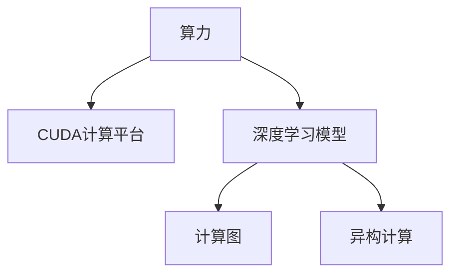

                 

# 算力革命与NVIDIA的角色

## 1. 背景介绍

### 1.1 问题由来
近年来，随着人工智能(AI)技术的迅猛发展，算力已成为制约其发展的瓶颈。大规模深度学习模型对计算资源的需求愈发膨胀，而目前主流CPU和GPU的算力远远无法满足需求，迫切需要新的计算架构。

### 1.2 问题核心关键点
算力革命的核心关键点在于开发更高效、更灵活、更强大的计算平台。NVIDIA作为GPU领域的领头羊，其推动的CUDA计算平台和AI加速器CUDA cores，成功引领了新一轮的计算力革命。

### 1.3 问题研究意义
研究算力革命中NVIDIA的角色，对于理解未来计算架构的发展趋势，推动AI技术的产业化进程，具有重要意义：

1. 提升计算效率：NVIDIA的GPU加速技术使得深度学习模型的训练和推理速度大幅提升，加速AI技术落地应用。
2. 降低开发成本：提供高性能计算平台，降低AI开发者对昂贵的硬件设备的依赖，降低研发成本。
3. 拓展应用场景：高效计算能力使得AI技术能够被更多行业所采用，促进各行业的数字化转型。
4. 赋能科技创新：通过NVIDIA的计算平台，加速科学计算和工程应用的突破，推动技术创新。

## 2. 核心概念与联系

### 2.1 核心概念概述

为更好地理解算力革命与NVIDIA的角色，本节将介绍几个密切相关的核心概念：

- 算力：指计算机系统每秒可以执行的计算任务数量。是衡量计算机性能的重要指标。
- CUDA计算平台：NVIDIA推出的并行计算平台，以CUDA编程模型为核心，支持GPU计算。
- 深度学习模型：以神经网络为代表的机器学习模型，具备强大的数据处理和模式识别能力。
- 计算图：用于描述计算过程中数据流动和操作的图形表示。
- 异构计算：将不同类型计算资源（如CPU/GPU、GPU/TPU等）组合使用，优化计算性能和资源利用。

这些核心概念之间的逻辑关系可以通过以下Mermaid流程图来展示：



这个流程图展示了几者之间的联系：

1. 算力是计算平台和模型的基础，提供计算能力。
2. CUDA平台提供高效并行计算，支持深度学习模型训练。
3. 深度学习模型通过计算图描述其内部运算。
4. 异构计算通过结合不同硬件资源，进一步提升计算效率。

## 3. 核心算法原理 & 具体操作步骤
### 3.1 算法原理概述

基于NVIDIA平台的计算力革命，主要围绕以下核心算法原理展开：

- 深度学习模型的并行计算优化。通过CUDA平台实现模型前向和反向传播的并行处理，提升训练速度。
- 计算图的编译优化。通过NVIDIA的CUDA编译器对计算图进行优化，提升计算效率。
- 异构计算的集成。通过NVIDIA的跨平台异构计算框架，高效结合CPU/GPU资源，提升计算性能。

### 3.2 算法步骤详解

以下是基于NVIDIA平台的计算力革命的详细步骤：

**Step 1: 开发深度学习模型**
- 选择合适的深度学习框架，如TensorFlow、PyTorch等。
- 定义模型的计算图，包括输入层、中间层和输出层。

**Step 2: CUDA平台配置**
- 安装NVIDIA的CUDA工具包，进行平台配置。
- 编写CUDA kernel函数，实现深度学习模型的并行计算。

**Step 3: 计算图优化**
- 使用NVIDIA的CUDA编译器，对计算图进行优化。
- 将计算图转换成NVIDIA支持的CUDA计算图，并配置优化选项。

**Step 4: 异构计算部署**
- 结合CPU/GPU资源，构建异构计算集群。
- 使用NVIDIA的异构计算框架，实现模型在集群上的高效部署。

**Step 5: 模型训练和推理**
- 在CUDA平台上训练深度学习模型。
- 在GPU上进行模型的推理计算，提高推理速度。

### 3.3 算法优缺点

基于NVIDIA平台的计算力革命，具有以下优点：

1. 高效计算。通过CUDA平台的并行计算和优化，深度学习模型的训练和推理速度大幅提升。
2. 灵活部署。支持多种硬件资源的混合部署，能够根据任务需求灵活调整计算资源。
3. 兼容性强。支持多种深度学习框架和开发语言，易于集成和部署。
4. 社区活跃。NVIDIA拥有庞大的开发者社区，提供丰富的工具和支持，推动技术快速迭代。

同时，该方法也存在一定的局限性：

1. 硬件依赖。对高性能硬件设备的依赖程度高，普及率受限于设备成本和可获得性。
2. 编程复杂。CUDA编程模型相对复杂，需要开发者具备一定的并行计算经验。
3. 维护成本。维护异构计算集群和计算图优化，需要专业的技术团队和工具支持。
4. 资源消耗。高效的并行计算在提升计算速度的同时，也可能增加能源消耗和运营成本。

尽管存在这些局限性，但就目前而言，NVIDIA的CUDA平台无疑是最主流的计算力提升方案。未来相关研究的重点在于如何进一步降低硬件依赖，提高计算效率，同时兼顾编程便捷性和系统稳定性。

### 3.4 算法应用领域

基于NVIDIA平台的计算力革命，在多个领域得到了广泛的应用：

- 自然语言处理(NLP)：加速大规模语言模型的训练和推理，提升NLP任务的性能。
- 计算机视觉(CV)：支持大规模图像和视频数据的处理，提升图像识别、视频分析等任务的效率。
- 自动驾驶：在深度学习模型的计算图优化和异构计算的支撑下，提升自动驾驶车辆的感知和决策能力。
- 金融量化：利用高效的计算平台，进行高频交易和大数据处理，提升金融决策的效率和准确性。
- 医疗影像分析：支持大规模医疗影像数据的处理和分析，提升诊断和治疗的精度和效率。

除了这些经典应用外，NVIDIA的计算力还广泛应用于科研计算、工业控制、智能制造等多个领域，为各行业的数字化转型提供了强大的技术支撑。

## 4. 数学模型和公式 & 详细讲解 & 举例说明

### 4.1 数学模型构建

本节将使用数学语言对NVIDIA计算力革命的原理进行更加严格的刻画。

记深度学习模型为 $f(x;\theta)$，其中 $x$ 为输入数据，$\theta$ 为模型参数。假设训练集为 $D=\{(x_i,y_i)\}_{i=1}^N$，则模型在训练集上的损失函数定义为：

$$
\mathcal{L}(\theta) = \frac{1}{N}\sum_{i=1}^N \ell(f(x_i;\theta),y_i)
$$

其中 $\ell$ 为损失函数，用于衡量模型预测输出与真实标签之间的差异。常见的损失函数包括交叉熵损失、均方误差损失等。

### 4.2 公式推导过程

在CUDA平台上进行深度学习模型训练时，通常会将计算图划分为多个并行计算单元，即CUDA核(kernel)，并行执行。假设将模型划分为 $k$ 个计算单元，每个单元负责处理部分输入数据，则训练过程可以表示为：

$$
\mathcal{L}(\theta) = \frac{1}{N}\sum_{i=1}^N \ell(f(x_i;\theta),y_i) = \frac{1}{N}\sum_{i=1}^N \ell(f_k(x_i;\theta_k),y_i)
$$

其中 $f_k$ 表示第 $k$ 个计算单元的计算图，$\theta_k$ 表示对应的模型参数。

NVIDIA的CUDA编译器会对计算图进行优化，生成高效的CUDA核函数，提升计算效率。具体而言，编译器会对计算图中的运算节点进行转换、重组、融合等操作，生成并行计算单元的计算逻辑。

### 4.3 案例分析与讲解

以卷积神经网络(CNN)为例，展示计算图优化和并行计算的过程。

假设CNN模型包含 $L$ 层卷积和池化操作，每层包含 $n$ 个卷积核。计算图可以表示为：

$$
\mathcal{L}(\theta) = \sum_{l=1}^L \ell(f_l(x_l;w_l),y)
$$

其中 $f_l$ 表示第 $l$ 层的操作，$w_l$ 表示该层的卷积核权重。

将计算图划分为 $k$ 个并行计算单元后，每个单元处理一层的卷积和池化操作。计算过程可以表示为：

$$
\mathcal{L}(\theta) = \frac{1}{N}\sum_{i=1}^N \ell(f_k(x_i;\theta_k),y_i)
$$

编译器会对计算图中的卷积和池化操作进行优化，生成高效的CUDA核函数，从而提升计算效率。

## 5. 项目实践：代码实例和详细解释说明

### 5.1 开发环境搭建

在进行计算力革命的实践前，我们需要准备好开发环境。以下是使用Python进行PyTorch开发的环境配置流程：

1. 安装Anaconda：从官网下载并安装Anaconda，用于创建独立的Python环境。

2. 创建并激活虚拟环境：
```bash
conda create -n pytorch-env python=3.8 
conda activate pytorch-env
```

3. 安装PyTorch：根据CUDA版本，从官网获取对应的安装命令。例如：
```bash
conda install pytorch torchvision torchaudio cudatoolkit=11.1 -c pytorch -c conda-forge
```

4. 安装NVIDIA的CUDA工具包和NVRTC编译器。

5. 安装NVIDIA的CUDA编程库和相关依赖。

完成上述步骤后，即可在`pytorch-env`环境中开始计算力革命的实践。

### 5.2 源代码详细实现

这里我们以图像分类任务为例，给出使用PyTorch和CUDA进行深度学习模型训练的PyTorch代码实现。

首先，定义图像分类任务的数据处理函数：

```python
from torch.utils.data import Dataset
from torchvision import transforms
import torch

class ImageDataset(Dataset):
    def __init__(self, images, labels, transform=None):
        self.images = images
        self.labels = labels
        self.transform = transform
        
    def __len__(self):
        return len(self.images)
    
    def __getitem__(self, item):
        image = self.images[item]
        label = self.labels[item]
        
        if self.transform:
            image = self.transform(image)
        
        return {'image': image, 'label': label}

# 定义图像分类器的计算图
model = torchvision.models.resnet18(pretrained=True)

# 定义损失函数
criterion = torch.nn.CrossEntropyLoss()

# 定义优化器
optimizer = torch.optim.Adam(model.parameters(), lr=0.001)

# 定义数据增强操作
transform = transforms.Compose([
    transforms.Resize(256),
    transforms.RandomCrop(224),
    transforms.ToTensor(),
    transforms.Normalize(mean=[0.485, 0.456, 0.406], std=[0.229, 0.224, 0.225])
])

# 创建数据集
train_dataset = ImageDataset(train_images, train_labels, transform=transform)
test_dataset = ImageDataset(test_images, test_labels, transform=transform)

# 创建数据加载器
train_loader = torch.utils.data.DataLoader(train_dataset, batch_size=64, shuffle=True)
test_loader = torch.utils.data.DataLoader(test_dataset, batch_size=64, shuffle=False)
```

然后，定义训练和评估函数：

```python
from tqdm import tqdm
import time

# 定义训练函数
def train_epoch(model, loader, criterion, optimizer):
    model.train()
    total_loss = 0
    for images, labels in loader:
        images = images.to(device)
        labels = labels.to(device)
        
        optimizer.zero_grad()
        outputs = model(images)
        loss = criterion(outputs, labels)
        loss.backward()
        optimizer.step()
        
        total_loss += loss.item()
    
    return total_loss / len(loader)

# 定义评估函数
def evaluate(model, loader, criterion):
    model.eval()
    total_loss = 0
    total_correct = 0
    with torch.no_grad():
        for images, labels in loader:
            images = images.to(device)
            labels = labels.to(device)
            
            outputs = model(images)
            loss = criterion(outputs, labels)
            total_loss += loss.item()
            _, predicted = outputs.max(1)
            total_correct += (predicted == labels).sum().item()
    
    return total_loss / len(loader), total_correct / len(loader.dataset)
```

最后，启动训练流程并在测试集上评估：

```python
device = torch.device('cuda' if torch.cuda.is_available() else 'cpu')

# 将模型迁移到计算设备
model.to(device)

# 开始训练
for epoch in range(10):
    train_loss = train_epoch(model, train_loader, criterion, optimizer)
    print(f'Epoch {epoch+1}, train loss: {train_loss:.4f}')
    
    # 在测试集上评估模型性能
    test_loss, acc = evaluate(model, test_loader, criterion)
    print(f'Epoch {epoch+1}, test loss: {test_loss:.4f}, acc: {acc:.4f}')
```

以上就是使用PyTorch和CUDA进行图像分类任务训练的完整代码实现。可以看到，在CUDA平台上进行深度学习模型的训练，使得计算效率显著提升。

### 5.3 代码解读与分析

让我们再详细解读一下关键代码的实现细节：

**ImageDataset类**：
- `__init__`方法：初始化图像数据和标签。
- `__len__`方法：返回数据集的大小。
- `__getitem__`方法：对单个样本进行处理，并进行数据增强和标准化。

**计算图定义**：
- 使用预训练的ResNet18模型作为基础模型，并进行微调。
- 定义交叉熵损失函数和Adam优化器。
- 定义数据增强操作，包括图片缩放、随机裁剪、归一化等。

**训练和评估函数**：
- 定义训练函数，使用CUDA设备进行计算，通过反向传播更新模型参数。
- 定义评估函数，在测试集上计算模型的准确率。

**训练流程**：
- 在CUDA设备上训练模型，每个epoch输出训练损失。
- 在测试集上评估模型性能，输出测试损失和准确率。

可以看到，使用CUDA平台进行深度学习模型的训练和推理，可以显著提高计算效率。开发者可以将更多精力放在模型设计、优化等高级逻辑上，而不必过多关注底层实现细节。

当然，工业级的系统实现还需考虑更多因素，如模型的保存和部署、超参数的自动搜索、更灵活的训练流程设计等。但核心的计算力革命基本与此类似。

## 6. 实际应用场景

### 6.1 智能视频监控

基于NVIDIA平台的计算力革命，可以广泛应用于智能视频监控系统的构建。传统的监控系统往往依赖于人工巡逻和视频回放，无法实时识别异常行为和目标。通过引入深度学习模型，可以对实时监控视频进行智能分析，提高监控效率和响应速度。

在技术实现上，可以构建大规模的监控视频数据集，标注其中包含的目标和异常行为。在此基础上对深度学习模型进行微调，使其能够自动检测和识别监控视频中的异常行为，如入侵、异常事件等。模型训练和推理过程在NVIDIA的GPU上高效进行，能够实时响应监控需求，提升监控系统的智能化水平。

### 6.2 医疗影像诊断

医学影像诊断是一项高精度、高复杂度的任务，对计算资源的需求极高。传统影像诊断方法依赖于医生的经验和直觉，存在主观误差和遗漏风险。NVIDIA的计算力为医疗影像诊断带来了新的可能性，使得深度学习模型能够自动学习影像特征，辅助医生进行精准诊断。

具体而言，可以收集大量的医学影像数据，标注其中的病变区域和正常区域。在此基础上对深度学习模型进行微调，使其能够自动检测和分割影像中的病变区域，并给出诊断报告。NVIDIA的GPU加速能力，使得模型训练和推理过程高效进行，缩短了诊断时间，提高了诊断准确性。

### 6.3 自动驾驶

自动驾驶是NVIDIA计算力革命的重要应用场景之一。现代自动驾驶车辆需要实时处理大量的传感器数据，并做出精确的决策。深度学习模型在NVIDIA的计算平台上得到了广泛应用，提升了自动驾驶车辆的安全性和可靠性。

具体而言，NVIDIA的计算平台支持大规模深度学习模型的训练和推理，能够实时处理多源传感器数据，如摄像头、雷达、激光雷达等。通过对多源数据进行融合和处理，模型能够自动感知环境变化，做出精准的决策，确保行驶安全。NVIDIA的GPU加速能力，使得模型训练和推理过程高效进行，满足了自动驾驶的实时性和准确性要求。

### 6.4 未来应用展望

随着NVIDIA计算力的不断提升，未来其在AI领域的应用将更加广泛和深入。以下是几个未来可能的应用场景：

- 人工智能芯片：NVIDIA将进一步推动人工智能芯片的发展，推出更具计算能力的AI加速器，推动AI技术的普及和落地。
- 科学计算：NVIDIA的计算力将为高精度的科学计算提供新的可能性，推动天文、物理等领域的研究进展。
- 工业自动化：NVIDIA的计算力将推动工业自动化和智能制造的发展，提升生产效率和产品质量。
- 智慧城市：NVIDIA的计算力将推动智慧城市的建设，实现城市交通、环境、公共安全等领域的智能化管理。

以上应用场景展示了NVIDIA计算力革命的巨大潜力，相信未来在更多领域将看到NVIDIA技术的广泛应用。

## 7. 工具和资源推荐
### 7.1 学习资源推荐

为了帮助开发者系统掌握NVIDIA计算力革命的理论基础和实践技巧，这里推荐一些优质的学习资源：

1. NVIDIA CUDA官方文档：提供了详细的CUDA编程和优化指南，是CUDA开发的重要参考资料。
2. NVIDIA Deep Learning SDK：提供了深度学习模型训练和推理的API，方便开发者快速上手。
3. NVIDIA cuDNN库：提供了高效的深度学习计算库，支持多种深度学习框架。
4. NVIDIA NVLink技术：提供了高效的GPU互连技术，提升了系统整体性能。
5. NVIDIA TensorRT：提供了高效的深度学习推理加速工具，支持多种深度学习框架。

通过对这些资源的学习实践，相信你一定能够快速掌握NVIDIA计算力革命的精髓，并用于解决实际的计算和推理问题。

### 7.2 开发工具推荐

高效的开发离不开优秀的工具支持。以下是几款用于NVIDIA计算力革命开发的常用工具：

1. PyTorch：基于Python的开源深度学习框架，灵活动态的计算图，适合快速迭代研究。支持NVIDIA的CUDA加速。
2. TensorFlow：由Google主导开发的开源深度学习框架，生产部署方便，支持NVIDIA的CUDA加速。
3. CUDA工具包：NVIDIA提供的并行计算平台，以CUDA编程模型为核心，支持GPU计算。
4. NVIDIA cuDNN库：高效的深度学习计算库，支持多种深度学习框架。
5. NVIDIA NVLink技术：高效的GPU互连技术，提升了系统整体性能。
6. NVIDIA TensorRT：高效的深度学习推理加速工具，支持多种深度学习框架。

合理利用这些工具，可以显著提升NVIDIA计算力革命任务的开发效率，加快创新迭代的步伐。

### 7.3 相关论文推荐

NVIDIA计算力革命的发展源于学界的持续研究。以下是几篇奠基性的相关论文，推荐阅读：

1. CUDA Parallel Programming Programming Guide：详细介绍了CUDA编程模型的基本原理和应用技巧。
2. GPU Gems系列：NVIDIA编写的深度学习计算和优化指南，提供了丰富的计算加速算法。
3. NVIDIA cuDNN深度学习加速技术：介绍了cuDNN库的原理和优化策略，提供了高效的深度学习计算。
4. NVIDIA NVLink技术：介绍了NVLink技术的原理和应用场景，提升了系统整体性能。
5. NVIDIA TensorRT深度学习推理加速技术：介绍了TensorRT库的原理和优化策略，提供了高效的深度学习推理。

这些论文代表了大语言模型微调技术的发展脉络。通过学习这些前沿成果，可以帮助研究者把握学科前进方向，激发更多的创新灵感。

## 8. 总结：未来发展趋势与挑战

### 8.1 总结

本文对NVIDIA在计算力革命中的角色进行了全面系统的介绍。首先阐述了计算力革命的背景和NVIDIA的角色，明确了NVIDIA平台对深度学习模型计算效率的提升作用。其次，从原理到实践，详细讲解了NVIDIA平台的计算图优化和并行计算的算法原理和具体操作步骤，给出了计算力革命任务开发的完整代码实例。同时，本文还广泛探讨了NVIDIA平台在智能视频监控、医疗影像诊断、自动驾驶等多个领域的应用前景，展示了NVIDIA计算力革命的巨大潜力。此外，本文精选了NVIDIA计算力革命的学习资源，力求为读者提供全方位的技术指引。

通过本文的系统梳理，可以看到，基于NVIDIA平台的计算力革命技术，已经成为深度学习模型高效训练和推理的重要手段，极大地推动了AI技术的产业化进程。未来，伴随NVIDIA计算力的不断提升和创新，NVIDIA平台必将在更多领域得到应用，为各行业的数字化转型提供强大的技术支撑。

### 8.2 未来发展趋势

展望未来，NVIDIA在计算力革命中的角色将呈现以下几个发展趋势：

1. 计算力持续提升。NVIDIA将持续推出更高效的计算平台和AI加速器，进一步提升计算效率。
2. 支持更广泛的硬件平台。NVIDIA将支持更多的硬件平台和编程语言，实现更广泛的计算资源整合。
3. 引入更多计算模型。NVIDIA将支持更多的深度学习模型和计算图优化算法，提升计算效率和灵活性。
4. 进一步降低硬件成本。NVIDIA将推出更具性价比的计算平台，降低AI开发的硬件成本。
5. 推动计算力的普及。NVIDIA将通过开放计算平台和工具，推动AI技术的普及和应用。

以上趋势凸显了NVIDIA计算力革命技术的广阔前景。这些方向的探索发展，必将进一步提升NVIDIA平台的计算效率和应用范围，为各行业的数字化转型提供强大的技术支撑。

### 8.3 面临的挑战

尽管NVIDIA的计算力革命技术已经取得了瞩目成就，但在迈向更加智能化、普适化应用的过程中，仍面临诸多挑战：

1. 硬件成本问题。高性能计算平台的价格较高，限制了其在中小企业的普及应用。如何降低硬件成本，推广计算力革命技术，是亟待解决的问题。
2. 编程复杂度。CUDA编程模型相对复杂，需要开发者具备一定的并行计算经验。如何降低编程难度，提升开发者效率，是另一个重要挑战。
3. 系统稳定性和可靠性。高性能计算平台对硬件设备和软件环境的依赖较大，如何保证系统的稳定性和可靠性，避免计算过程中的异常情况，是关键的保障点。
4. 资源优化和调度。高性能计算平台对资源的需求较大，如何优化资源配置，实现高效计算和资源调度的平衡，是重要的研究方向。
5. 计算平台的标准化。计算力革命技术需要跨平台、跨语言的标准化，如何实现平台之间的互操作性，是推动技术普及的重要因素。

尽管存在这些挑战，但NVIDIA在计算力革命中的角色仍然无可替代，其高效计算能力将继续推动AI技术的普及和应用。未来，伴随技术的发展和创新，这些挑战终将一一被克服，NVIDIA计算力革命必将在构建人机协同的智能时代中扮演越来越重要的角色。

### 8.4 研究展望

面对NVIDIA计算力革命所面临的挑战，未来的研究需要在以下几个方面寻求新的突破：

1. 探索新的计算模型和优化算法。开发更高效、更灵活的计算模型和优化算法，进一步提升计算效率和灵活性。
2. 推动计算平台的标准化和普及。实现跨平台、跨语言的标准化，推动计算力革命技术的普及和应用。
3. 降低硬件成本和编程复杂度。通过技术创新和产品优化，降低高性能计算平台的硬件成本和编程难度，提升开发者的效率和体验。
4. 优化资源配置和调度。通过智能调度算法和优化技术，实现高效计算和资源调度的平衡，提升计算平台的利用率。
5. 推动计算力的开放和共享。通过开放计算平台和工具，推动计算力革命技术的普及和应用，提升全社会的计算能力。

这些研究方向和探索，必将引领NVIDIA计算力革命技术迈向更高的台阶，为构建安全、可靠、高效、智能的计算平台提供强大的技术支撑。面向未来，NVIDIA计算力革命技术还需要与其他人工智能技术进行更深入的融合，如知识表示、因果推理、强化学习等，多路径协同发力，共同推动人工智能技术的发展和应用。只有勇于创新、敢于突破，才能不断拓展计算力的边界，让智能技术更好地造福人类社会。

## 9. 附录：常见问题与解答

**Q1：NVIDIA计算力革命是否适用于所有计算任务？**

A: NVIDIA计算力革命适用于大多数深度学习任务，特别是对计算资源需求较高的任务。但对于一些简单、计算量较小的任务，使用传统计算方式可能更为高效。

**Q2：计算力革命对计算资源有哪些要求？**

A: 计算力革命对计算资源的要求较高，通常需要高性能GPU设备支持。此外，还需要稳定的电源供应、高效的数据传输和存储设备。

**Q3：如何降低计算力革命的硬件成本？**

A: 可以通过优化算法、降低硬件功耗、使用功耗较低的硬件设备等方式，降低计算力革命的硬件成本。同时，NVIDIA也在不断推出性价比更高的计算平台，降低开发门槛。

**Q4：如何降低CUDA编程的复杂度？**

A: 可以通过学习CUDA编程的最佳实践、使用高级API和工具（如cuDNN、TensorRT等）、借助自动调优工具等方式，降低CUDA编程的复杂度。

**Q5：如何保障计算力革命的稳定性？**

A: 可以通过硬件设备的冗余配置、软件的稳定性和优化、系统的监控和维护等方式，保障计算力革命的稳定性。

综上所述，NVIDIA计算力革命技术已经成为推动AI技术发展的关键力量。未来，NVIDIA必将继续推动计算平台的创新和优化，推动AI技术的普及和应用，为各行业数字化转型提供强大的技术支撑。

