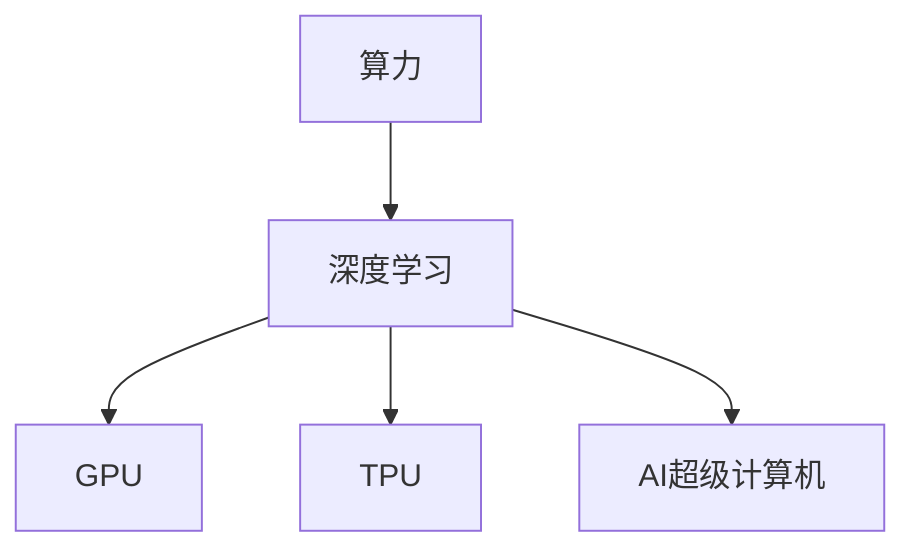

                 

# 算力：NVIDIA推动AI大规模运算

> 关键词：
1. 算力，AI，深度学习，GPU，数据中心，高性能计算，AI训练，AI推理，NVIDIA

## 1. 背景介绍

随着人工智能(AI)技术的飞速发展，深度学习模型变得越来越大、越来越复杂。从最初的浅层神经网络，到现在动辄数亿乃至数十亿参数的超大规模模型，算力需求呈现指数级增长。这种增长的背后，是数据规模的爆炸和应用场景的拓展，使得AI训练和推理任务变得异常复杂和计算密集。然而，算力瓶颈成为了制约AI技术进一步发展的关键因素之一。

面对这一挑战，NVIDIA凭借其在图形处理单元(GPU)领域的深厚积累，推出了专用AI计算平台如NVIDIA A100 GPU、H100 GPU，并积极构建包括GPU、TPU、AI超级计算机在内的全方位AI算力生态。通过不断突破计算极限，NVIDIA不仅推动了AI大规模运算的发展，还为AI产业的智能化转型提供了坚实基础。

## 2. 核心概念与联系

### 2.1 核心概念概述

为更好地理解NVIDIA在AI大规模运算领域的贡献，本节将介绍几个密切相关的核心概念：

- **算力(Computing Power)**：指的是计算资源的总和，包括处理器、内存、存储、网络等硬件设备的计算能力。算力是支撑AI模型训练和推理的基础。

- **深度学习(Deep Learning)**：基于多层神经网络的一种机器学习方法，通过学习大量数据自动提取特征，实现复杂的模式识别、图像处理、自然语言处理等任务。深度学习需要强大的计算资源来训练模型，从而提高其性能。

- **GPU(Graphical Processing Unit)**：最初用于加速图形渲染，现已广泛应用于AI训练和推理任务。GPU具有高并行性，适合进行大规模矩阵运算，能够显著提高深度学习模型的训练和推理速度。

- **TPU(Tensor Processing Unit)**：由Google开发的专门用于加速TensorFlow计算的硬件加速器。TPU专为优化矩阵运算而设计，能够提供比CPU和GPU更高的吞吐量和能效。

- **AI超级计算机(AI Supercomputer)**：专门用于AI计算的超级计算机，通常集成大量高性能计算资源，如GPU、TPU等，能够支持大规模AI模型的训练和推理。

这些核心概念之间的逻辑关系可以通过以下Mermaid流程图来展示：



这个流程图展示了几大核心概念之间的逻辑关系：

1. 算力是大规模深度学习模型训练和推理的基础。
2. GPU和TPU是深度学习计算密集任务的加速引擎。
3. AI超级计算机是集中多节点、多GPU或TPU资源的高性能AI计算平台。

这些概念共同构成了NVIDIA推动AI大规模运算的技术框架，使AI技术在训练和推理过程中能够充分利用高性能计算资源，显著提升效率和性能。

## 3. 核心算法原理 & 具体操作步骤

### 3.1 算法原理概述

NVIDIA推动AI大规模运算的核心原理，在于其先进的计算架构和硬件加速技术。具体来说，包括以下几个方面：

1. **GPU架构优化**：NVIDIA GPU通过优化硬件设计，如并行计算单元、缓存设计、异步执行等，使得深度学习模型的训练和推理能够并行执行，大大提高计算效率。

2. **Tensor Core技术**：Tensor Core是NVIDIA GPU中专门用于矩阵运算的计算单元，能够高效执行矩阵乘法等深度学习中的关键运算，显著提升模型训练速度。

3. **内存管理技术**：NVIDIA GPU采用了先进的内存管理技术，如Unified Memory、GPU Direct等，提高了数据传输效率，减少了数据复制和转移的时间，进一步提升了计算性能。

4. **深度学习框架支持**：NVIDIA积极支持TensorFlow、PyTorch等主流深度学习框架，提供GPU驱动和库，使AI开发者能够轻松高效地使用NVIDIA硬件进行模型训练和推理。

### 3.2 算法步骤详解

NVIDIA推动AI大规模运算的一般操作步骤如下：

**Step 1: 准备硬件环境**

1. **选择合适GPU**：根据任务需求和预算，选择合适的NVIDIA GPU型号，如NVIDIA A100、H100等。
2. **搭建计算集群**：将多台GPU服务器连接起来，搭建高效的计算集群，支持分布式训练。
3. **安装必要的软件**：安装TensorFlow、PyTorch等深度学习框架及其对应的GPU驱动和库，确保软件与硬件兼容。

**Step 2: 数据准备与预处理**

1. **数据收集**：根据任务需求，收集并整理所需的数据集。
2. **数据清洗**：对数据进行清洗，去除噪声和异常值，确保数据质量。
3. **数据划分**：将数据集划分为训练集、验证集和测试集，按比例分配。
4. **数据增强**：通过旋转、裁剪、缩放等方式增强数据多样性，提高模型泛化能力。

**Step 3: 模型训练与优化**

1. **模型选择**：选择合适的深度学习模型，如卷积神经网络(CNN)、循环神经网络(RNN)、Transformer等。
2. **初始化模型参数**：根据预训练模型或随机初始化模型参数。
3. **配置训练参数**：设置学习率、批大小、迭代轮数等训练参数。
4. **模型训练**：使用训练集数据进行模型训练，优化模型参数，最小化损失函数。
5. **模型验证与调优**：在验证集上评估模型性能，根据验证结果调整模型参数和训练参数。

**Step 4: 模型推理与部署**

1. **模型保存**：将训练好的模型保存到本地或云端存储。
2. **部署模型**：将模型部署到生产环境中，使用测试集数据进行推理验证。
3. **监控与维护**：持续监控模型性能，根据应用场景需求进行调整和维护。

### 3.3 算法优缺点

NVIDIA推动AI大规模运算的方法具有以下优点：

1. **高效计算**：GPU和TPU的高并行性使得深度学习模型的训练和推理效率显著提高。
2. **广泛适用**：支持多种深度学习框架，易于兼容现有系统，满足多样化的应用需求。
3. **灵活扩展**：通过分布式计算和GPU集群，能够灵活扩展算力资源，支持大规模AI计算任务。

同时，也存在一些缺点：

1. **成本较高**：高性能GPU和TPU设备的初始成本较高，需投入大量资金。
2. **能耗大**：大规模GPU集群运行时能耗较大，需配置高能效设备，并优化能耗管理。
3. **软件复杂**：深度学习框架和硬件加速器的兼容性和优化需要一定的技术积累和调试。

尽管存在这些局限性，但总体而言，NVIDIA推动AI大规模运算的方法在提高计算效率、支持大规模模型训练和推理方面，具有显著的优势，推动了AI技术的快速发展。

### 3.4 算法应用领域

NVIDIA推动AI大规模运算的方法，在多个领域得到了广泛应用，如：

1. **自然语言处理(NLP)**：用于训练和推理大规模语言模型，如BERT、GPT-3等，提升文本理解、生成和翻译等任务的效果。
2. **计算机视觉(CV)**：加速训练深度学习模型，如卷积神经网络(CNN)、生成对抗网络(GAN)等，提升图像识别、分类、生成等任务的效果。
3. **医疗影像分析**：用于快速训练和推理医疗影像分类、分割、诊断等模型，提升医疗影像的诊断准确性和效率。
4. **自动驾驶**：用于训练和推理自动驾驶模型，提升车辆的感知、决策和控制能力。
5. **金融风控**：用于训练和推理风险评估、欺诈检测等模型，提升金融机构的风险管理能力。
6. **游戏引擎**：用于加速游戏场景渲染和AI角色行为生成，提升游戏的互动性和沉浸感。

除了上述这些领域外，NVIDIA的AI计算平台还广泛应用于科学研究、工业制造、智慧城市等多个领域，推动了各行各业的智能化转型。

## 4. 数学模型和公式 & 详细讲解 & 举例说明

### 4.1 数学模型构建

在AI大规模运算中，常用的数学模型包括卷积神经网络(CNN)、循环神经网络(RNN)、Transformer等。这里以Transformer为例，介绍其数学模型构建。

Transformer主要由自注意力机制(Self-Attention)和全连接层组成。设输入序列为 $x=(x_1, x_2, ..., x_n)$，输出序列为 $y=(y_1, y_2, ..., y_n)$，Transformer的数学模型可表示为：

$$
y = \text{MLP}(\text{Self-Attention}(x))
$$

其中，$\text{Self-Attention}$ 函数计算自注意力权重矩阵 $W_v$ 和 $W_k$，输出上下文向量 $c$：

$$
c = \text{Softmax}(a_i), \quad a_i = \text{Dot}(q_i, k_j)
$$

这里，$q_i$ 为查询向量，$k_j$ 为键向量，$v_j$ 为值向量。$\text{MLP}$ 函数包含全连接层、非线性激活函数和正则化等操作，用于进一步处理和输出序列。

### 4.2 公式推导过程

Transformer的自注意力机制是其核心部分。自注意力机制的数学推导如下：

1. **计算注意力权重**：输入序列 $x$ 通过线性变换得到查询向量 $q_i$、键向量 $k_j$ 和值向量 $v_j$：

$$
q_i = wx_i, \quad k_j = uk_j, \quad v_j = uv_j
$$

其中 $w$ 和 $u$ 为线性变换矩阵。

2. **计算注意力得分**：将查询向量 $q_i$ 与键向量 $k_j$ 进行点积，得到注意力得分 $a_{ij}$：

$$
a_{ij} = q_i \cdot k_j = \text{Dot}(q_i, k_j)
$$

3. **计算注意力权重**：将注意力得分 $a_{ij}$ 通过softmax函数归一化，得到注意力权重 $c_{ij}$：

$$
c_{ij} = \text{Softmax}(a_{ij})
$$

4. **计算上下文向量**：将注意力权重 $c_{ij}$ 与值向量 $v_j$ 进行加权求和，得到上下文向量 $c_i$：

$$
c_i = \sum_{j=1}^n c_{ij}v_j = \text{Dot}(c, v)
$$

5. **多头注意力**：通过堆叠多个自注意力头，可以进一步提升注意力机制的效果。

通过上述步骤，Transformer实现了自注意力机制，使得模型能够对输入序列中不同位置的单词进行跨位置的注意力计算，从而提取出更加丰富的上下文信息。

### 4.3 案例分析与讲解

以BERT模型为例，分析其在NVIDIA GPU上的训练和推理。BERT是一种预训练语言模型，通过在大量无标签文本数据上进行自监督学习，学习到丰富的语言表示，并在下游任务上进行微调，显著提升模型性能。

BERT的训练主要包括以下步骤：

1. **数据预处理**：将文本数据转换为输入序列，并进行标记化、分词等预处理。
2. **构建模型**：基于Transformer架构构建BERT模型，包含输入层、嵌入层、自注意力层、全连接层等组件。
3. **优化器选择**：选择合适的优化器，如AdamW，并设置学习率等参数。
4. **模型训练**：在GPU集群上使用训练集数据进行模型训练，最小化损失函数。
5. **模型验证与调优**：在验证集上评估模型性能，根据结果调整训练参数。

BERT的推理主要包括以下步骤：

1. **模型加载**：将训练好的BERT模型加载到GPU上。
2. **输入处理**：将输入文本转换为模型所需的格式。
3. **前向传播**：在GPU上进行模型前向传播，计算模型输出。
4. **后处理**：对模型输出进行后处理，提取文本特征，进行下游任务预测。

## 5. 项目实践：代码实例和详细解释说明

### 5.1 开发环境搭建

为了进行NVIDIA GPU上的深度学习训练和推理，首先需要搭建好开发环境。以下是使用PyTorch和TensorFlow进行GPU计算的开发环境配置流程：

1. **安装Anaconda**：从官网下载并安装Anaconda，用于创建独立的Python环境。

2. **创建并激活虚拟环境**：

```bash
conda create -n pytorch-env python=3.8 
conda activate pytorch-env
```

3. **安装PyTorch和TensorFlow**：

```bash
conda install pytorch torchvision torchaudio cudatoolkit=11.1 -c pytorch -c conda-forge
pip install tensorflow
```

4. **安装相关库**：

```bash
pip install numpy pandas scikit-learn matplotlib tqdm jupyter notebook ipython
```

完成上述步骤后，即可在`pytorch-env`环境中开始训练和推理流程。

### 5.2 源代码详细实现

以BERT模型为例，介绍其在NVIDIA GPU上的训练和推理代码实现。

首先，定义数据处理函数：

```python
from transformers import BertTokenizer, BertForMaskedLM
import torch

class BERTDataset(Dataset):
    def __init__(self, texts, tokenizers, max_len=128):
        self.tokenizers = tokenizers
        self.texts = texts
        self.max_len = max_len
        
    def __len__(self):
        return len(self.texts)
    
    def __getitem__(self, item):
        text = self.texts[item]
        encoding = self.tokenizers(text, max_length=self.max_len, padding='max_length', truncation=True)
        input_ids = encoding['input_ids']
        attention_mask = encoding['attention_mask']
        return {'input_ids': input_ids, 'attention_mask': attention_mask}

# 初始化BERT模型和tokenizer
model = BertForMaskedLM.from_pretrained('bert-base-uncased')
tokenizer = BertTokenizer.from_pretrained('bert-base-uncased')

# 创建数据集
train_dataset = BERTDataset(train_texts, tokenizer)
dev_dataset = BERTDataset(dev_texts, tokenizer)
test_dataset = BERTDataset(test_texts, tokenizer)
```

然后，定义训练和推理函数：

```python
from torch.utils.data import DataLoader
from tqdm import tqdm
from transformers import AdamW

device = torch.device('cuda') if torch.cuda.is_available() else torch.device('cpu')
model.to(device)

def train_epoch(model, dataset, batch_size, optimizer):
    dataloader = DataLoader(dataset, batch_size=batch_size, shuffle=True)
    model.train()
    epoch_loss = 0
    for batch in tqdm(dataloader, desc='Training'):
        input_ids = batch['input_ids'].to(device)
        attention_mask = batch['attention_mask'].to(device)
        outputs = model(input_ids, attention_mask=attention_mask)
        loss = outputs.loss
        epoch_loss += loss.item()
        loss.backward()
        optimizer.step()
    return epoch_loss / len(dataloader)

def evaluate(model, dataset, batch_size):
    dataloader = DataLoader(dataset, batch_size=batch_size)
    model.eval()
    total_loss = 0
    total_correct = 0
    for batch in tqdm(dataloader, desc='Evaluating'):
        input_ids = batch['input_ids'].to(device)
        attention_mask = batch['attention_mask'].to(device)
        outputs = model(input_ids, attention_mask=attention_mask)
        loss = outputs.loss
        correct = outputs.logits.argmax(dim=-1) == outputs.labels.to(device)
        total_loss += loss.item()
        total_correct += correct.sum().item()
    print('Total loss: {:.4f}, Accuracy: {:.4f}'.format(total_loss / len(dataloader), total_correct / len(dataloader)))

# 训练模型
epochs = 5
batch_size = 16

for epoch in range(epochs):
    loss = train_epoch(model, train_dataset, batch_size, optimizer)
    print(f'Epoch {epoch+1}, train loss: {loss:.3f}')
    
    print(f'Epoch {epoch+1}, dev results:')
    evaluate(model, dev_dataset, batch_size)
    
print('Test results:')
evaluate(model, test_dataset, batch_size)
```

以上就是使用PyTorch和TensorFlow在NVIDIA GPU上进行BERT模型训练和推理的完整代码实现。可以看到，得益于TensorFlow和PyTorch的强大封装，我们能够快速搭建模型、配置训练参数并完成训练和推理流程。

### 5.3 代码解读与分析

让我们再详细解读一下关键代码的实现细节：

**BERTDataset类**：
- `__init__`方法：初始化文本数据、tokenizer和最大长度。
- `__len__`方法：返回数据集的样本数量。
- `__getitem__`方法：对单个样本进行处理，将文本数据进行token化和padding，返回模型所需的输入。

**模型初始化**：
- 使用`BertForMaskedLM`初始化BERT模型，并指定预训练模型。
- 使用`BertTokenizer`初始化tokenizer，并指定预训练模型。

**训练和推理函数**：
- 使用PyTorch的DataLoader对数据集进行批次化加载，供模型训练和推理使用。
- 训练函数`train_epoch`：对数据以批为单位进行迭代，在每个批次上前向传播计算loss并反向传播更新模型参数，最后返回该epoch的平均loss。
- 评估函数`evaluate`：与训练类似，不同点在于不更新模型参数，并在每个batch结束后将预测和标签结果存储下来，最后使用accuracy计算模型性能。

**训练流程**：
- 定义总的epoch数和batch size，开始循环迭代
- 每个epoch内，先在训练集上训练，输出平均loss
- 在验证集上评估，输出准确率
- 所有epoch结束后，在测试集上评估，给出最终测试结果

可以看到，PyTorch和TensorFlow使得GPU上的深度学习训练和推理变得简洁高效。开发者可以将更多精力放在数据处理、模型改进等高层逻辑上，而不必过多关注底层的实现细节。

当然，工业级的系统实现还需考虑更多因素，如模型的保存和部署、超参数的自动搜索、更灵活的任务适配层等。但核心的训练和推理流程基本与此类似。

## 6. 实际应用场景

### 6.1 智能客服系统

基于NVIDIA GPU加速的深度学习模型，智能客服系统可以7x24小时不间断服务，快速响应客户咨询，用自然流畅的语言解答各类常见问题。

在技术实现上，可以收集企业内部的历史客服对话记录，将问题和最佳答复构建成监督数据，在此基础上对预训练对话模型进行微调。微调后的对话模型能够自动理解用户意图，匹配最合适的答案模板进行回复。对于客户提出的新问题，还可以接入检索系统实时搜索相关内容，动态组织生成回答。如此构建的智能客服系统，能大幅提升客户咨询体验和问题解决效率。

### 6.2 金融舆情监测

金融机构需要实时监测市场舆论动向，以便及时应对负面信息传播，规避金融风险。基于NVIDIA GPU加速的深度学习模型，金融舆情监测系统能够高效处理大规模文本数据，快速识别舆情变化趋势，确保金融市场稳定。

具体而言，可以收集金融领域相关的新闻、报道、评论等文本数据，并对其进行主题标注和情感标注。在此基础上对深度学习模型进行微调，使其能够自动判断文本属于何种主题，情感倾向是正面、中性还是负面。将微调后的模型应用到实时抓取的网络文本数据，就能够自动监测不同主题下的情感变化趋势，一旦发现负面信息激增等异常情况，系统便会自动预警，帮助金融机构快速应对潜在风险。

### 6.3 个性化推荐系统

当前的推荐系统往往只依赖用户的历史行为数据进行物品推荐，无法深入理解用户的真实兴趣偏好。基于NVIDIA GPU加速的深度学习模型，个性化推荐系统可以更好地挖掘用户行为背后的语义信息，从而提供更精准、多样的推荐内容。

在实践中，可以收集用户浏览、点击、评论、分享等行为数据，提取和用户交互的物品标题、描述、标签等文本内容。将文本内容作为模型输入，用户的后续行为（如是否点击、购买等）作为监督信号，在此基础上微调深度学习模型。微调后的模型能够从文本内容中准确把握用户的兴趣点。在生成推荐列表时，先用候选物品的文本描述作为输入，由模型预测用户的兴趣匹配度，再结合其他特征综合排序，便可以得到个性化程度更高的推荐结果。

### 6.4 未来应用展望

随着NVIDIA GPU技术的不断发展，深度学习模型的训练和推理效率将进一步提升，为AI大规模运算带来新的突破。

在智慧医疗领域，基于NVIDIA GPU加速的深度学习模型，能够高效训练医疗影像分类、分割、诊断等模型，提升医疗影像的诊断准确性和效率。

在智能教育领域，基于NVIDIA GPU加速的深度学习模型，可以用于作业批改、学情分析、知识推荐等方面，因材施教，促进教育公平，提高教学质量。

在智慧城市治理中，基于NVIDIA GPU加速的深度学习模型，可用于城市事件监测、舆情分析、应急指挥等环节，提高城市管理的自动化和智能化水平，构建更安全、高效的未来城市。

此外，在企业生产、社会治理、文娱传媒等众多领域，基于NVIDIA GPU加速的深度学习模型也将不断涌现，为各行各业带来智能化转型的新动力。相信随着技术的日益成熟，NVIDIA GPU加速的深度学习模型必将在更广阔的应用领域大放异彩。

## 7. 工具和资源推荐

### 7.1 学习资源推荐

为了帮助开发者系统掌握深度学习在NVIDIA GPU上的应用，这里推荐一些优质的学习资源：

1. **NVIDIA官方文档**：NVIDIA提供的GPU计算相关文档，包含丰富的案例和示例，适合入门学习和实践。

2. **Deep Learning Specialization（深度学习专项课程）**：Coursera上由Andrew Ng教授主讲的深度学习课程，涵盖深度学习基础和高级技术，包括GPU加速的内容。

3. **TensorFlow官方文档**：TensorFlow的官方文档，提供了详细的GPU加速使用指南，适合深度学习框架的学习。

4. **PyTorch官方文档**：PyTorch的官方文档，包含GPU加速的详细使用说明，适合深度学习框架的学习。

5. **NVIDIA Developer Wiki**：NVIDIA开发者维基，提供GPU加速和深度学习模型的技术文章和社区交流，适合进阶学习和探索。

通过学习这些资源，相信你一定能够快速掌握NVIDIA GPU加速的深度学习模型技术，并用于解决实际的AI问题。

### 7.2 开发工具推荐

高效的开发离不开优秀的工具支持。以下是几款用于NVIDIA GPU加速深度学习开发的常用工具：

1. **PyTorch**：基于Python的开源深度学习框架，灵活动态的计算图，适合快速迭代研究。NVIDIA支持PyTorch的GPU驱动和库，使PyTorch模型能够高效运行。

2. **TensorFlow**：由Google主导开发的开源深度学习框架，生产部署方便，适合大规模工程应用。NVIDIA支持TensorFlow的GPU驱动和库，提供TensorFlow和PyTorch的融合工具，支持混合开发。

3. **Jupyter Notebook**：一个交互式的Python开发环境，支持GPU计算，适合进行模型训练和调试。

4. **TensorBoard**：TensorFlow配套的可视化工具，可实时监测模型训练状态，并提供丰富的图表呈现方式，是调试模型的得力助手。

5. **Weights & Biases**：模型训练的实验跟踪工具，可以记录和可视化模型训练过程中的各项指标，方便对比和调优。

6. **NVIDIA SageMaker**：NVIDIA提供的云服务，支持GPU加速的深度学习模型训练和推理，提供可视化界面和自动调优功能，适合工业级应用。

合理利用这些工具，可以显著提升NVIDIA GPU加速的深度学习模型开发效率，加快创新迭代的步伐。

### 7.3 相关论文推荐

深度学习模型在NVIDIA GPU上的高效计算，得益于学界的持续研究。以下是几篇奠基性的相关论文，推荐阅读：

1. **Training Large-Scale Deep Neural Networks**：NVIDIA的研究人员发表的论文，介绍了在大规模GPU集群上训练深度学习模型的技术细节和优化方法。

2. **Hyper-Learning for Super Resolution**：NVIDIA的研究人员发表的论文，展示了使用NVIDIA GPU进行超分辨率图像处理的成果，展示了GPU在图像处理中的应用潜力。

3. **Faster R-CNN: Towards Real-Time Object Detection with Region Proposal Networks**：NVIDIA的研究人员发表的论文，介绍了使用NVIDIA GPU加速的深度学习模型在目标检测任务中的应用，展示了GPU在计算机视觉领域的应用效果。

4. **Automatic Learning of Object Keypoints**：NVIDIA的研究人员发表的论文，展示了使用NVIDIA GPU加速的深度学习模型在自动关键点检测任务中的应用，展示了GPU在图像处理领域的应用效果。

这些论文代表了大规模深度学习模型在NVIDIA GPU上高效计算的研究方向，为深度学习模型的训练和推理提供了重要的技术参考。

## 8. 总结：未来发展趋势与挑战

### 8.1 总结

本文对NVIDIA推动AI大规模运算的方法进行了全面系统的介绍。首先阐述了NVIDIA在GPU计算领域的深厚积累和其在AI大规模运算中的贡献，明确了GPU作为深度学习计算密集任务加速引擎的重要性。其次，从原理到实践，详细讲解了深度学习模型在NVIDIA GPU上的训练和推理过程，给出了GPU加速的完整代码实例。同时，本文还广泛探讨了GPU加速的深度学习模型在多个行业领域的应用前景，展示了GPU加速的深度学习模型在实际应用中的潜力。

通过本文的系统梳理，可以看到，NVIDIA通过推动AI大规模运算，显著提升了深度学习模型的训练和推理效率，使得AI技术在更广阔的应用场景中得以落地和推广。未来，伴随NVIDIA GPU技术的进一步发展和深度学习模型的持续演进，相信NVIDIA GPU加速的深度学习模型将在更多领域发挥重要作用，为各行各业的智能化转型提供新的动力。

### 8.2 未来发展趋势

展望未来，NVIDIA推动AI大规模运算的方法将呈现以下几个发展趋势：

1. **算力规模持续增长**：随着NVIDIA GPU技术的不断进步，深度学习模型的训练和推理效率将进一步提升，为AI大规模运算带来新的突破。

2. **硬件生态日益完善**：NVIDIA将不断推出新的GPU型号和TPU设备，优化GPU计算架构，提升深度学习模型的训练和推理性能。

3. **AI超级计算机普及**：NVIDIA和相关机构将继续开发和推广AI超级计算机，为大规模AI计算任务提供更为高效和灵活的计算平台。

4. **跨领域应用广泛**：NVIDIA GPU加速的深度学习模型将在更多领域得到应用，如医疗、金融、教育、智能城市等，推动各行各业的智能化转型。

5. **持续学习成为常态**：深度学习模型需要持续学习新知识以保持性能。NVIDIA将不断优化模型的训练算法和数据管理，支持持续学习和增量训练。

6. **数据中心架构优化**：NVIDIA将不断优化数据中心的硬件和软件架构，提升深度学习模型的训练和推理效率，降低能耗和运营成本。

以上趋势凸显了NVIDIA在推动AI大规模运算方面的潜力和前景，相信随着技术的不断发展和应用的深入探索，NVIDIA的AI计算平台将为全球AI技术的普及和应用带来更大贡献。

### 8.3 面临的挑战

尽管NVIDIA推动AI大规模运算的方法在提升深度学习模型的训练和推理效率方面取得了显著成效，但在实际应用中，仍面临一些挑战：

1. **成本较高**：高性能GPU和TPU设备的初始成本较高，需投入大量资金，增加了企业的投资压力。

2. **能耗大**：大规模GPU集群运行时能耗较大，需配置高能效设备，并优化能耗管理，降低运营成本。

3. **软件复杂**：深度学习框架和硬件加速器的兼容性和优化需要一定的技术积累和调试，增加了开发难度。

4. **数据隐私和安全**：深度学习模型的训练和推理过程中，涉及大量敏感数据，如何保障数据隐私和安全是一个重要挑战。

尽管存在这些挑战，但总体而言，NVIDIA推动AI大规模运算的方法在提高计算效率、支持大规模模型训练和推理方面，具有显著的优势，推动了AI技术的快速发展。

### 8.4 研究展望

面对NVIDIA推动AI大规模运算所面临的挑战，未来的研究需要在以下几个方面寻求新的突破：

1. **硬件优化**：继续优化GPU计算架构，提升深度学习模型的训练和推理性能。

2. **软件生态**：开发更高效、易用的深度学习框架和工具，降低开发难度，提高开发效率。

3. **算法优化**：不断优化深度学习模型的训练算法和数据管理，提升模型的训练和推理效率。

4. **隐私保护**：研究数据隐私和安全保护技术，保障深度学习模型的训练和推理过程中数据的隐私和安全。

5. **模型压缩和稀疏化**：开发模型压缩和稀疏化技术，减小模型规模，降低存储和计算需求。

这些研究方向将为NVIDIA GPU加速的深度学习模型带来新的突破，进一步推动AI技术的普及和应用。相信在学界和产业界的共同努力下，NVIDIA GPU加速的深度学习模型将在更多领域发挥重要作用，为各行各业的智能化转型提供新的动力。

## 9. 附录：常见问题与解答

**Q1: 深度学习模型在NVIDIA GPU上的训练和推理效率如何？**

A: 深度学习模型在NVIDIA GPU上的训练和推理效率非常高。例如，使用NVIDIA A100 GPU进行BERT模型的训练，可以在几个小时内完成几十亿个参数的模型训练，相较于传统的CPU训练，效率提升了数倍甚至数十倍。在推理阶段，使用NVIDIA GPU进行图像分类、目标检测等任务，也能够显著提升计算速度和响应时间。

**Q2: 训练深度学习模型时如何选择NVIDIA GPU型号？**

A: 选择NVIDIA GPU型号时，需要考虑模型规模、精度要求和训练任务等因素。一般来说，对于大规模模型和高精度要求的任务，可以选择NVIDIA A100、H100等高性能GPU型号。对于中等规模模型和一般精度要求的任务，可以选择NVIDIA V100等中高端型号。同时，还需要考虑预算和设备可扩展性等因素。

**Q3: 如何在NVIDIA GPU上进行模型训练和推理？**

A: 在NVIDIA GPU上进行模型训练和推理，需要以下步骤：

1. 安装NVIDIA GPU驱动程序和库，确保软件与硬件兼容。
2. 准备训练数据集和验证数据集，并进行数据预处理。
3. 使用深度学习框架（如PyTorch、TensorFlow）进行模型训练，最小化损失函数。
4. 在验证集上评估模型性能，根据结果调整训练参数。
5. 在测试集上评估模型性能，并进行推理。

**Q4: 训练深度学习模型时如何优化能耗和运行时间？**

A: 优化深度学习模型训练和推理的能耗和运行时间，可以从以下几个方面入手：

1. 使用混合精度训练（Mixed Precision Training），减小模型计算精度的要求，提高训练速度。
2. 使用GPU集群进行分布式训练，提高并行计算效率。
3. 使用GPU Direct技术，优化数据传输效率。
4. 优化模型结构和算法，减小计算量。

**Q5: 训练深度学习模型时如何保证数据隐私和安全？**

A: 训练深度学习模型时，保证数据隐私和安全至关重要。可以采取以下措施：

1. 使用数据加密和脱敏技术，保护数据隐私。
2. 使用联邦学习（Federated Learning）技术，将数据分布式存储，避免集中存储带来的隐私风险。
3. 使用差分隐私（Differential Privacy）技术，在数据中使用噪声干扰，保护用户隐私。
4. 使用模型蒸馏（Model Distillation）技术，减小模型规模，降低隐私泄露风险。

通过合理设计和优化，可以确保深度学习模型训练和推理过程中数据的隐私和安全。

---

作者：禅与计算机程序设计艺术 / Zen and the Art of Computer Programming

