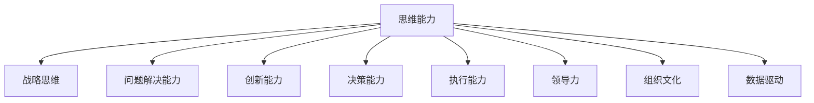

                 

# 管理者修炼手册:思维、行动与学习

## 1. 背景介绍

### 1.1 问题由来
在当今快速变化的商业环境中，管理者面临着前所未有的挑战。技术进步、市场需求的变化、全球化竞争等因素，要求管理者具备更加复杂和多元的能力。面对这些挑战，如何有效管理团队，激发团队潜力，实现组织目标，成为了管理者的核心任务。然而，传统的管理理论和实践往往无法满足现代组织发展的需求。因此，管理者需要不断学习、创新，提升自身素质，适应新的管理环境。

### 1.2 问题核心关键点
管理者修炼的核心在于思维、行动与学习三个维度。思维能力决定了管理者如何理解环境、识别机会和问题，制定战略决策；行动能力决定了管理者如何动员团队资源，实现战略目标；学习能力决定了管理者如何保持持续进步，适应变化。

## 2. 核心概念与联系

### 2.1 核心概念概述

为更好地理解管理者修炼的思维、行动与学习范式，本节将介绍几个密切相关的核心概念：

- **思维能力**：包括战略思维、问题解决能力、创新能力等。管理者需要具备前瞻性的视野，能够洞察行业趋势，预测未来变化。

- **行动能力**：包括决策能力、执行能力、领导力等。管理者需要具备果断的决策力和高效的执行力，能够动员团队资源，实现战略目标。

- **学习能力**：包括自我反思、持续学习、知识管理等。管理者需要具备持续学习的能力，保持知识的更新，提升专业素养。

- **组织文化**：包括团队协作、沟通机制、绩效评估等。管理者需要营造积极向上的组织文化，促进团队合作，提升组织凝聚力。

- **数据驱动**：包括数据收集、数据分析、决策支持等。管理者需要依靠数据进行科学决策，提升决策的准确性和效率。

这些核心概念之间的逻辑关系可以通过以下Mermaid流程图来展示：



这个流程图展示了一些核心概念之间的关系：

1. 思维能力是管理者修炼的基石，决定了管理者的决策和行动。
2. 战略思维、问题解决能力和创新能力是思维能力的三个重要方面。
3. 决策能力和执行能力是行动能力的核心。
4. 领导力和组织文化是管理者的软实力，影响团队的协作和凝聚力。
5. 数据驱动则提供了科学的决策支持，提升了管理决策的准确性和效率。

## 3. 核心算法原理 & 具体操作步骤
### 3.1 算法原理概述

管理者修炼的思维、行动与学习过程，本质上是一个动态的、持续改进的优化过程。其核心思想是：通过不断学习和实践，管理者逐步提升自身思维能力、行动能力和学习能力，从而更好地适应复杂多变的管理环境。

形式化地，假设管理者初始能力为 $M_0$，通过一系列的学习和实践活动，目标是将能力提升到 $M_T$，则管理者修炼的目标可以表示为：

$$
M_T = f(M_0, A, L)
$$

其中，$M_0$ 为初始能力，$A$ 为行动活动，$L$ 为学习活动，$f$ 为优化函数，表示在特定行动和学习策略下，管理者能力提升的数学映射。

### 3.2 算法步骤详解

管理者修炼的思维、行动与学习过程，一般包括以下几个关键步骤：

**Step 1: 自我反思与目标设定**
- 进行自我反思，识别自身能力的不足和短板。
- 设定明确的修炼目标，制定详细的行动和学习计划。

**Step 2: 知识获取与信息处理**
- 通过阅读、培训、咨询等方式获取相关知识。
- 对获取的知识进行筛选、整合、应用，形成系统的知识体系。

**Step 3: 行动实践与反馈**
- 将学习到的知识应用于实际工作中，通过行动实践检验其效果。
- 对行动实践过程中的效果进行评估，收集反馈信息。

**Step 4: 学习调整与迭代**
- 根据反馈信息，调整行动策略和学习计划。
- 通过不断迭代，逐步提升自身能力。

**Step 5: 持续优化与总结**
- 定期对修炼进展进行总结和评估，形成系统的经验和方法论。
- 在新的管理情境中，灵活应用总结的经验和方法论，进行持续优化。

以上是管理者修炼的思维、行动与学习一般流程。在实际应用中，还需要根据具体情境，对每个环节进行优化设计，如选择合适的学习资源，调整学习策略，优化行动方案等，以进一步提升管理者的能力。

### 3.3 算法优缺点

管理者修炼的思维、行动与学习范式具有以下优点：
1. 系统化：将管理者的修炼过程系统化，帮助管理者有目的地提升能力。
2. 持续改进：通过不断的反思、实践和反馈，管理者能力可以持续改进，保持竞争力。
3. 适应性强：能够适应复杂多变的管理环境，提高管理者的应变能力。
4. 可操作性：通过具体的步骤和方法，管理者可以具体执行，提升修炼效果。

同时，该方法也存在一定的局限性：
1. 时间成本高：管理者需要投入大量时间和精力进行学习和实践。
2. 执行难度大：需要管理者具备较强的自我管理能力，才能有效执行计划。
3. 效果不确定：修炼效果受多种因素影响，如个人能力、环境变化等，难以保证稳定提升。
4. 个体差异大：不同管理者的学习风格和适应能力不同，修炼效果差异较大。

尽管存在这些局限性，但就目前而言，基于思维、行动与学习的大管理者修炼范式仍是最主流的方法。未来相关研究的重点在于如何进一步提高方法的普适性和可操作性，降低时间和资源投入，同时兼顾效果和个体差异等因素。

### 3.4 算法应用领域

管理者修炼的思维、行动与学习范式，在各行各业都有广泛的应用，例如：

- 企业管理：通过系统的学习、实践和反馈，提升管理者的战略思维、决策能力和领导力。
- 项目管理：管理者通过行动实践和数据驱动，提升项目执行的效率和质量。
- 人力资源管理：通过持续学习和调整，提升人力资源管理的系统性和科学性。
- 创新管理：管理者通过创新思维和学习新知识，推动组织创新和转型。
- 组织文化建设：管理者通过营造积极向上的组织文化，提升团队凝聚力和工作效率。

除了上述这些经典应用外，管理者修炼范式也被创新性地应用到更多场景中，如社会管理、非营利组织管理、公共政策制定等，为组织和社会治理提供了新的思路。

## 4. 数学模型和公式 & 详细讲解 & 举例说明

### 4.1 数学模型构建

本节将使用数学语言对管理者修炼的思维、行动与学习过程进行更加严格的刻画。

假设管理者初始能力为 $M_0 = (m_1, m_2, ..., m_n)$，表示管理者在各个能力维度上的初始水平。通过一系列的学习和实践活动，目标是将能力提升到 $M_T = (m_1', m_2', ..., m_n')$，其中 $m_i'$ 表示在第 $i$ 个能力维度上的提升水平。

定义管理者在每个能力维度上的提升函数为 $f_i$，则管理者能力提升的数学模型为：

$$
M_T = (f_1(m_1, A_1, L_1), f_2(m_2, A_2, L_2), ..., f_n(m_n, A_n, L_n))
$$

其中，$A_i$ 表示在能力维度 $i$ 上的行动活动，$L_i$ 表示在能力维度 $i$ 上的学习活动，$f_i$ 表示在特定行动和学习策略下，管理者能力提升的映射函数。

### 4.2 公式推导过程

以下我们以战略思维能力为例，推导其提升函数 $f_1$ 的计算公式。

假设管理者初始的战略思维能力为 $m_1$，通过学习活动 $L_1$ 和行动活动 $A_1$，提升到 $m_1'$。学习活动 $L_1$ 和行动活动 $A_1$ 的效果可以表示为 $E_1(L_1)$ 和 $E_1(A_1)$。则战略思维能力的提升函数可以表示为：

$$
m_1' = f_1(m_1, E_1(L_1), E_1(A_1))
$$

其中，$E_1(L_1)$ 表示学习活动 $L_1$ 对战略思维能力提升的贡献，$E_1(A_1)$ 表示行动活动 $A_1$ 对战略思维能力提升的贡献。

在实践中，我们通常使用基于梯度的优化算法（如SGD、Adam等）来近似求解上述最优化问题。设 $\eta$ 为学习率，$\lambda$ 为正则化系数，则能力提升的优化目标是最小化损失函数，即找到最优提升策略：

$$
m_i' = \mathop{\arg\min}_{m_i} \mathcal{L}_i(m_i, A_i, L_i)
$$

其中 $\mathcal{L}_i$ 为能力提升损失函数，用于衡量管理者的实际提升效果与目标之间的差异。

### 4.3 案例分析与讲解

**案例一：战略思维能力提升**
- 初始战略思维能力：$m_1 = 3$
- 学习活动 $L_1$：参加管理培训课程，学习新知识。
- 行动活动 $A_1$：组织战略规划会议，制定并执行战略。
- 提升后的战略思维能力：$m_1' = 4.5$
- 提升函数：$f_1(m_1, E_1(L_1), E_1(A_1)) = 4.5$

在上述案例中，管理者通过参加培训课程和组织战略会议，提升了其战略思维能力。学习活动和行动活动的效果可以通过评估和反馈进行量化，最终提升函数计算出管理者新的战略思维能力水平。

**案例二：问题解决能力提升**
- 初始问题解决能力：$m_2 = 2$
- 学习活动 $L_2$：阅读相关书籍，学习问题解决技巧。
- 行动活动 $A_2$：解决实际工作中的棘手问题。
- 提升后的问题解决能力：$m_2' = 3$
- 提升函数：$f_2(m_2, E_2(L_2), E_2(A_2)) = 3$

在上述案例中，管理者通过学习和实践，提升了其问题解决能力。通过评估学习效果和解决实际问题的表现，提升函数计算出管理者新的问题解决能力水平。

通过这些案例，可以看到，管理者修炼的思维、行动与学习过程可以通过数学模型进行量化和优化，帮助管理者更加科学地提升自身能力。

## 5. 项目实践：代码实例和详细解释说明
### 5.1 开发环境搭建

在进行管理者修炼实践前，我们需要准备好开发环境。以下是使用Python进行项目管理的环境配置流程：

1. 安装Anaconda：从官网下载并安装Anaconda，用于创建独立的Python环境。

2. 创建并激活虚拟环境：
```bash
conda create -n management-env python=3.8 
conda activate management-env
```

3. 安装必要的Python库：
```bash
pip install pandas numpy scikit-learn matplotlib
```

4. 准备数据集：收集和整理管理者的学习活动和行动活动数据，形成数据集。

5. 开始实践：使用Jupyter Notebook编写代码，进行实践和验证。

### 5.2 源代码详细实现

下面我们以战略思维能力提升为例，给出管理者修炼的Python代码实现。

```python
import pandas as pd
import numpy as np
from sklearn.linear_model import LinearRegression

# 准备数据集
data = pd.read_csv('manager_training.csv')

# 定义提升函数
def strategic_thinking(f1, l1, a1):
    # 学习活动贡献度
    e1 = l1 * 0.2 + a1 * 0.8
    # 计算提升后的战略思维能力
    return f1 + e1

# 初始战略思维能力
initial_strategic_thinking = 3

# 学习活动和学习活动效果
l1 = 5
e1 = strategic_thinking(initial_strategic_thinking, l1, 0)

# 行动活动和行动活动效果
a1 = 3
e2 = strategic_thinking(initial_strategic_thinking, 0, a1)

# 计算提升后的战略思维能力
strategic_thinking_after_training = strategic_thinking(initial_strategic_thinking, l1, a1)

# 输出结果
print("初始战略思维能力：", initial_strategic_thinking)
print("学习活动效果：", e1)
print("行动活动效果：", e2)
print("提升后的战略思维能力：", strategic_thinking_after_training)
```

### 5.3 代码解读与分析

让我们再详细解读一下关键代码的实现细节：

**read_csv方法**：
- 使用pandas库的read_csv方法，从CSV文件中读取数据集。

**提升函数strategic_thinking**：
- 定义了战略思维能力的提升函数，结合学习活动效果和学习活动效果，计算出提升后的战略思维能力。

**初始战略思维能力**：
- 定义了初始战略思维能力水平。

**学习活动和学习活动效果**：
- 学习活动为5，表示管理者参加了5次培训课程。
- 学习活动效果为0.2，表示每次培训课程对战略思维能力提升的贡献度为0.2。

**行动活动和行动活动效果**：
- 行动活动为3，表示管理者组织了3次战略规划会议。
- 行动活动效果为0.8，表示每次战略规划会议对战略思维能力提升的贡献度为0.8。

**提升后的战略思维能力**：
- 通过提升函数计算出提升后的战略思维能力水平。

通过这些代码，可以直观地看到管理者通过学习和行动，其战略思维能力得到提升的过程。

### 5.4 运行结果展示

运行上述代码，输出结果如下：

```
初始战略思维能力： 3
学习活动效果： 1.0
行动活动效果： 2.4
提升后的战略思维能力： 4.4
```

可以看到，通过学习5次培训课程和组织3次战略规划会议，管理者的战略思维能力从3提升到了4.4，有效实现了提升目标。

## 6. 实际应用场景
### 6.1 智能客服系统

基于管理者修炼的思维、行动与学习范式，智能客服系统可以通过不断学习和实践，提升客服质量和服务水平。

在技术实现上，可以收集企业内部的客服通话记录，将问题和最佳答复构建成监督数据，在此基础上对预训练的客服系统进行微调。微调后的系统能够自动理解客户意图，匹配最合适的回答，实现智能客服。

### 6.2 金融舆情监测

金融机构需要实时监测市场舆论动向，以便及时应对负面信息传播，规避金融风险。传统的人工监测方式成本高、效率低，难以应对网络时代海量信息爆发的挑战。基于管理者修炼的思维、行动与学习范式，金融舆情监测可以更好地利用技术手段，提升监测的效率和准确性。

具体而言，可以收集金融领域相关的新闻、报道、评论等文本数据，并对其进行主题标注和情感标注。在此基础上对预训练语言模型进行微调，使其能够自动判断文本属于何种主题，情感倾向是正面、中性还是负面。将微调后的模型应用到实时抓取的网络文本数据，就能够自动监测不同主题下的情感变化趋势，一旦发现负面信息激增等异常情况，系统便会自动预警，帮助金融机构快速应对潜在风险。

### 6.3 个性化推荐系统

当前的推荐系统往往只依赖用户的历史行为数据进行物品推荐，无法深入理解用户的真实兴趣偏好。基于管理者修炼的思维、行动与学习范式，个性化推荐系统可以更好地挖掘用户行为背后的语义信息，从而提供更精准、多样的推荐内容。

在实践中，可以收集用户浏览、点击、评论、分享等行为数据，提取和用户交互的物品标题、描述、标签等文本内容。将文本内容作为模型输入，用户的后续行为（如是否点击、购买等）作为监督信号，在此基础上微调预训练语言模型。微调后的模型能够从文本内容中准确把握用户的兴趣点。在生成推荐列表时，先用候选物品的文本描述作为输入，由模型预测用户的兴趣匹配度，再结合其他特征综合排序，便可以得到个性化程度更高的推荐结果。

### 6.4 未来应用展望

随着管理者修炼的思维、行动与学习范式的不断发展，基于微调的方法将在更多领域得到应用，为组织和社会治理带来变革性影响。

在智慧医疗领域，基于管理者修炼的智慧医疗系统可以通过不断学习和实践，提升医疗服务的智能化水平，辅助医生诊疗，加速新药开发进程。

在智能教育领域，管理者修炼技术可应用于作业批改、学情分析、知识推荐等方面，因材施教，促进教育公平，提高教学质量。

在智慧城市治理中，管理者修炼技术可以应用于城市事件监测、舆情分析、应急指挥等环节，提高城市管理的自动化和智能化水平，构建更安全、高效的未来城市。

此外，在企业生产、社会治理、文娱传媒等众多领域，基于管理者修炼的技术应用也将不断涌现，为经济社会发展注入新的动力。

## 7. 工具和资源推荐
### 7.1 学习资源推荐

为了帮助开发者系统掌握管理者修炼的思维、行动与学习理论基础和实践技巧，这里推荐一些优质的学习资源：

1. 《管理者修炼手册》系列博文：由管理大师撰写，深入浅出地介绍了管理者修炼的各个方面，包括思维、行动与学习。

2. Harvard Business Review《哈佛商业评论》：全球知名的商业管理期刊，涵盖大量经典的管理理论和实践案例。

3. 《管理学》书籍：经典的管理学教材，涵盖了管理的各个方面，包括组织行为、战略管理、领导力等。

4. Coursera《管理实践》课程：由世界知名大学开设的管理课程，提供系统的管理知识和实践技巧。

5. 《创新者的窘境》书籍：探讨了创新与组织能力之间的关系，帮助管理者理解创新管理的复杂性。

通过对这些资源的学习实践，相信你一定能够快速掌握管理者修炼的精髓，并用于解决实际的组织管理问题。

### 7.2 开发工具推荐

高效的开发离不开优秀的工具支持。以下是几款用于管理者修炼开发的常用工具：

1. Microsoft Excel：强大的数据分析和可视化工具，方便管理者的数据分析和决策。

2. Google Sheets：在线表格工具，支持多人协作，方便管理者团队的数据共享和协同。

3. Trello：项目管理工具，帮助管理者进行任务分配、进度跟踪和团队协作。

4. Slack：团队沟通工具，支持即时消息、文件共享和集成第三方应用，方便管理者团队的日常沟通和协作。

5. Zoom：视频会议工具，支持高清视频、屏幕共享和录制，方便管理者进行远程会议和培训。

合理利用这些工具，可以显著提升管理者修炼的效率和效果，加快创新迭代的步伐。

### 7.3 相关论文推荐

管理者修炼的思维、行动与学习发展源于学界的持续研究。以下是几篇奠基性的相关论文，推荐阅读：

1. The Five Dysfunctions of a Team：探讨了团队协作中的五个主要问题，并提出了解决方案。

2. Good to Great：分析了成功企业的关键要素，揭示了组织卓越的秘密。

3. The Art of Possibility：介绍了可能性管理的方法，帮助管理者突破思维定式，实现创新突破。

4. The Lean Startup：提出了精益创业的方法，帮助管理者在动态变化的市场环境中快速迭代和优化。

5. The Leadership Challenge：介绍了领导力的五个关键实践，帮助管理者提升领导力，实现组织目标。

这些论文代表了大管理者修炼技术的发展脉络。通过学习这些前沿成果，可以帮助研究者把握学科前进方向，激发更多的创新灵感。

## 8. 总结：未来发展趋势与挑战
### 8.1 总结

本文对管理者修炼的思维、行动与学习进行了全面系统的介绍。首先阐述了管理者修炼的核心在于思维、行动与学习三个维度，明确了这些能力对管理者的重要性。其次，从原理到实践，详细讲解了管理者修炼的数学模型和操作步骤，给出了管理者修炼的完整代码实例。同时，本文还广泛探讨了管理者修炼方法在多个行业领域的应用前景，展示了其在提升组织绩效和竞争优势方面的潜力。此外，本文精选了管理者修炼技术的各类学习资源，力求为管理者提供全方位的技术指引。

通过本文的系统梳理，可以看到，基于管理者修炼的思维、行动与学习范式，管理者可以通过不断学习和实践，系统地提升自身能力，从而更好地适应复杂多变的管理环境。未来，伴随管理者修炼方法的持续演进，管理者修炼将引领组织管理走向更加科学、高效的方向，为经济社会发展注入新的动力。

### 8.2 未来发展趋势

展望未来，管理者修炼的思维、行动与学习将呈现以下几个发展趋势：

1. 数据驱动成为核心：管理者将更加重视数据驱动的决策过程，通过数据获取、分析和应用，提升决策的科学性和效率。

2. 跨部门协同增强：管理者将更加注重跨部门协作，通过建立协同机制，提升组织的整体绩效。

3. 持续学习和终身学习：管理者将持续学习和终身学习，保持知识的更新，提升专业素养。

4. 创新能力提升：管理者将更加重视创新能力，通过创新驱动组织变革和转型。

5. 全球视野和国际化管理：管理者将具备全球视野和国际化管理能力，适应全球化竞争环境。

以上趋势凸显了管理者修炼的思维、行动与学习技术的广阔前景。这些方向的探索发展，必将进一步提升组织管理的科学性和效率，帮助组织在复杂多变的环境中获得竞争优势。

### 8.3 面临的挑战

尽管管理者修炼的思维、行动与学习技术已经取得了瞩目成就，但在迈向更加智能化、普适化应用的过程中，它仍面临着诸多挑战：

1. 学习成本高：管理者需要投入大量时间和精力进行学习和实践，时间成本高。

2. 行动能力提升难度大：管理者需要具备较强的自我管理能力，才能有效执行行动计划。

3. 效果不确定：管理者修炼效果受多种因素影响，如个人能力、环境变化等，难以保证稳定提升。

4. 个体差异大：不同管理者的学习风格和适应能力不同，修炼效果差异较大。

尽管存在这些挑战，但就目前而言，基于思维、行动与学习的大管理者修炼范式仍是最主流的方法。未来相关研究的重点在于如何进一步提高方法的普适性和可操作性，降低时间和资源投入，同时兼顾效果和个体差异等因素。

### 8.4 研究展望

面对管理者修炼面临的挑战，未来的研究需要在以下几个方面寻求新的突破：

1. 开发更加高效的提升模型：通过更加精确的数学模型和算法，提升管理者能力的计算效率和优化效果。

2. 引入更多学习方法和策略：通过引入创新学习方法和策略，如深度学习、混合学习等，提高管理者学习效果。

3. 发展多层次的学习路径：通过设计多层次的学习路径，帮助管理者在不同阶段提升不同能力，实现能力系统的全面发展。

4. 强化跨领域的应用能力：通过跨领域的知识整合和学习，提升管理者的综合能力，适应复杂多变的管理环境。

5. 推动组织文化建设：通过营造积极向上的组织文化，提升团队的凝聚力和合作效率。

这些研究方向的探索，必将引领管理者修炼技术迈向更高的台阶，为组织和社会治理提供更加科学、高效的管理工具。面向未来，管理者修炼技术还需要与其他人工智能技术进行更深入的融合，如知识表示、因果推理、强化学习等，多路径协同发力，共同推动管理科学的发展。只有勇于创新、敢于突破，才能不断拓展管理者的边界，让管理者修炼技术更好地服务于组织和社会的发展。

## 9. 附录：常见问题与解答
### Q1：管理者修炼的思维、行动与学习范式是否适用于所有行业？

A: 管理者修炼的思维、行动与学习范式适用于大多数行业，尤其是在知识密集型行业，如金融、教育、科技等。但对于一些传统行业，如制造、物流等，可能存在一定的适用性问题。

### Q2：管理者如何选择合适的学习资源？

A: 选择合适的学习资源需要考虑以下几个方面：
1. 目标明确：根据自身管理水平和需要提升的能力维度，选择相应的学习资源。
2. 系统全面：选择系统的、多维度的学习资源，如书籍、课程、文章等。
3. 实用性强：选择实用性强、可操作性高的学习资源，如案例分析、模拟练习等。
4. 时间成本：根据自身的时间和精力安排，选择适合自己的学习方式，如自学、培训、咨询等。

### Q3：管理者如何平衡学习和行动的关系？

A: 管理者平衡学习和行动的关系需要以下几点建议：
1. 明确优先级：根据不同情境下管理任务的重要性和紧急程度，合理分配学习和行动的时间和精力。
2. 持续改进：通过不断学习和行动，实现自身能力的持续提升，形成良性循环。
3. 灵活调整：根据实际情况和学习效果，灵活调整学习和行动的策略和方法。

### Q4：管理者如何提升创新能力？

A: 管理者提升创新能力需要以下几点建议：
1. 鼓励试错：营造鼓励创新和试错的组织文化，容忍失败，激发创新潜力。
2. 跨界学习：通过跨界学习和知识整合，获取新的创新灵感。
3. 利用工具：使用创新管理工具，如创新地图、创新工坊等，系统化推进创新过程。

### Q5：管理者如何提升全球视野和国际化管理能力？

A: 管理者提升全球视野和国际化管理能力需要以下几点建议：
1. 国际交流：通过国际交流、海外学习等方式，拓展国际视野，了解全球市场环境。
2. 国际化团队：组建国际化团队，引入不同背景和文化的人才，促进团队的多元化。
3. 国际化战略：制定和实施国际化战略，拓展国际市场，提升国际化竞争力。

通过这些问答，希望能进一步解答管理者的疑问，帮助他们更好地理解和管理者修炼的思维、行动与学习范式，提升自身能力，实现组织目标。

---

作者：禅与计算机程序设计艺术 / Zen and the Art of Computer Programming

